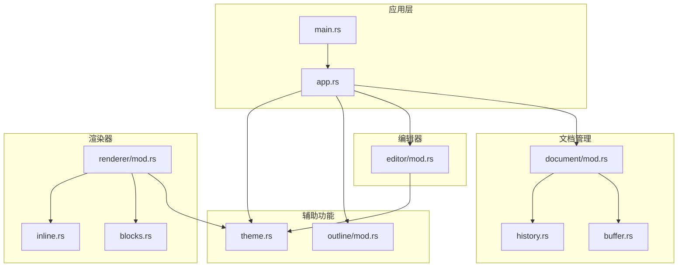
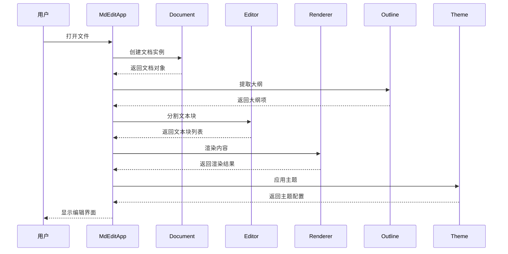
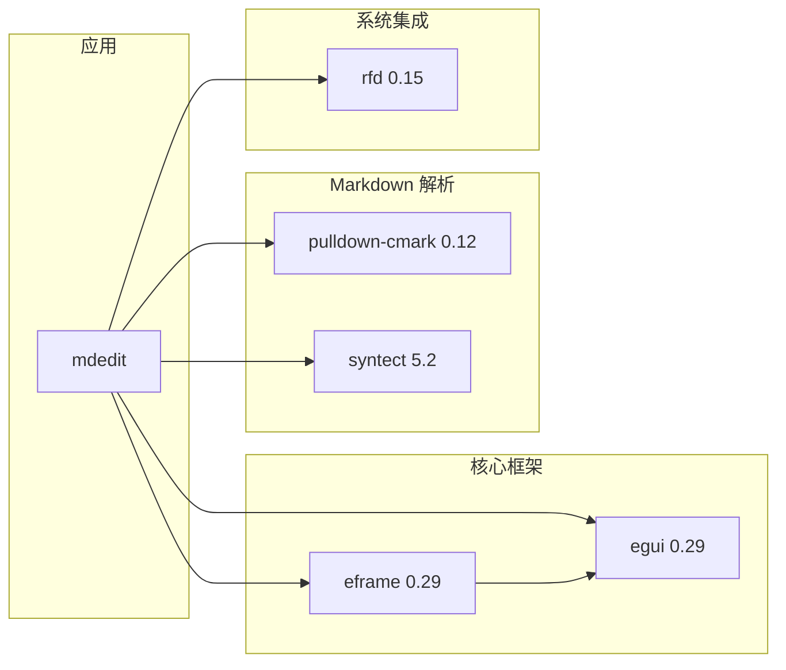

# API 参考文档

<cite>
**本文档引用的文件**
- [main.rs](file://src/main.rs)
- [app.rs](file://src/app.rs)
- [theme.rs](file://src/theme.rs)
- [document/mod.rs](file://src/document/mod.rs)
- [document/buffer.rs](file://src/document/buffer.rs)
- [document/history.rs](file://src/document/history.rs)
- [editor/mod.rs](file://src/editor/mod.rs)
- [outline/mod.rs](file://src/outline/mod.rs)
- [renderer/mod.rs](file://src/renderer/mod.rs)
- [renderer/blocks.rs](file://src/renderer/blocks.rs)
- [renderer/inline.rs](file://src/renderer/inline.rs)
- [Cargo.toml](file://Cargo.toml)
- [README.md](file://README.md)
</cite>

## 目录
1. [简介](#简介)
2. [项目结构](#项目结构)
3. [核心组件](#核心组件)
4. [架构概览](#架构概览)
5. [详细组件分析](#详细组件分析)
6. [依赖关系分析](#依赖关系分析)
7. [性能考虑](#性能考虑)
8. [故障排除指南](#故障排除指南)
9. [结论](#结论)
10. [附录](#附录)

## 简介

mdedit 是一个轻量级跨平台 Markdown 编辑器，采用 Typora 式的所见即所得（WYSIWYG）界面设计，无需 WebView2 即可实现高质量的 Markdown 渲染。该项目基于 Rust 和 eframe/egui 框架构建，提供了完整的 Markdown 编辑、渲染和主题定制功能。

本 API 参考文档详细记录了所有公共接口，包括结构体定义、函数签名、方法参数和返回值类型，涵盖了四个核心模块：Document 模块的文档管理接口、Editor 模块的编辑器控制接口、Renderer 模块的渲染控制接口、Outline 模块的大纲导航接口以及 Theme 模块的主题配置接口。

## 项目结构

mdedit 项目采用模块化架构设计，主要包含以下核心模块：

**图表来源**
- [main.rs:1-50](file://src/main.rs#L1-L50)
- [app.rs:1-351](file://src/app.rs#L1-L351)
- [document/mod.rs:1-51](file://src/document/mod.rs#L1-L51)
- [editor/mod.rs:1-349](file://src/editor/mod.rs#L1-L349)
- [renderer/mod.rs:1-143](file://src/renderer/mod.rs#L1-L143)

**章节来源**
- [main.rs:1-50](file://src/main.rs#L1-L50)
- [app.rs:1-351](file://src/app.rs#L1-L351)
- [Cargo.toml:1-19](file://Cargo.toml#L1-L19)

## 核心组件

### 应用程序入口

应用程序从 `main.rs` 启动，负责初始化和运行主应用。主要功能包括命令行参数解析、初始文件加载和应用生命周期管理。

**章节来源**
- [main.rs:15-50](file://src/main.rs#L15-L50)

### 主应用控制器

`app.rs` 中的 `MdEditApp` 结构体是应用程序的核心控制器，负责协调各个模块之间的交互。它管理文档状态、用户界面更新、快捷键处理和文件操作。

**章节来源**
- [app.rs:9-185](file://src/app.rs#L9-L185)

## 架构概览

mdedit 采用 MVC（Model-View-Controller）架构模式，结合模块化设计：

**图表来源**
- [app.rs:26-43](file://src/app.rs#L26-L43)
- [app.rs:252-328](file://src/app.rs#L252-L328)
- [outline/mod.rs:7-26](file://src/outline/mod.rs#L7-L26)
- [editor/mod.rs:24-149](file://src/editor/mod.rs#L24-L149)

## 详细组件分析

### Document 模块 - 文档管理接口

Document 模块负责文档的创建、管理和持久化操作。该模块包含三个核心组件：Buffer、History 和 Document 结构体。

#### Document 结构体

Document 是文档管理的核心结构体，包含文档路径、缓冲区、修改状态和历史记录。

**API 定义**
- `new() -> Self`: 创建新的空文档
- `from_file(path: PathBuf, content: String) -> Self`: 从文件创建文档
- `content() -> &str`: 获取文档内容
- `apply_edit(offset: usize, old_len: usize, new_text: &str)`: 应用编辑操作

**章节来源**
- [document/mod.rs:9-50](file://src/document/mod.rs#L9-L50)

#### Buffer 结构体

Buffer 提供高效的字符串缓冲区操作，支持随机访问和范围替换。

**API 定义**
- `new(text: String) -> Self`: 创建新缓冲区
- `as_str() -> &str`: 获取只读字符串引用
- `as_mut_string() -> &mut String`: 获取可变字符串引用
- `slice(start: usize, end: usize) -> &str`: 获取子字符串切片
- `replace(offset: usize, old_len: usize, new_text: &str)`: 替换指定范围的内容

**章节来源**
- [document/buffer.rs:1-29](file://src/document/buffer.rs#L1-L29)

#### History 结构体

History 实现撤销/重做功能，跟踪编辑操作的历史记录。

**API 定义**
- `new() -> Self`: 创建新的历史记录实例
- `push(op: EditOp)`: 推入新的编辑操作
- `undo() -> Option<&EditOp>`: 执行撤销操作
- `pop_undo() -> Option<EditOp>`: 弹出撤销操作
- `pop_redo() -> Option<EditOp>`: 弹出重做操作

**章节来源**
- [document/history.rs:1-58](file://src/document/history.rs#L1-L58)

#### EditOp 结构体

EditOp 表示单个编辑操作，包含操作位置和文本变更信息。

**API 定义**
- `offset: usize`: 操作在文本中的偏移位置
- `old_text: String`: 原始文本内容
- `new_text: String`: 新文本内容

**章节来源**
- [document/history.rs:1-5](file://src/document/history.rs#L1-L5)

### Editor 模块 - 编辑器控制接口

Editor 模块负责 Markdown 文本的解析和富文本渲染，支持多种 Markdown 元素的识别和显示。

#### TextBlock 结构体

TextBlock 表示文档中的一个文本块，包含块的起始行、结束行、源代码和块类型。

**API 定义**
- `start_line: usize`: 块的起始行号
- `end_line: usize`: 块的结束行号
- `source: String`: 块的原始源代码
- `kind: BlockKind`: 块的类型

**章节来源**
- [editor/mod.rs:4-22](file://src/editor/mod.rs#L4-L22)

#### BlockKind 枚举

BlockKind 定义了支持的所有 Markdown 块类型。

**API 定义**
- `Heading(u8)`: 标题块，包含级别
- `Paragraph`: 段落块
- `CodeBlock(String)`: 代码块，包含语言标识
- `Quote`: 引用块
- `List(bool)`: 列表块，布尔值表示是否有序
- `Table`: 表格块
- `Rule`: 分隔线块
- `Empty`: 空白块

**章节来源**
- [editor/mod.rs:12-22](file://src/editor/mod.rs#L12-L22)

#### 文本块分割函数

`split_blocks` 函数将 Markdown 文本分割成多个逻辑块，用于编辑和渲染。

**API 定义**
- `split_blocks(content: &str) -> Vec<TextBlock>`: 将内容分割为文本块列表

**章节来源**
- [editor/mod.rs:24-149](file://src/editor/mod.rs#L24-L149)

#### 富文本渲染函数

`render_rich_block` 函数负责渲染单个文本块到 egui 界面。

**API 定义**
- `render_rich_block(ui: &mut egui::Ui, block: &TextBlock, theme: &Theme) -> void`: 渲染文本块

**章节来源**
- [editor/mod.rs:159-266](file://src/editor/mod.rs#L159-L266)

### Renderer 模块 - 渲染控制接口

Renderer 模块使用 pulldown-cmark 解析器进行 Markdown 到结构化数据的转换，然后由 blocks.rs 进行最终的 UI 渲染。

#### Block 枚举

Block 定义了渲染器支持的所有 Markdown 结构化块类型。

**API 定义**
- `Heading { level: u8, text: String }`: 标题块
- `Paragraph { text: String }`: 段落块
- `CodeBlock { lang: String, code: String }`: 代码块
- `Quote { text: String }`: 引用块
- `List { ordered: bool, items: Vec<String> }`: 列表块
- `Rule`: 分隔线块

**章节来源**
- [renderer/mod.rs:9-17](file://src/renderer/mod.rs#L9-L17)

#### Markdown 解析函数

`parse_blocks` 函数使用 pulldown-cmark 解析器将 Markdown 文本转换为结构化的 Block 列表。

**API 定义**
- `parse_blocks(content: &str) -> Vec<Block>`: 解析 Markdown 内容为块列表

**章节来源**
- [renderer/mod.rs:19-142](file://src/renderer/mod.rs#L19-L142)

#### 块渲染函数

`render_block` 函数负责将结构化的 Block 渲染到 egui 界面。

**API 定义**
- `render_block(ui: &mut egui::Ui, block: &Block, theme: &Theme) -> void`: 渲染块到界面

**章节来源**
- [renderer/blocks.rs:5-63](file://src/renderer/blocks.rs#L5-L63)

### Outline 模块 - 大纲导航接口

Outline 模块提供 Markdown 文档大纲提取和导航功能，支持实时标题索引和快速跳转。

#### OutlineItem 结构体

OutlineItem 表示大纲中的一个条目，包含标题级别、标题文本和对应的行号。

**API 定义**
- `level: u8`: 标题级别（1-6）
- `title: String`: 标题文本
- `line: usize`: 对应的源代码行号

**章节来源**
- [outline/mod.rs:1-5](file://src/outline/mod.rs#L1-L5)

#### 大纲提取函数

`extract_outline` 函数从 Markdown 内容中提取所有标题作为大纲项。

**API 定义**
- `extract_outline(content: &str) -> Vec<OutlineItem>`: 从内容中提取大纲

**章节来源**
- [outline/mod.rs:7-26](file://src/outline/mod.rs#L7-L26)

### Theme 模块 - 主题配置接口

Theme 模块提供统一的主题配置管理，支持字体大小、颜色等视觉属性的自定义。

#### Theme 结构体

Theme 定义了编辑器的整体视觉样式配置。

**API 定义**
- `heading_sizes: [f32; 6]`: 标题字体大小数组（对应 H1-H6）
- `code_bg: egui::Color32`: 代码背景色
- `quote_bar_color: egui::Color32`: 引用栏颜色
- `text_color: egui::Color32`: 文本主色调
- `muted_color: egui::Color32`: 柔和辅助色

**章节来源**
- [theme.rs:3-21](file://src/theme.rs#L3-L21)

## 依赖关系分析

mdedit 项目使用 Cargo 进行依赖管理，主要依赖包括：

**图表来源**
- [Cargo.toml:8-13](file://Cargo.toml#L8-L13)

**章节来源**
- [Cargo.toml:1-19](file://Cargo.toml#L1-L19)

## 性能考虑

### 内存管理
- 使用 Buffer 结构体提供高效的字符串操作，避免频繁的字符串复制
- History 模块仅存储必要的编辑操作元数据，限制栈大小以控制内存使用

### 渲染优化
- Editor 模块通过 TextBlock 分割减少不必要的重新渲染
- Renderer 模块使用 pulldown-cmark 进行高效的 Markdown 解析

### UI 响应性
- 应用程序采用增量更新策略，只在必要时重新计算大纲和渲染内容
- 使用 egui 的懒加载机制优化大型文档的显示性能

## 故障排除指南

### 常见问题及解决方案

#### 文件打开失败
当尝试打开文件时发生错误，应用程序会显示错误对话框。检查文件权限和路径有效性。

#### 字体显示问题
如果中文字符显示异常，检查系统字体安装情况。应用程序会自动检测并配置 CJK 字体。

#### 编辑冲突
当多个用户同时编辑同一文档时可能出现冲突。建议使用版本控制系统或文件锁定机制。

**章节来源**
- [main.rs:24-32](file://src/main.rs#L24-L32)
- [app.rs:45-84](file://src/app.rs#L45-L84)

## 结论

mdedit 提供了一个完整且高效的 Markdown 编辑解决方案，具有以下特点：

1. **模块化设计**：清晰的模块分离使得代码易于维护和扩展
2. **高性能渲染**：基于 pulldown-cmark 的解析器和 egui 的高效渲染
3. **跨平台兼容**：支持 Windows、macOS 和 Linux 平台
4. **轻量级实现**：单文件分发，体积小，启动速度快

该 API 参考文档为开发者提供了全面的接口说明和使用指导，便于集成和二次开发。

## 附录

### 快捷键参考

| 快捷键 | 功能 |
|--------|------|
| Ctrl+N | 新建文档 |
| Ctrl+O | 打开文件 |
| Ctrl+S | 保存文件 |
| Ctrl+Shift+S | 另存为 |
| Ctrl+B | 加粗格式 |
| Ctrl+I | 斜体格式 |

### 错误处理机制

应用程序实现了多层次的错误处理：
- 文件操作错误通过 rfd 对话框通知用户
- 字体配置失败时回退到默认字体设置
- 渲染过程中的异常会被捕获并记录日志

**章节来源**
- [README.md:37-44](file://README.md#L37-L44)
- [app.rs:121-131](file://src/app.rs#L121-L131)