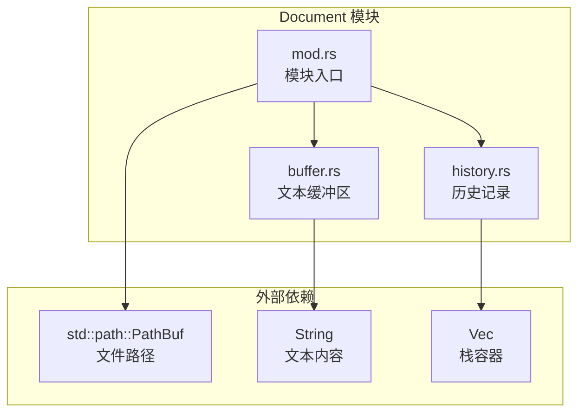
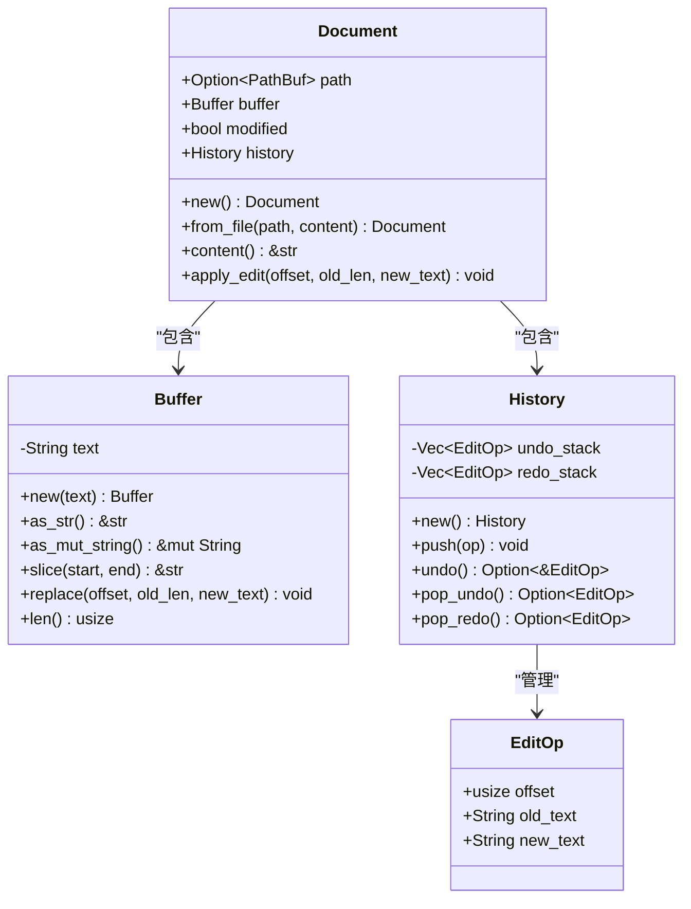
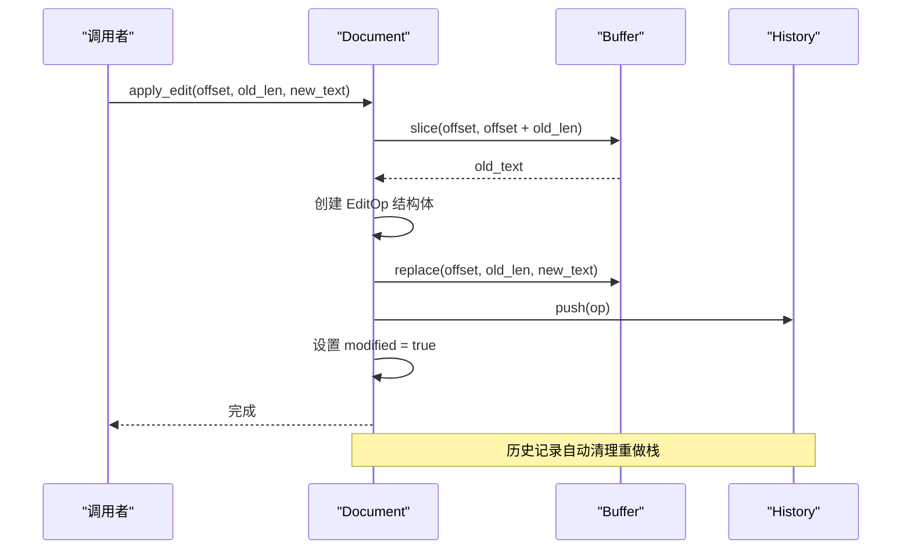
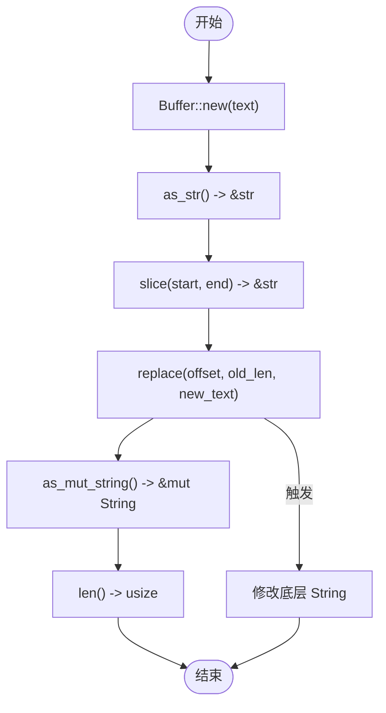
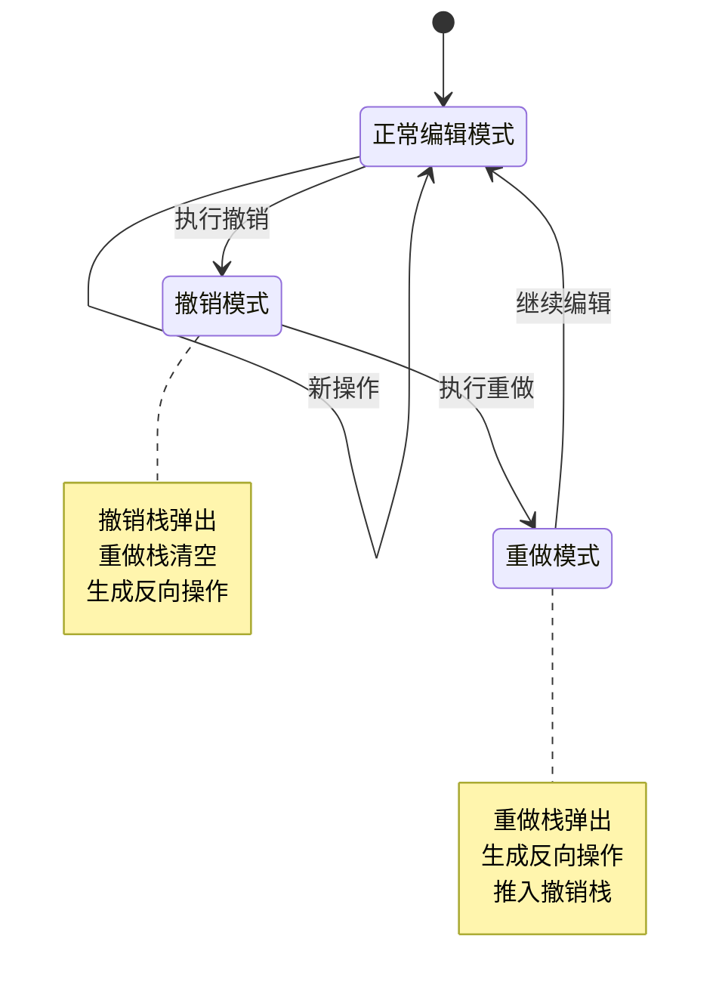
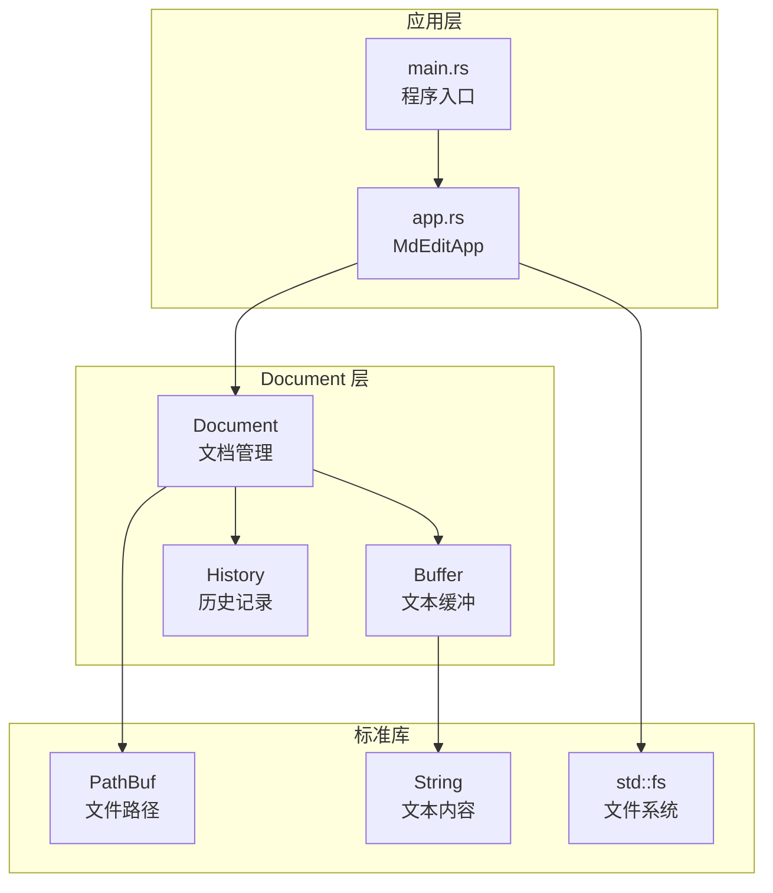

# Document 模块 API

<cite>
**本文档引用的文件**
- [src/document/mod.rs](file://src/document/mod.rs)
- [src/document/buffer.rs](file://src/document/buffer.rs)
- [src/document/history.rs](file://src/document/history.rs)
- [src/app.rs](file://src/app.rs)
- [src/main.rs](file://src/main.rs)
</cite>

## 目录
1. [简介](#简介)
2. [项目结构](#项目结构)
3. [核心组件](#核心组件)
4. [架构概览](#架构概览)
5. [详细组件分析](#详细组件分析)
6. [依赖关系分析](#依赖关系分析)
7. [性能考虑](#性能考虑)
8. [故障排除指南](#故障排除指南)
9. [结论](#结论)

## 简介

Document 模块是 mdedit Markdown 编辑器的核心数据结构模块，负责管理文档的状态、内容和编辑历史。该模块提供了完整的文本编辑功能，包括文档创建、内容管理、编辑操作记录和撤销重做机制。

## 项目结构

Document 模块位于 `src/document/` 目录下，包含以下核心文件：
- `mod.rs`: 模块入口和 Document 结构体定义
- `buffer.rs`: 文本缓冲区管理
- `history.rs`: 编辑历史记录和撤销重做机制



**图表来源**
- [src/document/mod.rs:1-51](file://src/document/mod.rs#L1-L51)
- [src/document/buffer.rs:1-30](file://src/document/buffer.rs#L1-L30)
- [src/document/history.rs:1-59](file://src/document/history.rs#L1-L59)

**章节来源**
- [src/document/mod.rs:1-51](file://src/document/mod.rs#L1-L51)
- [src/document/buffer.rs:1-30](file://src/document/buffer.rs#L1-L30)
- [src/document/history.rs:1-59](file://src/document/history.rs#L1-L59)

## 核心组件

Document 模块包含三个核心组件：Document 结构体、Buffer 文本缓冲区和 History 历史记录系统。

### Document 结构体

Document 是文档的主要容器，管理文档的完整状态信息。

**主要字段：**
- `path: Option<PathBuf>`: 文档的文件路径，None 表示未保存的新文档
- `buffer: Buffer`: 文本内容的缓冲区管理器
- `modified: bool`: 文档修改状态标志
- `history: History`: 编辑历史记录管理器

**构造函数：**
- `new()`: 创建空文档（无文件关联）
- `from_file(path: PathBuf, content: String)`: 从文件创建文档

**核心方法：**
- `content() -> &str`: 获取文档内容的只读引用
- `apply_edit(offset: usize, old_len: usize, new_text: &str)`: 应用文本编辑操作

**章节来源**
- [src/document/mod.rs:9-50](file://src/document/mod.rs#L9-L50)

### Buffer 文本缓冲区

Buffer 提供高效的文本内容管理功能，支持字符串获取、替换和切片操作。

**核心方法：**
- `new(text: String)`: 创建新的缓冲区实例
- `as_str() -> &str`: 获取文本内容的只读引用
- `as_mut_string() -> &mut String`: 获取可变的字符串引用
- `slice(start: usize, end: usize) -> &str`: 获取指定范围的文本切片
- `replace(offset: usize, old_len: usize, new_text: &str)`: 替换指定范围的文本
- `len() -> usize`: 获取文本长度

**章节来源**
- [src/document/buffer.rs:1-30](file://src/document/buffer.rs#L1-L30)

### History 历史记录系统

History 实现了完整的撤销重做机制，使用两个栈来管理编辑操作。

**EditOp 结构体：**
- `offset: usize`: 操作发生的文本偏移位置
- `old_text: String`: 被替换前的原始文本
- `new_text: String`: 新插入的文本内容

**核心方法：**
- `new()`: 创建新的历史记录实例
- `push(op: EditOp)`: 推入新的编辑操作
- `undo() -> Option<&EditOp>`: 查看但不移除最后一个编辑操作
- `pop_undo() -> Option<EditOp>`: 弹出并返回最后一个编辑操作
- `pop_redo() -> Option<EditOp>`: 弹出并返回最后一个可重做操作

**章节来源**
- [src/document/history.rs:1-59](file://src/document/history.rs#L1-L59)

## 架构概览

Document 模块采用分层设计，每个组件职责明确且相互独立。



**图表来源**
- [src/document/mod.rs:9-50](file://src/document/mod.rs#L9-L50)
- [src/document/buffer.rs:1-30](file://src/document/buffer.rs#L1-L30)
- [src/document/history.rs:1-59](file://src/document/history.rs#L1-L59)

## 详细组件分析

### Document.apply_edit 方法详解

apply_edit 方法实现了完整的编辑操作流程，包括内容修改、历史记录和状态更新。



**图表来源**
- [src/document/mod.rs:39-49](file://src/document/mod.rs#L39-L49)
- [src/document/buffer.rs:22-24](file://src/document/buffer.rs#L22-L24)
- [src/document/history.rs:20-23](file://src/document/history.rs#L20-L23)

**方法签名：** `apply_edit(&mut self, offset: usize, old_len: usize, new_text: &str)`

**参数说明：**
- `offset: usize`: 要替换文本的起始位置索引
- `old_len: usize`: 要被替换的文本长度
- `new_text: &str`: 新的文本内容

**返回值：** `void` (无返回值)

**使用示例：**
```rust
// 在位置 10 处替换 5 个字符为 "Hello"
document.apply_edit(10, 5, "Hello");
```

**章节来源**
- [src/document/mod.rs:39-49](file://src/document/mod.rs#L39-L49)

### Buffer 文本操作接口

Buffer 提供了完整的文本操作接口，支持高效的内容管理和修改。



**图表来源**
- [src/document/buffer.rs:5-29](file://src/document/buffer.rs#L5-L29)

**章节来源**
- [src/document/buffer.rs:1-30](file://src/document/buffer.rs#L1-L30)

### History 撤销重做机制

History 实现了标准的撤销重做算法，使用两个栈来维护操作历史。



**图表来源**
- [src/document/history.rs:25-57](file://src/document/history.rs#L25-L57)

**章节来源**
- [src/document/history.rs:1-59](file://src/document/history.rs#L1-L59)

## 依赖关系分析

Document 模块与应用程序其他部分的集成关系如下：



**图表来源**
- [src/app.rs:1-351](file://src/app.rs#L1-L351)
- [src/main.rs:1-50](file://src/main.rs#L1-L50)
- [src/document/mod.rs:1-51](file://src/document/mod.rs#L1-L51)

**章节来源**
- [src/app.rs:1-351](file://src/app.rs#L1-L351)
- [src/main.rs:1-50](file://src/main.rs#L1-L50)

## 性能考虑

Document 模块在设计时考虑了以下性能因素：

### 内存管理
- 使用 String 的可变引用避免不必要的字符串复制
- slice 操作返回字符串切片而非复制内容
- 历史记录使用 Vec 容器，支持动态扩容

### 时间复杂度
- `apply_edit`: O(n) 其中 n 为新文本长度
- `Buffer.replace`: O(n) 为字符串替换操作
- `History.push`: O(1) 常数时间操作
- `History.undo/pop_undo/pop_redo`: O(1) 常数时间操作

### 最佳实践
- 避免频繁的小规模编辑操作
- 批量编辑时注意内存分配开销
- 合理使用 `as_str()` 和 `as_mut_string()` 减少拷贝

## 故障排除指南

### 常见问题及解决方案

**问题：索引越界异常**
- 确保 `offset` 和 `old_len` 参数在有效范围内
- 使用 `buffer.len()` 检查文本长度
- 验证 `slice` 操作的边界条件

**问题：历史记录不同步**
- 每次编辑操作必须调用 `apply_edit`
- 确保 `modified` 状态正确设置
- 检查历史记录栈的状态一致性

**问题：内存使用过高**
- 定期清理不需要的历史记录
- 避免同时保存大量大型文档
- 考虑实现历史记录限制机制

**章节来源**
- [src/document/buffer.rs:18-24](file://src/document/buffer.rs#L18-L24)
- [src/document/history.rs:20-23](file://src/document/history.rs#L20-L23)

## 结论

Document 模块提供了完整的文档管理系统，具有以下特点：

### 设计优势
- **模块化设计**：清晰的职责分离，便于维护和扩展
- **高效性能**：优化的内存使用和快速的操作响应
- **完整功能**：支持基本的文本编辑、历史记录和状态管理

### 使用建议
- 在应用层正确处理文档生命周期
- 合理使用缓冲区接口避免不必要的字符串复制
- 实现适当的错误处理和边界检查
- 考虑添加历史记录限制和内存优化策略

该模块为 mdedit 提供了可靠的文档基础，支持后续的功能扩展和性能优化。