# Editor 模块 API

<cite>
**本文档引用的文件**
- [src/editor/mod.rs](file://src/editor/mod.rs)
- [src/renderer/mod.rs](file://src/renderer/mod.rs)
- [src/renderer/blocks.rs](file://src/renderer/blocks.rs)
- [src/renderer/inline.rs](file://src/renderer/inline.rs)
- [src/document/mod.rs](file://src/document/mod.rs)
- [src/document/buffer.rs](file://src/document/buffer.rs)
- [src/document/history.rs](file://src/document/history.rs)
- [src/app.rs](file://src/app.rs)
- [src/theme.rs](file://src/theme.rs)
- [src/outline/mod.rs](file://src/outline/mod.rs)
- [src/main.rs](file://src/main.rs)
- [Cargo.toml](file://Cargo.toml)
</cite>

## 目录
1. [简介](#简介)
2. [项目结构](#项目结构)
3. [核心组件](#核心组件)
4. [架构概览](#架构概览)
5. [详细组件分析](#详细组件分析)
6. [依赖关系分析](#依赖关系分析)
7. [性能考虑](#性能考虑)
8. [故障排除指南](#故障排除指南)
9. [结论](#结论)

## 简介

mdedit 是一个轻量级的跨平台 Markdown 编辑器，采用 WYSIWYG（所见即所得）渲染模式。该编辑器提供了实时的 Markdown 到富文本的转换，支持多种 Markdown 元素的识别和渲染，包括标题、段落、代码块、引用、列表、表格和分隔线等。

本项目基于 Rust 语言开发，使用 eframe 和 egui 作为 GUI 框架，pulldown-cmark 作为 Markdown 解析器，syntect 作为语法高亮引擎。编辑器的核心功能围绕着块级元素的识别、分割和实时渲染机制构建。

## 项目结构

项目采用模块化的组织方式，主要分为以下几个核心模块：

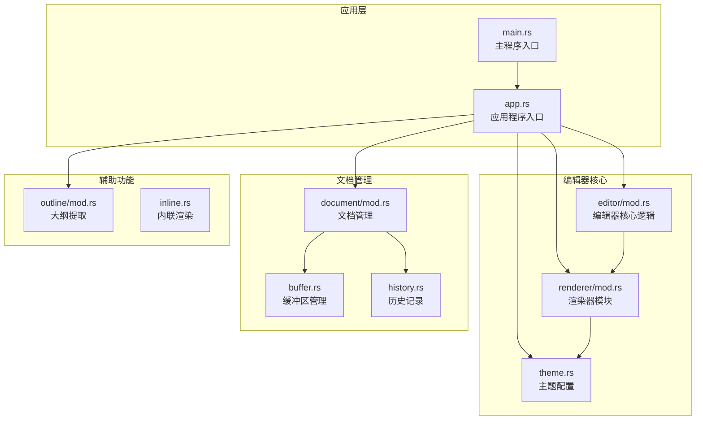

**图表来源**
- [src/main.rs:1-50](file://src/main.rs#L1-L50)
- [src/app.rs:1-351](file://src/app.rs#L1-L351)
- [src/editor/mod.rs:1-349](file://src/editor/mod.rs#L1-L349)

**章节来源**
- [src/main.rs:1-50](file://src/main.rs#L1-L50)
- [src/app.rs:1-351](file://src/app.rs#L1-L351)
- [Cargo.toml:1-19](file://Cargo.toml#L1-L19)

## 核心组件

### 编辑器核心模块

编辑器模块是整个系统的核心，负责 Markdown 内容的解析、块级元素的识别和渲染。主要包含以下核心组件：

#### TextBlock 结构体
表示一个独立的 Markdown 块，包含块的起始和结束行号、源代码内容以及块的类型。

#### BlockKind 枚举
定义了所有支持的 Markdown 块类型：
- Heading(u8): 标题，包含级别信息
- Paragraph: 段落
- CodeBlock(String): 代码块，包含语言标识
- Quote: 引用块
- List(bool): 列表，布尔值表示是否为有序列表
- Table: 表格
- Rule: 分隔线
- Empty: 空行

#### 渲染器模块

渲染器模块提供了两种渲染方式：
1. **块级渲染**：使用 pulldown-cmark 解析器进行标准 Markdown 渲染
2. **富文本渲染**：自定义的富文本渲染器，支持更丰富的格式化选项

**章节来源**
- [src/editor/mod.rs:4-22](file://src/editor/mod.rs#L4-L22)
- [src/editor/mod.rs:12-22](file://src/editor/mod.rs#L12-L22)
- [src/renderer/mod.rs:9-17](file://src/renderer/mod.rs#L9-L17)

## 架构概览

编辑器采用分层架构设计，实现了清晰的关注点分离：

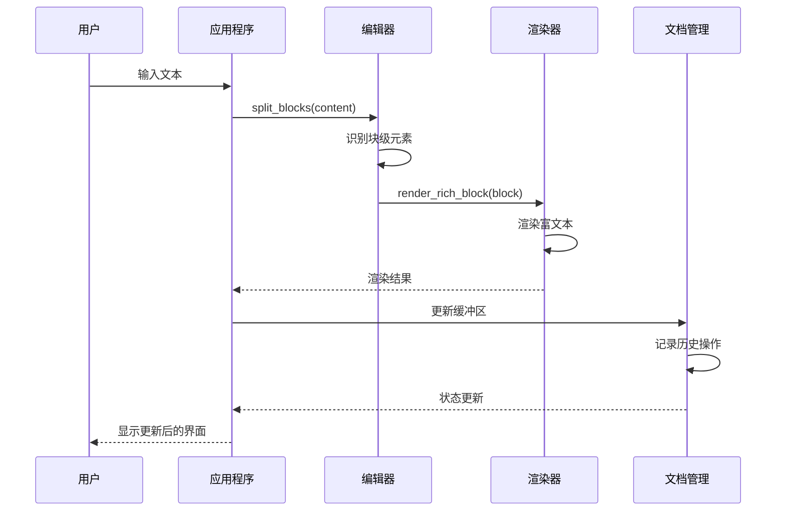

**图表来源**
- [src/app.rs:251-328](file://src/app.rs#L251-L328)
- [src/editor/mod.rs:24-149](file://src/editor/mod.rs#L24-L149)
- [src/renderer/mod.rs:19-142](file://src/renderer/mod.rs#L19-L142)

### 数据流架构

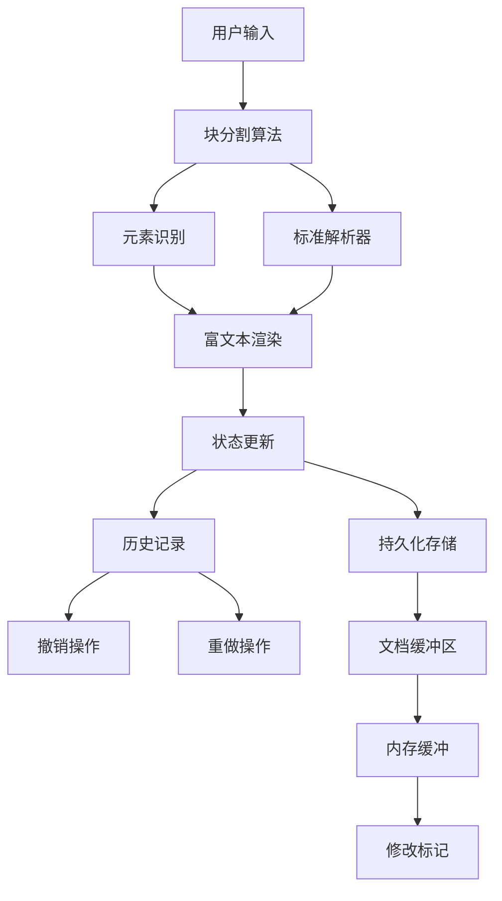

**图表来源**
- [src/editor/mod.rs:24-149](file://src/editor/mod.rs#L24-L149)
- [src/document/mod.rs:39-49](file://src/document/mod.rs#L39-L49)
- [src/document/history.rs:20-57](file://src/document/history.rs#L20-L57)

## 详细组件分析

### 块级元素识别与分割算法

#### split_blocks 函数

这是编辑器的核心算法，负责将 Markdown 内容分割成独立的块级元素：

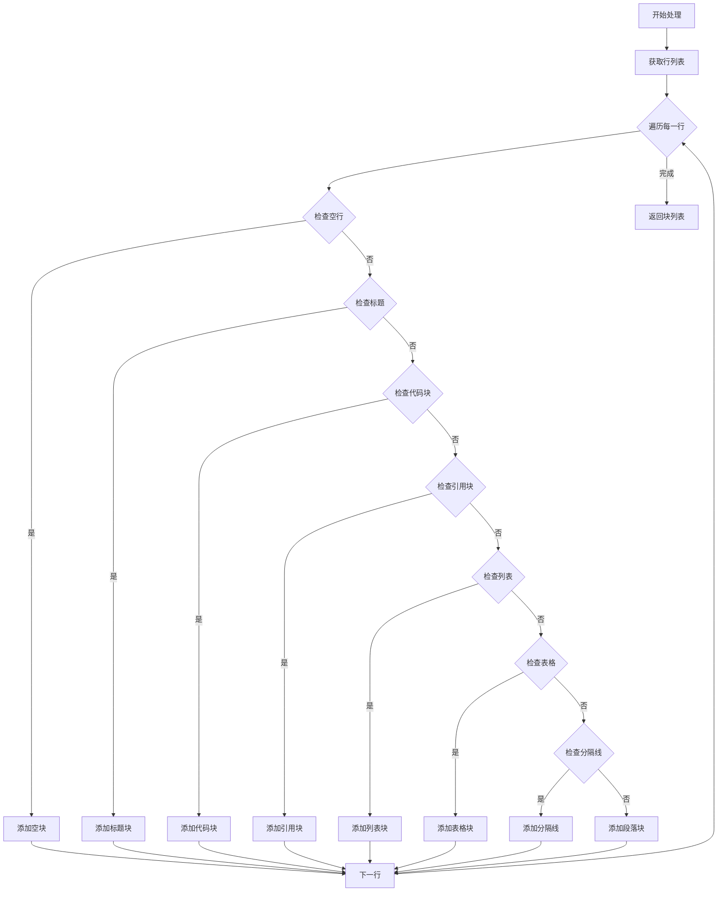

**图表来源**
- [src/editor/mod.rs:24-149](file://src/editor/mod.rs#L24-L149)

##### 算法复杂度分析
- **时间复杂度**: O(n)，其中 n 是文档中的行数
- **空间复杂度**: O(n)，用于存储块列表和临时数据结构

##### 关键特性
1. **智能块识别**: 能够正确识别各种 Markdown 元素
2. **嵌套支持**: 支持代码块内的嵌套元素
3. **边界处理**: 正确处理元素间的边界情况
4. **性能优化**: 使用单次遍历完成所有识别工作

**章节来源**
- [src/editor/mod.rs:24-149](file://src/editor/mod.rs#L24-L149)

### 富文本渲染机制

#### render_rich_block 函数

该函数负责将识别出的块级元素渲染为富文本：

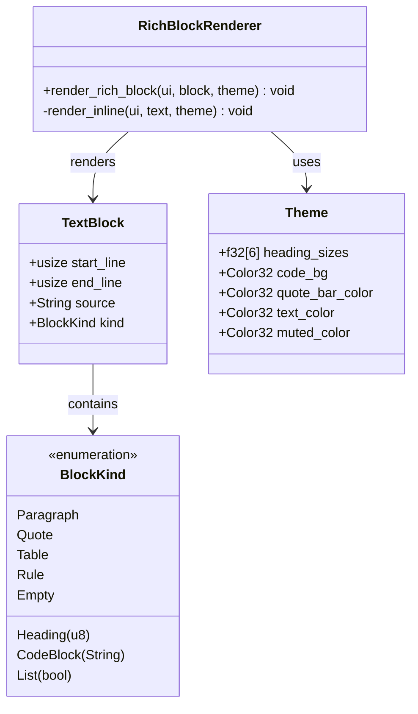

**图表来源**
- [src/editor/mod.rs:4-22](file://src/editor/mod.rs#L4-L22)
- [src/editor/mod.rs:12-22](file://src/editor/mod.rs#L12-L22)
- [src/theme.rs:3-9](file://src/theme.rs#L3-L9)

##### 渲染流程

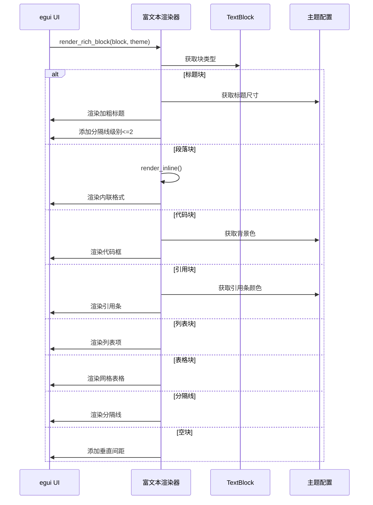

**图表来源**
- [src/editor/mod.rs:159-266](file://src/editor/mod.rs#L159-L266)

**章节来源**
- [src/editor/mod.rs:159-266](file://src/editor/mod.rs#L159-L266)

### 文档状态管理

#### Document 结构体

文档管理系统负责维护编辑器的状态和历史记录：

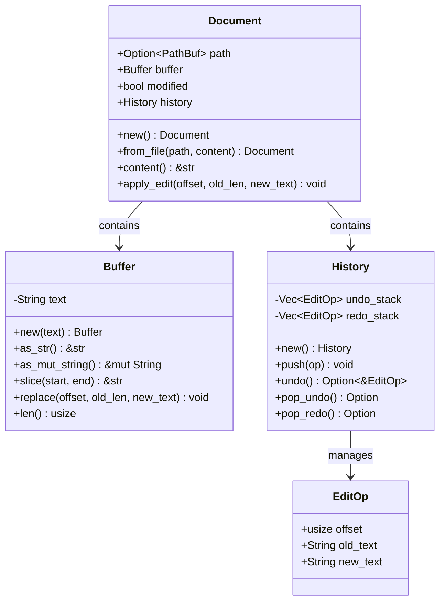

**图表来源**
- [src/document/mod.rs:9-14](file://src/document/mod.rs#L9-L14)
- [src/document/buffer.rs:1-30](file://src/document/buffer.rs#L1-L30)
- [src/document/history.rs:1-10](file://src/document/history.rs#L1-L10)

##### 状态管理流程

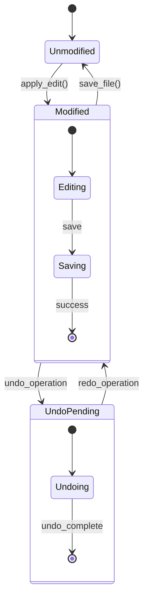

**图表来源**
- [src/document/mod.rs:39-49](file://src/document/mod.rs#L39-L49)
- [src/document/history.rs:25-57](file://src/document/history.rs#L25-L57)

**章节来源**
- [src/document/mod.rs:9-51](file://src/document/mod.rs#L9-L51)
- [src/document/buffer.rs:1-30](file://src/document/buffer.rs#L1-L30)
- [src/document/history.rs:1-59](file://src/document/history.rs#L1-L59)

### 实时渲染机制

#### 应用程序更新循环

应用程序实现了完整的实时渲染机制：

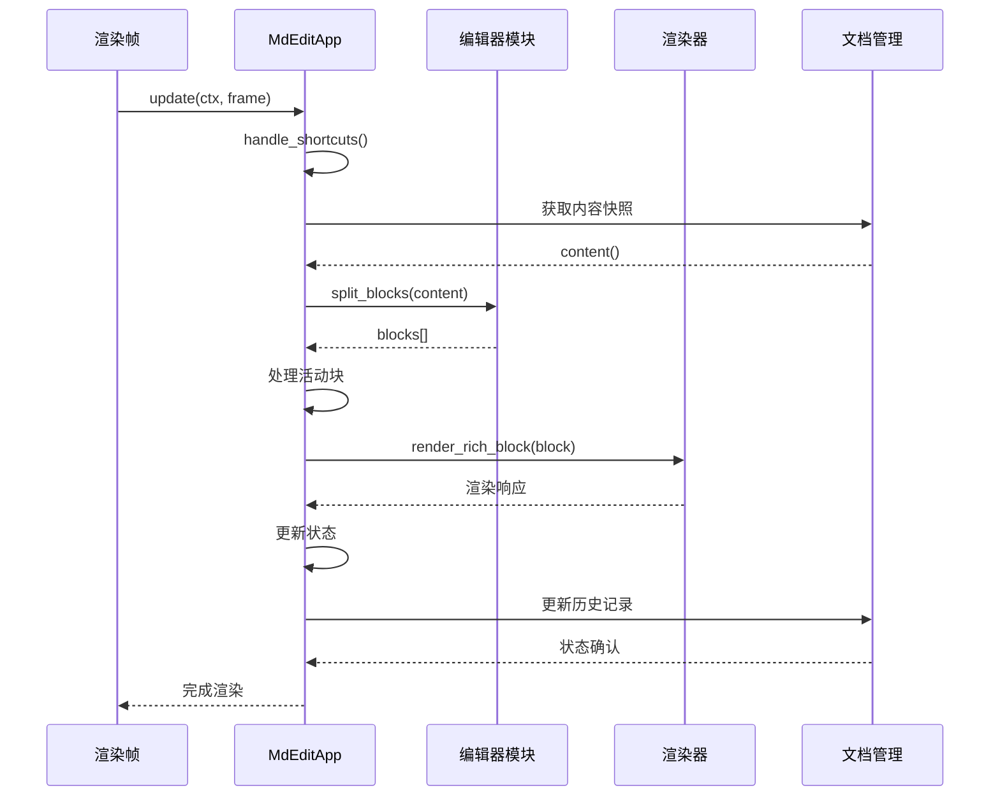

**图表来源**
- [src/app.rs:187-249](file://src/app.rs#L187-L249)
- [src/app.rs:251-328](file://src/app.rs#L251-L328)

##### 光标位置控制

应用程序实现了智能的光标位置管理和块激活机制：

1. **块激活**: 当用户点击某个块时，该块变为活动状态
2. **编辑模式**: 活动块进入可编辑模式，显示文本编辑控件
3. **焦点管理**: 自动处理焦点转移和编辑提交
4. **滚动同步**: 支持根据大纲导航自动滚动到指定行

**章节来源**
- [src/app.rs:251-328](file://src/app.rs#L251-L328)

### 主题系统

#### Theme 结构体

主题系统提供了统一的视觉样式管理：

| 属性名 | 类型 | 描述 | 默认值 |
|--------|------|------|--------|
| heading_sizes | [f32; 6] | 标题字体大小数组 | [28.0, 24.0, 20.0, 18.0, 16.0, 14.0] |
| code_bg | Color32 | 代码块背景色 | #282828 |
| quote_bar_color | Color32 | 引用条颜色 | #646464 |
| text_color | Color32 | 文本颜色 | #DCDCDC |
| muted_color | Color32 | 柔化文本颜色 | #8C8C8C |

**章节来源**
- [src/theme.rs:3-22](file://src/theme.rs#L3-L22)

## 依赖关系分析

### 外部依赖

项目使用了以下关键外部依赖：

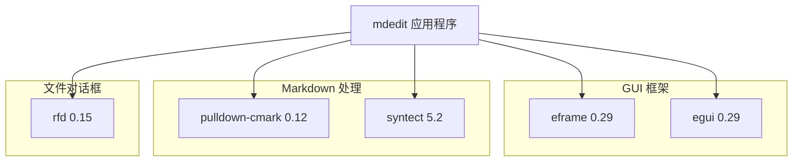

**图表来源**
- [Cargo.toml:8-13](file://Cargo.toml#L8-L13)

### 内部模块依赖

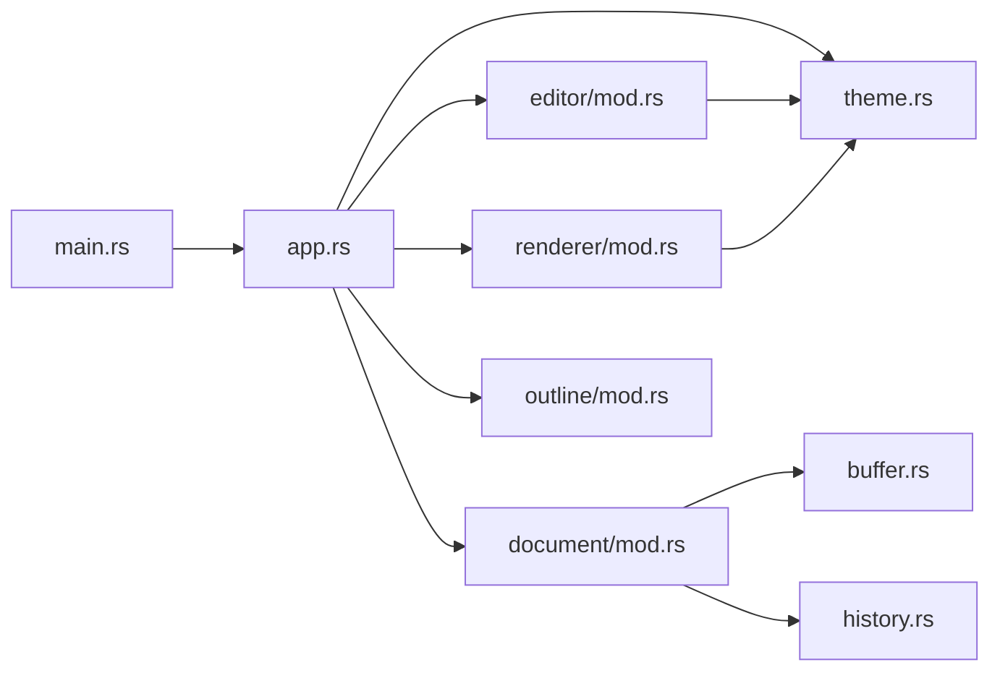

**图表来源**
- [src/main.rs:3-8](file://src/main.rs#L3-L8)
- [src/app.rs:1-8](file://src/app.rs#L1-L8)

**章节来源**
- [Cargo.toml:8-13](file://Cargo.toml#L8-L13)

## 性能考虑

### 时间复杂度优化

1. **单次遍历算法**: 块分割算法采用单次遍历，避免重复扫描
2. **增量更新**: 仅在内容变化时重新渲染受影响的块
3. **内存复用**: 使用字符串切片和缓冲区减少内存分配

### 内存管理策略

1. **零拷贝原则**: 尽可能使用字符串切片而非复制
2. **批量操作**: 合并多个小的编辑操作为批量更新
3. **缓存机制**: 缓存解析结果和渲染状态

### 渲染性能优化

1. **按需渲染**: 仅渲染可见区域内的块
2. **增量更新**: 只更新发生变化的块
3. **硬件加速**: 利用 egui 的 GPU 加速渲染

## 故障排除指南

### 常见问题及解决方案

#### 编辑器不响应输入

**症状**: 文本编辑控件无响应
**可能原因**:
1. 活动块索引超出范围
2. 文档缓冲区为空
3. 编辑权限被禁用

**解决方法**:
1. 检查 `active_block` 索引的有效性
2. 确保文档有内容
3. 验证编辑模式状态

#### 渲染异常

**症状**: 块渲染显示错误或格式不正确
**可能原因**:
1. 块类型识别失败
2. 主题配置错误
3. 字符编码问题

**解决方法**:
1. 检查 `BlockKind` 识别逻辑
2. 验证主题颜色配置
3. 确认 UTF-8 编码

#### 性能问题

**症状**: 编辑器响应缓慢
**可能原因**:
1. 大文档的全量重渲染
2. 频繁的内存分配
3. 不必要的重新计算

**解决方法**:
1. 实施增量渲染
2. 优化内存使用
3. 缓存计算结果

**章节来源**
- [src/app.rs:330-349](file://src/app.rs#L330-L349)
- [src/editor/mod.rs:24-149](file://src/editor/mod.rs#L24-L149)

## 结论

mdedit 编辑器模块展现了现代文本编辑器的核心架构模式。通过精心设计的块级元素识别算法、高效的富文本渲染机制和完善的文档状态管理，实现了高性能的 WYSIWYG 编辑体验。

### 主要优势

1. **算法效率**: 单次遍历的块分割算法确保了良好的性能表现
2. **架构清晰**: 模块化设计便于维护和扩展
3. **用户体验**: 实时渲染和智能状态管理提供了流畅的编辑体验
4. **可扩展性**: 插件化的主题系统和渲染器支持功能扩展

### 技术亮点

- **智能块识别**: 能够准确识别各种 Markdown 元素
- **实时渲染**: 基于 egui 的高效渲染框架
- **状态管理**: 完善的历史记录和撤销/重做机制
- **跨平台支持**: 基于 eframe 的跨平台 GUI 框架

### 发展方向

未来可以考虑的功能增强：
1. 更丰富的内联格式支持
2. 语法高亮功能
3. 自定义主题系统
4. 插件扩展机制
5. 更强大的搜索和替换功能

这个编辑器模块为开发者提供了一个坚实的基础，可以在此基础上构建更复杂的功能和更好的用户体验。