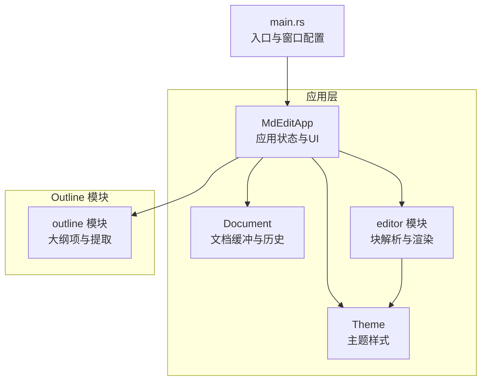
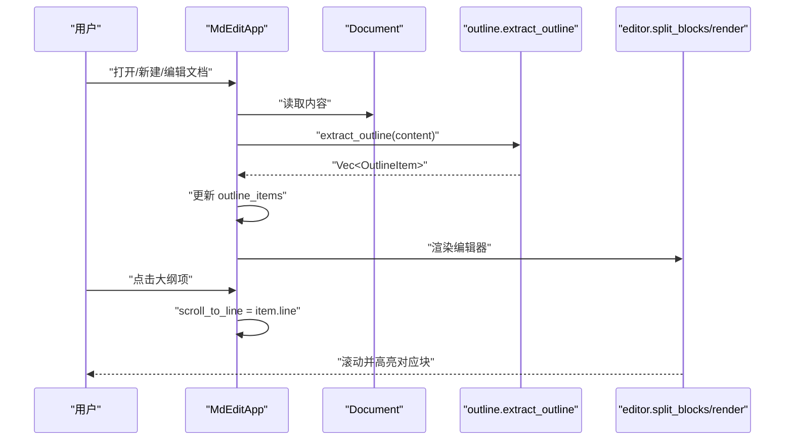
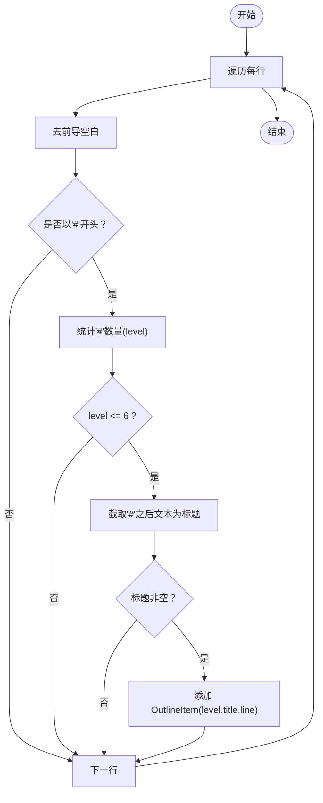
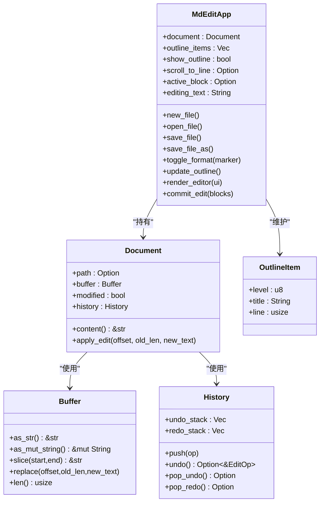
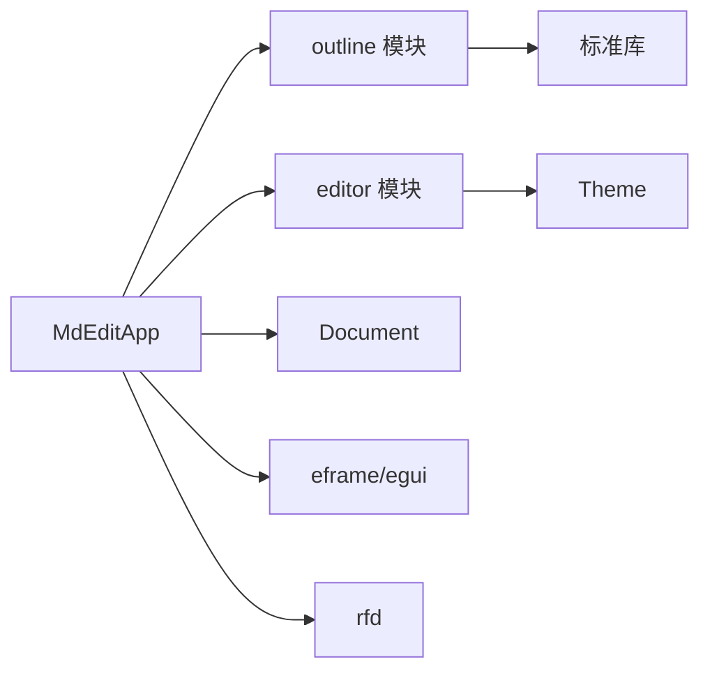

# Outline 模块 API

<cite>
**本文引用的文件**
- [src/outline/mod.rs](file://src/outline/mod.rs)
- [src/app.rs](file://src/app.rs)
- [src/editor/mod.rs](file://src/editor/mod.rs)
- [src/document/mod.rs](file://src/document/mod.rs)
- [src/document/buffer.rs](file://src/document/buffer.rs)
- [src/document/history.rs](file://src/document/history.rs)
- [src/theme.rs](file://src/theme.rs)
- [src/main.rs](file://src/main.rs)
- [Cargo.toml](file://Cargo.toml)
- [README.md](file://README.md)
</cite>

## 目录
1. [简介](#简介)
2. [项目结构](#项目结构)
3. [核心组件](#核心组件)
4. [架构总览](#架构总览)
5. [详细组件分析](#详细组件分析)
6. [依赖关系分析](#依赖关系分析)
7. [性能考量](#性能考量)
8. [故障排查指南](#故障排查指南)
9. [结论](#结论)
10. [附录](#附录)

## 简介
本文件为 Outline 模块的完整 API 参考文档，聚焦于“大纲导航系统”的公共接口与数据结构，涵盖：
- 标题提取：从 Markdown 文本中识别各级标题并生成大纲项
- 大纲生成：基于当前文档内容构建大纲列表
- 导航跳转：点击大纲项在编辑器中定位对应行
- 大纲项数据结构：标题级别、文本内容、行号等字段的用途
- 大纲更新机制：文档变更后的自动更新与手动刷新
- 大纲面板显示控制与交互：侧边面板开关、点击跳转
- 与编辑器的同步机制与事件通信
- 实际集成示例与复杂文档结构导航建议

本项目是一个轻量级跨平台 Markdown 编辑器，支持实时大纲导航与所见即所得渲染。

## 项目结构
Outline 模块位于 src/outline/mod.rs，提供最小化的公共 API；应用层在 src/app.rs 中消费该模块，并通过编辑器模块进行渲染与交互。

图表来源
- [src/main.rs:35-49](file://src/main.rs#L35-L49)
- [src/app.rs:9-17](file://src/app.rs#L9-L17)
- [src/outline/mod.rs:1-27](file://src/outline/mod.rs#L1-L27)
- [src/editor/mod.rs:159-266](file://src/editor/mod.rs#L159-L266)
- [src/document/mod.rs:9-50](file://src/document/mod.rs#L9-L50)
- [src/theme.rs:3-21](file://src/theme.rs#L3-L21)

章节来源
- [src/main.rs:1-50](file://src/main.rs#L1-L50)
- [src/app.rs:1-351](file://src/app.rs#L1-L351)
- [src/outline/mod.rs:1-27](file://src/outline/mod.rs#L1-L27)
- [src/editor/mod.rs:1-349](file://src/editor/mod.rs#L1-L349)
- [src/document/mod.rs:1-51](file://src/document/mod.rs#L1-L51)
- [src/theme.rs:1-22](file://src/theme.rs#L1-L22)

## 核心组件
- OutlineItem：大纲项数据结构，包含标题级别、标题文本、所在行号
- extract_outline：从 Markdown 文本中提取标题并生成 OutlineItem 列表

章节来源
- [src/outline/mod.rs:1-27](file://src/outline/mod.rs#L1-L27)

## 架构总览
Outline 模块与应用层的交互流程如下：
- 应用初始化时根据初始文档内容提取一次大纲
- 用户编辑或打开/保存文件时，调用更新函数重新提取大纲
- 大纲面板以侧边栏形式展示，点击项后设置滚动目标行号
- 渲染阶段根据目标行号定位到对应块并进入编辑态

图表来源
- [src/app.rs:26-42](file://src/app.rs#L26-L42)
- [src/app.rs:86-88](file://src/app.rs#L86-L88)
- [src/app.rs:220-239](file://src/app.rs#L220-L239)
- [src/app.rs:256-264](file://src/app.rs#L256-L264)
- [src/outline/mod.rs:7-26](file://src/outline/mod.rs#L7-L26)
- [src/editor/mod.rs:24-149](file://src/editor/mod.rs#L24-L149)

## 详细组件分析

### OutlineItem 数据结构
- 字段
  - level：u8，标题级别（1~6），用于控制缩进与层级显示
  - title：String，去除前缀后的标题文本
  - line：usize，标题在文档中的行号（从 0 开始）
- 用途
  - 作为大纲面板的展示单元
  - 作为导航跳转的目标位置信息
- 复杂度
  - 提取算法为 O(N)，其中 N 为行数

章节来源
- [src/outline/mod.rs:1-5](file://src/outline/mod.rs#L1-L5)

### extract_outline 函数
- 输入：&str（文档内容）
- 输出：Vec<OutlineItem>
- 行为
  - 遍历每一行，识别以一个或多个 # 开头的行
  - 计算 # 的数量作为标题级别（限制为 ≤ 6）
  - 去除前缀后得到标题文本，若非空则加入结果
  - 记录该标题所在的行号
- 边界与约束
  - 不处理空标题
  - 仅识别 1~6 级标题
  - 严格按行顺序保留原始行号

图表来源
- [src/outline/mod.rs:7-26](file://src/outline/mod.rs#L7-L26)

章节来源
- [src/outline/mod.rs:7-26](file://src/outline/mod.rs#L7-L26)

### 应用层与大纲的集成
- 初始化
  - 若存在初始文件，加载内容并提取大纲
- 文件操作
  - 打开文件后调用更新函数重新提取
  - 保存文件后保持大纲不变（可在需要时再次更新）
- 编辑过程
  - 文本框变化时重新提取大纲
  - 块编辑提交后重新提取大纲
- 大纲面板
  - 通过菜单勾选显示/隐藏
  - 侧边栏垂直滚动展示
  - 点击项设置滚动目标行号
- 跳转逻辑
  - 根据目标行号定位到对应块
  - 将该块设为活动块并进入编辑态

图表来源
- [src/app.rs:9-43](file://src/app.rs#L9-L43)
- [src/document/mod.rs:9-50](file://src/document/mod.rs#L9-L50)
- [src/document/buffer.rs:1-30](file://src/document/buffer.rs#L1-L30)
- [src/document/history.rs:1-59](file://src/document/history.rs#L1-L59)
- [src/outline/mod.rs:1-5](file://src/outline/mod.rs#L1-L5)

章节来源
- [src/app.rs:19-43](file://src/app.rs#L19-L43)
- [src/app.rs:86-88](file://src/app.rs#L86-L88)
- [src/app.rs:121-131](file://src/app.rs#L121-L131)
- [src/app.rs:251-328](file://src/app.rs#L251-L328)
- [src/document/mod.rs:16-50](file://src/document/mod.rs#L16-L50)
- [src/document/buffer.rs:5-29](file://src/document/buffer.rs#L5-L29)
- [src/document/history.rs:12-58](file://src/document/history.rs#L12-L58)

### 大纲面板显示控制与交互
- 显示控制
  - 顶部菜单“视图”中提供“大纲面板”复选框
  - 切换 show_outline 控制面板可见性
- 交互行为
  - 点击大纲项设置 scroll_to_line
  - 渲染阶段根据目标行号定位块并进入编辑态
- 缩进与层级
  - 根据 level 计算缩进像素值，形成树状缩进效果

章节来源
- [src/app.rs:212-216](file://src/app.rs#L212-L216)
- [src/app.rs:220-239](file://src/app.rs#L220-L239)
- [src/app.rs:227-236](file://src/app.rs#L227-L236)
- [src/app.rs:256-264](file://src/app.rs#L256-L264)

### 与编辑器的同步机制与事件通信
- 同步点
  - 文档内容变化时（文本框变化、块编辑提交）重新提取大纲
  - 打开文件后更新大纲
- 事件路径
  - 用户输入触发 egui::TextEdit.changed
  - MdEditApp.commit_edit 更新文档缓冲
  - MdEditApp.update_outline 重新提取大纲
  - 渲染阶段根据 scroll_to_line 定位块
- 与块解析的关系
  - editor.split_blocks 将内容拆分为 TextBlock，用于渲染与交互
  - OutlineItem 的 line 与 TextBlock 的 start_line/end_line 对齐

章节来源
- [src/app.rs:275-278](file://src/app.rs#L275-L278)
- [src/app.rs:295-298](file://src/app.rs#L295-L298)
- [src/app.rs:325-328](file://src/app.rs#L325-L328)
- [src/app.rs:330-349](file://src/app.rs#L330-L349)
- [src/editor/mod.rs:24-149](file://src/editor/mod.rs#L24-L149)

### 大纲搜索、过滤与排序 API
- 当前实现
  - 无内置搜索与过滤 API
  - 无排序 API
- 建议扩展
  - 搜索：在现有 Vec<OutlineItem> 上进行字符串匹配筛选
  - 过滤：按 level 或标题内容过滤
  - 排序：按 line 或 level 排序
- 注意事项
  - 扩展应保持与文档行号的一致性
  - 与编辑器的跳转逻辑需同步调整

章节来源
- [src/outline/mod.rs:7-26](file://src/outline/mod.rs#L7-L26)
- [src/app.rs:227-236](file://src/app.rs#L227-L236)

### 复杂文档结构导航建议
- 多级标题嵌套：利用 level 字段实现树形缩进
- 混合内容：结合 editor.split_blocks 的 BlockKind 信息，区分标题与其他块类型
- 跳转精度：优先使用 TextBlock 的 start_line/end_line 精确定位
- 性能：在频繁编辑场景下，可考虑延迟更新或增量更新策略

章节来源
- [src/editor/mod.rs:4-22](file://src/editor/mod.rs#L4-L22)
- [src/editor/mod.rs:24-149](file://src/editor/mod.rs#L24-L149)
- [src/app.rs:256-264](file://src/app.rs#L256-L264)

## 依赖关系分析
- Outline 模块依赖
  - 标准库（str、Vec、Iterator）
- 应用层依赖
  - eframe/egui：UI 与事件循环
  - rfd：文件对话框
  - pulldown-cmark/syntect：渲染（在其他模块中使用）
- 关键耦合点
  - MdEditApp 与 outline::extract_outline 的耦合
  - MdEditApp 与 editor::split_blocks 的耦合
  - MdEditApp 与 Document 的耦合

图表来源
- [src/outline/mod.rs:1-27](file://src/outline/mod.rs#L1-L27)
- [src/app.rs:3-7](file://src/app.rs#L3-L7)
- [src/editor/mod.rs:1-3](file://src/editor/mod.rs#L1-L3)
- [src/theme.rs:1-2](file://src/theme.rs#L1-L2)
- [Cargo.toml:8-13](file://Cargo.toml#L8-L13)

章节来源
- [Cargo.toml:8-13](file://Cargo.toml#L8-L13)
- [src/app.rs:3-7](file://src/app.rs#L3-L7)
- [src/editor/mod.rs:1-3](file://src/editor/mod.rs#L1-L3)
- [src/theme.rs:1-2](file://src/theme.rs#L1-L2)

## 性能考量
- 时间复杂度
  - extract_outline：O(N)，逐行扫描
  - 渲染与跳转：O(M)，M 为块数量（通常远小于行数）
- 内存占用
  - OutlineItem 列表大小与标题数量线性相关
- 优化建议
  - 在高频编辑场景下，可延迟更新（如 100ms 抖动）或仅在焦点离开时更新
  - 对超长文档，可考虑分页或虚拟滚动展示大纲项

章节来源
- [src/outline/mod.rs:7-26](file://src/outline/mod.rs#L7-L26)
- [src/app.rs:275-278](file://src/app.rs#L275-L278)
- [src/app.rs:295-298](file://src/app.rs#L295-L298)

## 故障排查指南
- 大纲不更新
  - 确认在编辑文本框变化或块编辑提交后调用了更新函数
  - 检查是否正确设置了 modified 标志以触发后续更新
- 点击大纲无反应
  - 检查 show_outline 是否为 true
  - 确认 scroll_to_line 设置与目标行号一致
- 标题级别异常
  - 确保标题前缀为连续的 #，且数量不超过 6
  - 空标题不会被收录
- 跳转不准确
  - 确认 TextBlock 的 start_line/end_line 与 OutlineItem 的 line 对齐
  - 检查是否存在多行标题或混合块导致的定位偏差

章节来源
- [src/app.rs:86-88](file://src/app.rs#L86-L88)
- [src/app.rs:275-278](file://src/app.rs#L275-L278)
- [src/app.rs:295-298](file://src/app.rs#L295-L298)
- [src/app.rs:220-239](file://src/app.rs#L220-L239)
- [src/app.rs:256-264](file://src/app.rs#L256-L264)
- [src/outline/mod.rs:11-22](file://src/outline/mod.rs#L11-L22)

## 结论
Outline 模块提供了简洁而高效的标题提取能力，配合应用层的 UI 与编辑器模块，实现了从标题到编辑器的无缝导航。当前版本未包含搜索、过滤与排序 API，但其数据结构与更新机制为后续扩展提供了良好基础。开发者可根据自身需求在现有基础上增加高级功能，并注意在高频编辑场景下的性能优化。

## 附录

### API 参考速览
- OutlineItem
  - 字段：level: u8, title: String, line: usize
  - 用途：存储大纲项的层级、标题与行号
- extract_outline(content: &str) -> Vec<OutlineItem>
  - 用途：从 Markdown 文本中提取标题并生成大纲项列表
- MdEditApp.update_outline()
  - 用途：根据当前文档内容更新大纲项列表
- MdEditApp.render_editor(ui)
  - 用途：渲染编辑器并处理大纲跳转逻辑
- MdEditApp.commit_edit(blocks)
  - 用途：提交块编辑并更新文档与大纲

章节来源
- [src/outline/mod.rs:1-27](file://src/outline/mod.rs#L1-L27)
- [src/app.rs:86-88](file://src/app.rs#L86-L88)
- [src/app.rs:251-328](file://src/app.rs#L251-L328)
- [src/app.rs:330-349](file://src/app.rs#L330-L349)