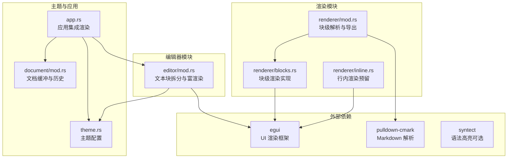
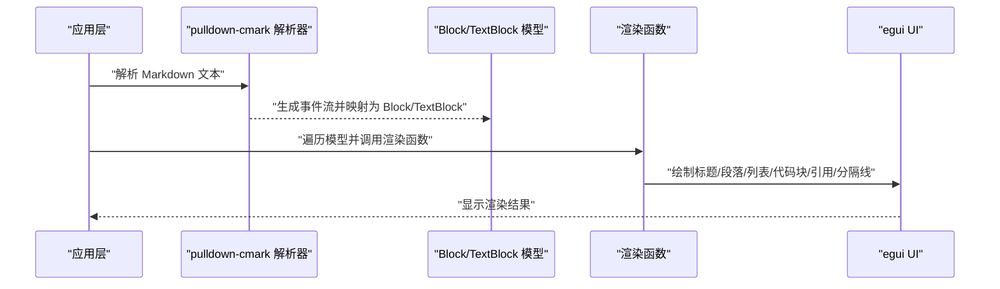
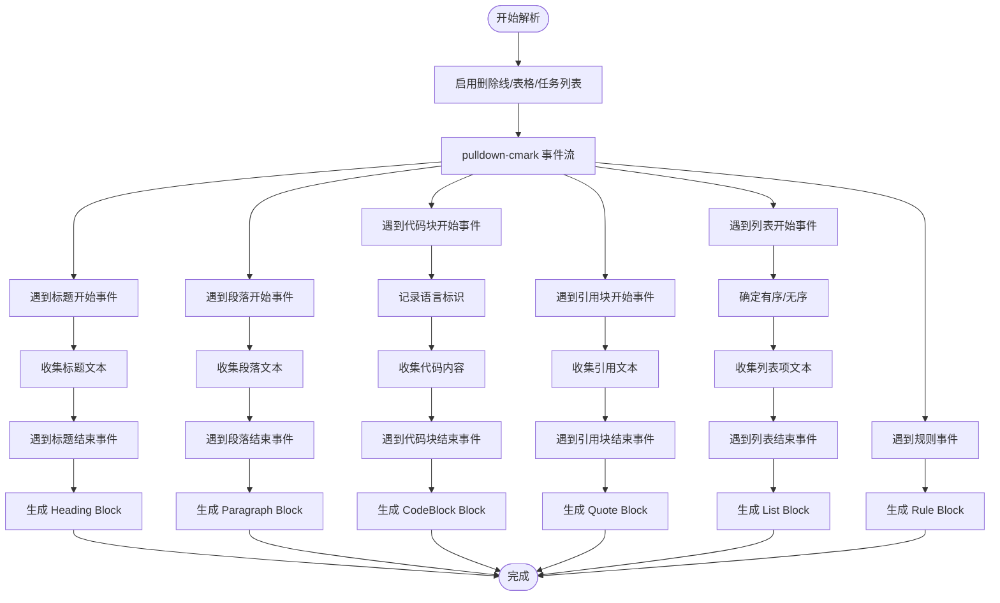
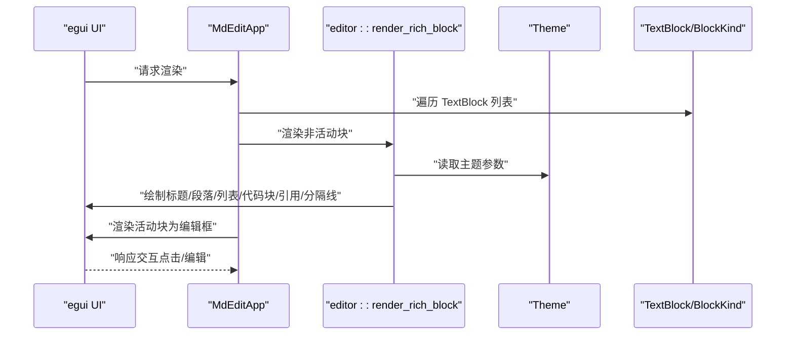
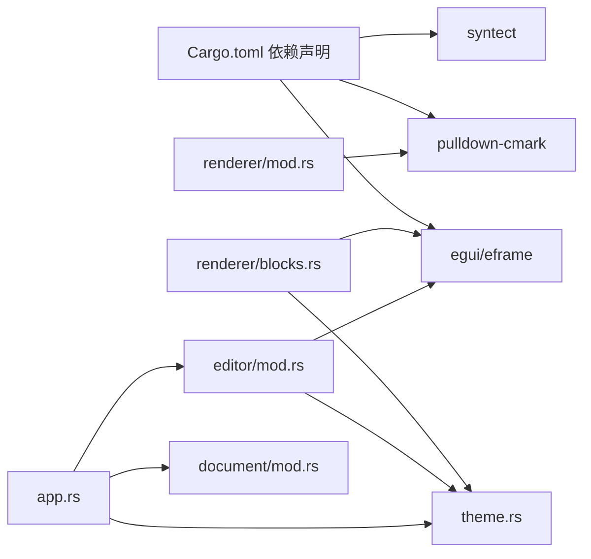

# Renderer 模块 API

<cite>
**本文档引用的文件**
- [src/renderer/mod.rs](file://src/renderer/mod.rs)
- [src/renderer/blocks.rs](file://src/renderer/blocks.rs)
- [src/renderer/inline.rs](file://src/renderer/inline.rs)
- [src/editor/mod.rs](file://src/editor/mod.rs)
- [src/theme.rs](file://src/theme.rs)
- [src/app.rs](file://src/app.rs)
- [src/document/mod.rs](file://src/document/mod.rs)
- [Cargo.toml](file://Cargo.toml)
</cite>

## 目录
1. [简介](#简介)
2. [项目结构](#项目结构)
3. [核心组件](#核心组件)
4. [架构总览](#架构总览)
5. [详细组件分析](#详细组件分析)
6. [依赖关系分析](#依赖关系分析)
7. [性能考量](#性能考量)
8. [故障排查指南](#故障排查指南)
9. [结论](#结论)
10. [附录：扩展与自定义指南](#附录扩展与自定义指南)

## 简介
本文件为 Renderer 模块的完整 API 参考文档，聚焦于 Markdown 文档的解析与渲染流程，覆盖块级元素（标题、段落、列表、代码块、引用块、分隔线）与行内格式（粗体、斜体、代码）的渲染接口与实现细节。文档同时说明渲染上下文、样式配置与主题应用方式，并给出与 pulldown-cmark 解析器的集成接口及数据转换方法。最后提供扩展新渲染元素类型的实践建议与最佳实践。

## 项目结构
Renderer 模块位于 src/renderer 目录，主要由以下文件组成：
- mod.rs：导出块级渲染入口函数，定义 Block 枚举，提供基于 pulldown-cmark 的 Markdown 块级解析函数。
- blocks.rs：块级元素渲染实现，使用 egui 渲染 UI。
- inline.rs：预留行内渲染扩展点（当前为空）。
- editor/mod.rs：编辑器侧的富文本渲染实现，包含 TextBlock/BlockKind 定义与行内解析逻辑。
- theme.rs：主题配置结构体，定义渲染颜色与字号等样式参数。
- app.rs：应用层集成渲染，负责将解析后的块渲染到 egui UI。
- document/mod.rs：文档缓冲区与历史记录抽象，为渲染与编辑提供基础能力。
- Cargo.toml：依赖声明，包含 egui、pulldown-cmark、syntect 等。

图表来源
- [src/renderer/mod.rs:1-143](file://src/renderer/mod.rs#L1-L143)
- [src/renderer/blocks.rs:1-68](file://src/renderer/blocks.rs#L1-L68)
- [src/renderer/inline.rs:1-2](file://src/renderer/inline.rs#L1-L2)
- [src/editor/mod.rs:1-349](file://src/editor/mod.rs#L1-L349)
- [src/theme.rs:1-22](file://src/theme.rs#L1-L22)
- [src/app.rs:1-351](file://src/app.rs#L1-L351)
- [src/document/mod.rs:1-51](file://src/document/mod.rs#L1-L51)
- [Cargo.toml:8-13](file://Cargo.toml#L8-L13)

章节来源
- [src/renderer/mod.rs:1-143](file://src/renderer/mod.rs#L1-L143)
- [src/editor/mod.rs:1-349](file://src/editor/mod.rs#L1-L349)
- [src/theme.rs:1-22](file://src/theme.rs#L1-L22)
- [src/app.rs:1-351](file://src/app.rs#L1-L351)
- [src/document/mod.rs:1-51](file://src/document/mod.rs#L1-L51)
- [Cargo.toml:8-13](file://Cargo.toml#L8-L13)

## 核心组件
- Block 枚举：定义块级元素类型与字段，用于 pulldown-cmark 解析结果的转换与渲染。
- parse_blocks：基于 pulldown-cmark 的 Markdown 块级解析函数，返回 Block 列表。
- render_block：块级元素渲染函数，接收 egui Ui 和 Theme，按 Block 类型绘制 UI。
- TextBlock/BlockKind：编辑器侧的文本块模型与块类型枚举，支持更丰富的块类型（含表格）。
- render_rich_block：编辑器侧富文本渲染函数，支持行内格式解析与表格渲染。
- Theme：主题配置结构体，控制标题字号、代码背景色、引用条颜色、正文与弱化色等。
- 应用集成：MdEditApp 在 UI 中调用渲染函数，实现所见即所得的 Markdown 编辑体验。

章节来源
- [src/renderer/mod.rs:9-17](file://src/renderer/mod.rs#L9-L17)
- [src/renderer/mod.rs:19-142](file://src/renderer/mod.rs#L19-L142)
- [src/renderer/blocks.rs:5-63](file://src/renderer/blocks.rs#L5-L63)
- [src/editor/mod.rs:4-22](file://src/editor/mod.rs#L4-L22)
- [src/editor/mod.rs:159-266](file://src/editor/mod.rs#L159-L266)
- [src/theme.rs:3-9](file://src/theme.rs#L3-L9)
- [src/app.rs:251-328](file://src/app.rs#L251-L328)

## 架构总览
渲染系统采用“解析—模型—渲染”的分层设计：
- 解析层：使用 pulldown-cmark 将 Markdown 文本转换为事件流，再映射为 Block 枚举。
- 模型层：Block 与 TextBlock/BlockKind 提供统一的渲染模型，便于扩展与维护。
- 渲染层：基于 egui 的 UI 绘制，结合 Theme 实现主题化渲染。
- 集成层：应用在 UI 中遍历块集合，调用渲染函数，实现编辑态与预览态切换。

图表来源
- [src/renderer/mod.rs:19-142](file://src/renderer/mod.rs#L19-L142)
- [src/editor/mod.rs:24-149](file://src/editor/mod.rs#L24-L149)
- [src/renderer/blocks.rs:5-63](file://src/renderer/blocks.rs#L5-L63)
- [src/app.rs:251-328](file://src/app.rs#L251-L328)

## 详细组件分析

### 块级元素渲染接口
- 公共入口
  - 函数：render_block(ui, block, theme)
  - 参数：
    - ui：egui::Ui，用于绘制 UI。
    - block：&Block，块级元素对象。
    - theme：&Theme，主题配置。
  - 返回：无（副作用：在 ui 上绘制）。
  - 作用：根据 Block 类型选择对应渲染分支，使用 egui RichText 与 Frame 进行绘制。

- Block 枚举与字段
  - Heading { level: u8, text: String }：标题，level 表示层级（1-6），text 为标题文本。
  - Paragraph { text: String }：段落文本。
  - CodeBlock { lang: String, code: String }：代码块，lang 为语言标识，code 为代码内容。
  - Quote { text: String }：引用块文本。
  - List { ordered: bool, items: Vec<String> }：有序或无序列表，items 为列表项文本。
  - Rule：分隔线。

- 渲染行为
  - 标题：根据 theme.heading_sizes[level-1] 设置字号；当 level <= 2 时添加分隔线。
  - 段落：调用内部 render_inline_text（当前为纯文本标签）。
  - 代码块：使用 Frame 包裹，设置背景色与圆角，文本使用等宽字体与主题色。
  - 引用块：绘制左侧细条与弱化文本。
  - 列表：逐项绘制，有序列表以数字标记，无序列表以符号标记。
  - 分隔线：直接绘制 egui separator。

章节来源
- [src/renderer/blocks.rs:5-63](file://src/renderer/blocks.rs#L5-L63)
- [src/renderer/mod.rs:9-17](file://src/renderer/mod.rs#L9-L17)

### 行内格式处理接口
- 当前实现
  - editor/mod.rs 中的 render_rich_block 对段落进行行内解析，支持：
    - 粗体：双星号包裹的文本。
    - 斜体：单星号包裹的文本。
    - 代码：反引号包裹的文本。
  - 使用 egui::text::LayoutJob 与 TextFormat 构建多格式文本布局。
- 预留扩展
  - renderer/inline.rs 当前为空，可用于未来引入 pulldown-cmark 的行内事件解析与渲染。

章节来源
- [src/editor/mod.rs:159-266](file://src/editor/mod.rs#L159-L266)
- [src/editor/mod.rs:268-348](file://src/editor/mod.rs#L268-L348)
- [src/renderer/inline.rs:1-2](file://src/renderer/inline.rs#L1-L2)

### 渲染上下文、样式配置与主题应用
- 主题结构 Theme
  - heading_sizes: [f32; 6]：标题从 H1 到 H6 的字号数组。
  - code_bg: Color32：代码块背景色。
  - quote_bar_color: Color32：引用块左侧条颜色。
  - text_color: Color32：正文与代码文本颜色。
  - muted_color: Color32：弱化文本颜色。
- 默认主题 Default 实现：提供一组合理的默认配色与字号。
- 应用集成：MdEditApp 在渲染时传入 Theme，各渲染函数按主题参数绘制。

章节来源
- [src/theme.rs:3-9](file://src/theme.rs#L3-L9)
- [src/theme.rs:11-21](file://src/theme.rs#L11-L21)
- [src/app.rs:38](file://src/app.rs#L38)
- [src/renderer/blocks.rs:8](file://src/renderer/blocks.rs#L8)
- [src/editor/mod.rs:163](file://src/editor/mod.rs#L163)

### 与 pulldown-cmark 的集成与数据转换
- 解析选项
  - 启用删除线、表格、任务列表功能。
- 事件到 Block 的映射
  - 标题：开始事件收集文本，结束事件生成 Heading。
  - 段落：文本拼接，结束事件生成 Paragraph。
  - 代码块：开始事件记录语言，结束事件生成 CodeBlock。
  - 引用块：开始/结束事件包裹文本，生成 Quote。
  - 列表：开始事件确定有序性，Item 事件收集列表项，结束事件生成 List。
  - 规则：识别 HR/RULE 事件生成 Rule。
- 数据转换
  - parse_blocks 返回 Vec<Block>，供渲染层使用。
  - editor/mod.rs 提供 TextBlock/BlockKind 与 render_rich_block，支持更丰富的块类型（表格）与行内解析。

图表来源
- [src/renderer/mod.rs:19-142](file://src/renderer/mod.rs#L19-L142)

章节来源
- [src/renderer/mod.rs:19-142](file://src/renderer/mod.rs#L19-L142)
- [src/editor/mod.rs:24-149](file://src/editor/mod.rs#L24-L149)

### 渲染流程与 UI 集成
- 应用层渲染
  - MdEditApp 在中央面板中遍历块集合，非活动块使用 editor::render_rich_block 渲染，活动块使用 egui::TextEdit 进行编辑。
  - 编辑态变更后提交回文档缓冲区，触发大纲更新。
- 渲染函数调用链
  - app.rs 调用 editor::render_rich_block。
  - render_rich_block 内部根据 BlockKind 分派到具体渲染分支。
  - render_rich_block 内部对段落文本进行行内解析（粗体、斜体、代码）。

图表来源
- [src/app.rs:251-328](file://src/app.rs#L251-L328)
- [src/editor/mod.rs:159-266](file://src/editor/mod.rs#L159-L266)
- [src/theme.rs:3-9](file://src/theme.rs#L3-L9)

章节来源
- [src/app.rs:251-328](file://src/app.rs#L251-L328)
- [src/editor/mod.rs:159-266](file://src/editor/mod.rs#L159-L266)

## 依赖关系分析
- 外部依赖
  - egui/eframe：UI 渲染与窗口管理。
  - pulldown-cmark：Markdown 解析。
  - syntect：语法高亮（可选，默认禁用默认特性，启用 fancy 特性）。
- 内部依赖
  - renderer/mod.rs 依赖 pulldown-cmark 事件模型，输出 Block。
  - renderer/blocks.rs 依赖 Theme 与 egui。
  - editor/mod.rs 定义 TextBlock/BlockKind 并实现富渲染与行内解析。
  - app.rs 集成渲染与文档状态管理。

图表来源
- [Cargo.toml:8-13](file://Cargo.toml#L8-L13)
- [src/renderer/mod.rs:7](file://src/renderer/mod.rs#L7)
- [src/renderer/blocks.rs:1-3](file://src/renderer/blocks.rs#L1-L3)
- [src/editor/mod.rs:1-2](file://src/editor/mod.rs#L1-L2)
- [src/app.rs:1-17](file://src/app.rs#L1-L17)
- [src/document/mod.rs:1-6](file://src/document/mod.rs#L1-L6)

章节来源
- [Cargo.toml:8-13](file://Cargo.toml#L8-L13)
- [src/renderer/mod.rs:7](file://src/renderer/mod.rs#L7)
- [src/renderer/blocks.rs:1-3](file://src/renderer/blocks.rs#L1-L3)
- [src/editor/mod.rs:1-2](file://src/editor/mod.rs#L1-L2)
- [src/app.rs:1-17](file://src/app.rs#L1-L17)
- [src/document/mod.rs:1-6](file://src/document/mod.rs#L1-L6)

## 性能考量
- 解析与渲染分离
  - 使用 pulldown-cmark 一次性解析为 Block，避免重复解析。
  - 渲染层仅做 UI 绘制，逻辑清晰，便于优化。
- 主题与样式
  - Theme 结构集中管理样式参数，减少重复计算。
- 行内解析
  - editor/mod.rs 的行内解析使用 LayoutJob，适合短文本；长文本建议考虑增量更新与缓存策略。
- UI 绘制
  - 使用 egui 的 Frame 与 RichText，避免过度重绘。
- 优化建议
  - 对频繁更新的块进行局部重绘。
  - 对长列表与表格使用虚拟滚动或分页渲染。
  - 对代码块可考虑 syntect 进行语法高亮（需权衡性能）。

[本节为通用性能指导，不直接分析特定文件]

## 故障排查指南
- 渲染异常
  - 检查 Theme 字段是否正确初始化，确保颜色与字号有效。
  - 确认 egui 上下文已正确配置字体与主题。
- 解析问题
  - 确认 pulldown-cmark 的解析选项已启用所需功能（删除线、表格、任务列表）。
  - 检查事件映射逻辑，确保标题、段落、代码块、引用块、列表、规则均被正确识别。
- 编辑态与预览态切换
  - 确保活动块切换时正确提交编辑内容到文档缓冲区。
  - 检查大纲更新逻辑是否在内容变更后触发。

章节来源
- [src/theme.rs:11-21](file://src/theme.rs#L11-L21)
- [src/renderer/mod.rs:19-142](file://src/renderer/mod.rs#L19-L142)
- [src/app.rs:330-349](file://src/app.rs#L330-L349)

## 结论
Renderer 模块通过清晰的分层设计实现了 Markdown 的块级与行内渲染，结合 pulldown-cmark 的解析能力与 egui 的 UI 能力，提供了良好的编辑与预览体验。主题系统使渲染风格可配置，扩展点（如 inline.rs 与 editor/mod.rs 的行内解析）为后续增强功能（如链接、图片、语法高亮）提供了便利。建议在长文本场景下进一步优化渲染性能，并完善行内渲染能力。

[本节为总结性内容，不直接分析特定文件]

## 附录：扩展与自定义指南

### 扩展新的块级元素类型
- 步骤
  - 在 Block 枚举中新增元素类型与字段。
  - 在 parse_blocks 中增加事件到新 Block 的映射分支。
  - 在 render_block 中增加新元素的渲染分支。
  - 如需编辑器侧支持，同步在 TextBlock/BlockKind 与 render_rich_block 中扩展。
- 示例路径
  - 新增枚举变体与渲染分支：[src/renderer/mod.rs:9-17](file://src/renderer/mod.rs#L9-L17)，[src/renderer/blocks.rs:5-63](file://src/renderer/blocks.rs#L5-L63)
  - 解析映射扩展：[src/renderer/mod.rs:19-142](file://src/renderer/mod.rs#L19-L142)

章节来源
- [src/renderer/mod.rs:9-17](file://src/renderer/mod.rs#L9-L17)
- [src/renderer/mod.rs:19-142](file://src/renderer/mod.rs#L19-L142)
- [src/renderer/blocks.rs:5-63](file://src/renderer/blocks.rs#L5-L63)

### 自定义渲染行为
- 主题定制
  - 修改 Theme 字段以调整标题字号、颜色与代码背景。
  - 在应用层注入自定义 Theme。
- 行内格式增强
  - 在 editor/mod.rs 的 render_inline 中扩展解析规则（如链接、图片等）。
  - 或在 renderer/inline.rs 引入 pulldown-cmark 的行内事件解析。
- 示例路径
  - 主题结构与默认实现：[src/theme.rs:3-9](file://src/theme.rs#L3-L9)，[src/theme.rs:11-21](file://src/theme.rs#L11-L21)
  - 行内解析扩展点：[src/editor/mod.rs:268-348](file://src/editor/mod.rs#L268-L348)，[src/renderer/inline.rs:1-2](file://src/renderer/inline.rs#L1-L2)

章节来源
- [src/theme.rs:3-9](file://src/theme.rs#L3-L9)
- [src/theme.rs:11-21](file://src/theme.rs#L11-L21)
- [src/editor/mod.rs:268-348](file://src/editor/mod.rs#L268-L348)
- [src/renderer/inline.rs:1-2](file://src/renderer/inline.rs#L1-L2)

### 与 pulldown-cmark 的深度集成
- 事件处理
  - 在 parse_blocks 中根据 pulldown-cmark 的 Event/Tag/TagEnd 进行状态机式解析。
- 功能开关
  - 通过 Options 控制启用的功能，确保与渲染需求一致。
- 示例路径
  - 事件到 Block 的映射：[src/renderer/mod.rs:19-142](file://src/renderer/mod.rs#L19-L142)
  - 解析选项设置：[src/renderer/mod.rs:20-22](file://src/renderer/mod.rs#L20-L22)

章节来源
- [src/renderer/mod.rs:19-142](file://src/renderer/mod.rs#L19-L142)
- [src/renderer/mod.rs:20-22](file://src/renderer/mod.rs#L20-L22)