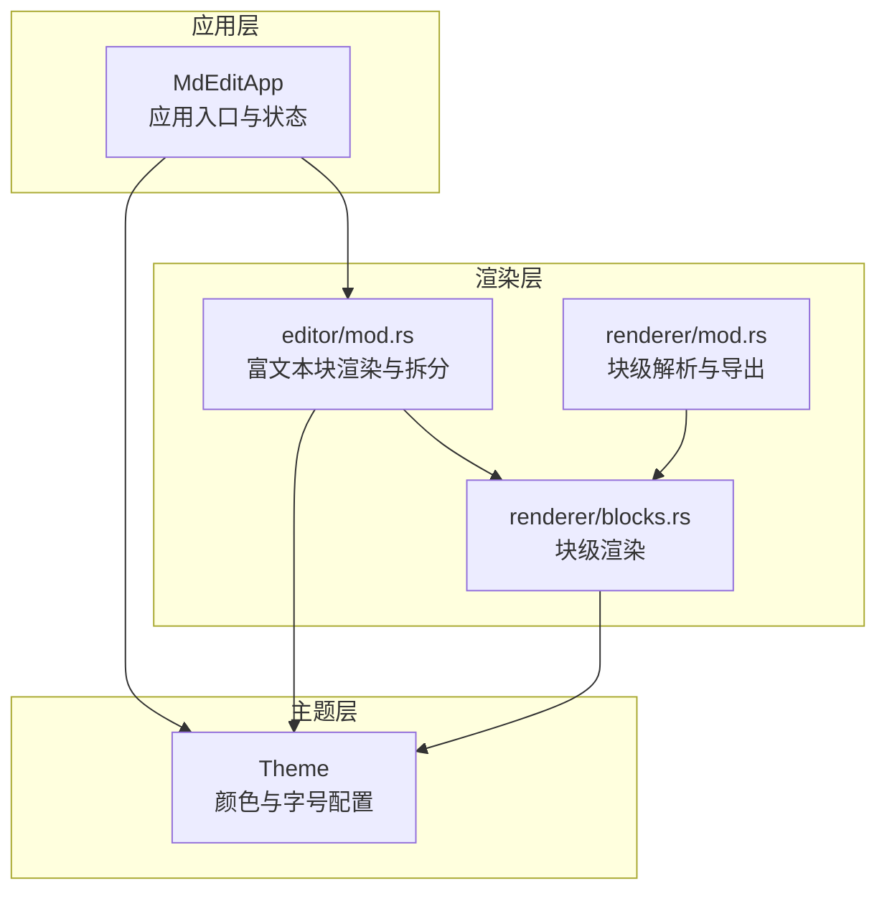
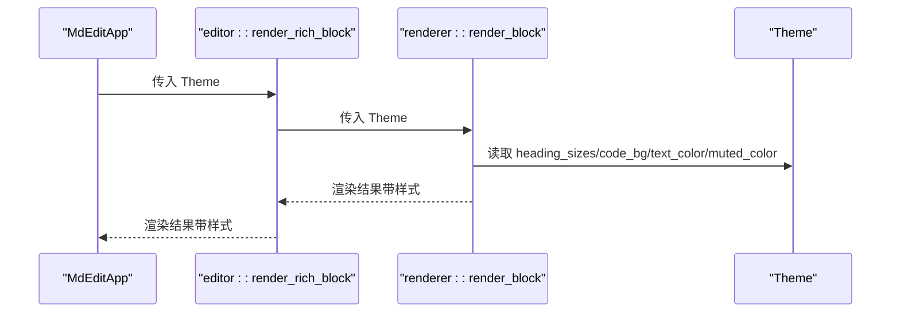
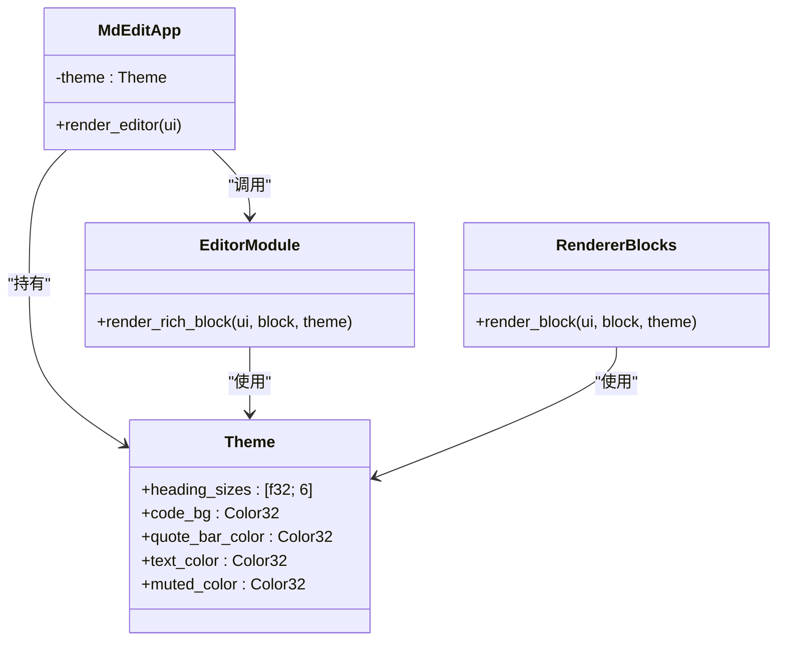
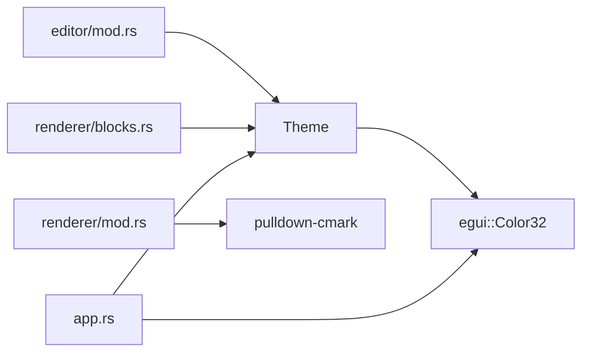

# Theme 模块 API

<cite>
**本文引用的文件**
- [theme.rs](file://src/theme.rs)
- [app.rs](file://src/app.rs)
- [editor/mod.rs](file://src/editor/mod.rs)
- [renderer/mod.rs](file://src/renderer/mod.rs)
- [renderer/blocks.rs](file://src/renderer/blocks.rs)
- [Cargo.toml](file://Cargo.toml)
- [README.md](file://README.md)
</cite>

## 目录
1. [简介](#简介)
2. [项目结构](#项目结构)
3. [核心组件](#核心组件)
4. [架构总览](#架构总览)
5. [详细组件分析](#详细组件分析)
6. [依赖关系分析](#依赖关系分析)
7. [性能考量](#性能考量)
8. [故障排查指南](#故障排查指南)
9. [结论](#结论)
10. [附录](#附录)

## 简介
本文件为 Theme 模块的完整 API 参考文档，聚焦于主题系统的设计与使用，涵盖以下内容：
- 主题数据结构与字段定义（颜色与字号）
- 主题在渲染系统中的应用方式
- 主题切换与动态更新的实现思路
- 跨平台字体与主题适配策略
- 自定义主题创建与扩展建议
- 与渲染系统的集成接口与样式传递机制

该主题系统基于 egui 的 Color32 与 TextStyle，通过 Theme 结构体集中管理视觉属性，并在编辑器与渲染模块中统一消费。

## 项目结构
主题模块位于独立文件中，渲染与编辑模块通过参数注入 Theme 实例，实现样式传递与复用。

图表来源
- [app.rs:19-43](file://src/app.rs#L19-L43)
- [theme.rs:3-21](file://src/theme.rs#L3-L21)
- [editor/mod.rs:159-266](file://src/editor/mod.rs#L159-L266)
- [renderer/mod.rs:19-142](file://src/renderer/mod.rs#L19-L142)
- [renderer/blocks.rs:5-63](file://src/renderer/blocks.rs#L5-L63)

章节来源
- [app.rs:19-43](file://src/app.rs#L19-L43)
- [theme.rs:3-21](file://src/theme.rs#L3-L21)
- [editor/mod.rs:159-266](file://src/editor/mod.rs#L159-L266)
- [renderer/mod.rs:19-142](file://src/renderer/mod.rs#L19-L142)
- [renderer/blocks.rs:5-63](file://src/renderer/blocks.rs#L5-L63)

## 核心组件
- 主题数据结构 Theme
  - 字段
    - heading_sizes: [f32; 6] —— 用于 1~6 级标题的字号数组
    - code_bg: egui::Color32 —— 代码块背景色
    - quote_bar_color: egui::Color32 —— 引用条左侧色块颜色
    - text_color: egui::Color32 —— 文本主色（用于代码与正文）
    - muted_color: egui::Color32 —— 柔化/弱化文本色（如引用）
  - 默认值
    - heading_sizes: [28.0, 24.0, 20.0, 18.0, 16.0, 14.0]
    - code_bg: 灰度 40
    - quote_bar_color: 灰度 100
    - text_color: 灰度 220
    - muted_color: 灰度 140

- 应用初始化中的主题使用
  - 应用在构造时创建默认主题实例，并在渲染富文本块时传入 Theme。

章节来源
- [theme.rs:3-21](file://src/theme.rs#L3-L21)
- [app.rs:34-42](file://src/app.rs#L34-L42)

## 架构总览
主题系统以 Theme 为中心，贯穿编辑器与渲染模块：
- 编辑器负责将 Markdown 文本拆分为富文本块（TextBlock），并在渲染富文本块时传入 Theme。
- 渲染模块（renderer）负责将 Markdown 解析为 Block，并在渲染 Block 时使用 Theme。
- 应用层负责创建 Theme 并将其注入到渲染路径。

图表来源
- [app.rs:307-308](file://src/app.rs#L307-L308)
- [editor/mod.rs:159-266](file://src/editor/mod.rs#L159-L266)
- [renderer/blocks.rs:5-63](file://src/renderer/blocks.rs#L5-L63)
- [theme.rs:3-21](file://src/theme.rs#L3-L21)

## 详细组件分析

### Theme 数据结构与字段定义
- heading_sizes: 数组索引对应标题级别（1~6），按需映射到 egui 的 RichText.size。
- code_bg: 代码块容器填充色。
- quote_bar_color: 引用条左侧细矩形填充色。
- text_color: 代码与正文文本颜色。
- muted_color: 引用等弱化文本颜色。

章节来源
- [theme.rs:3-21](file://src/theme.rs#L3-L21)

### 主题在渲染中的应用
- 块级渲染（renderer/blocks.rs）
  - 标题：根据 heading_sizes[level-1] 设置字号；级别 ≤ 2 时添加分隔线。
  - 代码块：使用 Frame 包裹，填充 code_bg，文本采用 monospace 与 text_color。
  - 引用：绘制左侧细条 rect_filled 使用 quote_bar_color，文本采用 italics 与 muted_color。
- 富文本块渲染（editor/mod.rs）
  - 标题：同上。
  - 代码块：同上。
  - 引用：同上。
  - 列表：列表项前缀标记（有序/无序）与缩进。
  - 表格：Grid 渲染，首行加粗。
  - 分隔线：separator。
  - 空行：增加垂直间距。

章节来源
- [renderer/blocks.rs:5-63](file://src/renderer/blocks.rs#L5-L63)
- [editor/mod.rs:159-266](file://src/editor/mod.rs#L159-L266)

### 主题切换与动态更新机制
- 当前实现
  - 应用在初始化时创建默认 Theme，并在渲染路径中传入使用。
  - 未提供显式的主题切换 API 或运行时动态更新逻辑。
- 实现建议
  - 在应用状态中维护当前 Theme 实例（例如 MdEditApp 中的 theme 字段）。
  - 提供 set_theme 方法或主题变更事件，触发 egui 上下文重绘。
  - 在渲染入口处统一读取当前主题，确保所有 UI 组件使用最新主题。
  - 对于字体与颜色，遵循 egui 的样式与颜色 API，避免硬编码。

章节来源
- [app.rs:13-16](file://src/app.rs#L13-L16)
- [app.rs:38](file://src/app.rs#L38)

### 跨平台主题适配与系统主题跟随
- 字体适配
  - 应用在初始化时根据目标操作系统选择合适的 CJK 字体路径，并注册到 egui 的字体族（Proportional 与 Monospace）。
  - 该机制与主题颜色无关，但影响整体视觉一致性。
- 系统主题跟随
  - 当前未实现系统深浅主题跟随逻辑。
  - 建议方案
    - 读取系统主题偏好（可通过 egui 的系统设置或平台 API 获取）。
    - 定义浅色与深色两套 Theme，默认值互为镜像。
    - 在应用启动或系统主题变化时切换 Theme，并触发重绘。

章节来源
- [app.rs:45-84](file://src/app.rs#L45-L84)

### 自定义主题创建与扩展
- 创建自定义主题
  - 基于 Theme 结构体，自定义 heading_sizes、code_bg、quote_bar_color、text_color、muted_color。
  - 将自定义 Theme 注入到渲染路径（编辑器与渲染模块均接收 Theme 参数）。
- 扩展建议
  - 增加更多视觉属性（如链接色、强调色、边框色等）。
  - 提供主题工厂函数（如 light_theme、dark_theme）。
  - 支持主题序列化/反序列化，便于持久化与分享。

章节来源
- [theme.rs:3-21](file://src/theme.rs#L3-L21)
- [editor/mod.rs:159-266](file://src/editor/mod.rs#L159-L266)
- [renderer/blocks.rs:5-63](file://src/renderer/blocks.rs#L5-L63)

### 主题与渲染系统的集成接口
- 渲染入口
  - editor::render_rich_block(ui, block, theme)
  - renderer::render_block(ui, block, theme)
- 集成点
  - 应用在渲染编辑器区域时，调用 editor::render_rich_block，并传入当前 Theme。
  - 渲染模块在渲染 Block 时，从 Theme 读取颜色与字号等属性。

图表来源
- [theme.rs:3-21](file://src/theme.rs#L3-L21)
- [app.rs:13-16](file://src/app.rs#L13-L16)
- [app.rs:307-308](file://src/app.rs#L307-L308)
- [editor/mod.rs:159-266](file://src/editor/mod.rs#L159-L266)
- [renderer/blocks.rs:5-63](file://src/renderer/blocks.rs#L5-L63)

## 依赖关系分析
- 主题依赖
  - Theme 依赖 egui::Color32，用于颜色表示。
- 渲染依赖
  - renderer 与 editor 依赖 Theme，用于字号与颜色。
  - editor 依赖 pulldown-cmark 进行 Markdown 解析。
- 应用依赖
  - 应用依赖 egui 进行 UI 渲染，并在初始化时配置字体。

图表来源
- [theme.rs:1-2](file://src/theme.rs#L1-L2)
- [renderer/mod.rs:7](file://src/renderer/mod.rs#L7)
- [editor/mod.rs:1-2](file://src/editor/mod.rs#L1-L2)
- [renderer/blocks.rs:1-3](file://src/renderer/blocks.rs#L1-L3)
- [app.rs:3](file://src/app.rs#L3)

章节来源
- [Cargo.toml:8-13](file://Cargo.toml#L8-L13)
- [theme.rs:1-2](file://src/theme.rs#L1-L2)
- [renderer/mod.rs:7](file://src/renderer/mod.rs#L7)
- [editor/mod.rs:1-2](file://src/editor/mod.rs#L1-L2)
- [renderer/blocks.rs:1-3](file://src/renderer/blocks.rs#L1-L3)
- [app.rs:3](file://src/app.rs#L3)

## 性能考量
- 主题访问
  - Theme 为小对象，按值传递即可，开销极低。
- 渲染路径
  - 渲染时仅读取 Theme 字段，不涉及复杂计算。
- 字体加载
  - 字体在应用初始化阶段一次性加载并缓存，后续渲染无需重复 IO。

[本节为通用性能讨论，不直接分析具体文件]

## 故障排查指南
- 字体显示异常（CJK 文本乱码）
  - 检查平台字体路径是否正确，确认字体文件存在且可读。
  - 确认字体已注册到 egui 的 Proportional 与 Monospace 家族。
- 主题颜色不生效
  - 确认渲染路径确实传入了当前 Theme。
  - 检查 egui 版本与 Color32 使用方式是否匹配。
- 主题切换无效
  - 确认应用在切换主题后触发了 egui 上下文重绘。
  - 检查主题实例是否被替换或克隆后未更新引用。

章节来源
- [app.rs:45-84](file://src/app.rs#L45-L84)
- [app.rs:307-308](file://src/app.rs#L307-L308)

## 结论
Theme 模块提供了简洁而强大的主题配置能力，通过集中化的颜色与字号管理，实现了在编辑器与渲染模块中的统一视觉风格。当前实现未包含显式的主题切换 API，建议在应用状态中维护 Theme，并在需要时触发重绘。同时，可扩展更多视觉属性并引入系统主题跟随机制，以提升跨平台一致性与用户体验。

[本节为总结性内容，不直接分析具体文件]

## 附录

### API 一览（按模块）
- Theme
  - 字段
    - heading_sizes: [f32; 6]
    - code_bg: egui::Color32
    - quote_bar_color: egui::Color32
    - text_color: egui::Color32
    - muted_color: egui::Color32
  - 默认值
    - heading_sizes: [28.0, 24.0, 20.0, 18.0, 16.0, 14.0]
    - code_bg: 灰度 40
    - quote_bar_color: 灰度 100
    - text_color: 灰度 220
    - muted_color: 灰度 140

- editor::render_rich_block(ui, block, theme)
  - 用途：渲染富文本块（标题、段落、代码块、引用、列表、表格、分隔线、空行）
  - 输入：egui::Ui、TextBlock、Theme
  - 输出：渲染后的 UI 元素

- renderer::render_block(ui, block, theme)
  - 用途：渲染块级元素（标题、段落、代码块、引用、列表、分隔线）
  - 输入：egui::Ui、Block、Theme
  - 输出：渲染后的 UI 元素

- 应用初始化中的字体配置
  - 用途：按平台选择 CJK 字体并注册到 egui
  - 输入：egui::Context
  - 输出：设置字体后的上下文

章节来源
- [theme.rs:3-21](file://src/theme.rs#L3-L21)
- [editor/mod.rs:159-266](file://src/editor/mod.rs#L159-L266)
- [renderer/blocks.rs:5-63](file://src/renderer/blocks.rs#L5-L63)
- [app.rs:45-84](file://src/app.rs#L45-L84)

### 实际使用示例（步骤说明）
- 创建自定义主题
  - 步骤
    - 定义新的 Theme 实例，设置 heading_sizes、code_bg、quote_bar_color、text_color、muted_color。
    - 在应用初始化时替换默认 Theme。
    - 在渲染入口（render_editor）中传入新 Theme。
- 实现主题切换
  - 步骤
    - 在应用状态中维护 Theme 字段。
    - 提供切换函数，更新当前 Theme 并触发 egui 重绘。
    - 在渲染路径中始终使用当前 Theme。
- 跨平台字体与主题适配
  - 步骤
    - 在初始化字体时根据平台选择字体路径。
    - 可选：根据系统主题偏好切换浅/深色 Theme。

章节来源
- [app.rs:34-42](file://src/app.rs#L34-L42)
- [app.rs:307-308](file://src/app.rs#L307-L308)
- [app.rs:45-84](file://src/app.rs#L45-L84)