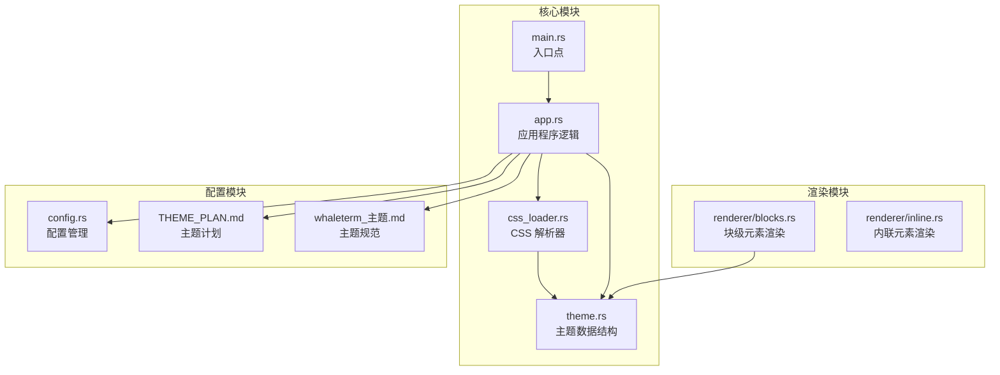
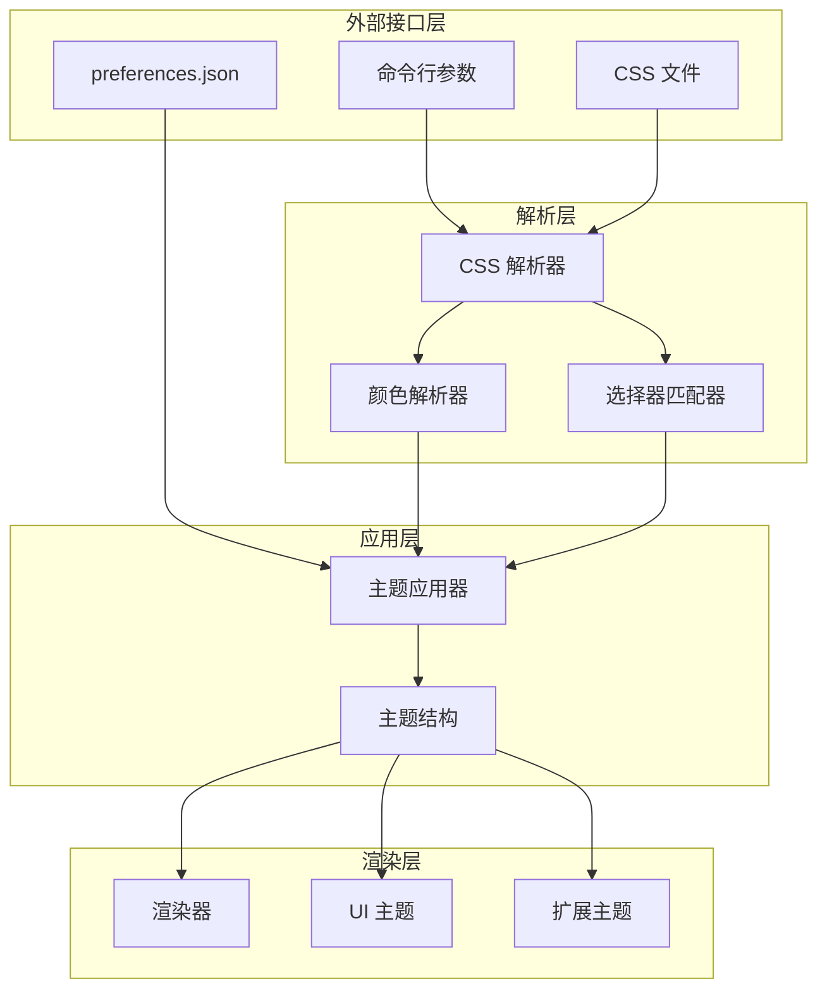
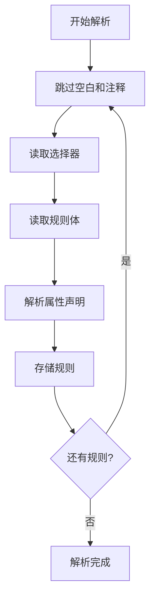
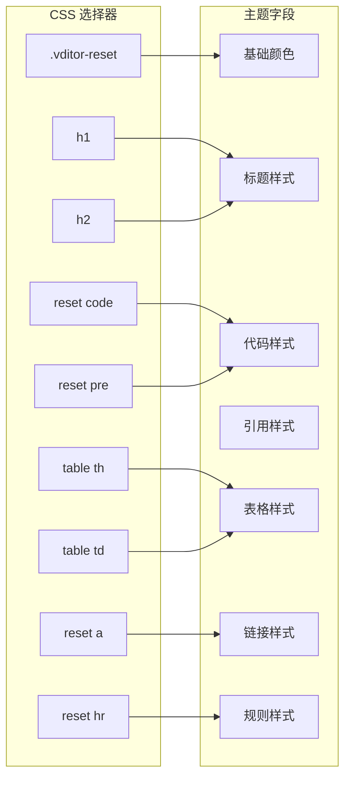
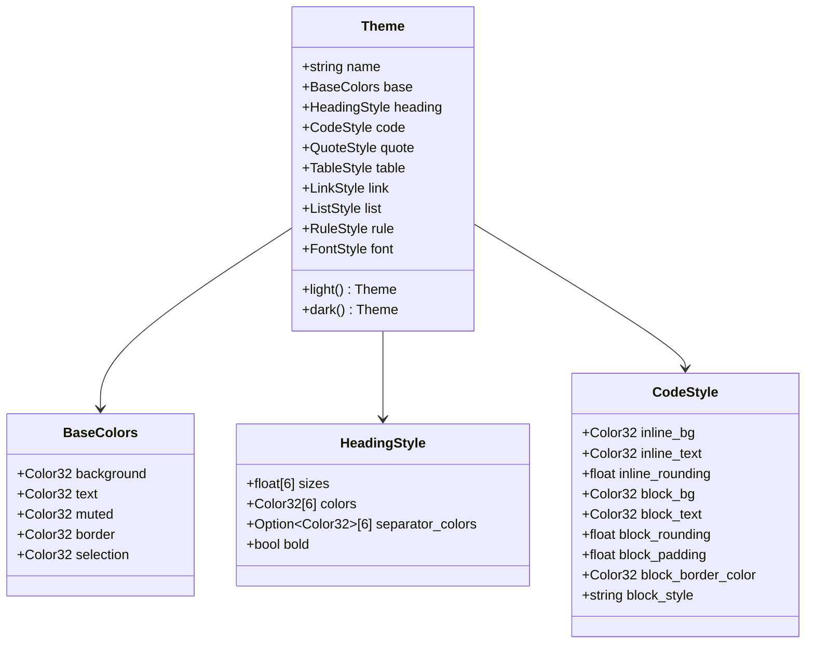
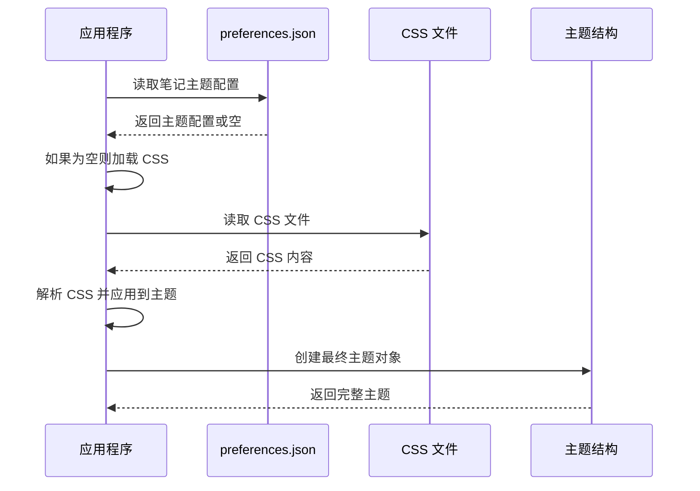
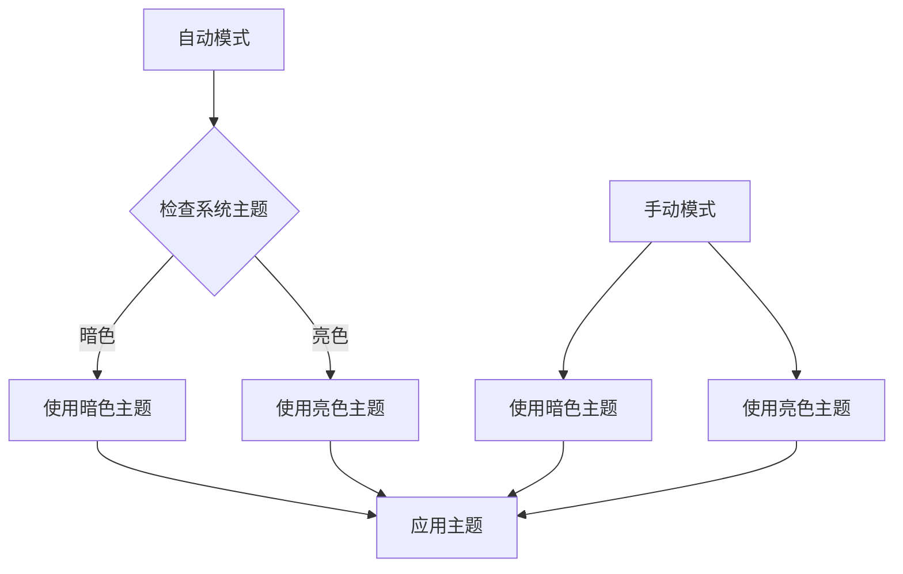
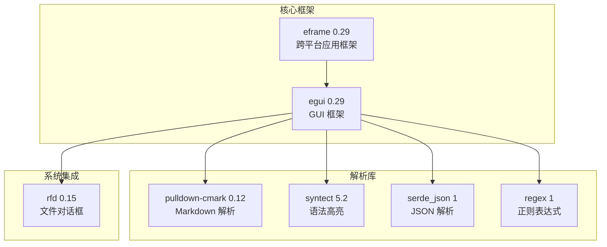
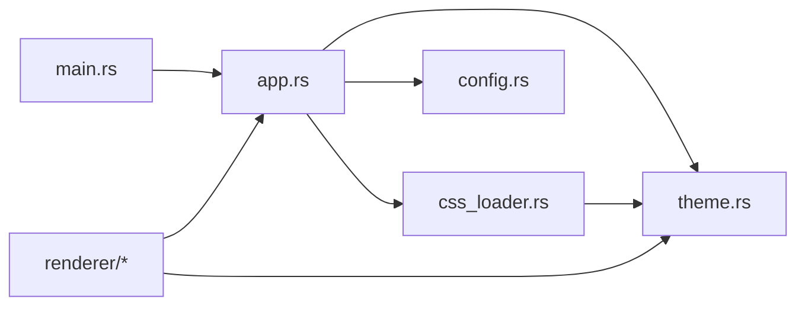
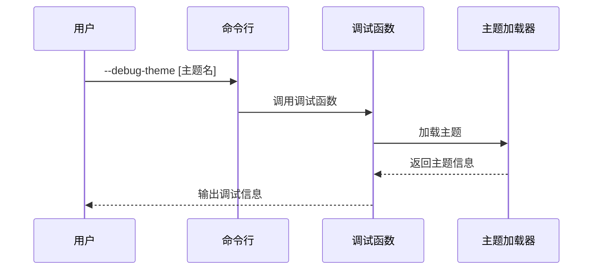

# CSS 主题加载器

<cite>
**本文档引用的文件**
- [css_loader.rs](file://src/css_loader.rs)
- [theme.rs](file://src/theme.rs)
- [main.rs](file://src/main.rs)
- [app.rs](file://src/app.rs)
- [config.rs](file://src/config.rs)
- [blocks.rs](file://src/renderer/blocks.rs)
- [Cargo.toml](file://Cargo.toml)
- [THEME_PLAN.md](file://THEME_PLAN.md)
- [whaleterm_主题.md](file://whaleterm_主题.md)
</cite>

## 目录
1. [简介](#简介)
2. [项目结构](#项目结构)
3. [核心组件](#核心组件)
4. [架构概览](#架构概览)
5. [详细组件分析](#详细组件分析)
6. [依赖关系分析](#依赖关系分析)
7. [性能考虑](#性能考虑)
8. [故障排除指南](#故障排除指南)
9. [结论](#结论)

## 简介

CSS 主题加载器是 mdedit Markdown 编辑器中的一个关键组件，负责从 CSS 文件中解析主题配置，并将其转换为应用内部使用的主题结构。该系统支持动态主题加载、颜色解析、字体处理等功能，为用户提供丰富的视觉体验。

mdedit 是一个基于 Rust 和 egui 框架开发的跨平台 Markdown 编辑器，具有所见即所得的渲染功能。CSS 主题加载器作为其主题系统的核心部分，实现了与 WhaleTerm 主题规范的兼容性。

## 项目结构

项目采用模块化设计，主要包含以下核心模块：

**图表来源**
- [css_loader.rs:1-342](file://src/css_loader.rs#L1-L342)
- [theme.rs:1-320](file://src/theme.rs#L1-L320)
- [app.rs:1-2019](file://src/app.rs#L1-L2019)

**章节来源**
- [Cargo.toml:1-21](file://Cargo.toml#L1-L21)
- [main.rs:1-286](file://src/main.rs#L1-L286)

## 核心组件

### CSS 主题加载器

CSS 主题加载器是整个主题系统的核心，负责将 CSS 文件转换为主题配置。它提供了以下关键功能：

- **CSS 解析**：解析 CSS 规则和属性
- **颜色解析**：支持多种颜色格式（十六进制、RGB、RGBA）
- **主题应用**：将解析的结果应用到主题结构中
- **调试支持**：提供主题调试功能

### 主题数据结构

主题系统定义了完整的主题数据结构，包括：

- **基础颜色**：背景色、文本色、边框色等
- **标题样式**：不同级别的标题颜色和分隔线
- **代码样式**：内联代码和代码块的样式
- **引用样式**：引用块的颜色和边框
- **表格样式**：表格的背景、边框和内边距
- **链接样式**：链接的颜色和下划线
- **列表样式**：列表标记和间距
- **规则样式**：水平分隔线的样式

### 应用程序集成

应用程序通过以下方式集成了主题系统：

- **主题加载优先级**：优先从 preferences.json 加载，回退到 CSS 文件
- **系统主题跟随**：支持自动跟随系统暗色模式
- **实时主题切换**：支持运行时切换主题模式

**章节来源**
- [css_loader.rs:7-342](file://src/css_loader.rs#L7-L342)
- [theme.rs:3-320](file://src/theme.rs#L3-L320)
- [app.rs:223-807](file://src/app.rs#L223-L807)

## 架构概览

CSS 主题加载器采用了分层架构设计，确保了良好的模块分离和可维护性：

**图表来源**
- [css_loader.rs:52-342](file://src/css_loader.rs#L52-L342)
- [app.rs:750-807](file://src/app.rs#L750-L807)

## 详细组件分析

### CSS 解析器

CSS 解析器是主题加载器的核心组件，负责将 CSS 内容转换为可操作的数据结构：

#### 核心功能

1. **CSS 规则解析**：解析 CSS 选择器和属性声明
2. **注释处理**：支持 CSS 注释的跳过和过滤
3. **属性提取**：提取和解析 CSS 属性值
4. **颜色解析**：支持多种颜色格式的解析

#### 解析流程

**图表来源**
- [css_loader.rs:52-130](file://src/css_loader.rs#L52-L130)

#### 颜色解析器

颜色解析器支持多种颜色格式：

- **十六进制颜色**：支持 #RGB 和 #RRGGBB 格式
- **RGB 颜色**：支持 rgb(r, g, b) 格式
- **RGBA 颜色**：支持 rgba(r, g, b, a) 格式
- **边框颜色提取**：从复杂的边框声明中提取颜色

**章节来源**
- [css_loader.rs:155-204](file://src/css_loader.rs#L155-L204)
- [css_loader.rs:214-235](file://src/css_loader.rs#L214-L235)

### 主题应用器

主题应用器负责将解析的 CSS 规则应用到主题结构中：

#### 应用策略

1. **选择器匹配**：优先精确匹配，回退到包含匹配
2. **属性映射**：将 CSS 属性映射到主题字段
3. **默认值处理**：为未设置的属性提供合理的默认值

#### 关键应用规则

**图表来源**
- [css_loader.rs:237-342](file://src/css_loader.rs#L237-L342)

**章节来源**
- [css_loader.rs:237-342](file://src/css_loader.rs#L237-L342)

### 主题数据结构

主题系统定义了完整的数据结构层次：

#### 主题层次结构

**图表来源**
- [theme.rs:3-81](file://src/theme.rs#L3-L81)

**章节来源**
- [theme.rs:3-320](file://src/theme.rs#L3-L320)

### 应用程序集成

应用程序通过多种方式集成了主题系统：

#### 主题加载优先级

**图表来源**
- [app.rs:750-762](file://src/app.rs#L750-L762)

#### 系统主题跟随

应用程序支持自动跟随系统暗色模式：

**图表来源**
- [app.rs:764-786](file://src/app.rs#L764-L786)

**章节来源**
- [app.rs:750-807](file://src/app.rs#L750-L807)

## 依赖关系分析

### 外部依赖

项目使用了以下关键外部依赖：

**图表来源**
- [Cargo.toml:8-16](file://Cargo.toml#L8-L16)

### 内部模块依赖

**图表来源**
- [main.rs:3-14](file://src/main.rs#L3-L14)
- [app.rs:1-28](file://src/app.rs#L1-L28)

**章节来源**
- [Cargo.toml:1-21](file://Cargo.toml#L1-L21)

## 性能考虑

### 解析性能优化

CSS 主题加载器在设计时考虑了性能优化：

1. **增量解析**：使用迭代器和 peekable 模式避免不必要的字符串复制
2. **缓存机制**：主题解析结果可以被缓存以避免重复解析
3. **内存效率**：使用 HashMap 和字符串切片减少内存分配

### 渲染性能

主题系统在渲染层面也考虑了性能：

1. **颜色缓存**：egui 的 Color32 类型支持高效的颜色操作
2. **样式复用**：相似的样式可以共享相同的渲染配置
3. **批量更新**：主题切换时可以批量更新相关的 UI 组件

## 故障排除指南

### 常见问题

#### CSS 文件解析失败

**症状**：主题加载失败，使用默认主题

**解决方案**：
1. 检查 CSS 文件路径是否正确
2. 验证 CSS 语法是否符合标准
3. 确认文件权限是否正确

#### 颜色解析错误

**症状**：颜色显示异常或主题不生效

**解决方案**：
1. 检查颜色格式是否正确（#RGB/#RRGGBB/#RRGGBBAA）
2. 验证颜色值范围（0-255）
3. 确认颜色解析器是否支持所需格式

#### 主题切换问题

**症状**：主题切换后 UI 不更新

**解决方案**：
1. 确认主题切换逻辑是否正确执行
2. 检查 egui 上下文是否正确更新
3. 验证主题状态是否正确保存

### 调试工具

应用程序提供了调试功能：

**图表来源**
- [main.rs:193-205](file://src/main.rs#L193-L205)

**章节来源**
- [main.rs:193-205](file://src/main.rs#L193-L205)

## 结论

CSS 主题加载器为 mdedit 提供了强大而灵活的主题系统。通过模块化的架构设计、完善的错误处理机制和性能优化，该系统能够满足现代 Markdown 编辑器对主题功能的需求。

### 主要优势

1. **模块化设计**：清晰的模块分离便于维护和扩展
2. **多格式支持**：支持多种 CSS 和颜色格式
3. **性能优化**：高效的解析和渲染机制
4. **调试友好**：完善的调试工具和错误处理
5. **规范兼容**：与 WhaleTerm 主题规范完全兼容

### 发展方向

根据主题计划，未来的发展重点包括：

1. **增强主题数据源**：优先从 preferences.json 加载主题配置
2. **扩展 UI 主题字段**：补充更多 UI 组件的颜色配置
3. **支持 RGBA 颜色**：增强颜色解析能力
4. **系统主题跟随**：实现自动跟随系统暗色模式
5. **扩展主题色**：添加额外的主题色彩支持

该主题加载器为 mdedit 提供了坚实的基础，使其能够在视觉体验方面达到专业编辑器的标准。