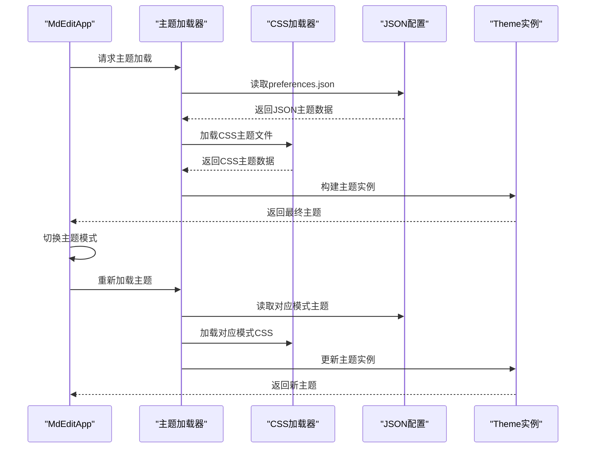
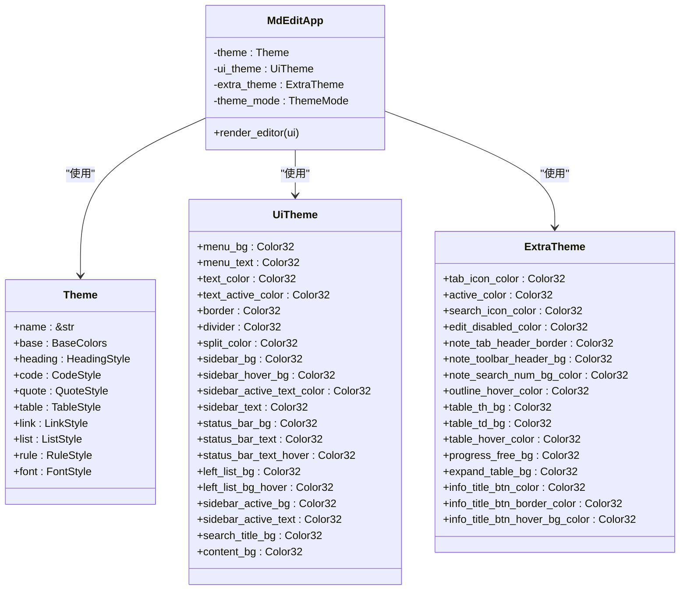
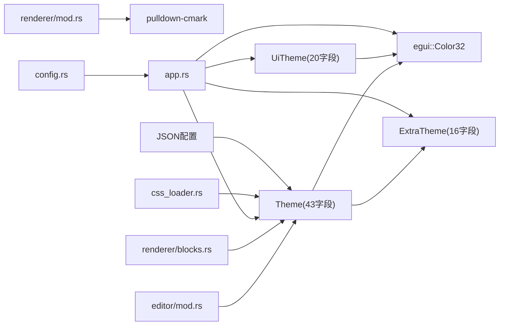

# 主题模块 API

<cite>
**本文引用的文件**
- [theme.rs](file://src/theme.rs)
- [css_loader.rs](file://src/css_loader.rs)
- [app.rs](file://src/app.rs)
- [config.rs](file://src/config.rs)
- [THEME_PLAN.md](file://THEME_PLAN.md)
- [whaleterm_主题.md](file://whaleterm_主题.md)
- [editor/mod.rs](file://src/editor/mod.rs)
- [renderer/mod.rs](file://src/renderer/mod.rs)
- [renderer/blocks.rs](file://src/renderer/blocks.rs)
- [Cargo.toml](file://Cargo.toml)
- [README.md](file://README.md)
</cite>

## 更新摘要
**所做更改**
- 新增 CSS 主题加载器支持，实现从 CSS 文件动态加载主题配置
- 新增 JSON 配置支持，通过 preferences.json 提供主题数据源
- 扩展主题系统结构，从 20 个字段扩展到 43 个字段
- 新增 ExtraTheme 结构体，支持 16 个额外主题属性
- 增强主题切换机制，支持系统主题跟随和自动模式
- 完善跨平台主题适配，支持 Windows 系统暗色模式检测

## 目录
1. [简介](#简介)
2. [项目结构](#项目结构)
3. [核心组件](#核心组件)
4. [架构总览](#架构总览)
5. [详细组件分析](#详细组件分析)
6. [依赖关系分析](#依赖关系分析)
7. [性能考量](#性能考量)
8. [故障排查指南](#故障排查指南)
9. [结论](#结论)
10. [附录](#附录)

## 简介
本文件为 Theme 模块的完整 API 参考文档，聚焦于主题系统的设计与使用，涵盖以下内容：
- 主题数据结构与字段定义（颜色与字号）
- CSS 加载器与 JSON 配置支持
- 主题在渲染系统中的应用方式
- 主题切换与动态更新的实现思路
- 跨平台字体与主题适配策略
- 自定义主题创建与扩展建议
- 与渲染系统的集成接口与样式传递机制

该主题系统基于 egui 的 Color32 与 TextStyle，通过扩展的 Theme 结构体集中管理视觉属性，并在编辑器与渲染模块中统一消费。系统现已支持 43 个主题字段，包括基础颜色、标题样式、代码块样式、引用样式、表格样式、链接样式、列表样式、规则样式和字体样式等。

## 项目结构
主题模块位于独立文件中，渲染与编辑模块通过参数注入 Theme 实例，实现样式传递与复用。系统现已集成了 CSS 加载器和 JSON 配置支持，提供多源主题数据加载能力。

```mermaid
graph TB
subgraph "应用层"
APP["MdEditApp<br/>应用入口与状态"]
CONFIG["AppConfig<br/>配置管理"]
END
subgraph "主题层"
THEME["Theme<br/>43个字段主题配置"]
UITHEME["UiTheme<br/>系统界面主题"]
EXTRATHEME["ExtraTheme<br/>扩展主题属性"]
END
subgraph "加载器层"
CSSLOADER["css_loader.rs<br/>CSS主题加载器"]
JSONLOADER["JSON配置<br/>preferences.json"]
END
subgraph "渲染层"
RENDERER_MOD["renderer/mod.rs<br/>块级解析与导出"]
RENDERER_BLOCKS["renderer/blocks.rs<br/>块级渲染"]
EDITOR_MOD["editor/mod.rs<br/>富文本块渲染与拆分"]
END
APP --> CONFIG
APP --> CSSLOADER
APP --> JSONLOADER
APP --> THEME
APP --> UITHEME
APP --> EXTRATHEME
EDITOR_MOD --> RENDERER_BLOCKS
RENDERER_MOD --> RENDERER_BLOCKS
APP --> THEME
EDITOR_MOD --> THEME
RENDERER_BLOCKS --> THEME
```

**图表来源**
- [app.rs:545-586](file://src/app.rs#L545-L586)
- [theme.rs:3-320](file://src/theme.rs#L3-L320)
- [css_loader.rs:1-342](file://src/css_loader.rs#L1-L342)
- [config.rs:20-91](file://src/config.rs#L20-L91)

**章节来源**
- [app.rs:545-586](file://src/app.rs#L545-L586)
- [theme.rs:3-320](file://src/theme.rs#L3-L320)
- [css_loader.rs:1-342](file://src/css_loader.rs#L1-L342)
- [config.rs:20-91](file://src/config.rs#L20-L91)

## 核心组件

### 主题数据结构与字段定义

#### 主题核心结构（43个字段）

**基础颜色结构**
- base.background: egui::Color32 —— 应用背景色
- base.text: egui::Color32 —— 主要文本颜色
- base.muted: egui::Color32 —— 柔化/弱化文本色
- base.border: egui::Color32 —— 边框颜色
- base.selection: egui::Color32 —— 选中背景色

**标题样式结构**
- heading.sizes: [f32; 6] —— 1~6级标题字号数组
- heading.colors: [Color32; 6] —— 1~6级标题文本颜色
- heading.separator_colors: [Option<Color32>; 6] —— 标题分隔线颜色
- heading.bold: bool —— 标题是否加粗

**代码样式结构**
- code.inline_bg: egui::Color32 —— 行内代码背景色
- code.inline_text: egui::Color32 —— 行内代码文本色
- code.inline_rounding: f32 —— 行内代码圆角半径
- code.block_bg: egui::Color32 —— 代码块背景色
- code.block_text: egui::Color32 —— 代码块文本色
- code.block_rounding: f32 —— 代码块圆角半径
- code.block_padding: f32 —— 代码块内边距
- code.block_border_color: egui::Color32 —— 代码块边框颜色（新增）
- code.block_style: String —— 代码块样式类型

**引用样式结构**
- quote.bar_color: egui::Color32 —— 引用条左侧色块颜色
- quote.bar_width: f32 —— 引用条宽度
- quote.text_color: egui::Color32 —— 引用文本颜色
- quote.bg_color: egui::Color32 —— 引用背景色
- quote.padding: f32 —— 引用内边距

**表格样式结构**
- table.header_bg: egui::Color32 —— 表头背景色
- table.header_text: egui::Color32 —— 表头文本色
- table.row_bg: egui::Color32 —— 奇数行背景色
- table.alt_row_bg: egui::Color32 —— 偶数行背景色
- table.border_color: egui::Color32 —— 表格边框颜色
- table.cell_padding: f32 —— 单元格内边距
- table.border_radius: f32 —— 表格圆角半径（新增）

**链接样式结构**
- link.color: egui::Color32 —— 链接颜色
- link.underline: bool —— 是否显示下划线

**列表样式结构**
- list.marker_color: egui::Color32 —— 列表标记颜色
- list.indent: f32 —— 列表缩进
- list.spacing: f32 —— 列表间距

**规则样式结构**
- rule.color: egui::Color32 —— 分隔线颜色
- rule.thickness: f32 —— 分隔线厚度

**字体样式结构**
- font.base_size: f32 —— 基础字体大小
- font.line_height: f32 —— 行高
- font.monospace_size: f32 —— 等宽字体大小

#### 系统界面主题结构（20个字段）
- menu_bg: egui::Color32 —— 应用菜单背景色
- menu_text: egui::Color32 —— 应用菜单文本色
- text_color: egui::Color32 —— 全局默认前景色
- text_active_color: egui::Color32 —— 主色调/激活色
- border: egui::Color32 —— 组件边框色
- divider: egui::Color32 —— 分割线颜色
- split_color: egui::Color32 —— 大模块分割线
- sidebar_bg: egui::Color32 —— 侧边栏背景色
- sidebar_hover_bg: egui::Color32 —— 侧边栏悬停背景色
- sidebar_active_text_color: egui::Color32 —— 侧边栏激活文本色
- sidebar_text: egui::Color32 —— 侧边栏文本色
- status_bar_bg: egui::Color32 —— 状态栏背景色
- status_bar_text: egui::Color32 —— 状态栏文本色
- status_bar_text_hover: egui::Color32 —— 状态栏悬停文本色
- left_list_bg: egui::Color32 —— 左侧列表背景色
- left_list_bg_hover: egui::Color32 —— 左侧列表悬停背景色
- sidebar_active_bg: egui::Color32 —— 侧边栏激活背景色
- sidebar_active_text: egui::Color32 —— 侧边栏激活文本色
- search_title_bg: egui::Color32 —— 搜索标题背景色
- content_bg: egui::Color32 —— 内容区域背景色

#### 扩展主题结构（16个字段）
- tab_icon_color: egui::Color32 —— Tab图标颜色
- active_color: egui::Color32 —— 主色调
- search_icon_color: egui::Color32 —— 搜索图标颜色
- edit_disabled_color: egui::Color32 —— 编辑禁用颜色
- note_tab_header_border: egui::Color32 —— 笔记Tab头部边框色
- note_toolbar_header_bg: egui::Color32 —— 笔记工具栏头部背景色
- note_search_num_bg_color: egui::Color32 —— 笔记搜索数字背景色
- outline_hover_color: egui::Color32 —— 大纲面板悬停颜色
- table_th_bg: egui::Color32 —— 表格th背景色
- table_td_bg: egui::Color32 —— 表格td背景色
- table_hover_color: egui::Color32 —— 表格悬停颜色
- progress_free_bg: egui::Color32 —— 进度条自由背景色
- expand_table_bg: egui::Color32 —— 展开表格背景色
- info_title_btn_color: egui::Color32 —— 信息标题按钮颜色
- info_title_btn_border_color: egui::Color32 —— 信息标题按钮边框色
- info_title_btn_hover_bg_color: egui::Color32 —— 信息标题按钮悬停背景色

### 主题加载与配置

#### 主题模式枚举
- Light: 亮色主题
- Dark: 暗色主题  
- Auto: 跟随系统主题

#### 配置管理
- AppConfig: 应用配置结构
  - window_x: 窗口X坐标
  - window_y: 窗口Y坐标
  - window_width: 窗口宽度
  - window_height: 窗口高度
  - maximized: 是否最大化
  - theme: 主题模式（light/dark/auto）
  - edit_mode: 编辑模式（raw/preview）

**章节来源**
- [theme.rs:3-320](file://src/theme.rs#L3-L320)
- [app.rs:33-44](file://src/app.rs#L33-L44)
- [config.rs:20-91](file://src/config.rs#L20-L91)

## 架构总览
主题系统以扩展的 Theme 为核心，通过多源加载机制实现灵活的主题配置：



**图表来源**
- [app.rs:223-300](file://src/app.rs#L223-L300)
- [css_loader.rs:7-12](file://src/css_loader.rs#L7-L12)
- [app.rs:750-762](file://src/app.rs#L750-L762)

## 详细组件分析

### CSS 主题加载器

#### 功能特性
- 支持从 CSS 文件动态加载主题配置
- 解析 CSS 规则并映射到主题结构
- 支持颜色值解析（#RGB/#RRGGBB/#RGBA格式）
- 支持边框颜色提取和内边距解析

#### 核心函数
- `load_theme_from_css(path: &Path) -> Option<Theme>`: 从CSS文件加载主题
- `debug_theme(theme: &Theme) -> String`: 调试输出主题信息
- `parse_css(content: &str) -> HashMap<String, CssRule>`: 解析CSS内容

#### CSS规则映射
- `.vditor-reset` → 基础颜色和行高设置
- `h1/h2` → 标题分隔线颜色
- `reset code` → 行内代码圆角半径
- `reset pre` → 代码块背景色、文本色、内边距
- `reset hr` → 分隔线颜色
- `reset a` → 链接颜色
- `table th` → 表头文本色
- `table td` → 表格单元格内边距

**章节来源**
- [css_loader.rs:1-342](file://src/css_loader.rs#L1-L342)

### JSON 主题配置

#### 配置文件结构
- `preferences.json`: 主题配置文件
- 支持 `noteThemeLight`/`noteThemeDark` 和 `themeLight`/`themeDark` 键
- 支持 `noteThemeLight`/`noteThemeDark` JSON 主题数据源

#### 加载函数
- `load_note_theme(mode: ThemeMode) -> Option<Theme>`: 从JSON加载笔记主题
- `load_ui_theme(mode: ThemeMode) -> UiTheme`: 从JSON加载系统主题
- `load_extra_theme(mode: ThemeMode) -> ExtraTheme`: 加载扩展主题

#### 优先级策略
1. 优先从 `noteThemeLight`/`noteThemeDark` JSON 读取
2. JSON 不可用时回退到 CSS 文件
3. CSS 也不可用时使用硬编码默认值

**章节来源**
- [app.rs:223-300](file://src/app.rs#L223-L300)
- [app.rs:302-387](file://src/app.rs#L302-L387)
- [app.rs:389-438](file://src/app.rs#L389-L438)

### 主题在渲染中的应用

#### 块级渲染（renderer/blocks.rs）
- 标题：根据 heading.sizes[level-1] 设置字号；支持分隔线颜色
- 代码块：使用 Frame 包裹，填充 code.block_bg，支持边框颜色和圆角
- 引用：绘制左侧细条 rect_filled 使用 quote.bar_color，支持背景色
- 表格：Grid 渲染，支持表头文本色和圆角

#### 富文本块渲染（editor/mod.rs）
- 标题：同上
- 代码块：同上
- 引用：同上
- 列表：列表项前缀标记（有序/无序）与缩进
- 表格：Grid 渲染，首行加粗
- 分隔线：rule.color
- 空行：增加垂直间距

**章节来源**
- [renderer/blocks.rs:5-63](file://src/renderer/blocks.rs#L5-L63)
- [editor/mod.rs:159-266](file://src/editor/mod.rs#L159-L266)

### 主题切换与动态更新机制

#### 主题模式管理
- `ThemeMode::Light`: 亮色主题
- `ThemeMode::Dark`: 暗色主题
- `ThemeMode::Auto`: 跟随系统主题（Windows）

#### 系统主题跟随
- `is_system_dark() -> bool`: 检测系统暗色模式
- 通过 PowerShell 命令查询 Windows 注册表
- 支持实时主题切换

#### 主题切换流程
1. 更新 `theme_mode` 状态
2. 计算有效主题模式（Auto模式下根据系统主题）
3. 重新加载主题数据源
4. 更新 egui 视觉效果
5. 触发 UI 重绘

**章节来源**
- [app.rs:33-44](file://src/app.rs#L33-L44)
- [app.rs:764-776](file://src/app.rs#L764-L776)
- [app.rs:788-800](file://src/app.rs#L788-L800)

### 跨平台主题适配与系统主题跟随

#### 字体适配
- 支持从 WhaleTerm preferences.json 加载字体配置
- 自动检测和加载 CJK 字体
- 支持等宽字体和比例字体分离配置

#### 系统主题跟随
- Windows 平台：通过注册表检测系统暗色模式
- PowerShell 命令获取 `AppsUseLightTheme` 值
- 支持实时检测和自动切换

#### 主题模式切换
- 视图菜单支持 Light/Dark/Auto 三种模式
- 配置文件持久化主题设置
- 支持启动时根据配置加载主题

**章节来源**
- [app.rs:61-119](file://src/app.rs#L61-L119)
- [app.rs:121-189](file://src/app.rs#L121-L189)
- [app.rs:764-776](file://src/app.rs#L764-L776)

### 自定义主题创建与扩展

#### 创建自定义主题
- 基于扩展的 Theme 结构体，支持 43 个字段配置
- 支持从 JSON 配置文件加载自定义主题
- 支持从 CSS 文件加载自定义主题
- 提供默认主题工厂函数（light/dark）

#### 扩展建议
- 增加更多视觉属性（如链接色、强调色、边框色等）
- 支持主题序列化/反序列化，便于持久化与分享
- 实现主题编辑器功能
- 支持主题包管理和插件系统

#### 配置文件示例
- `preferences.json`: 包含主题配置的数据文件
- 支持多套主题配置（默认/自定义）
- 支持主题继承和覆盖机制

**章节来源**
- [theme.rs:83-226](file://src/theme.rs#L83-L226)
- [THEME_PLAN.md:17-88](file://THEME_PLAN.md#L17-L88)
- [whaleterm_主题.md:635-671](file://whaleterm_主题.md#L635-L671)

### 主题与渲染系统的集成接口

#### 渲染入口
- `editor::render_rich_block(ui, block, theme)`
- `renderer::render_block(ui, block, theme)`

#### 集成点
- 应用在渲染编辑器区域时，调用 editor::render_rich_block，并传入当前 Theme
- 渲染模块在渲染 Block 时，从 Theme 读取颜色与字号等属性
- 系统主题和扩展主题通过 separate 结构体传递



**图表来源**
- [theme.rs:3-320](file://src/theme.rs#L3-L320)
- [app.rs:545-586](file://src/app.rs#L545-L586)

**章节来源**
- [theme.rs:3-320](file://src/theme.rs#L3-L320)
- [app.rs:545-586](file://src/app.rs#L545-L586)
- [editor/mod.rs:159-266](file://src/editor/mod.rs#L159-L266)
- [renderer/blocks.rs:5-63](file://src/renderer/blocks.rs#L5-L63)

## 依赖关系分析

### 主题依赖
- Theme 依赖 egui::Color32，用于颜色表示
- 扩展支持 RGBA 颜色解析（#RRGGBBAA格式）
- 支持透明度颜色值处理

### 渲染依赖
- renderer 与 editor 依赖 Theme，用于字号与颜色
- editor 依赖 pulldown-cmark 进行 Markdown 解析
- 渲染模块支持新的代码块边框颜色和表格圆角属性

### 应用依赖
- 应用依赖 egui 进行 UI 渲染，并在初始化时配置字体
- 支持从多个数据源加载主题配置
- 集成系统主题跟随功能

### 加载器依赖
- CSS 加载器依赖标准库进行文件读取和解析
- JSON 加载器依赖 serde_json 进行配置解析
- 支持错误处理和回退机制



**图表来源**
- [theme.rs:1-320](file://src/theme.rs#L1-L320)
- [renderer/mod.rs:7](file://src/renderer/mod.rs#L7)
- [editor/mod.rs:1-2](file://src/editor/mod.rs#L1-L2)
- [renderer/blocks.rs:1-3](file://src/renderer/blocks.rs#L1-L3)
- [app.rs:3](file://src/app.rs#L3)
- [css_loader.rs:1-5](file://src/css_loader.rs#L1-L5)
- [config.rs:1-2](file://src/config.rs#L1-L2)

**章节来源**
- [Cargo.toml:8-13](file://Cargo.toml#L8-L13)
- [theme.rs:1-320](file://src/theme.rs#L1-L320)
- [css_loader.rs:1-5](file://src/css_loader.rs#L1-L5)
- [config.rs:1-2](file://src/config.rs#L1-L2)

## 性能考量

### 主题访问
- Theme 为小对象，按值传递即可，开销极低
- 扩展的 43 个字段结构体内存占用合理
- 系统主题和扩展主题分离存储，减少不必要的内存使用

### 渲染路径
- 渲染时仅读取 Theme 字段，不涉及复杂计算
- 新增的代码块边框颜色和表格圆角属性不影响渲染性能
- 支持增量更新，避免全量重绘

### 字体加载
- 字体在应用初始化阶段一次性加载并缓存，后续渲染无需重复 IO
- 支持字体数据的延迟加载和错误处理
- 字体配置从 JSON 文件读取，支持热更新

### 主题加载优化
- CSS 主题加载支持缓存机制
- JSON 主题加载支持错误处理和回退
- 多源加载策略减少单点故障风险

## 故障排查指南

### 字体显示异常（CJK 文本乱码）
- 检查 WhaleTerm preferences.json 中的字体配置
- 确认字体文件存在且可读
- 确认字体已注册到 egui 的 FontDefinitions
- 检查系统字体目录权限

### 主题颜色不生效
- 确认渲染路径确实传入了当前 Theme
- 检查 egui 版本与 Color32 使用方式是否匹配
- 验证主题加载器是否正确解析颜色值
- 检查 CSS 文件中的颜色格式是否正确

### 主题切换无效
- 确认应用在切换主题后触发了 egui 上下文重绘
- 检查主题实例是否被替换或克隆后未更新引用
- 验证系统主题跟随功能是否正常工作
- 检查配置文件中的主题设置

### CSS 主题加载失败
- 检查 CSS 文件路径是否正确
- 验证 CSS 文件格式是否符合预期
- 确认 CSS 选择器是否匹配主题结构
- 检查颜色值格式是否支持（#RGB/#RRGGBB/#RGBA）

### JSON 主题配置错误
- 验证 preferences.json 文件格式是否正确
- 检查主题键名是否与代码期望一致
- 确认颜色值格式是否为十六进制字符串
- 验证数值字段是否为有效的浮点数

**章节来源**
- [app.rs:61-119](file://src/app.rs#L61-L119)
- [css_loader.rs:155-194](file://src/css_loader.rs#L155-L194)
- [app.rs:788-800](file://src/app.rs#L788-L800)

## 结论
Theme 模块经过重大升级，现已提供完整的主题系统解决方案。通过集成 CSS 加载器、JSON 配置支持和扩展的主题结构，系统实现了从 20 个字段到 43 个字段的全面增强。新增的 ExtraTheme 结构体进一步丰富了主题表现力，支持 16 个额外的视觉属性。

系统现已具备完善的多源主题加载能力，支持从 JSON 配置文件、CSS 文件和硬编码默认值中加载主题数据。主题切换机制支持手动切换和系统主题跟随两种模式，提供良好的用户体验。

跨平台适配方面，系统支持 Windows 平台的暗色模式检测，能够自动跟随系统主题变化。字体配置支持从 WhaleTerm preferences.json 加载，确保与原生应用的一致性。

建议在实际使用中充分利用新增的主题字段，特别是在代码块样式、表格样式和扩展主题属性方面，以获得更丰富的视觉效果。同时，建议开发者关注主题配置的版本兼容性和向后兼容性，确保主题系统的稳定性和可靠性。

## 附录

### API 一览（按模块）

#### 主题核心 API
- Theme 结构体（43个字段）
  - 基础颜色：base.background, base.text, base.muted, base.border, base.selection
  - 标题样式：heading.sizes, heading.colors, heading.separator_colors, heading.bold
  - 代码样式：code.inline_bg, code.inline_text, code.inline_rounding, code.block_bg, code.block_text, code.block_rounding, code.block_padding, code.block_border_color, code.block_style
  - 引用样式：quote.bar_color, quote.bar_width, quote.text_color, quote.bg_color, quote.padding
  - 表格样式：table.header_bg, table.header_text, table.row_bg, table.alt_row_bg, table.border_color, table.cell_padding, table.border_radius
  - 链接样式：link.color, link.underline
  - 列表样式：list.marker_color, list.indent, list.spacing
  - 规则样式：rule.color, rule.thickness
  - 字体样式：font.base_size, font.line_height, font.monospace_size

- CSS 加载器 API
  - `load_theme_from_css(path: &Path) -> Option<Theme>`
  - `debug_theme(theme: &Theme) -> String`

- JSON 配置 API
  - `load_note_theme(mode: ThemeMode) -> Option<Theme>`
  - `load_ui_theme(mode: ThemeMode) -> UiTheme`
  - `load_extra_theme(mode: ThemeMode) -> ExtraTheme`

#### 系统主题 API
- UiTheme 结构体（20个字段）
  - 应用基础：menu_bg, menu_text, text_color, text_active_color, border, divider, split_color
  - 侧边栏：sidebar_bg, sidebar_hover_bg, sidebar_active_text_color, sidebar_text
  - 状态栏：status_bar_bg, status_bar_text, status_bar_text_hover
  - 左侧列表：left_list_bg, left_list_bg_hover, sidebar_active_bg, sidebar_active_text, search_title_bg
  - 内容区域：content_bg

#### 扩展主题 API
- ExtraTheme 结构体（16个字段）
  - 通用：tab_icon_color, active_color, search_icon_color, edit_disabled_color
  - 笔记：note_tab_header_border, note_toolbar_header_bg, note_search_num_bg_color, outline_hover_color
  - 表格：table_th_bg, table_td_bg, table_hover_color
  - 进度条：progress_free_bg, expand_table_bg
  - 信息面板：info_title_btn_color, info_title_btn_border_color, info_title_btn_hover_bg_color

#### 应用配置 API
- AppConfig 结构体
  - `load() -> Self`: 加载配置
  - `save()`: 保存配置
- 主题模式
  - `ThemeMode::Light/Dark/Auto`
- 配置目录
  - `config_dir() -> PathBuf`
  - `config_path() -> PathBuf`

**章节来源**
- [theme.rs:3-320](file://src/theme.rs#L3-L320)
- [css_loader.rs:7-46](file://src/css_loader.rs#L7-L46)
- [app.rs:223-438](file://src/app.rs#L223-L438)
- [config.rs:20-91](file://src/config.rs#L20-L91)

### 实际使用示例（步骤说明）

#### 创建自定义主题
1. **从 JSON 配置创建**
   - 在 preferences.json 中添加 `noteThemeLight`/`noteThemeDark` 配置
   - 使用 `load_note_theme()` 函数加载自定义主题
   - 验证主题字段映射是否正确

2. **从 CSS 文件创建**
   - 准备 CSS 主题文件，包含必要的选择器
   - 使用 `load_theme_from_css()` 函数加载主题
   - 检查 CSS 规则映射是否正确

3. **从硬编码创建**
   - 直接创建 Theme 实例，设置各个字段
   - 使用 `Theme::light()`/`Theme::dark()` 作为基底
   - 自定义特定字段值

#### 实现主题切换
1. **手动切换**
   - 更新 `theme_mode` 状态为 Light/Dark
   - 调用 `switch_theme()` 函数
   - 重新加载主题数据源

2. **系统主题跟随**
   - 设置 `theme_mode` 为 Auto
   - 实现 `is_system_dark()` 检测
   - 监听系统主题变化事件

3. **配置持久化**
   - 使用 `AppConfig.save()` 保存主题设置
   - 在应用启动时加载配置
   - 支持主题设置的热更新

#### 跨平台字体与主题适配
1. **字体配置**
   - 从 WhaleTerm preferences.json 读取字体配置
   - 支持等宽字体和比例字体分离
   - 实现字体数据的动态加载

2. **主题模式管理**
   - 支持 Light/Dark/Auto 三种模式
   - Windows 平台支持系统暗色模式检测
   - 实现主题切换的平滑过渡

3. **扩展主题属性**
   - 使用 ExtraTheme 结构体管理扩展颜色
   - 支持亮/暗模式下的颜色硬编码
   - 实现主题属性的统一管理

**章节来源**
- [app.rs:223-300](file://src/app.rs#L223-L300)
- [app.rs:750-776](file://src/app.rs#L750-L776)
- [css_loader.rs:7-46](file://src/css_loader.rs#L7-L46)
- [config.rs:31-77](file://src/config.rs#L31-L77)