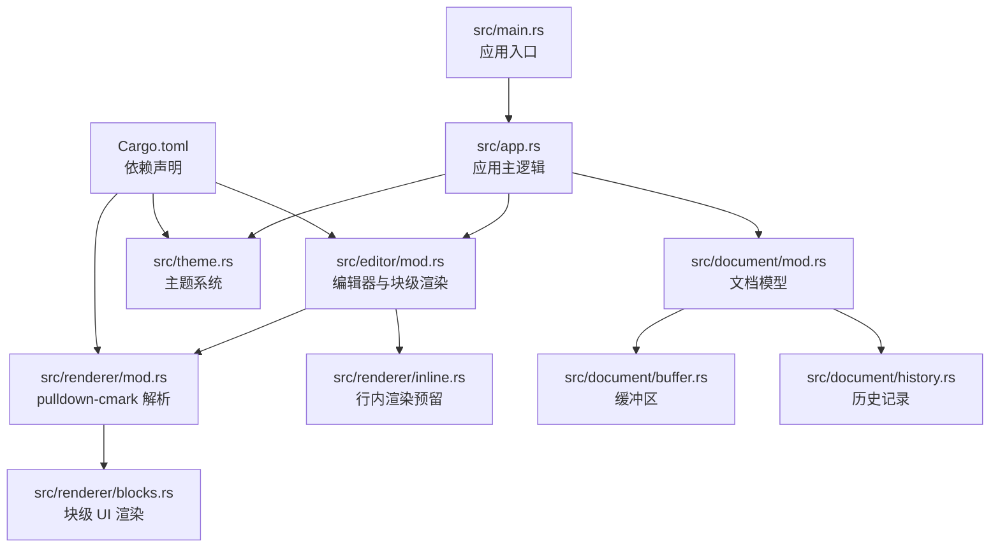
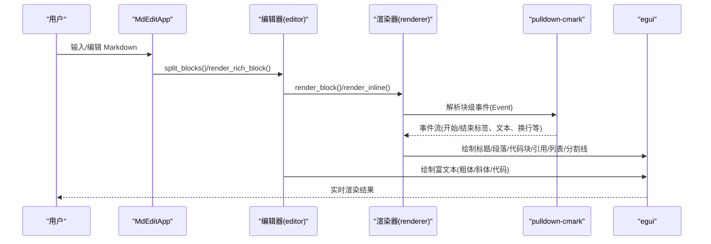
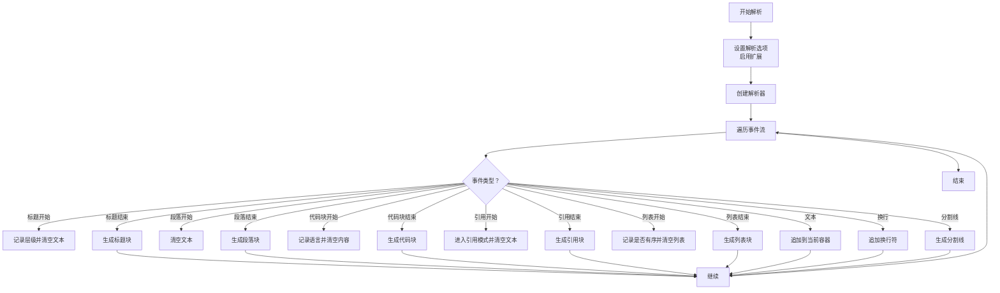
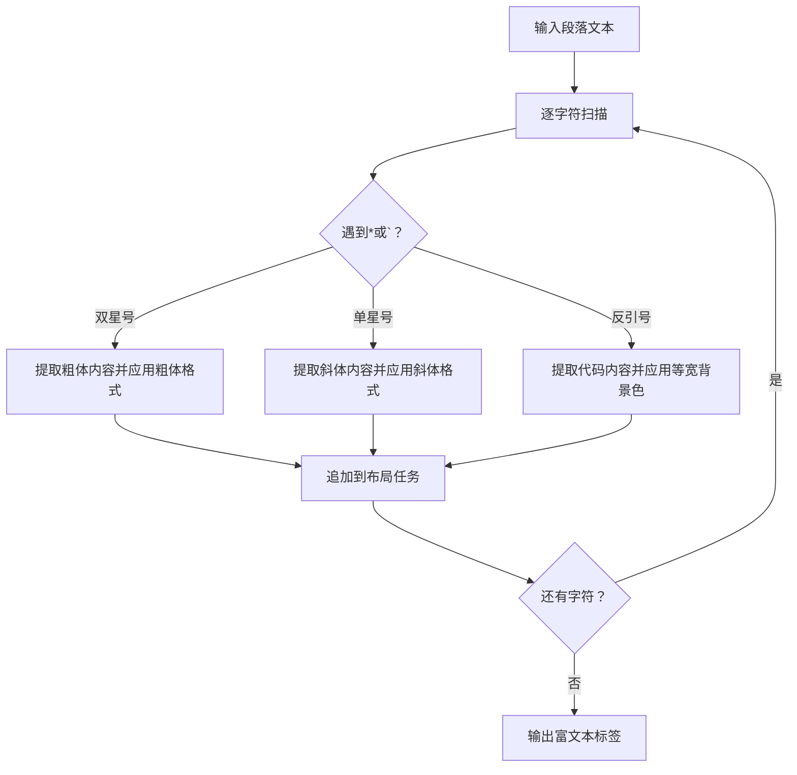
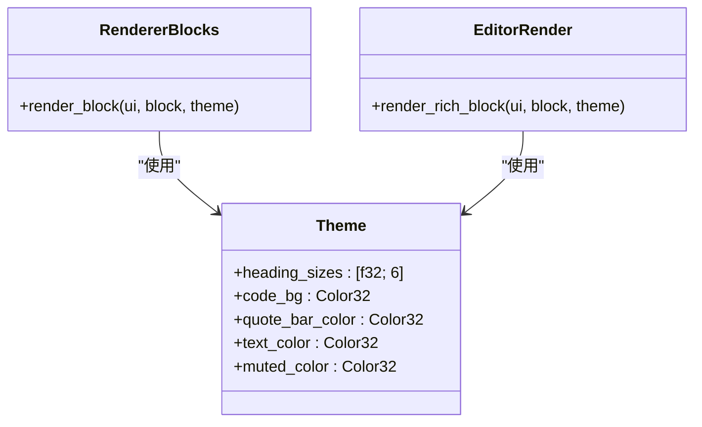
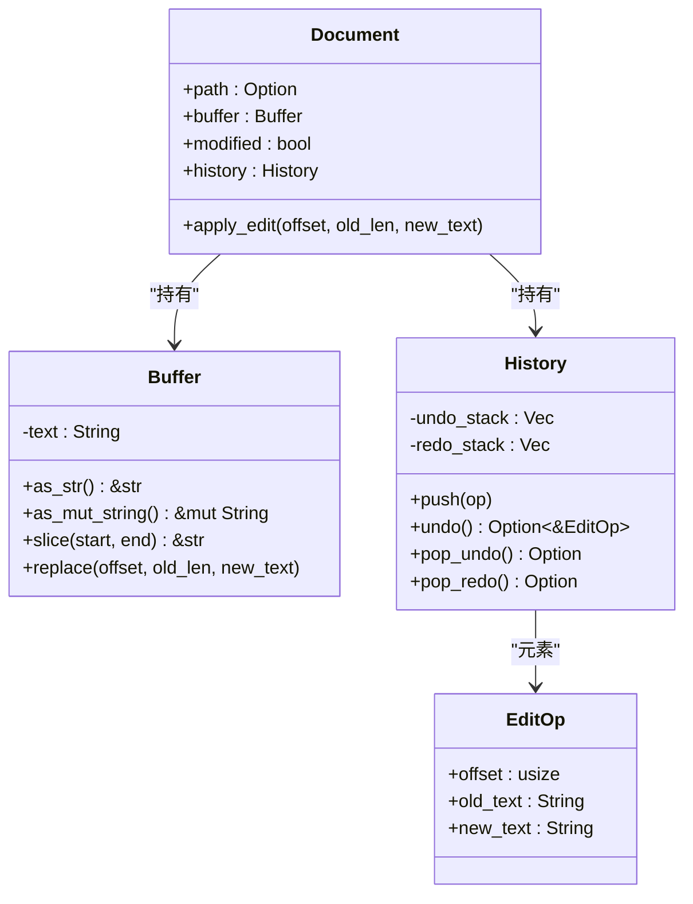
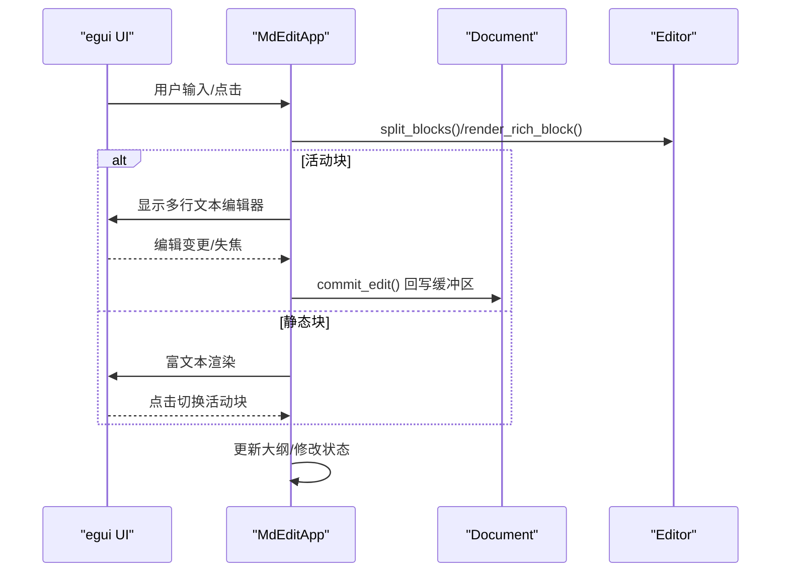
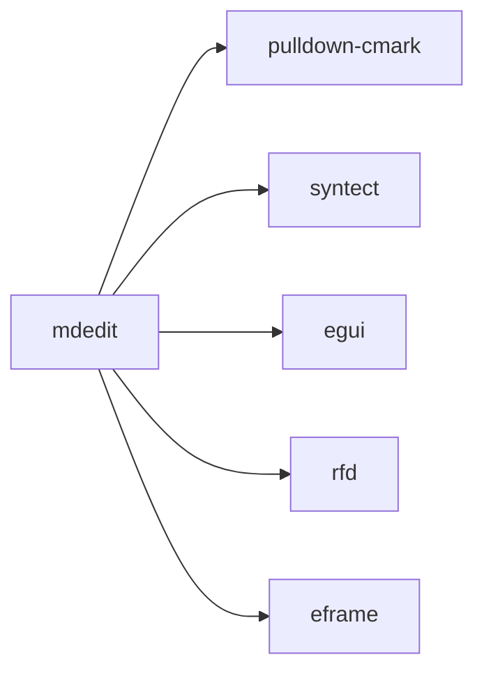

# Markdown 渲染引擎

<cite>
**本文引用的文件**
- [src/main.rs](file://src/main.rs)
- [src/app.rs](file://src/app.rs)
- [src/theme.rs](file://src/theme.rs)
- [src/renderer/mod.rs](file://src/renderer/mod.rs)
- [src/renderer/blocks.rs](file://src/renderer/blocks.rs)
- [src/renderer/inline.rs](file://src/renderer/inline.rs)
- [src/editor/mod.rs](file://src/editor/mod.rs)
- [src/document/mod.rs](file://src/document/mod.rs)
- [src/document/buffer.rs](file://src/document/buffer.rs)
- [src/document/history.rs](file://src/document/history.rs)
- [Cargo.toml](file://Cargo.toml)
- [README.md](file://README.md)
</cite>

## 目录
1. [简介](#简介)
2. [项目结构](#项目结构)
3. [核心组件](#核心组件)
4. [架构总览](#架构总览)
5. [详细组件分析](#详细组件分析)
6. [依赖关系分析](#依赖关系分析)
7. [性能考虑](#性能考虑)
8. [故障排查指南](#故障排查指南)
9. [结论](#结论)
10. [附录](#附录)

## 简介
本项目是一个轻量级跨平台 Markdown 编辑器，采用“所见即所得（WYSIWYG）”渲染方式，不依赖 WebView2，使用 egui 作为 UI 框架与 pulldown-cmark 作为 Markdown 解析器。渲染层由两部分组成：
- 基于 pulldown-cmark 的块级元素解析与渲染（标题、段落、代码块、引用、列表、分割线等）
- 自定义的行内文本渲染（粗体、斜体、代码片段），用于富文本显示

同时，项目内置主题系统，支持字体与颜色的统一管理；编辑器支持大纲导航、快捷键、历史记录与增量更新。

## 项目结构
项目采用按功能模块划分的组织方式，核心目录与职责如下：
- src/main.rs：应用入口，初始化窗口与生命周期
- src/app.rs：应用主逻辑，负责菜单、面板、编辑器渲染与交互
- src/theme.rs：主题配置，统一管理字号、颜色等视觉参数
- src/renderer/：渲染子系统
  - mod.rs：基于 pulldown-cmark 的块级元素解析与事件收集
  - blocks.rs：块级元素的 UI 渲染（egui）
  - inline.rs：预留的行内渲染工具（当前实现位于 editor/mod.rs 中）
- src/editor/mod.rs：编辑器核心逻辑，包含块级拆分、富文本渲染与行内解析
- src/document/：文档模型与缓冲区、历史记录
- Cargo.toml：依赖声明（含 pulldown-cmark、syntect、egui、eframe 等）

图表来源
- [src/main.rs:1-50](file://src/main.rs#L1-L50)
- [src/app.rs:1-351](file://src/app.rs#L1-L351)
- [src/renderer/mod.rs:1-143](file://src/renderer/mod.rs#L1-L143)
- [src/renderer/blocks.rs:1-68](file://src/renderer/blocks.rs#L1-L68)
- [src/renderer/inline.rs:1-2](file://src/renderer/inline.rs#L1-L2)
- [src/editor/mod.rs:1-349](file://src/editor/mod.rs#L1-L349)
- [src/document/mod.rs:1-51](file://src/document/mod.rs#L1-L51)
- [src/document/buffer.rs:1-30](file://src/document/buffer.rs#L1-L30)
- [src/document/history.rs:1-59](file://src/document/history.rs#L1-L59)
- [src/theme.rs:1-22](file://src/theme.rs#L1-L22)
- [Cargo.toml:1-19](file://Cargo.toml#L1-L19)

章节来源
- [src/main.rs:1-50](file://src/main.rs#L1-L50)
- [src/app.rs:1-351](file://src/app.rs#L1-L351)
- [Cargo.toml:1-19](file://Cargo.toml#L1-L19)

## 核心组件
- 文档模型与缓冲区：提供内容读写、切片与替换能力，支持修改状态标记
- 历史记录：支持撤销/重做，维护操作栈
- 主题系统：集中管理标题字号、代码背景色、引用条颜色、正文与弱化色
- 块级渲染（pulldown-cmark）：解析标题、段落、代码块、引用、列表、分割线等
- 富文本渲染（编辑器）：自定义行内解析（粗体、斜体、代码），用于实时预览
- 应用主循环：菜单、大纲面板、中央编辑区域、滚动与焦点控制

章节来源
- [src/document/mod.rs:1-51](file://src/document/mod.rs#L1-L51)
- [src/document/buffer.rs:1-30](file://src/document/buffer.rs#L1-L30)
- [src/document/history.rs:1-59](file://src/document/history.rs#L1-L59)
- [src/theme.rs:1-22](file://src/theme.rs#L1-L22)
- [src/renderer/mod.rs:1-143](file://src/renderer/mod.rs#L1-L143)
- [src/editor/mod.rs:1-349](file://src/editor/mod.rs#L1-L349)
- [src/app.rs:1-351](file://src/app.rs#L1-L351)

## 架构总览
渲染流程分为两条路径：
- 基于 pulldown-cmark 的块级解析：将 Markdown 文本转换为结构化的块级元素集合，随后交由 egui 渲染
- 自定义行内渲染：在编辑器中对段落内的粗体、斜体、代码进行富文本布局

图表来源
- [src/app.rs:251-328](file://src/app.rs#L251-L328)
- [src/editor/mod.rs:24-149](file://src/editor/mod.rs#L24-L149)
- [src/renderer/mod.rs:19-142](file://src/renderer/mod.rs#L19-L142)
- [src/renderer/blocks.rs:5-63](file://src/renderer/blocks.rs#L5-L63)
- [src/renderer/inline.rs:1-2](file://src/renderer/inline.rs#L1-L2)

## 详细组件分析

### 块级元素解析与渲染（pulldown-cmark 集成）
- 解析器选项：启用删除线、表格、任务列表等扩展
- 事件驱动：遍历 pulldown-cmark 的事件流，按标签类型收集文本，构建结构化块
- 支持的块：标题（层级）、段落、代码块（含围栏语言）、引用、有序/无序列表、分割线
- 渲染策略：根据主题尺寸与颜色绘制标题、段落、代码块背景、引用条、列表项与分割线

图表来源
- [src/renderer/mod.rs:19-142](file://src/renderer/mod.rs#L19-L142)

章节来源
- [src/renderer/mod.rs:1-143](file://src/renderer/mod.rs#L1-L143)
- [src/renderer/blocks.rs:1-68](file://src/renderer/blocks.rs#L1-L68)

### 行内格式处理（粗体、斜体、代码）
- 粗体：双星号包裹，渲染为加粗文本
- 斜体：单星号包裹，渲染为斜体文本
- 代码：反引号包裹，渲染为等宽背景色文本
- 实现位置：编辑器模块中的行内解析函数，使用 egui 的 LayoutJob 与 TextFormat 进行布局与样式拼接

图表来源
- [src/editor/mod.rs:268-348](file://src/editor/mod.rs#L268-L348)

章节来源
- [src/editor/mod.rs:159-266](file://src/editor/mod.rs#L159-L266)
- [src/editor/mod.rs:268-348](file://src/editor/mod.rs#L268-L348)

### 主题系统与样式继承
- 主题字段：标题字号数组、代码背景色、引用条颜色、正文与弱化色
- 标题渲染：按层级映射到主题字号数组，级别为 1~6，超过范围取边界值
- 代码块渲染：使用主题背景色与等宽字体，文本颜色采用主题色
- 引用渲染：绘制垂直色条与弱化文本
- 列表渲染：有序/无序列表分别生成编号与符号，保持缩进与间距

图表来源
- [src/theme.rs:3-21](file://src/theme.rs#L3-L21)
- [src/renderer/blocks.rs:5-63](file://src/renderer/blocks.rs#L5-L63)
- [src/editor/mod.rs:159-266](file://src/editor/mod.rs#L159-L266)

章节来源
- [src/theme.rs:1-22](file://src/theme.rs#L1-L22)
- [src/renderer/blocks.rs:1-68](file://src/renderer/blocks.rs#L1-L68)
- [src/editor/mod.rs:159-266](file://src/editor/mod.rs#L159-L266)

### 文档模型与历史记录
- Buffer：字符串缓冲区，提供切片与原地替换，支持修改状态
- History：双向历史栈，支持撤销/重做，每次编辑压入操作栈并清空重做栈
- Document：封装路径、缓冲区、修改状态与历史记录

图表来源
- [src/document/buffer.rs:1-30](file://src/document/buffer.rs#L1-L30)
- [src/document/history.rs:1-59](file://src/document/history.rs#L1-L59)
- [src/document/mod.rs:9-50](file://src/document/mod.rs#L9-L50)

章节来源
- [src/document/mod.rs:1-51](file://src/document/mod.rs#L1-L51)
- [src/document/buffer.rs:1-30](file://src/document/buffer.rs#L1-L30)
- [src/document/history.rs:1-59](file://src/document/history.rs#L1-L59)

### 应用主循环与编辑器交互
- 字体配置：根据操作系统选择中文字体，设置比例与等宽字体族
- 编辑器渲染：将文档内容拆分为文本块，区分活动块与静态块；活动块以多行文本编辑器呈现，静态块以富文本渲染
- 提交编辑：将活动块的新内容回写到文档缓冲区，触发大纲更新与修改状态标记
- 快捷键：支持新建、打开、保存、另存为与常用格式切换（粗体、斜体）

图表来源
- [src/app.rs:251-328](file://src/app.rs#L251-L328)
- [src/editor/mod.rs:24-149](file://src/editor/mod.rs#L24-L149)
- [src/document/mod.rs:39-50](file://src/document/mod.rs#L39-L50)

章节来源
- [src/app.rs:1-351](file://src/app.rs#L1-L351)
- [src/editor/mod.rs:1-349](file://src/editor/mod.rs#L1-L349)
- [src/document/mod.rs:1-51](file://src/document/mod.rs#L1-L51)

## 依赖关系分析
- pulldown-cmark：提供 Markdown 事件流，支持扩展（删除线、表格、任务列表）
- syntect：语法高亮（已引入，但当前渲染未使用）
- egui/eframe：UI 框架与原生窗口宿主
- rfd：文件对话框

图表来源
- [Cargo.toml:8-13](file://Cargo.toml#L8-L13)

章节来源
- [Cargo.toml:1-19](file://Cargo.toml#L1-L19)

## 性能考虑
- 解析阶段
  - 使用 pulldown-cmark 的事件流一次性遍历，避免重复解析
  - 合理复用字符串缓冲区，减少中间分配
- 渲染阶段
  - 块级渲染直接使用 egui 的标签与帧，避免复杂布局计算
  - 行内渲染通过 LayoutJob 批量拼接，减少多次 label 调用
- 编辑阶段
  - 仅在活动块编辑时启用多行文本编辑器，其余块静态渲染
  - 回写时按块范围定位，避免全量重绘
- 依赖优化
  - release 配置启用 LTO、裁剪与压缩，减小二进制体积

章节来源
- [src/renderer/mod.rs:19-142](file://src/renderer/mod.rs#L19-L142)
- [src/editor/mod.rs:268-348](file://src/editor/mod.rs#L268-L348)
- [src/app.rs:251-328](file://src/app.rs#L251-L328)
- [Cargo.toml:15-19](file://Cargo.toml#L15-L19)

## 故障排查指南
- 无法打开文件
  - 现象：命令行传入路径无效或读取失败
  - 处理：弹出错误对话框提示，返回空初始文件
  - 参考：[src/main.rs:15-33](file://src/main.rs#L15-L33)
- 编辑后未保存
  - 现象：修改状态未正确标记或回写失败
  - 处理：commit_edit 按块范围回写，确保缓冲区更新与修改状态置位
  - 参考：[src/app.rs:330-349](file://src/app.rs#L330-L349)，[src/document/mod.rs:39-50](file://src/document/mod.rs#L39-L50)
- 历史记录异常
  - 现象：撤销/重做方向错误或栈为空
  - 处理：确认 push 时清空重做栈，undo/pop_undo/pop_redo 互为镜像
  - 参考：[src/document/history.rs:20-57](file://src/document/history.rs#L20-L57)
- 字体显示问题
  - 现象：中文显示异常
  - 处理：根据平台自动加载中文字体并设置为比例/等宽字体族
  - 参考：[src/app.rs:45-84](file://src/app.rs#L45-L84)

章节来源
- [src/main.rs:15-33](file://src/main.rs#L15-L33)
- [src/app.rs:330-349](file://src/app.rs#L330-L349)
- [src/document/mod.rs:39-50](file://src/document/mod.rs#L39-L50)
- [src/document/history.rs:20-57](file://src/document/history.rs#L20-L57)
- [src/app.rs:45-84](file://src/app.rs#L45-L84)

## 结论
本项目以 pulldown-cmark 为核心解析器，结合自定义行内渲染与主题系统，实现了轻量、快速且可扩展的 Markdown 渲染引擎。通过块级与行内渲染分离、历史记录与增量更新，兼顾了性能与可用性。未来可在以下方面进一步增强：
- 引入 syntect 实现代码块语法高亮
- 扩展行内渲染以支持链接、图片等
- 增加缓存策略（如块级渲染结果缓存、字体度量缓存）
- 提供插件接口以扩展块级/行内渲染器

## 附录
- 快捷键参考：Ctrl+N（新建）、Ctrl+O（打开）、Ctrl+S（保存）、Ctrl+Shift+S（另存为）、Ctrl+B（粗体）、Ctrl+I（斜体）
- 构建与运行：详见 README

章节来源
- [README.md:1-48](file://README.md#L1-L48)