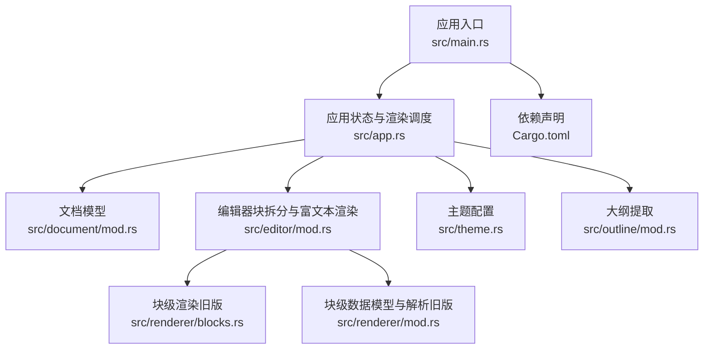
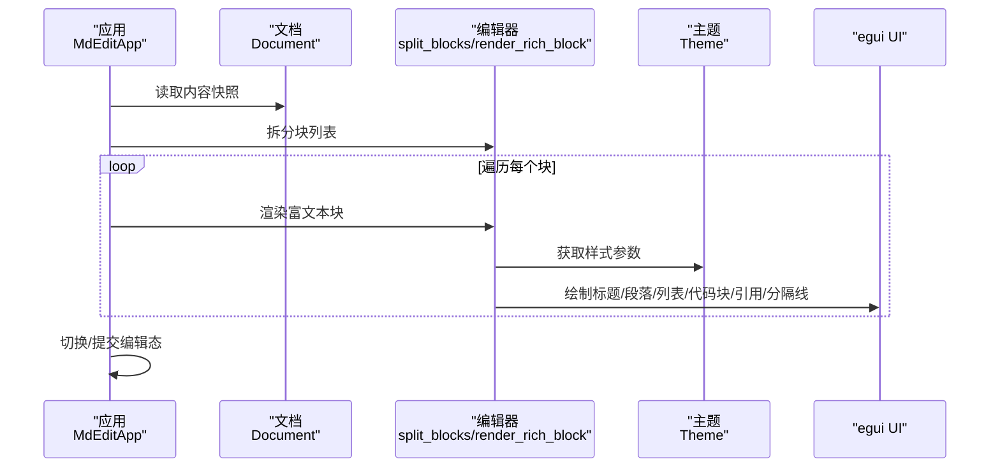
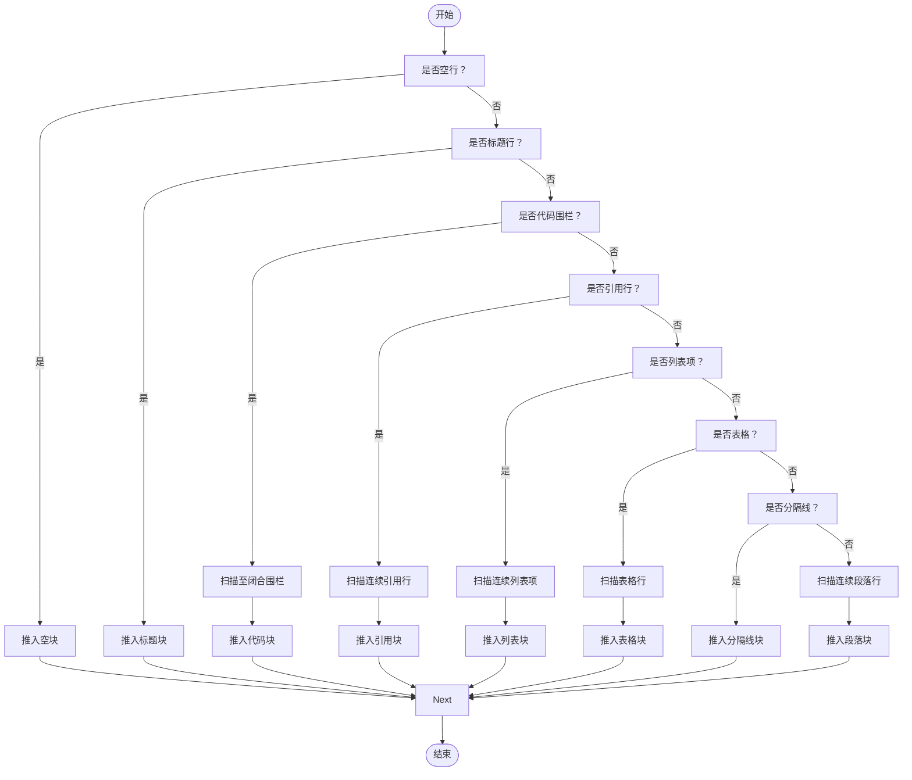
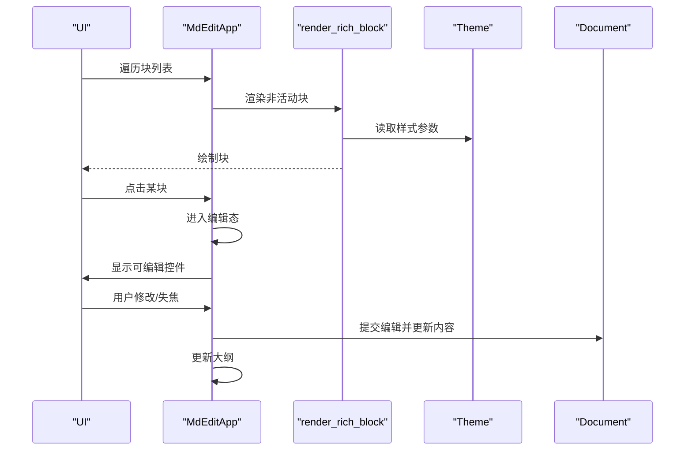
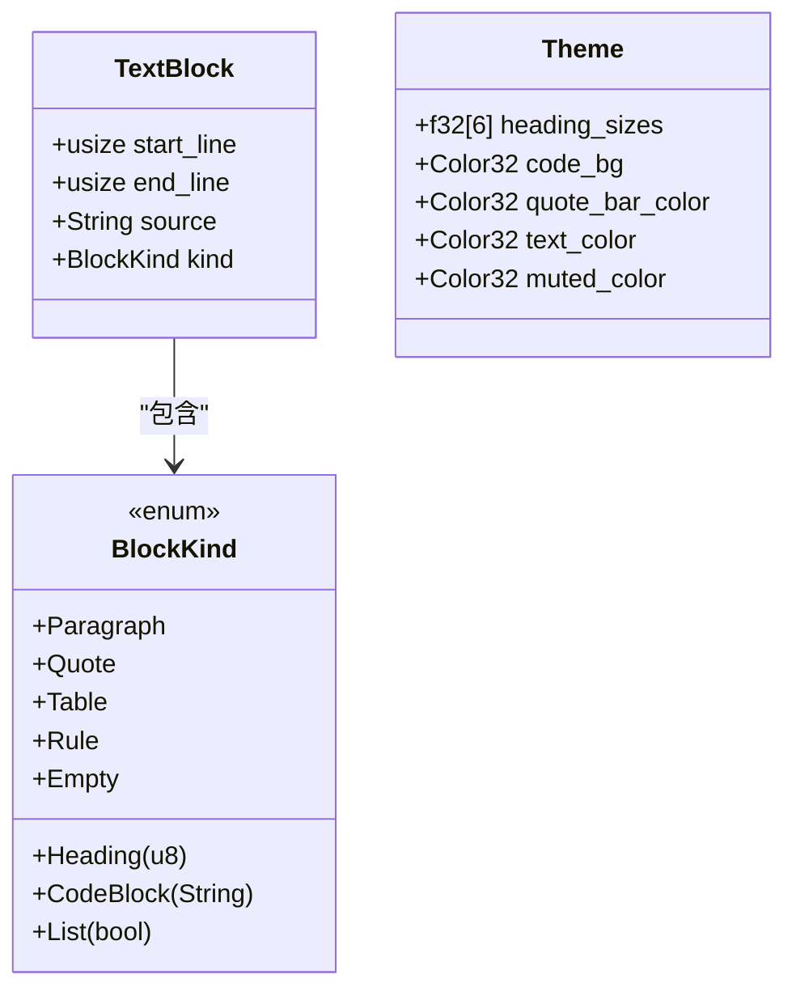
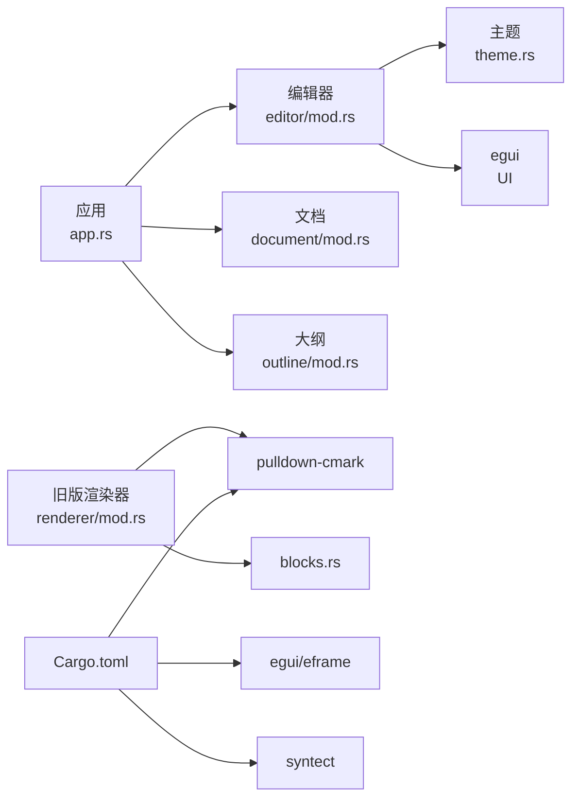

# 块级元素渲染

<cite>
**本文档引用的文件**
- [src/renderer/mod.rs](file://src/renderer/mod.rs)
- [src/renderer/blocks.rs](file://src/renderer/blocks.rs)
- [src/editor/mod.rs](file://src/editor/mod.rs)
- [src/theme.rs](file://src/theme.rs)
- [src/app.rs](file://src/app.rs)
- [src/document/mod.rs](file://src/document/mod.rs)
- [src/outline/mod.rs](file://src/outline/mod.rs)
- [Cargo.toml](file://Cargo.toml)
</cite>

## 目录
1. [简介](#简介)
2. [项目结构](#项目结构)
3. [核心组件](#核心组件)
4. [架构总览](#架构总览)
5. [详细组件分析](#详细组件分析)
6. [依赖关系分析](#依赖关系分析)
7. [性能考虑](#性能考虑)
8. [故障排查指南](#故障排查指南)
9. [结论](#结论)
10. [附录](#附录)

## 简介
本文件聚焦于块级元素渲染的技术实现，系统性说明标题、段落、列表、代码块、引用块与分隔线的识别、层级解析、嵌套处理、样式应用、间距与对齐规则，并阐述与主题系统的集成与 CSS 样式转换思路。同时给出渲染性能优化建议、内存使用分析以及扩展自定义块级元素的最佳实践。

## 项目结构
该项目采用模块化组织，渲染相关逻辑主要分布在 editor 模块与 renderer 模块中，主题通过 theme 模块统一管理，应用入口在 app 模块中协调文档、大纲与渲染流程。



图表来源
- [src/app.rs:187-351](file://src/app.rs#L187-L351)
- [src/editor/mod.rs:1-349](file://src/editor/mod.rs#L1-L349)
- [src/renderer/mod.rs:1-143](file://src/renderer/mod.rs#L1-L143)
- [src/renderer/blocks.rs:1-68](file://src/renderer/blocks.rs#L1-L68)
- [src/theme.rs:1-22](file://src/theme.rs#L1-L22)
- [src/outline/mod.rs:1-27](file://src/outline/mod.rs#L1-L27)
- [Cargo.toml:1-19](file://Cargo.toml#L1-L19)

章节来源
- [src/app.rs:187-351](file://src/app.rs#L187-L351)
- [src/editor/mod.rs:1-349](file://src/editor/mod.rs#L1-L349)
- [src/renderer/mod.rs:1-143](file://src/renderer/mod.rs#L1-L143)
- [src/renderer/blocks.rs:1-68](file://src/renderer/blocks.rs#L1-L68)
- [src/theme.rs:1-22](file://src/theme.rs#L1-L22)
- [src/outline/mod.rs:1-27](file://src/outline/mod.rs#L1-L27)
- [Cargo.toml:1-19](file://Cargo.toml#L1-L19)

## 核心组件
- 文档与缓冲区：负责内容存储、修改标记与历史记录，供渲染层读取。
- 编辑器块拆分：将原始文本按块级语法切分为 TextBlock，支持标题、段落、代码块、引用块、列表、表格、分隔线等。
- 渲染器：根据块类型与主题配置绘制 UI，提供富文本内联样式支持。
- 主题系统：集中管理字号、颜色与背景等视觉参数。
- 大纲提取：从文档中抽取标题层级，用于侧边导航。

章节来源
- [src/document/mod.rs:9-51](file://src/document/mod.rs#L9-L51)
- [src/editor/mod.rs:4-22](file://src/editor/mod.rs#L4-L22)
- [src/theme.rs:3-22](file://src/theme.rs#L3-L22)
- [src/outline/mod.rs:7-26](file://src/outline/mod.rs#L7-L26)

## 架构总览
渲染流程由应用层驱动，先将文档内容拆分为块，再逐块进行富文本渲染；对于需要编辑的块，进入可编辑模式；主题参数贯穿渲染过程，确保风格一致。



图表来源
- [src/app.rs:251-328](file://src/app.rs#L251-L328)
- [src/editor/mod.rs:24-149](file://src/editor/mod.rs#L24-L149)
- [src/editor/mod.rs:159-266](file://src/editor/mod.rs#L159-L266)
- [src/theme.rs:3-22](file://src/theme.rs#L3-L22)

## 详细组件分析

### 块级元素识别与层级解析
- 标题：以连续的 # 字符开头，层级为 # 的数量（限制最大 6），源文本去除前导 # 与空格后作为显示文本。
- 段落：连续非空白行且不匹配其他块类型时合并为一个段落。
- 代码块：以 ``` 开头，内部行直到遇到同格式的 ``` 结束，首行可含语言标识；渲染时去除首尾围栏行。
- 引用块：以 > 开头的连续行，渲染时去除每行前缀 > 并保留换行。
- 列表：支持无序（-、*、+）与有序（数字. ）两种，允许缩进延续；渲染时按当前顺序重写标记。
- 表格：以 | 分隔的行构成，第二行需为分隔线（-、:、|、空格）；渲染为网格，首行加粗。
- 分隔线：---、***、___ 任一形式单独成行。



图表来源
- [src/editor/mod.rs:24-149](file://src/editor/mod.rs#L24-L149)

章节来源
- [src/editor/mod.rs:24-149](file://src/editor/mod.rs#L24-L149)

### 嵌套与上下文处理
- 代码块与列表项内部文本累积，分别在闭合标签或 Item 结束时写入对应字段。
- 引用块内部文本累积，遇到非引用行时停止累积。
- 段落文本在遇到列表项或引用开始时切换到相应上下文，避免混排。

章节来源
- [src/editor/mod.rs:71-115](file://src/editor/mod.rs#L71-L115)

### 样式应用策略
- 标题：根据层级映射主题中的字号数组，级别 1-2 下方绘制分隔线。
- 段落：内联样式支持加粗（双星号）、斜体（单星号）、行内代码（反引号）。
- 代码块：外框圆角、内边距、背景色与等宽字体，文本颜色由主题控制。
- 引用块：左侧绘制细条，文本斜体与柔和颜色。
- 列表：无序使用符号点，有序按顺序重写标记，左侧留出缩进空间。
- 分隔线：使用 UI 提供的分隔组件。

章节来源
- [src/editor/mod.rs:159-266](file://src/editor/mod.rs#L159-L266)
- [src/theme.rs:3-22](file://src/theme.rs#L3-L22)

### 间距与对齐规则
- 标题：二级及以下无额外底部间距；一级与二级下方有分隔线。
- 段落：默认行距由 egui 控制，内联样式独立格式化。
- 代码块：外层 Frame 设置内边距与圆角，文本等宽。
- 引用块：水平布局，左侧细条高度与交互尺寸一致，右侧文本与细条保持垂直居中。
- 列表：每项水平布局，左侧缩进与标记宽度固定，保证对齐一致性。
- 分隔线：占满可用宽度。

章节来源
- [src/editor/mod.rs:159-266](file://src/editor/mod.rs#L159-L266)

### 与主题系统的集成与样式转换
- 主题结构包含标题字号数组、代码背景色、引用条颜色、正文与柔和文本颜色。
- 渲染时通过索引映射标题层级到字号，文本颜色与背景色来自主题。
- 内联样式（加粗、斜体、行内代码）通过 egui 的 TextFormat 应用，颜色与字体族由主题与默认值组合决定。

章节来源
- [src/theme.rs:3-22](file://src/theme.rs#L3-L22)
- [src/editor/mod.rs:268-348](file://src/editor/mod.rs#L268-L348)

### 渲染流程与编辑态切换
- 应用层遍历块列表，非活动块使用富文本渲染；活动块进入可编辑模式，使用多行文本编辑控件。
- 提交编辑时，根据块的起止行重新拼接内容，更新文档缓冲区与修改状态。
- 大纲随内容变化同步更新，支持点击跳转到对应行。



图表来源
- [src/app.rs:251-328](file://src/app.rs#L251-L328)
- [src/editor/mod.rs:159-266](file://src/editor/mod.rs#L159-L266)
- [src/theme.rs:3-22](file://src/theme.rs#L3-L22)
- [src/document/mod.rs:39-50](file://src/document/mod.rs#L39-L50)

章节来源
- [src/app.rs:251-328](file://src/app.rs#L251-L328)
- [src/document/mod.rs:39-50](file://src/document/mod.rs#L39-L50)

### 类型与数据结构


图表来源
- [src/editor/mod.rs:4-22](file://src/editor/mod.rs#L4-L22)
- [src/theme.rs:3-22](file://src/theme.rs#L3-L22)

章节来源
- [src/editor/mod.rs:4-22](file://src/editor/mod.rs#L4-L22)
- [src/theme.rs:3-22](file://src/theme.rs#L3-L22)

## 依赖关系分析
- 渲染依赖 egui 进行 UI 绘制，依赖 pulldown-cmark 进行 Markdown 解析（旧版渲染器仍保留），依赖 syntect 进行语法高亮（Cargo.toml 中声明）。
- 应用层依赖 eframe/egui 上下文，负责窗口、字体与事件循环。
- 编辑器模块承担块级识别与富文本渲染职责，主题模块提供样式参数。



图表来源
- [src/app.rs:187-351](file://src/app.rs#L187-L351)
- [src/editor/mod.rs:1-349](file://src/editor/mod.rs#L1-L349)
- [src/renderer/mod.rs:7-142](file://src/renderer/mod.rs#L7-L142)
- [src/renderer/blocks.rs:1-68](file://src/renderer/blocks.rs#L1-L68)
- [src/theme.rs:1-22](file://src/theme.rs#L1-L22)
- [Cargo.toml:8-13](file://Cargo.toml#L8-L13)

章节来源
- [Cargo.toml:8-13](file://Cargo.toml#L8-L13)
- [src/renderer/mod.rs:7-142](file://src/renderer/mod.rs#L7-L142)

## 性能考虑
- 渲染路径优化
  - 使用 egui 的 LayoutJob 对内联样式进行一次性布局，减少多次分配与重复格式化。
  - 代码块与引用块采用 Frame 包裹与 Painter 直绘细条，避免复杂布局嵌套。
  - 列表项逐项渲染，避免大范围重组。
- 内存使用分析
  - 块拆分阶段仅保存必要的元信息（起止行、类型、源文本片段），避免复制整段内容。
  - 富文本渲染时，内联样式构建字符串临时缓冲，结束后立即丢弃。
  - 主题参数为常量数组与颜色值，占用极小内存。
- 可选优化方向
  - 对频繁出现的块类型（如纯文本段落）可引入增量渲染缓存。
  - 大纲提取与块拆分可并行化，减少主线程阻塞。
  - 代码块渲染可结合 syntect 进行语法高亮，但需注意 CPU 与内存开销。

[本节为通用性能建议，不直接分析具体文件，故无“章节来源”]

## 故障排查指南
- 标题层级异常
  - 确认源文本中 # 数量不超过 6；渲染时会做最小值截断。
  - 检查主题 heading_sizes 是否正确加载。
- 代码块显示异常
  - 确保围栏闭合正确；渲染时会跳过首尾围栏行。
  - 检查主题 code_bg 与 text_color 是否为有效颜色。
- 引用块样式不对
  - 确认左侧细条绘制区域与交互尺寸一致；检查 quote_bar_color 与 muted_color。
- 列表项标记错误
  - 有序列表会按顺序重写标记；检查源文本缩进与标记格式。
- 段落内联样式不生效
  - 检查加粗（**）、斜体（*）、行内代码（`）的配对与转义。
- 编辑态切换问题
  - 确认块的起止行与内容拼接逻辑一致；提交编辑后文档缓冲区已更新。

章节来源
- [src/editor/mod.rs:159-266](file://src/editor/mod.rs#L159-L266)
- [src/theme.rs:3-22](file://src/theme.rs#L3-L22)
- [src/document/mod.rs:39-50](file://src/document/mod.rs#L39-L50)

## 结论
该渲染系统以简洁高效的块级识别与富文本渲染为核心，结合主题系统实现一致的视觉风格。通过合理的数据结构与渲染策略，在保证易用性的同时兼顾了性能与可维护性。未来可在语法高亮、增量渲染与并行处理方面进一步优化。

[本节为总结性内容，不直接分析具体文件，故无“章节来源”]

## 附录

### 自定义块级元素扩展方法与最佳实践
- 新增块类型
  - 在 BlockKind 与 TextBlock 中添加新枚举值与对应字段。
  - 在块拆分函数中增加识别逻辑，扫描并收集源文本。
  - 在渲染函数中新增匹配分支，调用 egui API 绘制 UI。
- 最佳实践
  - 保持块拆分与渲染的职责分离，便于测试与维护。
  - 使用主题参数统一管理样式，避免硬编码颜色与尺寸。
  - 对复杂布局优先使用 egui 的容器（如 Grid、Frame）以获得更好的性能与一致性。
  - 对长文档场景，考虑分页或虚拟滚动策略，降低一次性渲染压力。

章节来源
- [src/editor/mod.rs:12-22](file://src/editor/mod.rs#L12-L22)
- [src/editor/mod.rs:24-149](file://src/editor/mod.rs#L24-L149)
- [src/editor/mod.rs:159-266](file://src/editor/mod.rs#L159-L266)