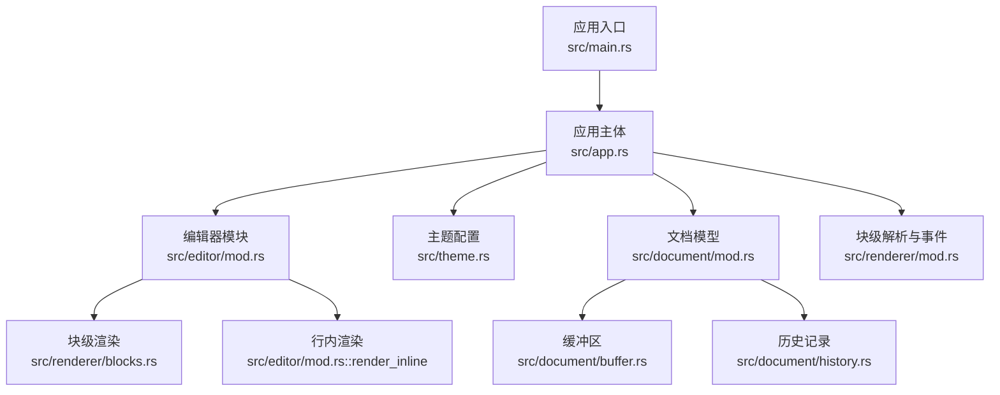
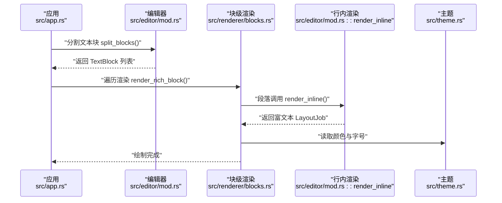
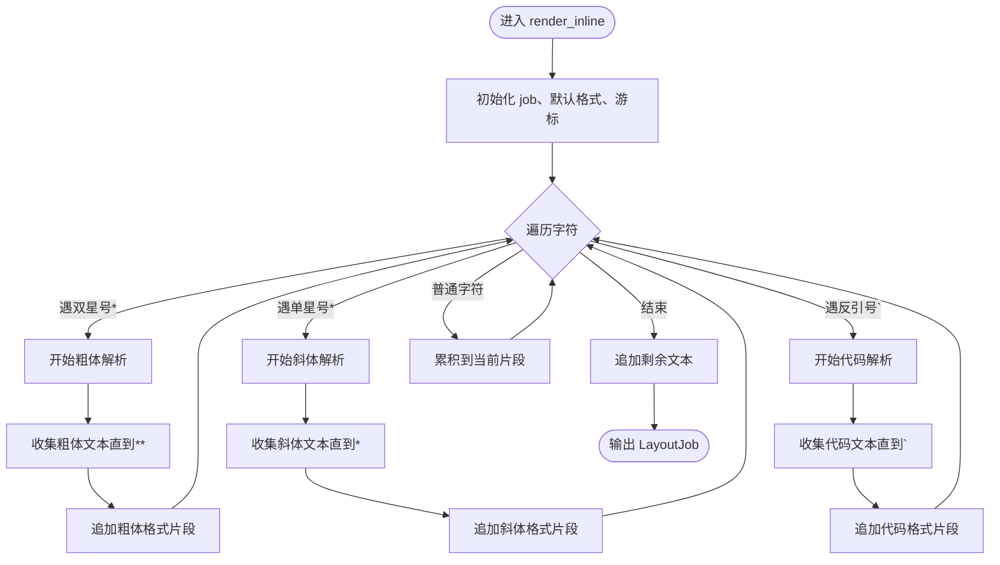
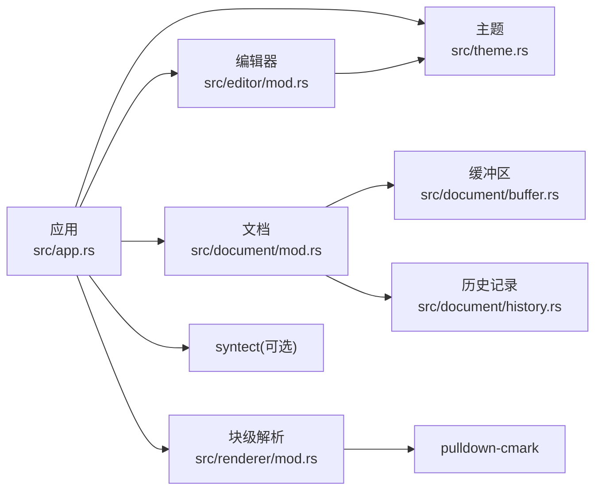

# 行内格式渲染

<cite>
**本文引用的文件**
- [src/renderer/mod.rs](file://src/renderer/mod.rs)
- [src/renderer/blocks.rs](file://src/renderer/blocks.rs)
- [src/renderer/inline.rs](file://src/renderer/inline.rs)
- [src/editor/mod.rs](file://src/editor/mod.rs)
- [src/app.rs](file://src/app.rs)
- [src/theme.rs](file://src/theme.rs)
- [src/document/mod.rs](file://src/document/mod.rs)
- [src/document/buffer.rs](file://src/document/buffer.rs)
- [src/document/history.rs](file://src/document/history.rs)
- [Cargo.toml](file://Cargo.toml)
- [src/main.rs](file://src/main.rs)
</cite>

## 目录
1. [简介](#简介)
2. [项目结构](#项目结构)
3. [核心组件](#核心组件)
4. [架构总览](#架构总览)
5. [详细组件分析](#详细组件分析)
6. [依赖关系分析](#依赖关系分析)
7. [性能考虑](#性能考虑)
8. [故障排除指南](#故障排除指南)
9. [结论](#结论)
10. [附录](#附录)

## 简介
本文件聚焦于 Markdown 行内格式的解析与渲染机制，涵盖粗体、斜体、代码、删除线（通过代码背景模拟）以及链接的实现现状与扩展建议。当前仓库已具备基础的行内格式解析能力（粗体、斜体、代码），并通过主题系统控制颜色与字体；删除线与链接尚未在渲染层实现，但可通过扩展补齐。本文将从架构、数据流、处理逻辑、样式应用、性能优化与扩展兼容性等维度进行系统化说明。

## 项目结构
围绕行内渲染的关键模块如下：
- 渲染器模块：负责块级与行内内容的渲染，其中行内渲染位于编辑器模块中实现
- 编辑器模块：负责将文档切分为文本块，并对段落进行行内格式解析
- 主题模块：集中管理字号、颜色等视觉样式
- 文档模块：提供缓冲区与历史记录，支撑编辑态与回退操作
- 应用入口：初始化字体、主题与窗口，驱动渲染流程

图表来源
- [src/main.rs:1-50](file://src/main.rs#L1-L50)
- [src/app.rs:1-351](file://src/app.rs#L1-L351)
- [src/editor/mod.rs:1-349](file://src/editor/mod.rs#L1-L349)
- [src/renderer/blocks.rs:1-68](file://src/renderer/blocks.rs#L1-L68)
- [src/theme.rs:1-22](file://src/theme.rs#L1-L22)
- [src/document/mod.rs:1-51](file://src/document/mod.rs#L1-L51)
- [src/document/buffer.rs:1-30](file://src/document/buffer.rs#L1-L30)
- [src/document/history.rs:1-59](file://src/document/history.rs#L1-L59)
- [src/renderer/mod.rs:1-143](file://src/renderer/mod.rs#L1-L143)

章节来源
- [src/main.rs:1-50](file://src/main.rs#L1-L50)
- [src/app.rs:1-351](file://src/app.rs#L1-L351)
- [src/editor/mod.rs:1-349](file://src/editor/mod.rs#L1-L349)
- [src/renderer/blocks.rs:1-68](file://src/renderer/blocks.rs#L1-L68)
- [src/theme.rs:1-22](file://src/theme.rs#L1-L22)
- [src/document/mod.rs:1-51](file://src/document/mod.rs#L1-L51)
- [src/document/buffer.rs:1-30](file://src/document/buffer.rs#L1-L30)
- [src/document/history.rs:1-59](file://src/document/history.rs#L1-L59)
- [src/renderer/mod.rs:1-143](file://src/renderer/mod.rs#L1-L143)

## 核心组件
- 行内渲染器（编辑器模块）
  - 实现了对粗体、斜体、行内代码的解析与样式应用
  - 使用 egui 的 LayoutJob 将不同样式的文本片段拼接为富文本
- 块级渲染器（渲染器模块）
  - 负责标题、段落、代码块、引用、列表、分隔线等块级元素的渲染
  - 段落调用行内渲染器进行行内格式处理
- 主题系统
  - 统一管理标题字号、代码背景色、引用条颜色、正文与弱化颜色
- 文档与缓冲
  - 提供内容读写、修改状态与历史操作支持
- 应用入口与字体配置
  - 初始化跨平台字体，确保中日韩文字显示

章节来源
- [src/editor/mod.rs:268-348](file://src/editor/mod.rs#L268-L348)
- [src/renderer/blocks.rs:5-67](file://src/renderer/blocks.rs#L5-L67)
- [src/theme.rs:3-21](file://src/theme.rs#L3-L21)
- [src/document/mod.rs:9-50](file://src/document/mod.rs#L9-L50)
- [src/app.rs:45-84](file://src/app.rs#L45-L84)

## 架构总览
下图展示了从应用到渲染的整体流程：应用加载文档内容，拆分为文本块，块级渲染器根据类型调用相应渲染函数；段落进一步交由行内渲染器进行格式解析与样式拼装。

图表来源
- [src/app.rs:251-328](file://src/app.rs#L251-L328)
- [src/editor/mod.rs:159-266](file://src/editor/mod.rs#L159-L266)
- [src/renderer/blocks.rs:5-67](file://src/renderer/blocks.rs#L5-L67)
- [src/editor/mod.rs:268-348](file://src/editor/mod.rs#L268-L348)
- [src/theme.rs:3-21](file://src/theme.rs#L3-L21)

## 详细组件分析

### 行内格式解析与渲染（粗体、斜体、代码）
- 解析策略
  - 遍历文本字符，识别标记序列：双星号用于粗体、单星号用于斜体、反引号用于行内代码
  - 使用状态机推进，遇到结束标记后截取中间文本作为样式片段
- 样式应用
  - 粗体：使用比例字体并加粗
  - 斜体：比例字体并启用斜体
  - 行内代码：等宽字体，浅灰背景与高对比前景色
- 字符串拼接
  - 使用 egui::text::LayoutJob 将多个 TextFormat 片段拼接，形成最终富文本

图表来源
- [src/editor/mod.rs:268-348](file://src/editor/mod.rs#L268-L348)

章节来源
- [src/editor/mod.rs:268-348](file://src/editor/mod.rs#L268-L348)

### 删除线与链接的现状与扩展建议
- 现状
  - 删除线：未在行内渲染器中实现
  - 链接：未在行内渲染器中实现
- 扩展建议
  - 删除线：可采用在 TextFormat 上设置删除线属性的方式，或以带下划线的样式替代
  - 链接：可识别形如 [文本](URL) 的模式，将 URL 作为交互项传递给 egui 的交互控件
  - 优先级：删除线与链接的解析应放在粗体/斜体之后，避免误将标记识别为行内代码

章节来源
- [src/editor/mod.rs:268-348](file://src/editor/mod.rs#L268-L348)

### 与语法高亮引擎的集成与代码块着色
- 当前实现
  - 代码块渲染使用纯文本富文本（等宽字体、背景色），未集成 syntect
- 集成建议
  - 在代码块渲染处引入 syntect 的高亮器，按语言选择对应语法集
  - 将高亮后的样式映射为 egui 的 TextFormat，再拼接到 LayoutJob 中
  - 对于无语言标识的代码块，仍可回退到当前的简单样式

章节来源
- [src/renderer/blocks.rs:17-28](file://src/renderer/blocks.rs#L17-L28)
- [Cargo.toml:12-12](file://Cargo.toml#L12-L12)

### 文本样式应用、颜色配置与字体选择策略
- 颜色配置
  - 主题统一管理标题字号、代码背景、引用条颜色、正文与弱化颜色
- 字体选择
  - 比例字体用于正文与标题，等宽字体用于代码
  - 应用启动时按平台注入中日韩字体，提升多语言排版体验
- 样式复用
  - 通过 egui::RichText 与 TextFormat 组合，减少重复样式声明

章节来源
- [src/theme.rs:3-21](file://src/theme.rs#L3-L21)
- [src/app.rs:45-84](file://src/app.rs#L45-L84)
- [src/renderer/blocks.rs:8-27](file://src/renderer/blocks.rs#L8-L27)
- [src/editor/mod.rs:294-339](file://src/editor/mod.rs#L294-L339)

### 嵌套解析规则与优先级
- 优先级（从高到低）
  1) 双星号粗体
  2) 单星号斜体
  3) 反引号代码
- 嵌套策略
  - 当前实现逐个扫描字符，不支持深层嵌套；若需嵌套，建议引入基于栈的状态机或正则/LL解析器

章节来源
- [src/editor/mod.rs:274-342](file://src/editor/mod.rs#L274-L342)

### 与块级解析的衔接
- 块级解析（pulldown-cmark）负责识别标题、段落、代码块、引用、列表、分隔线等
- 段落文本交由行内渲染器进行格式解析
- 代码块当前以纯文本渲染，可扩展为高亮渲染

章节来源
- [src/renderer/mod.rs:19-142](file://src/renderer/mod.rs#L19-L142)
- [src/renderer/blocks.rs:14-16](file://src/renderer/blocks.rs#L14-L16)

## 依赖关系分析
- 外部依赖
  - egui/eframe：UI 渲染与交互
  - pulldown-cmark：块级 Markdown 解析
  - syntect：语法高亮（可选）
- 内部耦合
  - 应用层依赖编辑器与主题模块
  - 编辑器模块依赖主题模块进行样式渲染
  - 文档模块提供内容与历史，被应用层读写

图表来源
- [src/app.rs:1-351](file://src/app.rs#L1-L351)
- [src/editor/mod.rs:1-349](file://src/editor/mod.rs#L1-L349)
- [src/theme.rs:1-22](file://src/theme.rs#L1-L22)
- [src/document/mod.rs:1-51](file://src/document/mod.rs#L1-L51)
- [src/renderer/mod.rs:7-7](file://src/renderer/mod.rs#L7-L7)
- [Cargo.toml:8-13](file://Cargo.toml#L8-L13)

章节来源
- [src/app.rs:1-351](file://src/app.rs#L1-L351)
- [src/editor/mod.rs:1-349](file://src/editor/mod.rs#L1-L349)
- [src/theme.rs:1-22](file://src/theme.rs#L1-L22)
- [src/document/mod.rs:1-51](file://src/document/mod.rs#L1-L51)
- [src/renderer/mod.rs:7-7](file://src/renderer/mod.rs#L7-L7)
- [Cargo.toml:8-13](file://Cargo.toml#L8-L13)

## 性能考虑
- 字符扫描优化
  - 当前逐字符扫描，时间复杂度 O(n)；对于长段落可考虑分块处理与缓存中间结果
- 样式拼接
  - 使用 LayoutJob 一次性拼接，避免多次 UI 调用
- 高亮集成
  - syntect 高亮可能带来额外开销，建议按需启用与缓存语言语法集
- 字体与主题
  - 预先注入字体与主题常量，减少运行时计算

## 故障排除指南
- 行内格式未生效
  - 检查是否在段落块中调用行内渲染器
  - 确认标记书写正确（例如粗体需双星号闭合）
- 代码块显示异常
  - 若需要高亮，请在代码块渲染处接入 syntect 并映射样式
- 字体显示问题
  - 确认平台字体路径与注入逻辑正常执行
- 编辑态切换导致内容错位
  - 确保提交编辑时按块范围替换，避免越界

章节来源
- [src/editor/mod.rs:169-170](file://src/editor/mod.rs#L169-L170)
- [src/app.rs:330-349](file://src/app.rs#L330-L349)
- [src/app.rs:45-84](file://src/app.rs#L45-L84)

## 结论
当前项目已实现基础的行内格式渲染（粗体、斜体、行内代码），并通过主题系统统一管理样式。删除线与链接尚未实现，但扩展路径清晰；代码块可扩展为语法高亮渲染。整体架构层次清晰，模块职责明确，具备良好的扩展性与可维护性。

## 附录

### 自定义行内格式扩展清单
- 删除线
  - 在行内解析中识别删除线标记，应用删除线样式
- 链接
  - 识别形如 [文本](URL) 的链接，将其渲染为可点击的交互项
- 嵌套支持
  - 引入状态机或解析器，支持粗体/斜体在代码中的嵌套

### 兼容性处理建议
- 跨平台字体
  - 保持现有字体注入逻辑，针对不同平台补充缺失字体
- 语言环境
  - 保留中日韩字体回退策略，确保多语言内容可读
- 渲染一致性
  - 通过主题系统统一颜色与字号，避免平台差异造成视觉割裂