# WYSIWYG 编辑模式

<cite>
**本文档中引用的文件**
- [main.rs](file://src/main.rs)
- [app.rs](file://src/app.rs)
- [editor/mod.rs](file://src/editor/mod.rs)
- [renderer/mod.rs](file://src/renderer/mod.rs)
- [renderer/blocks.rs](file://src/renderer/blocks.rs)
- [document/mod.rs](file://src/document/mod.rs)
- [document/buffer.rs](file://src/document/buffer.rs)
- [document/history.rs](file://src/document/history.rs)
- [outline/mod.rs](file://src/outline/mod.rs)
- [theme.rs](file://src/theme.rs)
- [Cargo.toml](file://Cargo.toml)
</cite>

## 目录
1. [简介](#简介)
2. [项目结构](#项目结构)
3. [核心组件](#核心组件)
4. [架构概览](#架构概览)
5. [详细组件分析](#详细组件分析)
6. [依赖关系分析](#依赖关系分析)
7. [性能考虑](#性能考虑)
8. [故障排除指南](#故障排除指南)
9. [结论](#结论)

## 简介

mdedit 是一个基于 Rust 和 eframe/egui 的轻量级跨平台 Markdown 编辑器，采用所见即所得（WYSIWYG）编辑模式。该项目实现了即时模式 GUI 架构下的 Markdown 编辑体验，支持多种块级元素的识别和渲染，包括标题、段落、列表、代码块、引用块等。

该编辑器的核心特点是：
- **即时模式 GUI 架构**：使用 egui 的即时模式渲染系统
- **块级元素识别**：智能识别和分割不同类型的 Markdown 块
- **所见即所得渲染**：实时渲染 Markdown 内容为富文本
- **活动块管理**：精确控制当前编辑的块元素
- **高性能渲染**：优化的渲染流程和内存管理

## 项目结构

项目采用模块化设计，主要分为以下几个核心模块：

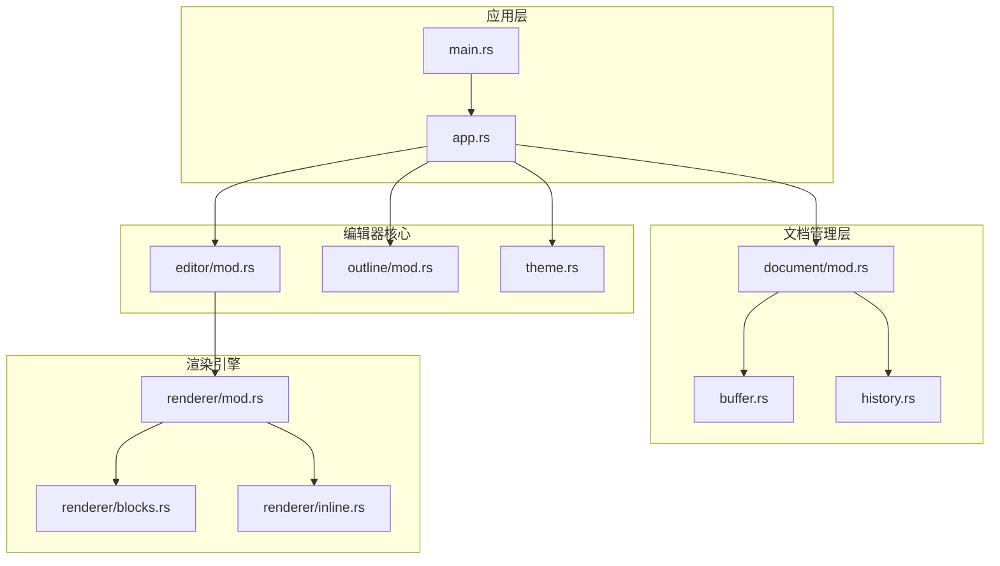

**图表来源**
- [main.rs:1-50](file://src/main.rs#L1-L50)
- [app.rs:1-351](file://src/app.rs#L1-L351)
- [document/mod.rs:1-51](file://src/document/mod.rs#L1-L51)
- [editor/mod.rs:1-349](file://src/editor/mod.rs#L1-L349)
- [renderer/mod.rs:1-143](file://src/renderer/mod.rs#L1-L143)

**章节来源**
- [main.rs:1-50](file://src/main.rs#L1-L50)
- [Cargo.toml:1-19](file://Cargo.toml#L1-L19)

## 核心组件

### 应用程序主控制器

`MdEditApp` 是应用程序的核心控制器，负责协调各个子系统的交互。它继承自 eframe 的 `App` trait，实现了完整的应用生命周期管理。

### 文档管理系统

文档系统采用缓冲区和历史记录分离的设计：
- **Buffer**：高效的字符串缓冲区，支持原位修改
- **History**：完整的撤销/重做操作历史记录
- **Document**：文档状态的统一管理接口

### 编辑器核心

编辑器模块实现了块级元素的智能识别和渲染：
- **TextBlock**：块级元素的数据结构
- **BlockKind**：支持的块类型枚举
- **split_blocks**：块级元素分割算法
- **render_rich_block**：富文本块渲染

### 渲染引擎

渲染系统提供了两种渲染路径：
- **即时渲染**：直接渲染 Markdown 到 UI
- **解析渲染**：使用 pulldown-cmark 解析后渲染

**章节来源**
- [app.rs:9-185](file://src/app.rs#L9-L185)
- [document/mod.rs:9-51](file://src/document/mod.rs#L9-L51)
- [editor/mod.rs:4-22](file://src/editor/mod.rs#L4-L22)
- [renderer/mod.rs:9-17](file://src/renderer/mod.rs#L9-L17)

## 架构概览

mdedit 采用了典型的 MVC（Model-View-Controller）架构模式，结合即时模式 GUI 的特性：

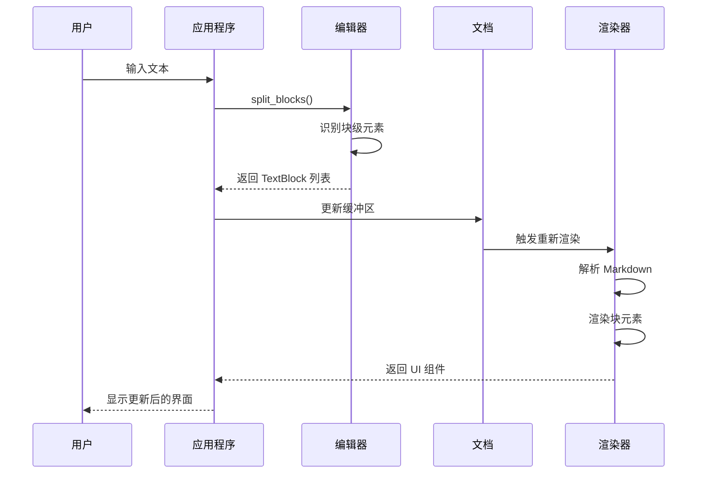

**图表来源**
- [app.rs:252-328](file://src/app.rs#L252-L328)
- [editor/mod.rs:24-149](file://src/editor/mod.rs#L24-L149)
- [renderer/mod.rs:19-142](file://src/renderer/mod.rs#L19-L142)

### 数据流架构

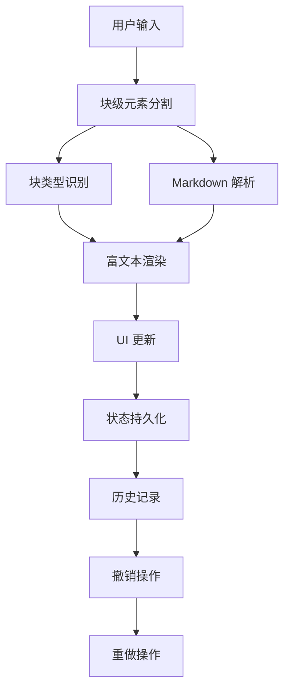

**图表来源**
- [editor/mod.rs:24-149](file://src/editor/mod.rs#L24-L149)
- [document/history.rs:20-58](file://src/document/history.rs#L20-L58)

## 详细组件分析

### 块级元素识别与分割算法

#### TextBlock 结构体

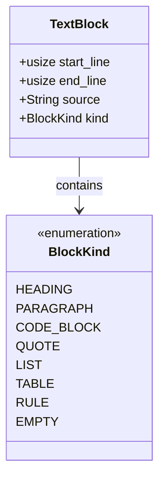

**图表来源**
- [editor/mod.rs:4-22](file://src/editor/mod.rs#L4-L22)

#### 分割算法实现

分割算法采用线性扫描策略，时间复杂度为 O(n)，其中 n 是行数：

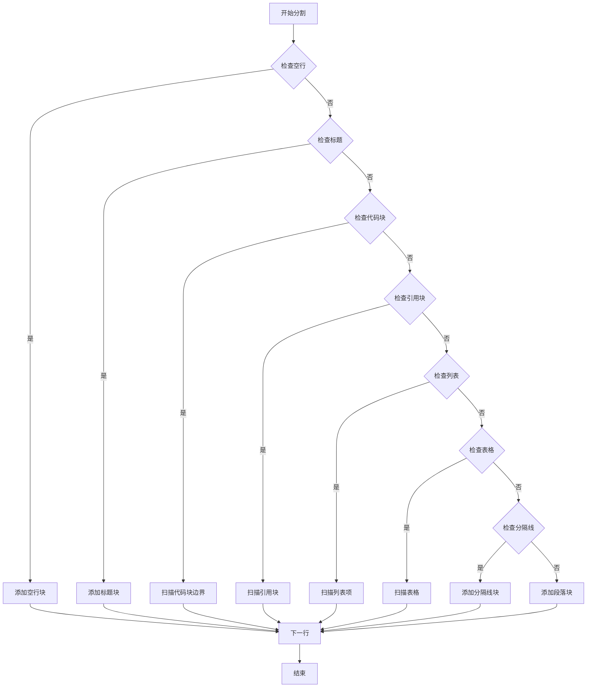

**图表来源**
- [editor/mod.rs:24-149](file://src/editor/mod.rs#L24-L149)

#### 支持的块类型处理

| 块类型 | 识别模式 | 特殊处理 |
|--------|----------|----------|
| 标题 | 以 `#` 开头 | 计算级别数量，限制最大级别 |
| 段落 | 连续非空行 | 合并相邻行，保持格式 |
| 代码块 | 以 ``` 包围 | 提取语言标识，保留原始格式 |
| 引用块 | 以 `>` 开头的连续行 | 移除前缀，保持缩进 |
| 列表 | `- `, `* `, `+ ` 或编号 | 支持有序和无序，处理嵌套 |
| 表格 | 包含 `|` 的行，第二行是分隔符 | 解析表头和数据单元格 |
| 分隔线 | `---`, `***`, `___` | 单独的分隔线块 |
| 空行 | 纯空行 | 独立的空块 |

**章节来源**
- [editor/mod.rs:40-149](file://src/editor/mod.rs#L40-L149)

### 编辑器核心渲染流程

#### 即时模式渲染架构

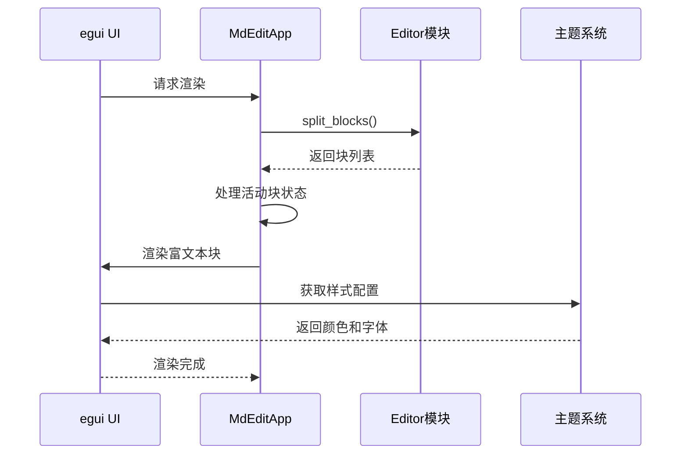

**图表来源**
- [app.rs:252-328](file://src/app.rs#L252-L328)
- [editor/mod.rs:159-266](file://src/editor/mod.rs#L159-L266)

#### 富文本渲染实现

渲染系统针对每种块类型提供了专门的渲染逻辑：

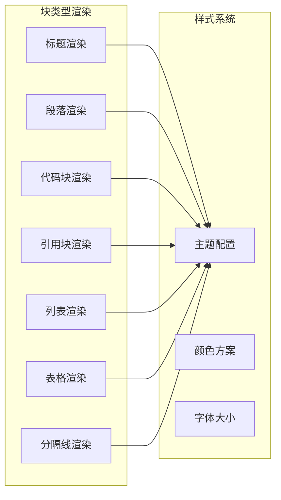

**图表来源**
- [editor/mod.rs:159-266](file://src/editor/mod.rs#L159-L266)
- [theme.rs:3-21](file://src/theme.rs#L3-L21)

**章节来源**
- [app.rs:252-328](file://src/app.rs#L252-L328)
- [editor/mod.rs:159-266](file://src/editor/mod.rs#L159-L266)

### 活动块管理机制

#### 焦点切换与编辑状态

活动块管理是 WYSIWYG 编辑模式的核心机制：

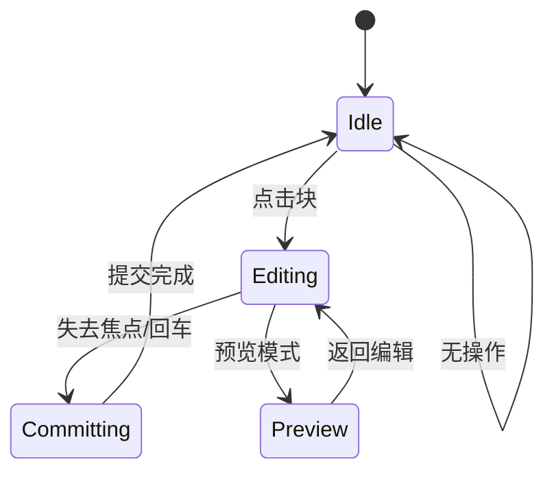

#### 状态转换流程

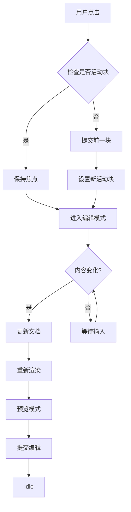

**图表来源**
- [app.rs:330-349](file://src/app.rs#L330-L349)

#### 内容提交流程

内容提交是编辑模式的关键环节，确保数据一致性：

**章节来源**
- [app.rs:330-349](file://src/app.rs#L330-L349)

### 文档管理系统

#### Buffer 设计

Buffer 模块提供了高效的字符串操作能力：

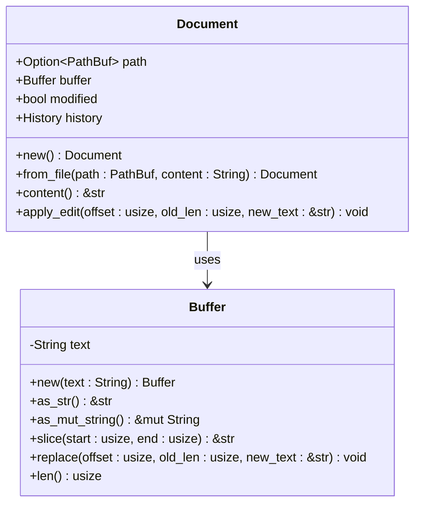

**图表来源**
- [document/buffer.rs:1-30](file://src/document/buffer.rs#L1-L30)
- [document/mod.rs:9-51](file://src/document/mod.rs#L9-L51)

#### 历史记录系统

历史记录系统支持完整的撤销/重做功能：

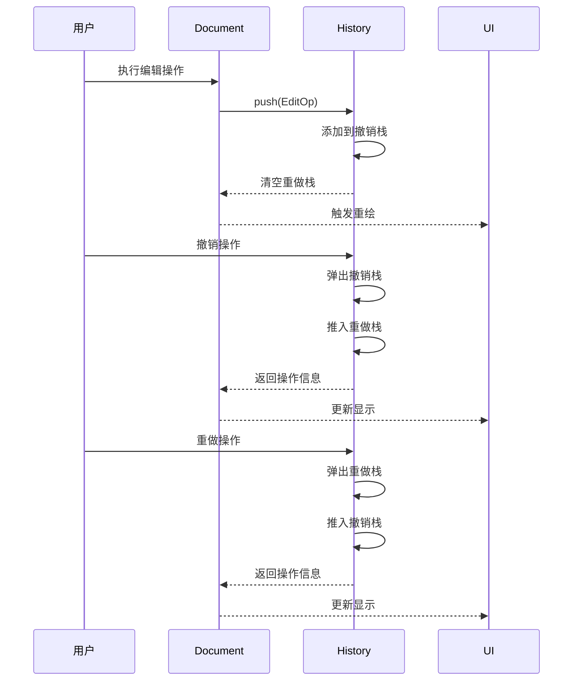

**图表来源**
- [document/history.rs:20-58](file://src/document/history.rs#L20-L58)

**章节来源**
- [document/buffer.rs:1-30](file://src/document/buffer.rs#L1-L30)
- [document/history.rs:1-59](file://src/document/history.rs#L1-L59)
- [document/mod.rs:16-50](file://src/document/mod.rs#L16-L50)

### 渲染引擎架构

#### 解析器设计

渲染引擎提供了两种渲染路径：

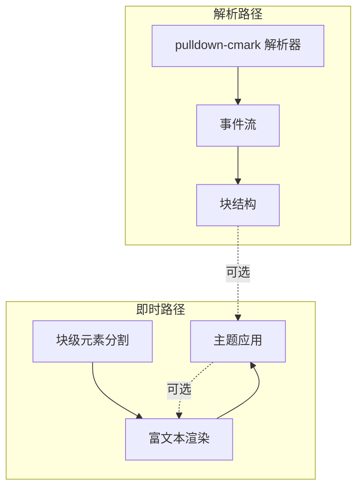

**图表来源**
- [renderer/mod.rs:19-142](file://src/renderer/mod.rs#L19-L142)
- [editor/mod.rs:24-149](file://src/editor/mod.rs#L24-L149)

#### Markdown 解析流程

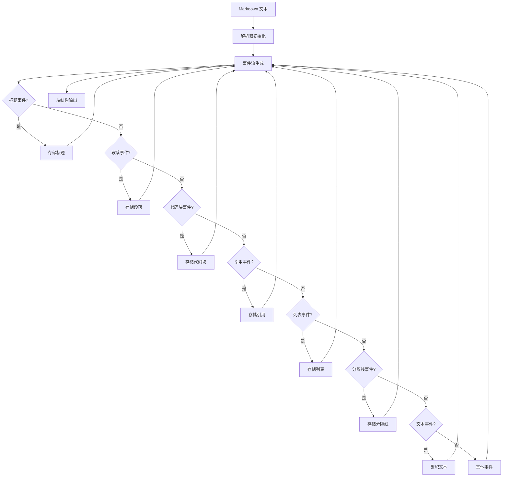

**图表来源**
- [renderer/mod.rs:19-142](file://src/renderer/mod.rs#L19-L142)

**章节来源**
- [renderer/mod.rs:19-142](file://src/renderer/mod.rs#L19-L142)
- [renderer/blocks.rs:5-63](file://src/renderer/blocks.rs#L5-L63)

## 依赖关系分析

### 外部依赖

项目使用了以下关键依赖：

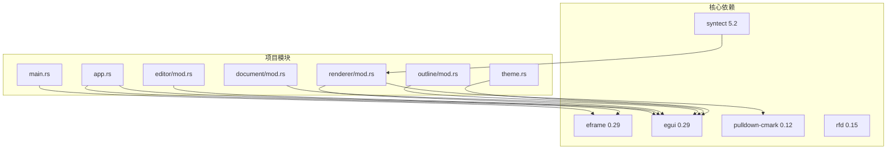

**图表来源**
- [Cargo.toml:8-13](file://Cargo.toml#L8-L13)
- [main.rs:10-13](file://src/main.rs#L10-L13)

### 内部模块依赖

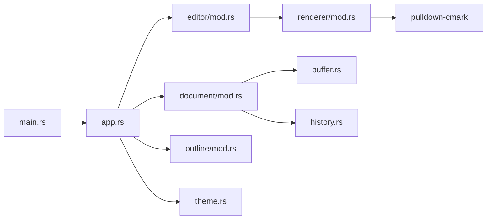

**图表来源**
- [main.rs:3-7](file://src/main.rs#L3-L7)
- [app.rs:4-7](file://src/app.rs#L4-L7)

**章节来源**
- [Cargo.toml:8-19](file://Cargo.toml#L8-L19)

## 性能考虑

### 渲染性能优化

1. **增量渲染**：只在内容变化时重新渲染相关块
2. **缓存机制**：利用 egui 的内置缓存系统
3. **批量更新**：合并多个 UI 更新操作
4. **内存池**：复用字符串和缓冲区对象

### 内存管理最佳实践

1. **零拷贝设计**：使用 `&str` 和 `Cow<str>` 减少内存分配
2. **延迟计算**：推迟昂贵的计算直到必要时
3. **对象复用**：重用 UI 组件和样式对象
4. **垃圾回收**：合理使用 Rust 的所有权系统避免内存泄漏

### 并发与异步处理

虽然当前版本是单线程的，但架构设计支持未来的并发扩展：
- 使用 `Arc<Mutex<T>>` 实现共享状态
- 异步解析和渲染任务
- 工作线程池处理重型计算

## 故障排除指南

### 常见问题诊断

1. **渲染异常**
   - 检查块级元素分割算法
   - 验证 Markdown 语法正确性
   - 确认主题配置有效

2. **编辑状态问题**
   - 检查活动块索引有效性
   - 验证内容提交流程
   - 确认焦点管理逻辑

3. **性能问题**
   - 分析渲染时间消耗
   - 检查内存使用情况
   - 优化字符串操作

### 调试工具

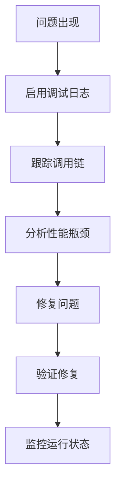

**章节来源**
- [app.rs:187-249](file://src/app.rs#L187-L249)

## 结论

mdedit 项目成功实现了基于即时模式 GUI 的 WYSIWYG Markdown 编辑体验。通过精心设计的模块化架构和高效的渲染算法，该编辑器提供了流畅的用户体验和良好的性能表现。

### 主要成就

1. **完整的块级元素支持**：涵盖了 Markdown 的主要块类型
2. **高效的渲染系统**：优化的渲染流程和内存管理
3. **灵活的主题系统**：可定制的视觉样式
4. **健壮的状态管理**：完善的活动块管理和历史记录

### 未来发展方向

1. **增强的内联渲染**：实现更丰富的 Markdown 内联语法
2. **协作编辑**：支持多用户实时协作
3. **插件系统**：扩展编辑器功能
4. **云同步**：支持云端文档存储和同步

该架构为构建高质量的 Markdown 编辑器奠定了坚实的基础，其设计理念和实现方式可以作为类似项目的参考模板。