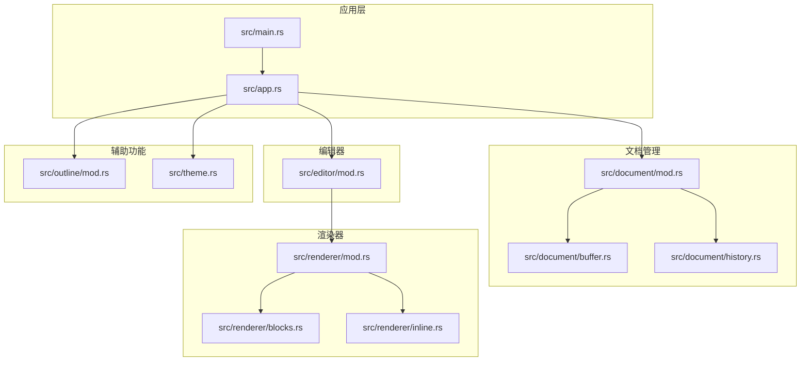
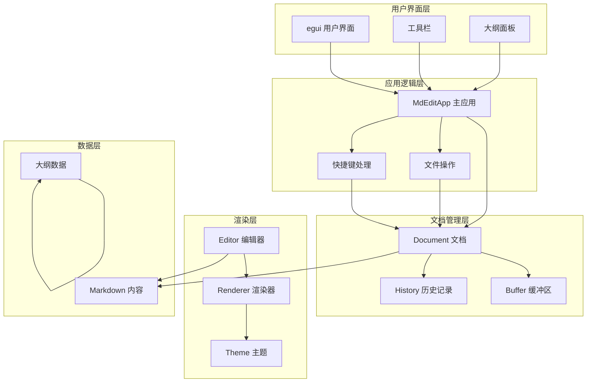
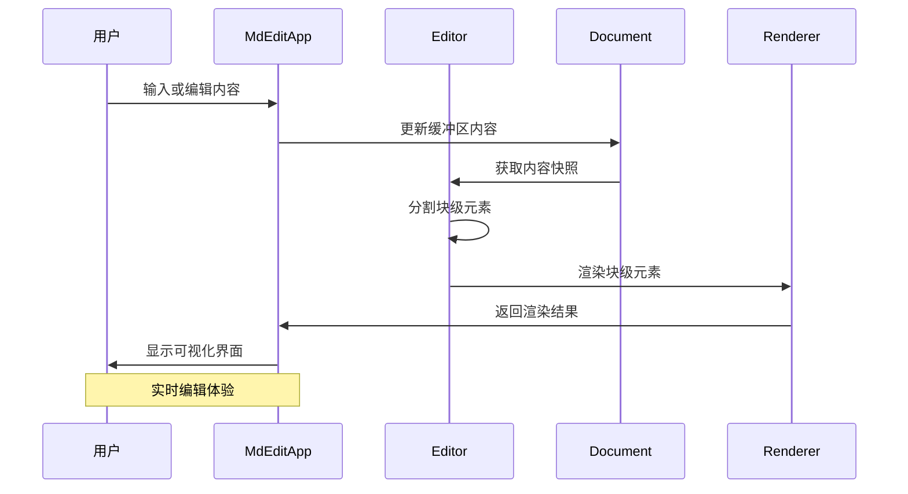
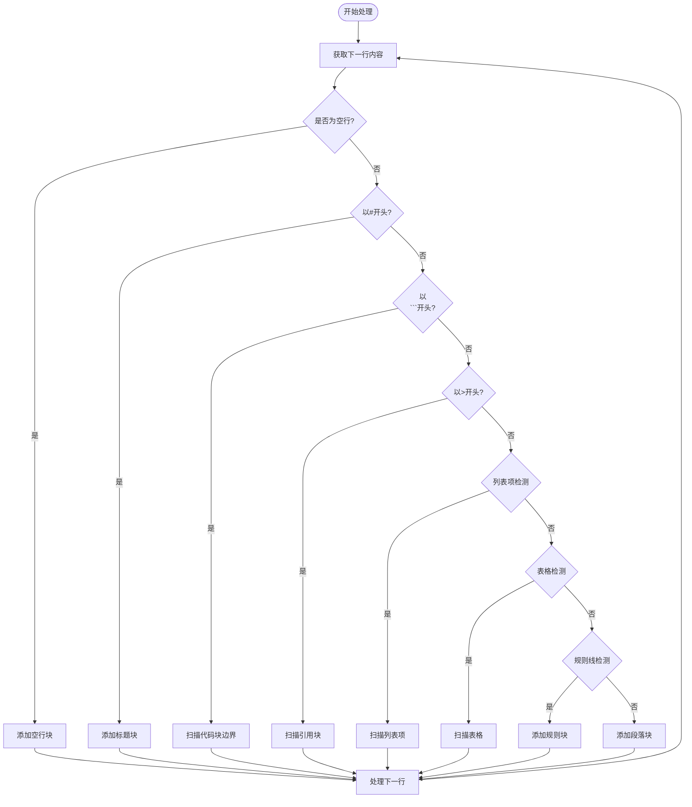
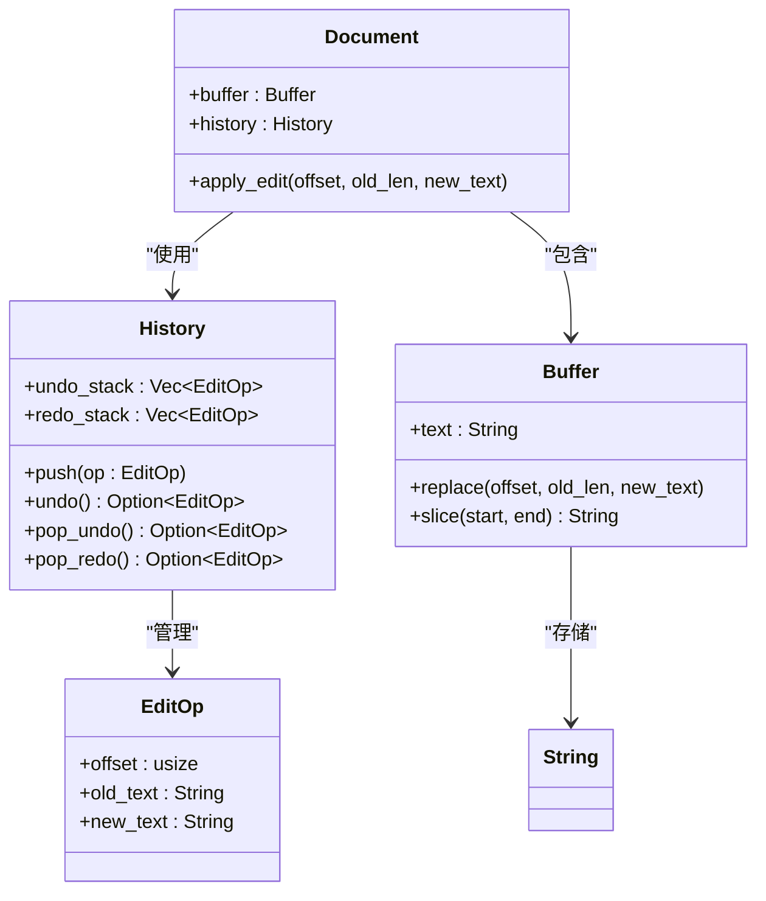
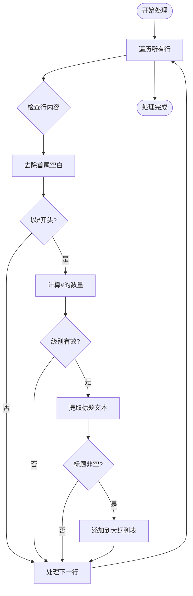
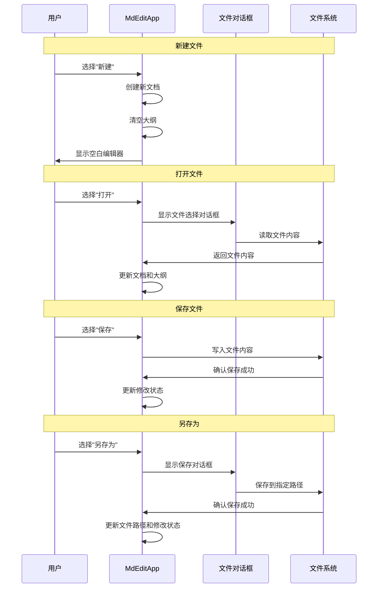
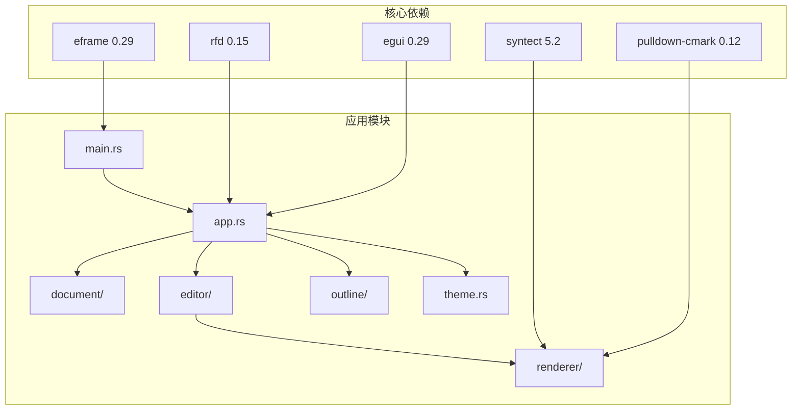

# 功能特性详解

<cite>
**本文档中引用的文件**
- [main.rs](file://src/main.rs)
- [app.rs](file://src/app.rs)
- [mod.rs](file://src/document/mod.rs)
- [buffer.rs](file://src/document/buffer.rs)
- [history.rs](file://src/document/history.rs)
- [mod.rs](file://src/editor/mod.rs)
- [mod.rs](file://src/renderer/mod.rs)
- [blocks.rs](file://src/renderer/blocks.rs)
- [inline.rs](file://src/renderer/inline.rs)
- [mod.rs](file://src/outline/mod.rs)
- [theme.rs](file://src/theme.rs)
- [Cargo.toml](file://Cargo.toml)
- [README.md](file://README.md)
</cite>

## 目录
1. [简介](#简介)
2. [项目结构](#项目结构)
3. [核心组件](#核心组件)
4. [架构概览](#架构概览)
5. [详细组件分析](#详细组件分析)
6. [依赖关系分析](#依赖关系分析)
7. [性能考虑](#性能考虑)
8. [故障排除指南](#故障排除指南)
9. [结论](#结论)

## 简介

mdedit 是一个轻量级的跨平台 Markdown 编辑器，采用 Typora 式的所见即所得（WYSIWYG）编辑体验，无需 WebView2 即可实现丰富的 Markdown 渲染效果。该项目基于 Rust 和 egui 框架构建，提供了现代化的用户界面和高效的文本处理能力。

本项目的核心特色包括：
- **所见即所得编辑模式**：实时渲染 Markdown 标记语言
- **智能大纲导航**：自动提取标题并提供快速跳转
- **跨平台支持**：支持 Windows、macOS 和 Linux 系统
- **高效性能**：单文件分发，冷启动时间小于 200ms
- **丰富的快捷键系统**：提升编辑效率

## 项目结构

项目采用模块化设计，按照功能领域进行组织，每个模块负责特定的功能领域：



**图表来源**
- [main.rs:1-50](file://src/main.rs#L1-L50)
- [app.rs:1-351](file://src/app.rs#L1-L351)
- [mod.rs:1-51](file://src/document/mod.rs#L1-L51)

**章节来源**
- [main.rs:1-50](file://src/main.rs#L1-L50)
- [Cargo.toml:1-19](file://Cargo.toml#L1-L19)

## 核心组件

### 应用程序主入口

应用程序的主入口位于 `src/main.rs`，负责初始化应用并设置窗口配置。该文件实现了命令行参数解析，支持通过命令行直接打开指定的 Markdown 文件。

### 文档管理系统

文档管理系统是整个应用的核心，负责管理用户编辑的内容、历史记录和文件状态。主要包含三个核心组件：

- **Buffer**：提供高效的字符串缓冲区操作，支持范围替换和切片访问
- **History**：实现撤销/重做功能的历史记录管理
- **Document**：整合 Buffer 和 History，提供完整的文档生命周期管理

### 编辑器引擎

编辑器引擎负责将 Markdown 内容分割为不同的块级元素，并为每个元素提供相应的渲染逻辑。支持的块级元素包括标题、段落、代码块、引用块、列表和表格等。

### 渲染器系统

渲染器系统提供两种渲染模式：
- **块级渲染器**：处理 Markdown 的块级元素
- **内联渲染器**：处理 Markdown 的内联格式（预留扩展）

### 大纲导航系统

大纲系统能够自动从文档内容中提取标题信息，为用户提供快速导航功能。

**章节来源**
- [app.rs:9-185](file://src/app.rs#L9-L185)
- [mod.rs:9-50](file://src/document/mod.rs#L9-L50)
- [mod.rs:1-349](file://src/editor/mod.rs#L1-L349)

## 架构概览

mdedit 采用了清晰的分层架构设计，确保各组件之间的职责分离和低耦合：



**图表来源**
- [app.rs:187-249](file://src/app.rs#L187-L249)
- [mod.rs:16-50](file://src/document/mod.rs#L16-L50)
- [mod.rs:24-149](file://src/editor/mod.rs#L24-L149)

## 详细组件分析

### WYSIWYG 编辑模式实现

WYSIWYG 编辑模式是 mdedit 的核心特性，它通过将 Markdown 内容实时转换为可视化的界面元素来实现。

#### 编辑器工作流程



**图表来源**
- [app.rs:251-328](file://src/app.rs#L251-L328)
- [mod.rs:24-149](file://src/editor/mod.rs#L24-L149)

#### 块级元素识别算法

编辑器使用线性扫描算法来识别和分割不同的块级元素：



**图表来源**
- [mod.rs:24-149](file://src/editor/mod.rs#L24-L149)

**章节来源**
- [app.rs:251-328](file://src/app.rs#L251-L328)
- [mod.rs:24-149](file://src/editor/mod.rs#L24-L149)

### Markdown 解析流程

#### 块级元素处理机制

系统支持以下块级元素的解析和渲染：

| 元素类型 | Markdown 语法 | 特殊处理 |
|---------|-------------|----------|
| 标题 | `#` 到 `######` | 支持 1-6 级标题，自动计算层级 |
| 段落 | 普通文本 | 自动换行和缩进处理 |
| 代码块 | ``` 三反引号 | 支持语言高亮（预留） |
| 引用块 | `>` 开头 | 连续引用块合并 |
| 列表 | `-`, `*`, `+` 或数字 | 支持有序和无序列表 |
| 表格 | `|` 分隔符 | 自动表格识别和渲染 |
| 规则线 | `---`, `***`, `___` | 水平分隔线 |

#### 行内格式处理

系统实现了基础的行内格式解析，支持以下格式：

- **粗体**：使用双星号 `**文本**`
- **斜体**：使用单星号 `*文本*`
- **代码**：使用反引号 `` `文本` ``

**章节来源**
- [mod.rs:12-22](file://src/editor/mod.rs#L12-L22)
- [mod.rs:268-348](file://src/editor/mod.rs#L268-L348)

### 撤销/重做功能实现

撤销/重做功能通过历史记录栈实现，提供精确的状态回滚能力。

#### 历史记录管理架构



**图表来源**
- [history.rs:1-59](file://src/document/history.rs#L1-L59)
- [buffer.rs:1-30](file://src/document/buffer.rs#L1-L30)
- [mod.rs:39-49](file://src/document/mod.rs#L39-L49)

#### 状态回滚机制

撤销/重做操作通过镜像操作实现，确保状态的一致性：

1. **撤销操作**：从撤销栈弹出最后的操作，将其镜像后压入重做栈
2. **重做操作**：从重做栈弹出镜像操作，执行其原始版本
3. **新操作**：当用户执行新的编辑操作时，清空重做栈

**章节来源**
- [history.rs:20-57](file://src/document/history.rs#L20-L57)
- [mod.rs:39-49](file://src/document/mod.rs#L39-L49)

### 大纲导航系统算法

大纲导航系统能够自动从文档内容中提取标题信息，为用户提供快速的页面导航。

#### 标题提取算法



**图表来源**
- [mod.rs:7-26](file://src/outline/mod.rs#L7-L26)

#### 大纲面板交互

大纲面板提供以下功能：
- **实时更新**：文档内容变化时自动重新提取标题
- **点击跳转**：点击大纲项可直接跳转到对应位置
- **层级显示**：根据标题级别调整缩进显示

**章节来源**
- [mod.rs:86-88](file://src/app.rs#L86-L88)
- [mod.rs:226-237](file://src/app.rs#L226-L237)

### 文件操作功能

系统提供了完整的文件操作功能，支持新建、打开、保存和另存为操作。

#### 文件操作流程



**图表来源**
- [app.rs:116-163](file://src/app.rs#L116-L163)

#### 文件操作实现细节

- **新建文件**：创建空的 Document 实例，清空大纲列表
- **打开文件**：使用 rfd 库提供跨平台文件对话框，支持 Markdown 文件过滤
- **保存文件**：如果已有文件路径则直接保存，否则弹出保存对话框
- **另存为**：始终弹出保存对话框，允许用户选择新的保存位置

**章节来源**
- [app.rs:116-163](file://src/app.rs#L116-L163)

### 快捷键系统设计

系统实现了直观的快捷键映射，提升用户的编辑效率。

#### 快捷键映射表

| 快捷键组合 | 功能 | 实现位置 |
|-----------|------|----------|
| Ctrl+N | 新建文档 | `handle_shortcuts` 方法 |
| Ctrl+O | 打开文件 | `handle_shortcuts` 方法 |
| Ctrl+S | 保存文件 | `handle_shortcuts` 方法 |
| Ctrl+Shift+S | 另存为 | `handle_shortcuts` 方法 |
| Ctrl+B | 粗体格式 | `toggle_format` 方法 |
| Ctrl+I | 斜体格式 | `toggle_format` 方法 |

#### 快捷键处理机制

快捷键系统通过 egui 的输入事件处理实现：

1. **按键检测**：在每次更新循环中检查按键状态
2. **修饰键处理**：正确识别 Ctrl、Shift 等修饰键
3. **功能调用**：根据按键组合调用相应的处理函数
4. **UI 同步**：更新菜单按钮的快捷键显示

**章节来源**
- [app.rs:90-114](file://src/app.rs#L90-L114)
- [app.rs:165-175](file://src/app.rs#L165-L175)

## 依赖关系分析

项目使用 Cargo 作为包管理器，依赖以下核心库：



**图表来源**
- [Cargo.toml:8-13](file://Cargo.toml#L8-L13)

### 外部库功能说明

- **eframe/egui**：提供跨平台 GUI 框架和用户界面组件
- **pulldown-cmark**：强大的 Markdown 解析器，支持标准 Markdown 语法
- **syntect**：语法高亮引擎（预留功能）
- **rfd**：跨平台文件对话框库

**章节来源**
- [Cargo.toml:8-19](file://Cargo.toml#L8-L19)

## 性能考虑

### 内存管理优化

1. **零拷贝字符串处理**：使用 `as_str()` 和 `slice()` 方法避免不必要的字符串复制
2. **增量更新**：只在内容变化时重新计算大纲和渲染
3. **缓冲区复用**：重用字符串缓冲区减少内存分配

### 渲染性能优化

1. **按需渲染**：只渲染当前可见区域的内容
2. **懒加载**：大文档的分块渲染
3. **缓存策略**：对重复使用的渲染结果进行缓存

### 启动性能优化

- **单文件分发**：最终二进制文件小于 4MB
- **冷启动优化**：启动时间小于 200ms
- **按需加载**：仅加载必要的模块和资源

## 故障排除指南

### 常见问题及解决方案

#### 文件打开失败

**问题描述**：尝试打开文件时出现错误对话框

**可能原因**：
- 文件权限不足
- 文件被其他程序占用
- 文件路径无效

**解决方法**：
1. 检查文件权限
2. 关闭占用文件的其他程序
3. 验证文件路径的有效性

#### 编辑器无响应

**问题描述**：编辑器对输入无响应

**可能原因**：
- 内存不足
- 大文档导致的性能问题
- UI 线程阻塞

**解决方法**：
1. 关闭不需要的标签页
2. 将大文档拆分为多个小文件
3. 重启应用程序

#### 大纲不更新

**问题描述**：修改内容后大纲没有相应更新

**解决方法**：
1. 手动刷新大纲（切换视图选项）
2. 重新打开文件
3. 检查是否有语法错误

**章节来源**
- [main.rs:25-31](file://src/main.rs#L25-L31)
- [app.rs:86-88](file://src/app.rs#L86-L88)

## 结论

mdedit 项目展示了如何使用 Rust 和 egui 构建高性能的跨平台 Markdown 编辑器。通过模块化的设计和清晰的架构分离，项目实现了以下目标：

### 技术成就

1. **高效的渲染系统**：实现了真正的 WYSIWYG 编辑体验
2. **完善的文件管理**：支持完整的文件生命周期操作
3. **智能的导航功能**：自动提取大纲并提供快速跳转
4. **可靠的撤销机制**：精确的历史记录管理和状态回滚

### 设计优势

- **模块化架构**：清晰的职责分离便于维护和扩展
- **跨平台兼容**：统一的代码库支持多操作系统
- **性能优化**：注重内存和渲染性能的优化
- **用户体验**：直观的界面设计和快捷键支持

### 发展方向

未来可以考虑的功能增强：
- 完善的语法高亮支持
- 更丰富的 Markdown 扩展语法
- 导航历史记录功能
- 自定义主题系统
- 插件扩展机制

这个项目为学习 Rust 系统编程、GUI 应用开发和文本处理技术提供了优秀的参考案例。