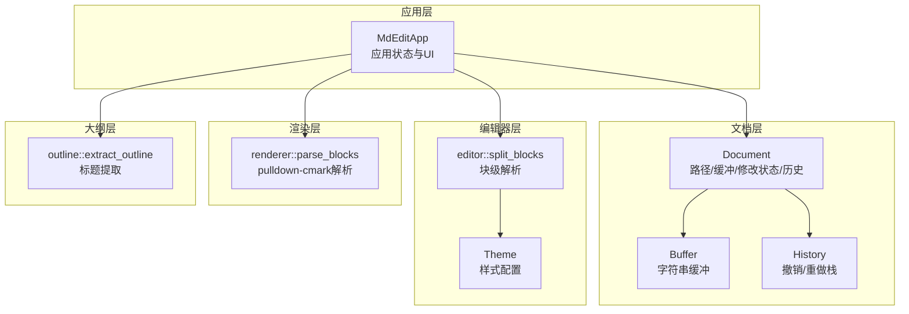
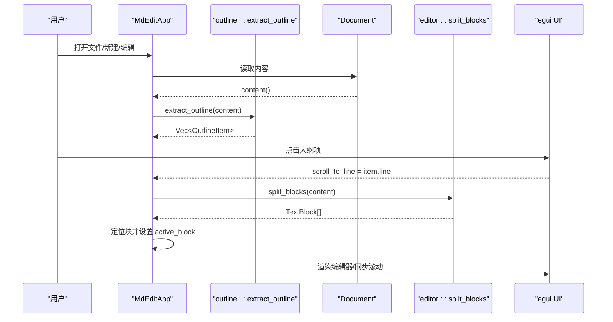
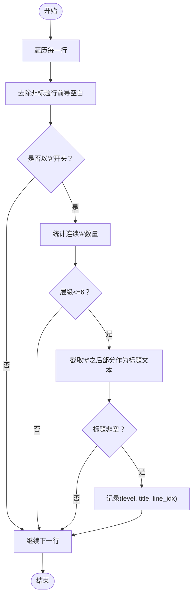
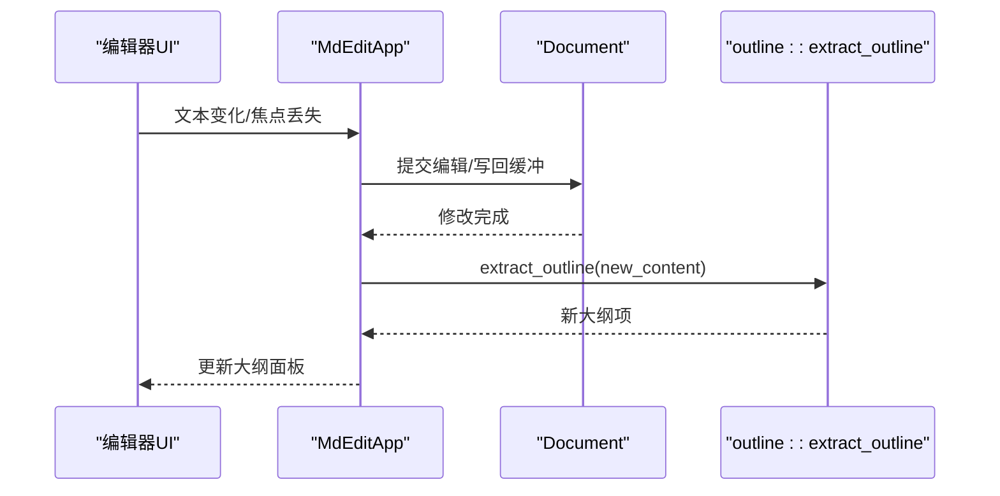
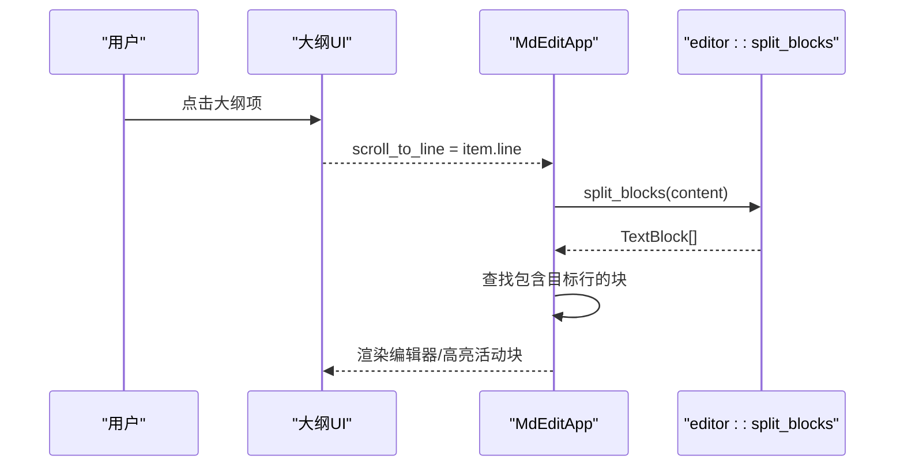
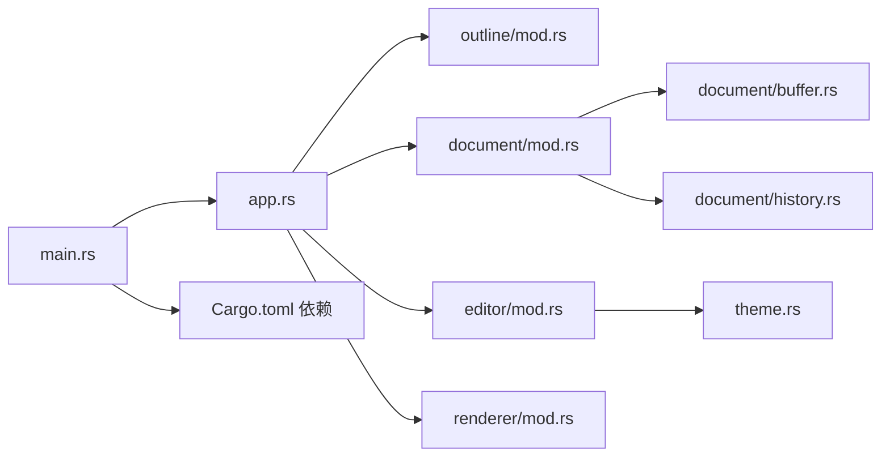

# 大纲导航系统

<cite>
**本文引用的文件**
- [src/outline/mod.rs](file://src/outline/mod.rs)
- [src/app.rs](file://src/app.rs)
- [src/document/mod.rs](file://src/document/mod.rs)
- [src/document/buffer.rs](file://src/document/buffer.rs)
- [src/document/history.rs](file://src/document/history.rs)
- [src/editor/mod.rs](file://src/editor/mod.rs)
- [src/renderer/mod.rs](file://src/renderer/mod.rs)
- [src/theme.rs](file://src/theme.rs)
- [src/main.rs](file://src/main.rs)
- [Cargo.toml](file://Cargo.toml)
- [README.md](file://README.md)
</cite>

## 目录
1. [简介](#简介)
2. [项目结构](#项目结构)
3. [核心组件](#核心组件)
4. [架构总览](#架构总览)
5. [详细组件分析](#详细组件分析)
6. [依赖关系分析](#依赖关系分析)
7. [性能考虑](#性能考虑)
8. [故障排除指南](#故障排除指南)
9. [结论](#结论)
10. [附录](#附录)

## 简介
本文件面向“大纲导航系统”的技术文档，围绕标题提取算法、大纲项数据结构、实时更新机制、导航交互设计、布局与响应式实现以及大文档性能优化进行深入说明。系统采用 Rust + egui 实现，具备实时标题导航、点击跳转、滚动同步与视觉反馈等能力，并针对大文档场景提供可扩展的优化思路。

## 项目结构
项目采用模块化组织，核心与编辑器、文档、渲染、主题等模块协同工作：
- outline 模块负责标题提取与大纲项结构
- document 模块负责文档内容缓冲与历史记录
- editor 模块负责块级结构解析与富文本渲染
- renderer 模块提供基于 pulldown-cmark 的块级解析（与 editor 的块级模型互补）
- app 模块整合 UI、事件处理与大纲面板
- theme 提供主题样式配置
- main 启动入口与窗口初始化

图表来源
- [src/app.rs:1-351](file://src/app.rs#L1-L351)
- [src/document/mod.rs:1-51](file://src/document/mod.rs#L1-L51)
- [src/document/buffer.rs:1-30](file://src/document/buffer.rs#L1-L30)
- [src/document/history.rs:1-59](file://src/document/history.rs#L1-L59)
- [src/editor/mod.rs:1-349](file://src/editor/mod.rs#L1-L349)
- [src/renderer/mod.rs:1-143](file://src/renderer/mod.rs#L1-L143)
- [src/outline/mod.rs:1-27](file://src/outline/mod.rs#L1-L27)

章节来源
- [src/app.rs:1-351](file://src/app.rs#L1-L351)
- [src/document/mod.rs:1-51](file://src/document/mod.rs#L1-L51)
- [src/editor/mod.rs:1-349](file://src/editor/mod.rs#L1-L349)
- [src/renderer/mod.rs:1-143](file://src/renderer/mod.rs#L1-L143)
- [src/outline/mod.rs:1-27](file://src/outline/mod.rs#L1-L27)
- [src/theme.rs:1-22](file://src/theme.rs#L1-L22)
- [src/main.rs:1-50](file://src/main.rs#L1-L50)

## 核心组件
- 大纲项结构 OutlineItem：包含层级 level、标题文本 title、行号 line
- 标题提取函数 extract_outline：按行扫描，识别以 # 开头的标题，计算层级并记录行号
- 应用状态 MdEditApp：维护文档、大纲项列表、是否显示大纲、滚动目标行、活动块等
- 文档 Document：封装 Buffer 与 History，提供内容读取与编辑应用接口
- 块级解析 editor::split_blocks：将文档拆分为多种块类型（含 Heading），用于渲染与定位
- 主题 Theme：提供标题字号、代码背景色、引用条颜色等样式参数

章节来源
- [src/outline/mod.rs:1-27](file://src/outline/mod.rs#L1-L27)
- [src/app.rs:1-351](file://src/app.rs#L1-L351)
- [src/document/mod.rs:1-51](file://src/document/mod.rs#L1-L51)
- [src/editor/mod.rs:1-349](file://src/editor/mod.rs#L1-L349)
- [src/theme.rs:1-22](file://src/theme.rs#L1-L22)

## 架构总览
大纲导航系统的关键流程：
- 初始化：从文件或空文档加载，立即提取大纲项
- 编辑时：在编辑器中修改内容后，重新提取大纲项
- 导航时：点击大纲项，计算对应块范围并滚动到该块
- 视图：侧边大纲面板与中央编辑区域并存，支持隐藏/显示

图表来源
- [src/app.rs:26-88](file://src/app.rs#L26-L88)
- [src/outline/mod.rs:7-26](file://src/outline/mod.rs#L7-L26)
- [src/editor/mod.rs:24-149](file://src/editor/mod.rs#L24-L149)

## 详细组件分析

### 标题提取算法与结构分析
- 层级识别：通过统计行首连续 # 数量确定层级，限制最大层级为 6
- 标题解析：去除前导 # 与空白，得到纯标题文本
- 行号映射：记录原始行索引，用于后续滚动定位
- 结果集合：返回有序的 OutlineItem 列表，便于 UI 展示与交互

图表来源
- [src/outline/mod.rs:7-26](file://src/outline/mod.rs#L7-L26)

章节来源
- [src/outline/mod.rs:1-27](file://src/outline/mod.rs#L1-L27)

### 大纲项数据结构设计
- 字段定义
  - level: u8，表示标题层级（1-6）
  - title: String，标题文本
  - line: usize，原始行号（用于滚动定位）
- 设计考量
  - 使用 u8 存储层级，节省空间且满足 Markdown 最大 6 级标题
  - 行号映射确保点击跳转的精确性
  - 结构简单，便于序列化与 UI 绑定

章节来源
- [src/outline/mod.rs:1-5](file://src/outline/mod.rs#L1-L5)

### 实时更新机制
- 文档变更监听
  - 编辑器多行文本框变化时触发：更新文档修改标记并重新提取大纲
  - commit_edit 提交编辑时，重建新内容并写回缓冲区，随后重新提取大纲
- 增量更新策略
  - 当前实现为全量重算：遍历全文提取标题
  - 可选优化：仅对受影响的块区间进行局部重算（需结合块级解析结果）
- 性能优化建议
  - 对超长文档采用分页/懒加载大纲
  - 缓存最近一次提取结果，若内容未变化则复用

图表来源
- [src/app.rs:275-328](file://src/app.rs#L275-L328)
- [src/outline/mod.rs:7-26](file://src/outline/mod.rs#L7-L26)

章节来源
- [src/app.rs:251-328](file://src/app.rs#L251-L328)
- [src/document/mod.rs:39-49](file://src/document/mod.rs#L39-L49)

### 导航交互设计
- 点击跳转
  - 大纲项按钮点击后设置 scroll_to_line，进入渲染阶段后定位到对应块
- 滚动同步
  - 根据目标行号在块级列表中查找包含该行的块，激活该块并进入编辑模式
- 视觉反馈
  - 大纲项缩进：(level-1)*12px，突出层级差异
  - 活动块高亮：当前编辑块使用多行文本编辑控件，其他块使用富文本渲染

图表来源
- [src/app.rs:220-239](file://src/app.rs#L220-L239)
- [src/app.rs:256-264](file://src/app.rs#L256-L264)
- [src/editor/mod.rs:24-149](file://src/editor/mod.rs#L24-L149)

章节来源
- [src/app.rs:220-264](file://src/app.rs#L220-L264)

### 布局策略与响应式设计
- 固定侧边栏：大纲面板默认宽度 200px，垂直滚动
- 中央编辑区：垂直滚动，使用 id_salt("editor_scroll") 保证滚动状态稳定
- 视图切换：菜单中提供“大纲面板”开关，支持隐藏/显示
- 响应式：窗口最小尺寸由 NativeOptions 设置，保证小屏体验

章节来源
- [src/app.rs:220-248](file://src/app.rs#L220-L248)
- [src/main.rs:37-42](file://src/main.rs#L37-L42)

### 与块级解析的协作
- editor::split_blocks 将文档拆分为多种块类型，其中包含 Heading 块
- 大纲项的行号与块级解析中的 start_line/end_line 对齐，便于精确定位
- 富文本渲染使用 Theme 控制标题字号与样式

章节来源
- [src/editor/mod.rs:4-22](file://src/editor/mod.rs#L4-L22)
- [src/editor/mod.rs:24-149](file://src/editor/mod.rs#L24-L149)
- [src/theme.rs:1-22](file://src/theme.rs#L1-L22)

## 依赖关系分析
- 外部依赖
  - eframe/egui：UI 框架与渲染
  - pulldown-cmark：块级解析（renderer 模块）
  - syntect：语法高亮（Cargo.toml）
  - rfd：文件对话框（打开/保存）
- 内部模块耦合
  - app 依赖 outline、document、editor、theme
  - document 依赖 buffer、history
  - editor 依赖 theme
  - renderer 与 editor 在块级解析上存在互补关系

图表来源
- [src/main.rs:1-50](file://src/main.rs#L1-L50)
- [src/app.rs:1-351](file://src/app.rs#L1-L351)
- [src/outline/mod.rs:1-27](file://src/outline/mod.rs#L1-L27)
- [src/document/mod.rs:1-51](file://src/document/mod.rs#L1-L51)
- [src/document/buffer.rs:1-30](file://src/document/buffer.rs#L1-L30)
- [src/document/history.rs:1-59](file://src/document/history.rs#L1-L59)
- [src/editor/mod.rs:1-349](file://src/editor/mod.rs#L1-L349)
- [src/renderer/mod.rs:1-143](file://src/renderer/mod.rs#L1-L143)
- [src/theme.rs:1-22](file://src/theme.rs#L1-L22)
- [Cargo.toml:8-13](file://Cargo.toml#L8-L13)

章节来源
- [Cargo.toml:8-13](file://Cargo.toml#L8-L13)
- [src/main.rs:1-50](file://src/main.rs#L1-L50)

## 性能考虑
- 当前实现特点
  - 全量重算：每次编辑或打开文件都会重新提取大纲
  - 块级解析：editor::split_blocks 会遍历所有行，构建块级结构
- 大文档优化建议
  - 分页/懒加载：仅展示可视范围内的大纲项，滚动时动态加载
  - 局部重算：基于编辑位置与块边界，只重算受影响的块区间
  - 缓存策略：对未修改的块保留旧结果，减少重复解析
  - 并行化：利用多核对不同段落并行解析（需谨慎处理共享状态）
  - 内存管理：避免频繁分配临时字符串；复用 Vec 容器；及时释放不再使用的中间结构
- 已有优化
  - release 配置启用 LTO、strip 等优化选项，有助于整体性能

章节来源
- [src/app.rs:275-328](file://src/app.rs#L275-L328)
- [src/editor/mod.rs:24-149](file://src/editor/mod.rs#L24-L149)
- [Cargo.toml:15-19](file://Cargo.toml#L15-L19)

## 故障排除指南
- 打开文件失败
  - 现象：命令行传入文件路径但读取失败
  - 处理：弹出消息提示并返回空初始文件
  - 参考路径：[src/main.rs:15-33](file://src/main.rs#L15-L33)
- 大纲不更新
  - 现象：编辑后大纲未刷新
  - 排查：确认编辑器变化回调是否触发了 outline 重算
  - 参考路径：[src/app.rs:275-328](file://src/app.rs#L275-L328)
- 点击跳转无效
  - 现象：点击大纲项无反应
  - 排查：检查 scroll_to_line 是否被正确设置；确认块级解析是否包含目标行
  - 参考路径：[src/app.rs:226-264](file://src/app.rs#L226-L264)
- 编辑提交异常
  - 现象：修改后未写回缓冲
  - 排查：检查 commit_edit 的块边界与行拼接逻辑
  - 参考路径：[src/app.rs:330-349](file://src/app.rs#L330-L349)

章节来源
- [src/main.rs:15-33](file://src/main.rs#L15-L33)
- [src/app.rs:226-349](file://src/app.rs#L226-L349)

## 结论
大纲导航系统以简洁高效的标题提取为核心，结合块级解析与 UI 交互，实现了从标题到内容的精准跳转。当前实现注重可读性与一致性，适合中小规模文档；对于大文档场景，建议引入分页、缓存与局部重算等优化策略，以进一步提升性能与用户体验。

## 附录
- 快捷键与功能概览
  - Ctrl+N：新建
  - Ctrl+O：打开
  - Ctrl+S：保存
  - Ctrl+Shift+S：另存为
- 主题配置
  - 标题字号数组、代码背景色、引用条颜色等可通过 Theme 调整
- 渲染对比
  - editor::render_rich_block：基于自定义块模型的渲染
  - renderer::parse_blocks：基于 pulldown-cmark 的块级解析（用于对比与扩展）

章节来源
- [README.md:37-44](file://README.md#L37-L44)
- [src/theme.rs:1-22](file://src/theme.rs#L1-L22)
- [src/renderer/mod.rs:1-143](file://src/renderer/mod.rs#L1-L143)
- [src/editor/mod.rs:159-266](file://src/editor/mod.rs#L159-L266)