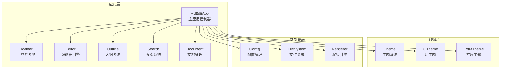
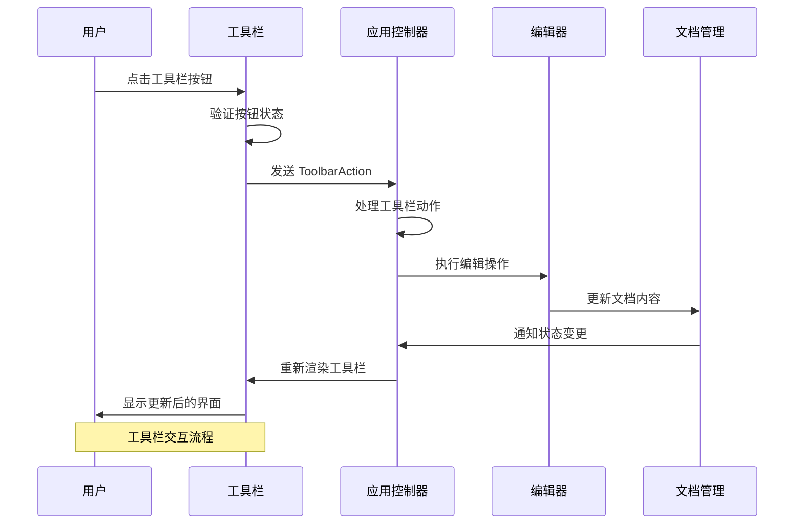
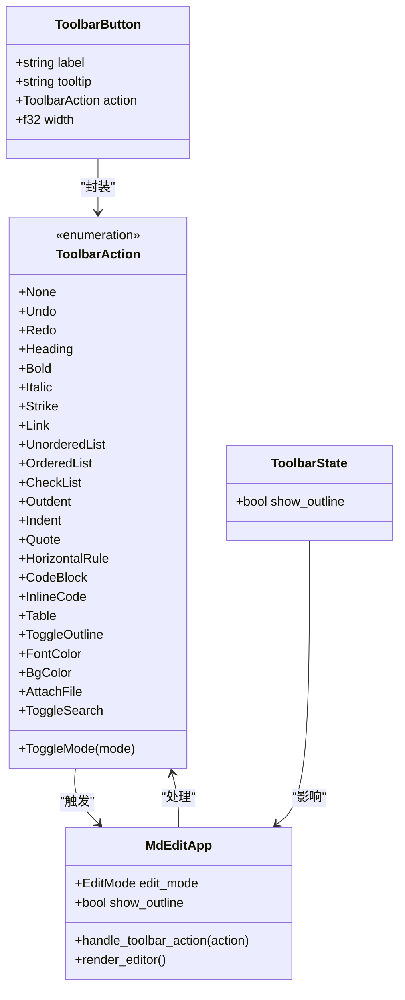
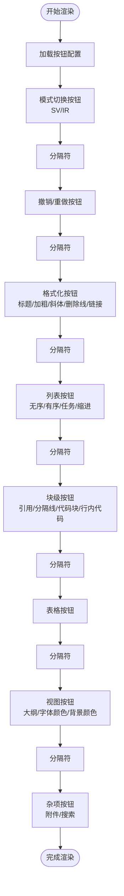
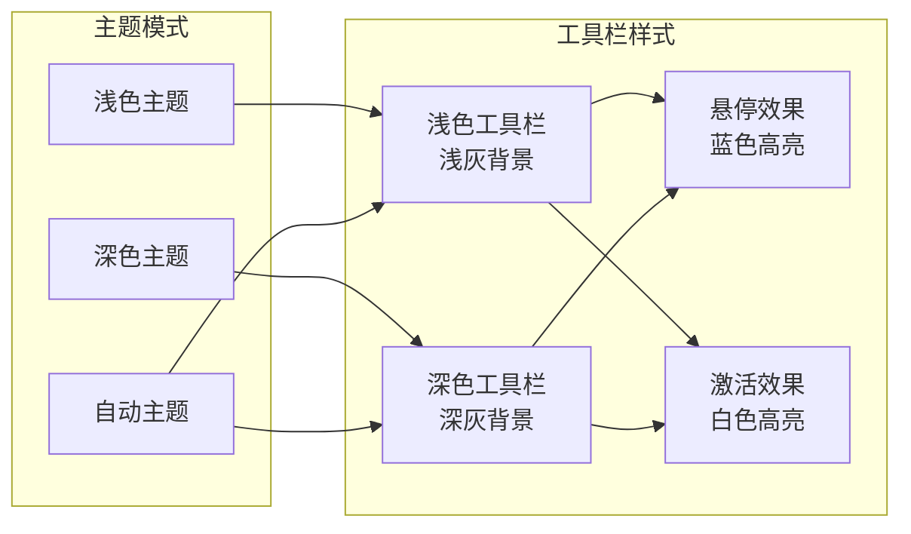
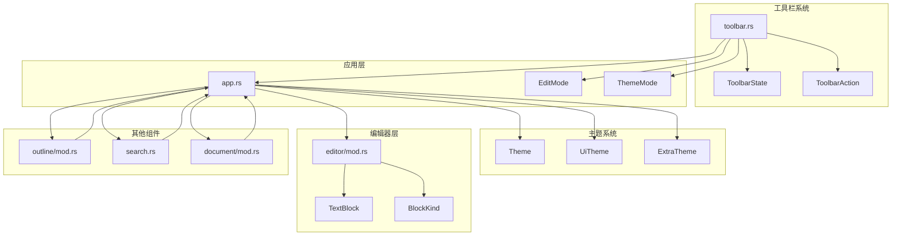

# 工具栏系统

<cite>
**本文档引用的文件**
- [src/main.rs](file://src/main.rs)
- [src/toolbar.rs](file://src/toolbar.rs)
- [src/app.rs](file://src/app.rs)
- [src/theme.rs](file://src/theme.rs)
- [src/editor/mod.rs](file://src/editor/mod.rs)
- [src/outline/mod.rs](file://src/outline/mod.rs)
- [src/search.rs](file://src/search.rs)
- [src/document/mod.rs](file://src/document/mod.rs)
- [Cargo.toml](file://Cargo.toml)
- [README.md](file://README.md)
</cite>

## 目录
1. [简介](#简介)
2. [项目结构](#项目结构)
3. [核心组件](#核心组件)
4. [架构概览](#架构概览)
5. [详细组件分析](#详细组件分析)
6. [依赖关系分析](#依赖关系分析)
7. [性能考虑](#性能考虑)
8. [故障排除指南](#故障排除指南)
9. [结论](#结论)

## 简介

工具栏系统是 mdedit Markdown 编辑器的核心交互组件，提供直观的编辑操作入口。该系统采用 Rust + egui 架构，实现了完整的工具栏渲染、事件处理和状态管理功能。工具栏支持多种编辑操作，包括文本格式化、块级元素插入、视图切换等功能，并与整个应用的编辑模式、主题系统和文件管理功能深度集成。

## 项目结构

mdedit 项目采用模块化设计，工具栏系统位于独立的模块中，与其他核心组件协同工作：

**图表来源**
- [src/app.rs:545-586](file://src/app.rs#L545-L586)
- [src/toolbar.rs:1-144](file://src/toolbar.rs#L1-L144)

**章节来源**
- [src/main.rs:1-286](file://src/main.rs#L1-L286)
- [Cargo.toml:1-21](file://Cargo.toml#L1-L21)

## 核心组件

工具栏系统由以下核心组件构成：

### 工具栏动作枚举
定义了所有可用的工具栏操作类型：
- 编辑模式切换：原始编辑/预览编辑
- 文本格式化：加粗、斜体、删除线、行内代码
- 块级元素：标题、引用、代码块、水平分隔线
- 列表操作：无序列表、有序列表、任务列表、缩进调整
- 表格支持：表格插入
- 视图控制：大纲显示、颜色选择、附件插入、搜索功能

### 工具栏状态管理
维护工具栏的当前状态：
- 大纲显示状态
- 当前编辑模式
- 活跃按钮标识

### 工具栏渲染引擎
负责工具栏的视觉呈现和交互处理：
- 按钮布局和样式
- 颜色主题适配
- 交互反馈机制

**章节来源**
- [src/toolbar.rs:5-35](file://src/toolbar.rs#L5-L35)
- [src/toolbar.rs:33-35](file://src/toolbar.rs#L33-L35)

## 架构概览

工具栏系统采用分层架构设计，确保了良好的模块化和可维护性：

**图表来源**
- [src/toolbar.rs:89-143](file://src/toolbar.rs#L89-L143)
- [src/app.rs:946-1009](file://src/app.rs#L946-L1009)

### 组件交互关系

**图表来源**
- [src/toolbar.rs:5-31](file://src/toolbar.rs#L5-L31)
- [src/toolbar.rs:33-42](file://src/toolbar.rs#L33-L42)
- [src/app.rs:545-586](file://src/app.rs#L545-L586)

## 详细组件分析

### 工具栏渲染引擎

工具栏渲染引擎负责将抽象的动作转换为可视化的按钮控件：

#### 按钮配置系统
工具栏采用精心设计的按钮布局，按照功能分类组织：

**图表来源**
- [src/toolbar.rs:44-87](file://src/toolbar.rs#L44-L87)

#### 交互处理机制
工具栏采用响应式设计，提供丰富的用户反馈：

| 交互类型 | 视觉反馈 | 状态变化 |
|---------|---------|---------|
| 悬停 | 颜色变化 | 高亮显示 |
| 点击 | 按下效果 | 动作执行 |
| 模式激活 | 框架高亮 | 当前模式指示 |
| 分隔符 | 线条显示 | 功能分组 |

**章节来源**
- [src/toolbar.rs:89-143](file://src/toolbar.rs#L89-L143)

### 编辑模式集成

工具栏与编辑模式系统深度集成，支持两种主要编辑模式：

#### 原始编辑模式 (Raw Mode)
- 纯文本编辑体验
- 直接编辑 Markdown 源码
- 适合高级用户和精确控制

#### 预览编辑模式 (Preview Mode)
- 所见即所得编辑
- 实时渲染 Markdown 内容
- 更友好的用户体验

**章节来源**
- [src/app.rs:41-44](file://src/app.rs#L41-L44)
- [src/app.rs:946-961](file://src/app.rs#L946-L961)

### 主题系统适配

工具栏根据当前主题自动调整外观：

**图表来源**
- [src/app.rs:1145-1178](file://src/app.rs#L1145-L1178)
- [src/theme.rs:83-226](file://src/theme.rs#L83-L226)

### 功能扩展点

工具栏系统预留了多个扩展点，支持未来功能增强：

| 功能类别 | 当前状态 | 扩展计划 |
|---------|---------|---------|
| 撤销重做 | 未实现 | 阶段7集成 |
| 颜色选择器 | 未实现 | 阶段8开发 |
| 附件功能 | 未实现 | 阶段8开发 |
| 搜索功能 | 未实现 | 阶段5开发 |
| 预览模式 | 完成 | 基础功能实现 |

**章节来源**
- [src/app.rs:962-967](file://src/app.rs#L962-L967)
- [src/app.rs:1002-1007](file://src/app.rs#L1002-L1007)
- [src/app.rs:992-994](file://src/app.rs#L992-L994)

## 依赖关系分析

工具栏系统与其他组件的依赖关系如下：

**图表来源**
- [src/toolbar.rs:1-144](file://src/toolbar.rs#L1-L144)
- [src/app.rs:25-28](file://src/app.rs#L25-L28)

### 关键依赖路径

工具栏系统的关键依赖关系体现在以下几个方面：

1. **状态传递**：ToolbarState 从 MdEditApp 传递给工具栏渲染函数
2. **动作处理**：ToolbarAction 通过 MdEditApp 的 handle_toolbar_action 方法处理
3. **主题适配**：工具栏颜色根据当前主题动态调整
4. **编辑器集成**：工具栏操作直接影响编辑器内容和状态

**章节来源**
- [src/app.rs:1164-1181](file://src/app.rs#L1164-L1181)
- [src/toolbar.rs:96-143](file://src/toolbar.rs#L96-L143)

## 性能考虑

工具栏系统在设计时充分考虑了性能优化：

### 渲染优化
- **惰性渲染**：仅在状态变化时重新渲染工具栏
- **批量更新**：工具栏按钮的点击事件批处理
- **内存复用**：按钮配置和样式对象的缓存机制

### 交互响应
- **快速反馈**：工具栏悬停和点击提供即时视觉反馈
- **状态同步**：工具栏状态与应用状态保持实时同步
- **事件冒泡**：最小化事件处理开销

### 内存管理
- **零拷贝设计**：按钮标签和工具栏状态使用引用而非复制
- **生命周期管理**：工具栏对象与应用生命周期绑定
- **资源清理**：自动清理不再使用的工具栏资源

## 故障排除指南

### 常见问题及解决方案

#### 工具栏按钮无响应
**症状**：点击工具栏按钮无任何反应  
**可能原因**：
- 工具栏动作处理逻辑异常
- 应用状态更新失败
- 事件传递中断

**解决步骤**：
1. 检查 handle_toolbar_action 方法的实现
2. 验证工具栏动作的正确传递
3. 确认应用状态的及时更新

#### 工具栏样式异常
**症状**：工具栏颜色或布局不符合预期  
**可能原因**：
- 主题切换未生效
- 颜色配置错误
- 样式缓存过期

**解决步骤**：
1. 验证主题系统的正常工作
2. 检查颜色配置的正确性
3. 清除样式缓存并重新加载

#### 工具栏状态不同步
**症状**：工具栏显示的状态与实际不符  
**可能原因**：
- 状态更新时机不当
- 并发访问冲突
- 状态传播延迟

**解决步骤**：
1. 检查状态更新的时机和顺序
2. 实施适当的并发控制
3. 优化状态传播机制

**章节来源**
- [src/app.rs:946-1009](file://src/app.rs#L946-L1009)
- [src/toolbar.rs:116-143](file://src/toolbar.rs#L116-L143)

## 结论

工具栏系统作为 mdedit 的核心交互组件，展现了优秀的架构设计和实现质量。系统采用模块化设计，与应用的其他组件形成了清晰的职责分离和紧密协作的关系。

### 主要优势
1. **模块化设计**：工具栏系统独立于其他组件，便于维护和扩展
2. **主题适配**：完全支持浅色、深色和自动主题模式
3. **功能完整性**：覆盖了 Markdown 编辑的主要操作需求
4. **性能优化**：采用了多种优化策略确保流畅的用户体验

### 技术亮点
- **响应式设计**：提供丰富的用户交互反馈
- **状态管理**：完善的工具栏状态跟踪和同步机制
- **扩展性**：预留了多个功能扩展点
- **错误处理**：健壮的错误处理和恢复机制

### 发展方向
随着应用功能的不断完善，工具栏系统将继续演进，重点包括：
- 撤销重做功能的完整实现
- 颜色选择器和附件功能的集成
- 搜索功能的增强
- 更多的编辑快捷方式支持

工具栏系统为 mdedit 提供了直观、高效的编辑体验，是整个应用生态系统中不可或缺的重要组成部分。