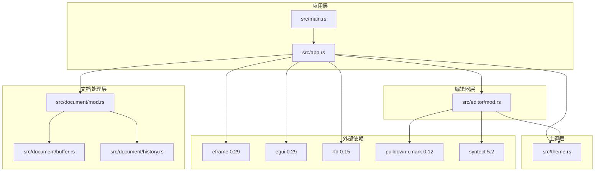
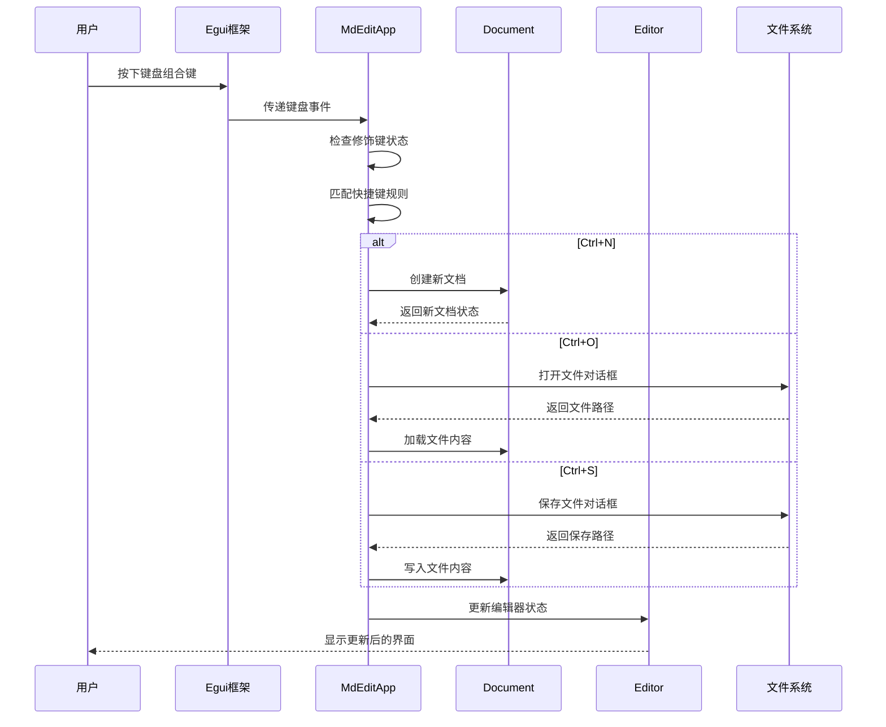
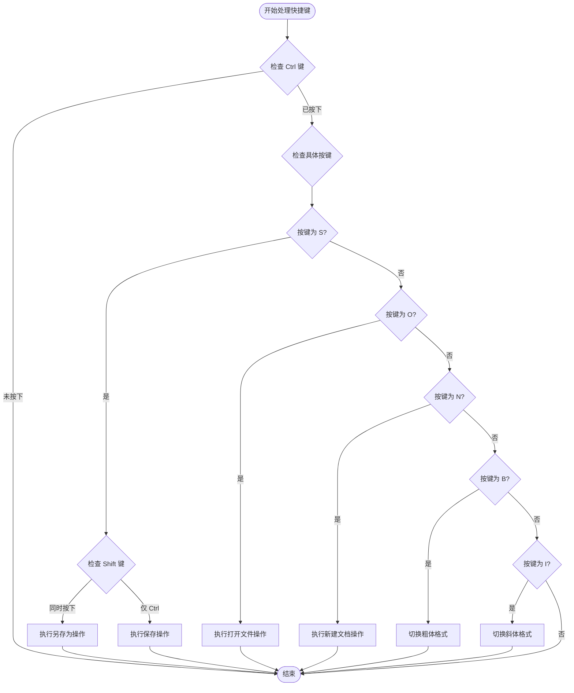
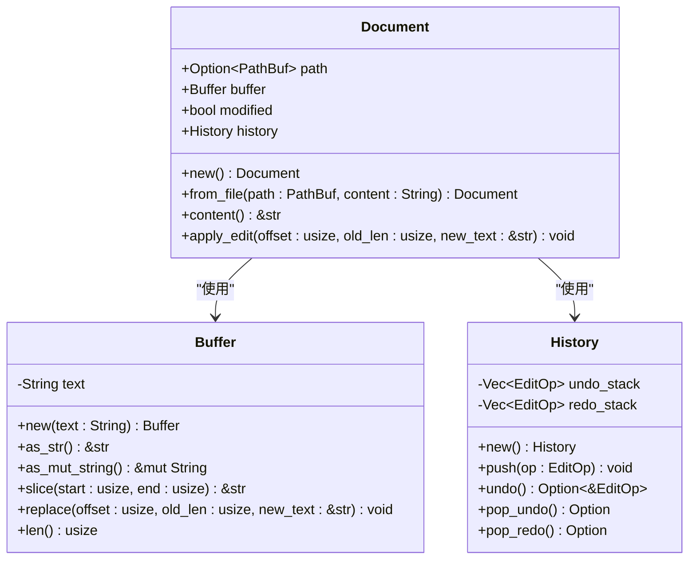
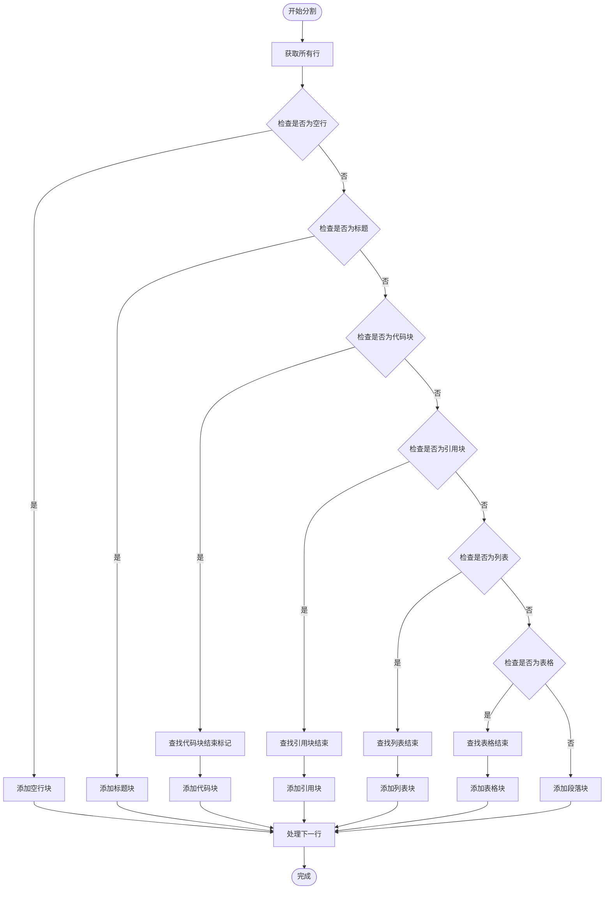
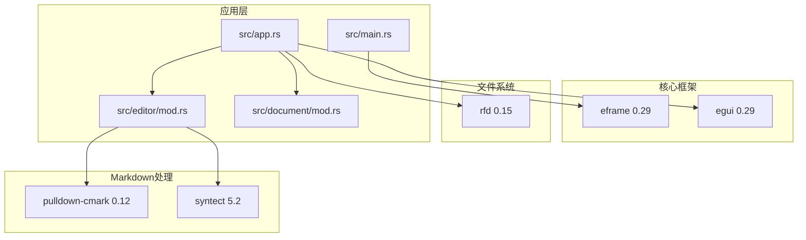

# 快捷键和键盘交互

<cite>
**本文档引用的文件**
- [src/main.rs](file://src/main.rs)
- [src/app.rs](file://src/app.rs)
- [src/editor/mod.rs](file://src/editor/mod.rs)
- [src/document/mod.rs](file://src/document/mod.rs)
- [src/document/buffer.rs](file://src/document/buffer.rs)
- [src/document/history.rs](file://src/document/history.rs)
- [src/theme.rs](file://src/theme.rs)
- [Cargo.toml](file://Cargo.toml)
- [README.md](file://README.md)
</cite>

## 目录
1. [简介](#简介)
2. [项目结构](#项目结构)
3. [核心组件](#核心组件)
4. [架构概览](#架构概览)
5. [详细组件分析](#详细组件分析)
6. [依赖关系分析](#依赖关系分析)
7. [性能考虑](#性能考虑)
8. [故障排除指南](#故障排除指南)
9. [结论](#结论)

## 简介

mdedit 是一个轻量级的跨平台 Markdown 编辑器，采用 Typora 式的所见即所得（WYSIWYG）渲染方式。本项目专注于提供高效的键盘快捷键系统和流畅的键盘交互体验。通过使用 eframe 和 egui 框架，mdedit 实现了完整的键盘事件处理机制，包括按键监听、修饰键处理、冲突解决和跨平台兼容性。

## 项目结构

mdedit 采用模块化的 Rust 项目结构，主要分为以下几个核心模块：

**图表来源**
- [src/main.rs:1-50](file://src/main.rs#L1-L50)
- [src/app.rs:1-351](file://src/app.rs#L1-L351)
- [Cargo.toml:1-19](file://Cargo.toml#L1-L19)

**章节来源**
- [src/main.rs:1-50](file://src/main.rs#L1-L50)
- [src/app.rs:1-351](file://src/app.rs#L1-L351)
- [Cargo.toml:1-19](file://Cargo.toml#L1-L19)

## 核心组件

### 快捷键系统架构

mdedit 的快捷键系统基于 egui 的事件处理机制构建，主要由以下核心组件组成：

#### 主应用类 (MdEditApp)
主应用类是整个快捷键系统的核心控制器，负责：
- 监听和处理全局键盘事件
- 管理文档状态和编辑操作
- 协调不同功能模块间的交互

#### 文档管理系统
负责管理文档内容、历史记录和缓冲区：
- Buffer：提供文本缓冲区操作
- History：实现撤销/重做功能
- Document：封装文档状态和操作

#### 编辑器模块
处理 Markdown 内容的解析和渲染：
- 文本块分割算法
- Markdown 语法高亮
- 富文本渲染

**章节来源**
- [src/app.rs:9-185](file://src/app.rs#L9-L185)
- [src/document/mod.rs:9-50](file://src/document/mod.rs#L9-L50)
- [src/editor/mod.rs:4-22](file://src/editor/mod.rs#L4-L22)

## 架构概览

mdedit 的快捷键系统采用分层架构设计，确保了良好的模块分离和可维护性：

**图表来源**
- [src/app.rs:90-114](file://src/app.rs#L90-L114)
- [src/app.rs:116-163](file://src/app.rs#L116-L163)

### 键盘事件处理流程

快捷键系统的事件处理遵循以下流程：

1. **事件捕获**：egui 捕获原始键盘事件
2. **修饰键检测**：检查 Ctrl、Alt、Shift 等修饰键状态
3. **按键匹配**：根据修饰键组合匹配预定义的快捷键
4. **功能执行**：调用相应的处理函数执行操作
5. **状态更新**：更新应用状态和界面显示

**章节来源**
- [src/app.rs:90-114](file://src/app.rs#L90-L114)

## 详细组件分析

### 快捷键处理器 (handle_shortcuts)

快捷键处理器是系统的核心组件，负责统一管理和处理所有键盘快捷键：

**图表来源**
- [src/app.rs:90-114](file://src/app.rs#L90-L114)

#### 修饰键处理机制

系统采用多级修饰键检测机制：

1. **基础修饰键检测**：首先检查 Ctrl 键状态
2. **组合键处理**：在 Ctrl 键激活时，进一步检查其他按键
3. **冲突解决**：通过按键顺序和修饰键组合解决冲突

**章节来源**
- [src/app.rs:90-114](file://src/app.rs#L90-L114)

### 常用快捷键实现

#### 文件操作快捷键

| 快捷键 | 功能 | 实现位置 | 说明 |
|--------|------|----------|------|
| Ctrl+N | 新建文档 | [src/app.rs:116-119](file://src/app.rs#L116-L119) | 清空当前文档并重置大纲 |
| Ctrl+O | 打开文件 | [src/app.rs:121-131](file://src/app.rs#L121-L131) | 使用文件对话框选择 Markdown 文件 |
| Ctrl+S | 保存文件 | [src/app.rs:133-151](file://src/app.rs#L133-L151) | 保存到现有路径或询问新路径 |

#### 编辑功能快捷键

| 快捷键 | 功能 | 实现位置 | 说明 |
|--------|------|----------|------|
| Ctrl+B | 粗体格式 | [src/app.rs:165-175](file://src/app.rs#L165-L175) | 切换文本粗体标记 |
| Ctrl+I | 斜体格式 | [src/app.rs:165-175](file://src/app.rs#L165-L175) | 切换文本斜体标记 |

#### 冲突解决策略

系统采用以下策略解决快捷键冲突：
1. **优先级排序**：Ctrl 组合键具有最高优先级
2. **按键顺序**：按按键被触发的顺序处理
3. **修饰键组合**：通过修饰键的不同组合区分功能

**章节来源**
- [src/app.rs:116-175](file://src/app.rs#L116-L175)

### 文档管理系统

#### Buffer 类设计

Buffer 类提供了高效的文本缓冲区操作：

**图表来源**
- [src/document/buffer.rs:1-30](file://src/document/buffer.rs#L1-L30)
- [src/document/mod.rs:9-50](file://src/document/mod.rs#L9-L50)
- [src/document/history.rs:1-59](file://src/document/history.rs#L1-L59)

#### 历史记录管理

History 类实现了完整的撤销/重做功能：

1. **操作记录**：记录每次编辑操作的详细信息
2. **栈式管理**：使用两个栈分别管理撤销和重做操作
3. **自动清理**：新操作会清除重做栈

**章节来源**
- [src/document/history.rs:12-58](file://src/document/history.rs#L12-L58)

### 编辑器模块

#### 文本块分割算法

编辑器模块实现了智能的文本块分割算法：

**图表来源**
- [src/editor/mod.rs:24-149](file://src/editor/mod.rs#L24-L149)

#### Markdown 解析器

编辑器模块集成了强大的 Markdown 解析功能：

1. **标题解析**：支持 1-6 级标题
2. **代码块处理**：支持语法高亮
3. **列表渲染**：支持有序和无序列表
4. **表格支持**：支持复杂表格结构
5. **引用块**：支持多行引用

**章节来源**
- [src/editor/mod.rs:24-149](file://src/editor/mod.rs#L24-L149)

## 依赖关系分析

### 外部依赖架构

mdedit 的依赖关系清晰明确，主要依赖于现代 Rust 生态系统：

**图表来源**
- [Cargo.toml:8-13](file://Cargo.toml#L8-L13)
- [src/main.rs:10-13](file://src/main.rs#L10-L13)

### 关键依赖特性

#### eframe 和 egui
- 提供跨平台 GUI 框架
- 支持原生窗口和渲染
- 内置键盘事件处理机制

#### pulldown-cmark
- 轻量级 Markdown 解析器
- 符合 CommonMark 规范
- 高性能文本处理

#### syntect
- 语法高亮引擎
- 支持多种编程语言
- 可定制的主题系统

**章节来源**
- [Cargo.toml:8-13](file://Cargo.toml#L8-L13)

## 性能考虑

### 键盘事件处理优化

mdedit 在键盘事件处理方面采用了多项优化措施：

1. **事件去重**：避免重复处理相同的按键事件
2. **条件检查**：只在必要时进行复杂的按键匹配
3. **状态缓存**：缓存修饰键状态减少重复查询

### 内存管理

- **零拷贝字符串**：使用引用而非复制字符串数据
- **增量更新**：只更新受影响的文本块
- **智能布局**：使用 egui 的高效布局系统

### 渲染优化

- **虚拟滚动**：只渲染可见区域的内容
- **增量渲染**：只重新渲染变化的部分
- **字体缓存**：缓存字体和样式信息

## 故障排除指南

### 常见问题诊断

#### 快捷键不响应

**可能原因**：
1. 应用窗口未获得焦点
2. 修饰键检测失败
3. 快捷键被其他组件拦截

**解决方案**：
1. 确保应用窗口处于活动状态
2. 检查 egui 的输入状态
3. 验证事件处理链路

#### 文档状态异常

**可能原因**：
1. Buffer 操作失败
2. 历史记录栈状态不一致
3. 文件写入错误

**解决方案**：
1. 检查 Buffer 的 replace 操作
2. 验证 History 栈的状态
3. 确认文件权限和路径

**章节来源**
- [src/app.rs:133-163](file://src/app.rs#L133-L163)
- [src/document/buffer.rs:22-24](file://src/document/buffer.rs#L22-L24)

### 调试技巧

1. **启用日志输出**：在开发模式下添加详细的调试信息
2. **事件跟踪**：监控键盘事件的完整生命周期
3. **状态检查**：定期验证应用状态的一致性

## 结论

mdedit 的快捷键和键盘交互系统展现了现代 Rust 应用程序的最佳实践。通过精心设计的架构和高效的实现，系统提供了流畅的用户体验和良好的可维护性。

### 主要优势

1. **模块化设计**：清晰的职责分离使得系统易于理解和扩展
2. **跨平台兼容**：充分利用 eframe 的跨平台特性
3. **性能优化**：通过多种技术手段确保响应速度
4. **错误处理**：完善的错误处理和恢复机制

### 未来改进方向

1. **自定义配置**：允许用户自定义快捷键绑定
2. **增强的无障碍支持**：改进键盘导航和屏幕阅读器支持
3. **高级编辑功能**：添加更多 Markdown 编辑功能
4. **性能监控**：集成性能分析工具

该系统为类似的应用程序提供了优秀的参考实现，展示了如何在保持简洁性的同时实现强大的功能。