# 文件操作功能

<cite>
**本文档引用的文件**
- [src/main.rs](file://src/main.rs)
- [src/app.rs](file://src/app.rs)
- [src/auto_save.rs](file://src/auto_save.rs)
- [src/config.rs](file://src/config.rs)
- [src/document/mod.rs](file://src/document/mod.rs)
- [src/document/buffer.rs](file://src/document/buffer.rs)
- [src/document/history.rs](file://src/document/history.rs)
- [src/editor/mod.rs](file://src/editor/mod.rs)
- [src/outline/mod.rs](file://src/outline/mod.rs)
- [Cargo.toml](file://Cargo.toml)
- [docs/superpowers/specs/2026-05-28-cli-open-file-design.md](file://docs/superpowers/specs/2026-05-28-cli-open-file-design.md)
- [docs/superpowers/plans/2026-05-28-cli-open-file.md](file://docs/superpowers/plans/2026-05-28-cli-open-file.md)
- [README.md](file://README.md)
</cite>

## 目录
1. [简介](#简介)
2. [项目结构](#项目结构)
3. [核心组件](#核心组件)
4. [架构概览](#架构概览)
5. [详细组件分析](#详细组件分析)
6. [依赖关系分析](#依赖关系分析)
7. [性能考虑](#性能考虑)
8. [故障排除指南](#故障排除指南)
9. [结论](#结论)
10. [附录](#附录)

## 简介

mdedit 是一个轻量级跨平台 Markdown 编辑器，采用 Typora 式的所见即所得（WYSIWYG）编辑体验。本文档深入分析文件操作功能的技术实现，包括文件对话框集成、原生系统交互机制、文件读写流程、路径管理策略、格式验证、**自动保存机制**和**配置管理**，以及异步处理和进度监控实现。

## 项目结构

mdedit 采用模块化架构设计，文件操作功能主要分布在以下几个核心模块中：

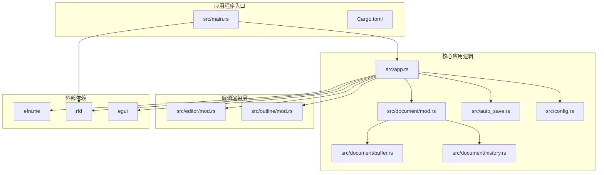

**图表来源**
- [src/main.rs:1-50](file://src/main.rs#L1-L50)
- [src/app.rs:1-351](file://src/app.rs#L1-L351)
- [src/auto_save.rs:1-33](file://src/auto_save.rs#L1-L33)
- [src/config.rs:1-91](file://src/config.rs#L1-L91)
- [Cargo.toml:1-19](file://Cargo.toml#L1-L19)

**章节来源**
- [src/main.rs:1-50](file://src/main.rs#L1-L50)
- [src/app.rs:1-351](file://src/app.rs#L1-L351)
- [src/auto_save.rs:1-33](file://src/auto_save.rs#L1-L33)
- [src/config.rs:1-91](file://src/config.rs#L1-L91)
- [Cargo.toml:1-19](file://Cargo.toml#L1-L19)

## 核心组件

### 文件对话框集成

mdedit 使用 rfd（Rust File Dialog）库实现跨平台文件对话框功能：

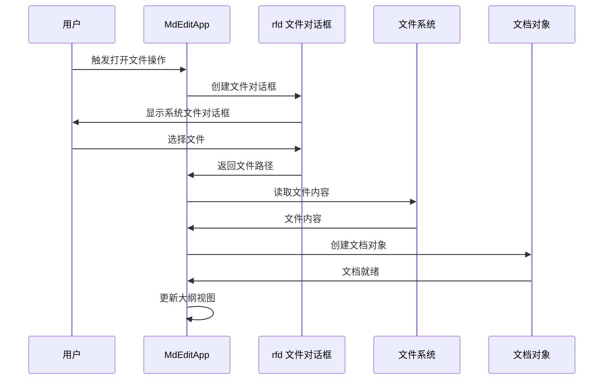

**图表来源**
- [src/app.rs:884-900](file://src/app.rs#L884-L900)
- [src/app.rs:902-932](file://src/app.rs#L902-L932)

### 文档管理系统

文档系统采用缓冲区和历史记录分离的设计模式：

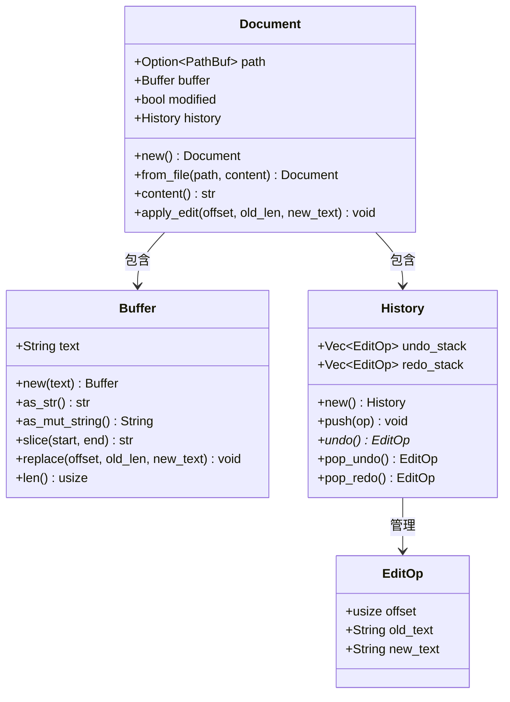

**图表来源**
- [src/document/mod.rs:9-50](file://src/document/mod.rs#L9-L50)
- [src/document/buffer.rs:1-30](file://src/document/buffer.rs#L1-L30)
- [src/document/history.rs:1-59](file://src/document/history.rs#L1-L59)

### 自动保存机制

mdedit 现已集成自动保存功能，通过 `AutoSaveState` 结构体管理自动保存状态：

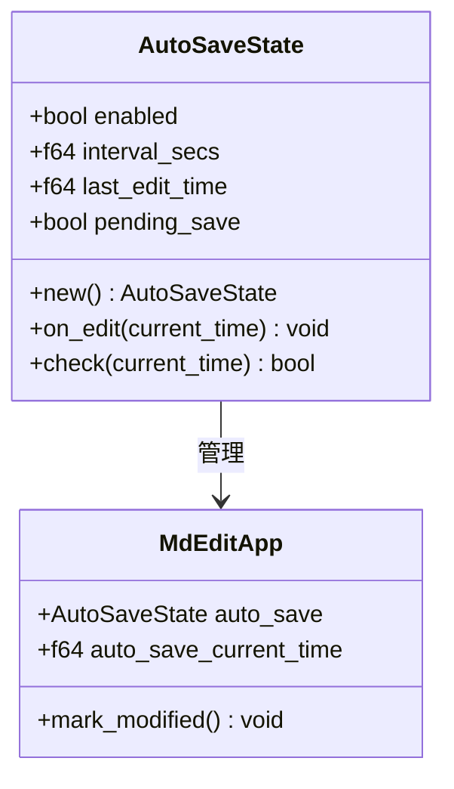

**图表来源**
- [src/auto_save.rs:1-33](file://src/auto_save.rs#L1-L33)
- [src/app.rs:580-582](file://src/app.rs#L580-L582)
- [src/app.rs:877-882](file://src/app.rs#L877-L882)

### 配置管理系统

mdedit 提供完整的配置管理功能，通过 `AppConfig` 结构体实现配置的持久化：

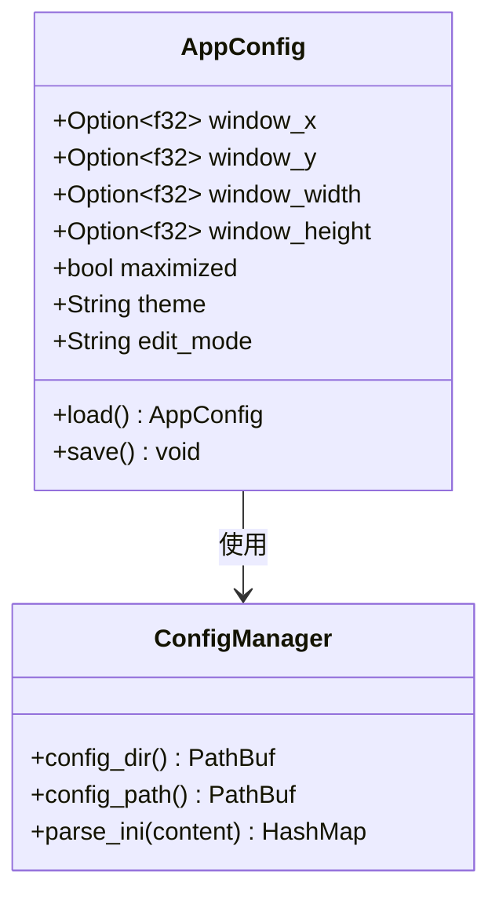

**图表来源**
- [src/config.rs:20-77](file://src/config.rs#L20-L77)

**章节来源**
- [src/document/mod.rs:1-51](file://src/document/mod.rs#L1-L51)
- [src/document/buffer.rs:1-30](file://src/document/buffer.rs#L1-L30)
- [src/document/history.rs:1-59](file://src/document/history.rs#L1-L59)
- [src/auto_save.rs:1-33](file://src/auto_save.rs#L1-L33)
- [src/config.rs:1-91](file://src/config.rs#L1-L91)

## 架构概览

mdedit 的文件操作架构采用分层设计，确保了良好的职责分离和可维护性：

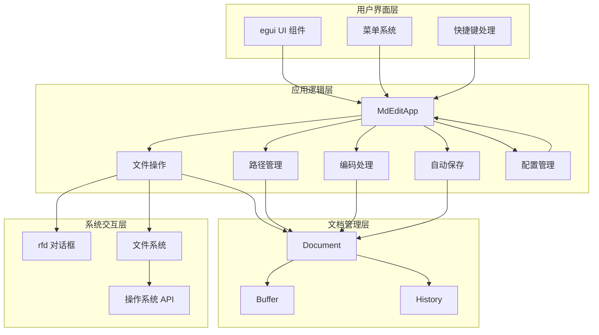

**图表来源**
- [src/app.rs:1037-1076](file://src/app.rs#L1037-L1076)
- [src/main.rs:210](file://src/main.rs#L210)

## 详细组件分析

### 命令行文件打开功能

mdedit 实现了完整的命令行文件打开功能，支持通过命令行参数直接启动并打开指定文件：

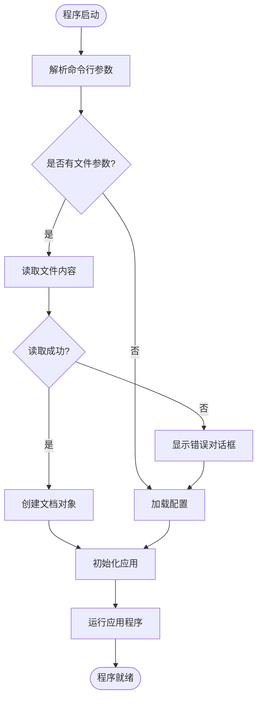

**图表来源**
- [src/main.rs:151-179](file://src/main.rs#L151-L179)
- [src/app.rs:589-674](file://src/app.rs#L589-L674)

#### 命令行参数解析实现

命令行文件打开功能的核心实现位于 `load_initial_file` 函数中：

**章节来源**
- [src/main.rs:151-179](file://src/main.rs#L151-L179)
- [docs/superpowers/specs/2026-05-28-cli-open-file-design.md:56-76](file://docs/superpowers/specs/2026-05-28-cli-open-file-design.md#L56-L76)

### 文件对话框集成机制

mdedit 使用 rfd 库实现跨平台文件对话框，支持 Windows、macOS 和 Linux 系统：

#### 打开文件对话框

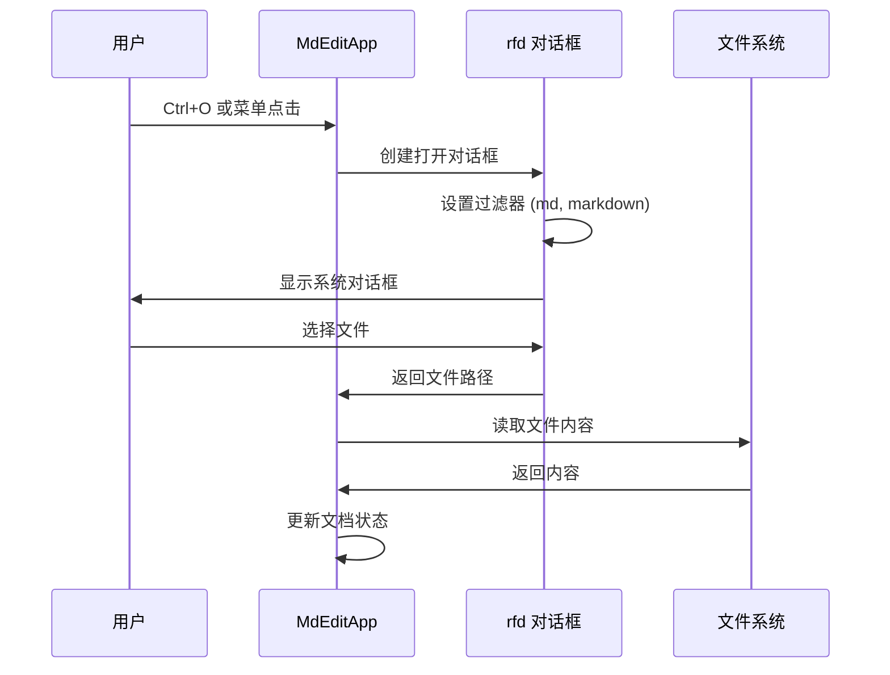

**图表来源**
- [src/app.rs:884-900](file://src/app.rs#L884-L900)

#### 保存文件对话框

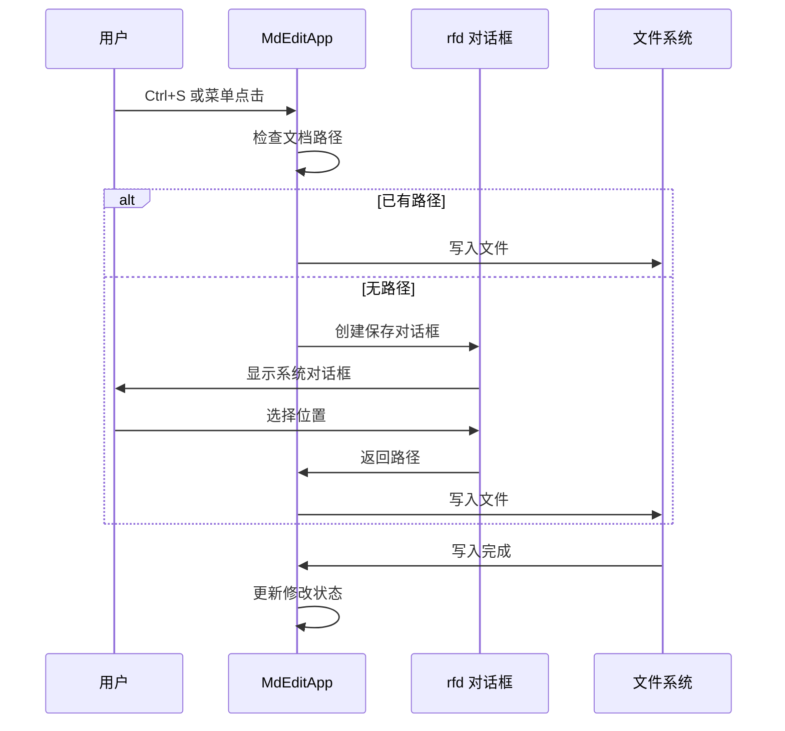

**图表来源**
- [src/app.rs:902-932](file://src/app.rs#L902-L932)

**章节来源**
- [src/app.rs:884-932](file://src/app.rs#L884-L932)

### 文件读写流程

mdedit 的文件读写流程采用同步阻塞方式，确保简单可靠的数据处理：

#### 文件读取流程


**图表来源**
- [src/app.rs:884-900](file://src/app.rs#L884-L900)
- [src/main.rs:167-178](file://src/main.rs#L167-L178)

#### 文件写入流程

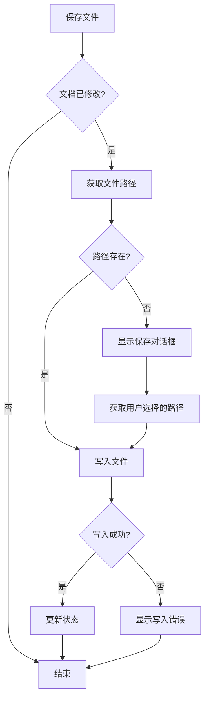

**图表来源**
- [src/app.rs:902-932](file://src/app.rs#L902-L932)

**章节来源**
- [src/app.rs:884-932](file://src/app.rs#L884-L932)

### 编码处理机制

mdedit 采用 UTF-8 编码处理策略，确保跨平台兼容性和数据完整性：

#### 编码验证流程

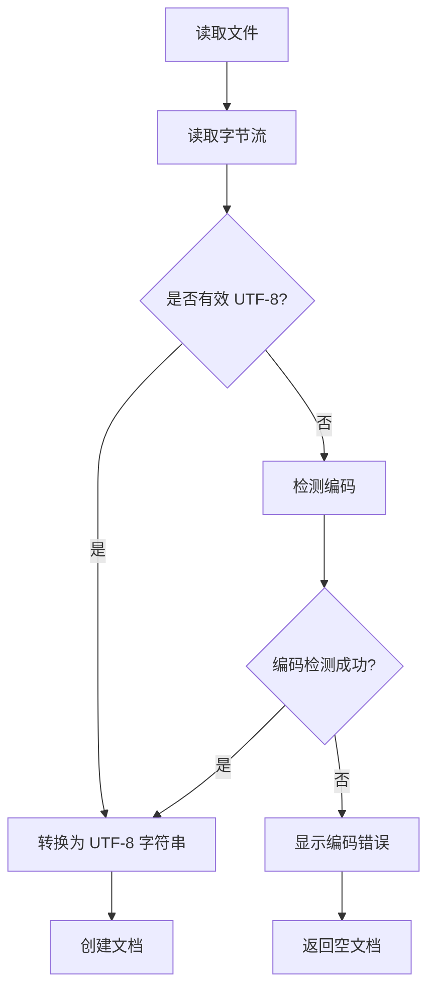

**图表来源**
- [src/main.rs:167-178](file://src/main.rs#L167-L178)

### 路径管理策略

mdedit 采用相对路径解析策略，遵循操作系统当前工作目录约定：

#### 路径解析流程


**图表来源**
- [src/main.rs:167](file://src/main.rs#L167)

**章节来源**
- [src/main.rs:151-179](file://src/main.rs#L151-L179)

### 文件格式验证

mdedit 通过扩展名过滤和内容验证确保文件格式正确性：

#### 格式验证流程

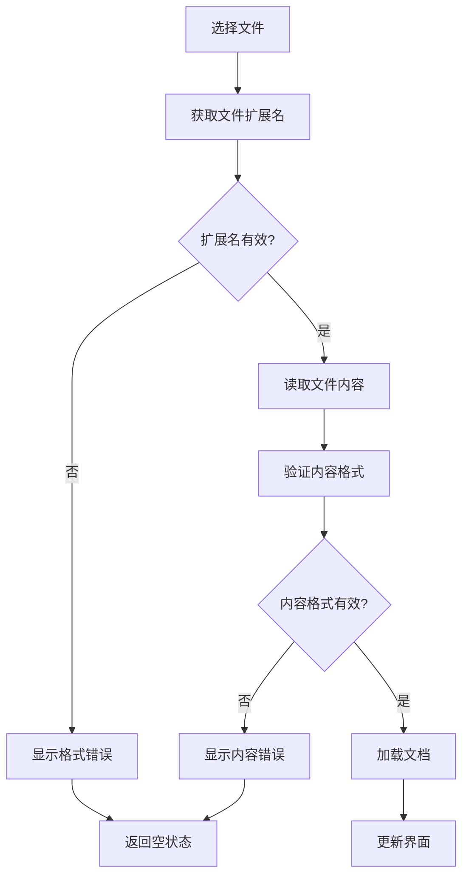

**图表来源**
- [src/app.rs:885-886](file://src/app.rs#L885-L886)

### 自动保存机制

**更新** mdedit 现已集成自动保存功能，提供智能的文件保护机制：

#### 自动保存状态管理

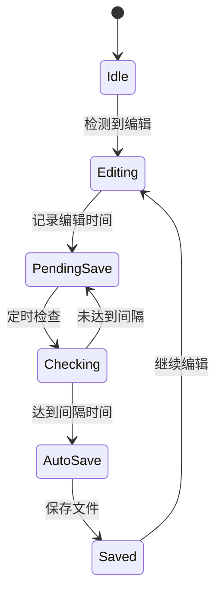

**图表来源**
- [src/auto_save.rs:8-31](file://src/auto_save.rs#L8-L31)
- [src/app.rs:1067-1076](file://src/app.rs#L1067-L1076)

#### 自动保存检查流程

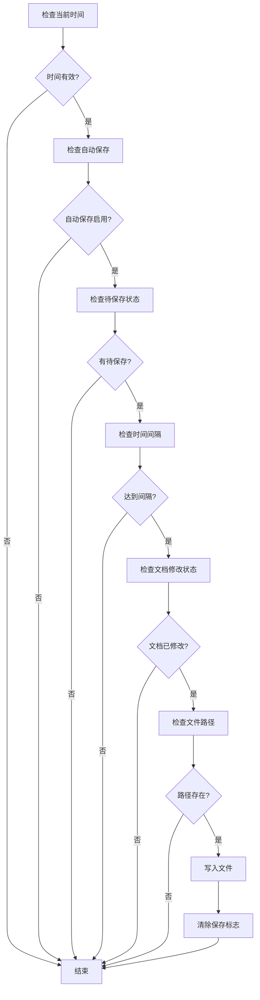

**图表来源**
- [src/app.rs:1067-1076](file://src/app.rs#L1067-L1076)

**章节来源**
- [src/auto_save.rs:1-33](file://src/auto_save.rs#L1-L33)
- [src/app.rs:1067-1076](file://src/app.rs#L1067-L1076)

### 配置管理

**更新** mdedit 现已集成完整的配置管理系统，支持窗口状态、主题和编辑模式的持久化：

#### 配置加载流程

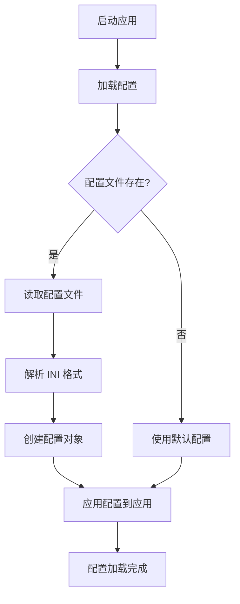

**图表来源**
- [src/config.rs:32-48](file://src/config.rs#L32-L48)
- [src/main.rs:210](file://src/main.rs#L210)

#### 配置保存流程

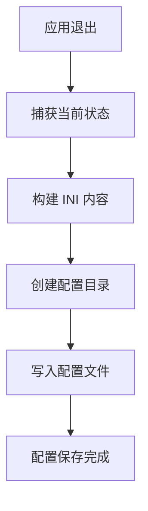

**图表来源**
- [src/app.rs:1861-1879](file://src/app.rs#L1861-L1879)
- [src/config.rs:50-76](file://src/config.rs#L50-L76)

**章节来源**
- [src/config.rs:1-91](file://src/config.rs#L1-L91)
- [src/app.rs:1861-1879](file://src/app.rs#L1861-L1879)

### 异步处理和进度监控

mdedit 采用同步阻塞文件操作，简化实现但可能影响用户体验。对于大文件操作，建议考虑异步处理方案：

#### 异步文件操作建议


**图表来源**
- [src/app.rs:884-932](file://src/app.rs#L884-L932)

## 依赖关系分析

mdedit 的文件操作功能依赖于以下关键组件：

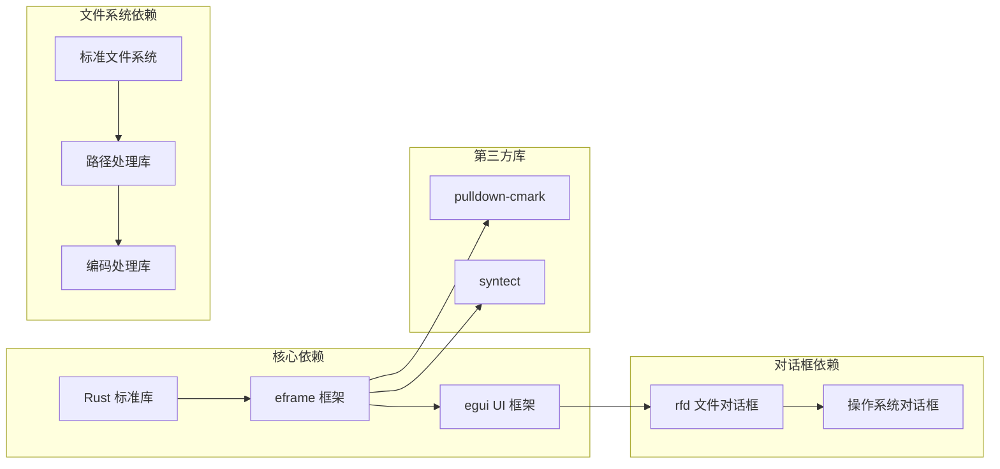

**图表来源**
- [Cargo.toml:8-13](file://Cargo.toml#L8-L13)

**章节来源**
- [Cargo.toml:1-19](file://Cargo.toml#L1-L19)

## 性能考虑

### 文件操作性能优化

mdedit 的文件操作性能主要受以下因素影响：

1. **内存使用**: 文档内容存储在内存中，大文件可能导致内存压力
2. **I/O 操作**: 同步文件读写阻塞 UI 线程
3. **编码转换**: UTF-8 验证和转换的 CPU 开销
4. **界面更新**: 大文档的渲染和更新成本
5. **自动保存开销**: 定时检查和文件写入的性能影响

### 建议的性能优化方案

1. **分块读取**: 对于大文件采用分块读取策略
2. **异步处理**: 将文件操作移至后台线程
3. **增量渲染**: 实现文档的增量渲染机制
4. **内存映射**: 对超大文件考虑使用内存映射
5. **智能自动保存**: 优化自动保存检查频率和时机

## 故障排除指南

### 常见文件操作问题

#### 文件读取失败

**症状**: 程序启动时弹出错误对话框，显示文件读取失败

**可能原因**:
1. 文件不存在或路径错误
2. 权限不足无法访问文件
3. 文件编码不符合 UTF-8 标准
4. 文件损坏或格式不正确

**解决方案**:
1. 验证文件路径的正确性
2. 检查文件权限设置
3. 确认文件编码格式
4. 尝试使用文本编辑器修复文件

#### 文件保存失败

**症状**: 保存操作后文件未更新或出现错误

**可能原因**:
1. 目标目录权限不足
2. 磁盘空间不足
3. 文件被其他程序占用
4. 路径包含非法字符

**解决方案**:
1. 检查目标目录权限
2. 确保磁盘有足够的可用空间
3. 关闭占用文件的其他程序
4. 使用合法的文件名和路径

#### 编码问题

**症状**: 文件内容显示乱码或特殊字符异常

**可能原因**:
1. 文件使用非 UTF-8 编码
2. 编码检测失败
3. 多种编码混合使用

**解决方案**:
1. 确认文件的实际编码格式
2. 使用支持多种编码的文本编辑器转换
3. 在导入时选择正确的编码格式

#### 自动保存问题

**症状**: 自动保存功能不工作或频繁触发

**可能原因**:
1. 时间戳获取失败
2. 文件路径无效
3. 磁盘写入权限不足
4. 配置参数设置不当

**解决方案**:
1. 检查系统时间设置
2. 验证文件路径的有效性
3. 确认磁盘写入权限
4. 调整自动保存间隔设置

#### 配置加载失败

**症状**: 应用启动时配置丢失或重置

**可能原因**:
1. 配置文件损坏
2. 配置目录权限不足
3. INI 格式解析错误
4. 环境变量设置问题

**解决方案**:
1. 删除损坏的配置文件
2. 检查配置目录权限
3. 验证 INI 文件格式
4. 检查 APPDATA 环境变量

**章节来源**
- [src/main.rs:171-178](file://src/main.rs#L171-L178)
- [src/app.rs:889-899](file://src/app.rs#L889-L899)
- [src/auto_save.rs:18-31](file://src/auto_save.rs#L18-L31)
- [src/config.rs:34-47](file://src/config.rs#L34-L47)

## 结论

mdedit 的文件操作功能实现了跨平台的文件管理和编辑体验。通过合理的架构设计和依赖管理，系统提供了稳定可靠的文件操作能力。**最新版本引入了自动保存机制和配置管理功能**，显著提升了用户体验和数据安全性。

当前版本的主要特性包括：
1. **自动保存机制**：智能的文件保护，防止意外数据丢失
2. **配置持久化**：窗口状态、主题和编辑模式的持久化存储
3. **增强的文件对话框集成**：更完善的文件操作体验
4. **同步阻塞的文件操作**：确保实现的简洁性和可靠性

未来可以考虑的改进方向包括：
1. 实现异步文件操作以提升用户体验
2. 优化自动保存性能和频率控制
3. 增强配置管理的灵活性和扩展性
4. 优化大文件处理性能
5. 增强错误恢复和异常处理能力

## 附录

### 快速开始指南

#### 命令行使用

```bash
# 启动空白编辑器
cargo run

# 直接打开文件
cargo run -- README.md

# 或使用编译后的可执行文件
./target/release/mdedit
./target/release/mdedit README.md
```

#### 快捷键参考

| 快捷键 | 功能 |
|--------|------|
| Ctrl+N | 新建文档 |
| Ctrl+O | 打开文件 |
| Ctrl+S | 保存文件 |
| Ctrl+Shift+S | 另存为 |

### 技术规范

#### 支持的文件格式

- Markdown (.md, .markdown)
- UTF-8 编码文本文件

#### 系统要求

- Rust 1.70+
- Windows (GNU): 需要 MSYS2 MinGW64 工具链
- 跨平台支持: Windows, macOS, Linux

#### 自动保存配置

- 默认间隔: 60 秒
- 启用状态: 默认启用
- 触发条件: 检测到编辑且达到间隔时间

#### 配置文件格式

配置文件采用 INI 格式存储，支持以下字段：
- `window_x`, `window_y`: 窗口位置
- `window_width`, `window_height`: 窗口尺寸
- `maximized`: 最大化状态
- `theme`: 主题设置 (light/dark/auto)
- `edit_mode`: 编辑模式 (raw/preview)