# 文件树组件

<cite>
**本文档引用的文件**
- [file_tree.rs](file://src/file_tree.rs)
- [app.rs](file://src/app.rs)
- [main.rs](file://src/main.rs)
- [Cargo.toml](file://Cargo.toml)
- [README.md](file://README.md)
</cite>

## 目录
1. [简介](#简介)
2. [项目结构](#项目结构)
3. [核心组件](#核心组件)
4. [架构概览](#架构概览)
5. [详细组件分析](#详细组件分析)
6. [依赖关系分析](#依赖关系分析)
7. [性能考虑](#性能考虑)
8. [故障排除指南](#故障排除指南)
9. [结论](#结论)

## 简介

文件树组件是 mdedit Markdown 编辑器中的核心功能模块，提供了一个直观的文件管理系统，允许用户浏览、管理和操作本地文件系统中的 Markdown 文件。该组件基于 egui 框架构建，提供了丰富的交互功能，包括文件树渲染、节点展开/折叠、右键菜单操作、剪贴板功能等。

mdedit 是一个轻量级的跨平台 Markdown 编辑器，具有 Typora 式的所见即所得编辑体验，无需 WebView2 技术。该项目专注于提供快速、高效的 Markdown 编写环境。

## 项目结构

项目采用模块化设计，文件树组件位于独立的模块中，便于维护和测试。整体项目结构如下：

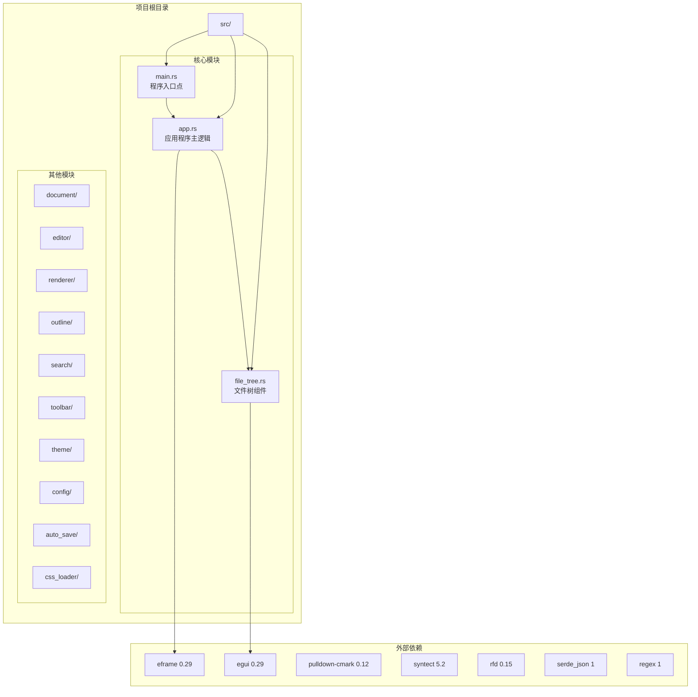

**图表来源**
- [Cargo.toml:1-21](file://Cargo.toml#L1-L21)
- [main.rs:1-286](file://src/main.rs#L1-L286)

**章节来源**
- [Cargo.toml:1-21](file://Cargo.toml#L1-L21)
- [README.md:1-48](file://README.md#L1-L48)

## 核心组件

文件树组件由多个核心结构和函数组成，每个部分都有明确的职责和功能：

### 数据结构层次

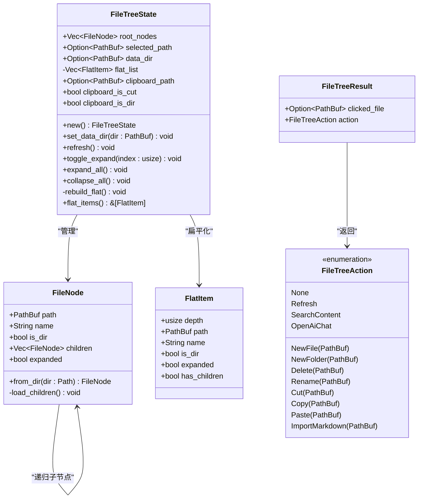

**图表来源**
- [file_tree.rs:4-239](file://src/file_tree.rs#L4-L239)

### 渲染函数

文件树组件的核心渲染函数 `render_file_tree` 提供了完整的 UI 渲染逻辑：

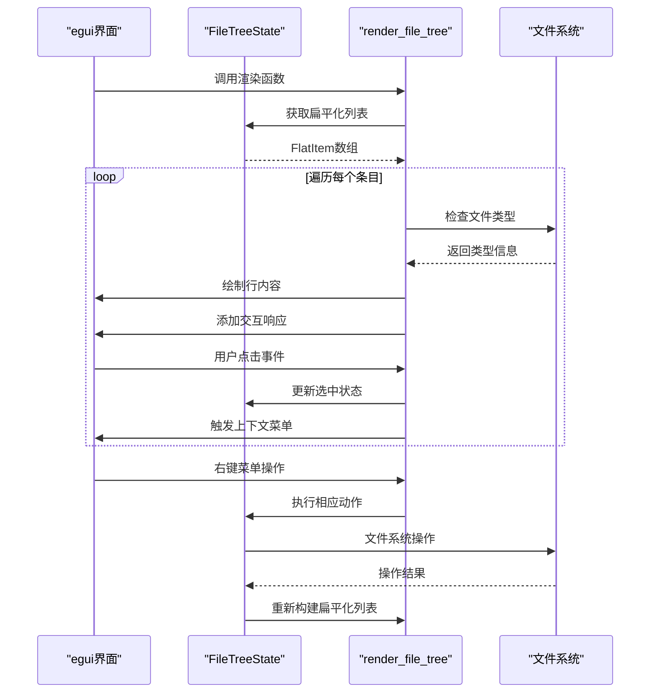

**图表来源**
- [file_tree.rs:241-526](file://src/file_tree.rs#L241-L526)

**章节来源**
- [file_tree.rs:1-527](file://src/file_tree.rs#L1-L527)

## 架构概览

文件树组件在整个应用程序架构中扮演着重要的角色，它与应用程序的其他模块紧密集成：

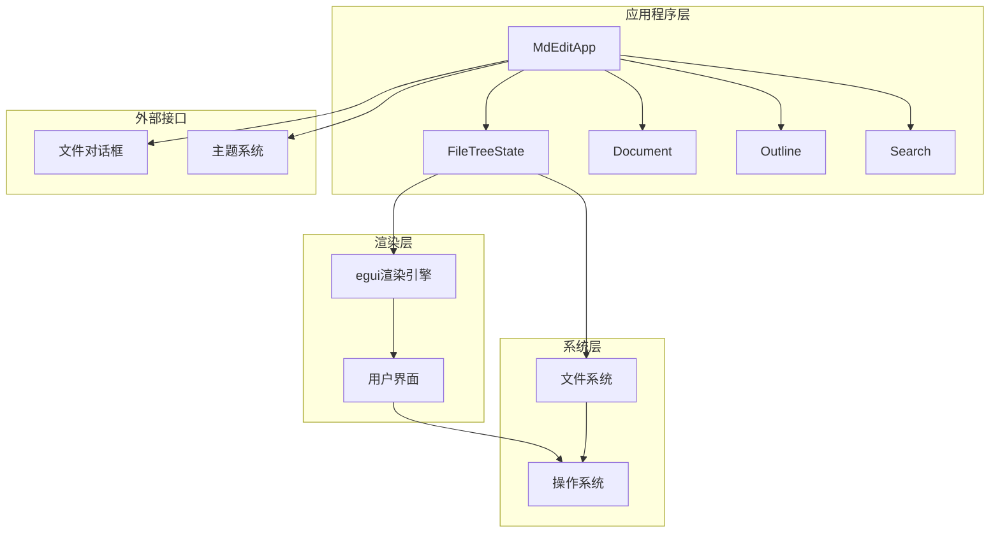

**图表来源**
- [app.rs:545-586](file://src/app.rs#L545-L586)
- [file_tree.rs:241-526](file://src/file_tree.rs#L241-L526)

### 应用程序集成

文件树组件在应用程序中的集成方式如下：

1. **状态管理**: 在 `MdEditApp` 结构体中定义了 `file_tree` 字段
2. **UI渲染**: 在左侧面板中调用 `render_file_tree` 函数
3. **事件处理**: 处理文件树返回的各种操作事件
4. **数据同步**: 与文档系统保持数据一致性

**章节来源**
- [app.rs:570-572](file://src/app.rs#L570-L572)
- [app.rs:1412-1417](file://src/app.rs#L1412-L1417)

## 详细组件分析

### 文件节点系统

文件节点系统是文件树的基础数据结构，负责表示文件系统中的目录和文件：

#### 节点创建流程

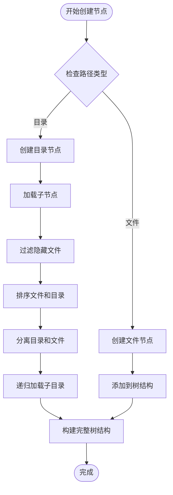

**图表来源**
- [file_tree.rs:13-74](file://src/file_tree.rs#L13-L74)

#### 排序算法

文件树使用自然排序算法来确保文件和目录的正确排列：

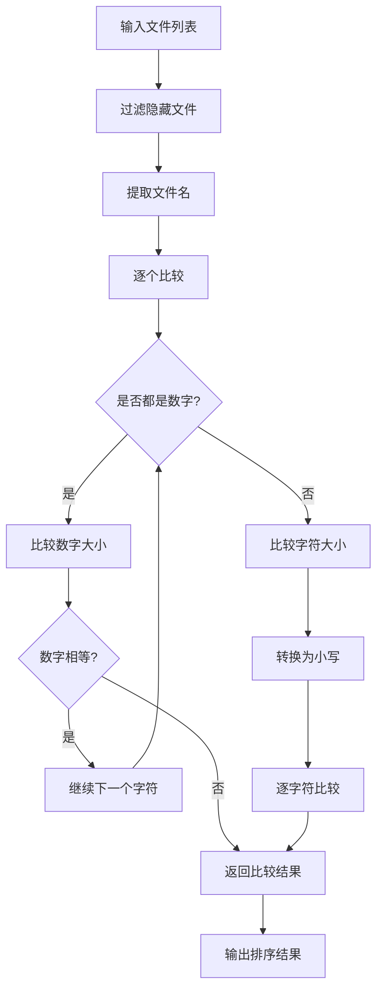

**图表来源**
- [file_tree.rs:76-108](file://src/file_tree.rs#L76-L108)

**章节来源**
- [file_tree.rs:29-74](file://src/file_tree.rs#L29-L74)
- [file_tree.rs:76-108](file://src/file_tree.rs#L76-L108)

### 状态管理系统

文件树状态管理器负责维护文件树的当前状态和提供各种操作方法：

#### 状态操作流程

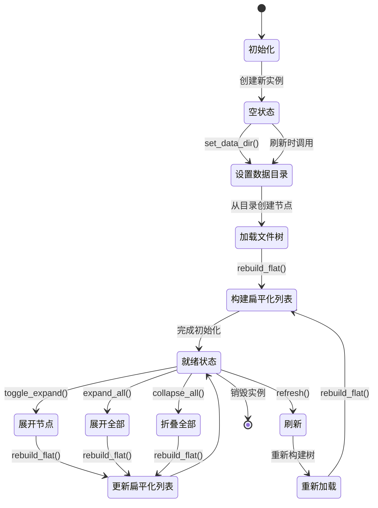

**图表来源**
- [file_tree.rs:129-185](file://src/file_tree.rs#L129-L185)

**章节来源**
- [file_tree.rs:129-185](file://src/file_tree.rs#L129-L185)

### 渲染系统

文件树的渲染系统提供了完整的 UI 交互体验，包括视觉效果和用户交互：

#### 渲染流程

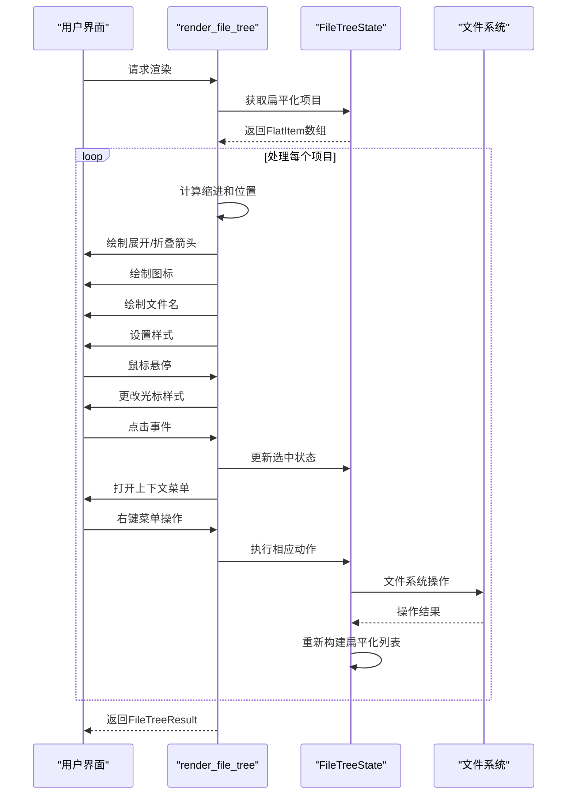

**图表来源**
- [file_tree.rs:241-526](file://src/file_tree.rs#L241-L526)

#### 上下文菜单系统

文件树支持丰富的右键菜单操作，针对文件和目录提供不同的功能：

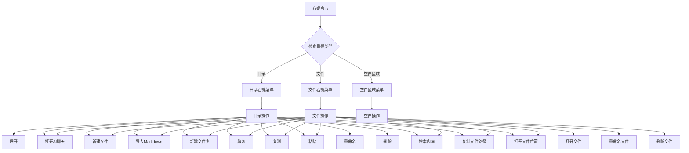

**图表来源**
- [file_tree.rs:344-470](file://src/file_tree.rs#L344-L470)

**章节来源**
- [file_tree.rs:241-526](file://src/file_tree.rs#L241-L526)

### 应用程序集成

文件树组件与应用程序的集成体现在多个方面：

#### 事件处理机制

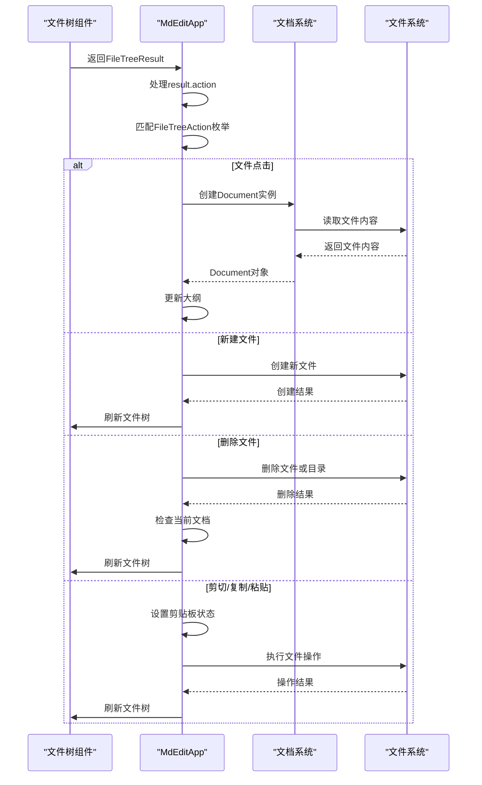

**图表来源**
- [app.rs:1419-1538](file://src/app.rs#L1419-L1538)

**章节来源**
- [app.rs:1419-1538](file://src/app.rs#L1419-L1538)

## 依赖关系分析

文件树组件的依赖关系相对简单，主要依赖于标准库和 egui 框架：

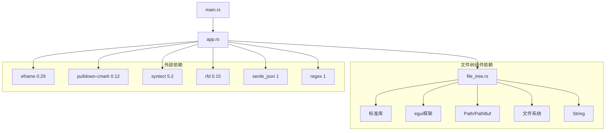

**图表来源**
- [Cargo.toml:8-15](file://Cargo.toml#L8-L15)
- [file_tree.rs:1-2](file://src/file_tree.rs#L1-L2)

### 依赖特性

文件树组件使用了以下关键特性：

1. **Path/PathBuf**: 用于处理文件路径
2. **egui**: 用于 UI 渲染和交互
3. **标准库**: 文件系统操作和字符串处理
4. **条件编译**: Windows 平台特定的文件属性处理

**章节来源**
- [Cargo.toml:8-15](file://Cargo.toml#L8-L15)
- [file_tree.rs:37-43](file://src/file_tree.rs#L37-L43)

## 性能考虑

文件树组件在设计时考虑了多种性能优化策略：

### 内存管理

1. **扁平化缓存**: 使用 `FlatItem` 数组缓存扁平化的节点列表，避免重复计算
2. **增量更新**: 仅在必要时重建扁平化列表，减少内存分配
3. **路径缓存**: 存储 `PathBuf` 实例，避免重复的路径解析

### 文件系统访问

1. **延迟加载**: 目录节点按需加载子节点，减少初始加载时间
2. **过滤机制**: 排除隐藏文件和系统文件，减少不必要的文件系统调用
3. **排序优化**: 使用自然排序算法，确保稳定的排序性能

### UI 渲染优化

1. **响应式布局**: 使用 egui 的自动布局系统，减少手动计算
2. **批量绘制**: 同步绘制多个元素，减少绘制调用次数
3. **条件渲染**: 仅渲染可见的节点，隐藏的节点不进行绘制

## 故障排除指南

### 常见问题及解决方案

#### 文件树不显示

**症状**: 文件树完全不显示或显示为空

**可能原因**:
1. 数据目录未设置
2. 文件权限问题
3. 路径不存在

**解决方法**:
1. 检查 `FileTreeState::data_dir` 是否已设置
2. 验证目录权限和访问权限
3. 确认路径存在且可访问

#### 文件无法加载

**症状**: 点击文件无响应或报错

**可能原因**:
1. 文件被其他程序占用
2. 文件编码问题
3. 文件损坏

**解决方法**:
1. 关闭占用文件的程序
2. 检查文件编码格式
3. 验证文件完整性

#### 性能问题

**症状**: 文件树响应缓慢或卡顿

**可能原因**:
1. 目录包含大量文件
2. 网络驱动器访问缓慢
3. 磁盘 I/O 限制

**解决方法**:
1. 分割大型目录
2. 使用本地磁盘而非网络驱动器
3. 检查磁盘性能和空间

**章节来源**
- [file_tree.rs:142-153](file://src/file_tree.rs#L142-L153)
- [app.rs:1419-1424](file://src/app.rs#L1419-L1424)

## 结论

文件树组件是 mdedit 项目中的重要组成部分，它提供了完整的文件管理系统，具有以下特点：

### 设计优势

1. **模块化设计**: 独立的文件树模块，便于维护和测试
2. **高效渲染**: 基于 egui 的高性能 UI 渲染
3. **丰富功能**: 支持完整的文件系统操作
4. **跨平台兼容**: 基于 Rust 和 egui，支持多平台部署

### 技术特色

1. **自然排序**: 实现了智能的文件和目录排序算法
2. **条件编译**: 针对不同平台的优化处理
3. **状态管理**: 完善的状态管理和事件处理机制
4. **内存优化**: 有效的内存管理和性能优化策略

### 扩展潜力

文件树组件为未来的功能扩展提供了良好的基础，包括：
- AI 聊天集成
- 搜索功能增强
- 更丰富的文件操作
- 自定义主题支持

该组件的设计充分体现了现代 Rust 开发的最佳实践，为 mdedit 项目提供了稳定可靠的文件管理功能。