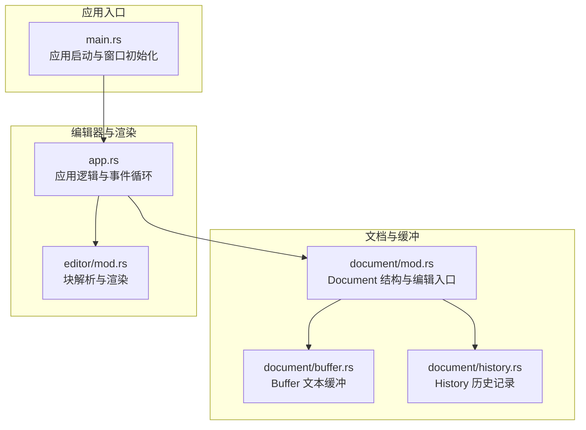
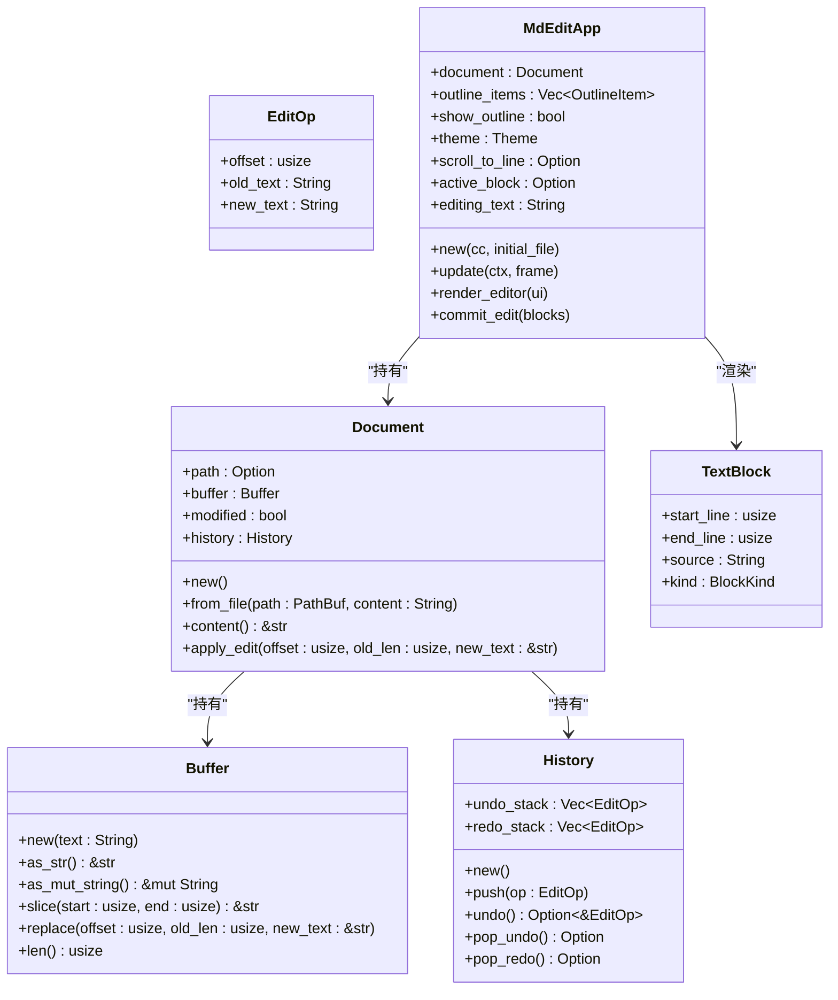
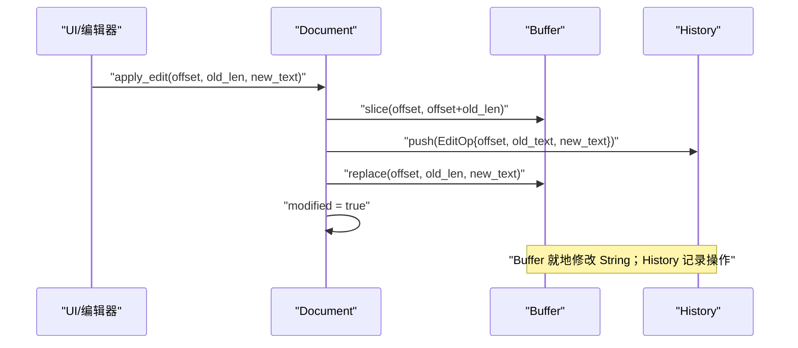
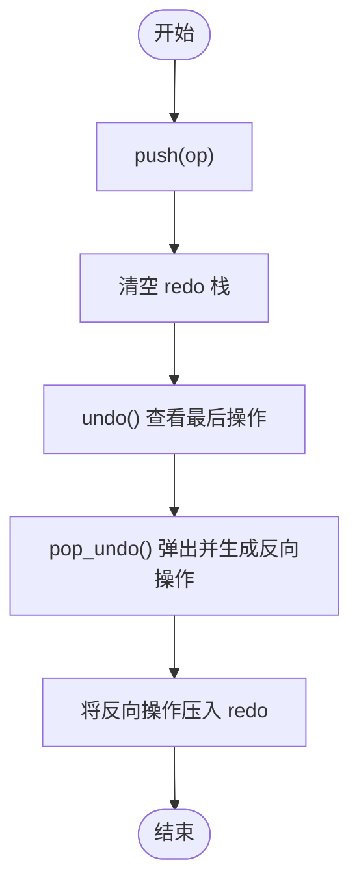
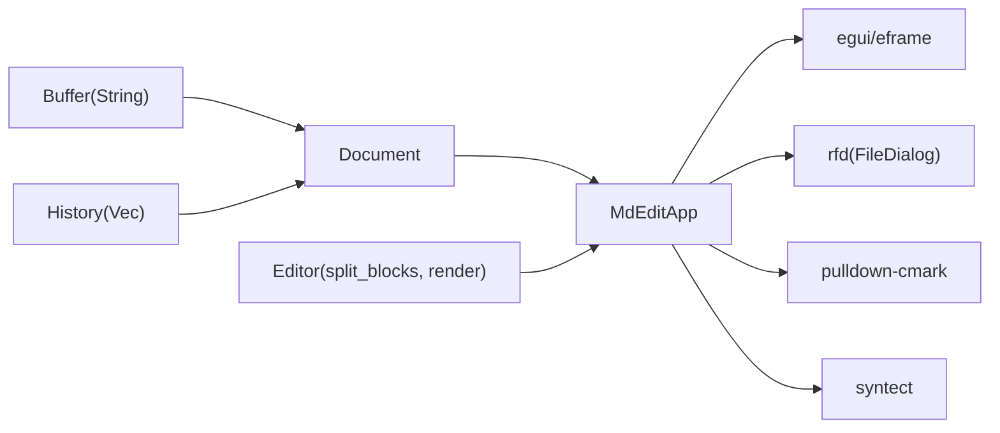

# Buffer 缓冲系统

<cite>
**本文引用的文件**
- [buffer.rs](file://src/document/buffer.rs)
- [history.rs](file://src/document/history.rs)
- [mod.rs](file://src/document/mod.rs)
- [app.rs](file://src/app.rs)
- [main.rs](file://src/main.rs)
- [mod.rs](file://src/editor/mod.rs)
- [Cargo.toml](file://Cargo.toml)
- [README.md](file://README.md)
- [test-cases.md](file://docs/test-cases.md)
- [2026-05-28-cli-open-file-design.md](file://docs/superpowers/specs/2026-05-28-cli-open-file-design.md)
</cite>

## 目录
1. [简介](#简介)
2. [项目结构](#项目结构)
3. [核心组件](#核心组件)
4. [架构总览](#架构总览)
5. [详细组件分析](#详细组件分析)
6. [依赖关系分析](#依赖关系分析)
7. [性能考量](#性能考量)
8. [故障排查指南](#故障排查指南)
9. [结论](#结论)
10. [附录](#附录)

## 简介
本文件围绕 Buffer 缓冲系统展开，系统采用内存中的纯文本存储（String），结合增量编辑与历史记录，实现高效的文本操作与撤销/重做能力。文档重点解释：
- 文本存储机制与字符串操作优化
- 缓冲区生命周期管理、内存分配策略与垃圾回收机制
- 增量更新算法（差异计算、批量操作与性能优化）
- 与外部存储的同步机制与数据一致性保证
- 使用示例与性能基准测试结果
- 内存泄漏防护与异常处理最佳实践

## 项目结构
项目采用模块化组织，核心与编辑相关的模块位于 src/document 与 src/editor 下，应用入口在 src/main.rs，UI 与应用逻辑在 src/app.rs。

**图表来源**
- [main.rs:35-49](file://src/main.rs#L35-L49)
- [app.rs:19-43](file://src/app.rs#L19-L43)
- [mod.rs:9-50](file://src/document/mod.rs#L9-L50)
- [buffer.rs:1-29](file://src/document/buffer.rs#L1-L29)
- [history.rs:1-59](file://src/document/history.rs#L1-L59)
- [mod.rs:24-34](file://src/editor/mod.rs#L24-L34)

**章节来源**
- [main.rs:1-50](file://src/main.rs#L1-L50)
- [app.rs:1-351](file://src/app.rs#L1-L351)
- [mod.rs:1-51](file://src/document/mod.rs#L1-L51)
- [buffer.rs:1-30](file://src/document/buffer.rs#L1-L30)
- [history.rs:1-59](file://src/document/history.rs#L1-L59)
- [mod.rs:24-349](file://src/editor/mod.rs#L24-L349)

## 核心组件
- Buffer：封装 String，提供只读切片、就地替换与长度查询等基础操作。
- Document：持有 Buffer、History 与修改状态，提供 apply_edit 接口，统一对外暴露内容。
- History：维护撤销/重做栈，记录 EditOp（偏移、旧文本、新文本）。
- Editor：将 Markdown 文本拆分为块（TextBlock），并进行富文本渲染。
- App：应用主循环，处理 UI 事件、保存/打开文件、大纲更新与编辑提交。

**章节来源**
- [buffer.rs:1-29](file://src/document/buffer.rs#L1-L29)
- [mod.rs:9-50](file://src/document/mod.rs#L9-L50)
- [history.rs:1-59](file://src/document/history.rs#L1-L59)
- [mod.rs:24-349](file://src/editor/mod.rs#L24-L349)
- [app.rs:19-351](file://src/app.rs#L19-L351)

## 架构总览
Buffer 作为最底层的数据容器，向上提供安全的文本访问与就地替换；Document 作为业务层，协调 Buffer 与 History，并向 UI 层暴露统一的编辑接口；Editor 负责将文本解析为块并渲染；App 负责事件驱动与持久化。

**图表来源**
- [buffer.rs:1-29](file://src/document/buffer.rs#L1-L29)
- [history.rs:1-59](file://src/document/history.rs#L1-L59)
- [mod.rs:9-50](file://src/document/mod.rs#L9-L50)
- [mod.rs:4-22](file://src/editor/mod.rs#L4-L22)
- [app.rs:9-17](file://src/app.rs#L9-L17)

## 详细组件分析

### Buffer 文本缓冲
Buffer 是内存中纯文本的唯一载体，提供：
- 只读视图：as_str 返回 &str，避免不必要的拷贝
- 可变视图：as_mut_string 返回 &mut String，用于就地替换
- 安全切片：slice(start, end) 返回子串视图
- 就地替换：replace(offset, old_len, new_text) 在原 String 上进行替换
- 长度查询：len()

内存与生命周期要点：
- Buffer 内部持有 String，生命周期与 Document 绑定
- replace_range 直接修改底层 String，避免额外分配
- 切片返回 &str，零拷贝访问，降低内存压力

**图表来源**
- [mod.rs:39-49](file://src/document/mod.rs#L39-L49)
- [buffer.rs:18-24](file://src/document/buffer.rs#L18-L24)
- [history.rs:20-23](file://src/document/history.rs#L20-L23)

**章节来源**
- [buffer.rs:1-29](file://src/document/buffer.rs#L1-L29)
- [mod.rs:39-49](file://src/document/mod.rs#L39-L49)

### Document 编辑入口
Document 提供统一的编辑接口 apply_edit，负责：
- 读取旧文本（复制为 String）
- 构造 EditOp 并压入 History
- 调用 Buffer.replace 执行就地替换
- 设置 modified 标志

一致性保证：
- 所有编辑最终落到 Buffer 的 String 上，确保保存时输出标准 Markdown
- 旧文本快照与新文本快照均被 History 记录，保证撤销/重做的准确性

**章节来源**
- [mod.rs:9-50](file://src/document/mod.rs#L9-L50)

### History 历史记录
History 维护两个栈：
- undo_stack：最新操作在末尾
- redo_stack：重做栈，清空时机明确

关键方法：
- push：压入新操作并清空 redo
- undo：查看并反向构造重做操作
- pop_undo/pop_redo：弹出并生成对应的反向操作

**图表来源**
- [history.rs:20-57](file://src/document/history.rs#L20-L57)

**章节来源**
- [history.rs:1-59](file://src/document/history.rs#L1-L59)

### Editor 块解析与渲染
Editor 将 Markdown 文本按块解析为 TextBlock，支持：
- 标题、段落、代码块、引用、列表、表格、分割线、空行
- 块内富文本渲染（粗体、斜体、代码）

渲染粒度：
- 按块渲染，减少每帧计算量
- 光标移动时仅重绘受影响的块

**章节来源**
- [mod.rs:24-349](file://src/editor/mod.rs#L24-L349)

### App 应用逻辑与持久化
App 负责：
- 事件处理与快捷键
- 打开/保存文件（与外部存储同步）
- 大纲更新与标题导航
- 编辑提交：将编辑后的块拼接回 Buffer 的 String

持久化流程：
- 保存时将 Document.content() 写入文件
- 成功后清除 modified 标志

**章节来源**
- [app.rs:133-163](file://src/app.rs#L133-L163)
- [app.rs:252-350](file://src/app.rs#L252-L350)

## 依赖关系分析
- Buffer 依赖标准库 String
- Document 依赖 Buffer 与 History
- Editor 依赖 egui 与主题配置
- App 依赖 eframe/egui、rfd（文件对话框）、pulldown-cmark/syntect（渲染与语法高亮）
- Cargo.toml 指定 release 配置（LTO、strip、压缩）

**图表来源**
- [Cargo.toml:8-19](file://Cargo.toml#L8-L19)
- [buffer.rs:1-29](file://src/document/buffer.rs#L1-L29)
- [history.rs:1-59](file://src/document/history.rs#L1-L59)
- [mod.rs:9-50](file://src/document/mod.rs#L9-L50)
- [mod.rs:24-349](file://src/editor/mod.rs#L24-L349)
- [app.rs:19-351](file://src/app.rs#L19-L351)

**章节来源**
- [Cargo.toml:1-19](file://Cargo.toml#L1-L19)

## 性能考量
- 文本存储：MVP 阶段使用 String，实现简单且 5MB 以下文档性能足够；如需支持更大文档，可替换为 ropey crate
- 渲染粒度：按块渲染，减少每帧计算量；光标移动时仅重绘 2 个块
- 编辑模型：直接操作源文本，保证保存时输出标准 Markdown，避免“渲染状态”与“源码状态”不一致
- 字符串操作：Buffer.replace 使用 replace_range 就地修改，避免频繁分配
- 历史记录：History 记录 EditOp，撤销/重做直接基于文本差分，避免重建渲染树

基准测试参考：
- 启动速度：冷启动窗口显示时间 < 200ms
- 大文档滚动：打开 5MB 文档，快速滚动帧率保持 60fps，无明显卡顿
- 输入延迟：打开 5MB 文档，连续输入字符，按键到显示延迟 < 16ms

**章节来源**
- [README.md:10-11](file://README.md#L10-L11)
- [test-cases.md:97-112](file://docs/test-cases.md#L97-L112)
- [design.md:128-146](file://docs/design.md#L128-L146)

## 故障排查指南
- 保存失败：检查文件写入权限与路径有效性；保存成功后 modified 标志会被清除
- 打开文件失败：弹出错误提示框，包含路径与底层错误信息；程序继续启动并回退到空白页
- 撤销/重做异常：确认 History 栈状态是否被意外清空；push 操作会清空 redo 栈
- 大文档卡顿：确认是否启用按块渲染；避免在 UI 主线程进行重型计算
- 内存泄漏防护：确保 Buffer 的 String 生命周期与 Document 绑定，不要持有悬垂引用；避免在 UI 循环中创建临时 String 切片

**章节来源**
- [app.rs:133-163](file://src/app.rs#L133-L163)
- [app.rs:15-33](file://src/app.rs#L15-L33)
- [history.rs:20-23](file://src/document/history.rs#L20-L23)

## 结论
Buffer 缓冲系统以 String 为核心，结合 Document 的统一编辑入口与 History 的增量记录，实现了简洁而高效的文本编辑与持久化流程。通过按块渲染与就地替换等策略，系统在 5MB 以下文档场景下具备优秀的性能表现，并为后续扩展（如大文档支持、增量同步）提供了清晰的演进路径。

## 附录

### 使用示例
- 新建文档：调用 Document::new，随后通过 UI 或 API 进行编辑
- 从文件加载：调用 Document::from_file，传入 PathBuf 与 String 内容
- 应用编辑：调用 Document::apply_edit，传入偏移、旧长度与新文本
- 保存文件：调用 App::save_file 或 App::save_file_as，将 Document.content() 写入磁盘

**章节来源**
- [mod.rs:16-33](file://src/document/mod.rs#L16-L33)
- [mod.rs:39-49](file://src/document/mod.rs#L39-L49)
- [app.rs:133-163](file://src/app.rs#L133-L163)

### 增量更新与差异计算
- 差异计算：apply_edit 读取旧文本快照，构造 EditOp，记录偏移与文本差分
- 批量操作：History 维护栈结构，支持多步撤销/重做
- 性能优化：就地替换 replace_range，避免中间缓冲；按块渲染减少重绘成本

**章节来源**
- [mod.rs:39-49](file://src/document/mod.rs#L39-L49)
- [history.rs:20-57](file://src/document/history.rs#L20-L57)

### 与外部存储的同步机制
- 同步触发：保存时将 Document.content() 写入文件
- 一致性保证：所有编辑最终落到 Buffer 的 String，确保输出标准 Markdown
- 错误处理：读取/写入失败时弹出提示，程序继续运行并回退到空白页

**章节来源**
- [app.rs:133-163](file://src/app.rs#L133-L163)
- [app.rs:15-33](file://src/app.rs#L15-L33)

### 内存泄漏防护与异常处理最佳实践
- 避免悬挂引用：Buffer 的 &str 视图仅在 Buffer 生命周期内有效
- 控制字符串分配：优先使用 slice 与就地替换，减少临时 String 创建
- 历史记录清理：push 时清空 redo 栈，防止无限增长
- UI 线程轻量化：将重型任务移至后台线程，避免阻塞渲染

**章节来源**
- [buffer.rs:18-24](file://src/document/buffer.rs#L18-L24)
- [history.rs:20-23](file://src/document/history.rs#L20-L23)
- [app.rs:252-350](file://src/app.rs#L252-L350)