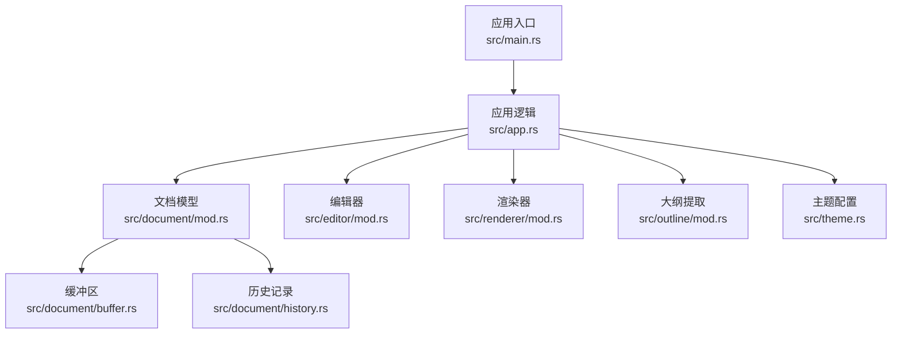
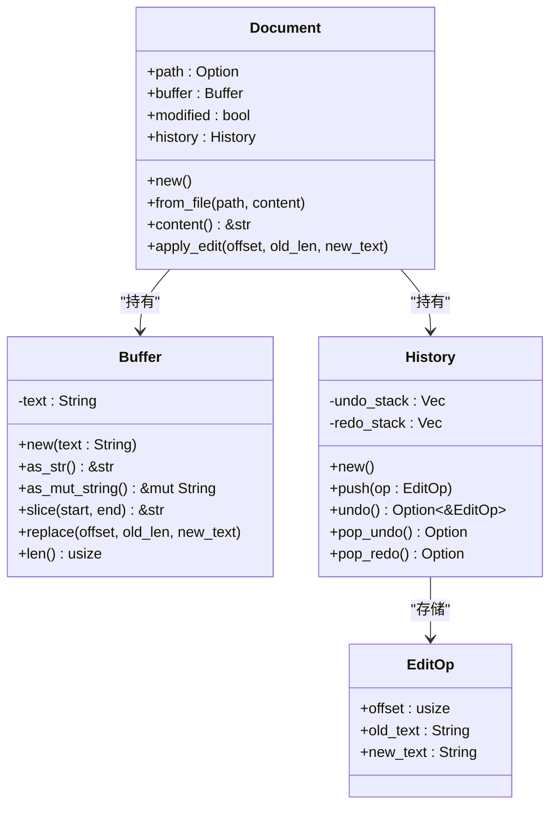
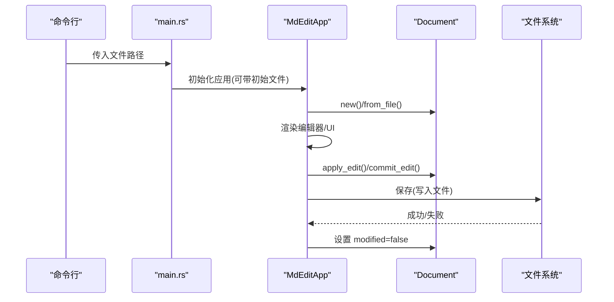
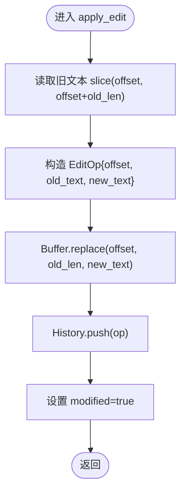
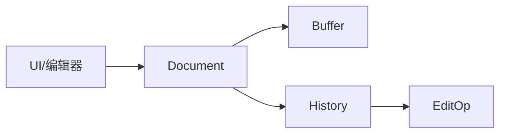
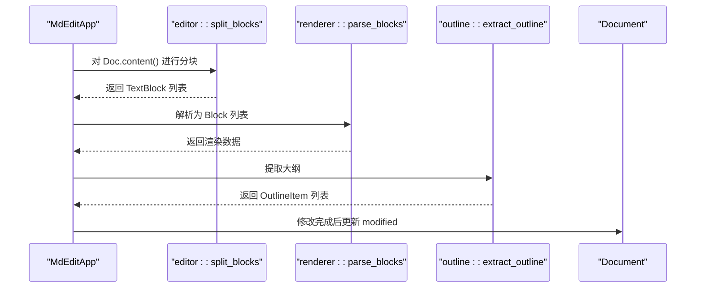
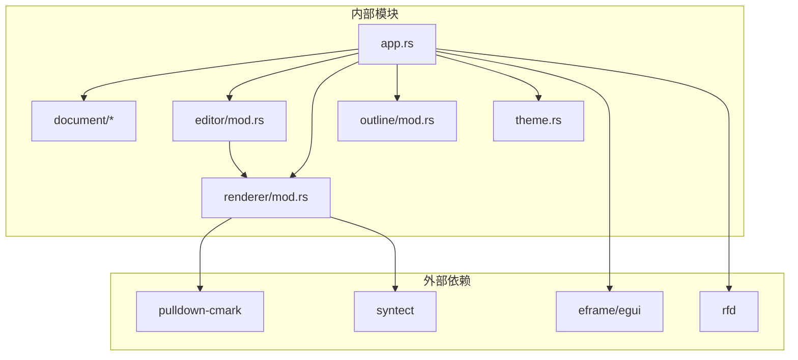

# Document 文档模型

<cite>
**本文引用的文件**
- [src/document/mod.rs](file://src/document/mod.rs)
- [src/document/buffer.rs](file://src/document/buffer.rs)
- [src/document/history.rs](file://src/document/history.rs)
- [src/app.rs](file://src/app.rs)
- [src/main.rs](file://src/main.rs)
- [src/editor/mod.rs](file://src/editor/mod.rs)
- [src/outline/mod.rs](file://src/outline/mod.rs)
- [src/renderer/mod.rs](file://src/renderer/mod.rs)
- [src/theme.rs](file://src/theme.rs)
- [Cargo.toml](file://Cargo.toml)
</cite>

## 目录
1. [简介](#简介)
2. [项目结构](#项目结构)
3. [核心组件](#核心组件)
4. [架构总览](#架构总览)
5. [详细组件分析](#详细组件分析)
6. [依赖分析](#依赖分析)
7. [性能考虑](#性能考虑)
8. [故障排查指南](#故障排查指南)
9. [结论](#结论)
10. [附录](#附录)

## 简介
本文件围绕 Document 文档模型进行系统化技术说明，重点阐释：
- Document 结构体的设计理念与数据组织方式（路径管理、缓冲区集成、修改状态跟踪）
- 文档生命周期（创建、加载、保存）的完整流程
- apply_edit 方法的实现机制（编辑操作的原子性保证、状态变更通知）
- 文档与 Buffer、History 等子系统的协作关系与数据流向
- 完整的 API 使用示例与最佳实践
- 错误处理策略与性能优化建议

## 项目结构
该仓库采用按功能域分层的模块化组织方式：
- 核心文档模型位于 src/document，包含 Buffer 和 History 子模块
- 应用入口与 UI 集成位于 src/app.rs，通过 eframe/egui 提供图形界面
- 编辑器与渲染器位于 src/editor 与 src/renderer，负责内容解析与可视化
- 轻量级大纲提取位于 src/outline
- 主程序入口在 src/main.rs，支持命令行传入初始文件

图表来源
- [src/main.rs:1-50](file://src/main.rs#L1-L50)
- [src/app.rs:1-351](file://src/app.rs#L1-L351)
- [src/document/mod.rs:1-51](file://src/document/mod.rs#L1-L51)
- [src/document/buffer.rs:1-30](file://src/document/buffer.rs#L1-L30)
- [src/document/history.rs:1-59](file://src/document/history.rs#L1-L59)
- [src/editor/mod.rs:1-349](file://src/editor/mod.rs#L1-L349)
- [src/renderer/mod.rs:1-143](file://src/renderer/mod.rs#L1-L143)
- [src/outline/mod.rs:1-27](file://src/outline/mod.rs#L1-L27)
- [src/theme.rs:1-22](file://src/theme.rs#L1-L22)

章节来源
- [src/main.rs:1-50](file://src/main.rs#L1-L50)
- [src/app.rs:1-351](file://src/app.rs#L1-L351)
- [Cargo.toml:1-19](file://Cargo.toml#L1-L19)

## 核心组件
本节聚焦 Document 的设计与职责，以及其与 Buffer、History 的协作关系。

- Document 字段与职责
  - path: 可选的文件路径，用于保存时的默认目标
  - buffer: 内容缓冲区，承载当前文档文本
  - modified: 修改状态标记，用于 UI 与保存逻辑
  - history: 历史记录栈，支持撤销/重做

- 生命周期方法
  - new(): 创建空文档
  - from_file(path, content): 从文件创建文档
  - content(): 返回当前内容字符串切片
  - apply_edit(offset, old_len, new_text): 执行一次编辑操作，并更新历史与修改状态

- Buffer 能力
  - 新建、只读访问、可变字符串引用、切片与替换
  - replace_range 原生高效替换，避免不必要的分配

- History 能力
  - push: 记录一次编辑操作
  - undo/pop_undo: 撤销最近一次编辑
  - pop_redo: 重做被撤销的操作
  - 清空重做栈以保持一致性

章节来源
- [src/document/mod.rs:9-50](file://src/document/mod.rs#L9-L50)
- [src/document/buffer.rs:1-30](file://src/document/buffer.rs#L1-L30)
- [src/document/history.rs:1-59](file://src/document/history.rs#L1-L59)

## 架构总览
Document 作为核心数据容器，向上为 UI 层提供内容与状态，向下封装 Buffer 与 History，形成“内容-历史”双轨数据流。UI 层通过事件驱动触发编辑与保存，应用层协调各子系统完成工作流闭环。

图表来源
- [src/document/mod.rs:9-50](file://src/document/mod.rs#L9-L50)
- [src/document/buffer.rs:1-30](file://src/document/buffer.rs#L1-L30)
- [src/document/history.rs:1-59](file://src/document/history.rs#L1-L59)

## 详细组件分析

### Document 结构体与生命周期
- 设计理念
  - 将“内容”“历史”“状态”聚合在一个对象中，便于 UI 与业务逻辑统一管理
  - 通过 path 字段区分“新建文档”和“已保存文档”，简化保存流程
  - 通过 modified 标记驱动 UI 更新与提示

- 生命周期流程
  - 创建：new() 或 from_file(path, content)
  - 加载：主程序从命令行参数读取文件，交由应用初始化
  - 编辑：UI 触发编辑，调用 Document.apply_edit 或应用层 commit_edit
  - 保存：根据是否已有 path 决定保存或另存为；成功后清除修改标记

图表来源
- [src/main.rs:15-33](file://src/main.rs#L15-L33)
- [src/app.rs:20-43](file://src/app.rs#L20-L43)
- [src/app.rs:133-163](file://src/app.rs#L133-L163)
- [src/document/mod.rs:16-33](file://src/document/mod.rs#L16-L33)
- [src/document/mod.rs:39-49](file://src/document/mod.rs#L39-L49)

章节来源
- [src/document/mod.rs:16-33](file://src/document/mod.rs#L16-L33)
- [src/app.rs:20-43](file://src/app.rs#L20-L43)
- [src/app.rs:133-163](file://src/app.rs#L133-L163)
- [src/main.rs:15-33](file://src/main.rs#L15-L33)

### apply_edit 实现机制与原子性
- 原子性保证
  - 在单次 apply_edit 中，先读取旧文本，再执行替换，最后压入历史并置位修改标记
  - 任一步骤失败不会导致中间态残留，因为替换与历史压入在同一作用域内完成

- 状态变更通知
  - 修改标记 modified=true，用于 UI 标题栏显示“*”
  - 应用层在保存成功后将其复位，避免重复提示

图表来源
- [src/document/mod.rs:39-49](file://src/document/mod.rs#L39-L49)
- [src/document/buffer.rs:22-24](file://src/document/buffer.rs#L22-L24)
- [src/document/history.rs:20-23](file://src/document/history.rs#L20-L23)

章节来源
- [src/document/mod.rs:39-49](file://src/document/mod.rs#L39-L49)

### 文档与 Buffer、History 的协作关系
- Buffer
  - 作为底层文本存储，提供高效的原地替换与切片能力
  - Document 通过 as_str 与 as_mut_string 与 UI/编辑器共享内存视图

- History
  - 记录每次编辑的三元组：偏移、旧文本、新文本
  - 支持撤销/重做，且撤销会清空重做栈，确保一致性

- 协作数据流
  - UI 层触发编辑 -> Document.apply_edit -> Buffer 替换 -> History 记录 -> 修改标记 -> UI 刷新

图表来源
- [src/document/mod.rs:9-50](file://src/document/mod.rs#L9-L50)
- [src/document/buffer.rs:1-30](file://src/document/buffer.rs#L1-L30)
- [src/document/history.rs:1-59](file://src/document/history.rs#L1-L59)

章节来源
- [src/document/mod.rs:9-50](file://src/document/mod.rs#L9-L50)
- [src/document/buffer.rs:1-30](file://src/document/buffer.rs#L1-L30)
- [src/document/history.rs:1-59](file://src/document/history.rs#L1-L59)

### 文档与编辑器、渲染器、大纲的集成
- 编辑器
  - 将文档内容拆分为 TextBlock，支持块级编辑与富文本渲染
  - 应用层在交互时通过 commit_edit 将编辑后的文本回写到 Buffer

- 渲染器
  - 使用 pulldown-cmark 解析 Markdown 为 Block 结构，支持标题、列表、表格、代码块等
  - 与主题模块配合，输出一致的视觉风格

- 大纲
  - 从文档内容提取标题层级与行号，用于侧边导航

图表来源
- [src/app.rs:252-328](file://src/app.rs#L252-L328)
- [src/editor/mod.rs:24-149](file://src/editor/mod.rs#L24-L149)
- [src/renderer/mod.rs:19-142](file://src/renderer/mod.rs#L19-L142)
- [src/outline/mod.rs:7-26](file://src/outline/mod.rs#L7-L26)

章节来源
- [src/app.rs:252-328](file://src/app.rs#L252-L328)
- [src/editor/mod.rs:24-149](file://src/editor/mod.rs#L24-L149)
- [src/renderer/mod.rs:19-142](file://src/renderer/mod.rs#L19-L142)
- [src/outline/mod.rs:7-26](file://src/outline/mod.rs#L7-L26)

## 依赖分析
- 外部依赖
  - eframe/egui：GUI 框架与渲染
  - pulldown-cmark：Markdown 解析
  - rfd：跨平台文件对话框
  - syntect：语法高亮（在渲染器中使用）

- 内部模块耦合
  - app 依赖 document、editor、outline、renderer、theme
  - document 仅依赖自身内部的 buffer 与 history
  - editor 与 renderer 之间通过内容字符串解耦

图表来源
- [Cargo.toml:8-13](file://Cargo.toml#L8-L13)
- [src/app.rs:1-351](file://src/app.rs#L1-L351)
- [src/renderer/mod.rs:7](file://src/renderer/mod.rs#L7)

章节来源
- [Cargo.toml:8-13](file://Cargo.toml#L8-L13)
- [src/app.rs:1-351](file://src/app.rs#L1-L351)

## 性能考虑
- 文本替换
  - Buffer 使用原生 replace_range，避免中间字符串拼接与拷贝
  - 建议在批量编辑时合并相邻操作，减少历史栈压力

- 历史记录
  - undo/redo 栈大小与内存占用正相关，建议在长文档场景下限制历史深度或定期清理

- UI 渲染
  - 分块渲染（editor::split_blocks）与增量更新（outline、renderer）有助于提升滚动与交互响应
  - 大文件时可考虑延迟解析与懒加载

- 文件 IO
  - 保存前检查 modified 标志，避免无意义写盘
  - 另存为时一次性写入，减少系统调用次数

## 故障排查指南
- 无法打开文件
  - 现象：命令行启动时提示无法打开文件
  - 处理：检查路径是否存在、权限是否足够；应用会在 UI 中弹窗提示错误详情

- 保存失败
  - 现象：保存后修改标记仍为 true
  - 处理：确认文件写入权限；另存为时确保选择了有效路径

- 撤销/重做异常
  - 现象：撤销后重做栈未清空或反向操作不正确
  - 处理：确保每次撤销/重做均通过 History 的标准接口调用；避免直接修改内部栈

- UI 不刷新
  - 现象：编辑后标题栏未显示“*”
  - 处理：确认编辑流程中设置了 modified=true；保存成功后应复位该标志

章节来源
- [src/main.rs:24-31](file://src/main.rs#L24-L31)
- [src/app.rs:133-163](file://src/app.rs#L133-L163)
- [src/document/history.rs:25-57](file://src/document/history.rs#L25-L57)

## 结论
Document 文档模型以简洁的结构实现了“内容-历史-状态”的一体化管理，结合 Buffer 的高效替换与 History 的完备回溯能力，为上层 UI 提供了可靠的编辑与持久化基础。通过合理的生命周期与错误处理策略，系统在易用性与性能之间取得了良好平衡。建议在实际使用中遵循本文的最佳实践，以获得稳定、流畅的编辑体验。

## 附录

### API 使用示例与最佳实践
- 创建新文档
  - 使用 new() 创建空文档，随后可通过 UI 或直接调用 apply_edit 填充内容
  - 参考路径：[src/document/mod.rs:17-24](file://src/document/mod.rs#L17-L24)

- 从文件加载
  - 使用 from_file(path, content) 创建文档；应用层会自动提取大纲
  - 参考路径：[src/document/mod.rs:26-33](file://src/document/mod.rs#L26-L33)，[src/app.rs:26-32](file://src/app.rs#L26-L32)

- 执行编辑
  - 使用 apply_edit(offset, old_len, new_text) 进行原子性编辑；编辑后修改标记自动置位
  - 参考路径：[src/document/mod.rs:39-49](file://src/document/mod.rs#L39-L49)

- 撤销/重做
  - 通过 History 接口进行撤销与重做；撤销会清空重做栈
  - 参考路径：[src/document/history.rs:25-57](file://src/document/history.rs#L25-L57)

- 保存文档
  - 若已有 path 则直接保存；否则弹出另存为对话框；成功后清除修改标记
  - 参考路径：[src/app.rs:133-163](file://src/app.rs#L133-L163)

- 最佳实践
  - 合并相邻编辑，减少历史栈增长
  - 在 UI 中仅在必要时更新大纲与渲染缓存
  - 对大文件采用分块渲染与增量更新策略