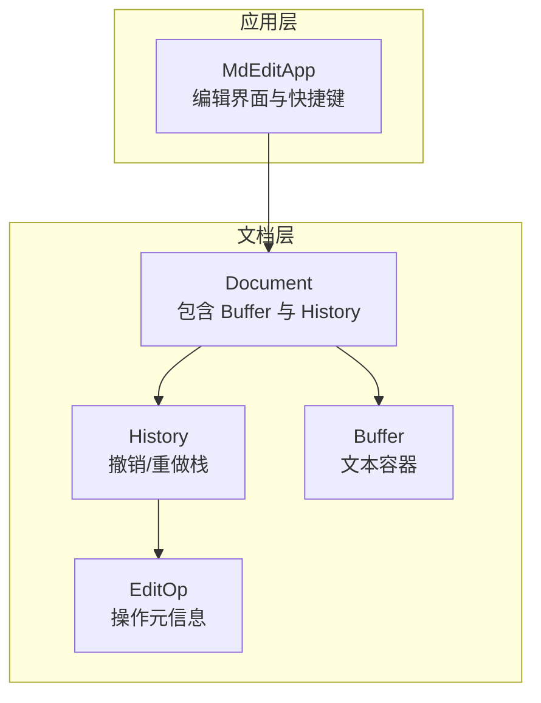
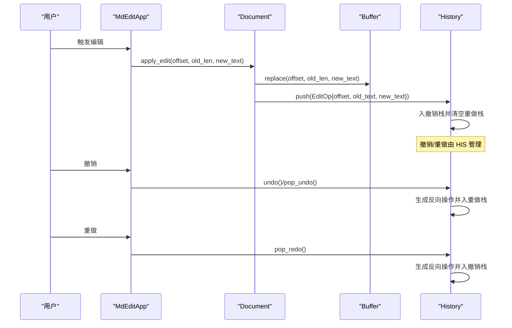
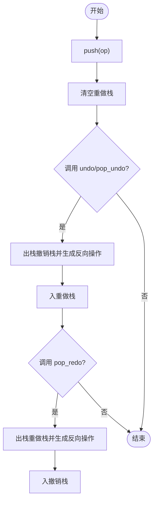
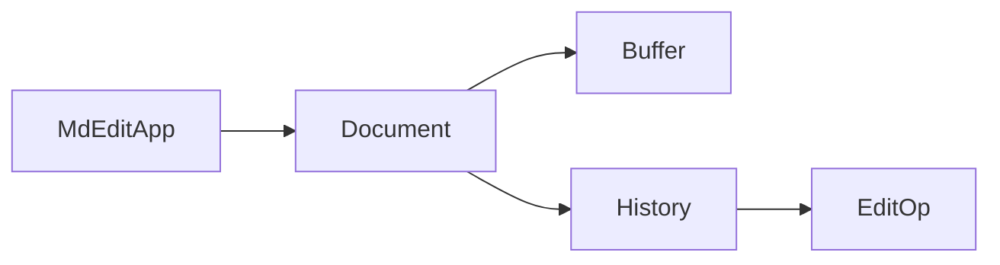

# History 历史系统

<cite>
**本文档引用的文件**
- [history.rs](file://src/document/history.rs)
- [mod.rs](file://src/document/mod.rs)
- [buffer.rs](file://src/document/buffer.rs)
- [app.rs](file://src/app.rs)
- [Cargo.toml](file://Cargo.toml)
- [README.md](file://README.md)
</cite>

## 目录
1. [简介](#简介)
2. [项目结构](#项目结构)
3. [核心组件](#核心组件)
4. [架构总览](#架构总览)
5. [详细组件分析](#详细组件分析)
6. [依赖关系分析](#依赖关系分析)
7. [性能考量](#性能考量)
8. [故障排除指南](#故障排除指南)
9. [结论](#结论)
10. [附录](#附录)

## 简介
本文件面向 History 历史系统的技术文档，聚焦于撤销/重做机制的设计与实现。当前仓库中的 History 模块采用双栈结构（撤销栈与重做栈）记录编辑操作，通过“操作对象”封装偏移位置、旧文本与新文本，实现基本的撤销与重做能力。本文将从数据结构、处理流程、并发场景、性能优化、API 使用与错误处理等方面进行系统化说明，并给出在大文档场景下的优化建议与响应性保障策略。

## 项目结构
History 系统位于文档模块中，与缓冲区 Buffer 和上层应用 MdEditApp 协作：
- 文档模块导出 History 与 EditOp 类型，供应用层使用
- 应用层在编辑提交时调用文档的 apply_edit，进而触发历史记录
- Buffer 提供文本替换与切片能力，History 仅记录操作元信息，不存储完整状态快照

图表来源
- [mod.rs:9-50](file://src/document/mod.rs#L9-L50)
- [history.rs:7-10](file://src/document/history.rs#L7-L10)
- [buffer.rs:1-3](file://src/document/buffer.rs#L1-L3)
- [app.rs:187-248](file://src/app.rs#L187-L248)

章节来源
- [mod.rs:1-51](file://src/document/mod.rs#L1-L51)
- [history.rs:1-59](file://src/document/history.rs#L1-L59)
- [buffer.rs:1-30](file://src/document/buffer.rs#L1-L30)
- [app.rs:187-248](file://src/app.rs#L187-L248)

## 核心组件
- EditOp：记录一次编辑操作的最小单元，包含偏移位置、旧文本、新文本
- History：维护两个栈，分别用于撤销与重做；提供 push、undo、pop_undo、pop_redo 等方法
- Document：持有 Buffer 与 History，提供 apply_edit 将用户编辑转换为历史操作
- Buffer：提供文本替换与切片能力，History 不存储完整状态快照

章节来源
- [history.rs:1-10](file://src/document/history.rs#L1-L10)
- [history.rs:12-58](file://src/document/history.rs#L12-L58)
- [mod.rs:9-50](file://src/document/mod.rs#L9-L50)
- [buffer.rs:1-30](file://src/document/buffer.rs#L1-L30)

## 架构总览
History 的工作流围绕“操作记录 + 双栈管理”的模式展开：
- 用户编辑触发 Document.apply_edit，生成 EditOp 并写入 Buffer
- History.push 将 EditOp 入撤销栈，并清空重做栈
- 撤销时，History.undo/pop_undo 出栈并生成反向操作入重做栈
- 重做时，History.pop_redo 出栈并生成反向操作入撤销栈

图表来源
- [mod.rs:39-49](file://src/document/mod.rs#L39-L49)
- [history.rs:20-23](file://src/document/history.rs#L20-L23)
- [history.rs:25-35](file://src/document/history.rs#L25-L35)
- [history.rs:37-46](file://src/document/history.rs#L37-L46)
- [history.rs:48-57](file://src/document/history.rs#L48-L57)

## 详细组件分析

### 数据结构设计
- EditOp 字段
  - offset：编辑发生的字节偏移位置
  - old_text：被替换前的文本内容
  - new_text：替换后的文本内容
- History 字段
  - undo_stack：撤销栈，按时间顺序存放最近的编辑操作
  - redo_stack：重做栈，存放可重做的反向操作

复杂度与空间占用
- 每次 push 产生一个 EditOp 对象，大小取决于 old_text 与 new_text 的长度
- undo_stack 与 redo_stack 的元素数量随编辑次数线性增长
- 当前实现未对历史条目数量或内存大小进行限制，存在潜在的内存压力风险

章节来源
- [history.rs:1-10](file://src/document/history.rs#L1-L10)
- [history.rs:12-18](file://src/document/history.rs#L12-L18)

### 处理流程与算法
- push 操作
  - 将新的 EditOp 入撤销栈
  - 清空重做栈，确保“当前状态之后”的重做历史被丢弃
- undo 操作
  - 读取撤销栈顶操作，生成反向操作（交换 old_text 与 new_text）
  - 将反向操作入重做栈，返回原操作以便上层执行
- pop_undo 操作
  - 出栈撤销栈顶操作，生成反向操作入重做栈，返回该操作
- pop_redo 操作
  - 出栈重做栈顶操作，生成反向操作入撤销栈，返回该操作

图表来源
- [history.rs:20-23](file://src/document/history.rs#L20-L23)
- [history.rs:25-35](file://src/document/history.rs#L25-L35)
- [history.rs:37-46](file://src/document/history.rs#L37-L46)
- [history.rs:48-57](file://src/document/history.rs#L48-L57)

章节来源
- [history.rs:20-58](file://src/document/history.rs#L20-L58)

### 与 Buffer 的协作
- Document.apply_edit 在修改 Buffer 后，将 EditOp 推入 History
- Buffer.replace 负责实际的文本替换，History 仅记录操作元信息
- 该设计避免了存储完整状态快照，降低内存占用，但要求 Buffer 的状态与历史记录保持一致

章节来源
- [mod.rs:39-49](file://src/document/mod.rs#L39-L49)
- [buffer.rs:22-24](file://src/document/buffer.rs#L22-L24)

### API 使用示例与最佳实践
- 创建文档与历史
  - 通过 Document::new 或 Document::from_file 初始化，内部包含 History 实例
- 应用编辑并记录历史
  - 调用 Document::apply_edit(offset, old_len, new_text)，自动记录 EditOp
- 撤销与重做
  - 撤销：History::undo 或 History::pop_undo
  - 重做：History::pop_redo
- 注意事项
  - 撤销会清空重做栈，避免“历史分支”
  - 上层应确保 Buffer 与 History 的一致性

章节来源
- [mod.rs:16-33](file://src/document/mod.rs#L16-L33)
- [mod.rs:39-49](file://src/document/mod.rs#L39-L49)
- [history.rs:20-58](file://src/document/history.rs#L20-L58)

### 错误处理与边界情况
- 空栈访问
  - undo/pop_undo/pop_redo 在空栈时返回 None，上层需进行空值检查
- 重做栈清空
  - push 操作会清空重做栈，防止历史分支导致的状态不一致
- Buffer 与 History 一致性
  - 若 Buffer 曾被直接修改而未通过 History.push 记录，可能导致撤销/重做与 Buffer 不一致

章节来源
- [history.rs:25-35](file://src/document/history.rs#L25-L35)
- [history.rs:37-46](file://src/document/history.rs#L37-L46)
- [history.rs:48-57](file://src/document/history.rs#L48-L57)

## 依赖关系分析
- Document 依赖 Buffer 与 History
- History 仅依赖标准库 Vec，无外部依赖
- 应用层 MdEditApp 通过 Document 间接使用 History

图表来源
- [mod.rs:4-5](file://src/document/mod.rs#L4-L5)
- [history.rs:1-10](file://src/document/history.rs#L1-L10)
- [buffer.rs:1-3](file://src/document/buffer.rs#L1-L3)
- [app.rs:187-248](file://src/app.rs#L187-L248)

章节来源
- [mod.rs:4-5](file://src/document/mod.rs#L4-L5)
- [history.rs:1-10](file://src/document/history.rs#L1-L10)
- [buffer.rs:1-3](file://src/document/buffer.rs#L1-L3)
- [app.rs:187-248](file://src/app.rs#L187-L248)

## 性能考量
现状与问题
- 历史记录以 EditOp 形式存储，包含旧/新文本，适合小到中等文档
- 未实现内存上限控制、历史压缩或增量快照，大文档场景下可能造成内存压力
- 撤销/重做操作的时间复杂度为 O(1)（栈操作），但每次操作需要复制字符串，整体成本与文本长度相关

优化建议（针对大文档场景）
- 内存限制与垃圾回收
  - 设定最大历史条目数或最大内存阈值，超过阈值时清理最老的历史条目
  - 定期压缩历史：将相邻的插入/删除操作合并为更粗粒度的操作，减少条目数量
- 快照策略
  - 对超长文档定期生成状态快照（如每 N 次编辑一次），撤销时优先回退到最近快照，再逐步应用后续操作
- 响应性保障
  - 在主线程中避免长时间阻塞：将历史压缩与快照生成放入后台任务队列
  - 对频繁撤销/重做进行节流：在短时间内多次撤销时，合并为一次大步长回退
- 字符串优化
  - 使用更紧凑的文本表示（如 Rope）以降低替换与复制成本
  - 对重复文本采用共享引用或去重策略

[本节为通用性能指导，不直接分析具体文件，故无章节来源]

## 故障排除指南
- 撤销/重做无效
  - 检查是否正确调用 Document::apply_edit，确保 History.push 被触发
  - 确认上层在撤销/重做时正确应用反向操作
- 状态不一致
  - 若 Buffer 被直接修改，请补充相应的 EditOp 记录，或在修改后调用 History.push
- 性能问题
  - 大文档下出现卡顿：考虑引入内存限制、历史压缩与快照策略
  - 频繁撤销/重做导致内存增长：启用历史条目上限与定期清理

章节来源
- [mod.rs:39-49](file://src/document/mod.rs#L39-L49)
- [history.rs:20-58](file://src/document/history.rs#L20-L58)

## 结论
当前 History 系统以简洁的双栈模型实现了基础的撤销/重做功能，通过 EditOp 记录编辑元信息，避免了完整状态快照带来的内存开销。然而，在大文档场景下，缺乏内存限制、历史压缩与快照策略可能导致内存压力与性能瓶颈。建议在现有基础上增加内存上限控制、历史压缩与状态快照机制，并结合后台任务与节流策略，以提升用户体验与系统稳定性。

[本节为总结性内容，不直接分析具体文件，故无章节来源]

## 附录

### API 参考（基于现有实现）
- History::new：创建空的历史实例
- History::push(op)：将一次编辑操作入撤销栈，并清空重做栈
- History::undo()：查看栈顶撤销操作（不弹出），同时生成反向操作入重做栈
- History::pop_undo()：弹出撤销栈顶操作，生成反向操作入重做栈
- History::pop_redo()：弹出重做栈顶操作，生成反向操作入撤销栈
- Document::apply_edit(offset, old_len, new_text)：应用编辑并记录历史

章节来源
- [history.rs:12-18](file://src/document/history.rs#L12-L18)
- [history.rs:20-23](file://src/document/history.rs#L20-L23)
- [history.rs:25-35](file://src/document/history.rs#L25-L35)
- [history.rs:37-46](file://src/document/history.rs#L37-L46)
- [history.rs:48-57](file://src/document/history.rs#L48-L57)
- [mod.rs:39-49](file://src/document/mod.rs#L39-L49)

### 并发与冲突处理（概念性说明）
- 当前实现为单线程编辑模型，未涉及并发冲突检测与合并
- 在多线程或多编辑器实例场景下，建议引入版本号/时间戳、操作向量或 CRDT 策略，以支持冲突检测与自动合并
- 为保证一致性，应在应用层统一调度编辑请求，避免竞态条件

[本节为概念性说明，不直接分析具体文件，故无章节来源]