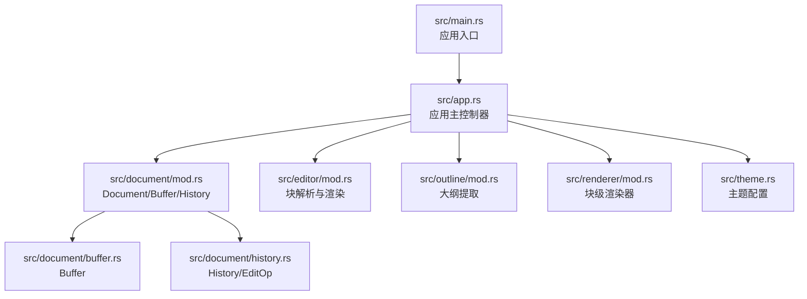
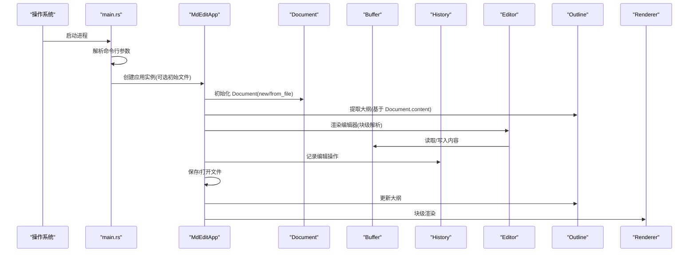
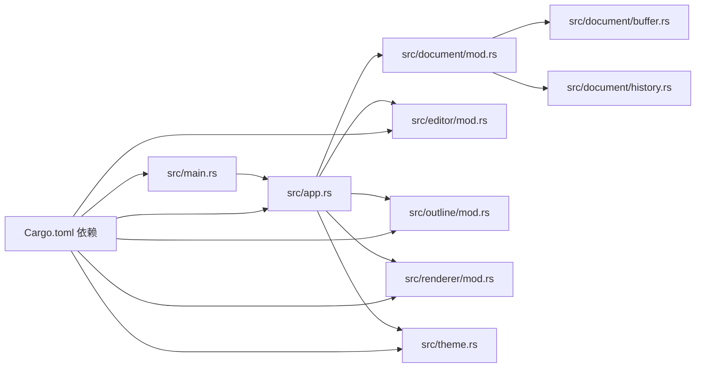
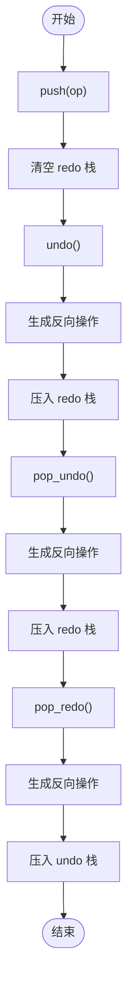
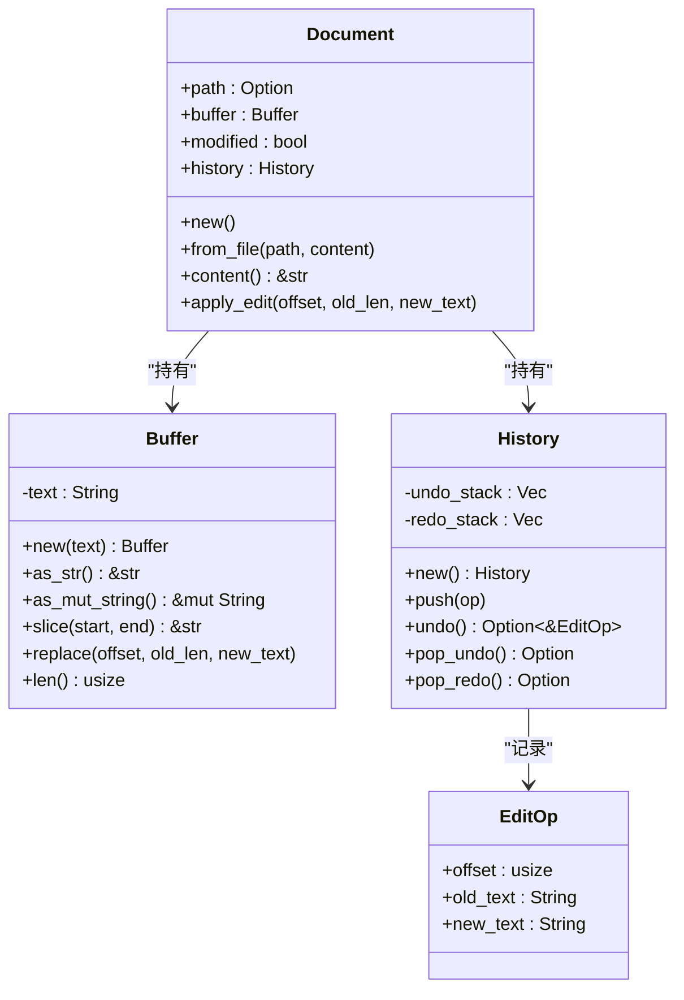

# 文档管理系统

<cite>
**本文引用的文件**
- [src/document/mod.rs](file://src/document/mod.rs)
- [src/document/buffer.rs](file://src/document/buffer.rs)
- [src/document/history.rs](file://src/document/history.rs)
- [src/app.rs](file://src/app.rs)
- [src/main.rs](file://src/main.rs)
- [src/editor/mod.rs](file://src/editor/mod.rs)
- [src/outline/mod.rs](file://src/outline/mod.rs)
- [src/renderer/mod.rs](file://src/renderer/mod.rs)
- [src/theme.rs](file://src/theme.rs)
- [Cargo.toml](file://Cargo.toml)
- [README.md](file://README.md)
</cite>

## 目录
1. [简介](#简介)
2. [项目结构](#项目结构)
3. [核心组件](#核心组件)
4. [架构总览](#架构总览)
5. [详细组件分析](#详细组件分析)
6. [依赖关系分析](#依赖关系分析)
7. [性能考量](#性能考量)
8. [故障排查指南](#故障排查指南)
9. [结论](#结论)
10. [附录](#附录)

## 简介
本项目是一个轻量级跨平台 Markdown 编辑器，采用“所见即所得”的编辑体验，无需 WebView2。系统围绕文档模型设计，包含文档结构、缓冲区、历史撤销重做、大纲提取与渲染等模块。本文档聚焦于以下主题：
- Document 结构的设计理念与数据组织方式
- Buffer 的实现机制（内存管理、字符串操作、增量更新策略）
- History 撤销重做功能（操作记录、状态快照与回滚算法）
- 文档修改状态跟踪、文件路径管理与内容同步机制
- 完整的 API 接口说明与使用示例
- 错误处理策略与边界情况处理方案

## 项目结构
项目采用按领域分层的模块化组织方式，核心逻辑集中在 document、editor、outline、renderer、theme 等子模块中，应用入口在 main.rs 中初始化并启动 GUI 应用。

图表来源
- [src/main.rs:35-49](file://src/main.rs#L35-L49)
- [src/app.rs:19-43](file://src/app.rs#L19-L43)
- [src/document/mod.rs:9-50](file://src/document/mod.rs#L9-L50)
- [src/editor/mod.rs:24-149](file://src/editor/mod.rs#L24-L149)
- [src/outline/mod.rs:7-26](file://src/outline/mod.rs#L7-L26)
- [src/renderer/mod.rs:19-142](file://src/renderer/mod.rs#L19-L142)
- [src/theme.rs:11-21](file://src/theme.rs#L11-L21)

章节来源
- [src/main.rs:1-50](file://src/main.rs#L1-L50)
- [src/app.rs:1-351](file://src/app.rs#L1-L351)
- [Cargo.toml:1-19](file://Cargo.toml#L1-L19)

## 核心组件
本节从系统视角概述核心组件及其职责：
- Document：文档对象，聚合 Buffer、History，并维护路径与修改状态
- Buffer：纯文本缓冲区，提供切片、替换、长度查询等基础能力
- History：编辑操作历史栈，支持撤销/重做与反向操作生成
- Editor：块级解析与渲染，将 Markdown 分割为不同类型的文本块
- Outline：从文档内容提取标题大纲
- Renderer：基于 pulldown-cmark 的块级渲染器
- App：GUI 应用控制器，负责事件处理、保存/打开、标题栏更新、大纲面板与编辑器交互

章节来源
- [src/document/mod.rs:9-50](file://src/document/mod.rs#L9-L50)
- [src/document/buffer.rs:1-30](file://src/document/buffer.rs#L1-L30)
- [src/document/history.rs:1-59](file://src/document/history.rs#L1-L59)
- [src/editor/mod.rs:4-22](file://src/editor/mod.rs#L4-L22)
- [src/outline/mod.rs:1-27](file://src/outline/mod.rs#L1-L27)
- [src/renderer/mod.rs:9-17](file://src/renderer/mod.rs#L9-L17)
- [src/app.rs:9-184](file://src/app.rs#L9-L184)

## 架构总览
下图展示了应用启动到文档编辑的端到端流程，以及各模块之间的协作关系。

图表来源
- [src/main.rs:15-33](file://src/main.rs#L15-L33)
- [src/app.rs:20-43](file://src/app.rs#L20-L43)
- [src/document/mod.rs:16-33](file://src/document/mod.rs#L16-L33)
- [src/outline/mod.rs:7-26](file://src/outline/mod.rs#L7-L26)
- [src/editor/mod.rs:24-149](file://src/editor/mod.rs#L24-L149)
- [src/renderer/mod.rs:19-142](file://src/renderer/mod.rs#L19-L142)

## 详细组件分析

### Document 设计与数据组织
Document 是文档的核心聚合对象，负责：
- 路径管理：存储打开/保存的文件路径
- 内容持有：通过 Buffer 提供只读/可变访问
- 修改状态：标记文档是否被修改
- 历史记录：维护编辑历史以便撤销/重做

设计要点：
- 使用 Option<PathBuf> 表示“未命名”或“已命名”文档
- 将 Buffer 与 History 作为内部字段，避免外部直接绕过历史记录
- 提供 apply_edit 方法统一记录编辑操作，确保历史一致性

章节来源
- [src/document/mod.rs:9-50](file://src/document/mod.rs#L9-L50)

### Buffer 实现机制
Buffer 提供了对底层 String 的安全封装，支持：
- 只读视图：as_str 返回 &str
- 可变视图：as_mut_string 返回 &mut String
- 切片访问：slice(start, end) 获取子串
- 原地替换：replace(offset, old_len, new_text) 原地修改
- 长度查询：len 返回字节长度

内存管理与字符串操作：
- 采用 String 作为唯一存储载体，避免频繁分配
- replace_range 原生支持原地替换，复杂度 O(n)（取决于替换长度）
- 切片返回 &str，零拷贝访问

增量更新策略：
- 当前实现为全量替换，适合小规模编辑
- 对于大规模内容，建议在上层进行批量合并后再调用 replace

章节来源
- [src/document/buffer.rs:1-30](file://src/document/buffer.rs#L1-L30)

### History 撤销重做
History 采用双栈设计：
- undo_stack：最近操作在顶部
- redo_stack：重做栈，清空以保证一致性

关键行为：
- push：压入新操作并清空 redo 栈
- undo：弹出顶部操作，生成反向操作压入 redo 栈
- pop_undo/pop_redo：弹出并返回操作，同时生成反向操作

回滚算法：
- 每次撤销/重做时，History 仅记录 EditOp，不保存完整快照
- 回滚通过 Buffer.replace 原地恢复，复杂度与操作范围成正比

章节来源
- [src/document/history.rs:1-59](file://src/document/history.rs#L1-L59)

### 文档修改状态跟踪、文件路径管理与内容同步
- 修改状态：Document 在 apply_edit 后设置 modified=true；保存成功后复位
- 文件路径：Document.path 存储当前文件路径；保存时若无路径则弹出保存对话框
- 内容同步：编辑器渲染时，将当前 Buffer 内容转换为块列表；在交互过程中，通过 commit_edit 将编辑后的文本块重新拼接回 Buffer

章节来源
- [src/document/mod.rs:39-49](file://src/document/mod.rs#L39-L49)
- [src/app.rs:133-163](file://src/app.rs#L133-L163)
- [src/app.rs:330-349](file://src/app.rs#L330-L349)

### API 接口文档

#### Document
- new() -> Document
  - 创建空文档，初始修改状态为未修改
- from_file(path: PathBuf, content: String) -> Document
  - 从文件创建文档，设置路径与内容，初始修改状态为未修改
- content() -> &str
  - 返回文档内容的只读视图
- apply_edit(offset: usize, old_len: usize, new_text: &str)
  - 应用一次编辑，记录操作并标记为已修改

章节来源
- [src/document/mod.rs:16-33](file://src/document/mod.rs#L16-L33)
- [src/document/mod.rs:35-49](file://src/document/mod.rs#L35-L49)

#### Buffer
- new(text: String) -> Buffer
- as_str() -> &str
- as_mut_string() -> &mut String
- slice(start: usize, end: usize) -> &str
- replace(offset: usize, old_len: usize, new_text: &str)
- len() -> usize

章节来源
- [src/document/buffer.rs:6-29](file://src/document/buffer.rs#L6-L29)

#### History
- new() -> History
- push(op: EditOp)
- undo() -> Option<&EditOp>
- pop_undo() -> Option<EditOp>
- pop_redo() -> Option<EditOp>

章节来源
- [src/document/history.rs:13-58](file://src/document/history.rs#L13-L58)

#### Editor（块级解析）
- split_blocks(content: &str) -> Vec<TextBlock>
  - 将 Markdown 文本拆分为不同类型的块，如标题、段落、代码块、引用、列表、表格、分割线、空行
- render_rich_block(ui: &mut egui::Ui, block: &TextBlock, theme: &Theme)
  - 渲染单个块到 egui UI

章节来源
- [src/editor/mod.rs:24-149](file://src/editor/mod.rs#L24-L149)
- [src/editor/mod.rs:159-266](file://src/editor/mod.rs#L159-L266)

#### Outline（大纲提取）
- extract_outline(content: &str) -> Vec<OutlineItem>
  - 从文档内容提取标题项，包含层级、标题文本与所在行号

章节来源
- [src/outline/mod.rs:7-26](file://src/outline/mod.rs#L7-L26)

#### Renderer（块级渲染器）
- parse_blocks(content: &str) -> Vec<Block>
  - 使用 pulldown-cmark 解析 Markdown 为 Block 列表，支持标题、段落、代码块、引用、列表、规则等

章节来源
- [src/renderer/mod.rs:19-142](file://src/renderer/mod.rs#L19-L142)

#### App（应用控制器）
- new(cc: &CreationContext, initial_file: Option<(PathBuf, String)>) -> Self
- update(ctx: &egui::Context, frame: &mut eframe::Frame)
- render_editor(ui: &mut egui::Ui)
- commit_edit(blocks: &[TextBlock])
- save_file()/save_file_as()
- open_file()/new_file()

章节来源
- [src/app.rs:19-43](file://src/app.rs#L19-L43)
- [src/app.rs:187-249](file://src/app.rs#L187-L249)
- [src/app.rs:251-350](file://src/app.rs#L251-L350)

### 使用示例

- 打开文件并创建文档
  - 步骤：命令行传入文件路径 -> main 读取文件 -> app 用 Document::from_file 创建文档 -> 提取大纲
  - 参考路径：[src/main.rs:15-33](file://src/main.rs#L15-L33)，[src/app.rs:26-32](file://src/app.rs#L26-L32)，[src/document/mod.rs:26-33](file://src/document/mod.rs#L26-L33)

- 编辑并应用撤销/重做
  - 步骤：用户编辑 -> Document.apply_edit 记录操作 -> 撤销时 History.undo 生成反向操作 -> 重做时 History.pop_redo
  - 参考路径：[src/document/mod.rs:39-49](file://src/document/mod.rs#L39-L49)，[src/document/history.rs:25-57](file://src/document/history.rs#L25-L57)

- 保存文档
  - 步骤：若已有路径则直接写入；否则弹出保存对话框选择路径 -> 写入成功后复位修改状态
  - 参考路径：[src/app.rs:133-163](file://src/app.rs#L133-L163)

- 大纲更新
  - 步骤：每次内容变化后调用 outline::extract_outline 重新提取标题项
  - 参考路径：[src/app.rs:86-88](file://src/app.rs#L86-L88)，[src/outline/mod.rs:7-26](file://src/outline/mod.rs#L7-L26)

## 依赖关系分析

图表来源
- [src/main.rs:3-8](file://src/main.rs#L3-L8)
- [src/app.rs:1-8](file://src/app.rs#L1-L8)
- [Cargo.toml:8-13](file://Cargo.toml#L8-L13)

章节来源
- [Cargo.toml:8-13](file://Cargo.toml#L8-L13)

## 性能考量
- 字符串操作
  - Buffer.replace 使用原地替换，适合小到中等规模编辑；对于超大文档，建议在上层进行批量化合并，减少多次 replace 的开销
- 历史记录
  - History 仅记录 EditOp，不保存完整快照，内存占用低；undo/redo 时生成反向操作，时间复杂度与操作范围成正比
- 块级解析
  - split_blocks 对每行进行扫描分类，整体复杂度 O(n)；渲染阶段按块绘制，避免重复解析
- 渲染器
  - 使用 pulldown-cmark 解析 Markdown，支持表格、任务列表等特性，解析与渲染分离，便于扩展

[本节为通用性能讨论，不直接分析具体文件]

## 故障排查指南
- 打开文件失败
  - 现象：命令行未提供文件或文件读取失败
  - 处理：弹出错误对话框提示并返回 None
  - 参考路径：[src/main.rs:22-32](file://src/main.rs#L22-L32)

- 保存文件失败
  - 现象：写入文件返回错误
  - 处理：不改变修改状态；建议检查权限与磁盘空间
  - 参考路径：[src/app.rs:148-150](file://src/app.rs#L148-L150)

- 撤销/重做异常
  - 现象：历史栈为空或不一致
  - 处理：确保每次编辑都通过 Document.apply_edit 记录；避免直接绕过 History
  - 参考路径：[src/document/mod.rs:39-49](file://src/document/mod.rs#L39-L49)，[src/document/history.rs:20-23](file://src/document/history.rs#L20-L23)

- 大纲不更新
  - 现象：编辑后大纲未刷新
  - 处理：确认在编辑变更后调用 outline::extract_outline；检查编辑器交互逻辑
  - 参考路径：[src/app.rs:275-278](file://src/app.rs#L275-L278)，[src/outline/mod.rs:7-26](file://src/outline/mod.rs#L7-L26)

章节来源
- [src/main.rs:22-32](file://src/main.rs#L22-L32)
- [src/app.rs:148-150](file://src/app.rs#L148-L150)
- [src/document/mod.rs:39-49](file://src/document/mod.rs#L39-L49)
- [src/document/history.rs:20-23](file://src/document/history.rs#L20-L23)
- [src/app.rs:275-278](file://src/app.rs#L275-L278)
- [src/outline/mod.rs:7-26](file://src/outline/mod.rs#L7-L26)

## 结论
本系统以简洁的模块划分实现了轻量级 Markdown 编辑器的核心能力。Document 作为聚合根，通过 Buffer 与 History 提供了可靠的文本编辑与历史管理；Editor 与 Outline 实现了块级解析与大纲导航；Renderer 与 Theme 提供了美观的渲染效果。整体架构清晰、职责明确，具备良好的扩展性与可维护性。

[本节为总结性内容，不直接分析具体文件]

## 附录

### 关键流程图：撤销/重做算法

图表来源
- [src/document/history.rs:20-57](file://src/document/history.rs#L20-L57)

### 关键类图：Document/Buffer/History

图表来源
- [src/document/mod.rs:9-50](file://src/document/mod.rs#L9-L50)
- [src/document/buffer.rs:1-30](file://src/document/buffer.rs#L1-L30)
- [src/document/history.rs:1-59](file://src/document/history.rs#L1-L59)