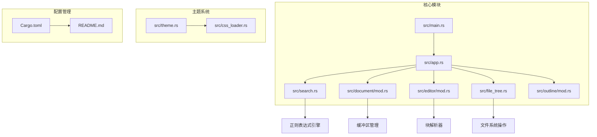
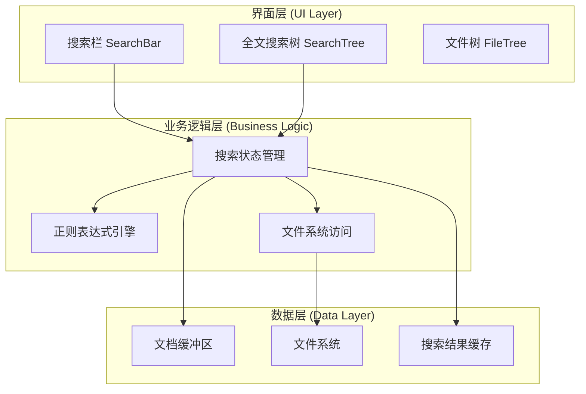
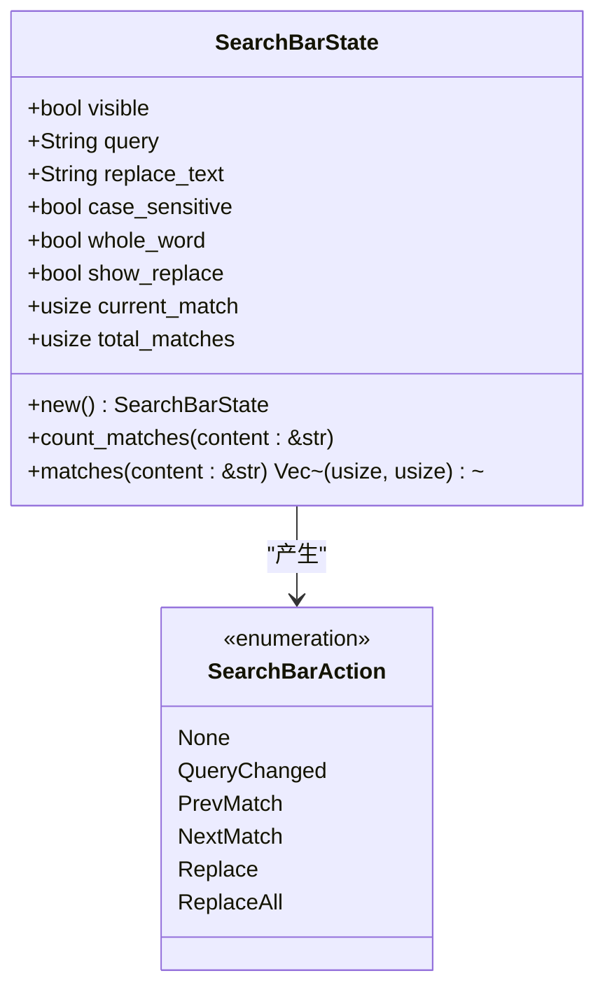
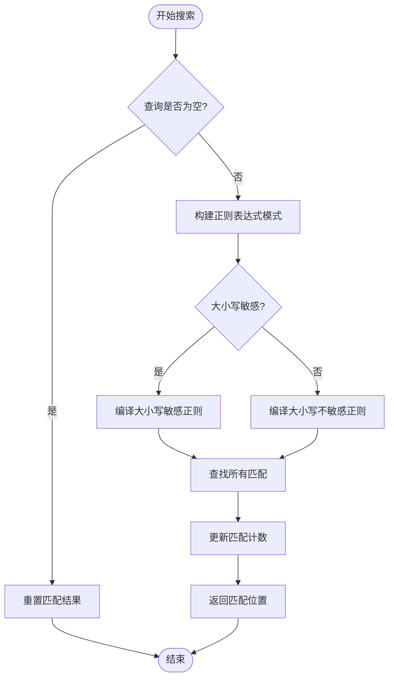
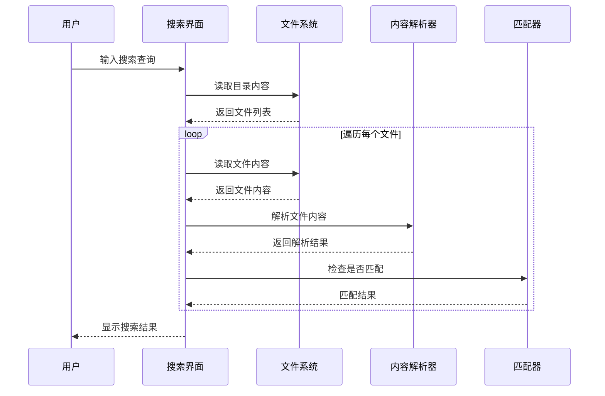
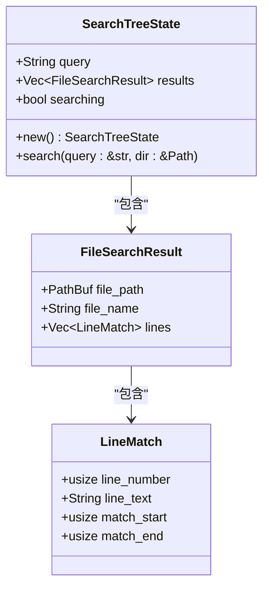
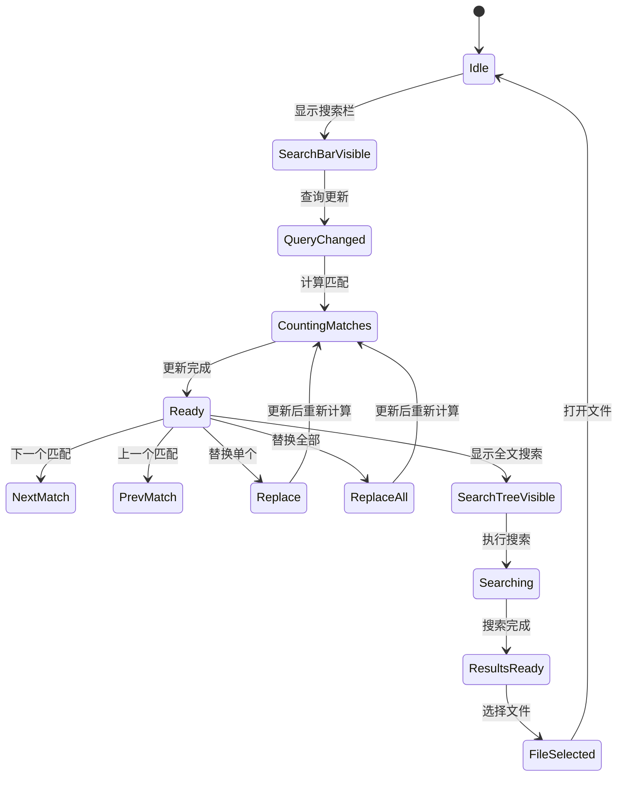
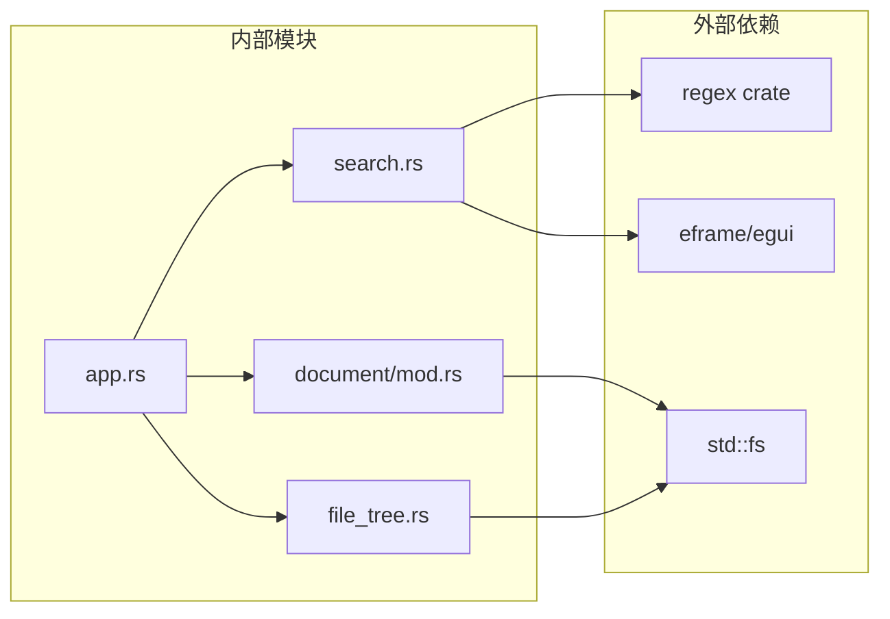

# 综合搜索系统

<cite>
**本文档引用的文件**
- [src/main.rs](file://src/main.rs)
- [src/search.rs](file://src/search.rs)
- [src/app.rs](file://src/app.rs)
- [src/document/mod.rs](file://src/document/mod.rs)
- [src/editor/mod.rs](file://src/editor/mod.rs)
- [src/file_tree.rs](file://src/file_tree.rs)
- [src/outline/mod.rs](file://src/outline/mod.rs)
- [src/theme.rs](file://src/theme.rs)
- [src/css_loader.rs](file://src/css_loader.rs)
- [Cargo.toml](file://Cargo.toml)
- [README.md](file://README.md)
</cite>

## 目录
1. [简介](#简介)
2. [项目结构](#项目结构)
3. [核心组件](#核心组件)
4. [架构概览](#架构概览)
5. [详细组件分析](#详细组件分析)
6. [依赖关系分析](#依赖关系分析)
7. [性能考虑](#性能考虑)
8. [故障排除指南](#故障排除指南)
9. [结论](#结论)

## 简介

综合搜索系统是 mdedit Markdown 编辑器中的核心功能模块，提供了两种搜索能力：
- **编辑器内搜索**：在当前打开的 Markdown 文档中进行实时搜索和替换
- **全文搜索**：在整个数据目录中搜索包含特定内容的 Markdown 文件

该系统采用 Rust + egui 架构实现，具有高性能、跨平台的特点，支持大小写敏感搜索、全词匹配、正则表达式等功能。

## 项目结构

mdedit 项目采用模块化设计，主要目录结构如下：

**图表来源**
- [src/main.rs:1-286](file://src/main.rs#L1-L286)
- [src/app.rs:545-586](file://src/app.rs#L545-L586)
- [src/search.rs:1-333](file://src/search.rs#L1-L333)

**章节来源**
- [src/main.rs:1-286](file://src/main.rs#L1-L286)
- [Cargo.toml:1-21](file://Cargo.toml#L1-L21)

## 核心组件

综合搜索系统由以下核心组件构成：

### 1. 搜索栏组件 (SearchBar)
- 实现编辑器内的实时搜索功能
- 支持大小写敏感和全词匹配
- 提供上一个/下一个匹配跳转
- 支持单个替换和全部替换

### 2. 全文搜索组件 (SearchTree)
- 在整个数据目录中搜索 Markdown 文件
- 支持文件名过滤和内容搜索
- 提供搜索结果列表和快速跳转

### 3. 搜索状态管理
- 统一的状态管理机制
- 搜索结果缓存和更新
- 用户交互响应处理

**章节来源**
- [src/search.rs:6-48](file://src/search.rs#L6-L48)
- [src/search.rs:187-206](file://src/search.rs#L187-L206)

## 架构概览

综合搜索系统采用分层架构设计，各层职责明确：

**图表来源**
- [src/app.rs:1183-1244](file://src/app.rs#L1183-L1244)
- [src/search.rs:65-160](file://src/search.rs#L65-L160)

## 详细组件分析

### 搜索栏组件 (SearchBar)

搜索栏是编辑器内的浮动搜索界面，提供实时搜索体验：

#### 数据结构设计

**图表来源**
- [src/search.rs:6-170](file://src/search.rs#L6-L170)

#### 搜索算法实现

搜索算法支持多种匹配模式：

**图表来源**
- [src/search.rs:50-63](file://src/search.rs#L50-L63)

#### 用户界面交互

搜索栏提供丰富的交互功能：
- 实时查询更新和匹配计数
- 大小写敏感切换按钮
- 全词匹配开关
- 上一个/下一个匹配导航
- 替换功能（单个和全部）

**章节来源**
- [src/search.rs:65-160](file://src/search.rs#L65-L160)
- [src/search.rs:50-63](file://src/search.rs#L50-L63)

### 全文搜索组件 (SearchTree)

全文搜索在指定的数据目录中搜索所有 Markdown 文件：

#### 搜索流程

**图表来源**
- [src/search.rs:198-231](file://src/search.rs#L198-L231)

#### 搜索结果结构

**图表来源**
- [src/search.rs:187-251](file://src/search.rs#L187-L251)

#### 搜索优化策略

- **文件过滤**：自动忽略隐藏文件和特殊目录
- **内容缓存**：避免重复读取相同文件
- **异步处理**：搜索过程不影响界面响应
- **结果限制**：每文件最多显示10个匹配行

**章节来源**
- [src/search.rs:198-251](file://src/search.rs#L198-L251)

### 应用集成

搜索功能与应用程序的深度集成：

#### 状态管理

**图表来源**
- [src/app.rs:1183-1244](file://src/app.rs#L1183-L1244)

#### 键盘快捷键支持

- **Ctrl+F**：显示编辑器内搜索栏
- **Ctrl+Shift+F**：显示全文搜索
- **Enter**：执行搜索或确认操作
- **方向键**：在匹配间导航
- **Esc**：关闭搜索界面

**章节来源**
- [src/app.rs:1183-1244](file://src/app.rs#L1183-L1244)

## 依赖关系分析

综合搜索系统依赖关系清晰，模块间耦合度低：

**图表来源**
- [Cargo.toml:8-15](file://Cargo.toml#L8-L15)
- [src/search.rs:1-2](file://src/search.rs#L1-L2)

### 关键依赖说明

- **regex crate**：提供强大的正则表达式支持
- **eframe/egui**：图形界面框架，支持跨平台
- **std::fs**：文件系统操作接口
- **pulldown-cmark**：Markdown 解析器
- **syntect**：语法高亮支持

**章节来源**
- [Cargo.toml:8-15](file://Cargo.toml#L8-L15)

## 性能考虑

综合搜索系统在性能方面采用了多项优化措施：

### 1. 正则表达式优化
- 使用 `regex::RegexBuilder` 进行编译时优化
- 缓存编译后的正则表达式对象
- 避免重复编译相同的模式

### 2. 文件系统访问优化
- 批量读取文件内容，减少系统调用次数
- 智能文件过滤，避免不必要的读取
- 使用迭代器模式处理大量文件

### 3. 内存管理
- 按需分配搜索结果内存
- 及时释放不再使用的临时数据
- 避免深层递归导致的栈溢出

### 4. 界面响应性
- 异步搜索处理，不阻塞主线程
- 实时搜索建议，提升用户体验
- 滚动区域优化，支持大量结果展示

## 故障排除指南

### 常见问题及解决方案

#### 1. 搜索结果不准确
**症状**：搜索结果包含意外匹配
**可能原因**：
- 正则表达式模式不正确
- 大小写敏感设置不当
- 全词匹配选项未启用

**解决方法**：
- 检查查询字符串中的特殊字符
- 调整大小写敏感和全词匹配设置
- 使用更精确的查询条件

#### 2. 搜索速度慢
**症状**：全文搜索耗时较长
**可能原因**：
- 数据目录包含大量文件
- 文件内容过大
- 磁盘 I/O 性能问题

**解决方法**：
- 限制搜索范围到特定子目录
- 使用更具体的搜索关键词
- 检查磁盘性能和可用空间

#### 3. 内存占用过高
**症状**：应用内存使用持续增长
**可能原因**：
- 搜索结果缓存未及时清理
- 大量文件同时被读取
- 正则表达式匹配过于复杂

**解决方法**：
- 定期清理搜索历史
- 限制同时打开的文件数量
- 简化搜索查询模式

#### 4. 界面卡顿
**症状**：搜索过程中界面无响应
**可能原因**：
- 搜索操作阻塞了主线程
- 大量 UI 更新操作
- 正则表达式计算复杂度过高

**解决方法**：
- 使用异步搜索处理
- 减少 UI 更新频率
- 优化正则表达式模式

**章节来源**
- [src/search.rs:50-63](file://src/search.rs#L50-L63)
- [src/app.rs:1183-1244](file://src/app.rs#L1183-L1244)

## 结论

综合搜索系统是 mdedit 的重要功能模块，具有以下特点：

### 技术优势
- **高性能**：采用 Rust 语言实现，内存安全且运行高效
- **跨平台**：基于 egui 框架，支持 Windows、macOS、Linux
- **功能完整**：涵盖编辑器内搜索和全文搜索两大场景
- **用户体验**：提供流畅的实时搜索和直观的界面交互

### 设计亮点
- **模块化架构**：清晰的组件分离和职责划分
- **状态管理**：完善的搜索状态跟踪和更新机制
- **性能优化**：多层面的性能优化策略
- **错误处理**：健壮的异常处理和故障恢复机制

### 发展前景
随着 Markdown 文档数量的增长，搜索功能将继续演进，可能的改进方向包括：
- 支持更多搜索模式（正则表达式、通配符等）
- 添加搜索历史和书签功能
- 实现分布式搜索支持
- 集成 AI 辅助搜索建议

综合搜索系统为 mdedit 提供了强大的内容检索能力，是提升用户工作效率的重要工具。