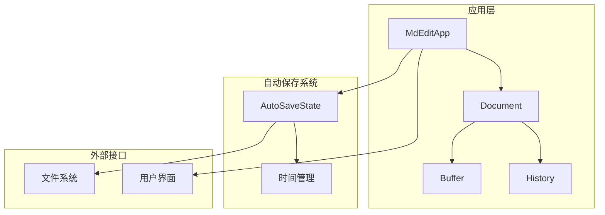
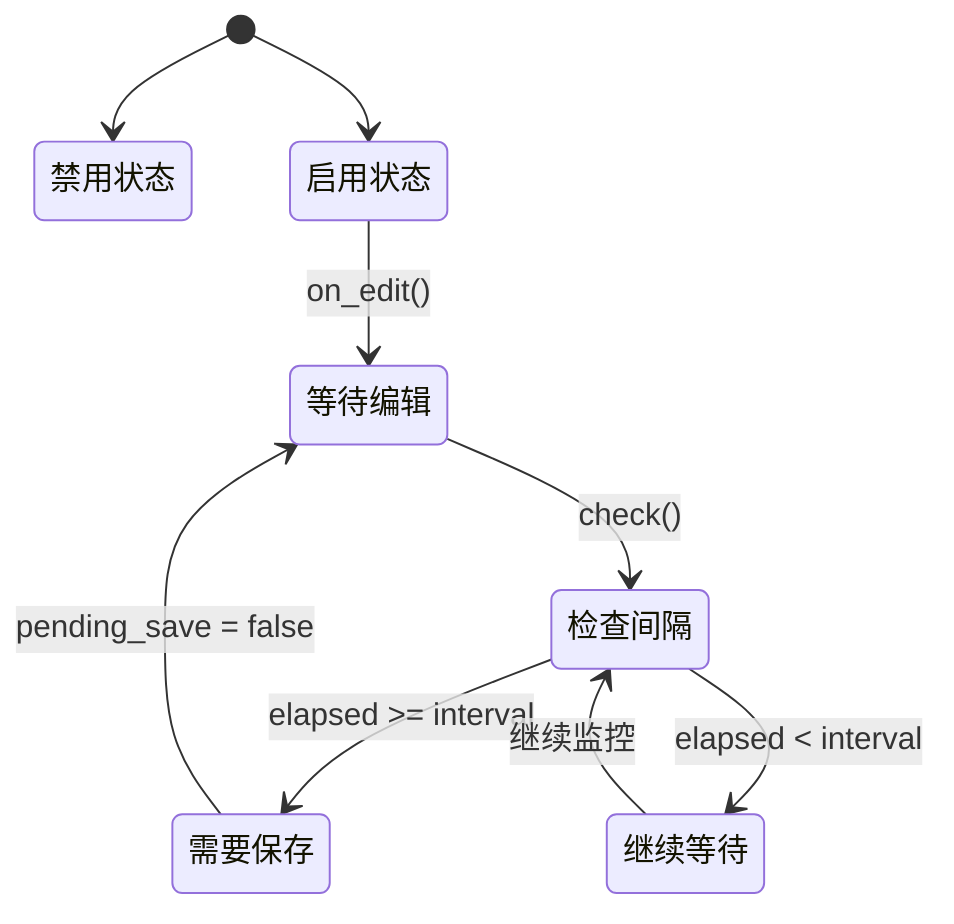
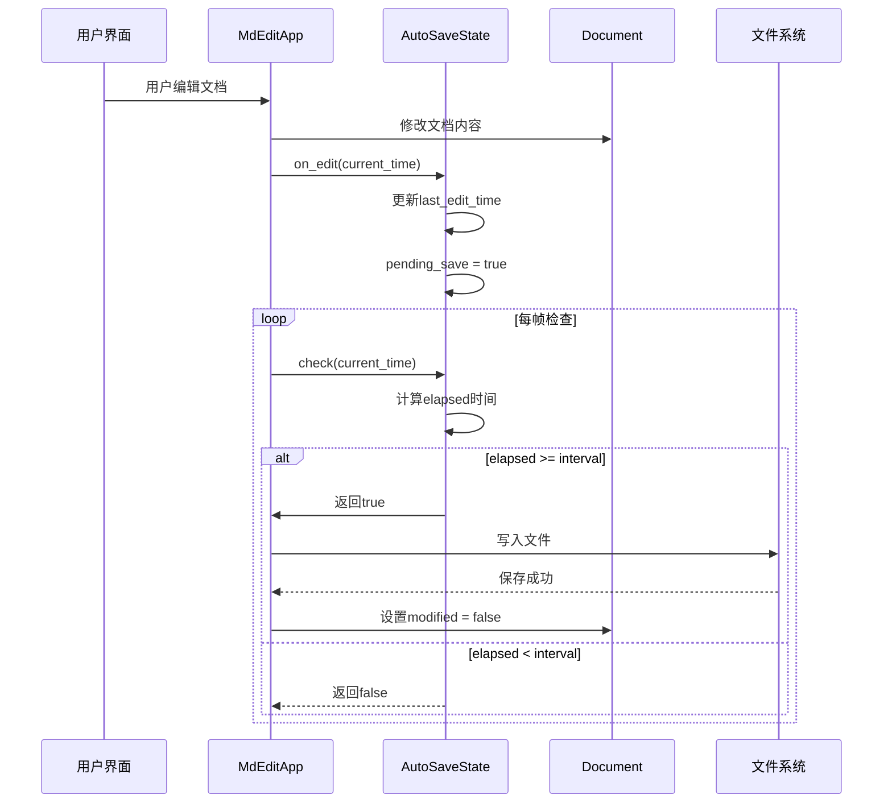
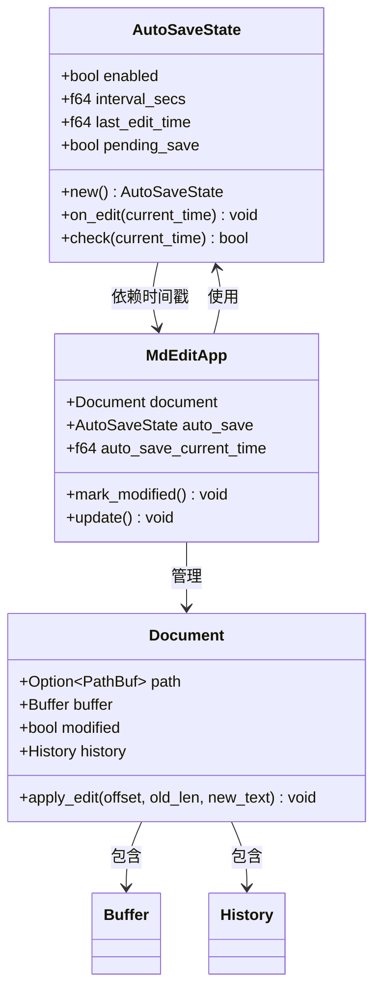
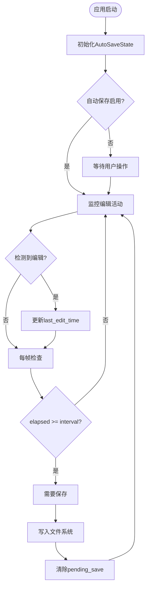
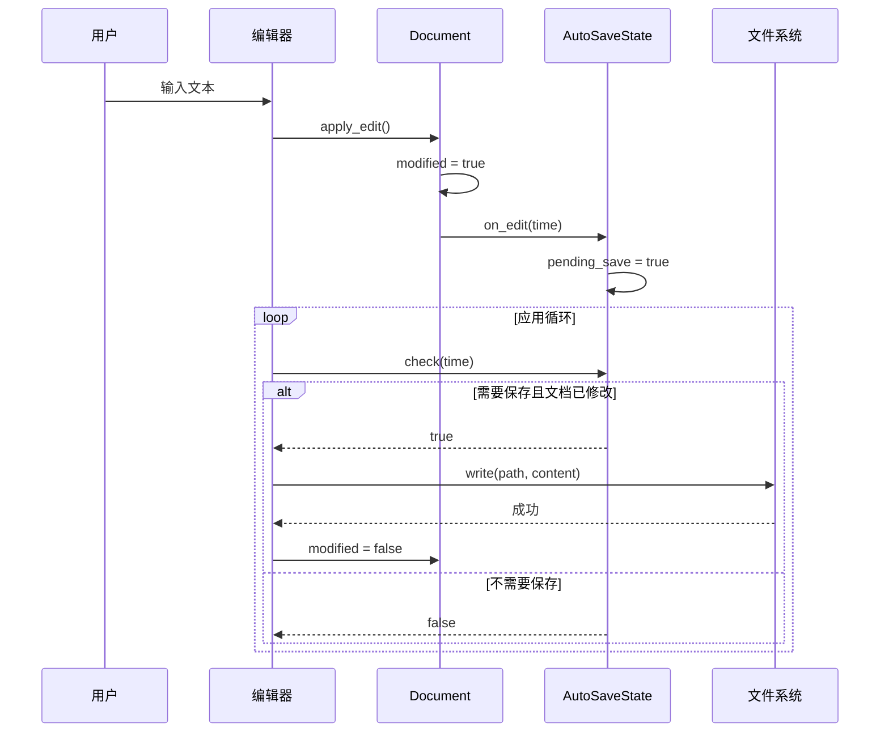

# 自动保存系统

<cite>
**本文档引用的文件**
- [src/auto_save.rs](file://src/auto_save.rs)
- [src/app.rs](file://src/app.rs)
- [src/document/mod.rs](file://src/document/mod.rs)
- [src/document/buffer.rs](file://src/document/buffer.rs)
- [src/document/history.rs](file://src/document/history.rs)
- [src/main.rs](file://src/main.rs)
- [Cargo.toml](file://Cargo.toml)
- [docs/requirements.md](file://docs/requirements.md)
- [docs/test-cases.md](file://docs/test-cases.md)
</cite>

## 目录
1. [简介](#简介)
2. [项目结构](#项目结构)
3. [核心组件](#核心组件)
4. [架构概览](#架构概览)
5. [详细组件分析](#详细组件分析)
6. [依赖关系分析](#依赖关系分析)
7. [性能考虑](#性能考虑)
8. [故障排除指南](#故障排除指南)
9. [结论](#结论)

## 简介

mdedit 是一款轻量级跨平台的 Markdown 编辑器，采用 Typora 式所见即所得（WYSIWYG）编辑模式。自动保存系统是该编辑器的核心功能之一，确保用户在编辑过程中不会因为意外断电或程序崩溃而丢失数据。

自动保存系统的主要特点包括：
- 基于时间间隔的智能保存机制
- 与文档修改状态的无缝集成
- 轻量级设计，不影响编辑器性能
- 支持自定义保存间隔和启用/禁用控制

## 项目结构

mdedit 项目的整体架构采用模块化设计，自动保存系统作为独立模块与其他核心组件协同工作：



**图表来源**
- [src/app.rs:545-586](file://src/app.rs#L545-L586)
- [src/auto_save.rs:1-33](file://src/auto_save.rs#L1-L33)

**章节来源**
- [src/app.rs:1-800](file://src/app.rs#L1-L800)
- [src/auto_save.rs:1-33](file://src/auto_save.rs#L1-L33)

## 核心组件

自动保存系统由以下核心组件构成：

### AutoSaveState 结构体
AutoSaveState 是自动保存系统的核心数据结构，负责维护保存状态和配置参数。

### 关键属性说明
- `enabled`: 控制自动保存功能的启用状态
- `interval_secs`: 保存间隔（秒），默认60秒
- `last_edit_time`: 上次编辑的时间戳
- `pending_save`: 标识是否需要执行保存操作

### 状态转换流程



**图表来源**
- [src/auto_save.rs:18-31](file://src/auto_save.rs#L18-L31)

**章节来源**
- [src/auto_save.rs:1-33](file://src/auto_save.rs#L1-L33)

## 架构概览

自动保存系统在整个应用架构中的位置和交互关系如下：



**图表来源**
- [src/app.rs:877-882](file://src/app.rs#L877-L882)
- [src/app.rs:1067-1076](file://src/app.rs#L1067-L1076)
- [src/auto_save.rs:18-31](file://src/auto_save.rs#L18-L31)

## 详细组件分析

### AutoSaveState 类设计



**图表来源**
- [src/auto_save.rs:1-33](file://src/auto_save.rs#L1-L33)
- [src/app.rs:545-586](file://src/app.rs#L545-L586)
- [src/document/mod.rs:9-51](file://src/document/mod.rs#L9-L51)

### 时间管理机制

自动保存系统采用基于事件驱动的时间管理模式：



**图表来源**
- [src/auto_save.rs:23-31](file://src/auto_save.rs#L23-L31)
- [src/app.rs:1067-1076](file://src/app.rs#L1067-L1076)

### 文档状态管理

自动保存系统与文档状态的集成机制：



**图表来源**
- [src/app.rs:877-882](file://src/app.rs#L877-L882)
- [src/app.rs:1067-1076](file://src/app.rs#L1067-L1076)
- [src/document/mod.rs:39-49](file://src/document/mod.rs#L39-L49)

**章节来源**
- [src/auto_save.rs:1-33](file://src/auto_save.rs#L1-L33)
- [src/app.rs:877-882](file://src/app.rs#L877-L882)
- [src/app.rs:1067-1076](file://src/app.rs#L1067-L1076)
- [src/document/mod.rs:39-49](file://src/document/mod.rs#L39-L49)

## 依赖关系分析

自动保存系统与其他组件的依赖关系：

```mermaid
graph LR
subgraph "核心依赖"
A[AutoSaveState] --> B[egui Context]
A --> C[std::fs]
end
subgraph "应用集成"
D[MdEditApp] --> A
D --> E[Document]
E --> F[Buffer]
E --> G[History]
end
subgraph "外部系统"
H[文件系统] <- --> C
I[操作系统] <- --> B
end
J[配置系统] -.-> D
K[主题系统] -.-> D
L[工具栏] -.-> D
```

**图表来源**
- [src/auto_save.rs:1-33](file://src/auto_save.rs#L1-L33)
- [src/app.rs:21-28](file://src/app.rs#L21-L28)
- [src/document/mod.rs:1-51](file://src/document/mod.rs#L1-L51)

### 外部依赖

自动保存系统主要依赖以下外部组件：

- **egui Context**: 提供时间戳和帧率信息
- **std::fs**: 文件系统操作接口
- **操作系统**: 系统时间和进程管理

**章节来源**
- [src/auto_save.rs:1-33](file://src/auto_save.rs#L1-L33)
- [src/app.rs:21-28](file://src/app.rs#L21-L28)
- [Cargo.toml:8-16](file://Cargo.toml#L8-L16)

## 性能考虑

自动保存系统的性能优化策略：

### 时间复杂度分析
- **on_edit()**: O(1) - 更新时间戳和标志位
- **check()**: O(1) - 时间差计算和比较
- **整体系统**: O(F) - F为帧数，每次检查都是常数时间操作

### 内存使用
- AutoSaveState: 仅存储4个f64类型和2个bool类型
- 内存占用极小，几乎不影响应用性能

### 优化建议
1. **合理设置保存间隔**: 默认60秒，可根据用户习惯调整
2. **避免频繁磁盘写入**: 通过时间间隔控制写入频率
3. **异步文件操作**: 可考虑将文件写入改为后台线程执行

## 故障排除指南

### 常见问题及解决方案

#### 问题1: 自动保存不生效
**可能原因**:
- AutoSaveState.enabled = false
- 文档未实际修改（modified = false）

**解决方法**:
- 检查AutoSaveState的enabled状态
- 确认文档确实进行了修改

#### 问题2: 保存间隔不正确
**可能原因**:
- interval_secs设置不当
- 时间戳获取异常

**解决方法**:
- 验证interval_secs配置
- 检查egui Context的时间戳

#### 问题3: 文件写入失败
**可能原因**:
- 文件权限不足
- 磁盘空间不足
- 路径无效

**解决方法**:
- 检查文件权限
- 确认磁盘空间
- 验证文件路径有效性

**章节来源**
- [src/auto_save.rs:23-31](file://src/auto_save.rs#L23-L31)
- [src/app.rs:1067-1076](file://src/app.rs#L1067-L1076)

## 结论

mdedit 的自动保存系统通过简洁而高效的架构设计，实现了可靠的文档保护功能。系统采用基于时间间隔的智能保存机制，与文档修改状态无缝集成，在保证数据安全的同时最大限度地减少了对用户体验的影响。

### 系统优势
1. **可靠性**: 基于时间间隔的保存机制确保数据不会因意外情况丢失
2. **性能友好**: 常数时间复杂度的操作不影响编辑器响应速度
3. **易于集成**: 独立的状态管理使得系统可以轻松集成到现有架构中
4. **可配置性强**: 支持自定义保存间隔和启用/禁用控制

### 未来改进方向
1. **增量保存**: 实现基于变更的增量保存，减少磁盘写入
2. **云同步**: 集成云存储服务，实现多设备同步
3. **冲突解决**: 添加冲突检测和自动解决机制
4. **备份策略**: 实现多版本备份和恢复功能

自动保存系统作为 mdedit 的重要组成部分，为用户提供了可靠的数据安全保障，是现代文档编辑器不可或缺的核心功能之一。