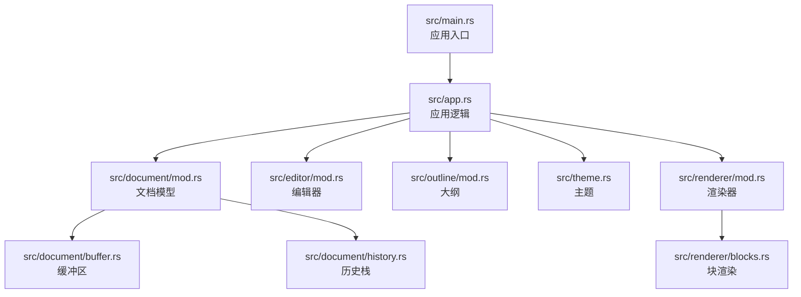
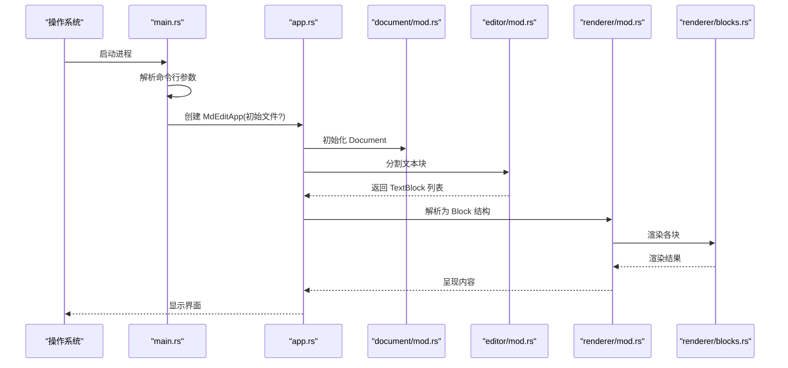
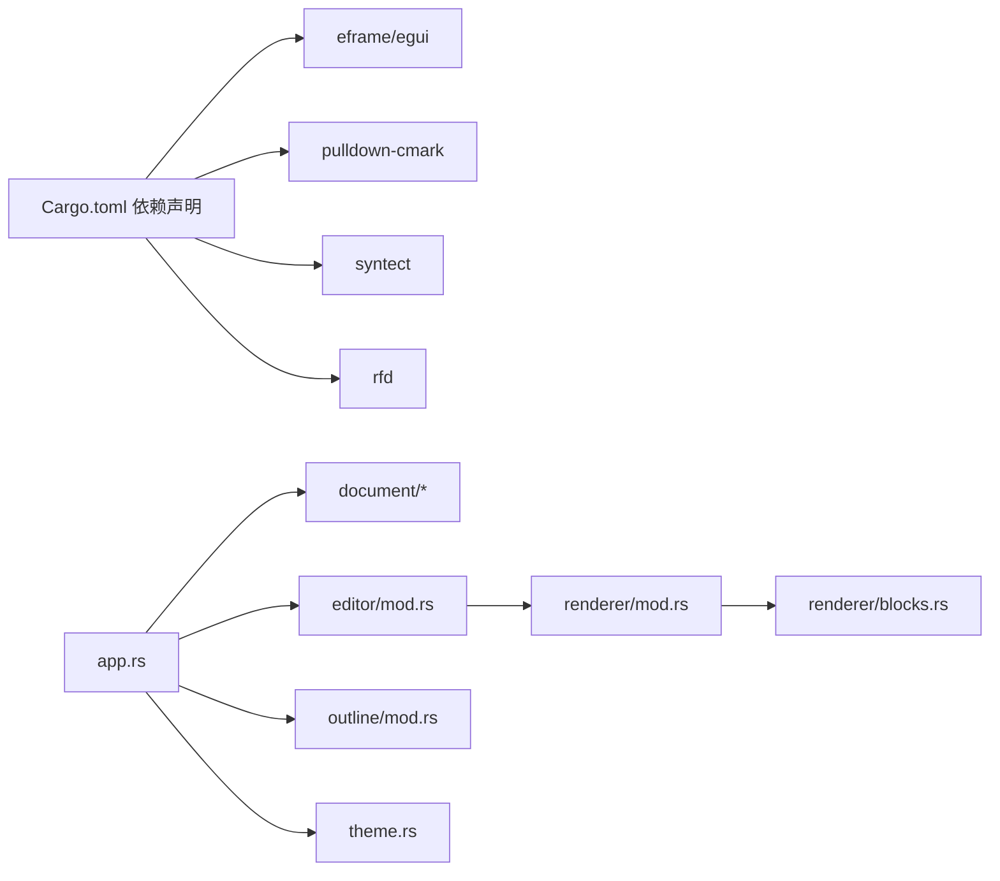

# 代码规范与风格

<cite>
**本文引用的文件**
- [Cargo.toml](file://Cargo.toml)
- [README.md](file://README.md)
- [src/main.rs](file://src/main.rs)
- [src/app.rs](file://src/app.rs)
- [src/theme.rs](file://src/theme.rs)
- [src/document/mod.rs](file://src/document/mod.rs)
- [src/document/buffer.rs](file://src/document/buffer.rs)
- [src/document/history.rs](file://src/document/history.rs)
- [src/editor/mod.rs](file://src/editor/mod.rs)
- [src/renderer/mod.rs](file://src/renderer/mod.rs)
- [src/renderer/blocks.rs](file://src/renderer/blocks.rs)
- [src/outline/mod.rs](file://src/outline/mod.rs)
</cite>

## 目录
1. [引言](#引言)
2. [项目结构](#项目结构)
3. [核心组件](#核心组件)
4. [架构总览](#架构总览)
5. [详细组件分析](#详细组件分析)
6. [依赖关系分析](#依赖关系分析)
7. [性能考虑](#性能考虑)
8. [故障排查指南](#故障排查指南)
9. [结论](#结论)
10. [附录](#附录)

## 引言
本指南面向 mdedit 项目的贡献者，系统化地定义 Rust 代码风格、命名约定、模块组织、文件命名、注释与文档字符串规范、错误处理与日志记录、以及代码审查清单。目标是提升代码一致性、可读性与可维护性，帮助新贡献者快速上手。

## 项目结构
mdedit 采用按功能域划分的模块组织方式，核心模块如下：
- 应用入口与生命周期：main.rs、app.rs
- 文档模型与编辑状态：document/mod.rs、buffer.rs、history.rs
- 编辑器渲染与块解析：editor/mod.rs
- 渲染管线与块渲染：renderer/mod.rs、renderer/blocks.rs
- 大纲提取：outline/mod.rs
- 主题配置：theme.rs

图表来源
- [src/main.rs:1-50](file://src/main.rs#L1-L50)
- [src/app.rs:1-351](file://src/app.rs#L1-L351)
- [src/document/mod.rs:1-51](file://src/document/mod.rs#L1-L51)
- [src/document/buffer.rs:1-30](file://src/document/buffer.rs#L1-L30)
- [src/document/history.rs:1-59](file://src/document/history.rs#L1-L59)
- [src/editor/mod.rs:1-349](file://src/editor/mod.rs#L1-L349)
- [src/renderer/mod.rs:1-143](file://src/renderer/mod.rs#L1-L143)
- [src/renderer/blocks.rs:1-68](file://src/renderer/blocks.rs#L1-L68)
- [src/outline/mod.rs:1-27](file://src/outline/mod.rs#L1-L27)
- [src/theme.rs:1-22](file://src/theme.rs#L1-L22)

章节来源
- [src/main.rs:1-50](file://src/main.rs#L1-L50)
- [src/app.rs:1-351](file://src/app.rs#L1-L351)
- [src/document/mod.rs:1-51](file://src/document/mod.rs#L1-L51)
- [src/editor/mod.rs:1-349](file://src/editor/mod.rs#L1-L349)
- [src/renderer/mod.rs:1-143](file://src/renderer/mod.rs#L1-L143)
- [src/outline/mod.rs:1-27](file://src/outline/mod.rs#L1-L27)
- [src/theme.rs:1-22](file://src/theme.rs#L1-L22)

## 核心组件
- 应用入口与生命周期
  - 入口函数负责解析命令行参数、加载初始文件、构建窗口选项并启动 eframe 应用。
  - 错误处理：文件读取失败时弹出对话框提示用户。
- 应用主逻辑
  - 维护文档、大纲、主题、滚动定位、活动块等状态。
  - 提供快捷键处理、文件操作（新建、打开、保存、另存为）、富文本渲染与编辑提交。
- 文档模型
  - Document 封装路径、缓冲区、修改标记与历史栈；Buffer 提供切片与替换；History 支持撤销/重做。
- 编辑器与渲染
  - editor 模块将内容拆分为文本块并识别块类型；renderer 使用 pulldown-cmark 解析为结构化 Block 并交由 blocks.rs 渲染。
- 大纲与主题
  - outline 提取标题层级与行号；theme 定义字体尺寸与颜色。

章节来源
- [src/main.rs:15-33](file://src/main.rs#L15-L33)
- [src/app.rs:19-185](file://src/app.rs#L19-L185)
- [src/document/mod.rs:9-50](file://src/document/mod.rs#L9-L50)
- [src/document/buffer.rs:5-29](file://src/document/buffer.rs#L5-L29)
- [src/document/history.rs:12-58](file://src/document/history.rs#L12-L58)
- [src/editor/mod.rs:24-149](file://src/editor/mod.rs#L24-L149)
- [src/renderer/mod.rs:19-142](file://src/renderer/mod.rs#L19-L142)
- [src/renderer/blocks.rs:5-63](file://src/renderer/blocks.rs#L5-L63)
- [src/outline/mod.rs:7-26](file://src/outline/mod.rs#L7-L26)
- [src/theme.rs:11-21](file://src/theme.rs#L11-L21)

## 架构总览
mdedit 的运行时交互流程如下：

图表来源
- [src/main.rs:35-49](file://src/main.rs#L35-L49)
- [src/app.rs:19-185](file://src/app.rs#L19-L185)
- [src/editor/mod.rs:24-149](file://src/editor/mod.rs#L24-L149)
- [src/renderer/mod.rs:19-142](file://src/renderer/mod.rs#L19-L142)
- [src/renderer/blocks.rs:5-63](file://src/renderer/blocks.rs#L5-L63)

## 详细组件分析

### 命名约定与代码风格
- 模块名：使用全小写短横线分隔（如 renderer），或与功能域一致的小写模块目录（如 document、editor、outline）。
- 函数名：采用 snake_case，语义明确，避免缩写；例如 split_blocks、render_rich_block、parse_blocks。
- 变量名：snake_case，尽量使用描述性名称；例如 content_snapshot、blocks、theme。
- 常量名：SCREAMING_SNAKE_CASE；例如在主题中使用的颜色常量风格。
- 类型名：PascalCase；例如 Document、TextBlock、Theme、EditOp。
- 枚举变体：PascalCase；例如 BlockKind 中的 Heading、Paragraph、CodeBlock 等。
- 字段与属性：camelCase 或 snake_case 视上下文而定，保持模块内一致；例如 Document 的 path、buffer、modified、history。
- 文件命名：模块对应文件名与模块名一致（如 editor/mod.rs、renderer/mod.rs），子模块以同名目录存放（如 document/、renderer/）。

章节来源
- [src/app.rs:9-17](file://src/app.rs#L9-L17)
- [src/document/mod.rs:9-14](file://src/document/mod.rs#L9-L14)
- [src/editor/mod.rs:4-22](file://src/editor/mod.rs#L4-L22)
- [src/renderer/mod.rs:9-17](file://src/renderer/mod.rs#L9-L17)
- [src/theme.rs:3-9](file://src/theme.rs#L3-L9)

### 代码格式化与注释规范
- 格式化工具：建议使用 rustfmt，默认风格即可；遵循标准断行与缩进。
- 注释位置：
  - 函数/模块注释：置于其上方，简洁说明职责与边界。
  - 行内注释：仅在必要处解释复杂逻辑，避免冗余。
  - TODO/NOTE：使用 TODO(...) 或 NOTE(...) 形式，便于检索。
- 文档字符串：
  - 公共项建议添加文档字符串，说明用途、参数、返回值与注意事项。
  - 示例：函数文档字符串应包含“功能”、“参数”、“返回值”、“错误情况”等要点。

章节来源
- [src/editor/mod.rs:24-149](file://src/editor/mod.rs#L24-L149)
- [src/renderer/mod.rs:19-142](file://src/renderer/mod.rs#L19-L142)
- [src/renderer/blocks.rs:5-63](file://src/renderer/blocks.rs#L5-L63)

### 模块组织与文件命名规则
- 功能域模块：
  - document：文档数据结构与编辑历史。
  - editor：块级解析与富文本渲染。
  - renderer：基于 pulldown-cmark 的块解析与渲染。
  - outline：标题大纲提取。
  - theme：UI 主题配置。
- 文件组织：
  - 模块文件与模块名一致（如 editor/mod.rs）。
  - 子模块以目录形式存在（如 document/、renderer/）。
  - 模块通过 pub use 导出公共接口，便于上层统一访问。

章节来源
- [src/document/mod.rs:1-6](file://src/document/mod.rs#L1-L6)
- [src/editor/mod.rs:1-2](file://src/editor/mod.rs#L1-L2)
- [src/renderer/mod.rs:1-6](file://src/renderer/mod.rs#L1-L6)

### 错误处理与日志记录
- 错误处理策略：
  - 文件读取失败：弹窗提示用户并返回 None；避免崩溃。
  - UI 交互：通过 egui 的响应判断变更与焦点丢失，触发提交与更新。
  - 文档编辑：apply_edit 将操作记录到历史栈，支持撤销/重做。
- 日志记录：
  - 当前实现未引入外部日志库；建议在需要时使用 tracing 或 log + env_logger，并在 CI 中统一输出级别。
  - 对于用户可见的错误，优先采用 rfd 对话框提示。

章节来源
- [src/main.rs:22-33](file://src/main.rs#L22-L33)
- [src/app.rs:133-163](file://src/app.rs#L133-L163)
- [src/document/mod.rs:39-49](file://src/document/mod.rs#L39-L49)
- [src/document/history.rs:20-57](file://src/document/history.rs#L20-L57)

### 代码审查清单
- 命名与风格
  - 是否符合 snake_case、PascalCase、SCREAMING_SNAKE_CASE？
  - 是否存在无意义的缩写？
- 模块与文件
  - 模块是否按功能域划分？文件命名是否与模块一致？
  - 是否通过 pub use 暴露必要的公共接口？
- 错误处理
  - 是否妥善处理文件读写与 UI 交互错误？
  - 是否避免 panic，使用 Result/Option？
- 可测试性
  - 是否将纯逻辑（如块解析、大纲提取）抽离为独立函数以便单元测试？
- 性能
  - 是否避免不必要的字符串复制与重复解析？
  - 渲染路径是否按需更新？

章节来源
- [src/editor/mod.rs:24-149](file://src/editor/mod.rs#L24-L149)
- [src/outline/mod.rs:7-26](file://src/outline/mod.rs#L7-L26)
- [src/renderer/mod.rs:19-142](file://src/renderer/mod.rs#L19-L142)

### 具体示例与最佳实践
- 正确的函数命名与职责分离
  - 示例路径：[split_blocks:24-149](file://src/editor/mod.rs#L24-L149)、[parse_blocks:19-142](file://src/renderer/mod.rs#L19-L142)
- 状态管理与提交机制
  - 示例路径：[commit_edit:330-349](file://src/app.rs#L330-L349)、[apply_edit:39-49](file://src/document/mod.rs#L39-L49)
- 用户交互与错误提示
  - 示例路径：[load_initial_file:15-33](file://src/main.rs#L15-L33)、[save_file:133-151](file://src/app.rs#L133-L151)
- 主题与渲染
  - 示例路径：[Theme::default:11-21](file://src/theme.rs#L11-L21)、[render_block:5-63](file://src/renderer/blocks.rs#L5-L63)

章节来源
- [src/editor/mod.rs:24-149](file://src/editor/mod.rs#L24-L149)
- [src/renderer/mod.rs:19-142](file://src/renderer/mod.rs#L19-L142)
- [src/renderer/blocks.rs:5-63](file://src/renderer/blocks.rs#L5-L63)
- [src/app.rs:330-349](file://src/app.rs#L330-L349)
- [src/document/mod.rs:39-49](file://src/document/mod.rs#L39-L49)
- [src/main.rs:15-33](file://src/main.rs#L15-L33)
- [src/theme.rs:11-21](file://src/theme.rs#L11-L21)

## 依赖关系分析
- 外部依赖
  - eframe/egui：GUI 框架与渲染引擎。
  - pulldown-cmark：Markdown 解析。
  - syntect：语法高亮（禁用默认特性，启用 fancy）。
  - rfd：原生文件对话框。
- 内部模块耦合
  - app.rs 依赖 document、editor、outline、theme；editor 与 renderer 通过公共类型交互；document 的 Buffer 与 History 为编辑状态的核心。

图表来源
- [Cargo.toml:8-13](file://Cargo.toml#L8-L13)
- [src/app.rs:1-8](file://src/app.rs#L1-L8)
- [src/editor/mod.rs:1-2](file://src/editor/mod.rs#L1-L2)
- [src/renderer/mod.rs:1-6](file://src/renderer/mod.rs#L1-L6)
- [src/renderer/blocks.rs:1-3](file://src/renderer/blocks.rs#L1-L3)

章节来源
- [Cargo.toml:8-13](file://Cargo.toml#L8-L13)
- [src/app.rs:1-8](file://src/app.rs#L1-L8)
- [src/editor/mod.rs:1-2](file://src/editor/mod.rs#L1-L2)
- [src/renderer/mod.rs:1-6](file://src/renderer/mod.rs#L1-L6)
- [src/renderer/blocks.rs:1-3](file://src/renderer/blocks.rs#L1-L3)

## 性能考虑
- 解析与渲染
  - editor 与 renderer 的解析逻辑应避免重复计算；对长文档建议增量更新与缓存中间结果。
- UI 更新
  - 仅在内容变化时重建大纲与渲染树，减少 egui 重绘成本。
- 文件 I/O
  - 保存与打开文件时进行最小化错误处理与提示，避免阻塞主线程。

## 故障排查指南
- 启动失败或无法打开文件
  - 检查命令行参数与文件路径；确认权限与路径有效性。
  - 参考：[load_initial_file:15-33](file://src/main.rs#L15-L33)
- 保存失败或覆盖问题
  - 确认保存对话框返回路径；检查写入权限。
  - 参考：[save_file:133-151](file://src/app.rs#L133-L151)、[save_file_as:153-163](file://src/app.rs#L153-L163)
- 编辑后未刷新大纲
  - 确保在内容变更后调用大纲更新逻辑。
  - 参考：[update_outline:86-88](file://src/app.rs#L86-L88)

章节来源
- [src/main.rs:15-33](file://src/main.rs#L15-L33)
- [src/app.rs:86-88](file://src/app.rs#L86-L88)
- [src/app.rs:133-163](file://src/app.rs#L133-L163)

## 结论
本指南总结了 mdedit 的代码风格、模块组织、错误处理与审查要点。建议在开发中严格遵循命名与注释规范，保持模块职责单一，合理处理错误与用户反馈，并通过代码审查确保质量与一致性。

## 附录
- 快捷键参考（来自 README）
  - Ctrl+N：新建文档
  - Ctrl+O：打开文件
  - Ctrl+S：保存文件
  - Ctrl+Shift+S：另存为
- 构建与运行参考
  - 依赖与编译命令见 [README.md:13-35](file://README.md#L13-L35)

章节来源
- [README.md:37-44](file://README.md#L37-L44)
- [README.md:13-35](file://README.md#L13-L35)