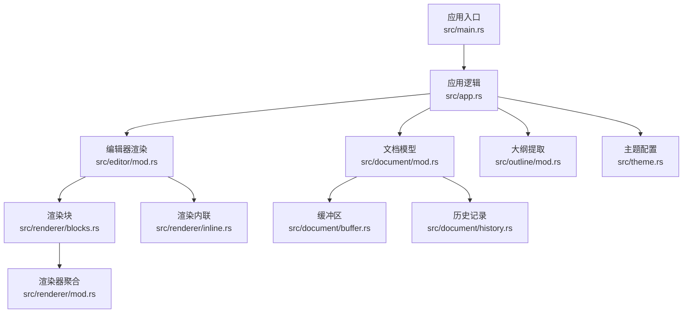
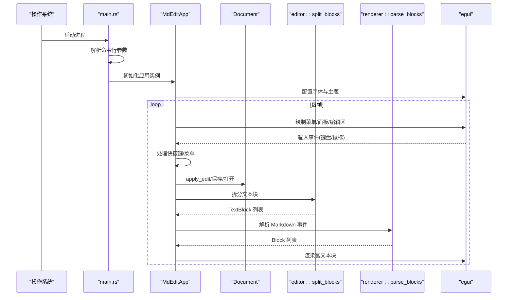
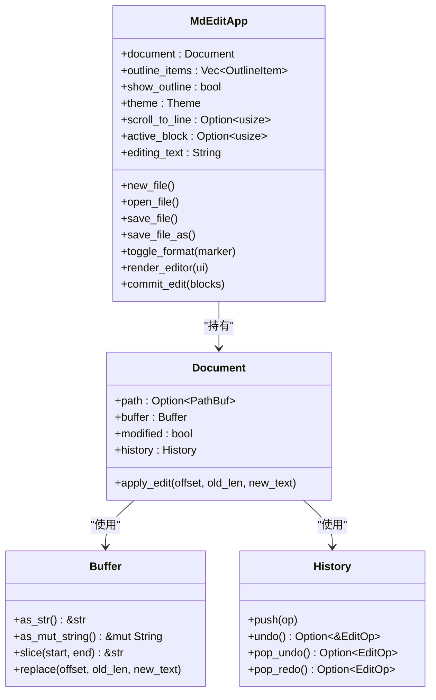
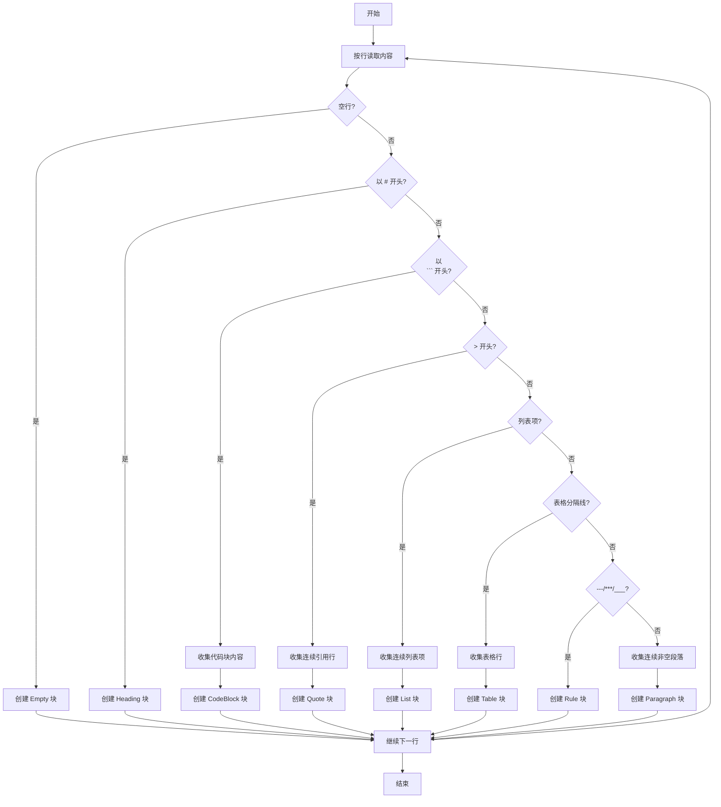
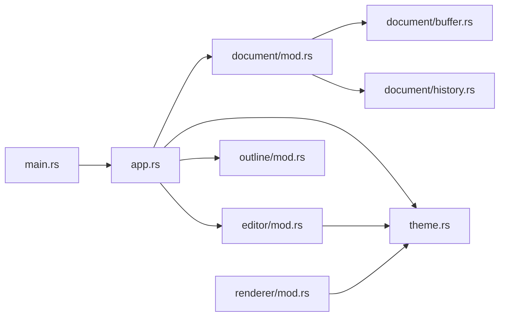

# 开发指南

<cite>
**本文引用的文件**
- [Cargo.toml](file://Cargo.toml)
- [README.md](file://README.md)
- [.cargo/config.toml](file://.cargo/config.toml)
- [src/main.rs](file://src/main.rs)
- [src/app.rs](file://src/app.rs)
- [src/theme.rs](file://src/theme.rs)
- [src/outline/mod.rs](file://src/outline/mod.rs)
- [src/document/mod.rs](file://src/document/mod.rs)
- [src/document/buffer.rs](file://src/document/buffer.rs)
- [src/document/history.rs](file://src/document/history.rs)
- [src/editor/mod.rs](file://src/editor/mod.rs)
- [src/renderer/mod.rs](file://src/renderer/mod.rs)
- [src/renderer/blocks.rs](file://src/renderer/blocks.rs)
- [src/renderer/inline.rs](file://src/renderer/inline.rs)
</cite>

## 目录
1. [简介](#简介)
2. [项目结构](#项目结构)
3. [核心组件](#核心组件)
4. [架构总览](#架构总览)
5. [详细组件分析](#详细组件分析)
6. [依赖关系分析](#依赖关系分析)
7. [性能与内存管理](#性能与内存管理)
8. [测试策略](#测试策略)
9. [调试与故障排查](#调试与故障排查)
10. [代码规范与编程风格](#代码规范与编程风格)
11. [开发环境配置](#开发环境配置)
12. [贡献指南](#贡献指南)
13. [构建系统与 CI/CD](#构建系统与-cicd)
14. [结论](#结论)
15. [附录](#附录)

## 简介
本指南面向 mdedit 项目的开发者与贡献者，目标是帮助你快速上手开发、高效调试、稳定发布。内容涵盖代码规范、开发环境、测试策略、调试技巧、构建与发布流程，以及性能优化与内存管理最佳实践。

## 项目结构
项目采用按功能域划分的模块组织方式，核心模块如下：
- 应用入口与生命周期：src/main.rs、src/app.rs
- 文档与编辑状态：src/document/{mod,buffer,history}.rs
- 编辑器渲染：src/editor/mod.rs
- 渲染管线：src/renderer/{mod,blocks,inline}.rs
- 大纲：src/outline/mod.rs
- 主题：src/theme.rs

图表来源
- [src/main.rs:1-50](file://src/main.rs#L1-L50)
- [src/app.rs:1-351](file://src/app.rs#L1-L351)
- [src/document/mod.rs:1-51](file://src/document/mod.rs#L1-L51)
- [src/editor/mod.rs:1-349](file://src/editor/mod.rs#L1-L349)
- [src/renderer/mod.rs:1-143](file://src/renderer/mod.rs#L1-L143)
- [src/renderer/blocks.rs:1-68](file://src/renderer/blocks.rs#L1-L68)
- [src/renderer/inline.rs:1-2](file://src/renderer/inline.rs#L1-L2)
- [src/outline/mod.rs:1-27](file://src/outline/mod.rs#L1-L27)
- [src/theme.rs:1-22](file://src/theme.rs#L1-L22)

章节来源
- [src/main.rs:1-50](file://src/main.rs#L1-L50)
- [src/app.rs:1-351](file://src/app.rs#L1-L351)
- [src/document/mod.rs:1-51](file://src/document/mod.rs#L1-L51)
- [src/editor/mod.rs:1-349](file://src/editor/mod.rs#L1-L349)
- [src/renderer/mod.rs:1-143](file://src/renderer/mod.rs#L1-L143)
- [src/renderer/blocks.rs:1-68](file://src/renderer/blocks.rs#L1-L68)
- [src/renderer/inline.rs:1-2](file://src/renderer/inline.rs#L1-L2)
- [src/outline/mod.rs:1-27](file://src/outline/mod.rs#L1-L27)
- [src/theme.rs:1-22](file://src/theme.rs#L1-L22)

## 核心组件
- 应用入口与窗口初始化：负责解析命令行参数、加载初始文件、设置窗口尺寸与标题，并启动 egui 应用生命周期。
- 应用逻辑 MdEditApp：维护文档、大纲、主题、滚动定位、活动编辑块等状态；处理快捷键、菜单、侧边栏与中央编辑区域的绘制。
- 文档模型 Document：封装 Buffer、History、修改标记与文件路径；提供内容变更与历史操作接口。
- 编辑器渲染 editor::split_blocks：将 Markdown 拆分为文本块（标题、段落、代码块、引用、列表、表格、分割线、空行），用于富文本渲染与交互。
- 渲染器 renderer：基于 pulldown-cmark 解析 Markdown 事件流，生成 Block 结构，再由 blocks.rs 将其渲染到 egui。
- 大纲 outline：从文档中提取标题层级与行号，支持点击跳转。
- 主题 theme：集中定义标题字号、代码背景色、引用条颜色、正文与弱化色等视觉参数。

章节来源
- [src/main.rs:15-50](file://src/main.rs#L15-L50)
- [src/app.rs:9-185](file://src/app.rs#L9-L185)
- [src/document/mod.rs:9-51](file://src/document/mod.rs#L9-L51)
- [src/editor/mod.rs:24-149](file://src/editor/mod.rs#L24-L149)
- [src/renderer/mod.rs:19-142](file://src/renderer/mod.rs#L19-L142)
- [src/outline/mod.rs:7-27](file://src/outline/mod.rs#L7-L27)
- [src/theme.rs:3-22](file://src/theme.rs#L3-L22)

## 架构总览
mdedit 的运行时架构围绕 egui 的 update 生命周期展开：应用读取用户输入与快捷键，更新内部状态，然后在 UI 中绘制工具栏、大纲面板、中央编辑区域。编辑器将 Markdown 分割为块，对富文本块进行渲染；同时通过 Document.apply_edit 与 History 支持撤销重做。

图表来源
- [src/main.rs:35-50](file://src/main.rs#L35-L50)
- [src/app.rs:187-249](file://src/app.rs#L187-L249)
- [src/document/mod.rs:39-50](file://src/document/mod.rs#L39-L50)
- [src/editor/mod.rs:24-149](file://src/editor/mod.rs#L24-L149)
- [src/renderer/mod.rs:19-142](file://src/renderer/mod.rs#L19-L142)

## 详细组件分析

### 应用入口与生命周期
- 负责解析第一个参数作为初始文件路径，尝试读取并提示错误。
- 使用 eframe::run_native 启动原生窗口，设置初始尺寸与最小尺寸。
- 在 egui 上下文中注册字体（Windows/macOS/Linux 不同路径），确保中日韩文字显示。

章节来源
- [src/main.rs:15-33](file://src/main.rs#L15-L33)
- [src/main.rs:35-50](file://src/main.rs#L35-L50)
- [src/app.rs:45-84](file://src/app.rs#L45-L84)

### 应用逻辑 MdEditApp
- 状态：文档、大纲项、是否显示大纲、主题、滚动目标行、当前活动块、正在编辑的文本。
- 快捷键：Ctrl+N/O/S、Ctrl+Shift+S、Ctrl+B/I（加粗/斜体）。
- 文件操作：新建、打开、保存、另存为；失败时弹出消息框。
- 标题栏：根据当前文件名与修改状态动态更新。
- UI 布局：顶部工具栏、可选侧边大纲、中央编辑区域；点击富文本块进入编辑模式，失焦或回车提交。

图表来源
- [src/app.rs:9-185](file://src/app.rs#L9-L185)
- [src/document/mod.rs:9-51](file://src/document/mod.rs#L9-L51)
- [src/document/buffer.rs:1-30](file://src/document/buffer.rs#L1-L30)
- [src/document/history.rs:1-59](file://src/document/history.rs#L1-L59)

章节来源
- [src/app.rs:19-185](file://src/app.rs#L19-L185)
- [src/app.rs:251-351](file://src/app.rs#L251-L351)

### 文档模型与历史
- Buffer 提供字符串切片与就地替换能力，便于局部编辑。
- Document 封装 Buffer 与 History，提供 apply_edit 接口，记录 EditOp 并标记修改状态。
- History 支持压栈、撤销与重做，自动清理重做栈以保证一致性。

章节来源
- [src/document/buffer.rs:5-29](file://src/document/buffer.rs#L5-L29)
- [src/document/mod.rs:39-50](file://src/document/mod.rs#L39-L50)
- [src/document/history.rs:12-58](file://src/document/history.rs#L12-L58)

### 编辑器渲染与块拆分
- editor::split_blocks 将 Markdown 按行扫描，识别标题、代码块、引用、列表、表格、规则与空行，形成 TextBlock 列表。
- render_rich_block 根据 BlockKind 渲染标题、段落、代码块、引用、列表、表格与分隔线；内联样式通过自定义 LayoutJob 实现粗体、斜体与行内代码。

图表来源
- [src/editor/mod.rs:24-149](file://src/editor/mod.rs#L24-L149)

章节来源
- [src/editor/mod.rs:24-149](file://src/editor/mod.rs#L24-L149)
- [src/editor/mod.rs:159-266](file://src/editor/mod.rs#L159-L266)

### 渲染器与富文本
- renderer::parse_blocks 使用 pulldown-cmark 解析 Markdown 事件流，生成 Heading、Paragraph、CodeBlock、Quote、List、Rule 等 Block。
- blocks.rs 将 Block 渲染为 egui 控件，支持标题字号映射、代码块背景、引用竖条与列表项序号/符号。

章节来源
- [src/renderer/mod.rs:19-142](file://src/renderer/mod.rs#L19-L142)
- [src/renderer/blocks.rs:5-68](file://src/renderer/blocks.rs#L5-L68)

### 大纲与主题
- outline::extract_outline 从文档中提取标题层级与行号，支持点击跳转。
- theme::Theme 定义标题字号数组与配色，统一渲染风格。

章节来源
- [src/outline/mod.rs:7-27](file://src/outline/mod.rs#L7-L27)
- [src/theme.rs:3-22](file://src/theme.rs#L3-L22)

## 依赖关系分析
- 外部依赖：egui/eframe（UI）、pulldown-cmark（解析）、syntect（语法高亮，当前未启用）、rfd（系统对话框）。
- 内部模块：app 依赖 document、editor、outline、theme；editor 依赖 theme；renderer 依赖 pulldown-cmark 与 theme；document 依赖 buffer 与 history。

图表来源
- [src/main.rs:1-14](file://src/main.rs#L1-L14)
- [src/app.rs:1-17](file://src/app.rs#L1-L17)
- [src/document/mod.rs:1-6](file://src/document/mod.rs#L1-L6)
- [src/editor/mod.rs:1-3](file://src/editor/mod.rs#L1-L3)
- [src/renderer/mod.rs:1-6](file://src/renderer/mod.rs#L1-L6)
- [src/outline/mod.rs:1-1](file://src/outline/mod.rs#L1-L1)
- [src/theme.rs:1-2](file://src/theme.rs#L1-L2)
- [src/document/buffer.rs:1-3](file://src/document/buffer.rs#L1-L3)
- [src/document/history.rs:1-5](file://src/document/history.rs#L1-L5)

章节来源
- [Cargo.toml:8-19](file://Cargo.toml#L8-L19)
- [src/main.rs:1-14](file://src/main.rs#L1-L14)
- [src/app.rs:1-17](file://src/app.rs#L1-L17)
- [src/document/mod.rs:1-6](file://src/document/mod.rs#L1-L6)
- [src/editor/mod.rs:1-3](file://src/editor/mod.rs#L1-L3)
- [src/renderer/mod.rs:1-6](file://src/renderer/mod.rs#L1-L6)
- [src/outline/mod.rs:1-1](file://src/outline/mod.rs#L1-L1)
- [src/theme.rs:1-2](file://src/theme.rs#L1-L2)
- [src/document/buffer.rs:1-3](file://src/document/buffer.rs#L1-L3)
- [src/document/history.rs:1-5](file://src/document/history.rs#L1-L5)

## 性能与内存管理
- 字符串与缓冲
  - 使用 Buffer::replace 就地替换，避免频繁分配；尽量批量拼接后再写回。
  - 在 commit_edit 中按块范围重建行列表，减少不必要的字符串复制。
- 渲染与布局
  - 使用 egui::ScrollArea 与固定 id_salt，提升滚动与重绘稳定性。
  - 富文本内联解析使用 LayoutJob，避免重复创建控件。
- 解析与块拆分
  - split_blocks 与 parse_blocks 仅在必要时触发（如内容变化或跳转），避免每帧重复解析。
- 释放与优化
  - release 配置开启 opt-level="z"、lto=true、strip=true，减小二进制体积与提升链接期优化效果。
- 建议
  - 对超长文档，考虑分页或虚拟滚动；对频繁切换的块，缓存渲染结果。
  - 避免在 UI 线程执行阻塞 IO；异步读写文件并在事件循环中更新状态。

章节来源
- [src/document/buffer.rs:22-24](file://src/document/buffer.rs#L22-L24)
- [src/app.rs:330-349](file://src/app.rs#L330-L349)
- [src/editor/mod.rs:24-149](file://src/editor/mod.rs#L24-L149)
- [src/renderer/mod.rs:19-142](file://src/renderer/mod.rs#L19-L142)
- [Cargo.toml:15-19](file://Cargo.toml#L15-L19)

## 测试策略
- 单元测试
  - 使用 Rust 标准库的 #[cfg(test)] 与 cargo test 进行模块级测试。
  - 建议覆盖：
    - 文档与历史：apply_edit、undo/redo 行为与边界条件。
    - 块拆分：标题、代码块、引用、列表、表格、规则、空行的正确识别。
    - 大纲提取：不同层级标题与空标题的处理。
    - 主题：字号与颜色映射。
- 集成测试
  - 通过 eframe 的 Headless 模式或外部 UI 测试框架（如 egui_test）模拟用户交互，验证编辑、保存、打开、跳转等流程。
- 性能测试
  - 使用 Criterion 或自定义基准测试，测量：
    - 大文档渲染时间（parse_blocks/split_blocks）
    - 编辑提交耗时（commit_edit）
    - 滚动与重绘稳定性（帧率）
- 工具与脚本
  - 使用 cargo test 运行全部测试；使用 cargo bench 运行基准测试（如引入 criterion）。

章节来源
- [src/document/mod.rs:39-50](file://src/document/mod.rs#L39-L50)
- [src/document/history.rs:20-58](file://src/document/history.rs#L20-L58)
- [src/editor/mod.rs:24-149](file://src/editor/mod.rs#L24-L149)
- [src/outline/mod.rs:7-27](file://src/outline/mod.rs#L7-L27)
- [src/theme.rs:11-21](file://src/theme.rs#L11-L21)

## 调试与故障排查
- 常见问题
  - 无法打开文件：检查路径权限与文件是否存在；查看错误对话框提示。
  - 字体显示异常：确认 Windows/macOS/Linux 字体路径存在；必要时降级到默认字体。
  - 编辑后不刷新：确认已调用 outline 更新与修改标记设置。
- 调试技巧
  - 在关键函数添加日志（如 tracing/crate::log），观察状态变化。
  - 使用 egui 的调试面板（如 debug_on_hover）检查交互响应区域。
  - 对大文档进行压力测试，观察帧率与内存占用。
- 排查步骤
  - 重现最小复现：新建空白文档，逐步添加可疑内容。
  - 分离模块：先验证 editor::split_blocks 输出，再验证 renderer::parse_blocks 输出。
  - 回归测试：针对历史操作（撤销/重做）编写回归用例。

章节来源
- [src/main.rs:25-32](file://src/main.rs#L25-L32)
- [src/app.rs:45-84](file://src/app.rs#L45-L84)
- [src/app.rs:266-328](file://src/app.rs#L266-L328)

## 代码规范与编程风格
- Rust 风格
  - 使用 rustfmt 默认风格；遵循官方 Rust 编码准则（Naming Conventions、Error Handling、Documentation）。
  - 函数与方法短小明确，优先返回 Result<Option<T>, E> 表达可选结果。
- 命名约定
  - 模块与文件：小写下划线（如 document/mod.rs）。
  - 结构体与枚举：帕斯卡命名（如 MdEditApp、TextBlock）。
  - 方法与函数：驼峰命名（如 apply_edit、render_editor）。
  - 常量：SCREAMING_SNAKE_CASE（如 MAX_SIZE）。
- 注释与文档
  - 公共 API 添加文档注释（///），说明用途、参数与返回值。
  - 复杂逻辑添加行内注释，解释算法要点与边界条件。
- 错误处理
  - 使用 Option<Result<T, E>> 表达可失败操作；在 UI 层展示用户友好的错误信息。
- 可读性
  - 避免过深嵌套；将长函数拆分为私有辅助函数。
  - 对齐与缩进保持一致，使用语义化缩进。

章节来源
- [src/app.rs:187-249](file://src/app.rs#L187-L249)
- [src/editor/mod.rs:159-266](file://src/editor/mod.rs#L159-L266)
- [src/renderer/mod.rs:19-142](file://src/renderer/mod.rs#L19-L142)

## 开发环境配置
- 系统与工具
  - Rust 1.70+；Windows (GNU) 需要 MSYS2 MinGW64 工具链。
  - IDE：推荐 VS Code + rust-analyzer；或 IntelliJ IDEA/Rider。
- 依赖安装
  - 通过 Cargo 自动拉取 egui、pulldown-cmark、syntect、rfd。
- 构建与运行
  - 开发：cargo run；或 cargo build。
  - 发布：cargo build --release（release 配置已启用 LTO、strip）。
- 格式化与检查
  - rustfmt：cargo fmt --all
  - clippy：cargo clippy --all-targets --all-features
- 调试配置（VS Code）
  - launch.json：配置 cargo run 启动参数与断点。
  - tasks.json：配置构建任务（dev/release）。
- 字体与国际化
  - Windows/macOS/Linux 分别配置中文字体路径；若路径不存在，程序会回退到默认字体。

章节来源
- [README.md:13-35](file://README.md#L13-L35)
- [Cargo.toml:8-19](file://Cargo.toml#L8-L19)
- [src/main.rs:45-84](file://src/main.rs#L45-L84)

## 贡献指南
- 提交前检查
  - 通过 clippy 与 rustfmt；补充必要的文档注释与单元测试。
- 提交信息
  - 类型：feat、fix、docs、refactor、test、chore；后跟简要描述与可选范围。
  - 示例：feat(editor): 支持表格块渲染
- Pull Request
  - 描述变更动机、影响范围与测试覆盖；关联相关 issue。
- 代码审查
  - 关注：可读性、性能影响、错误处理、边界条件、测试质量。
- 讨论与协作
  - 使用 GitHub Discussions 或 Issue 讨论设计与风险。

## 构建系统与 CI/CD
- 构建
  - 开发：cargo run / cargo build
  - 发布：cargo build --release（启用 opt-level="z"、lto=true、strip=true）
- 产物
  - Windows：可执行文件位于 target/release；建议打包为单文件分发。
- CI/CD 建议
  - 多平台流水线：Linux/macOS/Windows 各自构建与测试。
  - 步骤示例：checkout → rustup → cargo fetch → cargo test → cargo build --release → 上传制品。
  - 可选：集成 e2e 测试（Headless UI 测试）与性能基线对比。

章节来源
- [Cargo.toml:15-19](file://Cargo.toml#L15-L19)
- [README.md:13-35](file://README.md#L13-L35)

## 结论
mdedit 以轻量为目标，采用 egui + pulldown-cmark 的组合实现所见即所得的 Markdown 编辑体验。通过清晰的模块划分、完善的文档与历史机制、以及合理的渲染与解析流程，项目具备良好的扩展性与可维护性。建议在后续迭代中完善测试覆盖、引入更丰富的语法高亮与主题定制能力，并持续优化大文档场景下的性能表现。

## 附录
- 快捷键参考
  - Ctrl+N：新建
  - Ctrl+O：打开
  - Ctrl+S：保存
  - Ctrl+Shift+S：另存为
  - Ctrl+B：加粗
  - Ctrl+I：斜体
- 学习资源
  - egui 官方教程与 API 文档
  - pulldown-cmark 文档与示例
  - Rust 官方编码准则与最佳实践