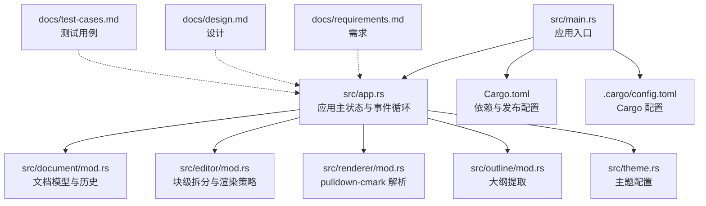
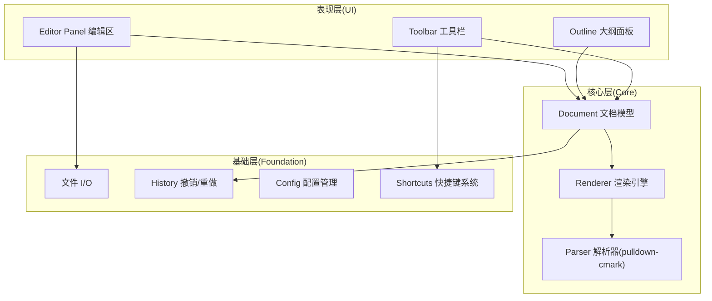
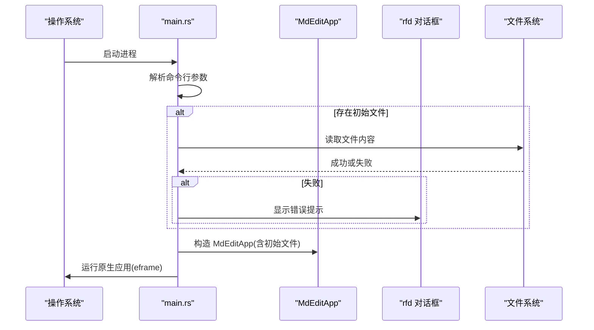
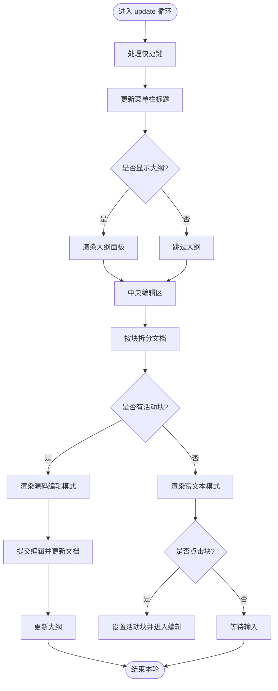
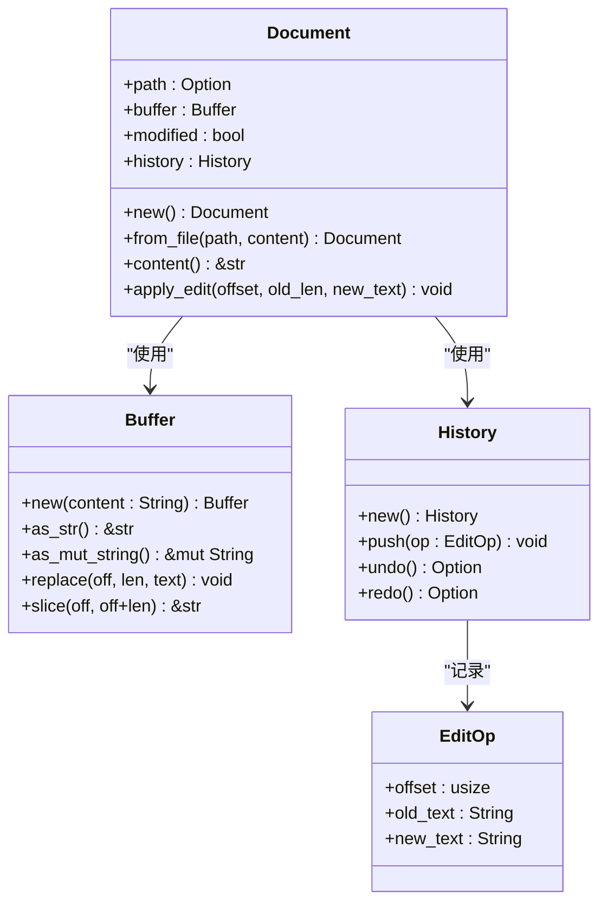
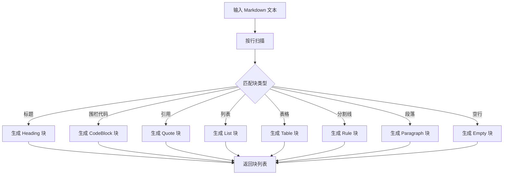
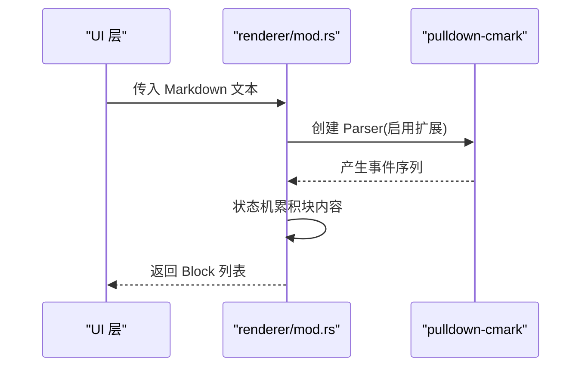
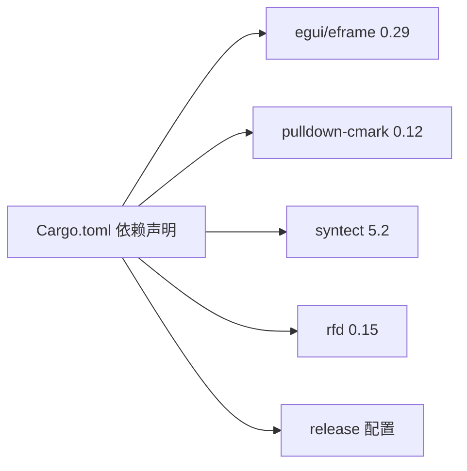

# 开发环境配置

<cite>
**本文引用的文件**
- [Cargo.toml](file://Cargo.toml)
- [README.md](file://README.md)
- [.cargo/config.toml](file://.cargo/config.toml)
- [src/main.rs](file://src/main.rs)
- [src/app.rs](file://src/app.rs)
- [src/theme.rs](file://src/theme.rs)
- [src/document/mod.rs](file://src/document/mod.rs)
- [src/editor/mod.rs](file://src/editor/mod.rs)
- [src/renderer/mod.rs](file://src/renderer/mod.rs)
- [src/outline/mod.rs](file://src/outline/mod.rs)
- [docs/requirements.md](file://docs/requirements.md)
- [docs/design.md](file://docs/design.md)
- [docs/test-cases.md](file://docs/test-cases.md)
</cite>

## 目录
1. [简介](#简介)
2. [项目结构](#项目结构)
3. [核心组件](#核心组件)
4. [架构总览](#架构总览)
5. [详细组件分析](#详细组件分析)
6. [依赖分析](#依赖分析)
7. [性能考虑](#性能考虑)
8. [故障排查指南](#故障排查指南)
9. [结论](#结论)
10. [附录](#附录)

## 简介
本指南面向 mdedit 项目的开发者，提供从系统要求、前置依赖、安装步骤到 IDE 设置、调试配置、代码格式化与静态分析、构建脚本与编译选项、以及跨平台开发注意事项的完整开发环境配置说明。mdedit 是一款基于 Rust 与 egui 的跨平台 Markdown 编辑器，采用所见即所得（WYSIWYG）渲染模式，无需外部浏览器内核。

## 项目结构
仓库采用按功能域组织的模块化结构，入口位于 src/main.rs，核心业务逻辑分布在 app.rs、document/、editor/、renderer/、outline/、theme.rs 等模块；文档位于 docs/ 目录，包含需求、设计与测试用例。

图表来源
- [src/main.rs:1-50](file://src/main.rs#L1-L50)
- [src/app.rs:1-351](file://src/app.rs#L1-L351)
- [src/document/mod.rs:1-51](file://src/document/mod.rs#L1-L51)
- [src/editor/mod.rs:1-349](file://src/editor/mod.rs#L1-L349)
- [src/renderer/mod.rs:1-143](file://src/renderer/mod.rs#L1-L143)
- [src/outline/mod.rs:1-27](file://src/outline/mod.rs#L1-L27)
- [src/theme.rs:1-22](file://src/theme.rs#L1-L22)
- [Cargo.toml:1-19](file://Cargo.toml#L1-L19)
- [.cargo/config.toml:1-2](file://.cargo/config.toml#L1-L2)
- [docs/requirements.md:1-85](file://docs/requirements.md#L1-L85)
- [docs/design.md:1-158](file://docs/design.md#L1-L158)
- [docs/test-cases.md:1-112](file://docs/test-cases.md#L1-L112)

章节来源
- [Cargo.toml:1-19](file://Cargo.toml#L1-L19)
- [README.md:1-48](file://README.md#L1-L48)
- [src/main.rs:1-50](file://src/main.rs#L1-L50)
- [src/app.rs:1-351](file://src/app.rs#L1-L351)
- [docs/design.md:1-158](file://docs/design.md#L1-L158)

## 核心组件
- 应用入口与生命周期：负责初始化 eframe、窗口尺寸与最小尺寸、命令行参数解析与初始文件加载。
- 应用主状态（MdEditApp）：维护文档、大纲、主题、活动块、滚动定位等状态，并处理快捷键与 UI 更新。
- 文档模型（Document）：封装路径、缓冲区、修改状态与历史栈，提供内容变更与历史操作接口。
- 编辑器（editor/mod.rs）：将文档按块拆分，定义块类型与渲染策略，支持标题、段落、代码块、引用、列表、表格、分割线等。
- 渲染器（renderer/mod.rs）：基于 pulldown-cmark 解析 Markdown，生成块级结构，启用表格、任务列表、删除线等扩展。
- 大纲（outline/mod.rs）：从文档内容提取标题层级，用于左侧导航。
- 主题（theme.rs）：定义标题字号、代码块背景、引用条颜色、文本与柔和色等主题属性。

章节来源
- [src/main.rs:1-50](file://src/main.rs#L1-L50)
- [src/app.rs:1-351](file://src/app.rs#L1-L351)
- [src/document/mod.rs:1-51](file://src/document/mod.rs#L1-L51)
- [src/editor/mod.rs:1-349](file://src/editor/mod.rs#L1-L349)
- [src/renderer/mod.rs:1-143](file://src/renderer/mod.rs#L1-L143)
- [src/outline/mod.rs:1-27](file://src/outline/mod.rs#L1-L27)
- [src/theme.rs:1-22](file://src/theme.rs#L1-L22)

## 架构总览
mdedit 采用 eframe/egui 提供的 Immediate Mode GUI，核心架构分为三层：
- 基础层（Foundation）：文件 I/O、撤销/重做栈、配置管理、快捷键系统。
- 核心层（Core）：Document 模型、Renderer 引擎（pulldown-cmark）、Parser（pulldown-cmark）。
- 表现层（UI）：Outline 面板、Editor Panel（WYSIWYG）、Toolbar。

图表来源
- [docs/design.md:1-158](file://docs/design.md#L1-L158)
- [src/app.rs:1-351](file://src/app.rs#L1-L351)
- [src/document/mod.rs:1-51](file://src/document/mod.rs#L1-L51)
- [src/renderer/mod.rs:1-143](file://src/renderer/mod.rs#L1-L143)

## 详细组件分析

### 应用入口与生命周期（src/main.rs）
- 初始化 eframe，设置窗口内尺寸与最小尺寸。
- 从命令行参数解析初始文件路径，尝试读取文件内容并在失败时弹出消息提示。
- 启动原生应用，传入应用构造函数与初始文件。

图表来源
- [src/main.rs:15-33](file://src/main.rs#L15-L33)
- [src/main.rs:35-49](file://src/main.rs#L35-L49)

章节来源
- [src/main.rs:1-50](file://src/main.rs#L1-L50)

### 应用主状态与事件循环（src/app.rs）
- 字体配置：根据目标操作系统选择合适的字体路径，优先使用系统中文字体，确保 CJK 文本正确显示。
- 快捷键处理：支持 Ctrl+N（新建）、Ctrl+O（打开）、Ctrl+S（保存/另存为）、Ctrl+B（加粗）、Ctrl+I（斜体）等。
- 文件操作：新建、打开、保存、另存为，结合 rfd 文件对话框与标准文件 I/O。
- 大纲交互：可切换大纲面板，点击大纲项触发滚动到对应行。
- 编辑流程：将文档按块拆分，光标所在块显示源码可编辑，其他块渲染为富文本；提交编辑时更新文档内容与历史。

图表来源
- [src/app.rs:86-184](file://src/app.rs#L86-L184)
- [src/app.rs:251-351](file://src/app.rs#L251-L351)

章节来源
- [src/app.rs:1-351](file://src/app.rs#L1-L351)

### 文档模型（src/document/mod.rs）
- 结构：包含路径、缓冲区、修改状态与历史栈。
- 方法：创建新文档、从文件创建、获取内容快照、应用编辑并记录历史。

图表来源
- [src/document/mod.rs:9-51](file://src/document/mod.rs#L9-L51)

章节来源
- [src/document/mod.rs:1-51](file://src/document/mod.rs#L1-L51)

### 编辑器与块级渲染（src/editor/mod.rs）
- 文本块拆分：识别标题、围栏代码块、引用块、列表、表格、分割线、段落与空行。
- 渲染策略：按块渲染，光标所在块显示源码，其他块渲染为富文本；行内元素支持粗体、斜体、行内代码等。

图表来源
- [src/editor/mod.rs:24-149](file://src/editor/mod.rs#L24-L149)

章节来源
- [src/editor/mod.rs:1-349](file://src/editor/mod.rs#L1-L349)

### 渲染器与解析（src/renderer/mod.rs）
- 使用 pulldown-cmark 解析 Markdown，启用表格、任务列表、删除线等扩展。
- 将解析结果转换为内部 Block 结构，便于 UI 渲染。

图表来源
- [src/renderer/mod.rs:19-142](file://src/renderer/mod.rs#L19-L142)

章节来源
- [src/renderer/mod.rs:1-143](file://src/renderer/mod.rs#L1-L143)

### 大纲提取（src/outline/mod.rs）
- 从文档内容提取 H1-H6 标题，生成大纲项（层级、标题、行号）。

图表来源
- [src/outline/mod.rs:7-26](file://src/outline/mod.rs#L7-L26)

章节来源
- [src/outline/mod.rs:1-27](file://src/outline/mod.rs#L1-L27)

### 主题配置（src/theme.rs）
- 定义标题字号数组、代码块背景色、引用条颜色、文本与柔和色等主题属性，默认值适配常见显示效果。

章节来源
- [src/theme.rs:1-22](file://src/theme.rs#L1-L22)

## 依赖分析
- 语言与工具链：Rust 1.70+，Cargo。
- 平台与工具链：Windows (GNU) 需要 MSYS2 MinGW64 工具链。
- 运行时与 GUI：eframe 与 egui 0.29；渲染与解析：pulldown-cmark 0.12；语法高亮：syntect 5.2；文件对话框：rfd 0.15。
- 发布优化：release 配置开启 opt-level="z"、LTO、符号裁剪。

图表来源
- [Cargo.toml:8-19](file://Cargo.toml#L8-L19)

章节来源
- [Cargo.toml:1-19](file://Cargo.toml#L1-L19)
- [README.md:15-27](file://README.md#L15-L27)

## 性能考虑
- 冷启动与体积：通过 release 配置优化（压缩体积、LTO、符号裁剪），目标单文件小于 4MB（参考 README）。
- 渲染粒度：按块渲染，减少每帧计算量；光标移动仅重绘相关块。
- 文本存储：MVP 使用 String，适合中小文档；后续可替换为 rope 以支持超大文档。
- 输入延迟与滚动：目标按键响应延迟 < 16ms，滚动保持 60fps。

章节来源
- [Cargo.toml:15-19](file://Cargo.toml#L15-L19)
- [docs/requirements.md:55-66](file://docs/requirements.md#L55-L66)
- [docs/design.md:128-147](file://docs/design.md#L128-L147)

## 故障排查指南
- Windows (MSYS2/MinGW64) 环境变量：若编译失败，请确认已将 MinGW64 bin 与 lib 路径加入 PATH 与 LIBRARY_PATH。
- 字体加载失败：应用会根据操作系统选择字体路径，若字体缺失，界面可能显示默认字体；可在配置中调整字体路径或确保系统字体存在。
- 文件打开异常：当初始文件读取失败时，会弹出错误提示对话框；检查文件权限与路径。
- 依赖版本冲突：确保 Rust 工具链版本满足 1.70+，并使用 Cargo 默认注册表。

章节来源
- [README.md:17-27](file://README.md#L17-L27)
- [src/app.rs:45-84](file://src/app.rs#L45-L84)
- [src/main.rs:22-32](file://src/main.rs#L22-L32)

## 结论
本指南提供了 mdedit 项目的系统要求、安装步骤、IDE 设置、调试配置、代码格式化与静态分析、构建脚本与编译选项，以及跨平台开发的注意事项。按照此配置，开发者可在 Windows、macOS、Linux 上顺利搭建开发环境并进行高效迭代。

## 附录

### 系统要求与前置依赖
- Rust 工具链：1.70+。
- 操作系统：Windows、macOS、Linux。
- Windows (GNU)：需要 MSYS2 MinGW64 工具链，确保 PATH 与 LIBRARY_PATH 指向 MinGW64。

章节来源
- [README.md:17-18](file://README.md#L17-L18)

### 安装步骤与配置
- 安装 Rust（建议使用 rustup）。
- Windows：安装 MSYS2 并配置 PATH 与 LIBRARY_PATH。
- 克隆仓库后，使用 Cargo 构建与运行。

章节来源
- [README.md:20-35](file://README.md#L20-L35)

### IDE 推荐设置
- VS Code
  - 插件：rust-analyzer、Even Better TOML、C/C++（用于 MinGW 头文件）。
  - 设置：启用 rust-analyzer 的 On-Type Formatting 与 On-Save Formatting；为 Cargo.toml 启用 TOML 语法高亮。
- IntelliJ IDEA / RustRover
  - 插件：Rust（官方）。
  - 设置：启用 On-Save Action（格式化与检查）；配置 Cargo 工作空间根目录。

（本节为通用 IDE 配置建议，不直接分析具体文件）

### 调试配置与断点设置
- 在 src/main.rs 的 main 函数处设置断点，验证 eframe 初始化与窗口创建。
- 在 src/app.rs 的 update 循环中设置断点，观察快捷键处理与 UI 更新。
- 在 src/document/mod.rs 的 apply_edit 处设置断点，验证历史栈与修改状态。
- 在 src/editor/mod.rs 的块拆分与渲染函数中设置断点，验证渲染策略。

章节来源
- [src/main.rs:35-49](file://src/main.rs#L35-L49)
- [src/app.rs:187-249](file://src/app.rs#L187-L249)
- [src/document/mod.rs:39-49](file://src/document/mod.rs#L39-L49)
- [src/editor/mod.rs:24-149](file://src/editor/mod.rs#L24-L149)

### 代码格式化与静态分析
- 格式化：使用 rustfmt（通过 rustup 安装），在项目根目录执行格式化命令。
- 静态分析：使用 clippy（通过 rustup 安装），在项目根目录执行静态分析命令。
- 集成：在 VS Code 中配置 rust-analyzer 的 On-Save Action 调用 rustfmt；在 CI 中集成 clippy。

（本节为通用工具使用建议，不直接分析具体文件）

### 构建脚本与编译选项
- 构建：cargo build；发布构建：cargo build --release。
- 运行：cargo run；或直接运行 target/release/mdedit。
- 发布优化：opt-level="z"、LTO=true、strip=true，减小体积并提升运行时性能。

章节来源
- [README.md:20-35](file://README.md#L20-L35)
- [Cargo.toml:15-19](file://Cargo.toml#L15-L19)

### 跨平台开发特殊配置
- 字体：应用根据操作系统选择字体路径，确保 CJK 文本正确显示。
- 文件对话框：使用 rfd 提供原生系统对话框，避免平台差异。
- GUI：eframe/egui 提供跨平台即时模式 GUI，注意平台特定行为差异。

章节来源
- [src/app.rs:45-84](file://src/app.rs#L45-L84)
- [src/app.rs:121-131](file://src/app.rs#L121-L131)
- [src/app.rs:133-163](file://src/app.rs#L133-L163)