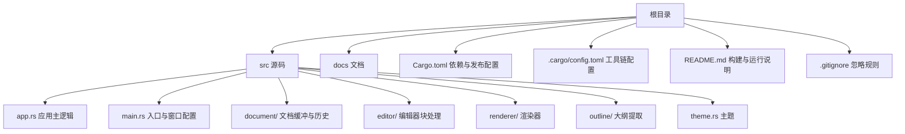
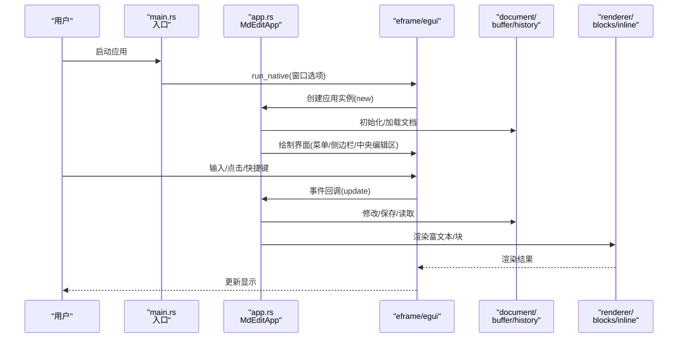
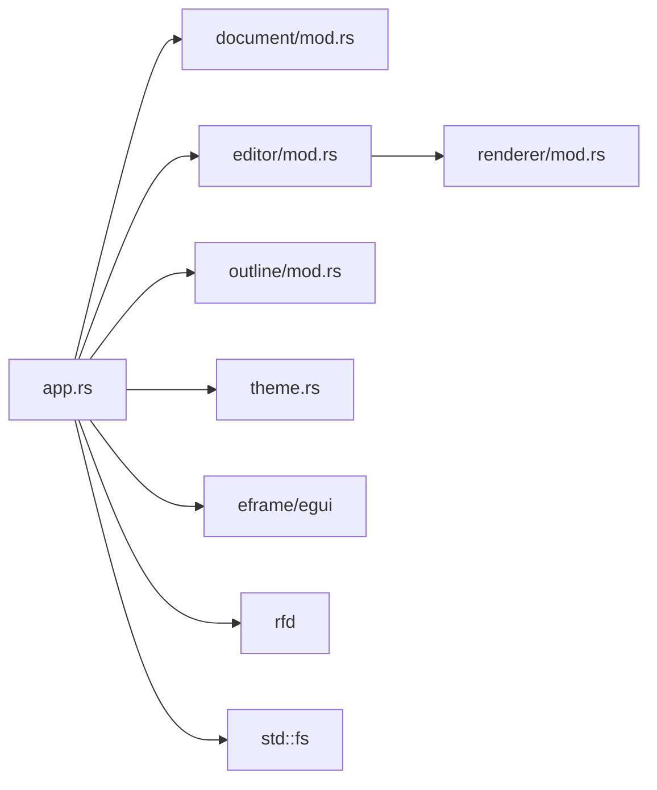

# 构建与部署

<cite>
**本文引用的文件**
- [Cargo.toml](file://Cargo.toml)
- [.cargo/config.toml](file://.cargo/config.toml)
- [README.md](file://README.md)
- [.gitignore](file://.gitignore)
- [src/main.rs](file://src/main.rs)
- [src/app.rs](file://src/app.rs)
- [src/document/mod.rs](file://src/document/mod.rs)
- [src/editor/mod.rs](file://src/editor/mod.rs)
- [src/renderer/mod.rs](file://src/renderer/mod.rs)
- [src/outline/mod.rs](file://src/outline/mod.rs)
- [src/theme.rs](file://src/theme.rs)
</cite>

## 目录
1. [简介](#简介)
2. [项目结构](#项目结构)
3. [核心组件](#核心组件)
4. [架构总览](#架构总览)
5. [详细组件分析](#详细组件分析)
6. [依赖关系分析](#依赖关系分析)
7. [性能考虑](#性能考虑)
8. [故障排查指南](#故障排查指南)
9. [结论](#结论)
10. [附录](#附录)

## 简介
本指南面向维护者与贡献者，提供 mdedit 项目的构建与部署全栈操作说明。内容覆盖：
- 使用 Cargo 工具链的构建系统与编译流程
- 跨平台构建（Windows、macOS、Linux）的环境准备与注意事项
- 单文件可执行程序的生成与安装包制作思路
- 持续集成与持续部署（CI/CD）配置建议
- 发布流程与版本管理策略
- 性能优化的构建选项与发布配置

## 项目结构
mdedit 是基于 Rust 的桌面应用，采用 eframe（基于 egui）实现跨平台 GUI。核心目录与文件如下：
- 根配置：Cargo.toml（包元数据、依赖、发布配置）
- 构建工具链配置：.cargo/config.toml（空配置，便于扩展）
- 源码：src/ 下按功能模块组织（app、document、editor、renderer、outline、theme）
- 文档与示例：docs/（设计、需求、测试用例等）
- 平台构建说明：README.md（含 Windows MinGW 环境示例）

图表来源
- [Cargo.toml](file://Cargo.toml)
- [.cargo/config.toml](file://.cargo/config.toml)
- [README.md](file://README.md)
- [.gitignore](file://.gitignore)
- [src/main.rs](file://src/main.rs)
- [src/app.rs](file://src/app.rs)

章节来源
- [Cargo.toml](file://Cargo.toml)
- [README.md](file://README.md)
- [.gitignore](file://.gitignore)

## 核心组件
- 包与依赖
  - 包名、版本、描述、许可证、Rust edition 均在根配置中定义
  - 关键依赖：egui、eframe（GUI）、pulldown-cmark（解析）、syntect（语法高亮）、rfd（系统对话框）
- 发布配置
  - release profile 启用代码压缩、链接时优化与符号剥离，有助于减小二进制体积
- 构建入口
  - main.rs 中通过 eframe::run_native 启动原生窗口，并支持命令行传入初始文件路径
- 应用逻辑
  - app.rs 实现编辑器主界面、快捷键、文件操作、字体配置与渲染管线

章节来源
- [Cargo.toml](file://Cargo.toml)
- [src/main.rs](file://src/main.rs)
- [src/app.rs](file://src/app.rs)

## 架构总览
下图展示从用户到应用、再到渲染与文件系统的调用链路。

图表来源
- [src/main.rs](file://src/main.rs)
- [src/app.rs](file://src/app.rs)
- [src/document/mod.rs](file://src/document/mod.rs)
- [src/renderer/mod.rs](file://src/renderer/mod.rs)

## 详细组件分析

### 构建系统与编译流程
- 工具链与命令
  - 使用 Cargo 构建与运行；README 提供 Windows（MinGW）示例
  - 常用命令：cargo build（默认 debug）、cargo run（本地运行）、cargo build --release（发布构建）
- 发布配置要点
  - opt-level = "z"：追求更小体积
  - lto = true：链接时优化
  - strip = true：剥离符号，减小体积
- 交叉编译与目标
  - 可通过设置 RUST_TARGET 或使用 cargo-xwin/cargo-ndk 等工具进行交叉编译（需额外工具链）
  - 注意平台特定字体路径与系统依赖差异

章节来源
- [README.md](file://README.md)
- [Cargo.toml](file://Cargo.toml)

### 跨平台构建步骤
- Windows（MSYS2/MinGW）
  - 安装 Rust（稳定版），准备 MSYS2 MinGW64 环境
  - 在构建前设置 PATH 与 LIBRARY_PATH，随后执行发布构建
- macOS
  - 安装 Rust（稳定版），确保 Xcode 命令行工具可用
  - 直接使用 cargo build --release
- Linux
  - 安装 Rust（稳定版），确保 GTK/系统头文件可用（如需要）
  - 直接使用 cargo build --release

章节来源
- [README.md](file://README.md)

### 单文件可执行程序与安装包
- 单文件可执行程序
  - 使用 Cargo release profile 默认输出单个二进制文件
  - 若需进一步减小体积，可在本地启用额外优化（例如 lto = "fat"、codegen-units = 1、panic = "abort"），但会增加编译时间
- 安装包制作
  - Windows：可使用 nsis/inno setup 制作安装包，或打包为便携式 zip
  - macOS：可制作 DMG 或 Homebrew Formula
  - Linux：可打包为 AppImage、deb、rpm 或便携式 tar.gz

章节来源
- [README.md](file://README.md)
- [Cargo.toml](file://Cargo.toml)

### 持续集成与持续部署（CI/CD）
- 推荐流水线阶段
  - 触发条件：push 到 main 分支或打标签
  - 步骤：
    1) 安装 Rust 工具链（稳定版）
    2) 依赖缓存（Cargo registry、git 仓库缓存）
    3) 运行 cargo test（可选：并行化测试）
    4) 多平台构建：Windows（MinGW）、macOS、Linux
    5) 产物归档：二进制与安装包
    6) 发布：GitHub Releases（上传二进制与安装包）
- 平台示例
  - GitHub Actions：使用 actions-rs/toolchain 与 actions-rs/cargo 组合
  - GitLab CI：使用 rust 官方镜像，配置多 job 并行构建
- 安全与缓存
  - 使用 cargo cache 或自建缓存以加速构建
  - 对发布产物进行签名与校验（可选）

章节来源
- [README.md](file://README.md)
- [Cargo.toml](file://Cargo.toml)

### 发布流程与版本管理
- 版本策略
  - 语义化版本：主版本号.次版本号.修订号
  - 发布前：更新版本号、变更日志、必要时更新依赖
- 发布步骤
  1) 准备：确认各平台构建产物齐全
  2) 校验：检查体积、功能、兼容性
  3) 打标签：git tag v<版本号>
  4) 推送：git push origin v<版本号>
  5) 发布：在发布平台创建 Release，附带说明与附件
- 自动化
  - 结合 CI/CD 自动打标签与发布

章节来源
- [Cargo.toml](file://Cargo.toml)
- [README.md](file://README.md)

### 性能优化的构建选项与发布配置
- 发布配置（已在 Cargo.toml 中）
  - opt-level = "z"：压缩体积优先
  - lto = true：链接时优化
  - strip = true：剥离符号
- 可选增强（本地调试时使用）
  - lto = "fat"：更大体积换取更优性能
  - codegen-units = 1：减少重用，提升优化程度
  - panic = "abort"：减小二进制大小
- 运行时优化
  - 字体加载：根据平台选择系统字体路径，避免动态加载大字体文件
  - 渲染：尽量复用渲染缓存，避免频繁重建

章节来源
- [Cargo.toml](file://Cargo.toml)
- [src/app.rs](file://src/app.rs)

## 依赖关系分析
- 依赖层次
  - 应用层：app.rs 依赖 document、editor、outline、theme
  - 渲染层：renderer 调用 editor 的块与内联渲染
  - GUI 层：eframe/egui 提供窗口与事件循环
  - 文件系统：rfd 提供系统对话框，std::fs 读写文件
- 关键耦合点
  - app.rs 与 document 的交互决定修改状态与保存行为
  - 渲染器与编辑器的边界清晰，利于独立优化

图表来源
- [src/app.rs](file://src/app.rs)
- [src/document/mod.rs](file://src/document/mod.rs)
- [src/editor/mod.rs](file://src/editor/mod.rs)
- [src/renderer/mod.rs](file://src/renderer/mod.rs)
- [src/outline/mod.rs](file://src/outline/mod.rs)
- [src/theme.rs](file://src/theme.rs)

章节来源
- [src/app.rs](file://src/app.rs)

## 性能考虑
- 构建期
  - 启用 LTO 与符号剥离以减小体积
  - 控制代码生成单元数量与 panic 模式以平衡体积与性能
- 运行期
  - 字体加载：按平台预设字体路径，避免重复 IO
  - 渲染：对富文本块进行增量更新，减少重绘
  - 事件处理：集中处理快捷键，避免多余 UI 刷新

章节来源
- [Cargo.toml](file://Cargo.toml)
- [src/app.rs](file://src/app.rs)

## 故障排查指南
- 构建失败（Windows MinGW）
  - 症状：找不到链接器或库
  - 处理：确保已设置 PATH 与 LIBRARY_PATH，且 MSYS2 MinGW64 工具链可用
- 字体加载失败
  - 症状：界面无中文显示或字体异常
  - 处理：确认平台字体路径存在，或回退到系统默认字体
- 运行时崩溃或卡顿
  - 症状：启动缓慢或编辑时卡顿
  - 处理：检查渲染逻辑是否过度刷新，优化事件处理与重绘范围
- 依赖冲突
  - 症状：构建报错或运行期异常
  - 处理：清理 Cargo 缓存后重新构建，必要时锁定依赖版本

章节来源
- [README.md](file://README.md)
- [src/app.rs](file://src/app.rs)

## 结论
mdedit 的构建与部署以 Cargo 为核心，结合 eframe/egui 实现跨平台 GUI。通过合理的发布配置与 CI/CD 流水线，可高效产出多平台可执行程序与安装包。建议在保持体积优化的同时，完善自动化测试与发布流程，确保质量与交付效率。

## 附录
- 常用命令速查
  - cargo build（debug）
  - cargo run（本地运行）
  - cargo build --release（发布构建）
- 产物位置
  - target/debug 与 target/release 下生成二进制文件
- 忽略规则
  - .gitignore 已忽略 target、调试符号与 IDE 生成文件

章节来源
- [.gitignore](file://.gitignore)
- [README.md](file://README.md)