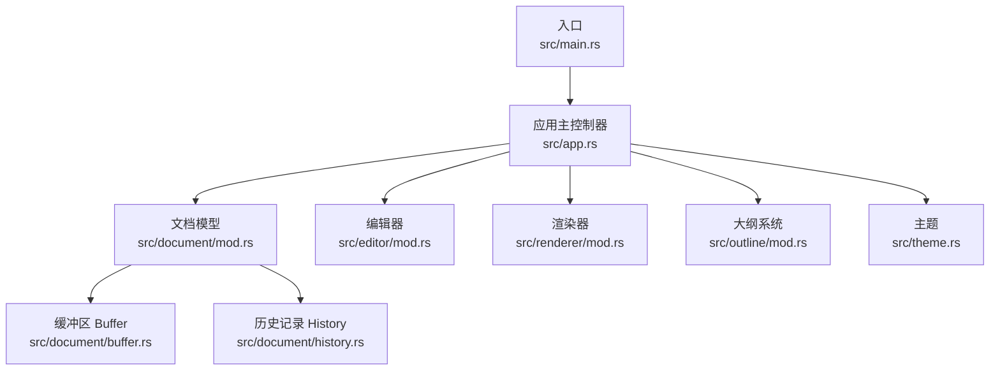
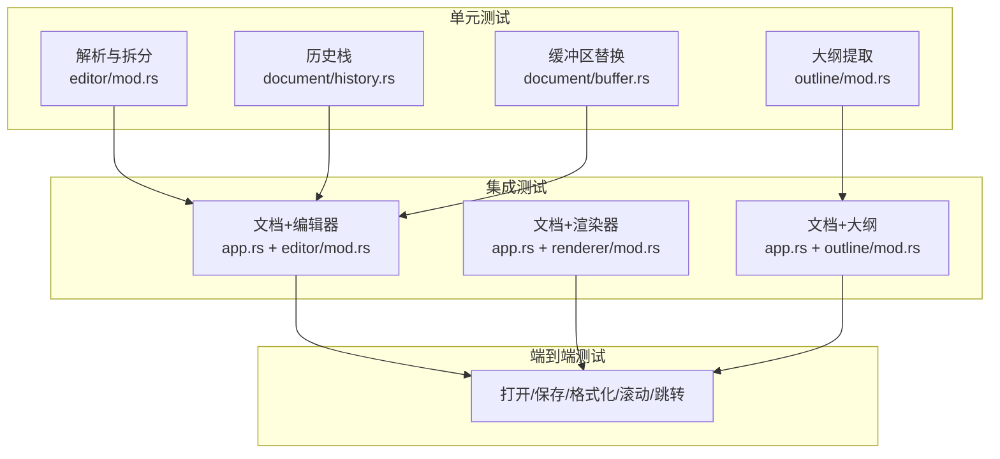
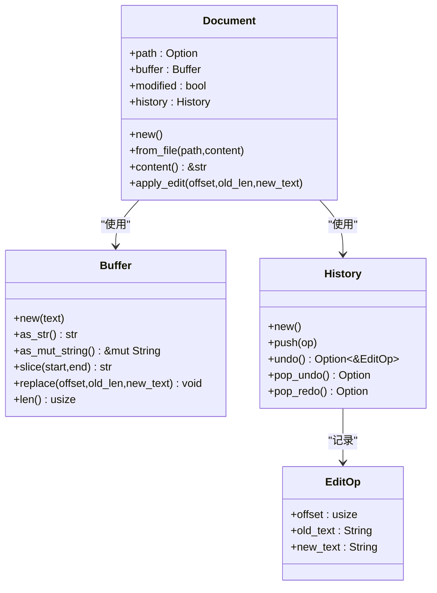
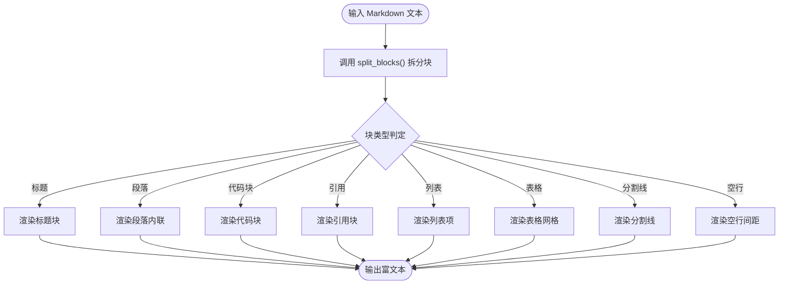
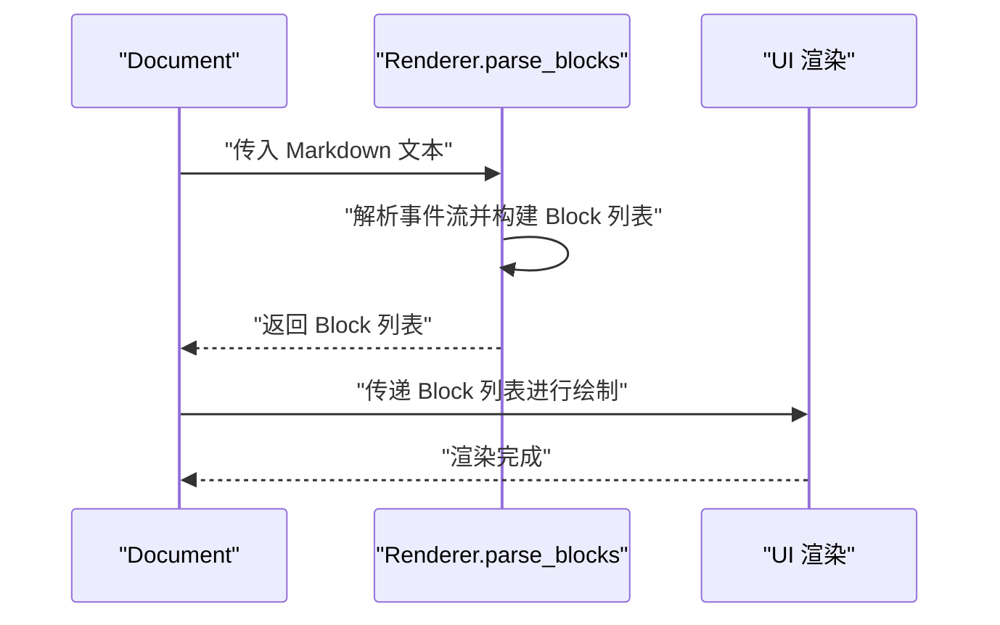
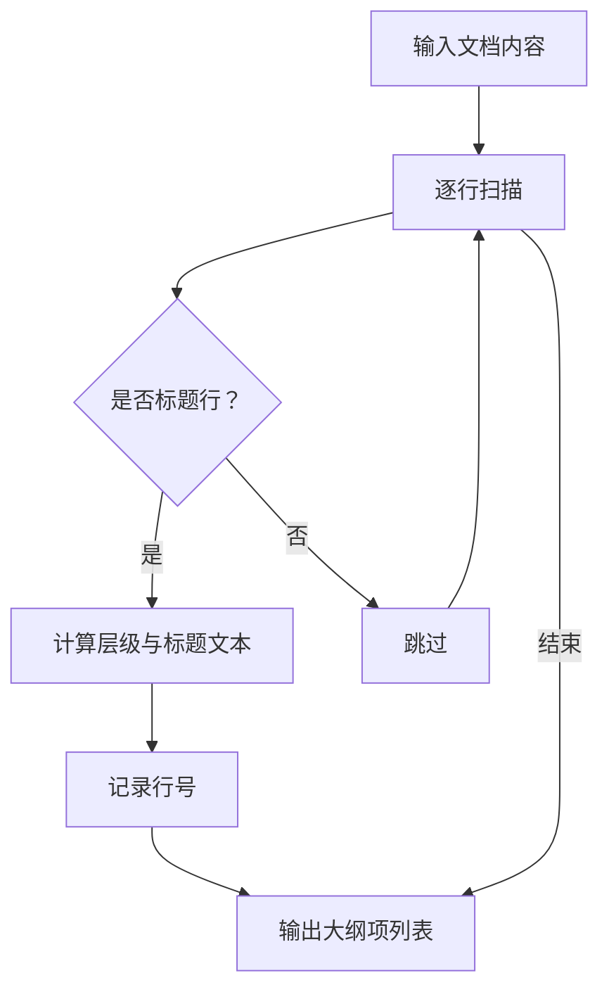
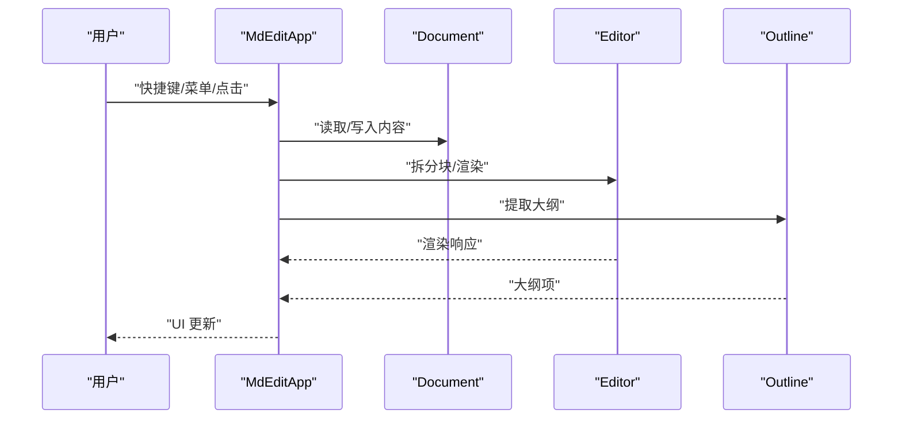
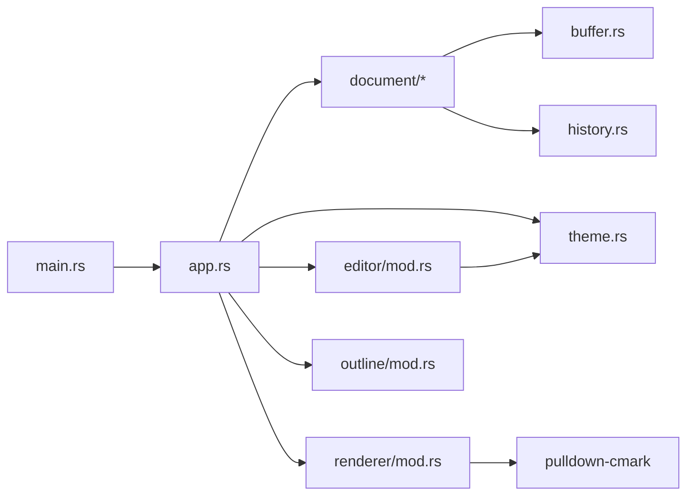

# 测试策略与实践

<cite>
**本文引用的文件**
- [Cargo.toml](file://Cargo.toml)
- [README.md](file://README.md)
- [src/main.rs](file://src/main.rs)
- [src/app.rs](file://src/app.rs)
- [src/document/mod.rs](file://src/document/mod.rs)
- [src/document/buffer.rs](file://src/document/buffer.rs)
- [src/document/history.rs](file://src/document/history.rs)
- [src/editor/mod.rs](file://src/editor/mod.rs)
- [src/outline/mod.rs](file://src/outline/mod.rs)
- [src/renderer/mod.rs](file://src/renderer/mod.rs)
- [src/theme.rs](file://src/theme.rs)
- [docs/test-cases.md](file://docs/test-cases.md)
</cite>

## 目录
1. [引言](#引言)
2. [项目结构](#项目结构)
3. [核心组件](#核心组件)
4. [架构总览](#架构总览)
5. [详细组件分析](#详细组件分析)
6. [依赖分析](#依赖分析)
7. [性能考虑](#性能考虑)
8. [故障排查指南](#故障排查指南)
9. [结论](#结论)
10. [附录](#附录)

## 引言
本指南面向 mdedit 项目，提供一套完整的测试策略与实践，覆盖测试金字塔（单元测试、集成测试、端到端测试），并针对文档管理、编辑器、渲染器、大纲系统等核心模块给出可落地的测试设计与编写方法。同时包含性能测试、基准测试、覆盖率要求与持续集成中的测试自动化配置建议，以及新贡献者的测试编写指导与常见问题解答。

## 项目结构
mdedit 是基于 eframe/egui 的桌面应用，采用模块化组织：
- 应用入口与生命周期：main.rs、app.rs
- 文档模型：document/mod.rs、buffer.rs、history.rs
- 编辑器与渲染：editor/mod.rs、renderer/mod.rs
- 大纲系统：outline/mod.rs
- 主题：theme.rs
- 文档与测试用例：docs/test-cases.md

图表来源
- [src/main.rs:1-50](file://src/main.rs#L1-L50)
- [src/app.rs:1-351](file://src/app.rs#L1-L351)
- [src/document/mod.rs:1-51](file://src/document/mod.rs#L1-L51)
- [src/editor/mod.rs:1-349](file://src/editor/mod.rs#L1-L349)
- [src/renderer/mod.rs:1-143](file://src/renderer/mod.rs#L1-L143)
- [src/outline/mod.rs:1-27](file://src/outline/mod.rs#L1-L27)
- [src/theme.rs:1-22](file://src/theme.rs#L1-L22)

章节来源
- [src/main.rs:1-50](file://src/main.rs#L1-L50)
- [src/app.rs:1-351](file://src/app.rs#L1-L351)
- [src/document/mod.rs:1-51](file://src/document/mod.rs#L1-L51)
- [src/editor/mod.rs:1-349](file://src/editor/mod.rs#L1-L349)
- [src/renderer/mod.rs:1-143](file://src/renderer/mod.rs#L1-L143)
- [src/outline/mod.rs:1-27](file://src/outline/mod.rs#L1-L27)
- [src/theme.rs:1-22](file://src/theme.rs#L1-L22)

## 核心组件
- 文档模型（Document/Buffer/History）
  - 负责内容存储、修改跟踪与撤销/重做
  - 关键接口：new/from_file/content/apply_edit、Buffer 替换与切片、History 压栈与撤销
- 编辑器（editor/mod.rs）
  - 将 Markdown 文本拆分为块（split_blocks），并渲染富文本块（render_rich_block）
  - 支持标题、段落、代码块、引用、列表、表格、分割线等
- 渲染器（renderer/mod.rs）
  - 使用 pulldown-cmark 解析 Markdown 为结构化块（parse_blocks）
  - 提供块级渲染接口（blocks.rs）
- 大纲系统（outline/mod.rs）
  - 从文档内容提取标题层级与行号（extract_outline）
- 应用主控制器（app.rs）
  - 组合上述组件，处理快捷键、菜单、UI 渲染、滚动定位、保存/打开等
- 主题（theme.rs）
  - 定义标题字号、颜色等主题参数

章节来源
- [src/document/mod.rs:1-51](file://src/document/mod.rs#L1-L51)
- [src/document/buffer.rs:1-30](file://src/document/buffer.rs#L1-L30)
- [src/document/history.rs:1-59](file://src/document/history.rs#L1-L59)
- [src/editor/mod.rs:1-349](file://src/editor/mod.rs#L1-L349)
- [src/renderer/mod.rs:1-143](file://src/renderer/mod.rs#L1-L143)
- [src/outline/mod.rs:1-27](file://src/outline/mod.rs#L1-L27)
- [src/theme.rs:1-22](file://src/theme.rs#L1-L22)
- [src/app.rs:1-351](file://src/app.rs#L1-L351)

## 架构总览
mdedit 的测试策略遵循金字塔结构：
- 单元测试：针对纯函数与小模块（如解析、拆分、提取大纲、历史栈）
- 集成测试：组合模块（文档+编辑器+渲染器+大纲），验证交互流程
- 端到端测试：模拟用户操作（打开/保存/格式化/滚动/跳转），验证整体行为

图表来源
- [src/editor/mod.rs:1-349](file://src/editor/mod.rs#L1-L349)
- [src/outline/mod.rs:1-27](file://src/outline/mod.rs#L1-L27)
- [src/document/history.rs:1-59](file://src/document/history.rs#L1-L59)
- [src/document/buffer.rs:1-30](file://src/document/buffer.rs#L1-L30)
- [src/app.rs:1-351](file://src/app.rs#L1-L351)

## 详细组件分析

### 文档管理（Document/Buffer/History）
- 设计要点
  - Buffer 提供原地替换与切片，支持高效编辑
  - History 记录 EditOp，支持撤销/重做
  - Document 聚合 Buffer 与 History，并维护 modified 状态
- 测试策略
  - 单元：Buffer 替换/切片边界、History 撤销/重做正确性、Document.apply_edit 的一致性
  - 集成：Document 与 Editor 的交互（commit_edit 时的替换与大纲更新）
  - 端到端：保存/打开流程对 Buffer 与 History 的影响

图表来源
- [src/document/buffer.rs:1-30](file://src/document/buffer.rs#L1-L30)
- [src/document/history.rs:1-59](file://src/document/history.rs#L1-L59)
- [src/document/mod.rs:1-51](file://src/document/mod.rs#L1-L51)

章节来源
- [src/document/mod.rs:1-51](file://src/document/mod.rs#L1-L51)
- [src/document/buffer.rs:1-30](file://src/document/buffer.rs#L1-L30)
- [src/document/history.rs:1-59](file://src/document/history.rs#L1-L59)

### 编辑器（editor/mod.rs）
- 设计要点
  - split_blocks 将文本按块类型分类，支持标题、代码块、引用、列表、表格、规则、空行
  - render_rich_block 根据块类型与主题渲染
- 测试策略
  - 单元：split_blocks 对各种 Markdown 片段的识别与边界；render_rich_block 的渲染结果断言
  - 集成：Editor 与 Document 的协作（active_block 切换、commit_edit 更新 Buffer）
  - 端到端：快捷键格式化（加粗/斜体）、点击进入源码模式、大纲跳转滚动

图表来源
- [src/editor/mod.rs:24-149](file://src/editor/mod.rs#L24-L149)
- [src/editor/mod.rs:159-266](file://src/editor/mod.rs#L159-L266)

章节来源
- [src/editor/mod.rs:1-349](file://src/editor/mod.rs#L1-L349)

### 渲染器（renderer/mod.rs）
- 设计要点
  - 使用 pulldown-cmark 解析 Markdown，产出结构化 Block 列表
  - blocks.rs 提供块级渲染接口
- 测试策略
  - 单元：parse_blocks 对复杂 Markdown 的解析正确性
  - 集成：Renderer 与 Editor 的配合（渲染一致性）
  - 端到端：渲染器与 UI 的一致性校验

图表来源
- [src/renderer/mod.rs:19-142](file://src/renderer/mod.rs#L19-L142)

章节来源
- [src/renderer/mod.rs:1-143](file://src/renderer/mod.rs#L1-L143)

### 大纲系统（outline/mod.rs）
- 设计要点
  - 从文档内容提取标题层级、标题文本与行号
- 测试策略
  - 单元：extract_outline 对不同层级标题的识别与过滤
  - 集成：App 在编辑时触发大纲更新
  - 端到端：点击大纲项触发滚动定位

图表来源
- [src/outline/mod.rs:7-26](file://src/outline/mod.rs#L7-L26)

章节来源
- [src/outline/mod.rs:1-27](file://src/outline/mod.rs#L1-L27)

### 应用主控制器（app.rs）
- 设计要点
  - 处理快捷键、菜单、侧边栏大纲、中央编辑区域
  - 与 Document/Editor/Outline/Theme 协作
- 测试策略
  - 单元：快捷键逻辑、标题栏更新、字体配置
  - 集成：打开/保存/新建/格式化按钮的行为
  - 端到端：完整工作流（打开文件→编辑→保存→另存为→大纲跳转）

图表来源
- [src/app.rs:90-184](file://src/app.rs#L90-L184)
- [src/app.rs:251-350](file://src/app.rs#L251-L350)

章节来源
- [src/app.rs:1-351](file://src/app.rs#L1-L351)

## 依赖分析
- 外部依赖
  - eframe/egui：UI 框架与渲染
  - pulldown-cmark：Markdown 解析
  - syntect：语法高亮（用于渲染器的扩展能力预留）
  - rfd：文件对话框
- 内部模块耦合
  - app.rs 依赖 document/editor/outline/theme
  - document/history 与 editor/buffer 存在协作关系
  - renderer 与 editor 可并行演进，但需保证渲染一致性

图表来源
- [src/main.rs:1-50](file://src/main.rs#L1-L50)
- [src/app.rs:1-351](file://src/app.rs#L1-L351)
- [src/document/mod.rs:1-51](file://src/document/mod.rs#L1-L51)
- [src/editor/mod.rs:1-349](file://src/editor/mod.rs#L1-L349)
- [src/renderer/mod.rs:1-143](file://src/renderer/mod.rs#L1-L143)
- [src/outline/mod.rs:1-27](file://src/outline/mod.rs#L1-L27)
- [src/theme.rs:1-22](file://src/theme.rs#L1-L22)
- [Cargo.toml:8-13](file://Cargo.toml#L8-L13)

章节来源
- [Cargo.toml:1-19](file://Cargo.toml#L1-L19)

## 性能考虑
- 启动性能
  - 冷启动时间目标：< 200ms
  - 优化方向：最小化初始化工作、延迟加载非必要资源
- 大文档渲染
  - 目标：5MB 文档滚动流畅（≥ 60fps）、输入延迟 < 16ms
  - 优化方向：增量渲染、虚拟滚动、避免全量重排
- 覆盖率与基准
  - 建议：核心算法（split_blocks、parse_blocks、extract_outline）达到高覆盖率
  - 基准：使用 cargo bench（若引入 benches）或外部工具测量关键路径

章节来源
- [docs/test-cases.md:97-112](file://docs/test-cases.md#L97-L112)

## 故障排查指南
- 常见问题
  - 打开文件失败：检查路径与权限，确认错误提示弹窗逻辑
  - 保存失败：确认写入权限与路径选择
  - 大文件加载缓慢：检查渲染与滚动实现，避免一次性解析全部内容
  - 撤销/重做异常：核对 History 的 push/undo/pop 逻辑
- 排查步骤
  - 单元测试隔离定位问题模块
  - 集成测试复现交互场景
  - 端到端测试验证用户路径

章节来源
- [src/app.rs:121-163](file://src/app.rs#L121-L163)
- [src/document/history.rs:20-57](file://src/document/history.rs#L20-L57)

## 结论
通过分层测试策略与明确的测试用例设计，mdedit 可在功能正确性、交互稳定性与性能表现上获得可靠保障。建议优先完善单元测试覆盖核心算法，再逐步扩展集成与端到端测试，结合性能基准与覆盖率监控，形成可持续的质量闭环。

## 附录

### 测试金字塔设计原则
- 单元测试
  - 面向纯函数与小模块，快速反馈，便于重构
  - 示例：split_blocks、parse_blocks、extract_outline、History 操作
- 集成测试
  - 关注模块间协作与契约一致性
  - 示例：Document 与 Editor 的 commit/edit 流程、App 与 Outline 的更新
- 端到端测试
  - 模拟真实用户路径，验证整体可用性
  - 示例：打开/保存/格式化/滚动/跳转

章节来源
- [docs/test-cases.md:1-112](file://docs/test-cases.md#L1-L112)

### 测试用例编写方法与最佳实践
- 前置条件与期望明确：参考现有测试用例文档
- 数据驱动：构造多种 Markdown 片段（含边界与异常）
- 模拟对象：对外部依赖（文件系统、对话框）进行抽象或替换
- 断言粒度：区分行为断言（UI 行为）与状态断言（内部状态）

章节来源
- [docs/test-cases.md:1-112](file://docs/test-cases.md#L1-L112)

### 核心功能测试要点
- 文档管理
  - Buffer 替换/切片边界、History 撤销/重做、Document.apply_edit 的原子性
- 编辑器
  - 各类块类型的拆分与渲染、内联样式（粗体/斜体/代码）
- 渲染器
  - pulldown-cmark 的事件流解析、块级渲染一致性
- 大纲系统
  - 标题层级识别、行号映射、点击跳转滚动

章节来源
- [src/editor/mod.rs:24-149](file://src/editor/mod.rs#L24-L149)
- [src/editor/mod.rs:159-266](file://src/editor/mod.rs#L159-L266)
- [src/renderer/mod.rs:19-142](file://src/renderer/mod.rs#L19-L142)
- [src/outline/mod.rs:7-26](file://src/outline/mod.rs#L7-L26)

### 测试数据准备与模拟对象
- 测试数据
  - 构造典型 Markdown 片段（标题、列表、表格、代码块、引用、分割线）
  - 构造大文档样本（≥ 5MB）用于性能测试
- 模拟对象
  - 文件系统：使用内存文件或临时文件
  - 对话框：注入 mock 实现，避免阻塞与平台差异

章节来源
- [docs/test-cases.md:25-28](file://docs/test-cases.md#L25-L28)

### 性能测试与基准测试
- 方法
  - 启动时间：记录从进程启动到窗口首次显示的时间
  - 滚动流畅度：测量帧率，确保 ≥ 60fps
  - 输入延迟：按键到字符显示的时间
- 工具
  - 使用外部性能分析工具或在测试中埋点统计

章节来源
- [docs/test-cases.md:97-112](file://docs/test-cases.md#L97-L112)

### 测试覆盖率与监控
- 覆盖率目标
  - 核心算法（解析/拆分/提取）> 80%
  - 关键业务路径（打开/保存/撤销/重做）> 90%
- 监控
  - CI 中报告覆盖率，设置阈值门禁

章节来源
- [docs/test-cases.md:1-112](file://docs/test-cases.md#L1-L112)

### 持续集成中的测试自动化
- 建议流水线步骤
  - 安装依赖（Rust、平台工具链）
  - 运行单元测试与覆盖率收集
  - 运行集成测试与端到端测试（无头模式）
  - 上传覆盖率报告
- 平台适配
  - Windows/macOS/Linux 分别执行 UI 相关测试

章节来源
- [README.md:13-35](file://README.md#L13-L35)

### 新贡献者测试编写指导
- 从单元测试开始：先写最小可验证用例，再扩展到集成与端到端
- 参考现有测试用例文档，确保覆盖关键路径
- 使用模拟对象隔离外部依赖，提升测试稳定性
- 关注性能指标，避免回归

章节来源
- [docs/test-cases.md:1-112](file://docs/test-cases.md#L1-L112)