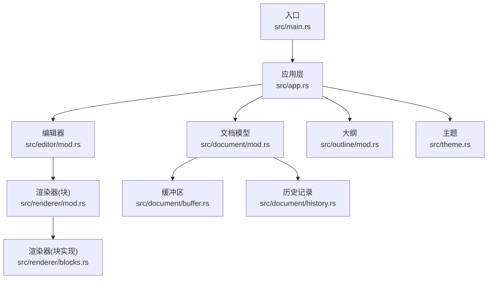
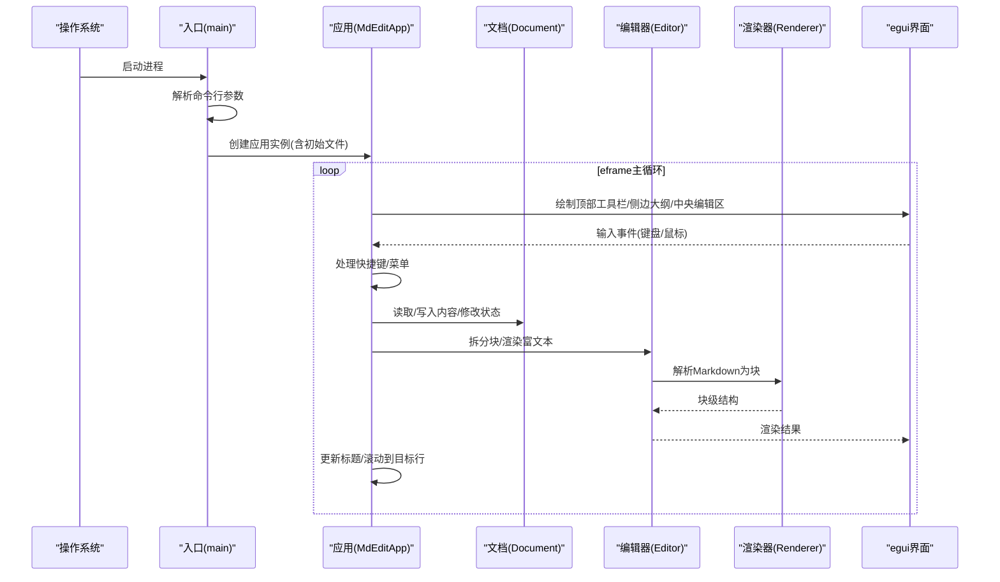
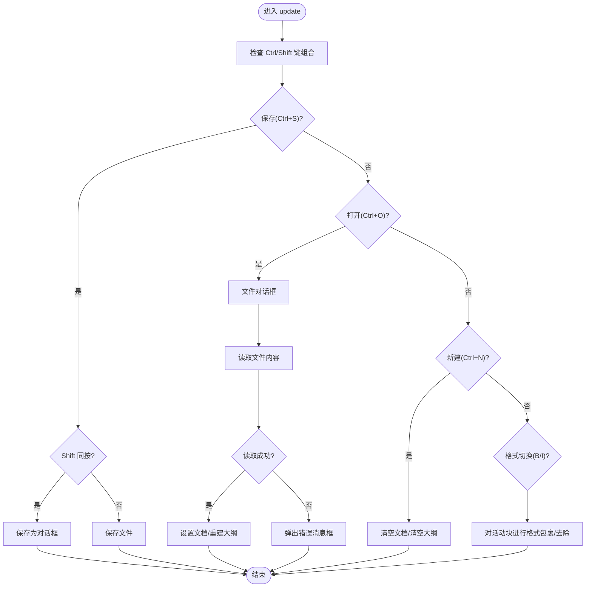
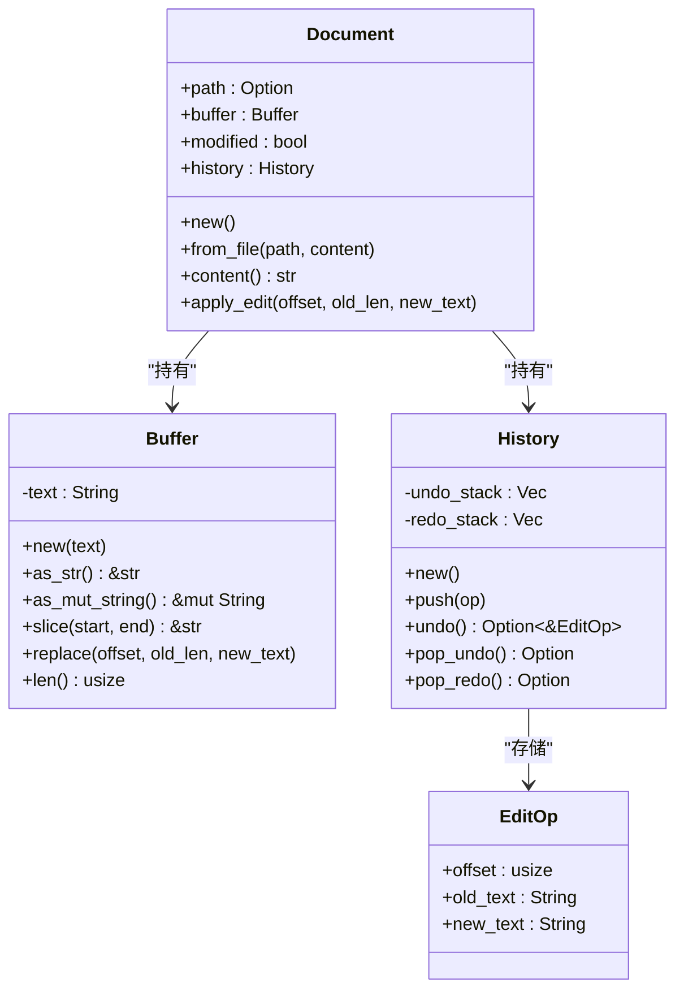
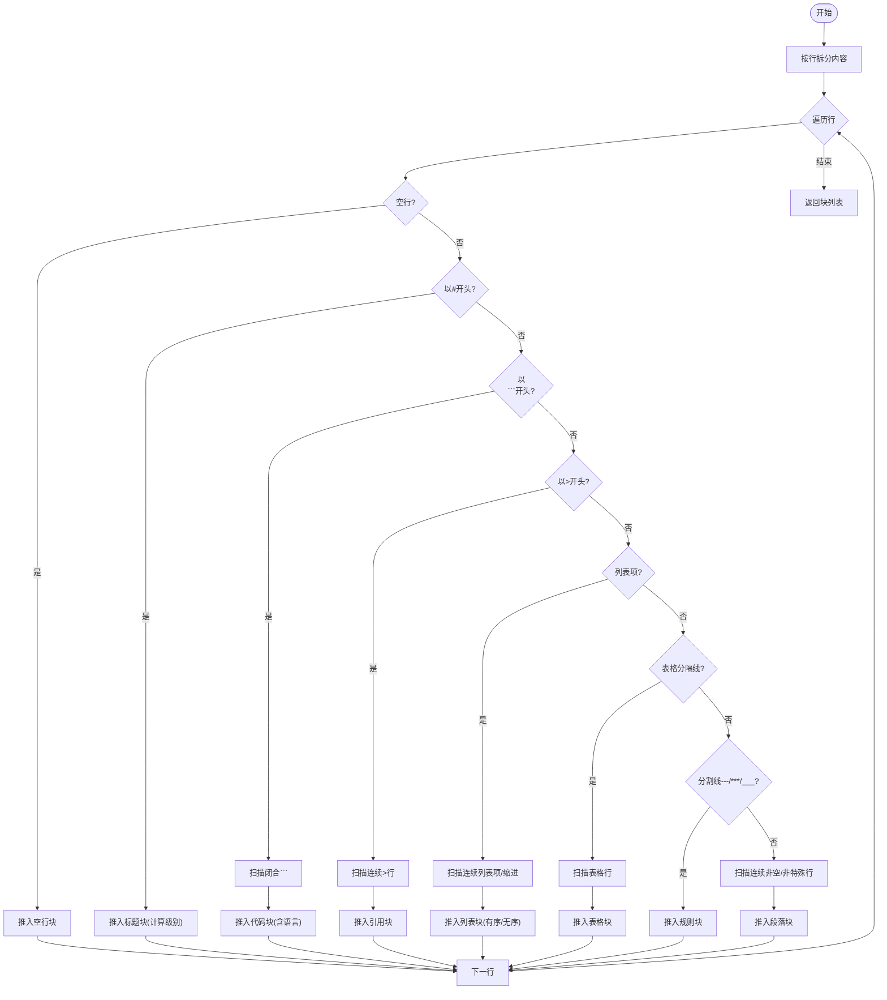
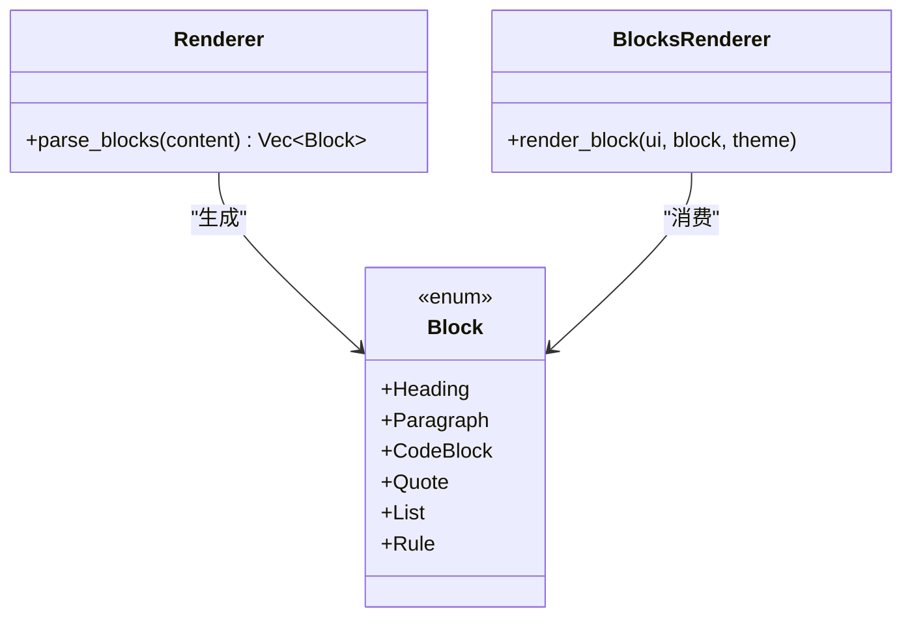
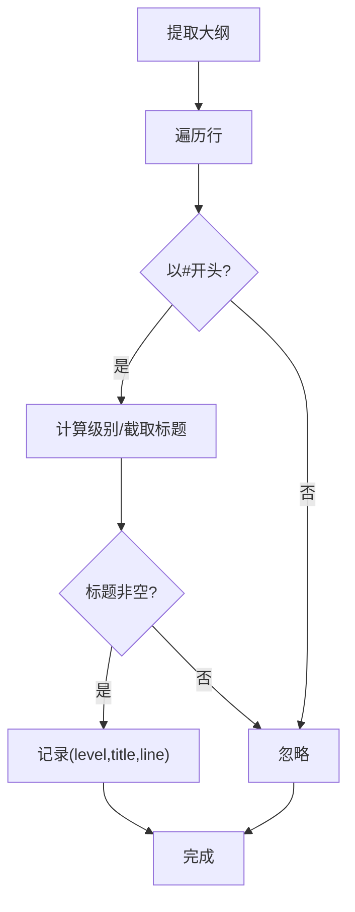
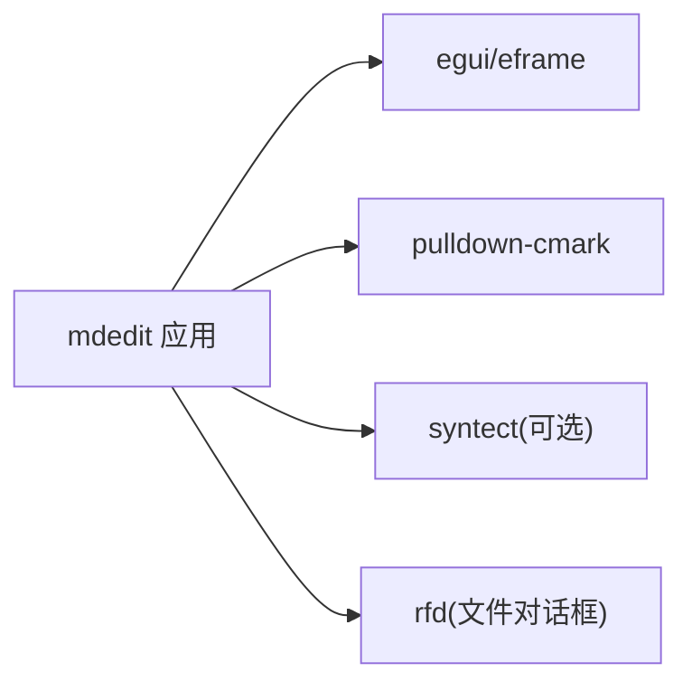

# 调试与故障排除

<cite>
**本文引用的文件**
- [Cargo.toml](file://Cargo.toml)
- [README.md](file://README.md)
- [src/main.rs](file://src/main.rs)
- [src/app.rs](file://src/app.rs)
- [src/document/mod.rs](file://src/document/mod.rs)
- [src/document/buffer.rs](file://src/document/buffer.rs)
- [src/document/history.rs](file://src/document/history.rs)
- [src/editor/mod.rs](file://src/editor/mod.rs)
- [src/renderer/mod.rs](file://src/renderer/mod.rs)
- [src/renderer/blocks.rs](file://src/renderer/blocks.rs)
- [src/outline/mod.rs](file://src/outline/mod.rs)
- [src/theme.rs](file://src/theme.rs)
</cite>

## 目录
1. [简介](#简介)
2. [项目结构](#项目结构)
3. [核心组件](#核心组件)
4. [架构总览](#架构总览)
5. [详细组件分析](#详细组件分析)
6. [依赖分析](#依赖分析)
7. [性能考虑](#性能考虑)
8. [故障排除指南](#故障排除指南)
9. [结论](#结论)
10. [附录](#附录)

## 简介
本指南面向 mdedit 项目的开发者与高级用户，聚焦于常见开发问题与运行时异常的定位与修复，涵盖编译错误、运行时崩溃、跨平台字体与路径问题、UI 渲染异常、文件读写失败、性能瓶颈以及日志与诊断工具的使用方法。文档同时提供系统化的排查流程与最佳实践，帮助快速定位问题并恢复稳定运行。

## 项目结构
mdedit 是基于 eframe/egui 的跨平台桌面应用，采用模块化组织：入口负责解析命令行参数与启动原生窗口；应用层协调文档、编辑器、大纲与主题；渲染层通过 pulldown-cmark 解析 Markdown 并生成块级元素；编辑器模块负责块级拆分与富文本渲染；文档模块管理缓冲区与历史记录；主题模块提供视觉样式配置；大纲模块从标题提取导航项。

图表来源
- [src/main.rs:1-50](file://src/main.rs#L1-L50)
- [src/app.rs:1-351](file://src/app.rs#L1-L351)
- [src/document/mod.rs:1-51](file://src/document/mod.rs#L1-L51)
- [src/editor/mod.rs:1-349](file://src/editor/mod.rs#L1-L349)
- [src/renderer/mod.rs:1-143](file://src/renderer/mod.rs#L1-L143)
- [src/renderer/blocks.rs:1-68](file://src/renderer/blocks.rs#L1-L68)
- [src/document/buffer.rs:1-30](file://src/document/buffer.rs#L1-L30)
- [src/document/history.rs:1-59](file://src/document/history.rs#L1-L59)
- [src/outline/mod.rs:1-27](file://src/outline/mod.rs#L1-L27)
- [src/theme.rs:1-22](file://src/theme.rs#L1-L22)

章节来源
- [src/main.rs:1-50](file://src/main.rs#L1-L50)
- [src/app.rs:1-351](file://src/app.rs#L1-L351)
- [src/document/mod.rs:1-51](file://src/document/mod.rs#L1-L51)
- [src/editor/mod.rs:1-349](file://src/editor/mod.rs#L1-L349)
- [src/renderer/mod.rs:1-143](file://src/renderer/mod.rs#L1-L143)
- [src/renderer/blocks.rs:1-68](file://src/renderer/blocks.rs#L1-L68)
- [src/document/buffer.rs:1-30](file://src/document/buffer.rs#L1-L30)
- [src/document/history.rs:1-59](file://src/document/history.rs#L1-L59)
- [src/outline/mod.rs:1-27](file://src/outline/mod.rs#L1-L27)
- [src/theme.rs:1-22](file://src/theme.rs#L1-L22)

## 核心组件
- 入口与生命周期
  - 命令行参数解析与初始文件加载，失败时弹出消息框提示。
  - 启动 eframe 原生窗口，设置最小尺寸与标题栏更新。
- 应用层
  - 维护文档、大纲、主题、滚动目标与当前编辑块状态。
  - 处理快捷键、菜单事件与 UI 布局。
  - 字体配置按平台选择中文字体，避免渲染异常。
- 文档模型
  - Buffer 提供字符串切片与替换能力。
  - History 支持撤销/重做栈，记录偏移与文本变更。
- 编辑器
  - 将 Markdown 拆分为块级单元，识别标题、代码块、引用、列表、表格、分割线与空行。
  - 富文本渲染支持加粗、斜体、行内代码等。
- 渲染器
  - 使用 pulldown-cmark 解析 Markdown，产出块级结构用于 egui 渲染。
- 大纲
  - 从文档内容提取标题层级与行号，支持点击跳转。
- 主题
  - 定义标题字号、代码背景色、引用条颜色、正文与弱化颜色。

章节来源
- [src/main.rs:15-50](file://src/main.rs#L15-L50)
- [src/app.rs:9-185](file://src/app.rs#L9-L185)
- [src/document/mod.rs:9-51](file://src/document/mod.rs#L9-L51)
- [src/document/buffer.rs:1-30](file://src/document/buffer.rs#L1-L30)
- [src/document/history.rs:1-59](file://src/document/history.rs#L1-L59)
- [src/editor/mod.rs:4-149](file://src/editor/mod.rs#L4-L149)
- [src/renderer/mod.rs:19-142](file://src/renderer/mod.rs#L19-L142)
- [src/outline/mod.rs:7-27](file://src/outline/mod.rs#L7-L27)
- [src/theme.rs:11-22](file://src/theme.rs#L11-L22)

## 架构总览
mdedit 的控制流自入口开始，初始化应用状态后进入 eframe 主循环。应用层在每次 update 中处理输入、更新标题、绘制菜单与面板，并根据当前块渲染编辑器或富文本。文档变更触发大纲重建，编辑器内部维护活动块与临时编辑文本，提交后写回缓冲区并标记修改状态。

图表来源
- [src/main.rs:35-50](file://src/main.rs#L35-L50)
- [src/app.rs:187-249](file://src/app.rs#L187-L249)
- [src/editor/mod.rs:24-149](file://src/editor/mod.rs#L24-L149)
- [src/renderer/mod.rs:19-142](file://src/renderer/mod.rs#L19-L142)

## 详细组件分析

### 应用层与事件处理
- 快捷键与菜单
  - Ctrl+S/Ctrl+Shift+S：保存/另存为；若无路径则弹出保存对话框。
  - Ctrl+O：打开文件；读取失败弹出错误消息框。
  - Ctrl+N：新建空白文档。
  - Ctrl+B/Ctrl+I：对选中块进行加粗/斜体格式切换。
- 字体配置
  - 按平台选择中文字体路径，若读取成功则注入到 egui 上下文，否则使用默认字体。
- 标题栏更新
  - 根据当前文档路径与修改状态动态更新窗口标题。

图表来源
- [src/app.rs:90-184](file://src/app.rs#L90-L184)
- [src/app.rs:121-163](file://src/app.rs#L121-L163)

章节来源
- [src/app.rs:90-184](file://src/app.rs#L90-L184)
- [src/app.rs:121-163](file://src/app.rs#L121-L163)

### 文档与缓冲区
- Buffer
  - 提供只读/可变字符串访问、切片与就地替换，便于高效编辑。
- History
  - 记录 EditOp（偏移、旧文本、新文本），支持撤销/重做与清空重做栈。
- Document
  - 组合 Buffer 与 History，提供 apply_edit 接口，统一修改与历史记录。

图表来源
- [src/document/mod.rs:9-51](file://src/document/mod.rs#L9-L51)
- [src/document/buffer.rs:1-30](file://src/document/buffer.rs#L1-L30)
- [src/document/history.rs:1-59](file://src/document/history.rs#L1-L59)

章节来源
- [src/document/mod.rs:9-51](file://src/document/mod.rs#L9-L51)
- [src/document/buffer.rs:1-30](file://src/document/buffer.rs#L1-L30)
- [src/document/history.rs:1-59](file://src/document/history.rs#L1-L59)

### 编辑器与块级拆分
- 文本块类型
  - 标题、段落、代码块、引用、有序/无序列表、表格、分割线、空行。
- 拆分算法
  - 逐行扫描，识别各类块起止范围，合并连续同类块，形成 TextBlock 列表。
- 富文本渲染
  - 对段落内的加粗、斜体、行内代码进行格式化拼接与渲染。

图表来源
- [src/editor/mod.rs:24-149](file://src/editor/mod.rs#L24-L149)

章节来源
- [src/editor/mod.rs:4-149](file://src/editor/mod.rs#L4-L149)

### 渲染器与块渲染
- 解析
  - 使用 pulldown-cmark 解析 Markdown，启用删除线、表格与任务列表扩展。
- 块渲染
  - 根据块类型调用对应渲染函数，支持标题、段落、代码块、引用、列表、规则等。
- 内联渲染
  - 当前保留接口，未来可扩展行内富文本解析。

图表来源
- [src/renderer/mod.rs:19-142](file://src/renderer/mod.rs#L19-L142)
- [src/renderer/blocks.rs:5-63](file://src/renderer/blocks.rs#L5-L63)

章节来源
- [src/renderer/mod.rs:19-142](file://src/renderer/mod.rs#L19-L142)
- [src/renderer/blocks.rs:5-63](file://src/renderer/blocks.rs#L5-L63)

### 大纲与跳转
- 从文档内容提取标题，记录层级、标题文本与所在行号。
- 侧边面板展示大纲项，点击后设置滚动目标行，随后定位到对应块并进入编辑模式。

图表来源
- [src/outline/mod.rs:7-27](file://src/outline/mod.rs#L7-L27)
- [src/app.rs:256-264](file://src/app.rs#L256-L264)

章节来源
- [src/outline/mod.rs:7-27](file://src/outline/mod.rs#L7-L27)
- [src/app.rs:256-264](file://src/app.rs#L256-L264)

## 依赖分析
- 外部依赖
  - eframe/egui：GUI 框架与渲染引擎。
  - pulldown-cmark：Markdown 解析。
  - syntect：语法高亮（可选特性）。
  - rfd：跨平台文件对话框。
- 构建配置
  - release 配置启用 LTO、strip 与优化至体积优先。

图表来源
- [Cargo.toml:8-13](file://Cargo.toml#L8-L13)

章节来源
- [Cargo.toml:1-19](file://Cargo.toml#L1-L19)

## 性能考虑
- 渲染路径
  - 编辑器将内容拆分为块，仅在交互时局部渲染富文本，减少全量重绘。
  - 大纲与标题解析为 O(n) 行扫描，适合中大型文档增量更新。
- 文档编辑
  - Buffer 提供就地替换，History 记录细粒度操作，避免整块重写。
- 构建优化
  - release 配置开启 LTO 与符号裁剪，减小二进制体积与启动时间。
- 建议
  - 对超长文档，建议延迟加载与虚拟滚动（当前未实现）。
  - 避免频繁重建字体缓存，尽量在应用启动阶段完成字体配置。

章节来源
- [src/editor/mod.rs:24-149](file://src/editor/mod.rs#L24-L149)
- [src/renderer/mod.rs:19-142](file://src/renderer/mod.rs#L19-L142)
- [src/document/buffer.rs:22-24](file://src/document/buffer.rs#L22-L24)
- [Cargo.toml:15-19](file://Cargo.toml#L15-L19)

## 故障排除指南

### 一、编译错误
- 症状
  - Windows(MSYS2/MinGW64) 下找不到链接器或库。
- 原因
  - PATH/LIBRARY_PATH 未正确指向 MinGW64 工具链。
- 解决
  - 按 README 的环境变量设置后再执行构建。
  - 确认已安装 Rust 工具链与目标组件。
- 参考
  - [README.md:22-27](file://README.md#L22-L27)

章节来源
- [README.md:13-27](file://README.md#L13-L27)

### 二、运行时异常与崩溃
- 症状
  - 启动后立即退出或黑屏。
- 排查步骤
  - 在终端运行 cargo run 查看标准输出/错误。
  - 检查是否缺少字体文件导致字体配置失败。
  - 确认 pulldown-cmark 解析未抛出异常（当前未显式捕获）。
- 建议
  - 为 eframe 添加日志输出，或在 main 中打印上下文信息。
  - 若出现 panic，使用 RUST_BACKTRACE=1 获取堆栈。

章节来源
- [src/main.rs:35-50](file://src/main.rs#L35-L50)
- [src/app.rs:45-84](file://src/app.rs#L45-L84)

### 三、文件读写与对话框问题
- 症状
  - 打开/保存文件时报错或无响应。
- 排查步骤
  - 检查路径权限与文件是否存在。
  - 打开失败会弹出错误消息框，确认 rfd 文件对话框可用。
  - 保存失败不会回退，需检查磁盘空间与写权限。
- 建议
  - 在保存前先尝试写入临时文件，再原子替换。
  - 对大文件采用异步读写，避免阻塞 UI。

章节来源
- [src/app.rs:121-163](file://src/app.rs#L121-L163)

### 四、跨平台字体与显示异常
- 症状
  - 中文字体缺失导致乱码或渲染异常。
- 排查步骤
  - 检查平台分支下的字体路径是否存在。
  - 若读取失败，将回退到默认字体。
- 建议
  - 在应用启动时记录字体加载日志。
  - 提供用户可选字体配置项。

章节来源
- [src/app.rs:45-84](file://src/app.rs#L45-L84)

### 五、UI 布局与交互问题
- 症状
  - 大纲面板不显示、标题栏未更新、快捷键无效。
- 排查步骤
  - 确认菜单按钮与复选框事件未被误关闭。
  - 检查滚动到目标行逻辑是否命中对应块。
- 建议
  - 为 UI 关键节点添加最小化日志输出，定位事件流。

章节来源
- [src/app.rs:187-249](file://src/app.rs#L187-L249)
- [src/app.rs:256-264](file://src/app.rs#L256-L264)

### 六、编辑与渲染一致性问题
- 症状
  - 修改后未即时反映到大纲或标题栏。
- 排查步骤
  - 确认修改后调用了大纲重建。
  - 检查活动块索引与编辑文本同步。
- 建议
  - 在 commit_edit 后统一刷新大纲与标题。

章节来源
- [src/app.rs:330-349](file://src/app.rs#L330-L349)
- [src/app.rs:277-278](file://src/app.rs#L277-L278)

### 七、日志与诊断工具使用
- 日志
  - 在关键路径添加日志输出（如打开/保存、块拆分、渲染）。
- 断点调试
  - 使用 IDE 设置断点于入口、事件处理与渲染函数。
- 内存与性能
  - 使用 perf-tools 或火焰图工具定位热点。
  - 对超长文档进行分页/懒加载测试。
- Rust 诊断
  - RUST_LOG=trace（若引入日志库）。
  - RUST_BACKTRACE=full 获取完整堆栈。
  - cargo clippy 检查潜在问题。
  - cargo bench/test 验证性能回归。

章节来源
- [src/main.rs:35-50](file://src/main.rs#L35-L50)
- [src/app.rs:187-249](file://src/app.rs#L187-L249)

### 八、错误日志解读与问题定位技巧
- 常见线索
  - 文件路径与权限错误：优先检查 rfd 返回值与 fs::write 结果。
  - 字体加载失败：关注平台分支与文件存在性。
  - UI 不更新：检查标题更新命令与事件传播。
- 技巧
  - 将复杂流程拆分为小函数并添加注释/日志。
  - 对 UI 事件流画出序列图，定位第一个失效点。

章节来源
- [src/app.rs:121-163](file://src/app.rs#L121-L163)
- [src/app.rs:45-84](file://src/app.rs#L45-L84)

### 九、用户反馈问题的排查流程
- 收集信息
  - 平台版本、Rust 版本、是否使用 MSYS2（Windows）。
  - 是否能复现（最小化示例）。
- 复现步骤
  - 打开/保存/编辑/跳转大纲等关键动作。
- 诊断
  - 开启日志，逐步缩小范围。
  - 对比不同平台行为差异。
- 修复与验证
  - 提供最小修复方案与回归测试用例。

章节来源
- [README.md:13-19](file://README.md#L13-L19)
- [src/app.rs:121-163](file://src/app.rs#L121-L163)

## 结论
mdedit 的问题多集中在跨平台资源加载、文件 IO 与 UI 事件流上。通过规范的日志与断点调试、严格的输入校验与错误反馈、以及合理的性能优化策略，可以有效提升稳定性与用户体验。建议在后续迭代中引入更完善的日志框架与异步 IO，以进一步降低复杂场景下的风险。

## 附录
- 快捷键参考
  - Ctrl+N：新建
  - Ctrl+O：打开
  - Ctrl+S：保存
  - Ctrl+Shift+S：另存为
  - Ctrl+B/Ctrl+I：加粗/斜体

章节来源
- [README.md:37-44](file://README.md#L37-L44)