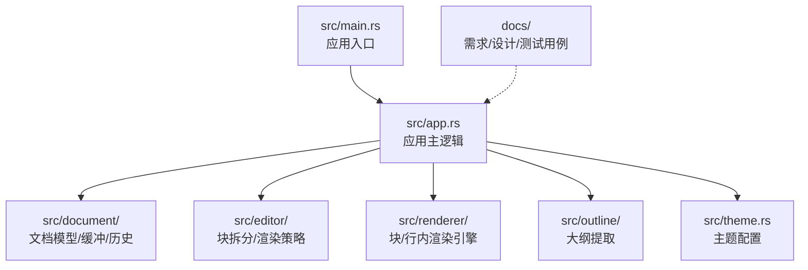
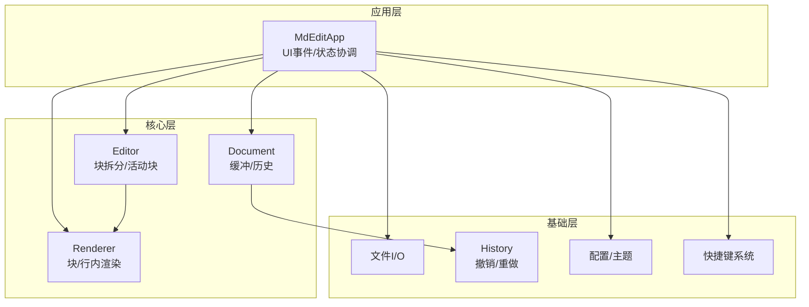
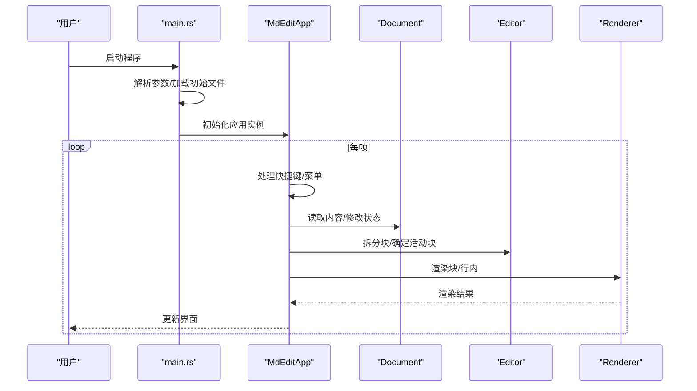
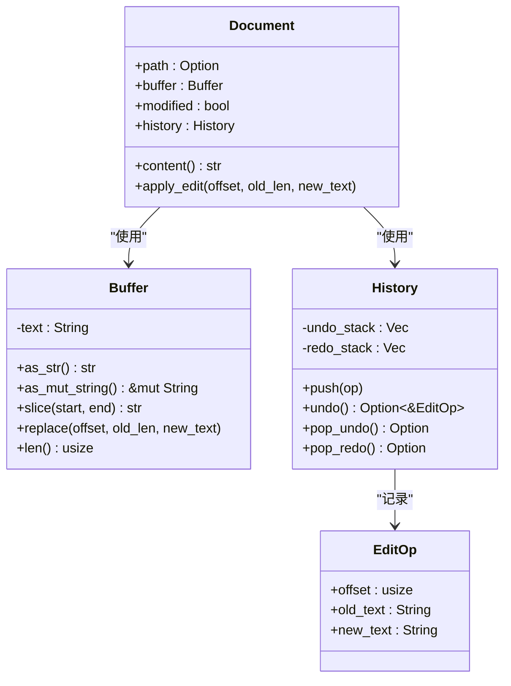
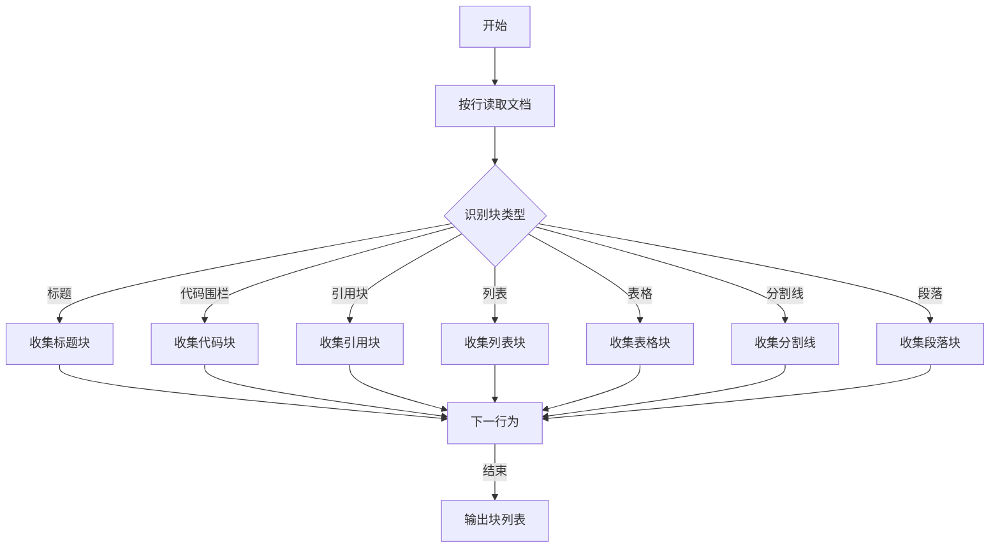
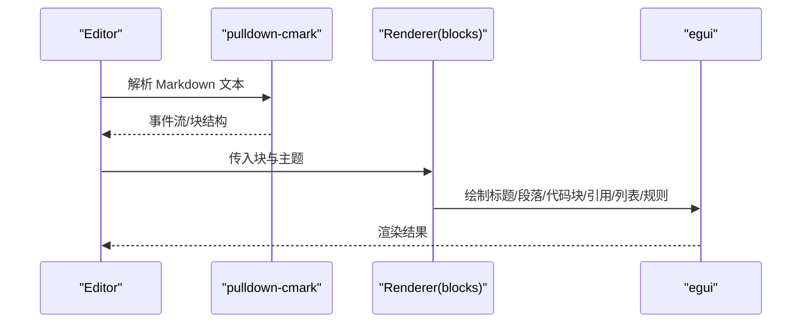
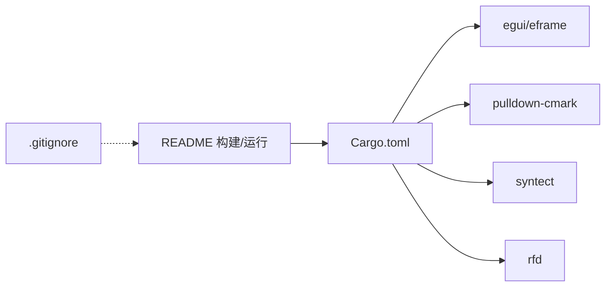

# 贡献指南

<cite>
**本文引用的文件**   
- [README.md](file://README.md)
- [Cargo.toml](file://Cargo.toml)
- [.gitignore](file://.gitignore)
- [src/main.rs](file://src/main.rs)
- [src/app.rs](file://src/app.rs)
- [src/document/mod.rs](file://src/document/mod.rs)
- [src/document/buffer.rs](file://src/document/buffer.rs)
- [src/document/history.rs](file://src/document/history.rs)
- [src/editor/mod.rs](file://src/editor/mod.rs)
- [src/renderer/mod.rs](file://src/renderer/mod.rs)
- [src/renderer/blocks.rs](file://src/renderer/blocks.rs)
- [src/outline/mod.rs](file://src/outline/mod.rs)
- [src/theme.rs](file://src/theme.rs)
- [docs/requirements.md](file://docs/requirements.md)
- [docs/design.md](file://docs/design.md)
- [docs/test-cases.md](file://docs/test-cases.md)
</cite>

## 目录
1. [简介](#简介)
2. [项目结构](#项目结构)
3. [核心组件](#核心组件)
4. [架构总览](#架构总览)
5. [详细组件分析](#详细组件分析)
6. [依赖关系分析](#依赖关系分析)
7. [性能考虑](#性能考虑)
8. [故障排查指南](#故障排查指南)
9. [结论](#结论)
10. [附录](#附录)

## 简介
mdedit 是一款轻量级跨平台 Markdown 编辑器，采用 Typora 式所见即所得（WYSIWYG）编辑体验，基于 Rust + egui + pulldown-cmark 技术栈构建。本贡献指南面向希望参与该项目开发与维护的贡献者，涵盖代码提交规范、Git 工作流程、代码审查标准、新功能开发流程、文档贡献方式、社区参与规则、行为准则以及问题报告与功能请求模板等内容。

## 项目结构
项目采用按领域分层的模块化组织方式，核心入口位于 src/main.rs，应用主体在 src/app.rs，功能模块分布在 document、editor、renderer、outline、theme 等子目录中；文档资料集中在 docs 目录，包含需求、设计与测试用例文档。

图表来源
- [src/main.rs:1-50](file://src/main.rs#L1-L50)
- [src/app.rs:1-351](file://src/app.rs#L1-L351)
- [src/document/mod.rs:1-51](file://src/document/mod.rs#L1-L51)
- [src/editor/mod.rs:1-349](file://src/editor/mod.rs#L1-L349)
- [src/renderer/mod.rs:1-143](file://src/renderer/mod.rs#L1-L143)
- [src/outline/mod.rs:1-27](file://src/outline/mod.rs#L1-L27)
- [src/theme.rs:1-22](file://src/theme.rs#L1-L22)
- [docs/requirements.md:1-85](file://docs/requirements.md#L1-L85)
- [docs/design.md:1-158](file://docs/design.md#L1-L158)
- [docs/test-cases.md:1-112](file://docs/test-cases.md#L1-L112)

章节来源
- [README.md:1-48](file://README.md#L1-L48)
- [Cargo.toml:1-19](file://Cargo.toml#L1-L19)
- [src/main.rs:1-50](file://src/main.rs#L1-L50)
- [src/app.rs:1-351](file://src/app.rs#L1-L351)
- [docs/requirements.md:1-85](file://docs/requirements.md#L1-L85)
- [docs/design.md:1-158](file://docs/design.md#L1-L158)
- [docs/test-cases.md:1-112](file://docs/test-cases.md#L1-L112)

## 核心组件
- 应用入口与生命周期：负责解析命令行参数、加载初始文件、设置窗口尺寸与字体，并启动 egui 应用循环。
- 应用主状态：MdEditApp 维护文档、大纲、主题、滚动定位、活动块等状态，处理菜单与快捷键、渲染编辑区与大纲面板。
- 文档模型：Document 封装文件路径、缓冲区、修改状态与历史栈，提供内容读取与编辑应用接口。
- 编辑器：将文档按块（heading、code、quote、list、table、rule、paragraph）切分，决定渲染或源码编辑模式。
- 渲染引擎：基于 pulldown-cmark 解析 Markdown，结合 egui 进行块级与行内渲染；blocks.rs 提供具体渲染实现。
- 大纲：从文档中提取标题层级，支持点击跳转与高亮。
- 主题：集中定义标题字号、代码块背景、引用条颜色、文本颜色等视觉参数。

章节来源
- [src/main.rs:15-50](file://src/main.rs#L15-L50)
- [src/app.rs:9-185](file://src/app.rs#L9-L185)
- [src/document/mod.rs:9-51](file://src/document/mod.rs#L9-L51)
- [src/editor/mod.rs:4-149](file://src/editor/mod.rs#L4-L149)
- [src/renderer/mod.rs:19-142](file://src/renderer/mod.rs#L19-L142)
- [src/renderer/blocks.rs:5-63](file://src/renderer/blocks.rs#L5-L63)
- [src/outline/mod.rs:7-26](file://src/outline/mod.rs#L7-L26)
- [src/theme.rs:3-21](file://src/theme.rs#L3-L21)

## 架构总览
mdedit 采用“应用层 + 核心层 + 基础层”的分层架构。应用层负责 UI 事件与状态协调；核心层包含文档、编辑器与渲染引擎；基础层提供文件 I/O、撤销/重做、配置与快捷键等通用能力。渲染策略采用“块级渲染 + 源码编辑”模式，提升交互性能与一致性。

图表来源
- [src/app.rs:19-351](file://src/app.rs#L19-L351)
- [src/document/mod.rs:16-51](file://src/document/mod.rs#L16-L51)
- [src/editor/mod.rs:24-149](file://src/editor/mod.rs#L24-L149)
- [src/renderer/mod.rs:19-142](file://src/renderer/mod.rs#L19-L142)
- [src/renderer/blocks.rs:5-63](file://src/renderer/blocks.rs#L5-L63)
- [src/document/history.rs:12-58](file://src/document/history.rs#L12-L58)

## 详细组件分析

### 应用主流程（启动、菜单、快捷键、渲染）
应用启动后根据命令行参数决定是否加载初始文件，随后进入 egui 循环，处理顶部工具栏菜单、侧边大纲面板与中央编辑区渲染。编辑区采用“块级渲染 + 源码编辑”策略：当光标进入某块时切换为源码编辑，离开则恢复渲染视图。

图表来源
- [src/main.rs:35-50](file://src/main.rs#L35-L50)
- [src/app.rs:187-351](file://src/app.rs#L187-L351)
- [src/editor/mod.rs:24-149](file://src/editor/mod.rs#L24-L149)
- [src/renderer/mod.rs:19-142](file://src/renderer/mod.rs#L19-L142)

章节来源
- [src/main.rs:15-50](file://src/main.rs#L15-L50)
- [src/app.rs:187-351](file://src/app.rs#L187-L351)

### 文档模型与历史（撤销/重做）
文档模型包含路径、缓冲区、修改标记与历史栈；历史栈支持多步撤销与重做，编辑操作以文本偏移与前后文本差异的形式记录。

图表来源
- [src/document/mod.rs:9-51](file://src/document/mod.rs#L9-L51)
- [src/document/buffer.rs:1-30](file://src/document/buffer.rs#L1-L30)
- [src/document/history.rs:1-59](file://src/document/history.rs#L1-L59)

章节来源
- [src/document/mod.rs:16-51](file://src/document/mod.rs#L16-L51)
- [src/document/buffer.rs:5-30](file://src/document/buffer.rs#L5-L30)
- [src/document/history.rs:12-58](file://src/document/history.rs#L12-L58)

### 编辑器块拆分与渲染策略
编辑器将文档按块类型进行拆分，渲染时仅对非活动块进行富文本渲染，活动块保持源码编辑态，从而实现“所见即所得 + 源码可控”的体验。

图表来源
- [src/editor/mod.rs:24-149](file://src/editor/mod.rs#L24-L149)

章节来源
- [src/editor/mod.rs:4-149](file://src/editor/mod.rs#L4-L149)

### 渲染引擎（块级与行内）
渲染引擎基于 pulldown-cmark 解析 Markdown，生成块级结构；blocks.rs 负责将块渲染为 egui 控件，支持标题、段落、代码块、引用、列表、规则等。

图表来源
- [src/editor/mod.rs:24-149](file://src/editor/mod.rs#L24-L149)
- [src/renderer/mod.rs:19-142](file://src/renderer/mod.rs#L19-L142)
- [src/renderer/blocks.rs:5-63](file://src/renderer/blocks.rs#L5-L63)

章节来源
- [src/renderer/mod.rs:19-142](file://src/renderer/mod.rs#L19-L142)
- [src/renderer/blocks.rs:5-63](file://src/renderer/blocks.rs#L5-L63)

### 大纲与主题
大纲从文档中提取标题层级，支持点击跳转与高亮；主题集中定义标题字号、代码块背景、引用条颜色、文本颜色等视觉参数。

章节来源
- [src/outline/mod.rs:7-26](file://src/outline/mod.rs#L7-L26)
- [src/theme.rs:3-21](file://src/theme.rs#L3-L21)

## 依赖关系分析
- 依赖管理：Cargo.toml 定义了 eframe、egui、pulldown-cmark、syntect、rfd 等核心依赖，以及 release 配置优化选项。
- 构建与运行：README 提供 Windows（MSYS2/MinGW64）环境下的编译与运行步骤。
- 忽略规则：.gitignore 排除 target、调试符号、备份文件与 IDE 生成文件等。

图表来源
- [Cargo.toml:1-19](file://Cargo.toml#L1-L19)
- [README.md:13-35](file://README.md#L13-L35)
- [.gitignore:1-28](file://.gitignore#L1-L28)

章节来源
- [Cargo.toml:1-19](file://Cargo.toml#L1-L19)
- [README.md:13-35](file://README.md#L13-L35)
- [.gitignore:1-28](file://.gitignore#L1-L28)

## 性能考虑
- 渲染粒度：按 Markdown 块进行渲染，减少每帧计算量；光标移动时仅重绘离开与进入的两个块。
- 文本存储：MVP 阶段使用 String，满足 5MB 以下文档性能；后续可替换为 ropey 以支持超大文档。
- 编辑模型：直接操作源文本，保证保存时输出标准 Markdown，避免渲染状态与源码状态不一致。
- 启动与滚动：README 中明确了冷启动时间、大文档滚动流畅度与输入延迟的性能目标。

章节来源
- [docs/design.md:128-147](file://docs/design.md#L128-L147)
- [docs/test-cases.md:97-112](file://docs/test-cases.md#L97-L112)
- [README.md:39-44](file://README.md#L39-L44)

## 故障排查指南
- 启动失败或无法打开文件：检查命令行参数与文件路径，确认 README 中的编译与运行步骤。
- 字体显示异常：应用会根据操作系统尝试加载 CJK 字体，若未找到则使用默认字体；可在 configure_fonts 中调整字体路径。
- 大文档加载缓慢：确认是否满足性能测试用例中的内存占用与滚动流畅度要求。
- 快捷键无效：确认 egui 输入上下文中是否正确识别 Ctrl/Shift 等修饰键。

章节来源
- [src/main.rs:15-33](file://src/main.rs#L15-L33)
- [src/app.rs:45-84](file://src/app.rs#L45-L84)
- [docs/test-cases.md:97-112](file://docs/test-cases.md#L97-L112)

## 结论
本贡献指南提供了从代码提交规范、Git 工作流程、代码审查标准到新功能开发与测试验证的完整实践路径。建议贡献者在提交前对照需求与设计文档，确保变更符合架构目标与性能约束，并遵循统一的提交信息格式与 Pull Request 规范。

## 附录

### 代码提交规范与 Git 工作流程
- 分支策略
  - main：稳定发布分支
  - develop：集成与测试分支
  - feature/*：新功能开发分支
  - hotfix/*：紧急修复分支
- 提交信息格式
  - 类型: 摘要（不超过 50 字）
  - 详细说明（可选，解释动机与影响）
  - 关联 Issue（可选）
- 合并与推送
  - 使用 Squash Merge 合并 feature/hotfix 分支
  - 推送前执行本地构建与测试

### Pull Request 规范
- PR 标题应简洁明确，描述变更范围
- 在 PR 描述中说明：变更动机、实现方案、测试覆盖、性能影响、兼容性风险
- 至少一名维护者审查通过后方可合并

### 代码审查标准与流程
- 代码质量：命名清晰、模块职责单一、注释充分
- 架构一致性：遵循现有模块边界与数据流
- 性能与安全：避免引入性能退化与安全漏洞
- 测试覆盖：新增功能需配套单元/集成测试
- 审查清单
  - 是否满足需求文档与设计约束
  - 是否通过构建与测试
  - 是否有必要的文档更新
  - 是否存在破坏性变更

### 新功能开发流程（从需求到测试）
- 需求分析：参考需求文档，明确功能编号、优先级与验收标准
- 设计评审：输出设计要点与数据流，形成设计文档
- 开发实现：遵循模块边界与渲染策略，确保编辑模型与历史一致性
- 测试验证：编写测试用例并执行，覆盖文件操作、渲染、大纲、编辑功能与性能指标
- 文档更新：更新需求、设计与测试用例文档

章节来源
- [docs/requirements.md:1-85](file://docs/requirements.md#L1-L85)
- [docs/design.md:1-158](file://docs/design.md#L1-L158)
- [docs/test-cases.md:1-112](file://docs/test-cases.md#L1-L112)

### 文档贡献方式与标准
- 文档类型：需求、设计、测试用例、使用说明
- 格式：Markdown，标题层级清晰，术语统一
- 更新范围：功能变更需同步更新相关文档
- 审核流程：提交 PR 并在 CI 通过后由维护者审核

章节来源
- [docs/requirements.md:1-85](file://docs/requirements.md#L1-L85)
- [docs/design.md:1-158](file://docs/design.md#L1-L158)
- [docs/test-cases.md:1-112](file://docs/test-cases.md#L1-L112)

### 社区参与规则与沟通渠道
- 遵循开源协作礼仪，尊重不同观点
- 使用 GitHub Issues 进行问题报告与功能请求
- 在 PR 与评论中提供清晰背景与证据
- 避免在公开渠道讨论敏感信息

### 贡献者行为准则与协作规范
- 以建设性方式提出意见与建议
- 避免人身攻击，专注问题本身
- 积极帮助他人，分享知识与经验
- 遵守许可证条款（MIT）

### 问题报告与功能请求模板
- 问题报告模板
  - 环境信息：操作系统、mdedit 版本、Rust 版本
  - 复现步骤：最小可复现步骤
  - 预期行为与实际行为
  - 日志与截图（如有）
- 功能请求模板
  - 背景与动机
  - 期望行为与验收标准
  - 影响范围与兼容性考虑

### 新贡献者参与路径与学习资源
- 快速上手
  - 阅读 README 了解特性与构建步骤
  - 运行示例：cargo run
- 深入学习
  - 阅读需求文档与设计文档
  - 分析核心模块：app.rs、editor/mod.rs、renderer/mod.rs、document/mod.rs
  - 运行测试用例，理解验收标准
- 贡献起点
  - 从文档改进与小 bug 修复入手
  - 参考现有 PR 与 Issues，选择合适任务

章节来源
- [README.md:1-48](file://README.md#L1-L48)
- [docs/requirements.md:1-85](file://docs/requirements.md#L1-L85)
- [docs/design.md:1-158](file://docs/design.md#L1-L158)
- [docs/test-cases.md:1-112](file://docs/test-cases.md#L1-L112)
- [src/app.rs:1-351](file://src/app.rs#L1-L351)
- [src/editor/mod.rs:1-349](file://src/editor/mod.rs#L1-L349)
- [src/renderer/mod.rs:1-143](file://src/renderer/mod.rs#L1-L143)
- [src/document/mod.rs:1-51](file://src/document/mod.rs#L1-L51)