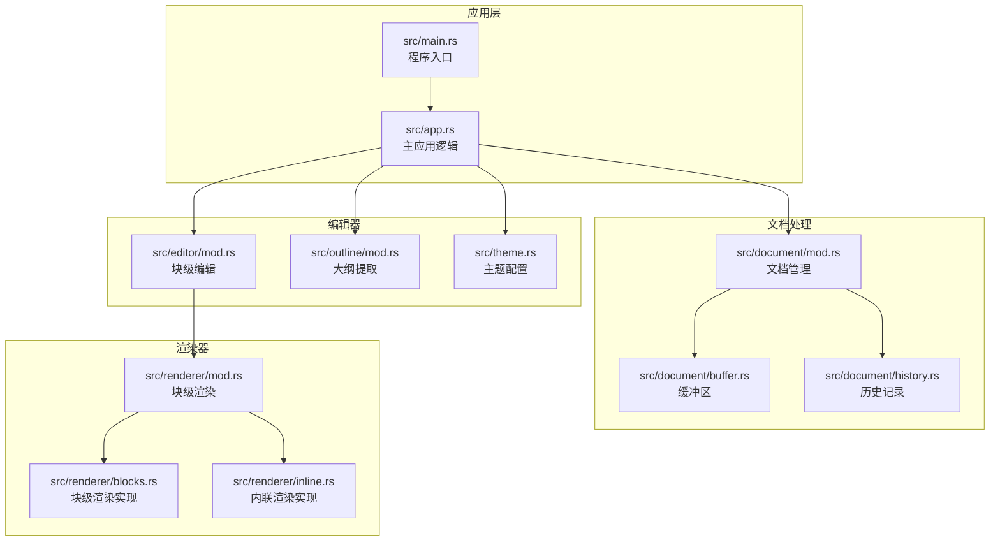
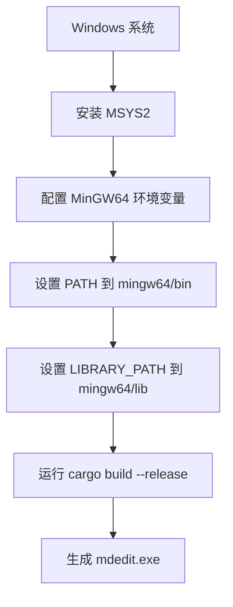
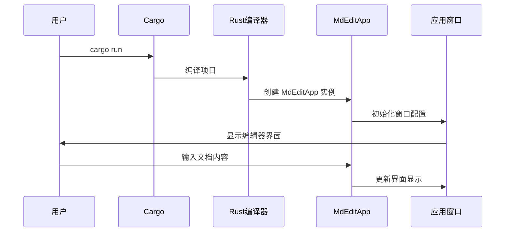
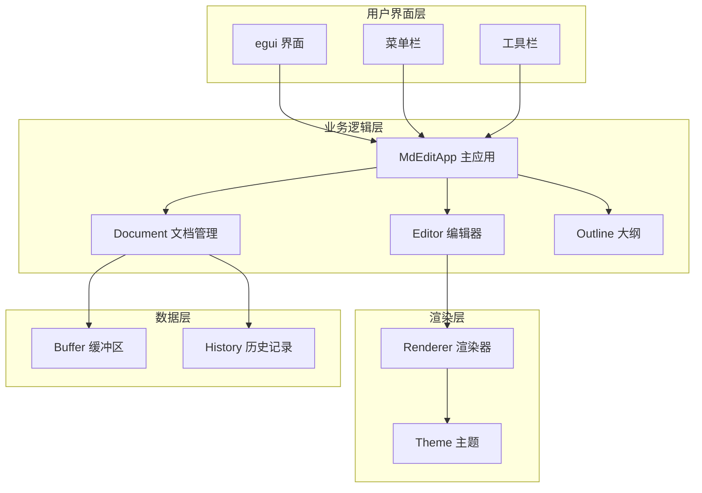
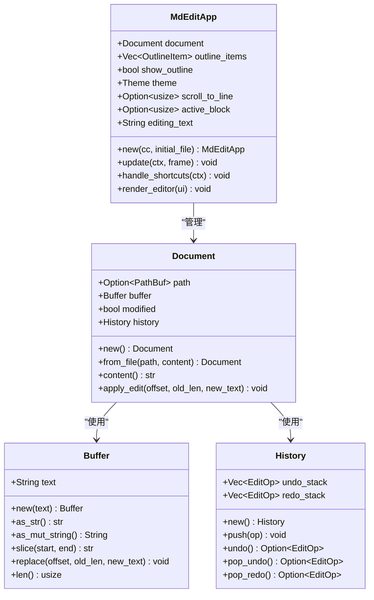
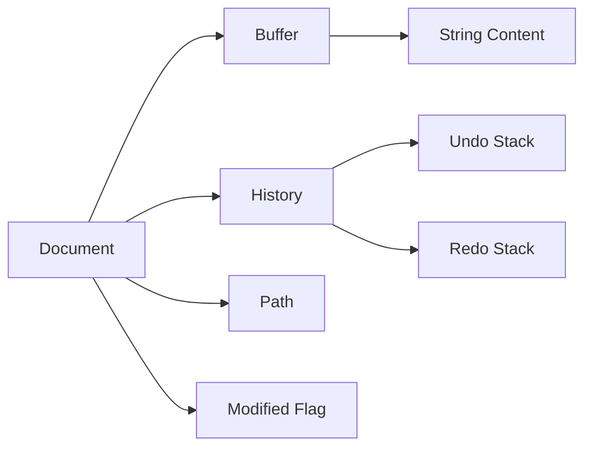
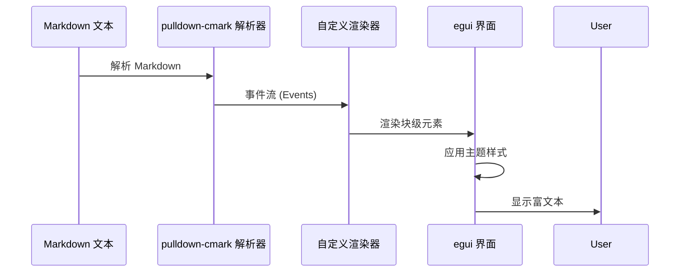
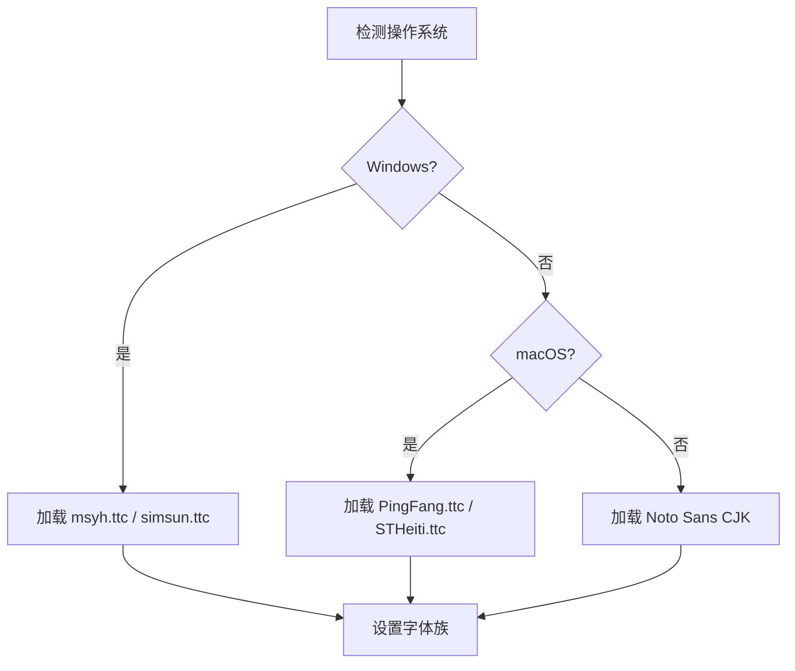

# 快速开始

<cite>
**本文引用的文件**
- [README.md](file://README.md)
- [Cargo.toml](file://Cargo.toml)
- [src/main.rs](file://src/main.rs)
- [src/app.rs](file://src/app.rs)
- [src/document/mod.rs](file://src/document/mod.rs)
- [src/document/buffer.rs](file://src/document/buffer.rs)
- [src/document/history.rs](file://src/document/history.rs)
- [src/editor/mod.rs](file://src/editor/mod.rs)
- [src/renderer/mod.rs](file://src/renderer/mod.rs)
- [src/outline/mod.rs](file://src/outline/mod.rs)
- [src/theme.rs](file://src/theme.rs)
</cite>

## 目录
1. [简介](#简介)
2. [项目结构](#项目结构)
3. [环境要求](#环境要求)
4. [安装与编译](#安装与编译)
5. [跨平台构建说明](#跨平台构建说明)
6. [运行项目](#运行项目)
7. [基本使用示例](#基本使用示例)
8. [架构概览](#架构概览)
9. [详细组件分析](#详细组件分析)
10. [性能考虑](#性能考虑)
11. [故障排除指南](#故障排除指南)
12. [结论](#结论)

## 简介
mdedit 是一个轻量级跨平台 Markdown 编辑器，采用 Typora 式的所见即所得（WYSIWYG）渲染，无需 WebView2。该项目具有以下特点：
- 轻量级设计，单文件分发，体积小于 4MB
- 冷启动时间少于 200ms
- 支持 Windows、macOS 和 Linux 平台
- 实时大纲导航功能
- 基于 egui 的原生界面渲染

## 项目结构
mdedit 采用模块化设计，主要分为以下几个核心模块：



**图表来源**
- [src/main.rs:1-50](file://src/main.rs#L1-L50)
- [src/app.rs:1-351](file://src/app.rs#L1-L351)
- [src/document/mod.rs:1-51](file://src/document/mod.rs#L1-L51)
- [src/editor/mod.rs:1-349](file://src/editor/mod.rs#L1-L349)
- [src/renderer/mod.rs:1-143](file://src/renderer/mod.rs#L1-L143)

**章节来源**
- [src/main.rs:1-50](file://src/main.rs#L1-L50)
- [src/app.rs:1-351](file://src/app.rs#L1-L351)
- [src/document/mod.rs:1-51](file://src/document/mod.rs#L1-L51)
- [src/editor/mod.rs:1-349](file://src/editor/mod.rs#L1-L349)
- [src/renderer/mod.rs:1-143](file://src/renderer/mod.rs#L1-L143)

## 环境要求
根据项目文档，mdedit 的环境要求如下：

### 基础要求
- **Rust 1.70+**: 项目使用 Rust 2021 edition，需要满足最低版本要求
- **跨平台支持**: Windows、macOS、Linux 全平台支持

### Windows 特殊要求
- **MSYS2 MinGW64 工具链**: 在 Windows 平台上需要配置 MSYS2 MinGW64 环境
- **环境变量配置**: 需要设置 PATH 和 LIBRARY_PATH 指向 MinGW64 安装目录

**章节来源**
- [README.md:15-18](file://README.md#L15-L18)
- [Cargo.toml:1-19](file://Cargo.toml#L1-L19)

## 安装与编译

### 步骤 1: 安装 Rust 工具链
1. 下载并安装 Rust 工具链（1.70 或更高版本）
2. 验证安装：`rustc --version`

### 步骤 2: Windows 平台配置 MSYS2 MinGW64
```bash
# 设置环境变量（根据实际安装路径调整）
export PATH="/c/msys64/mingw64/bin:$PATH"
export LIBRARY_PATH="/c/msys64/mingw64/lib"
```

### 步骤 3: 获取源码并编译
```bash
# 克隆仓库或下载源码包
git clone https://github.com/your-repo/mdedit.git
cd mdedit

# 编译发布版本
cargo build --release
```

### 步骤 4: 验证编译结果
编译完成后，可在以下位置找到可执行文件：
- Windows: `target/release/mdedit.exe`
- macOS/Linux: `target/release/mdedit`

**章节来源**
- [README.md:20-35](file://README.md#L20-L35)

## 跨平台构建说明

### Windows (MSYS2/MinGW64)
Windows 平台需要特殊的工具链配置：



**图表来源**
- [README.md:22-27](file://README.md#L22-L27)

### macOS 平台
macOS 平台通常不需要额外配置，直接使用系统默认的工具链即可编译。

### Linux 平台
Linux 平台可能需要安装额外的系统依赖：
```bash
# Ubuntu/Debian
sudo apt-get install libxcb-render-util0 libxcb-xinerama0 libxcb-shape0 libxcb-randr0 libxcb-composite0 libxcb-xtest0 libxcb-xfixes0

# CentOS/RHEL/Fedora
sudo yum install libxcb libXinerama libXrandr libXcomposite libXtst libXfixes
```

**章节来源**
- [README.md:15-18](file://README.md#L15-L18)

## 运行项目

### 方式一: 使用 Cargo 运行
```bash
# 开发模式运行
cargo run

# 指定文件参数运行
cargo run path/to/your/document.md
```

### 方式二: 直接执行二进制文件
```bash
# Windows
./target/release/mdedit.exe

# macOS/Linux
./target/release/mdedit

# 指定文件参数
./target/release/mdedit path/to/your/document.md
```

### 启动流程分析


**图表来源**
- [src/main.rs:35-49](file://src/main.rs#L35-L49)
- [src/app.rs:19-43](file://src/app.rs#L19-L43)

**章节来源**
- [src/main.rs:35-49](file://src/main.rs#L35-L49)
- [src/app.rs:19-43](file://src/app.rs#L19-L43)

## 基本使用示例

### 快捷键操作
mdedit 提供了直观的快捷键支持：

| 快捷键 | 功能 | 描述 |
|--------|------|------|
| Ctrl+N | 新建文档 | 创建新的空白文档 |
| Ctrl+O | 打开文件 | 选择并打开现有 Markdown 文件 |
| Ctrl+S | 保存文件 | 保存当前文档到原位置 |
| Ctrl+Shift+S | 另存为 | 选择新位置保存文档 |
| Ctrl+B | 粗体格式 | 将选中文本设置为粗体 |
| Ctrl+I | 斜体格式 | 将选中文本设置为斜体 |

### 基本操作流程


**图表来源**
- [src/app.rs:90-114](file://src/app.rs#L90-L114)
- [src/app.rs:116-163](file://src/app.rs#L116-L163)

### 文档操作示例
1. **新建文档**: 按下 `Ctrl+N` 或通过菜单选择"文件" → "新建"
2. **打开文档**: 按下 `Ctrl+O` 或通过菜单选择"文件" → "打开"
3. **保存文档**: 按下 `Ctrl+S` 保存到原位置，或 `Ctrl+Shift+S` 另存为
4. **编辑内容**: 点击任意文本块进入编辑模式，修改后按 Enter 或点击其他区域确认

**章节来源**
- [README.md:37-43](file://README.md#L37-L43)
- [src/app.rs:90-114](file://src/app.rs#L90-L114)
- [src/app.rs:116-163](file://src/app.rs#L116-L163)

## 架构概览

### 整体架构设计
mdedit 采用模块化的架构设计，各模块职责明确：



**图表来源**
- [src/app.rs:9-17](file://src/app.rs#L9-L17)
- [src/document/mod.rs:9-14](file://src/document/mod.rs#L9-L14)
- [src/editor/mod.rs:4-22](file://src/editor/mod.rs#L4-L22)

### 核心组件关系


**图表来源**
- [src/app.rs:9-43](file://src/app.rs#L9-L43)
- [src/document/mod.rs:9-50](file://src/document/mod.rs#L9-L50)
- [src/document/buffer.rs:1-29](file://src/document/buffer.rs#L1-L29)
- [src/document/history.rs:1-58](file://src/document/history.rs#L1-L58)

**章节来源**
- [src/app.rs:9-43](file://src/app.rs#L9-L43)
- [src/document/mod.rs:9-50](file://src/document/mod.rs#L9-L50)
- [src/document/buffer.rs:1-29](file://src/document/buffer.rs#L1-L29)
- [src/document/history.rs:1-58](file://src/document/history.rs#L1-L58)

## 详细组件分析

### 应用主控制器 (MdEditApp)
MdEditApp 是应用程序的核心控制器，负责协调各个子系统的协作：

#### 主要职责
- 管理文档生命周期
- 处理用户交互和快捷键
- 控制界面布局和状态
- 集成各种功能模块

#### 关键特性
- **多平台字体配置**: 根据操作系统自动选择合适的字体
- **实时大纲更新**: 编辑时动态更新大纲视图
- **主题系统**: 支持自定义主题颜色和样式
- **快捷键支持**: 完整的键盘快捷键映射

**章节来源**
- [src/app.rs:9-43](file://src/app.rs#L9-L43)
- [src/app.rs:45-84](file://src/app.rs#L45-L84)

### 文档管理系统
文档管理系统提供了完整的文档生命周期管理：

#### Buffer 缓冲区
Buffer 是文档内容的基础存储单元，提供高效的字符串操作能力。

#### History 历史记录
History 实现了完整的撤销/重做机制，支持多步操作的回溯。

#### Document 结构


**图表来源**
- [src/document/mod.rs:9-14](file://src/document/mod.rs#L9-L14)
- [src/document/buffer.rs:1-29](file://src/document/buffer.rs#L1-L29)
- [src/document/history.rs:7-10](file://src/document/history.rs#L7-L10)

**章节来源**
- [src/document/mod.rs:9-50](file://src/document/mod.rs#L9-L50)
- [src/document/buffer.rs:1-29](file://src/document/buffer.rs#L1-L29)
- [src/document/history.rs:1-58](file://src/document/history.rs#L1-L58)

### 编辑器引擎
编辑器引擎负责将 Markdown 内容转换为富文本显示：

#### 块级元素识别
编辑器能够智能识别各种 Markdown 块级元素：
- 标题 (# 到 ######)
- 段落
- 代码块 (``` fenced code ```
- 引用块 (> )
- 列表 (有序/无序)
- 表格
- 分隔线 (---, ***, ___)

#### 内联格式处理
支持多种内联格式：
- 粗体 (**text**)
- 斜体 (*text*)
- 代码 (`text`)
- 删除线 (~~text~~)

**章节来源**
- [src/editor/mod.rs:24-149](file://src/editor/mod.rs#L24-L149)
- [src/editor/mod.rs:159-266](file://src/editor/mod.rs#L159-L266)

### 渲染器系统
渲染器系统基于 pulldown-cmark 解析器，提供标准的 Markdown 渲染：

#### 渲染流程


**图表来源**
- [src/renderer/mod.rs:19-142](file://src/renderer/mod.rs#L19-L142)

**章节来源**
- [src/renderer/mod.rs:19-142](file://src/renderer/mod.rs#L19-L142)

## 性能考虑

### 编译优化配置
项目采用了多项编译优化以确保性能：

#### 发布配置
- **优化级别**: z (压缩优化)
- **链接时优化**: 启用 LTO
- **符号剥离**: 移除调试符号
- **目标大小**: 最小化可执行文件体积

#### 运行时优化
- **冷启动优化**: 小于 200ms
- **内存管理**: 高效的字符串缓冲区
- **渲染优化**: 智能的增量更新

### 字体加载优化
应用根据操作系统自动选择最优字体，避免不必要的字体加载：



**图表来源**
- [src/app.rs:45-84](file://src/app.rs#L45-L84)

**章节来源**
- [Cargo.toml:15-19](file://Cargo.toml#L15-L19)
- [src/app.rs:45-84](file://src/app.rs#L45-L84)

## 故障排除指南

### 常见问题及解决方案

#### Windows 编译失败
**问题**: MSYS2 MinGW64 环境配置不正确
**解决方案**:
1. 确认 MSYS2 已正确安装
2. 检查环境变量是否设置正确
3. 验证 MinGW64 工具链可用性

#### 字体加载失败
**问题**: 应用启动时字体加载异常
**解决方案**:
1. 检查系统字体文件是否存在
2. 验证字体路径权限
3. 使用备用字体方案

#### 编译时间过长
**问题**: Rust 编译过程缓慢
**解决方案**:
1. 确保使用最新版本的 Rust
2. 检查网络连接（crates.io 访问）
3. 考虑使用 cargo cache

#### 运行时内存不足
**问题**: 大文档处理时内存占用过高
**解决方案**:
1. 优化文档结构
2. 考虑分段加载策略
3. 检查是否有内存泄漏

**章节来源**
- [README.md:15-18](file://README.md#L15-L18)
- [src/app.rs:45-84](file://src/app.rs#L45-L84)

## 结论
mdedit 是一个设计精良的跨平台 Markdown 编辑器，具有以下优势：

### 技术优势
- **轻量级设计**: 体积小、启动快
- **跨平台兼容**: 统一的用户体验
- **模块化架构**: 易于维护和扩展
- **高性能渲染**: 基于 egui 的高效界面

### 开发体验
- **简单易用**: 直观的快捷键和界面
- **快速上手**: 清晰的文档和示例
- **持续改进**: 活跃的开发和维护

### 适用场景
- 日常 Markdown 文档编写
- 技术文档管理
- 学习笔记整理
- 轻量级写作工具

对于新用户，建议按照本文档的步骤逐步完成环境配置和编译，然后通过基本操作示例熟悉应用功能。如遇问题，可参考故障排除指南或查看相关源码文件获取更多信息。