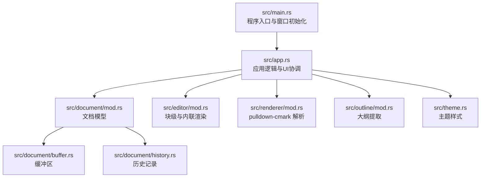
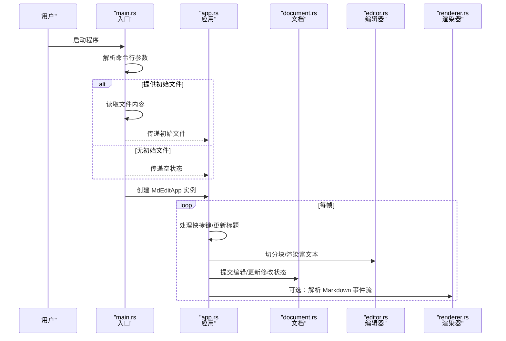

# 故障排除

<cite>
**本文引用的文件**
- [Cargo.toml](file://Cargo.toml)
- [README.md](file://README.md)
- [src/main.rs](file://src/main.rs)
- [src/app.rs](file://src/app.rs)
- [src/document/mod.rs](file://src/document/mod.rs)
- [src/document/buffer.rs](file://src/document/buffer.rs)
- [src/document/history.rs](file://src/document/history.rs)
- [src/editor/mod.rs](file://src/editor/mod.rs)
- [src/renderer/mod.rs](file://src/renderer/mod.rs)
- [src/theme.rs](file://src/theme.rs)
- [src/outline/mod.rs](file://src/outline/mod.rs)
- [.cargo/config.toml](file://.cargo/config.toml)
</cite>

## 目录
1. [简介](#简介)
2. [项目结构](#项目结构)
3. [核心组件](#核心组件)
4. [架构总览](#架构总览)
5. [详细组件分析](#详细组件分析)
6. [依赖分析](#依赖分析)
7. [性能考虑](#性能考虑)
8. [故障排除指南](#故障排除指南)
9. [结论](#结论)
10. [附录](#附录)

## 简介
本指南面向 mdedit 用户与开发者，聚焦于构建、运行、性能与跨平台兼容问题的系统化排查方法。内容覆盖编译错误、运行时异常、渲染与内存问题、以及 Windows 平台 MSYS2/MinGW64 的典型问题，并提供日志与调试技巧、性能优化建议及问题报告模板。

## 项目结构
mdedit 是基于 eframe/egui 的跨平台桌面应用，采用模块化组织：入口负责参数解析与窗口初始化；应用层协调文档、编辑器、大纲与主题；渲染层负责块级与内联语法解析；文档层管理缓冲区与历史记录；主题与概览模块分别提供样式与标题导航。

图表来源
- [src/main.rs:1-50](file://src/main.rs#L1-L50)
- [src/app.rs:1-351](file://src/app.rs#L1-L351)
- [src/document/mod.rs:1-51](file://src/document/mod.rs#L1-L51)
- [src/document/buffer.rs:1-30](file://src/document/buffer.rs#L1-L30)
- [src/document/history.rs:1-59](file://src/document/history.rs#L1-L59)
- [src/editor/mod.rs:1-349](file://src/editor/mod.rs#L1-L349)
- [src/renderer/mod.rs:1-143](file://src/renderer/mod.rs#L1-L143)
- [src/outline/mod.rs:1-27](file://src/outline/mod.rs#L1-L27)
- [src/theme.rs:1-22](file://src/theme.rs#L1-L22)

章节来源
- [src/main.rs:1-50](file://src/main.rs#L1-L50)
- [src/app.rs:1-351](file://src/app.rs#L1-L351)
- [src/document/mod.rs:1-51](file://src/document/mod.rs#L1-L51)
- [src/editor/mod.rs:1-349](file://src/editor/mod.rs#L1-L349)
- [src/renderer/mod.rs:1-143](file://src/renderer/mod.rs#L1-L143)
- [src/outline/mod.rs:1-27](file://src/outline/mod.rs#L1-L27)
- [src/theme.rs:1-22](file://src/theme.rs#L1-L22)

## 核心组件
- 应用入口与窗口
  - 初始化窗口尺寸与最小尺寸，调用 eframe 运行原生应用，传入应用构造器。
  - 若命令行提供路径，尝试读取文件内容并在错误时弹出对话框提示。
- 应用逻辑
  - 字体配置：按平台选择中文字体路径，加载到 egui 上下文。
  - 快捷键处理：支持新建、打开、保存、另存为、加粗、斜体等。
  - UI 布局：顶部工具栏、侧边大纲、中央编辑区域。
  - 编辑流程：将文档内容切分为块，渲染富文本块或进入文本编辑态，提交修改后更新大纲。
- 文档模型
  - Buffer：字符串缓冲区，支持替换与切片。
  - History：编辑操作记录，支持撤销/重做。
  - Document：封装路径、缓冲区、修改状态与历史。
- 渲染与解析
  - editor 模块：块级类型识别与渲染（标题、段落、代码块、引用、列表、表格、分割线、空行）。
  - renderer 模块：使用 pulldown-cmark 解析 Markdown 事件流，生成块结构。
- 主题与大纲
  - Theme：标题字号、代码背景、引用条颜色、正文与弱化色。
  - Outline：从文档中提取标题层级与行号，用于导航。

章节来源
- [src/main.rs:15-33](file://src/main.rs#L15-L33)
- [src/main.rs:35-49](file://src/main.rs#L35-L49)
- [src/app.rs:45-84](file://src/app.rs#L45-L84)
- [src/app.rs:90-114](file://src/app.rs#L90-L114)
- [src/app.rs:116-163](file://src/app.rs#L116-L163)
- [src/app.rs:251-328](file://src/app.rs#L251-L328)
- [src/document/mod.rs:9-50](file://src/document/mod.rs#L9-L50)
- [src/document/buffer.rs:5-29](file://src/document/buffer.rs#L5-L29)
- [src/document/history.rs:12-58](file://src/document/history.rs#L12-L58)
- [src/editor/mod.rs:24-149](file://src/editor/mod.rs#L24-L149)
- [src/editor/mod.rs:159-266](file://src/editor/mod.rs#L159-L266)
- [src/renderer/mod.rs:19-142](file://src/renderer/mod.rs#L19-L142)
- [src/theme.rs:11-21](file://src/theme.rs#L11-L21)
- [src/outline/mod.rs:7-26](file://src/outline/mod.rs#L7-L26)

## 架构总览
mdedit 的运行时控制流如下：

图表来源
- [src/main.rs:35-49](file://src/main.rs#L35-L49)
- [src/app.rs:187-249](file://src/app.rs#L187-L249)
- [src/app.rs:251-328](file://src/app.rs#L251-L328)
- [src/document/mod.rs:39-49](file://src/document/mod.rs#L39-L49)
- [src/editor/mod.rs:24-149](file://src/editor/mod.rs#L24-L149)
- [src/renderer/mod.rs:19-142](file://src/renderer/mod.rs#L19-L142)

## 详细组件分析

### 组件：应用与窗口初始化
- 关键点
  - 窗口尺寸与最小尺寸设置，避免过小导致布局异常。
  - 通过 eframe::run_native 启动应用生命周期。
  - 命令行参数解析与初始文件读取失败时的用户提示。
- 常见问题
  - 窗口尺寸过小导致 UI 截断。
  - 文件路径不存在或权限不足导致读取失败。
- 排查步骤
  - 确认命令行参数是否正确传递。
  - 检查文件路径是否存在且可读。
  - 在 Windows 上确认 MSYS2/MinGW64 环境变量已设置。

章节来源
- [src/main.rs:35-49](file://src/main.rs#L35-L49)
- [src/main.rs:15-33](file://src/main.rs#L15-L33)

### 组件：字体配置与平台差异
- 关键点
  - 按平台选择中文字体路径，若存在则注入到 egui 字体定义。
  - 不同平台字体路径不同，需确保路径存在。
- 常见问题
  - 字体路径不存在导致默认字体回退或显示异常。
  - macOS/Linux 字体路径不匹配导致中文字体缺失。
- 排查步骤
  - 检查对应平台字体路径是否存在。
  - 如不存在，手动指定可用字体或调整字体家族映射。

章节来源
- [src/app.rs:45-84](file://src/app.rs#L45-L84)

### 组件：快捷键与菜单交互
- 关键点
  - Ctrl+N/O/S、Ctrl+Shift+S、Ctrl+B/I 等快捷键处理。
  - 菜单按钮触发新建、打开、保存、另存为与视图切换。
- 常见问题
  - 快捷键无效：检查操作系统修饰键状态与 egui 输入上下文。
  - 菜单点击无响应：确认 UI 层事件未被遮挡或禁用。
- 排查步骤
  - 使用 egui Inspect 查看输入事件是否到达应用。
  - 简化 UI 结构验证交互路径。

章节来源
- [src/app.rs:90-114](file://src/app.rs#L90-L114)
- [src/app.rs:192-218](file://src/app.rs#L192-L218)

### 组件：编辑与提交流程
- 关键点
  - 将文档内容切分为块，渲染富文本块或进入文本编辑态。
  - 提交编辑时根据块范围替换缓冲区内容，更新修改状态与大纲。
- 常见问题
  - 编辑后内容未同步：检查块范围计算与缓冲区替换逻辑。
  - 大纲未更新：确认提交后是否重新提取大纲。
- 排查步骤
  - 对照块起止行号，核对替换位置与内容。
  - 观察修改状态变化与大纲项数量。

章节来源
- [src/app.rs:251-328](file://src/app.rs#L251-L328)
- [src/editor/mod.rs:24-149](file://src/editor/mod.rs#L24-L149)

### 组件：文档模型（缓冲区与历史）
- 关键点
  - Buffer 提供切片与替换能力，History 记录编辑操作并支持撤销/重做。
  - Document 封装路径、缓冲区、修改状态与历史。
- 常见问题
  - 替换范围越界：检查偏移与长度是否在缓冲区内。
  - 历史栈不一致：确认撤销/重做的逆操作是否正确压入另一栈。
- 排查步骤
  - 打印缓冲区长度与替换范围，确保合法。
  - 手动执行一次撤销/重做，观察两栈变化。

章节来源
- [src/document/buffer.rs:18-24](file://src/document/buffer.rs#L18-L24)
- [src/document/history.rs:20-57](file://src/document/history.rs#L20-L57)
- [src/document/mod.rs:39-49](file://src/document/mod.rs#L39-L49)

### 组件：渲染与解析（editor 与 renderer）
- 关键点
  - editor：块级类型识别与渲染，内联样式（粗体、斜体、行内代码）。
  - renderer：pulldown-cmark 解析事件流，生成块结构（标题、段落、代码块、引用、列表、规则）。
- 常见问题
  - 渲染错位：检查块起止行号与渲染顺序。
  - 解析异常：确认 Markdown 语法是否符合规范。
- 排查步骤
  - 输出块级类型与起止行号，逐项核对。
  - 使用最小化示例验证解析器行为。

章节来源
- [src/editor/mod.rs:24-149](file://src/editor/mod.rs#L24-L149)
- [src/editor/mod.rs:159-266](file://src/editor/mod.rs#L159-L266)
- [src/renderer/mod.rs:19-142](file://src/renderer/mod.rs#L19-L142)

### 组件：主题与大纲
- 关键点
  - Theme 定义标题字号、代码背景、引用条颜色等。
  - Outline 从文档中提取标题层级与行号。
- 常见问题
  - 主题颜色不生效：确认 egui 上下文中的颜色设置。
  - 大纲为空：检查标题语法与提取逻辑。
- 排查步骤
  - 在渲染函数中打印标题级别与行号，验证提取结果。
  - 调整主题字段值观察效果。

章节来源
- [src/theme.rs:11-21](file://src/theme.rs#L11-L21)
- [src/outline/mod.rs:7-26](file://src/outline/mod.rs#L7-L26)

## 依赖分析
- 依赖关系
  - eframe/egui：UI 框架与渲染。
  - pulldown-cmark：Markdown 解析。
  - syntect：语法高亮（默认启用部分特性）。
  - rfd：跨平台文件对话框。
- 发布配置
  - release 配置开启 LTO、符号裁剪与压缩，有利于减小体积。
- 常见问题
  - 依赖版本冲突：检查 Cargo.lock 中 thiserror 版本。
  - 构建时间长：release 配置已启用 LTO，可进一步优化编译器参数。
- 排查步骤
  - 更新依赖并清理缓存后重试。
  - 使用 cargo tree 检查依赖树。

章节来源
- [Cargo.toml:8-19](file://Cargo.toml#L8-L19)
- [.cargo/config.toml:1-2](file://.cargo/config.toml#L1-L2)

## 性能考虑
- 渲染性能
  - 大文档渲染：将内容切分为块，仅在需要时渲染富文本块，减少重排。
  - 滚动与焦点：在富文本编辑与富文本渲染之间切换时，注意焦点丢失与提交时机。
- 内存使用
  - 缓冲区：使用 String 作为基础存储，频繁替换时注意容量增长策略。
  - 历史记录：撤销栈随编辑增长，建议限制最大容量或周期性清理。
- 发布优化
  - 开启 LTO、符号裁剪与压缩，有助于减小二进制体积与提升运行时性能。
- 诊断建议
  - 使用 egui Inspect 观察帧率与绘制项数量。
  - 分模块测量渲染耗时，定位瓶颈。

章节来源
- [src/app.rs:251-328](file://src/app.rs#L251-L328)
- [src/document/buffer.rs:5-29](file://src/document/buffer.rs#L5-L29)
- [src/document/history.rs:12-58](file://src/document/history.rs#L12-L58)
- [Cargo.toml:15-19](file://Cargo.toml#L15-L19)

## 故障排除指南

### 一、编译错误
- Windows（MSYS2/MinGW64）
  - 症状：找不到工具链或链接失败。
  - 解决：确保已设置 PATH 与 LIBRARY_PATH，参考构建说明。
  - 验证：在终端执行 rustc -V 与 cargo build --release。
- 依赖冲突
  - 症状：编译报错涉及版本不兼容。
  - 解决：更新依赖并清理缓存后重试。
  - 验证：查看 Cargo.lock 中 thiserror 版本一致性。
- 代码生成错误
  - 症状：构建过程中出现 OpenGL/EGL 函数未加载。
  - 解决：确保显卡驱动与图形环境正常；必要时切换软件渲染或降级相关依赖。
  - 验证：在安全模式或最小化环境中运行以排除第三方干扰。

章节来源
- [README.md:13-27](file://README.md#L13-L27)
- [Cargo.toml:8-19](file://Cargo.toml#L8-L19)

### 二、运行时异常
- 文件读取失败
  - 症状：打开文件时弹出错误对话框。
  - 排查：确认文件路径存在、可读且非只读占用。
  - 解决：更换文件或修复权限。
- 字体加载失败
  - 症状：界面文字显示异常或字体回退。
  - 排查：检查平台字体路径是否存在。
  - 解决：手动指定可用字体或调整字体家族映射。
- UI 无响应
  - 症状：快捷键或菜单点击无效。
  - 排查：使用 egui Inspect 检查输入事件是否到达应用。
  - 解决：简化 UI 或修复事件拦截。

章节来源
- [src/main.rs:15-33](file://src/main.rs#L15-L33)
- [src/app.rs:45-84](file://src/app.rs#L45-L84)
- [src/app.rs:90-114](file://src/app.rs#L90-L114)

### 三、性能问题
- 冷启动慢
  - 症状：启动时间超过预期。
  - 排查：检查字体加载与资源初始化是否阻塞主线程。
  - 优化：延迟加载非关键资源，预热常用字体。
- 渲染卡顿
  - 症状：滚动或编辑时掉帧。
  - 排查：使用 egui Inspect 观察绘制项数量与帧率。
  - 优化：减少一次性渲染的大块内容，拆分渲染批次。
- 内存占用高
  - 症状：长时间编辑后内存持续增长。
  - 排查：检查缓冲区与历史栈大小。
  - 优化：限制历史栈容量，定期清理未使用的中间数据。

章节来源
- [src/app.rs:251-328](file://src/app.rs#L251-L328)
- [src/document/buffer.rs:5-29](file://src/document/buffer.rs#L5-L29)
- [src/document/history.rs:12-58](file://src/document/history.rs#L12-L58)
- [Cargo.toml:15-19](file://Cargo.toml#L15-L19)

### 四、跨平台特定问题
- Windows
  - MSYS2/MinGW64：确保 PATH/LIBRARY_PATH 正确设置，避免与系统 MSVC 工具链冲突。
  - 显卡驱动：若出现图形初始化问题，尝试更新驱动或切换软件渲染。
- macOS
  - 字体路径：确认系统字体路径存在，必要时回退到默认字体族。
- Linux
  - 字体与依赖：确保系统安装了 Noto CJK 字体与必要的 GTK/X11 依赖。

章节来源
- [README.md:13-27](file://README.md#L13-L27)
- [src/app.rs:45-84](file://src/app.rs#L45-L84)

### 五、日志分析与调试工具
- 日志输出
  - 在关键路径添加日志（如块级类型、起止行号、缓冲区长度变化）。
- 调试工具
  - egui Inspect：检查输入事件、绘制项与帧率。
  - 任务管理器/系统监视器：观察 CPU、内存与 GPU 使用。
- 断点与最小化复现
  - 将问题缩小到最小 Markdown 示例，逐步添加复杂度定位根因。

章节来源
- [src/app.rs:251-328](file://src/app.rs#L251-L328)

### 六、问题报告模板
- 基本信息
  - 平台与版本：操作系统、Rust 版本、mdedit 版本。
  - 构建方式：是否使用 release 配置。
- 复现步骤
  - 详细列出操作步骤与触发条件。
- 预期与实际结果
  - 明确期望行为与实际表现。
- 日志与截图
  - 提供相关日志片段与关键界面截图。
- 附加信息
  - 依赖版本、硬件配置、第三方软件影响等。

## 结论
通过系统化的构建、运行与性能排查方法，结合平台特定注意事项与调试工具，大多数问题均可快速定位与解决。建议在开发与发布前完成跨平台验证与性能基线测试，确保用户体验稳定流畅。

## 附录

### A. 常见错误与解决对照表
- 构建失败（Windows）
  - 症状：找不到工具链或链接错误
  - 解决：设置 PATH 与 LIBRARY_PATH，使用 MSYS2/MinGW64
- 运行失败（文件读取）
  - 症状：打开文件弹窗错误
  - 解决：检查路径与权限
- 渲染异常（字体）
  - 症状：中文字体缺失或显示异常
  - 解决：确认平台字体路径存在或回退默认字体
- 性能异常（内存/渲染）
  - 症状：内存增长或卡顿
  - 解决：限制历史栈、拆分渲染批次、延迟加载资源

### B. 诊断流程图（概念）
