# Controller 层实现

<cite>
**本文档引用的文件**
- [app.rs](file://src/app.rs)
- [main.rs](file://src/main.rs)
- [mod.rs](file://src/document/mod.rs)
- [buffer.rs](file://src/document/buffer.rs)
- [history.rs](file://src/document/history.rs)
- [mod.rs](file://src/editor/mod.rs)
- [mod.rs](file://src/outline/mod.rs)
- [mod.rs](file://src/renderer/mod.rs)
- [theme.rs](file://src/theme.rs)
- [Cargo.toml](file://Cargo.toml)
</cite>

## 目录
1. [简介](#简介)
2. [项目结构](#项目结构)
3. [核心组件](#核心组件)
4. [架构概览](#架构概览)
5. [详细组件分析](#详细组件分析)
6. [依赖关系分析](#依赖关系分析)
7. [性能考虑](#性能考虑)
8. [故障排除指南](#故障排除指南)
9. [结论](#结论)

## 简介

MdEdit 是一个轻量级跨平台 Markdown 编辑器，采用 Rust 和 eframe 框架构建。本文档深入分析 Controller 层实现，重点解释 MdEditApp 作为控制器的核心职责和实现机制。控制器层负责协调各个模块，包括文档管理、用户交互处理、状态同步等功能，确保应用程序的流畅运行和良好的用户体验。

## 项目结构

MdEdit 项目采用模块化设计，按照功能域进行组织：

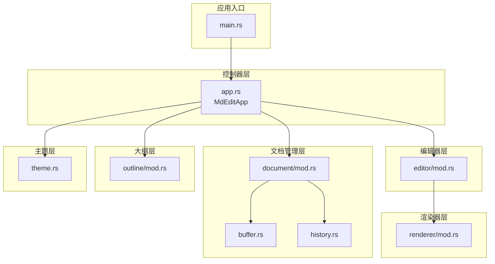

**图表来源**
- [main.rs:35-49](file://src/main.rs#L35-L49)
- [app.rs:9-17](file://src/app.rs#L9-L17)
- [document/mod.rs:9-14](file://src/document/mod.rs#L9-L14)

**章节来源**
- [Cargo.toml:1-19](file://Cargo.toml#L1-L19)
- [main.rs:1-50](file://src/main.rs#L1-L50)

## 核心组件

### MdEditApp 结构体

MdEditApp 是整个应用程序的控制器核心，负责协调所有子系统：

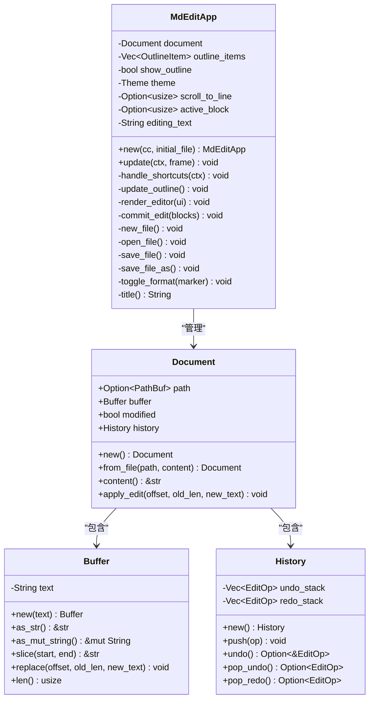

**图表来源**
- [app.rs:9-17](file://src/app.rs#L9-L17)
- [document/mod.rs:9-14](file://src/document/mod.rs#L9-L14)
- [document/buffer.rs:1-30](file://src/document/buffer.rs#L1-L30)
- [document/history.rs:7-10](file://src/document/history.rs#L7-L10)

### 关键数据结构

#### 文档管理结构
- **Document**: 封装文件路径、缓冲区、修改状态和历史记录
- **Buffer**: 提供高效的文本缓冲区操作
- **History**: 实现撤销/重做功能

#### 编辑器结构
- **TextBlock**: 表示 Markdown 块级元素及其位置信息
- **BlockKind**: 定义支持的块级元素类型（标题、段落、代码块等）

**章节来源**
- [app.rs:9-17](file://src/app.rs#L9-L17)
- [document/mod.rs:9-50](file://src/document/mod.rs#L9-L50)
- [editor/mod.rs:4-22](file://src/editor/mod.rs#L4-L22)

## 架构概览

MdEdit 采用 MVC（Model-View-Controller）架构模式，其中控制器层承担以下职责：

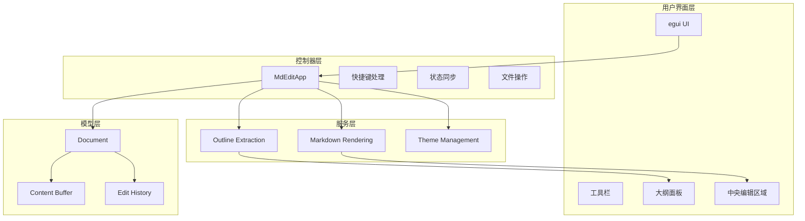

**图表来源**
- [app.rs:187-249](file://src/app.rs#L187-L249)
- [app.rs:251-328](file://src/app.rs#L251-L328)

## 详细组件分析

### 快捷键系统实现

MdEditApp 的快捷键系统通过 `handle_shortcuts` 方法实现，提供完整的键盘事件处理机制：

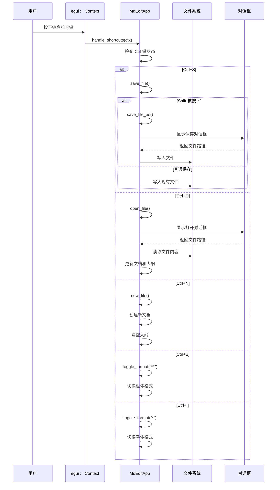

**图表来源**
- [app.rs:90-114](file://src/app.rs#L90-L114)
- [app.rs:116-175](file://src/app.rs#L116-L175)

#### 快捷键处理流程

快捷键系统采用条件判断机制，支持以下功能：
- **文件操作**: Ctrl+N（新建）、Ctrl+O（打开）、Ctrl+S（保存）、Ctrl+Shift+S（另存为）
- **格式切换**: Ctrl+B（粗体）、Ctrl+I（斜体）
- **状态管理**: 自动检测修饰键状态和按键事件

**章节来源**
- [app.rs:90-114](file://src/app.rs#L90-L114)

### 文件操作功能实现

#### 新建文件 (new_file)

新建文件功能创建一个空白的 Markdown 文档：

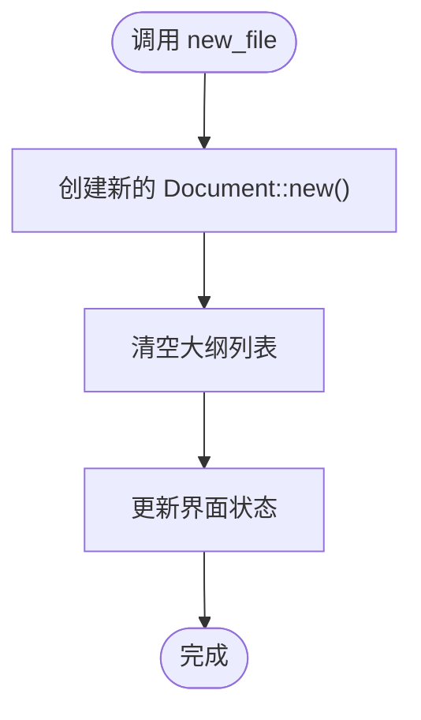

**图表来源**
- [app.rs:116-119](file://src/app.rs#L116-L119)

#### 打开文件 (open_file)

打开文件功能提供文件选择对话框并加载内容：

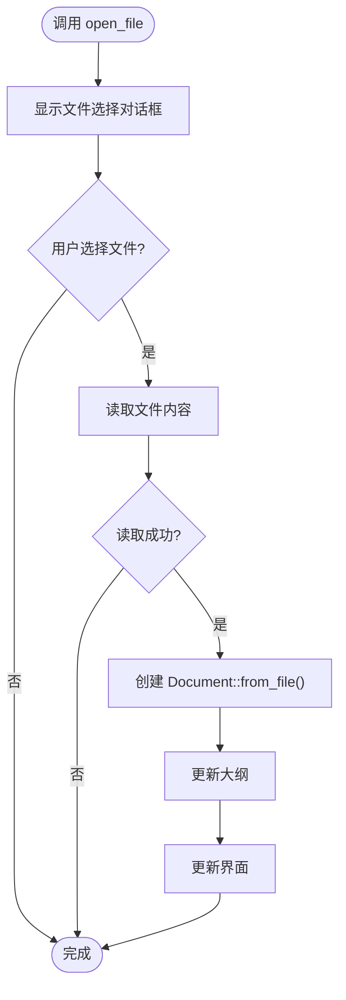

**图表来源**
- [app.rs:121-131](file://src/app.rs#L121-L131)

#### 保存文件 (save_file)

保存文件功能根据文档是否有路径决定保存策略：

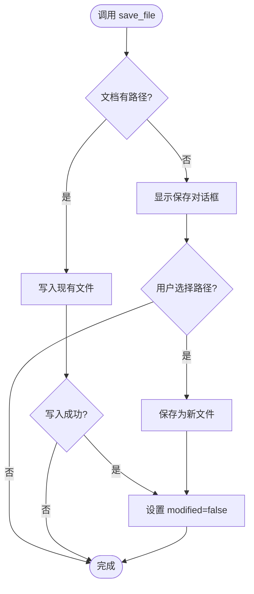

**图表来源**
- [app.rs:133-151](file://src/app.rs#L133-L151)

**章节来源**
- [app.rs:116-175](file://src/app.rs#L116-L175)

### 大纲更新机制

大纲更新通过 `update_outline` 方法实现，实时同步文档内容变化：

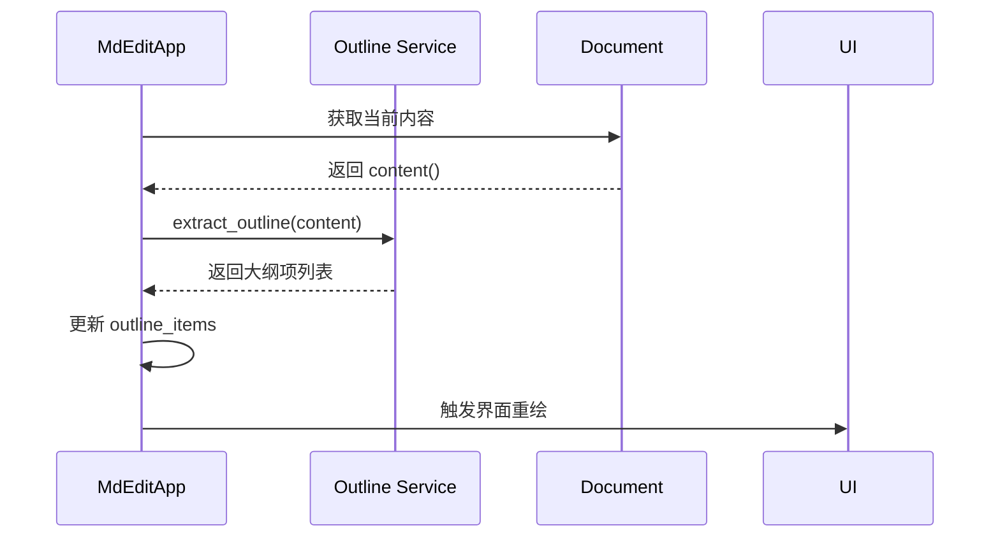

**图表来源**
- [app.rs:86-88](file://src/app.rs#L86-L88)
- [outline/mod.rs:7-26](file://src/outline/mod.rs#L7-L26)

#### 大纲提取算法

大纲提取支持以下标题级别：
- **H1-H6**: 通过 `#` 字符数量确定标题级别
- **标题内容**: 移除前导字符后的内容
- **行号映射**: 保持与源文档的行号对应关系

**章节来源**
- [app.rs:86-88](file://src/app.rs#L86-L88)
- [outline/mod.rs:7-26](file://src/outline/mod.rs#L7-L26)

### 滚动定位功能

滚动定位通过 `scroll_to_line` 机制实现精确跳转：

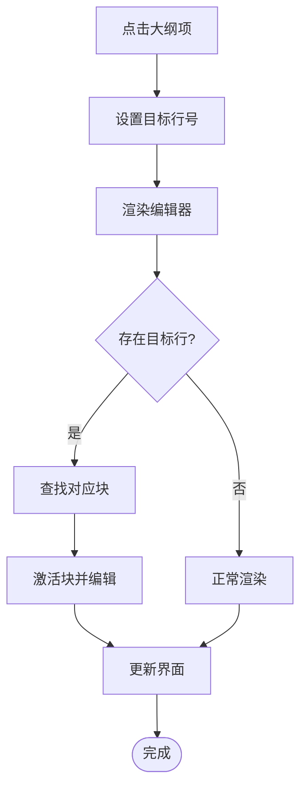

**图表来源**
- [app.rs:256-264](file://src/app.rs#L256-L264)
- [app.rs:330-349](file://src/app.rs#L330-L349)

#### 滚动定位实现细节

1. **目标行设置**: 点击大纲项时设置 `scroll_to_line`
2. **块匹配**: 遍历文本块找到包含目标行的块
3. **精确跳转**: 将光标定位到目标块并进入编辑模式
4. **状态同步**: 更新活动块索引和编辑文本

**章节来源**
- [app.rs:256-264](file://src/app.rs#L256-L264)
- [app.rs:330-349](file://src/app.rs#L330-L349)

### 编辑器渲染系统

编辑器渲染系统采用混合模式，结合富文本渲染和直接编辑：

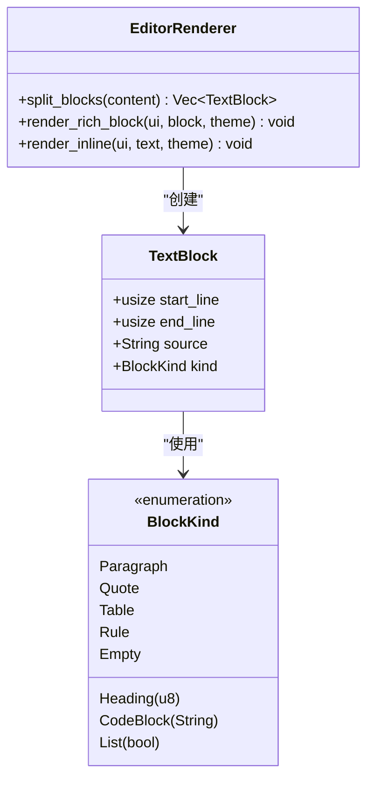

**图表来源**
- [editor/mod.rs:24-149](file://src/editor/mod.rs#L24-L149)
- [editor/mod.rs:159-266](file://src/editor/mod.rs#L159-L266)

#### 块级元素识别算法

编辑器能够智能识别以下 Markdown 元素：
- **标题**: `#` 开头的行，支持 H1-H6
- **段落**: 连续的非空行
- **代码块**: 三反引号包围的代码
- **引用块**: 以 `>` 开头的块
- **列表**: 无序 (`-`, `*`, `+`) 和有序列表
- **表格**: 使用管道分隔的表格
- **规则线**: `---`, `***`, `___`

**章节来源**
- [editor/mod.rs:24-149](file://src/editor/mod.rs#L24-L149)

### 状态同步机制

MdEditApp 实现了多层次的状态同步机制：

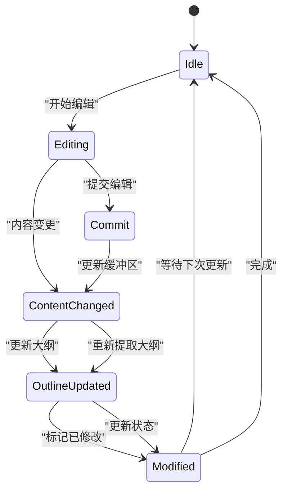

**图表来源**
- [app.rs:275-278](file://src/app.rs#L275-L278)
- [app.rs:325-327](file://src/app.rs#L325-L327)

#### 同步触发点

状态同步在以下情况下自动触发：
- **内容变更**: 文本编辑器内容发生变化
- **块激活**: 点击其他块进行切换
- **焦点丢失**: 编辑器失去焦点时自动提交
- **手动触发**: 用户操作或快捷键执行

**章节来源**
- [app.rs:275-278](file://src/app.rs#L275-L278)
- [app.rs:325-327](file://src/app.rs#L325-L327)

## 依赖关系分析

### 外部依赖

MdEdit 项目依赖以下关键库：

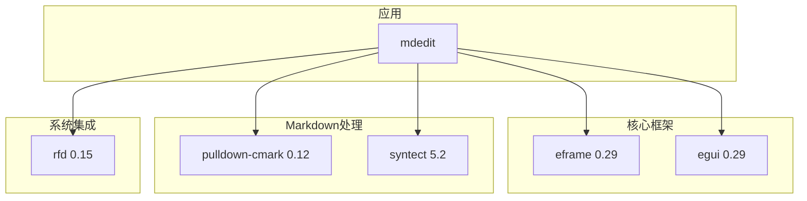

**图表来源**
- [Cargo.toml:8-13](file://Cargo.toml#L8-L13)

### 内部模块依赖

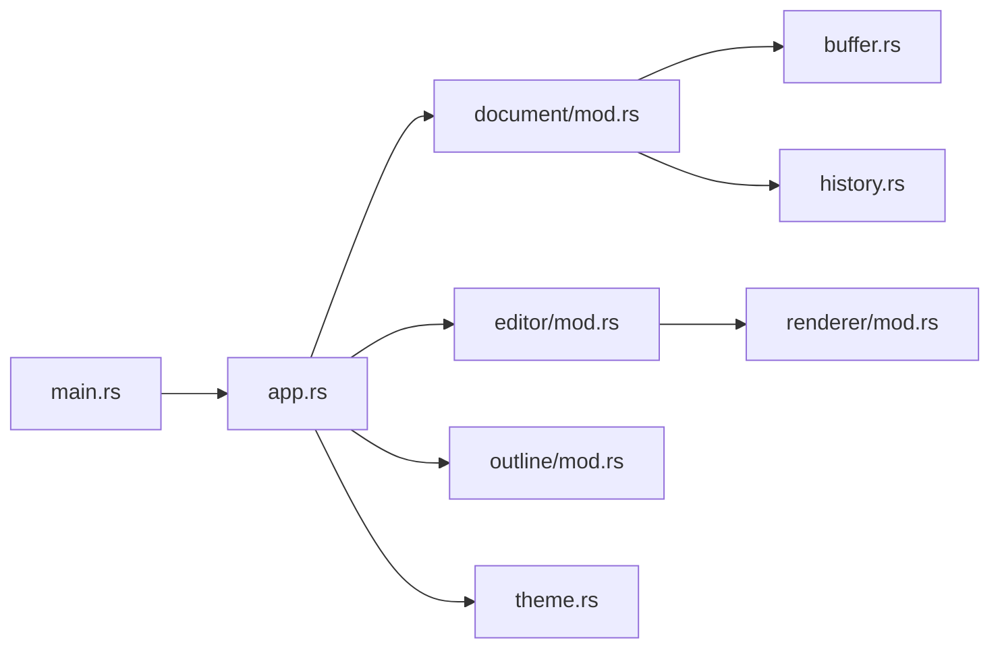

**图表来源**
- [main.rs:3-8](file://src/main.rs#L3-L8)
- [app.rs:1-7](file://src/app.rs#L1-L7)

**章节来源**
- [Cargo.toml:8-13](file://Cargo.toml#L8-L13)

## 性能考虑

### 内存管理优化

1. **缓冲区复用**: 使用 `Buffer` 结构避免不必要的字符串复制
2. **增量更新**: 只在必要时重建大纲和渲染树
3. **懒加载**: 大纲面板按需显示，减少初始内存占用

### 渲染性能优化

1. **块级缓存**: 将 Markdown 解析结果缓存到 `TextBlock` 结构中
2. **增量渲染**: 只重新渲染发生变更的块
3. **虚拟滚动**: 使用 `egui::ScrollArea` 实现大文档的高效滚动

### 文件操作优化

1. **异步文件对话框**: 使用 `rfd` 库提供的异步文件选择
2. **增量保存**: 只保存变更的部分而不是整个文档
3. **错误恢复**: 在文件操作失败时提供用户友好的错误提示

## 故障排除指南

### 常见问题及解决方案

#### 快捷键不响应

**症状**: 按下 Ctrl+S 等快捷键无反应

**可能原因**:
- 修饰键检测失败
- egui 上下文未正确传递
- 操作系统快捷键冲突

**解决步骤**:
1. 检查 `handle_shortcuts` 方法中的修饰键检测逻辑
2. 确认 `ctx.input(|i| i.modifiers.ctrl)` 调用正确
3. 验证 egui 上下文是否正确传递给控制器

#### 文件保存失败

**症状**: 保存文件时报错或文件未更新

**可能原因**:
- 文件权限问题
- 路径无效
- 磁盘空间不足

**解决步骤**:
1. 检查文件路径的有效性
2. 验证目标目录的写入权限
3. 确认磁盘空间充足
4. 查看返回的错误信息

#### 大纲不同步

**症状**: 修改文档后大纲未更新

**可能原因**:
- 大纲更新调用缺失
- 内容变更检测失败
- 界面重绘未触发

**解决步骤**:
1. 确保在内容变更时调用 `update_outline()`
2. 检查 `changed()` 事件的触发
3. 验证 UI 重绘机制

**章节来源**
- [app.rs:90-114](file://src/app.rs#L90-L114)
- [app.rs:133-151](file://src/app.rs#L133-L151)
- [app.rs:86-88](file://src/app.rs#L86-L88)

## 结论

MdEditApp 控制器层实现了优雅的 MVC 架构模式，通过精心设计的状态管理和模块协调机制，提供了流畅的 Markdown 编辑体验。控制器的核心优势包括：

1. **清晰的职责分离**: 每个模块都有明确的职责边界
2. **高效的事件处理**: 快捷键系统和用户交互处理机制
3. **实时状态同步**: 文档、大纲和界面状态的自动同步
4. **可扩展的设计**: 模块化架构便于功能扩展和维护

通过本文档的详细分析，开发者可以深入理解 MdEdit 的控制器实现原理，并在此基础上进行功能扩展或问题排查。控制器层的设计为构建复杂桌面应用程序提供了优秀的参考范例。