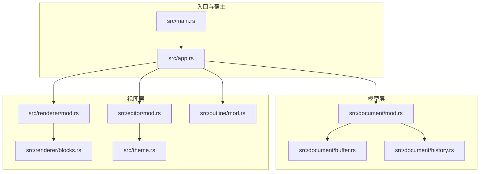
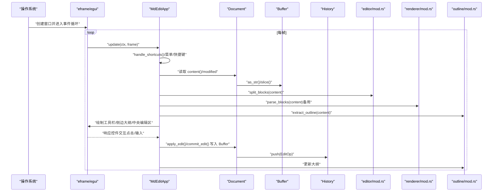
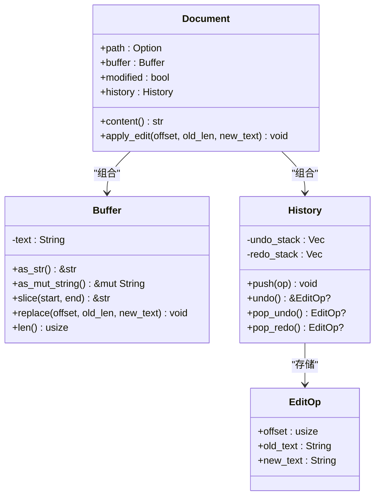
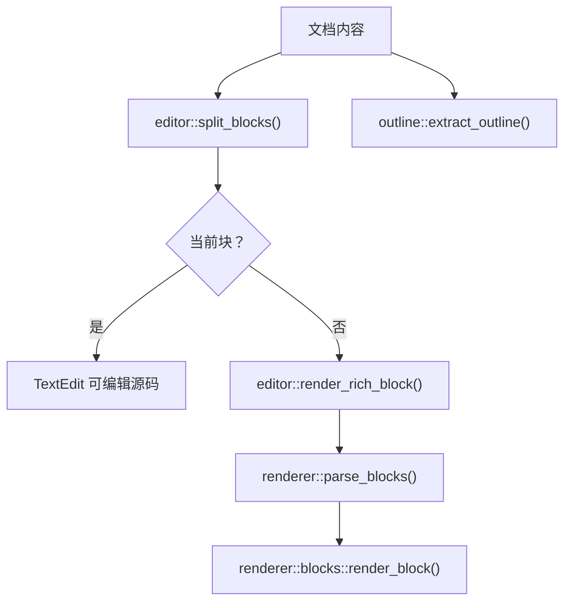
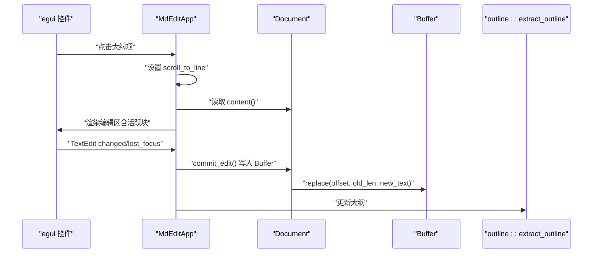
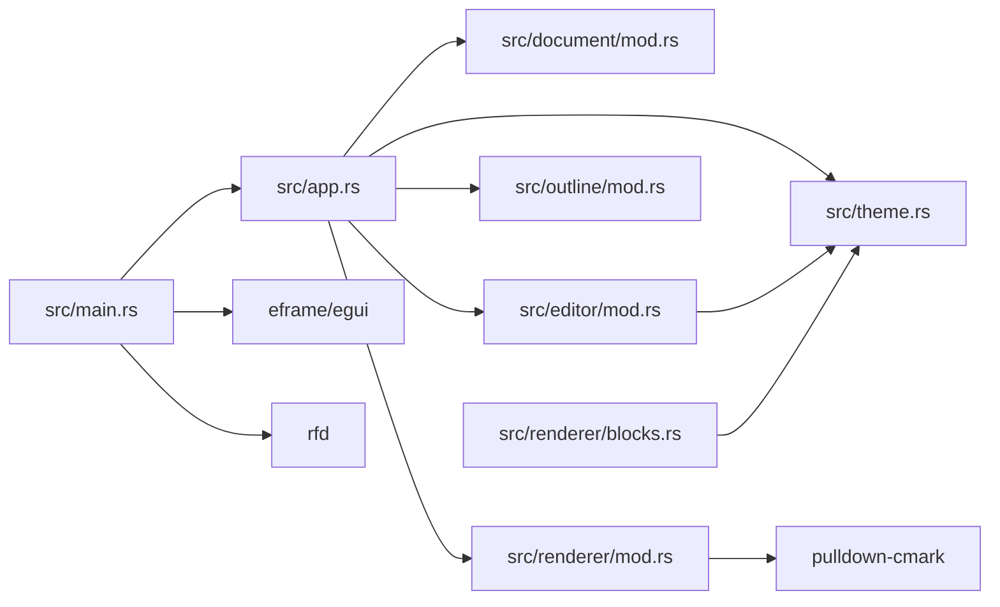

# MVC 交互机制

<cite>
**本文引用的文件**
- [src/main.rs](file://src/main.rs)
- [src/app.rs](file://src/app.rs)
- [src/document/mod.rs](file://src/document/mod.rs)
- [src/document/buffer.rs](file://src/document/buffer.rs)
- [src/document/history.rs](file://src/document/history.rs)
- [src/editor/mod.rs](file://src/editor/mod.rs)
- [src/renderer/mod.rs](file://src/renderer/mod.rs)
- [src/renderer/blocks.rs](file://src/renderer/blocks.rs)
- [src/outline/mod.rs](file://src/outline/mod.rs)
- [src/theme.rs](file://src/theme.rs)
- [Cargo.toml](file://Cargo.toml)
- [docs/design.md](file://docs/design.md)
</cite>

## 目录
1. [简介](#简介)
2. [项目结构](#项目结构)
3. [核心组件](#核心组件)
4. [架构总览](#架构总览)
5. [详细组件分析](#详细组件分析)
6. [依赖分析](#依赖分析)
7. [性能考虑](#性能考虑)
8. [故障排查指南](#故障排查指南)
9. [结论](#结论)
10. [附录](#附录)

## 简介
本文件围绕 mdedit 的 MVC 交互机制进行系统性说明，重点解释三个层次之间的数据流向与控制流程，覆盖从用户输入到最终 UI 更新的完整路径；深入分析数据绑定机制（Model 变化如何驱动 View 更新）、事件传播机制（用户交互如何在 MVC 层之间传递与处理）、状态同步策略（如何维持 Model、View、Controller 之间的一致性），并结合即时模式 GUI 的特点，阐述每帧重新计算与渲染的实现方式。同时给出具体代码示例的路径标注，帮助读者定位实现细节。

## 项目结构
mdedit 采用基于功能域的模块组织方式，核心模块如下：
- 入口与宿主：main.rs、app.rs
- 模型层：document/mod.rs、document/buffer.rs、document/history.rs
- 视图层：editor/mod.rs、renderer/mod.rs、renderer/blocks.rs、outline/mod.rs、theme.rs
- 依赖：Cargo.toml（egui、pulldown-cmark、rfd 等）

图表来源
- [src/main.rs:1-50](file://src/main.rs#L1-L50)
- [src/app.rs:1-351](file://src/app.rs#L1-L351)
- [src/document/mod.rs:1-51](file://src/document/mod.rs#L1-L51)
- [src/document/buffer.rs:1-30](file://src/document/buffer.rs#L1-L30)
- [src/document/history.rs:1-59](file://src/document/history.rs#L1-L59)
- [src/editor/mod.rs:1-349](file://src/editor/mod.rs#L1-L349)
- [src/renderer/mod.rs:1-143](file://src/renderer/mod.rs#L1-L143)
- [src/renderer/blocks.rs:1-68](file://src/renderer/blocks.rs#L1-L68)
- [src/outline/mod.rs:1-27](file://src/outline/mod.rs#L1-L27)
- [src/theme.rs:1-22](file://src/theme.rs#L1-L22)

章节来源
- [src/main.rs:1-50](file://src/main.rs#L1-L50)
- [src/app.rs:1-351](file://src/app.rs#L1-L351)
- [Cargo.toml:1-19](file://Cargo.toml#L1-L19)

## 核心组件
- 模型（Model）：Document、Buffer、History
  - Document：封装文档路径、缓冲区、修改标记、历史记录
  - Buffer：提供字符串级的读写与切片能力
  - History：维护撤销/重做栈，记录 EditOp
- 视图（View）：editor/mod.rs（块级渲染与富文本内联）、renderer/mod.rs（pulldown-cmark 解析）、outline/mod.rs（大纲面板）、theme.rs（主题）
- 控制器（Controller）：app.rs（事件处理、菜单、快捷键、滚动与大纲联动）

章节来源
- [src/document/mod.rs:9-51](file://src/document/mod.rs#L9-L51)
- [src/document/buffer.rs:1-30](file://src/document/buffer.rs#L1-L30)
- [src/document/history.rs:1-59](file://src/document/history.rs#L1-L59)
- [src/editor/mod.rs:4-349](file://src/editor/mod.rs#L4-L349)
- [src/renderer/mod.rs:9-143](file://src/renderer/mod.rs#L9-L143)
- [src/outline/mod.rs:1-27](file://src/outline/mod.rs#L1-L27)
- [src/theme.rs:1-22](file://src/theme.rs#L1-L22)
- [src/app.rs:9-185](file://src/app.rs#L9-L185)

## 架构总览
mdedit 的 MVC 在即时模式 GUI（egui）中以“每帧重建”的方式实现：
- 每帧由 eframe 调用 App.update，控制器负责收集输入、更新状态、调度渲染
- 视图层根据当前模型状态生成 UI 响应，egui 决定绘制
- 模型层通过 Buffer 与 History 提供稳定的文本与历史操作接口

图表来源
- [src/app.rs:187-249](file://src/app.rs#L187-L249)
- [src/app.rs:251-328](file://src/app.rs#L251-L328)
- [src/document/mod.rs:35-50](file://src/document/mod.rs#L35-L50)
- [src/document/buffer.rs:10-24](file://src/document/buffer.rs#L10-L24)
- [src/document/history.rs:20-57](file://src/document/history.rs#L20-L57)
- [src/editor/mod.rs:24-149](file://src/editor/mod.rs#L24-L149)
- [src/renderer/mod.rs:19-142](file://src/renderer/mod.rs#L19-L142)
- [src/outline/mod.rs:7-26](file://src/outline/mod.rs#L7-L26)

## 详细组件分析

### 模型层（Model）
- Document：持有 Buffer 与 History，提供 content 访问与 apply_edit 接口，用于统一修改入口
- Buffer：提供字符串读取、切片与原地替换，是所有编辑操作的最终落点
- History：记录 EditOp，支持 push、undo、redo，配合 Document 的修改标记

图表来源
- [src/document/mod.rs:9-51](file://src/document/mod.rs#L9-L51)
- [src/document/buffer.rs:1-30](file://src/document/buffer.rs#L1-L30)
- [src/document/history.rs:1-59](file://src/document/history.rs#L1-L59)

章节来源
- [src/document/mod.rs:16-50](file://src/document/mod.rs#L16-L50)
- [src/document/buffer.rs:5-24](file://src/document/buffer.rs#L5-L24)
- [src/document/history.rs:12-57](file://src/document/history.rs#L12-L57)

### 视图层（View）
- editor/mod.rs：将文档拆分为 TextBlock，区分渲染块与可编辑块；提供 render_rich_block 与内联富文本解析
- renderer/mod.rs：使用 pulldown-cmark 解析为 Block 列表，供 blocks.rs 渲染
- outline/mod.rs：从文档提取标题大纲，支持点击跳转
- theme.rs：提供主题颜色与字号配置

图表来源
- [src/editor/mod.rs:24-149](file://src/editor/mod.rs#L24-L149)
- [src/editor/mod.rs:159-266](file://src/editor/mod.rs#L159-L266)
- [src/renderer/mod.rs:19-142](file://src/renderer/mod.rs#L19-L142)
- [src/renderer/blocks.rs:5-63](file://src/renderer/blocks.rs#L5-L63)
- [src/outline/mod.rs:7-26](file://src/outline/mod.rs#L7-L26)

章节来源
- [src/editor/mod.rs:24-349](file://src/editor/mod.rs#L24-L349)
- [src/renderer/mod.rs:9-143](file://src/renderer/mod.rs#L9-L143)
- [src/renderer/blocks.rs:1-68](file://src/renderer/blocks.rs#L1-L68)
- [src/outline/mod.rs:1-27](file://src/outline/mod.rs#L1-L27)
- [src/theme.rs:1-22](file://src/theme.rs#L1-L22)

### 控制器层（Controller）
- app.rs：实现 eframe::App，集中处理菜单、快捷键、面板布局、滚动与大纲联动；协调模型与视图
- 关键职责：
  - 输入收集：handle_shortcuts、菜单按钮、大纲点击
  - 状态管理：active_block、editing_text、scroll_to_line
  - 数据绑定：当模型内容变化时，触发大纲更新与视图刷新
  - 提交编辑：commit_edit 将编辑内容写回 Document.buffer

图表来源
- [src/app.rs:187-249](file://src/app.rs#L187-L249)
- [src/app.rs:251-328](file://src/app.rs#L251-L328)
- [src/app.rs:330-349](file://src/app.rs#L330-L349)
- [src/document/mod.rs:35-50](file://src/document/mod.rs#L35-L50)
- [src/document/buffer.rs:18-24](file://src/document/buffer.rs#L18-L24)
- [src/outline/mod.rs:7-26](file://src/outline/mod.rs#L7-L26)

章节来源
- [src/app.rs:9-185](file://src/app.rs#L9-L185)
- [src/app.rs:187-328](file://src/app.rs#L187-L328)

### 数据绑定机制与状态同步
- 单向数据流：用户输入经由 egui 事件回调到达控制器，控制器调用模型接口修改状态，随后控制器触发视图重绘
- 自动更新：当模型内容变更（如 apply_edit/commit_edit），控制器会重新提取大纲与渲染编辑区，确保视图与模型一致
- 状态一致性：
  - active_block 与 editing_text 仅在渲染阶段使用，不持久化，避免与模型脱节
  - scroll_to_line 为一次性滚动指令，读取后立即丢弃，防止重复触发
  - modified 标记由模型维护，标题栏动态反映

章节来源
- [src/app.rs:251-328](file://src/app.rs#L251-L328)
- [src/document/mod.rs:35-50](file://src/document/mod.rs#L35-L50)
- [src/outline/mod.rs:7-26](file://src/outline/mod.rs#L7-L26)

### 事件传播机制
- 用户事件（菜单、快捷键、点击、输入）由 egui 分发至控制器
- 控制器内部路由：handle_shortcuts 聚合键盘事件；菜单按钮触发对应方法；大纲点击设置滚动目标
- 事件到状态：控制器更新内部状态（active_block、editing_text、scroll_to_line），并在必要时调用模型接口
- 状态到视图：每帧渲染时，控制器根据当前状态决定哪些块渲染为源码、哪些渲染为富文本

章节来源
- [src/app.rs:90-185](file://src/app.rs#L90-L185)
- [src/app.rs:187-249](file://src/app.rs#L187-L249)

### 即时模式 GUI 下的 MVC 实现
- 每帧重建：控制器在 update 中重新分割块、渲染视图，不维护持久化的 UI 状态
- 松耦合设计：
  - 控制器仅依赖模型接口（content、apply_edit、modified），不关心渲染细节
  - 视图层通过 editor 与 renderer 模块解耦，渲染策略可替换
  - 主题与大纲独立模块，便于扩展
- 性能优化：
  - 按块渲染，光标移动仅重绘受影响块
  - 富文本内联解析在 editor::render_rich_block 中完成，避免重复解析

章节来源
- [src/app.rs:251-328](file://src/app.rs#L251-L328)
- [src/editor/mod.rs:24-149](file://src/editor/mod.rs#L24-L149)
- [docs/design.md:92-147](file://docs/design.md#L92-L147)

## 依赖分析
- 外部依赖：egui/eframe（GUI）、pulldown-cmark（解析）、rfd（文件对话框）、syntect（语法高亮）
- 内部模块依赖：app.rs 依赖 document、editor、outline、theme；editor 依赖 theme；renderer 依赖 pulldown-cmark 与 theme

图表来源
- [src/main.rs:10-13](file://src/main.rs#L10-L13)
- [src/app.rs:1-8](file://src/app.rs#L1-L8)
- [src/editor/mod.rs:1-3](file://src/editor/mod.rs#L1-L3)
- [src/renderer/mod.rs:7](file://src/renderer/mod.rs#L7)
- [Cargo.toml:8-13](file://Cargo.toml#L8-L13)

章节来源
- [Cargo.toml:8-13](file://Cargo.toml#L8-L13)
- [src/main.rs:10-13](file://src/main.rs#L10-L13)

## 性能考虑
- 按块渲染：减少每帧渲染计算量，块内编辑仅重解析当前块
- 字符串直接操作：简化数据结构，适合中小文档；超大文档可考虑 rope 替换
- 富文本内联解析：在 editor 中完成，避免重复解析
- 滚动与焦点：通过 scroll_to_line 与 active_block 控制，避免不必要的重绘

章节来源
- [docs/design.md:134-147](file://docs/design.md#L134-L147)
- [src/editor/mod.rs:24-149](file://src/editor/mod.rs#L24-L149)

## 故障排查指南
- 无法打开文件：检查 main.rs 中 load_initial_file 的错误提示逻辑与 rfd 对话框返回值
- 保存失败：确认 Document.path 是否已设置，写入后是否更新 modified 标记
- 大纲不同步：检查 commit_edit 后是否调用 outline::extract_outline 更新列表
- 快捷键无效：确认 handle_shortcuts 中修饰键与按键检测逻辑

章节来源
- [src/main.rs:15-33](file://src/main.rs#L15-L33)
- [src/app.rs:133-163](file://src/app.rs#L133-L163)
- [src/app.rs:86-88](file://src/app.rs#L86-L88)
- [src/app.rs:90-114](file://src/app.rs#L90-L114)

## 结论
mdedit 的 MVC 在即时模式 GUI 中通过“每帧重建”实现松耦合与高内聚：控制器集中处理事件与状态，模型提供稳定的数据访问与历史能力，视图层专注于渲染策略。该设计既满足了 Typora 式的所见即所得体验，又保持了良好的可维护性与扩展性。

## 附录
- 代码示例路径（仅路径，不含具体代码内容）：
  - 应用入口与初始化：[src/main.rs:35-49](file://src/main.rs#L35-L49)
  - 应用主循环与 UI 布局：[src/app.rs:187-249](file://src/app.rs#L187-L249)
  - 编辑区渲染与块切换：[src/app.rs:251-328](file://src/app.rs#L251-L328)
  - 提交编辑写回模型：[src/app.rs:330-349](file://src/app.rs#L330-L349)
  - 文档模型与历史：[src/document/mod.rs:16-50](file://src/document/mod.rs#L16-L50)
  - 文本缓冲区操作：[src/document/buffer.rs:18-24](file://src/document/buffer.rs#L18-L24)
  - 撤销/重做栈：[src/document/history.rs:20-57](file://src/document/history.rs#L20-L57)
  - 块级渲染与富文本内联：[src/editor/mod.rs:24-149](file://src/editor/mod.rs#L24-L149)
  - 块渲染实现：[src/editor/mod.rs:159-266](file://src/editor/mod.rs#L159-L266)
  - 解析为 Block 列表：[src/renderer/mod.rs:19-142](file://src/renderer/mod.rs#L19-L142)
  - 大纲提取：[src/outline/mod.rs:7-26](file://src/outline/mod.rs#L7-L26)
  - 主题配置：[src/theme.rs:11-21](file://src/theme.rs#L11-L21)