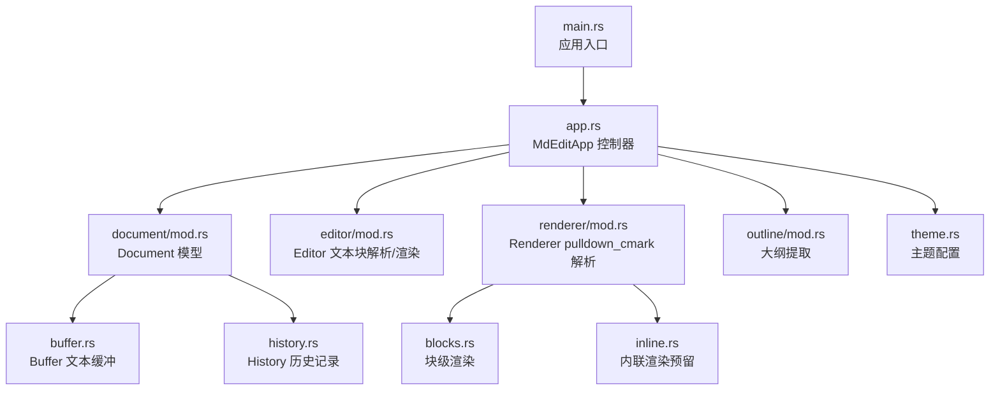
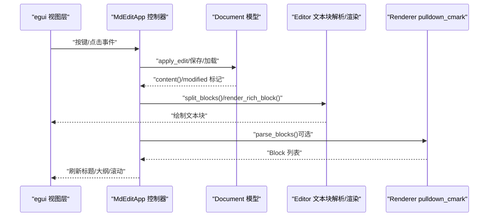
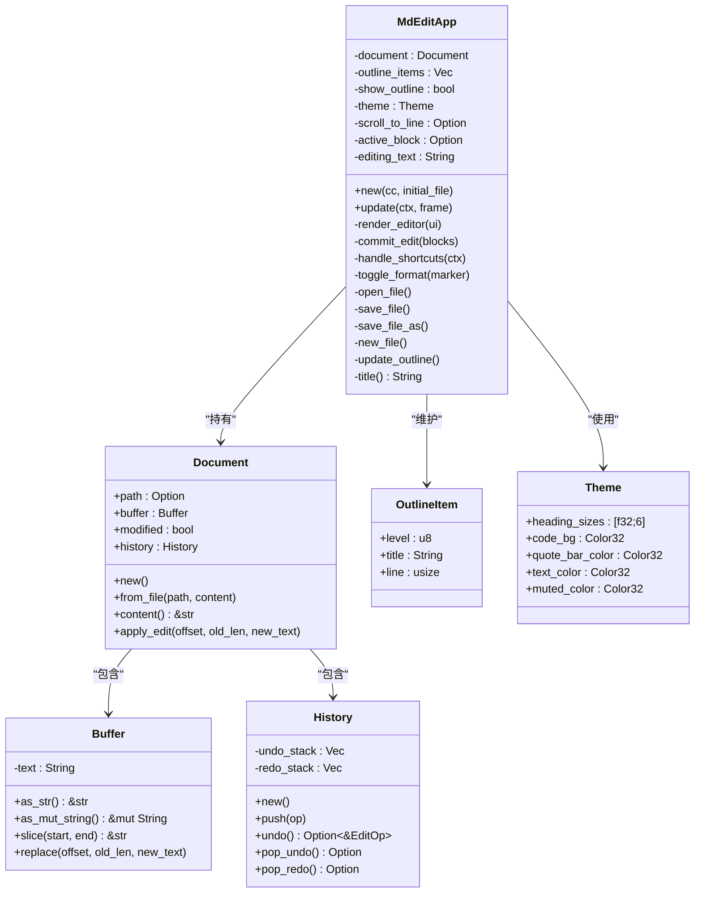
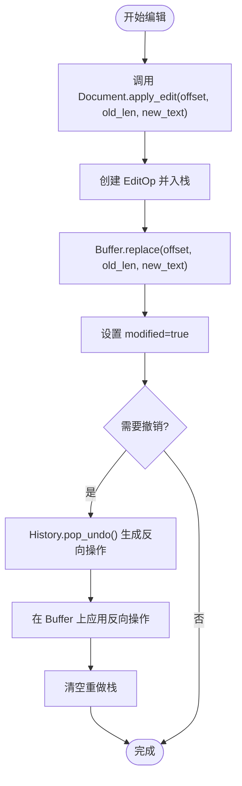
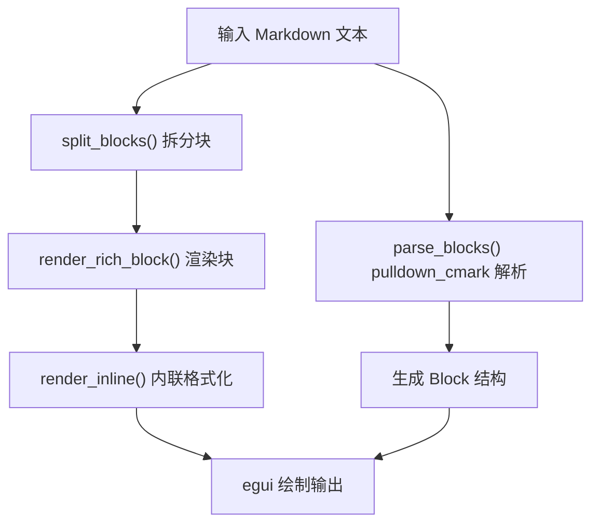
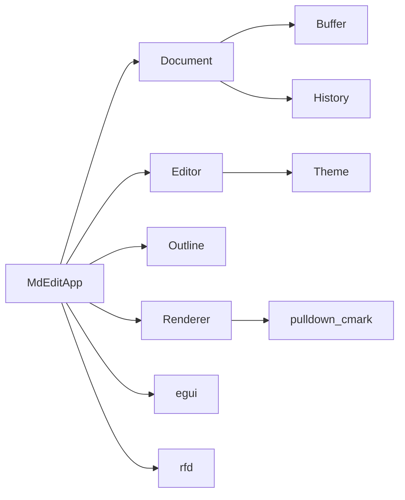

# MVC 设计模式应用

<cite>
**本文档引用的文件**
- [src/main.rs](file://src/main.rs)
- [src/app.rs](file://src/app.rs)
- [src/document/mod.rs](file://src/document/mod.rs)
- [src/document/buffer.rs](file://src/document/buffer.rs)
- [src/document/history.rs](file://src/document/history.rs)
- [src/editor/mod.rs](file://src/editor/mod.rs)
- [src/renderer/mod.rs](file://src/renderer/mod.rs)
- [src/renderer/blocks.rs](file://src/renderer/blocks.rs)
- [src/renderer/inline.rs](file://src/renderer/inline.rs)
- [src/outline/mod.rs](file://src/outline/mod.rs)
- [src/theme.rs](file://src/theme.rs)
- [README.md](file://README.md)
</cite>

## 目录
1. [简介](#简介)
2. [项目结构](#项目结构)
3. [核心组件](#核心组件)
4. [架构总览](#架构总览)
5. [详细组件分析](#详细组件分析)
6. [依赖关系分析](#依赖关系分析)
7. [性能考量](#性能考量)
8. [故障排除指南](#故障排除指南)
9. [结论](#结论)

## 简介
本文件系统性阐述 mdedit 在即时模式 GUI（egui）中对 MVC 设计模式的应用与实现细节。重点说明：
- Model 层（Document 及其子模块）如何封装文档数据、状态与历史记录；
- Controller 层（MdEditApp）如何协调各模块、处理用户交互并驱动状态更新；
- View 层（Editor 与 Renderer）如何将数据转换为可视化 Markdown 块；
- 在即时模式 GUI 下的数据绑定、状态同步与事件传播机制；
- 具体的交互流程与一致性维护策略。

## 项目结构
mdedit 采用清晰的模块化组织，遵循 MVC 分层职责：
- 应用入口与生命周期管理：main.rs
- 控制器：app.rs（MdEditApp）
- 模型：document/（buffer.rs、history.rs、mod.rs）
- 视图：editor/（文本块解析与渲染）、renderer/（pulldown_cmark 解析与渲染）
- 支持模块：outline/（大纲提取）、theme/（主题配置）

图表来源
- [src/main.rs:35-49](file://src/main.rs#L35-L49)
- [src/app.rs:9-17](file://src/app.rs#L9-L17)
- [src/document/mod.rs:9-14](file://src/document/mod.rs#L9-L14)
- [src/editor/mod.rs:4-22](file://src/editor/mod.rs#L4-L22)
- [src/renderer/mod.rs:9-17](file://src/renderer/mod.rs#L9-L17)
- [src/outline/mod.rs:1-5](file://src/outline/mod.rs#L1-L5)
- [src/theme.rs:3-9](file://src/theme.rs#L3-L9)

章节来源
- [src/main.rs:1-50](file://src/main.rs#L1-L50)
- [src/app.rs:1-351](file://src/app.rs#L1-L351)
- [src/document/mod.rs:1-51](file://src/document/mod.rs#L1-L51)
- [src/editor/mod.rs:1-349](file://src/editor/mod.rs#L1-L349)
- [src/renderer/mod.rs:1-143](file://src/renderer/mod.rs#L1-L143)
- [src/outline/mod.rs:1-27](file://src/outline/mod.rs#L1-L27)
- [src/theme.rs:1-22](file://src/theme.rs#L1-L22)

## 核心组件
- 控制器（Controller）：MdEditApp
  - 职责：初始化文档、处理快捷键与菜单、协调编辑器与渲染器、维护大纲与滚动定位、驱动状态变更与持久化。
  - 关键字段：Document、outline_items、show_outline、theme、scroll_to_line、active_block、editing_text。
- 模型（Model）：Document
  - 职责：持有文档路径、文本缓冲、修改标记、历史记录；提供内容读取与编辑应用接口。
  - 子模块：Buffer（字符串缓冲与切片替换）、History（编辑操作记录与撤销/重做）。
- 视图（View）：Editor 与 Renderer
  - Editor：将文档内容拆分为文本块（Heading、CodeBlock、Quote、List、Table、Rule、Paragraph），并渲染富文本块。
  - Renderer：使用 pulldown_cmark 解析 Markdown，生成 Block 结构并渲染（当前主要通过 Editor 渲染，Renderer 提供解析能力）。

章节来源
- [src/app.rs:9-17](file://src/app.rs#L9-L17)
- [src/document/mod.rs:9-14](file://src/document/mod.rs#L9-L14)
- [src/document/buffer.rs:1-29](file://src/document/buffer.rs#L1-L29)
- [src/document/history.rs:1-59](file://src/document/history.rs#L1-L59)
- [src/editor/mod.rs:4-22](file://src/editor/mod.rs#L4-L22)
- [src/renderer/mod.rs:9-17](file://src/renderer/mod.rs#L9-L17)

## 架构总览
mdedit 在 egui 即时模式 GUI 中实现 MVC：
- View 层由 egui 驱动，负责绘制与事件收集；
- Controller 层在每次 update 循环中根据输入与模型状态决定 UI 行为；
- Model 层封装数据与状态，提供不可变快照与受控变更。

图表来源
- [src/app.rs:187-249](file://src/app.rs#L187-L249)
- [src/app.rs:251-328](file://src/app.rs#L251-L328)
- [src/document/mod.rs:35-50](file://src/document/mod.rs#L35-L50)
- [src/editor/mod.rs:24-149](file://src/editor/mod.rs#L24-L149)
- [src/renderer/mod.rs:19-142](file://src/renderer/mod.rs#L19-L142)

## 详细组件分析

### 控制器：MdEditApp
- 初始化与生命周期
  - 从命令行参数加载初始文件，若无则创建空文档；设置字体与主题；初始化大纲项。
- 用户交互处理
  - 快捷键：Ctrl+N/O/S、Ctrl+Shift+S、Ctrl+B/I（加粗/斜体包裹选择文本）。
  - 菜单：文件（新建/打开/保存/另存为）、视图（大纲面板开关）。
- 编辑流程
  - 将文档内容快照拆分为文本块；根据 active_block 决定当前编辑块；使用 egui TextEdit 进行编辑；commit_edit 将修改写回 Document.buffer。
  - 大纲更新：每次内容变化后重新提取大纲。
- 状态同步
  - 标题栏显示当前文件名与修改标记；滚动到指定行；切换大纲项触发滚动定位。

图表来源
- [src/app.rs:9-17](file://src/app.rs#L9-L17)
- [src/document/mod.rs:9-14](file://src/document/mod.rs#L9-L14)
- [src/document/buffer.rs:1-29](file://src/document/buffer.rs#L1-L29)
- [src/document/history.rs:1-59](file://src/document/history.rs#L1-L59)
- [src/outline/mod.rs:1-5](file://src/outline/mod.rs#L1-L5)
- [src/theme.rs:3-9](file://src/theme.rs#L3-L9)

章节来源
- [src/app.rs:19-43](file://src/app.rs#L19-L43)
- [src/app.rs:90-114](file://src/app.rs#L90-L114)
- [src/app.rs:116-163](file://src/app.rs#L116-L163)
- [src/app.rs:165-175](file://src/app.rs#L165-L175)
- [src/app.rs:177-184](file://src/app.rs#L177-L184)
- [src/app.rs:187-249](file://src/app.rs#L187-L249)
- [src/app.rs:251-328](file://src/app.rs#L251-L328)
- [src/app.rs:330-349](file://src/app.rs#L330-L349)

### 模型：Document 与 Buffer、History
- Document
  - 负责文档元信息（路径、修改标记）与核心数据（Buffer）及历史（History）。
  - 提供 content() 获取只读内容快照；apply_edit 记录 EditOp 并更新 Buffer。
- Buffer
  - 提供字符串切片与原地替换，支持按偏移范围的文本变更。
- History
  - 维护撤销/重做栈，提供 push、undo、pop_undo、pop_redo 等操作，并在撤销时自动清理重做栈。

图表来源
- [src/document/mod.rs:39-49](file://src/document/mod.rs#L39-L49)
- [src/document/buffer.rs:22-24](file://src/document/buffer.rs#L22-L24)
- [src/document/history.rs:20-46](file://src/document/history.rs#L20-L46)

章节来源
- [src/document/mod.rs:16-38](file://src/document/mod.rs#L16-L38)
- [src/document/mod.rs:39-50](file://src/document/mod.rs#L39-L50)
- [src/document/buffer.rs:10-24](file://src/document/buffer.rs#L10-L24)
- [src/document/history.rs:12-57](file://src/document/history.rs#L12-L57)

### 视图：Editor 与 Renderer
- Editor
  - 文本块解析：split_blocks 将内容按 Markdown 语法拆分为多种块类型（Heading、CodeBlock、Quote、List、Table、Rule、Paragraph）。
  - 富文本渲染：render_rich_block 根据块类型与主题配置绘制标题、段落、代码块、引用、列表、表格等。
  - 内联样式：render_inline 对粗体、斜体、代码进行简单内联格式化。
- Renderer（pulldown_cmark）
  - parse_blocks 使用 pulldown_cmark 解析 Markdown，产出 Block 结构（Heading、Paragraph、CodeBlock、Quote、List、Rule）。
  - 当前 Editor 主导渲染，Renderer 提供解析能力，便于未来扩展。

图表来源
- [src/editor/mod.rs:24-149](file://src/editor/mod.rs#L24-L149)
- [src/editor/mod.rs:159-266](file://src/editor/mod.rs#L159-L266)
- [src/editor/mod.rs:268-348](file://src/editor/mod.rs#L268-L348)
- [src/renderer/mod.rs:19-142](file://src/renderer/mod.rs#L19-L142)
- [src/renderer/blocks.rs:5-63](file://src/renderer/blocks.rs#L5-L63)

章节来源
- [src/editor/mod.rs:24-149](file://src/editor/mod.rs#L24-L149)
- [src/editor/mod.rs:159-266](file://src/editor/mod.rs#L159-L266)
- [src/editor/mod.rs:268-348](file://src/editor/mod.rs#L268-L348)
- [src/renderer/mod.rs:19-142](file://src/renderer/mod.rs#L19-L142)
- [src/renderer/blocks.rs:5-63](file://src/renderer/blocks.rs#L5-L63)

### 即时模式 GUI 中的 MVC 实现要点
- 数据绑定与状态同步
  - 控制器在每次 update 中读取 egui 输入、读取 Document.content() 作为 UI 的“数据源”，并通过 egui 的响应（changed/lost_focus/clicked）驱动 commit_edit 与状态更新。
  - 标题栏、大纲面板、滚动定位均基于 Document 状态与控制器内部状态同步。
- 事件传播机制
  - egui 事件（按键、点击、焦点变化）在 egui::Context 中汇聚，控制器通过 handle_shortcuts 与 UI 响应处理逻辑统一调度。
- 数据一致性维护
  - 文本编辑通过 Document.apply_edit 与 Buffer.replace 原子化更新；历史记录确保撤销/重做可控；modified 标记用于保存提示。
  - 大纲提取在内容变化后立即更新，保证导航与滚动的一致性。

章节来源
- [src/app.rs:187-249](file://src/app.rs#L187-L249)
- [src/app.rs:251-328](file://src/app.rs#L251-L328)
- [src/app.rs:330-349](file://src/app.rs#L330-L349)
- [src/document/mod.rs:35-50](file://src/document/mod.rs#L35-L50)
- [src/outline/mod.rs:7-26](file://src/outline/mod.rs#L7-L26)

## 依赖关系分析
- 控制器依赖
  - MdEditApp 依赖 Document、Editor、Outline、Theme；通过 Document.content() 与 Buffer 接口读取/写入数据。
- 模型依赖
  - Document 依赖 Buffer 与 History；Buffer 依赖标准 String；History 管理 EditOp。
- 视图依赖
  - Editor 依赖 Theme；Renderer 依赖 pulldown_cmark；两者均通过 egui 绘制。
- 外部依赖
  - egui（即时 GUI）、rfd（文件对话框）、pulldown_cmark（Markdown 解析）。

图表来源
- [src/app.rs:4-7](file://src/app.rs#L4-L7)
- [src/document/mod.rs:4-5](file://src/document/mod.rs#L4-L5)
- [src/renderer/mod.rs:7](file://src/renderer/mod.rs#L7)
- [src/main.rs:10-13](file://src/main.rs#L10-L13)

章节来源
- [src/app.rs:4-7](file://src/app.rs#L4-L7)
- [src/document/mod.rs:4-5](file://src/document/mod.rs#L4-L5)
- [src/renderer/mod.rs:7](file://src/renderer/mod.rs#L7)
- [src/main.rs:10-13](file://src/main.rs#L10-L13)

## 性能考量
- 即时模式渲染
  - 每帧根据 Document.content() 重建 UI，适合小到中等规模文档；大文档建议分页或虚拟滚动（当前实现未采用）。
- 文本编辑
  - Buffer.replace 原地替换，避免频繁分配；apply_edit 仅记录必要信息，历史栈大小可控。
- 解析与渲染
  - split_blocks 与 render_rich_block 为线性扫描与绘制，复杂度 O(n)；pulldown_cmark 解析在需要时调用，避免不必要的开销。
- 字体与主题
  - 字体配置在初始化阶段一次性设置，减少运行时开销。

## 故障排除指南
- 无法打开文件
  - 现象：命令行传入无效路径或读取失败。
  - 处理：入口函数会弹出错误对话框并返回 None；控制器在打开文件时捕获异常并提示。
  - 参考路径：[src/main.rs:15-33](file://src/main.rs#L15-L33)，[src/app.rs:121-131](file://src/app.rs#L121-L131)
- 保存失败
  - 现象：保存或另存为时写入失败。
  - 处理：保存成功后设置 modified=false；若写入失败，modified 保持 true，下次启动仍提示未保存。
  - 参考路径：[src/app.rs:133-163](file://src/app.rs#L133-L163)
- 编辑冲突
  - 现象：多处同时编辑导致内容不一致。
  - 处理：commit_edit 严格按块范围替换；若 active_block 越界，需先确认边界。
  - 参考路径：[src/app.rs:330-349](file://src/app.rs#L330-L349)
- 大纲不同步
  - 现象：编辑后大纲未更新。
  - 处理：每次内容变化后调用 update_outline；检查 outline::extract_outline 的实现。
  - 参考路径：[src/app.rs:86-88](file://src/app.rs#L86-L88)，[src/outline/mod.rs:7-26](file://src/outline/mod.rs#L7-L26)

章节来源
- [src/main.rs:15-33](file://src/main.rs#L15-L33)
- [src/app.rs:121-163](file://src/app.rs#L121-L163)
- [src/app.rs:330-349](file://src/app.rs#L330-L349)
- [src/outline/mod.rs:7-26](file://src/outline/mod.rs#L7-L26)

## 结论
mdedit 在 egui 即时模式 GUI 中成功实现了 MVC 分层：
- 控制器（MdEditApp）集中处理用户交互与状态协调；
- 模型（Document/Buffer/History）提供稳定的数据与历史管理；
- 视图（Editor/Renderer）将 Markdown 转换为直观的可视化块。
该设计在保持代码简洁的同时，确保了数据一致性与良好的用户体验。未来可在大文档场景引入虚拟滚动与增量解析，进一步提升性能。