# Model 层实现

<cite>
**本文档引用的文件**
- [src/document/mod.rs](file://src/document/mod.rs)
- [src/document/buffer.rs](file://src/document/buffer.rs)
- [src/document/history.rs](file://src/document/history.rs)
- [src/app.rs](file://src/app.rs)
- [src/editor/mod.rs](file://src/editor/mod.rs)
- [src/outline/mod.rs](file://src/outline/mod.rs)
- [src/main.rs](file://src/main.rs)
- [src/theme.rs](file://src/theme.rs)
- [Cargo.toml](file://Cargo.toml)
</cite>

## 目录
1. [简介](#简介)
2. [项目结构](#项目结构)
3. [核心组件](#核心组件)
4. [架构概览](#架构概览)
5. [详细组件分析](#详细组件分析)
6. [依赖关系分析](#依赖关系分析)
7. [性能考虑](#性能考虑)
8. [故障排除指南](#故障排除指南)
9. [结论](#结论)

## 简介

mdedit 是一个轻量级的跨平台 Markdown 编辑器，采用 Rust 语言开发，基于 eframe/egui 框架构建。本项目遵循经典的 MVC 架构模式，其中 Model 层负责管理文档的核心数据结构和业务逻辑，包括文档内容存储、编辑历史管理和状态同步等功能。

Model 层的设计重点在于：
- **数据一致性**：通过严格的类型系统和所有权机制确保数据完整性
- **内存效率**：使用 String 类型进行内容存储，避免不必要的内存复制
- **并发安全**：通过单线程事件循环和不可变引用确保线程安全
- **状态管理**：维护文档修改状态、文件路径信息和内容变更检测

## 项目结构

mdedit 项目采用模块化设计，主要分为以下几个层次：

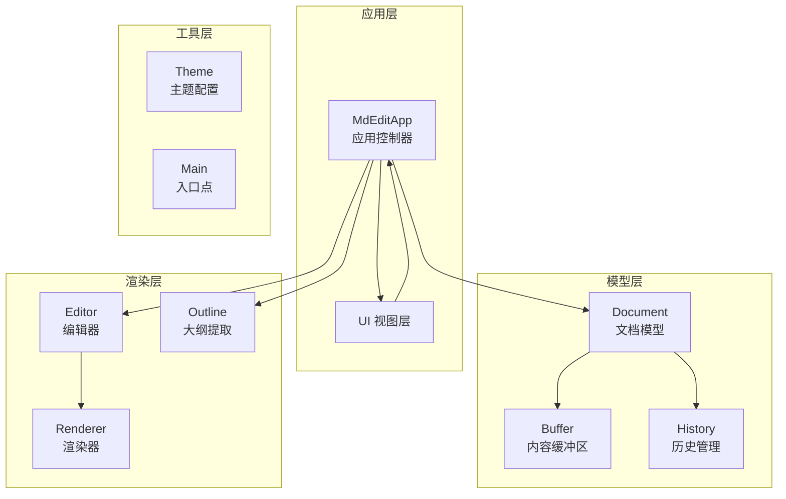

**图表来源**
- [src/app.rs:1-351](file://src/app.rs#L1-L351)
- [src/document/mod.rs:1-51](file://src/document/mod.rs#L1-L51)
- [src/editor/mod.rs:1-349](file://src/editor/mod.rs#L1-L349)

**章节来源**
- [src/main.rs:1-50](file://src/main.rs#L1-L50)
- [Cargo.toml:1-19](file://Cargo.toml#L1-L19)

## 核心组件

### Document 结构体

Document 是模型层的核心数据结构，承担着以下关键职责：

#### 数据结构设计
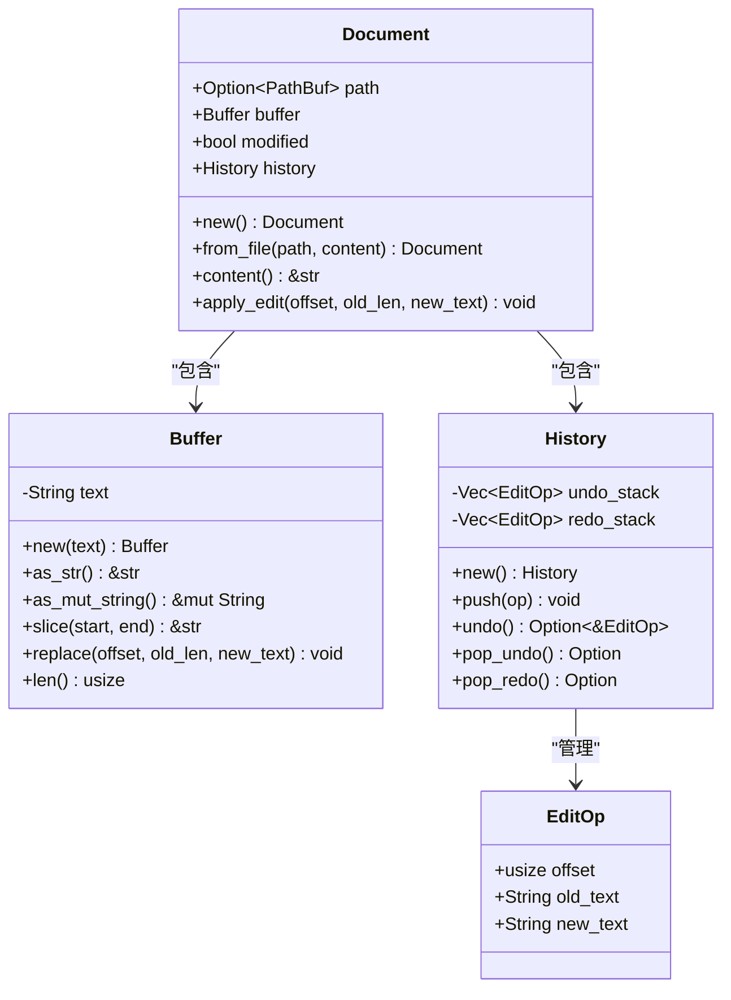

**图表来源**
- [src/document/mod.rs:9-50](file://src/document/mod.rs#L9-L50)
- [src/document/buffer.rs:1-29](file://src/document/buffer.rs#L1-L29)
- [src/document/history.rs:1-58](file://src/document/history.rs#L1-L58)

#### 核心功能特性

1. **文档状态管理**：维护 `modified` 标志位，跟踪文档是否被修改
2. **文件路径管理**：通过 `Option<PathBuf>` 处理已命名和未命名文档
3. **内容访问接口**：提供只读和可变的字符串访问方法
4. **编辑操作封装**：统一处理文本替换和历史记录

**章节来源**
- [src/document/mod.rs:9-50](file://src/document/mod.rs#L9-L50)

### Buffer 模块

Buffer 模块实现了高效的文档内容存储和访问机制：

#### 设计原则
- **零拷贝访问**：通过 `as_str()` 提供只读引用，避免不必要的字符串复制
- **就地修改**：使用 `replace_range` 进行原地字符串替换
- **安全边界检查**：通过切片操作确保索引安全性

#### 内存优化策略
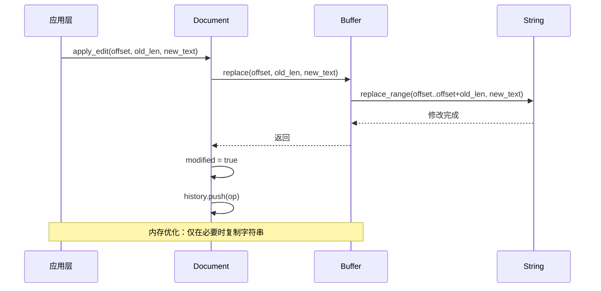

**图表来源**
- [src/document/buffer.rs:22-24](file://src/document/buffer.rs#L22-L24)
- [src/document/mod.rs:39-49](file://src/document/mod.rs#L39-L49)

**章节来源**
- [src/document/buffer.rs:1-29](file://src/document/buffer.rs#L1-L29)

### History 模块

History 模块实现了完整的撤销重做机制：

#### 历史记录结构
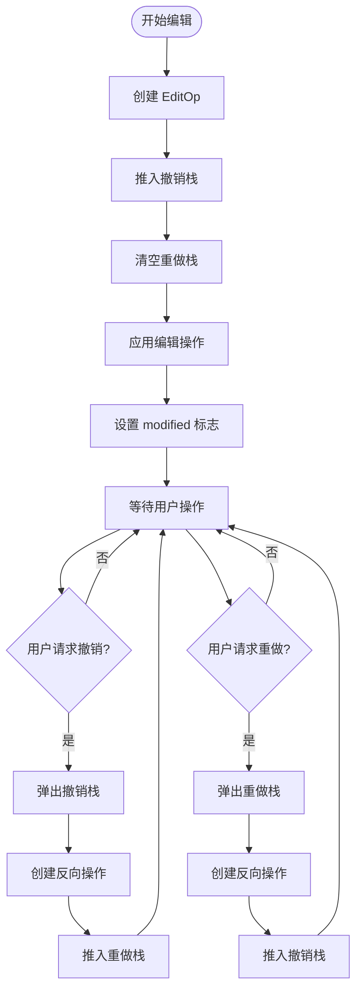

**图表来源**
- [src/document/history.rs:20-57](file://src/document/history.rs#L20-L57)

#### 实现特点
- **双栈设计**：使用独立的撤销和重做栈，支持双向导航
- **操作反转**：自动为每个操作生成对应的反向操作
- **状态同步**：撤销/重做操作后保持历史状态的一致性

**章节来源**
- [src/document/history.rs:1-58](file://src/document/history.rs#L1-L58)

## 架构概览

mdedit 的 Model 层与其它层的交互关系如下：

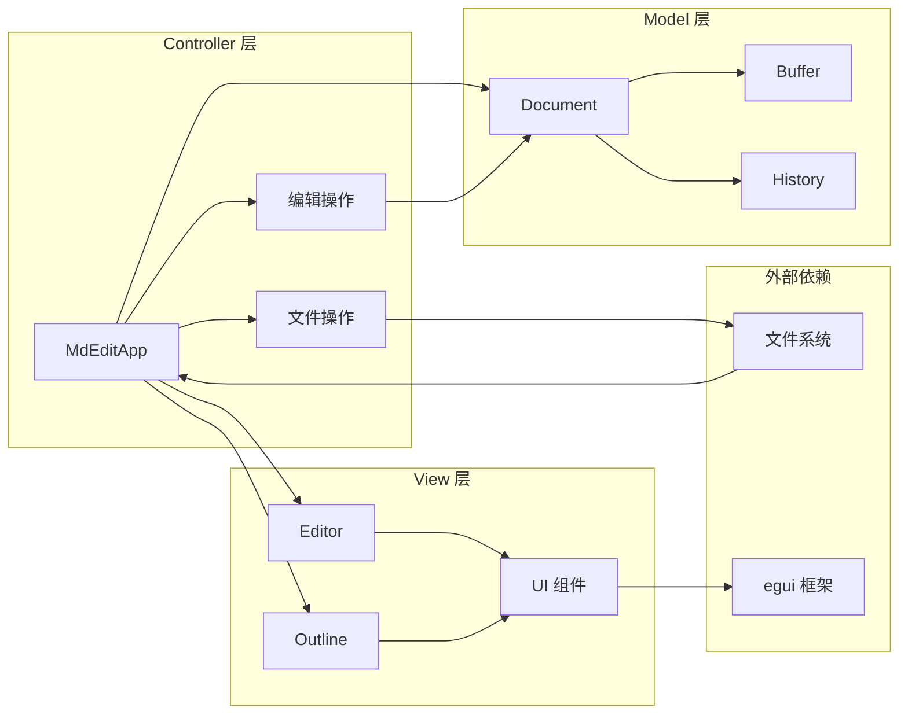

**图表来源**
- [src/app.rs:19-351](file://src/app.rs#L19-L351)
- [src/document/mod.rs:16-50](file://src/document/mod.rs#L16-L50)

**章节来源**
- [src/app.rs:19-351](file://src/app.rs#L19-L351)

## 详细组件分析

### 文档状态管理

#### 修改状态跟踪
文档的修改状态通过 `modified` 字段精确控制：

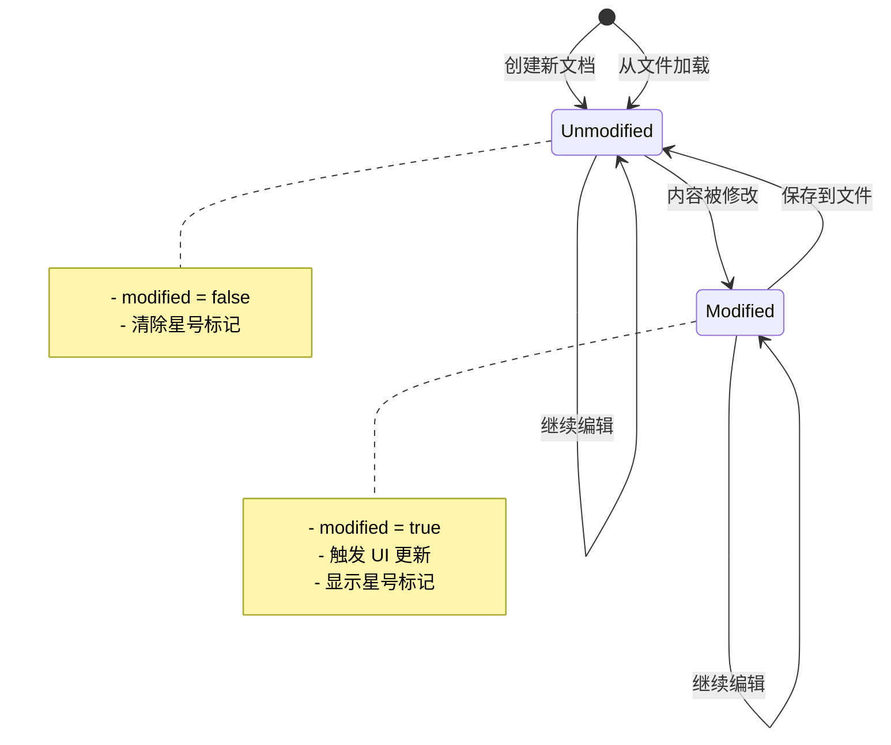

**图表来源**
- [src/app.rs:133-163](file://src/app.rs#L133-L163)
- [src/document/mod.rs:39-49](file://src/document/mod.rs#L39-L49)

#### 文件路径管理
文档路径通过 `Option<PathBuf>` 处理不同场景：

| 场景 | Path 值 | 行为 |
|------|---------|------|
| 新建文档 | None | 保存时弹出另存为对话框 |
| 打开文件 | Some(Path) | 保存时直接写入原文件 |
| 另存为 | Some(NewPath) | 更新文档路径并保存 |

**章节来源**
- [src/app.rs:133-163](file://src/app.rs#L133-L163)
- [src/document/mod.rs:26-33](file://src/document/mod.rs#L26-L33)

### 内容变更检测

#### 编辑操作流程
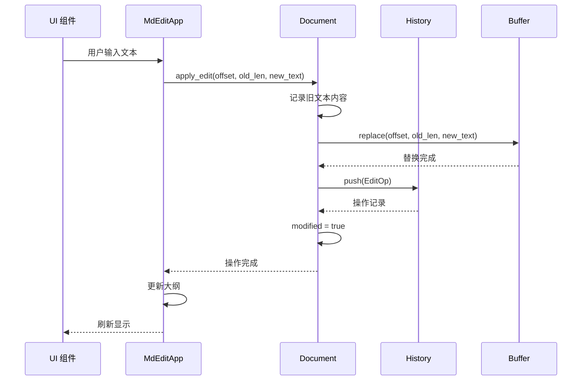

**图表来源**
- [src/document/mod.rs:39-49](file://src/document/mod.rs#L39-L49)
- [src/app.rs:330-349](file://src/app.rs#L330-L349)

#### 大纲更新机制
文档内容变更会触发大纲重新计算：

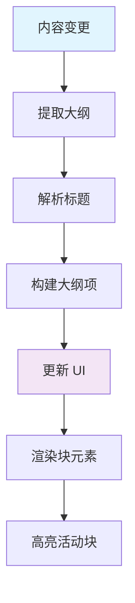

**图表来源**
- [src/app.rs:86-88](file://src/app.rs#L86-L88)
- [src/outline/mod.rs:7-26](file://src/outline/mod.rs#L7-L26)

**章节来源**
- [src/app.rs:86-88](file://src/app.rs#L86-L88)
- [src/outline/mod.rs:7-26](file://src/outline/mod.rs#L7-L26)

### 并发访问保护

#### 单线程事件循环
mdedit 采用 eframe 的单线程事件循环模型，天然具备线程安全性：

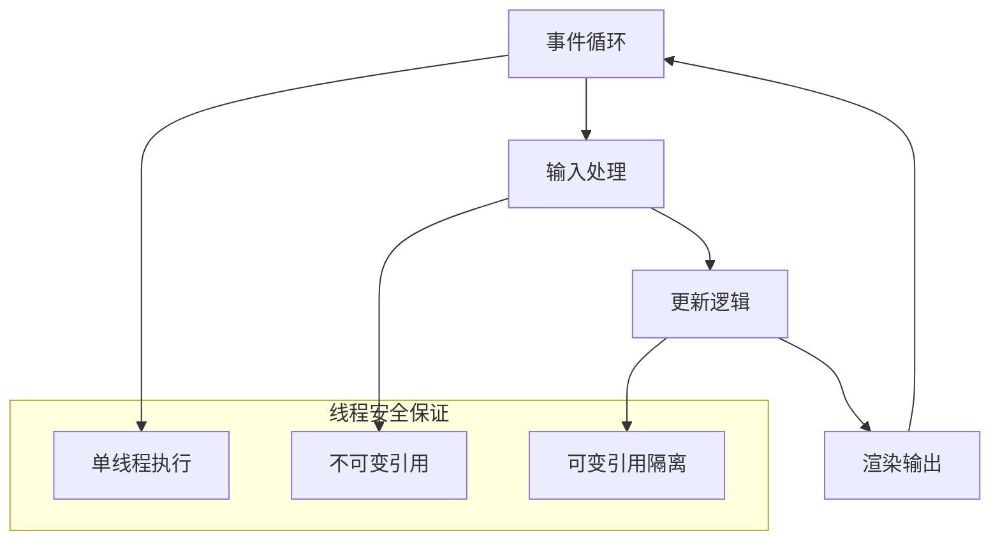

**图表来源**
- [src/app.rs:187-249](file://src/app.rs#L187-L249)

#### 内存安全策略
- **所有权转移**：通过所有权机制防止数据竞争
- **借用检查**：编译时确保引用有效性
- **生命周期管理**：自动管理临时对象的生命周期

**章节来源**
- [src/app.rs:187-249](file://src/app.rs#L187-L249)

## 依赖关系分析

### 外部依赖
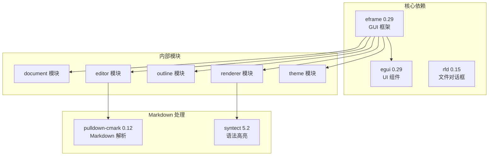

**图表来源**
- [Cargo.toml:8-13](file://Cargo.toml#L8-L13)

### 内部模块依赖
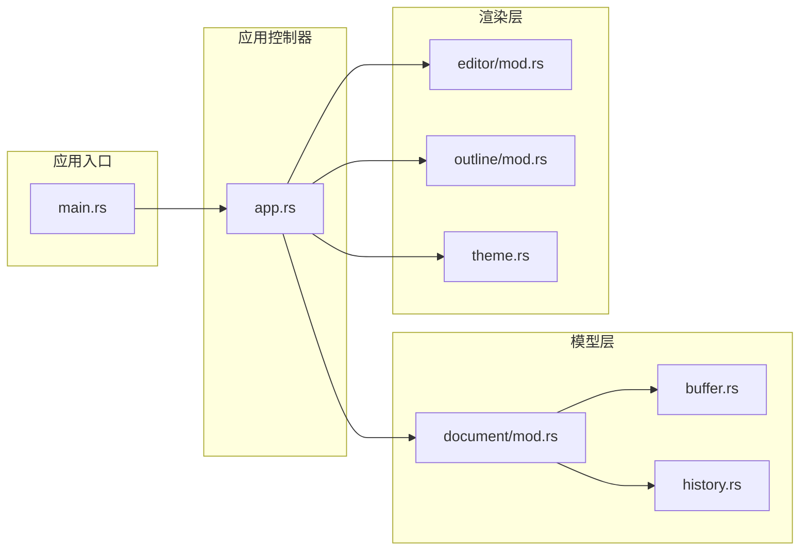

**图表来源**
- [src/main.rs:3-8](file://src/main.rs#L3-L8)
- [src/app.rs:1-17](file://src/app.rs#L1-L17)

**章节来源**
- [Cargo.toml:8-13](file://Cargo.toml#L8-L13)

## 性能考虑

### 内存优化策略

#### 字符串处理优化
- **延迟复制**：通过 `as_str()` 提供只读访问，避免不必要的字符串复制
- **就地修改**：使用 `replace_range` 进行原地字符串替换，减少内存分配
- **批量操作**：在编辑器中使用一次性替换而非多次小范围修改

#### 历史记录管理
- **内存限制**：历史记录栈大小受内存限制，避免无限增长
- **增量更新**：只保存必要的操作信息，不保存完整状态快照
- **垃圾回收**：当执行新操作时自动清理过期的历史记录

### 计算复杂度分析

| 操作类型 | 时间复杂度 | 空间复杂度 | 说明 |
|----------|------------|------------|------|
| 文本替换 | O(n) | O(n) | n 为替换长度 |
| 撤销操作 | O(1) | O(1) | 常数时间操作 |
| 重做操作 | O(1) | O(1) | 常数时间操作 |
| 大纲提取 | O(m) | O(k) | m 为行数，k 为标题数量 |
| 内容比较 | O(n) | O(1) | n 为字符数 |

### 编译优化配置
项目使用了针对发布版本的优化配置：
- `opt-level = "z"`：优化代码大小
- `lto = true`：启用链接时优化
- `strip = true`：移除调试符号

**章节来源**
- [Cargo.toml:15-19](file://Cargo.toml#L15-L19)

## 故障排除指南

### 常见问题及解决方案

#### 文档状态不同步
**症状**：保存后星号标记仍然显示
**原因**：保存操作可能失败或 UI 更新未触发
**解决**：检查文件写入返回值，确保调用 `document.modified = false`

#### 历史记录异常
**症状**：撤销/重做功能失效
**原因**：历史栈状态不一致或操作记录损坏
**解决**：重新启动应用，历史记录会在下一次操作时自动清理

#### 内存使用过高
**症状**：长时间编辑后内存占用增加
**原因**：历史记录过多或大型文档
**解决**：定期保存文档，限制历史记录深度

#### 文件路径问题
**症状**：保存时弹出错误对话框
**原因**：文件权限不足或路径无效
**解决**：检查文件权限，选择有效的保存位置

**章节来源**
- [src/app.rs:133-163](file://src/app.rs#L133-L163)
- [src/document/history.rs:20-23](file://src/document/history.rs#L20-L23)

### 调试技巧

#### 日志记录
- 在关键操作前后添加日志输出
- 监控文档状态变化
- 记录历史操作序列

#### 性能监控
- 使用 `std::time::Instant` 测量操作耗时
- 监控内存使用情况
- 分析历史记录栈深度

#### 单元测试
```rust
// 示例测试结构
#[cfg(test)]
mod tests {
    use super::*;
    
    #[test]
    fn test_document_creation() {
        let doc = Document::new();
        assert_eq!(doc.path, None);
        assert!(!doc.modified);
    }
    
    #[test]
    fn test_edit_operation() {
        let mut doc = Document::new();
        doc.apply_edit(0, 0, "test");
        assert!(doc.modified);
    }
}
```

## 结论

mdedit 的 Model 层实现了简洁而高效的数据管理架构。通过精心设计的结构体和模块化组织，该实现达到了以下目标：

### 设计优势
- **清晰的职责分离**：Document、Buffer、History 各司其职，耦合度低
- **内存效率**：通过引用传递和就地修改减少内存分配
- **线程安全**：利用 Rust 的所有权系统天然保证并发安全
- **扩展性强**：模块化设计便于功能扩展和维护

### 技术亮点
- **零拷贝访问**：通过引用提供高效的内容访问
- **智能状态管理**：精确的修改状态跟踪和同步机制
- **完整的撤销重做**：双栈设计支持灵活的历史导航
- **性能优化**：编译时优化和运行时内存管理

### 改进建议
- **历史记录持久化**：考虑将重要历史记录保存到磁盘
- **增量渲染**：实现基于差异的 UI 更新
- **并发支持**：在未来版本中考虑多线程支持
- **插件系统**：为扩展功能提供插件接口

该 Model 层实现为 mdedit 提供了坚实的基础，既满足了当前的功能需求，又为未来的功能扩展预留了空间。