# View 层实现

<cite>
**本文档引用的文件**
- [app.rs](file://src/app.rs)
- [mod.rs](file://src/editor/mod.rs)
- [mod.rs](file://src/renderer/mod.rs)
- [blocks.rs](file://src/renderer/blocks.rs)
- [inline.rs](file://src/renderer/inline.rs)
- [mod.rs](file://src/outline/mod.rs)
- [mod.rs](file://src/document/mod.rs)
- [buffer.rs](file://src/document/buffer.rs)
- [history.rs](file://src/document/history.rs)
- [theme.rs](file://src/theme.rs)
- [main.rs](file://src/main.rs)
</cite>

## 目录
1. [简介](#简介)
2. [项目结构](#项目结构)
3. [核心组件](#核心组件)
4. [架构概览](#架构概览)
5. [详细组件分析](#详细组件分析)
6. [依赖关系分析](#依赖关系分析)
7. [性能考虑](#性能考虑)
8. [故障排除指南](#故障排除指南)
9. [结论](#结论)

## 简介

mdedit 是一个基于 Rust 和 egui 框架构建的 Markdown 编辑器。本文件专注于 View 层的实现，深入分析 egui 组件在 mdedit 中的具体应用，包括布局组件的使用、文档内容渲染、实时预览机制以及大纲面板的实现。

View 层通过 MdEditApp 结构体实现，该结构体实现了 eframe::App trait，负责处理用户界面的绘制和交互。整个系统采用 MVC 架构模式，其中 View 层主要负责用户界面的呈现和用户交互的响应。

## 项目结构

mdedit 项目采用模块化设计，View 层相关的文件组织如下：

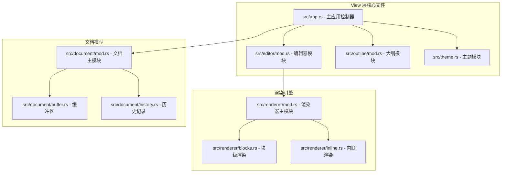

**图表来源**
- [app.rs:1-351](file://src/app.rs#L1-L351)
- [mod.rs:1-349](file://src/editor/mod.rs#L1-L349)
- [mod.rs:1-27](file://src/outline/mod.rs#L1-L27)

**章节来源**
- [app.rs:1-351](file://src/app.rs#L1-L351)
- [mod.rs:1-349](file://src/editor/mod.rs#L1-L349)
- [mod.rs:1-27](file://src/outline/mod.rs#L1-L27)

## 核心组件

### MdEditApp 应用控制器

MdEditApp 是 View 层的核心组件，实现了 eframe::App trait，负责管理整个应用程序的状态和用户界面。

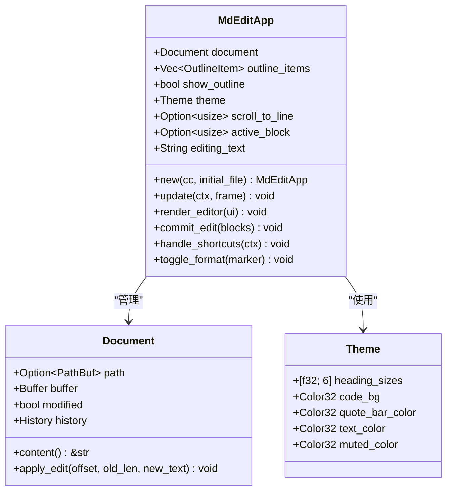

**图表来源**
- [app.rs:9-185](file://src/app.rs#L9-L185)
- [mod.rs:9-50](file://src/document/mod.rs#L9-L50)
- [theme.rs:3-21](file://src/theme.rs#L3-L21)

### 布局组件系统

mdedit 使用 egui 的布局组件来构建用户界面，主要包括：

- **TopBottomPanel::top("toolbar")**: 顶部工具栏，包含文件菜单和视图菜单
- **SidePanel::left("outline_panel")**: 左侧大纲面板，显示文档标题结构
- **CentralPanel::default()**: 中央编辑区域，显示和编辑 Markdown 内容

**章节来源**
- [app.rs:187-249](file://src/app.rs#L187-L249)

## 架构概览

mdedit 的 View 层采用分层架构设计，从上到下分为：

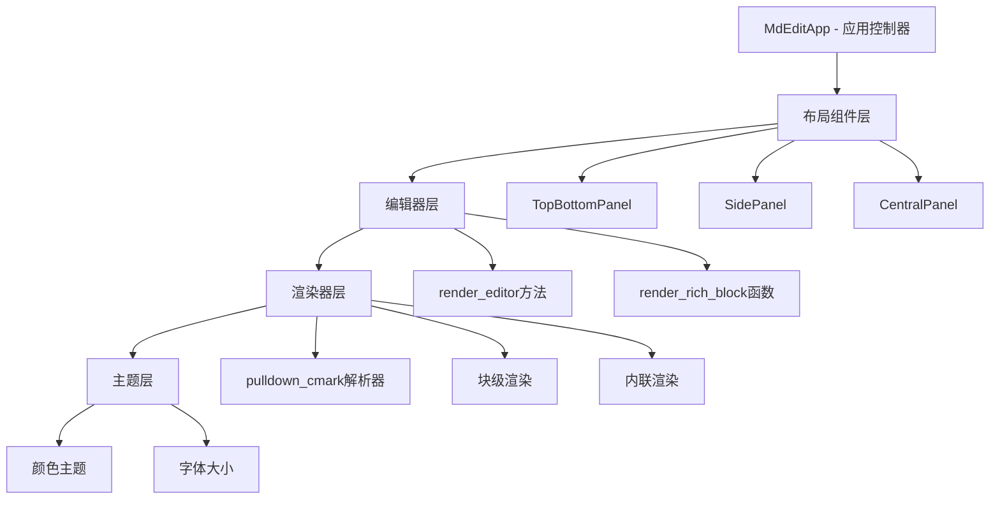

**图表来源**
- [app.rs:187-351](file://src/app.rs#L187-L351)
- [mod.rs:19-142](file://src/renderer/mod.rs#L19-L142)

## 详细组件分析

### 布局组件实现

#### 顶部工具栏 (TopBottomPanel)

顶部工具栏使用 egui::TopBottomPanel::top 创建，包含文件操作和视图控制功能：

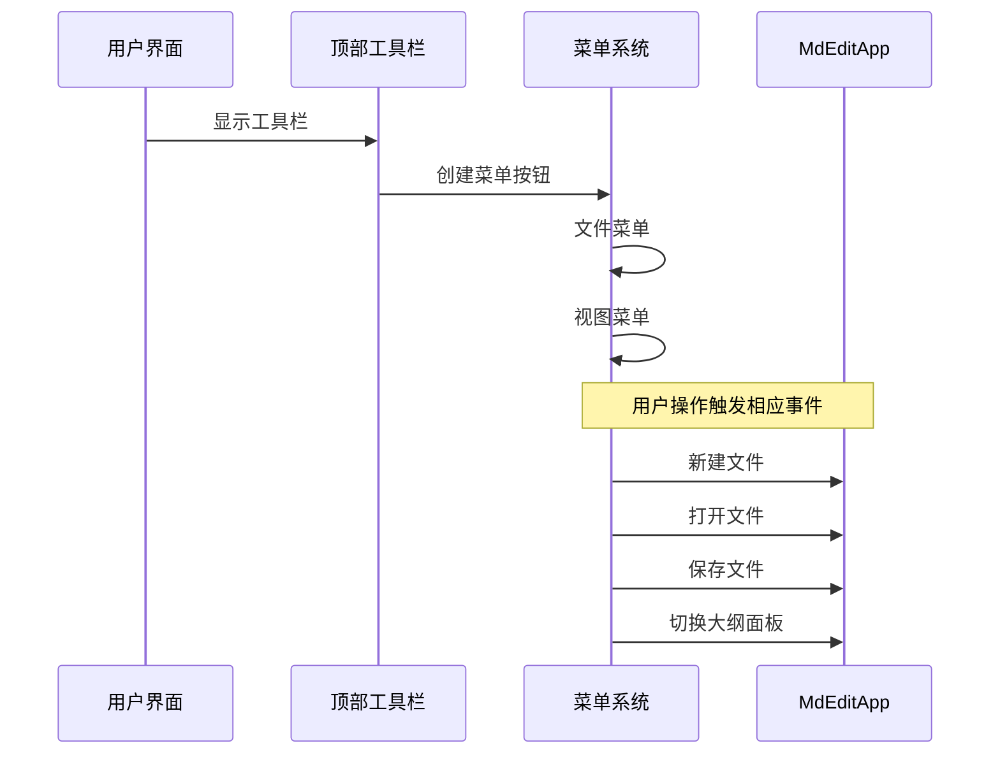

**图表来源**
- [app.rs:192-218](file://src/app.rs#L192-L218)

#### 大纲面板 (SidePanel)

左侧大纲面板用于显示文档的标题结构，支持点击导航到对应位置：

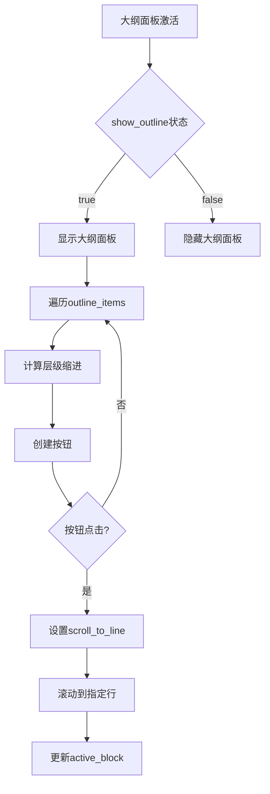

**图表来源**
- [app.rs:220-239](file://src/app.rs#L220-L239)
- [mod.rs:7-26](file://src/outline/mod.rs#L7-L26)

#### 中央编辑区域 (CentralPanel)

中央区域负责显示和编辑 Markdown 内容，采用垂直滚动区域：

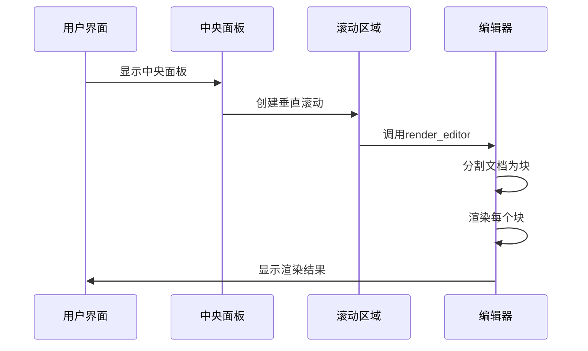

**图表来源**
- [app.rs:241-247](file://src/app.rs#L241-L247)
- [app.rs:251-328](file://src/app.rs#L251-L328)

### 编辑器渲染系统

#### render_editor 方法

render_editor 方法是 View 层的核心渲染函数，负责将文档内容转换为可视化的 Markdown 块：

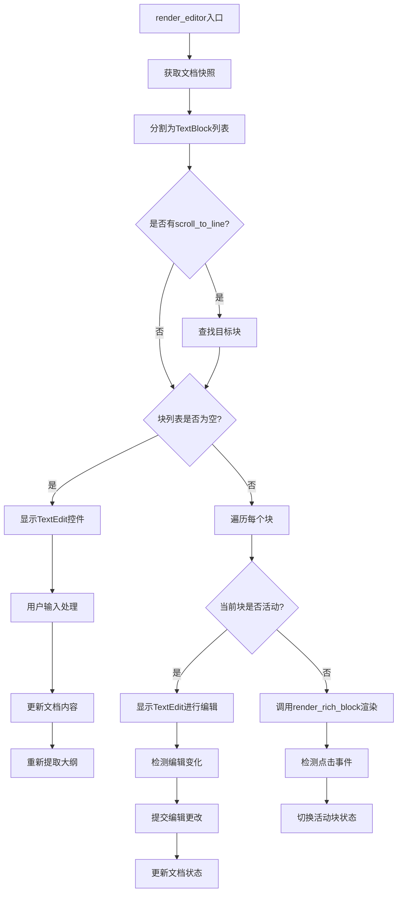

**图表来源**
- [app.rs:252-328](file://src/app.rs#L252-L328)

#### render_rich_block 函数

render_rich_block 函数处理不同类型的内容块渲染：

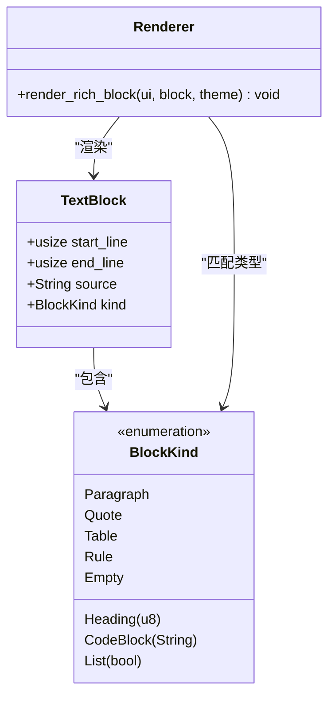

**图表来源**
- [mod.rs:4-22](file://src/editor/mod.rs#L4-L22)
- [mod.rs:159-266](file://src/editor/mod.rs#L159-L266)

### Markdown 解析和渲染

#### 文档块分割算法

editor::split_blocks 函数实现了高效的 Markdown 块分割算法：

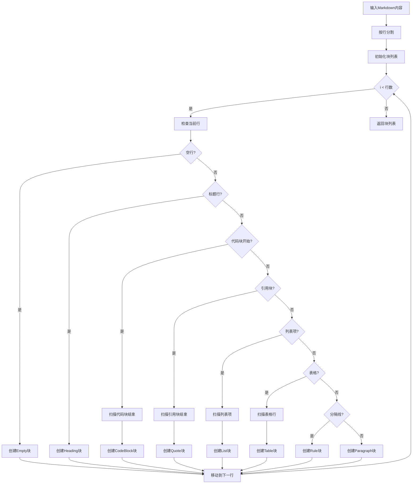

**图表来源**
- [mod.rs:24-149](file://src/editor/mod.rs#L24-L149)

#### 富文本渲染

render_rich_block 函数处理不同类型的 Markdown 元素：

| 块类型 | 渲染方式 | 特殊处理 |
|--------|----------|----------|
| Heading | 标题标签，带粗体 | 根据级别调整字体大小，级别1-2添加分隔线 |
| Paragraph | 段落文本 | 调用内联渲染函数 |
| CodeBlock | 代码框，等宽字体 | 添加背景色和边距，去除代码围栏 |
| Quote | 引用块，斜体 | 左侧竖条，灰色文本 |
| List | 列表项 | 有序/无序标记，缩进显示 |
| Table | 表格网格 | 首行加粗，交替行着色 |
| Rule | 分隔线 | 标准分隔符 |

**章节来源**
- [mod.rs:159-266](file://src/editor/mod.rs#L159-L266)

### 实时预览机制

mdedit 实现了完整的实时预览机制，确保用户输入时的即时反馈：

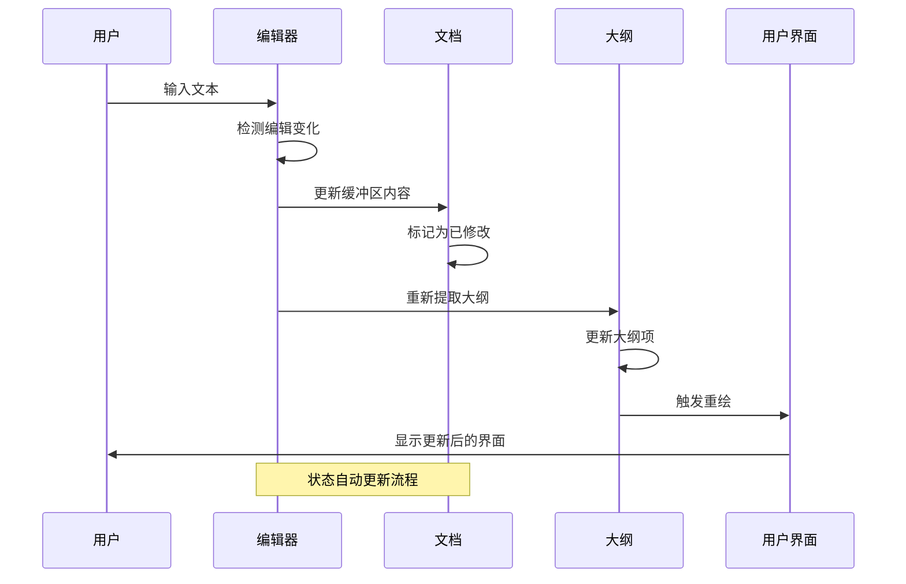

**图表来源**
- [app.rs:275-327](file://src/app.rs#L275-L327)
- [mod.rs:39-49](file://src/document/mod.rs#L39-L49)

### 大纲面板实现

#### 标题提取算法

outline::extract_outline 函数从文档中提取标题信息：

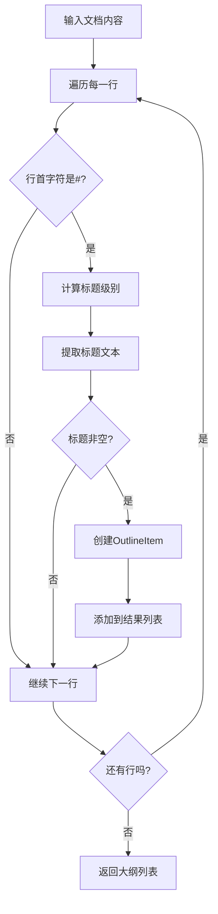

**图表来源**
- [mod.rs:7-26](file://src/outline/mod.rs#L7-L26)

#### 层级缩进系统

大纲面板使用层级缩进显示标题结构：

- 一级标题：无缩进
- 二级标题：12px 缩进
- 三级标题：24px 缩进
- 以此类推...

#### 点击导航功能

用户点击大纲项时，系统会：
1. 设置 scroll_to_line 目标行号
2. 在渲染循环中定位对应块
3. 将活动块设置为目标块
4. 自动滚动到目标位置

**章节来源**
- [app.rs:226-238](file://src/app.rs#L226-L238)

## 依赖关系分析

mdedit View 层的依赖关系体现了清晰的模块化设计：

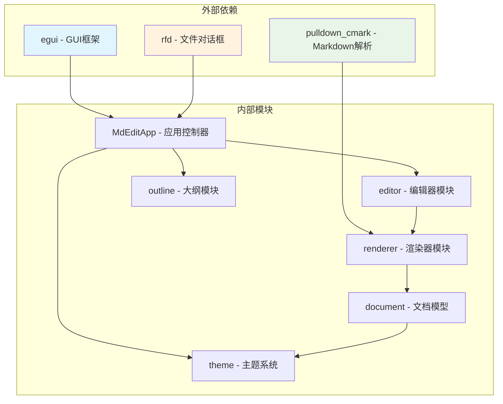

**图表来源**
- [app.rs:1-7](file://src/app.rs#L1-L7)
- [mod.rs:19-22](file://src/renderer/mod.rs#L19-L22)

### 关键依赖说明

1. **egui**: 提供所有 GUI 组件和渲染功能
2. **pulldown_cmark**: 提供标准的 Markdown 解析能力
3. **rfd**: 提供跨平台的文件对话框
4. **文档模型**: 管理文档状态和历史记录
5. **渲染器**: 处理 Markdown 到可视化的转换

**章节来源**
- [app.rs:1-7](file://src/app.rs#L1-L7)
- [mod.rs:19-22](file://src/renderer/mod.rs#L19-L22)

## 性能考虑

### 渲染优化策略

1. **增量更新**: 只在内容变化时重新提取大纲
2. **懒加载**: 大纲面板仅在需要时显示
3. **高效分割**: 使用单次遍历完成文档块分割
4. **内存管理**: 使用字符串切片避免不必要的复制

### 用户体验优化

1. **即时反馈**: 编辑时立即更新界面
2. **智能滚动**: 自动滚动到编辑位置
3. **状态保持**: 保持编辑状态和滚动位置
4. **快捷键支持**: 支持常用编辑快捷键

## 故障排除指南

### 常见问题及解决方案

#### 字体显示问题
- **症状**: 中文字符显示异常
- **原因**: 缺少合适的中文字体
- **解决**: 系统会在运行时自动配置字体

#### 大纲不更新
- **症状**: 修改文档后大纲没有变化
- **原因**: 缺少大纲更新调用
- **解决**: 确保在文档修改后调用 `update_outline()`

#### 编辑状态异常
- **症状**: 编辑框无法正常切换
- **原因**: 活动块状态管理错误
- **解决**: 检查 `active_block` 和 `editing_text` 的同步

**章节来源**
- [app.rs:86-88](file://src/app.rs#L86-L88)
- [app.rs:330-349](file://src/app.rs#L330-L349)

## 结论

mdedit 的 View 层实现展现了优秀的架构设计和用户体验。通过合理使用 egui 组件，实现了直观的 Markdown 编辑界面。关键特性包括：

1. **模块化设计**: 清晰的职责分离和依赖关系
2. **实时预览**: 即时的用户反馈机制
3. **高效渲染**: 优化的渲染管道和状态管理
4. **扩展性**: 为未来功能扩展预留了良好的基础

该实现为其他基于 egui 的桌面应用提供了优秀的参考范例，特别是在 Markdown 编辑器领域的最佳实践。