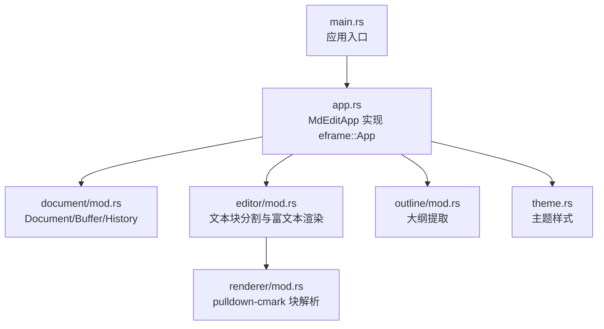
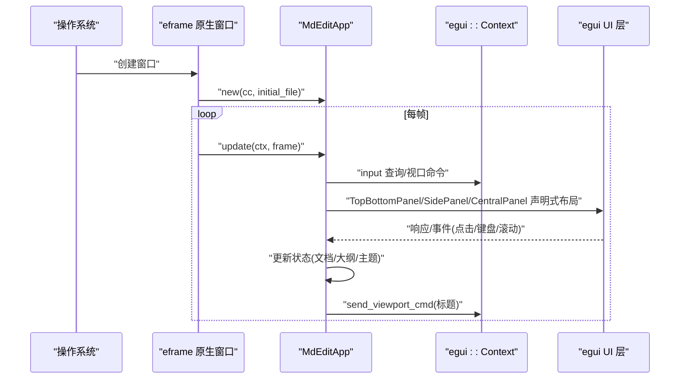
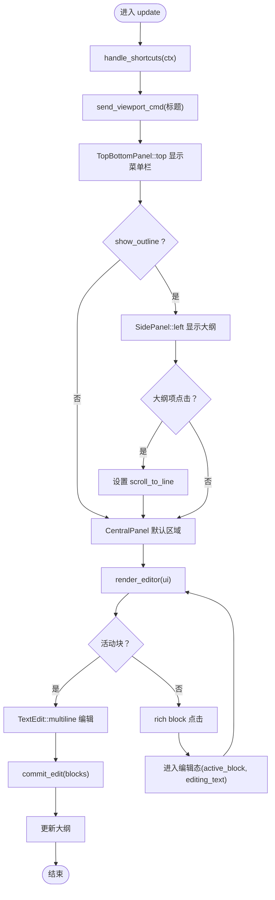
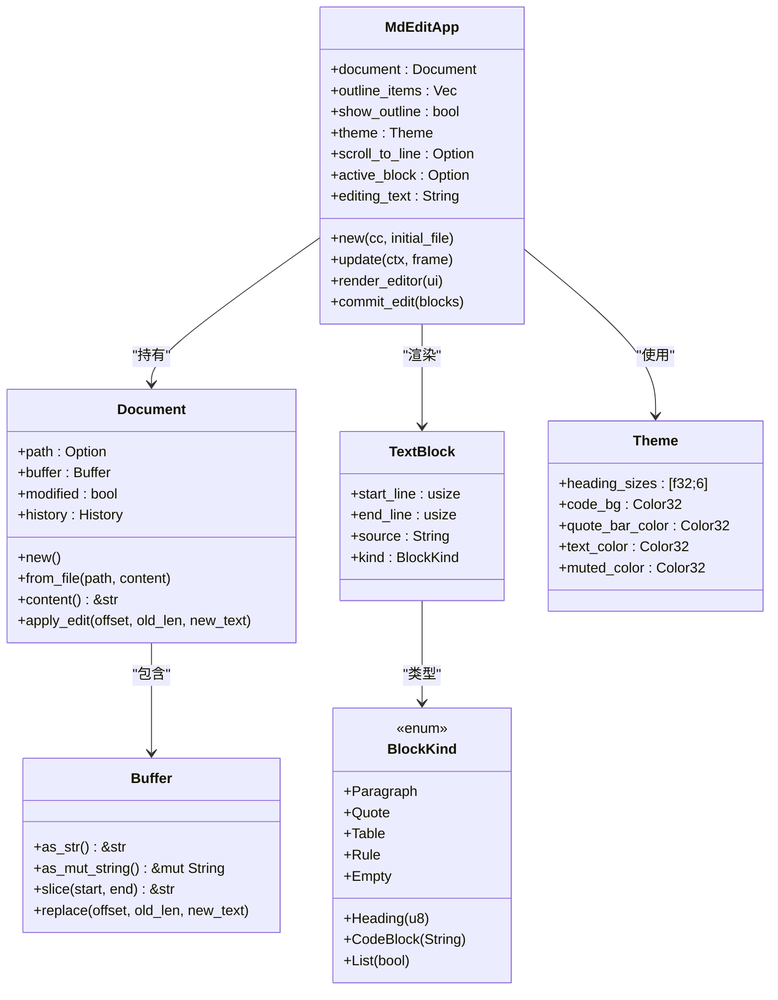
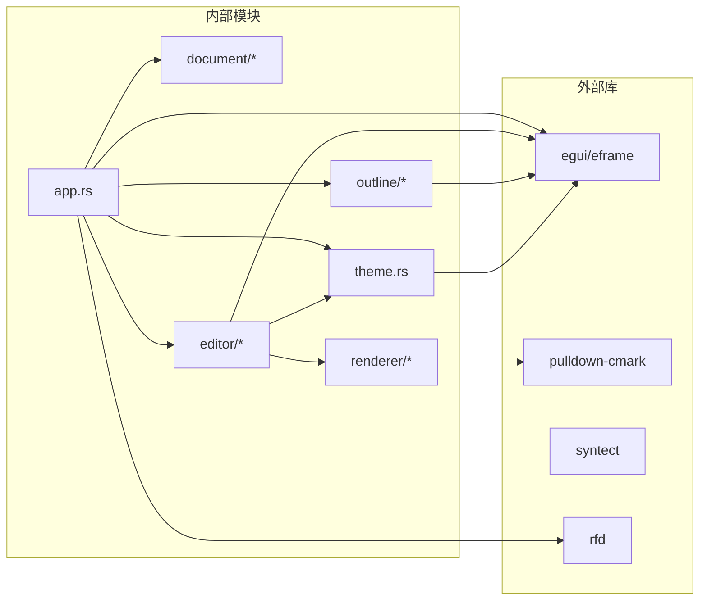

# 即时模式 GUI 架构

<cite>
**本文引用的文件列表**
- [main.rs](file://src/main.rs)
- [app.rs](file://src/app.rs)
- [Cargo.toml](file://Cargo.toml)
- [README.md](file://README.md)
- [document/mod.rs](file://src/document/mod.rs)
- [document/buffer.rs](file://src/document/buffer.rs)
- [editor/mod.rs](file://src/editor/mod.rs)
- [outline/mod.rs](file://src/outline/mod.rs)
- [renderer/mod.rs](file://src/renderer/mod.rs)
- [theme.rs](file://src/theme.rs)
</cite>

## 目录
1. [引言](#引言)
2. [项目结构](#项目结构)
3. [核心组件](#核心组件)
4. [架构总览](#架构总览)
5. [详细组件分析](#详细组件分析)
6. [依赖关系分析](#依赖关系分析)
7. [性能考量](#性能考量)
8. [故障排查指南](#故障排查指南)
9. [结论](#结论)
10. [附录](#附录)

## 引言
本文件系统化阐述 mdedit 的即时模式 GUI 架构，重点对比 eframe/egui 即时模式与传统状态模式 GUI 的根本差异，解释每帧重新构建 UI 的设计理念；详述 MdEditApp 如何实现 eframe::App trait，update 方法的执行周期与事件处理机制；剖析 egui 上下文对象的作用（输入处理、绘制命令生成、视口命令等）；说明 UI 组件的声明式构建方式与从代码到最终像素的渲染流水线；总结即时模式 GUI 在内存管理与性能优化方面的优势与挑战，并给出在 mdedit 中使用 egui 组件的具体示例路径（菜单栏、侧边栏、中央编辑区域）。

## 项目结构
mdedit 采用模块化组织，围绕“应用主体 + 文档模型 + 编辑器 + 渲染器 + 大纲 + 主题”的分层设计：
- 应用入口与生命周期：main.rs 启动 eframe，创建 MdEditApp 实例并传入初始文件参数。
- 应用逻辑与 UI：app.rs 定义 MdEditApp，实现 eframe::App，负责菜单栏、侧边栏、中央编辑区的声明式布局与交互。
- 文档模型：document 模块封装 Buffer、History、Document 结构，统一内容与修改状态。
- 编辑器与渲染：editor 模块将 Markdown 分割为文本块并渲染富文本；renderer 模块使用 pulldown-cmark 解析块级元素。
- 大纲与主题：outline 提取标题大纲；theme 提供视觉样式配置。

图表来源
- [main.rs:35-49](file://src/main.rs#L35-L49)
- [app.rs:187-249](file://src/app.rs#L187-L249)
- [document/mod.rs:9-50](file://src/document/mod.rs#L9-L50)
- [editor/mod.rs:24-149](file://src/editor/mod.rs#L24-L149)
- [outline/mod.rs:7-26](file://src/outline/mod.rs#L7-L26)
- [theme.rs:3-21](file://src/theme.rs#L3-L21)
- [renderer/mod.rs:19-142](file://src/renderer/mod.rs#L19-L142)

章节来源
- [main.rs:1-50](file://src/main.rs#L1-L50)
- [app.rs:1-351](file://src/app.rs#L1-L351)
- [document/mod.rs:1-51](file://src/document/mod.rs#L1-L51)
- [editor/mod.rs:1-349](file://src/editor/mod.rs#L1-L349)
- [outline/mod.rs:1-27](file://src/outline/mod.rs#L1-L27)
- [renderer/mod.rs:1-143](file://src/renderer/mod.rs#L1-L143)
- [theme.rs:1-22](file://src/theme.rs#L1-L22)

## 核心组件
- 应用主体 MdEditApp
  - 状态字段：文档、大纲项、是否显示大纲、主题、滚动目标行、当前活动块、正在编辑的文本。
  - 关键方法：new 初始化字体、加载初始文件；update 驱动 UI 生命周期；render_editor 渲染编辑区；commit_edit 提交编辑变更。
- 文档模型 Document
  - 字段：路径、Buffer、修改标记、历史记录。
  - 方法：new/from_file 创建；content 获取只读内容；apply_edit 应用编辑并记录历史。
- 编辑器 editor
  - 文本块 TextBlock：起止行、源文本、块类型。
  - 块类型 BlockKind：标题、段落、代码块、引用、列表、表格、分隔线、空行。
  - 函数：split_blocks 将 Markdown 拆分为块；render_rich_block 渲染单个块；render_inline 渲染内联格式。
- 渲染器 renderer
  - 使用 pulldown-cmark 解析 Markdown，产出 Block 列表，支持删除线、表格、任务列表等扩展。
- 大纲 outline
  - 提取标题层级与行号，用于侧边栏导航。
- 主题 theme
  - 定义标题字号、代码背景色、引用条颜色、文本与柔和色等。

章节来源
- [app.rs:9-43](file://src/app.rs#L9-L43)
- [app.rs:187-249](file://src/app.rs#L187-L249)
- [document/mod.rs:9-50](file://src/document/mod.rs#L9-L50)
- [document/buffer.rs:1-30](file://src/document/buffer.rs#L1-L30)
- [editor/mod.rs:4-22](file://src/editor/mod.rs#L4-L22)
- [editor/mod.rs:24-149](file://src/editor/mod.rs#L24-L149)
- [renderer/mod.rs:9-17](file://src/renderer/mod.rs#L9-L17)
- [outline/mod.rs:1-26](file://src/outline/mod.rs#L1-L26)
- [theme.rs:3-21](file://src/theme.rs#L3-L21)

## 架构总览
mdedit 的 GUI 架构基于 eframe/egui 的即时模式：
- 即时模式 vs 传统模式
  - 即时模式：每帧根据当前状态“重新构建”UI，不持久保存控件实例；通过 egui::Context 接收输入、生成绘制命令、提交视口命令。
  - 传统模式：控件作为持久对象存在，通过句柄或 ID 操作其状态。
- 控制流
  - eframe::run_native 启动原生窗口，传入 MdEditApp::new。
  - 每帧调用 MdEditApp::update，内部通过 egui::Context 输入查询、菜单栏/侧边栏/中央面板声明式布局、编辑区渲染与交互。
  - 通过 egui::Context 发送视口命令（如标题更新），并通过 egui::Response 与交互事件驱动状态变更。

图表来源
- [main.rs:35-49](file://src/main.rs#L35-L49)
- [app.rs:187-249](file://src/app.rs#L187-L249)
- [app.rs:188-190](file://src/app.rs#L188-L190)

章节来源
- [main.rs:35-49](file://src/main.rs#L35-L49)
- [app.rs:187-249](file://src/app.rs#L187-L249)

## 详细组件分析

### MdEditApp：eframe::App 的实现与 update 周期
- 初始化与字体配置
  - new 中调用 configure_fonts，按平台选择中文字体并设置到 egui::Context。
  - 若有初始文件，则从文件创建 Document 并提取大纲。
- update 执行周期
  - handle_shortcuts：基于 egui::Context 的输入修饰键与按键状态进行快捷键处理。
  - send_viewport_cmd：动态更新窗口标题。
  - 声明式 UI：
    - 顶部工具栏：TopBottomPanel::top + menu::bar + menu_button。
    - 左侧大纲：SidePanel::left + ScrollArea + 列表项点击跳转。
    - 中央编辑区：CentralPanel::default + ScrollArea + render_editor。
- 事件处理机制
  - 菜单项按钮 clicked 触发对应操作（新建/打开/保存/另存为/切换大纲）。
  - 大纲项点击触发 scroll_to_line，随后在 render_editor 中定位活动块并进入编辑态。
  - 编辑区交互：活动块使用 TextEdit::multiline，失焦或提交时 commit_edit 写回文档缓冲；非活动块点击进入编辑态。
- 状态管理
  - active_block 标识当前编辑块索引；editing_text 存储当前编辑文本；scroll_to_line 仅在点击大纲后短暂使用。
  - outline_items 随文档内容变化而更新。

图表来源
- [app.rs:187-249](file://src/app.rs#L187-L249)
- [app.rs:251-328](file://src/app.rs#L251-L328)
- [app.rs:330-349](file://src/app.rs#L330-L349)

章节来源
- [app.rs:19-43](file://src/app.rs#L19-L43)
- [app.rs:86-114](file://src/app.rs#L86-L114)
- [app.rs:187-249](file://src/app.rs#L187-L249)
- [app.rs:251-328](file://src/app.rs#L251-L328)
- [app.rs:330-349](file://src/app.rs#L330-L349)

### egui 上下文对象：输入、绘制命令与视口命令
- 输入处理
  - ctx.input(|i| ...) 查询修饰键、按键状态、鼠标位置、滚轮等，用于 handle_shortcuts 与交互判断。
- 绘制命令生成
  - egui::Ui 在每次 update 中接收输入并生成绘制命令（几何、文本、图像等），由 egui 后端在帧末统一栅格化。
- 视口命令
  - ctx.send_viewport_cmd(egui::ViewportCommand::Title(...)) 动态更新窗口标题，体现文档修改状态。
- 字体与样式
  - configure_fonts 将平台字体注册到 egui::Context，确保中英文显示一致。

章节来源
- [app.rs:90-114](file://src/app.rs#L90-L114)
- [app.rs:188-190](file://src/app.rs#L188-L190)
- [app.rs:45-84](file://src/app.rs#L45-L84)

### UI 组件声明式构建与渲染流水线
- 声明式构建
  - TopBottomPanel/SidePanel/CentralPanel 以嵌套闭包形式声明布局，egui 在每帧重建 UI。
  - menu::bar + menu_button 构建菜单；ScrollArea 提供滚动容器；TextEdit 提供多行编辑。
- 渲染流水线
  - 文本块分割：editor::split_blocks 将 Markdown 按块类型拆分。
  - 富文本渲染：render_rich_block 根据块类型渲染标题、段落、代码块、引用、列表、表格等。
  - 内联格式：render_inline 使用 LayoutJob 逐段拼接粗体、斜体、行内代码等格式。
  - 块解析：renderer::parse_blocks 使用 pulldown-cmark 解析 Markdown，产出 Block 列表（用于更复杂的渲染场景）。
- 从代码到像素
  - 每帧：update -> egui::Ui 生成绘制命令 -> 后端（egui-wgpu/egui_glow/winit）栅格化 -> GPU -> 显示。

图表来源
- [app.rs:9-43](file://src/app.rs#L9-L43)
- [document/mod.rs:9-50](file://src/document/mod.rs#L9-L50)
- [document/buffer.rs:1-30](file://src/document/buffer.rs#L1-L30)
- [editor/mod.rs:4-22](file://src/editor/mod.rs#L4-L22)
- [theme.rs:3-21](file://src/theme.rs#L3-L21)

章节来源
- [editor/mod.rs:24-149](file://src/editor/mod.rs#L24-L149)
- [editor/mod.rs:159-266](file://src/editor/mod.rs#L159-L266)
- [renderer/mod.rs:19-142](file://src/renderer/mod.rs#L19-L142)

### 具体组件实现示例路径
- 菜单栏与快捷键
  - 示例路径：[app.rs:192-218](file://src/app.rs#L192-L218)，[app.rs:90-114](file://src/app.rs#L90-L114)
- 侧边栏大纲
  - 示例路径：[app.rs:220-239](file://src/app.rs#L220-L239)，[outline/mod.rs:7-26](file://src/outline/mod.rs#L7-L26)
- 中央编辑区域
  - 示例路径：[app.rs:240-247](file://src/app.rs#L240-L247)，[app.rs:251-328](file://src/app.rs#L251-L328)，[app.rs:330-349](file://src/app.rs#L330-L349)

章节来源
- [app.rs:192-218](file://src/app.rs#L192-L218)
- [app.rs:220-239](file://src/app.rs#L220-L239)
- [app.rs:240-247](file://src/app.rs#L240-L247)
- [app.rs:251-328](file://src/app.rs#L251-L328)
- [app.rs:330-349](file://src/app.rs#L330-L349)
- [outline/mod.rs:7-26](file://src/outline/mod.rs#L7-L26)

## 依赖关系分析
- 外部依赖
  - eframe/egui：即时模式 GUI 框架，提供窗口、输入、绘制、视口命令。
  - pulldown-cmark：Markdown 解析，用于块级元素识别与渲染。
  - syntect：语法高亮（在 Cargo.toml 中声明，但当前渲染主要使用 egui 自带内联格式）。
  - rfd：跨平台文件对话框。
- 内部模块耦合
  - app.rs 依赖 document、editor、outline、theme；editor 依赖 theme；renderer 依赖 pulldown-cmark。
  - 耦合度低，职责清晰：应用控制 UI 生命周期，文档模型负责内容与历史，编辑器负责块与内联渲染，渲染器负责解析，大纲负责导航。

图表来源
- [Cargo.toml:8-13](file://Cargo.toml#L8-L13)
- [app.rs:1-8](file://src/app.rs#L1-L8)
- [editor/mod.rs:1-2](file://src/editor/mod.rs#L1-L2)
- [renderer/mod.rs:7](file://src/renderer/mod.rs#L7)

章节来源
- [Cargo.toml:8-19](file://Cargo.toml#L8-L19)
- [app.rs:1-8](file://src/app.rs#L1-L8)

## 性能考量
- 即时模式的优势
  - 简化状态管理：每帧重绘，避免控件实例的生命周期与状态同步问题。
  - 更高的灵活性：UI 可根据数据随时重组，便于响应复杂交互与动态布局。
- 即时模式的挑战
  - CPU 开销：每帧重建 UI 与布局计算，需注意避免昂贵的重复计算。
  - 文本渲染：大量 TextEdit 与富文本拼接可能带来开销。
- 优化策略（结合 mdedit 实现）
  - 增量更新：render_editor 中仅对活动块进行 TextEdit，非活动块使用只读渲染，减少交互成本。
  - 滚动定位：通过 scroll_to_line 仅在点击大纲时设置一次，避免每帧重复计算。
  - 字体配置：在 new 中一次性配置字体，避免运行时频繁切换。
  - 历史与修改标记：Document.apply_edit 记录历史并设置 modified，便于 UI 快速反映状态。
- 依赖与发布配置
  - Cargo.toml 的 release profile 使用 opt-level="z"、lto=true、strip=true，有助于减小体积与提升运行时性能。

章节来源
- [app.rs:251-328](file://src/app.rs#L251-L328)
- [app.rs:330-349](file://src/app.rs#L330-L349)
- [document/mod.rs:39-49](file://src/document/mod.rs#L39-L49)
- [Cargo.toml:15-19](file://Cargo.toml#L15-L19)

## 故障排查指南
- 文件打开失败
  - 现象：命令行参数指定文件无法打开，弹出错误对话框。
  - 排查：确认文件路径正确、权限允许；查看错误对话框描述信息。
  - 参考路径：[main.rs:15-33](file://src/main.rs#L15-L33)
- 字体显示异常
  - 现象：中文显示不正常或字体不匹配。
  - 排查：检查 configure_fonts 是否成功加载平台字体；确认字体路径存在且可读。
  - 参考路径：[app.rs:45-84](file://src/app.rs#L45-L84)
- 编辑区无响应
  - 现象：点击富文本块不进入编辑态。
  - 排查：确认 render_editor 中非活动块点击逻辑；检查 active_block 状态切换。
  - 参考路径：[app.rs:305-320](file://src/app.rs#L305-L320)
- 保存失败
  - 现象：保存文件或另存为失败。
  - 排查：确认文件写入权限；检查返回值与 modified 标记更新。
  - 参考路径：[app.rs:133-163](file://src/app.rs#L133-L163)

章节来源
- [main.rs:15-33](file://src/main.rs#L15-L33)
- [app.rs:45-84](file://src/app.rs#L45-L84)
- [app.rs:305-320](file://src/app.rs#L305-L320)
- [app.rs:133-163](file://src/app.rs#L133-L163)

## 结论
mdedit 以 eframe/egui 的即时模式为核心，通过每帧重新构建 UI 的方式实现了简洁、灵活且高性能的 GUI 架构。MdEditApp 作为 eframe::App 的实现，将菜单栏、侧边栏与中央编辑区以声明式方式组合，并通过 egui::Context 管理输入、绘制与视口命令。编辑器模块将 Markdown 分割为块并渲染富文本，配合主题与大纲模块，形成完整的所见即所得体验。在性能方面，即时模式虽然带来每帧重建的成本，但通过增量更新、状态最小化与合理的字体配置等手段，可在保证交互流畅的同时维持较低的资源占用。

## 附录
- 快捷键参考
  - Ctrl+N：新建文档
  - Ctrl+O：打开文件
  - Ctrl+S：保存文件
  - Ctrl+Shift+S：另存为
  - Ctrl+B：加粗
  - Ctrl+I：斜体
- 项目特性
  - 跨平台：Windows/macOS/Linux
  - 冷启动 < 200ms
  - 单文件分发，体积 < 4MB

章节来源
- [README.md:37-44](file://README.md#L37-L44)
- [README.md:10-11](file://README.md#L10-L11)