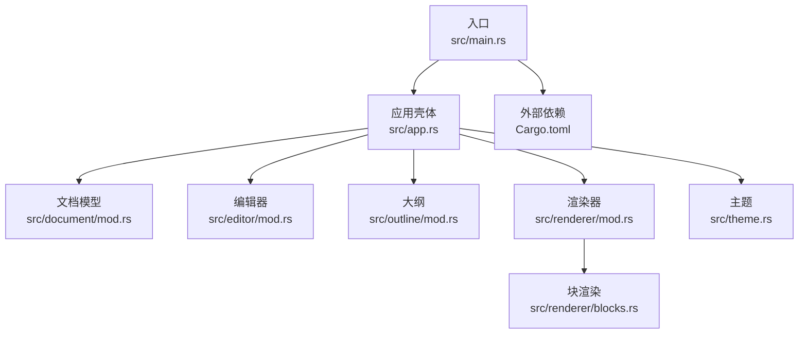
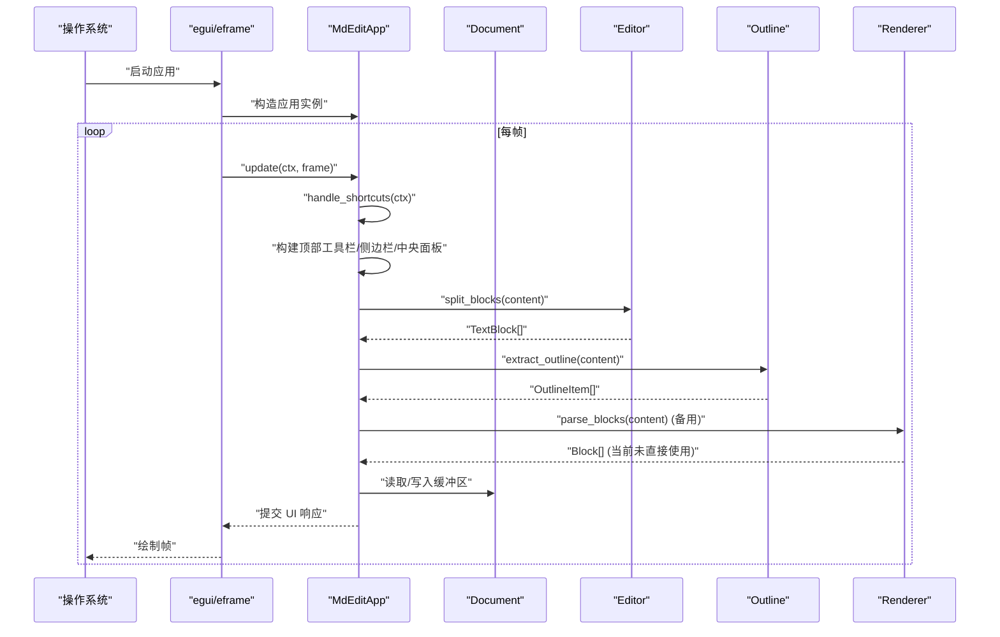
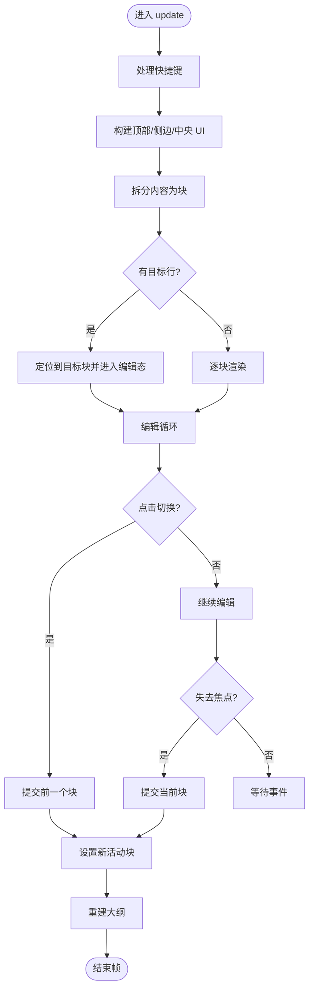
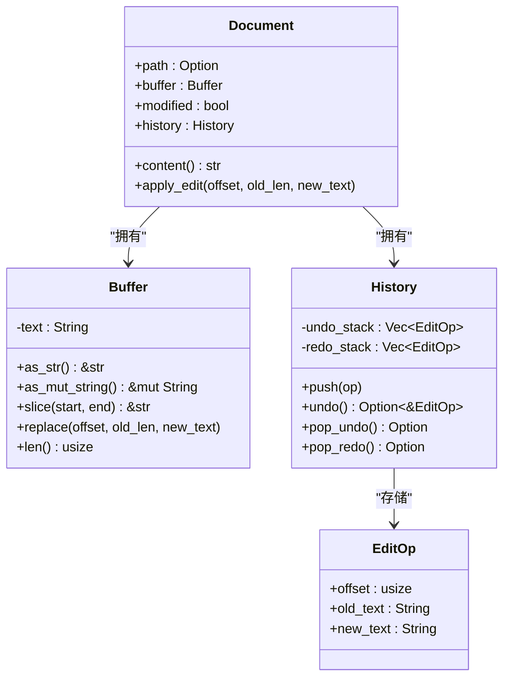
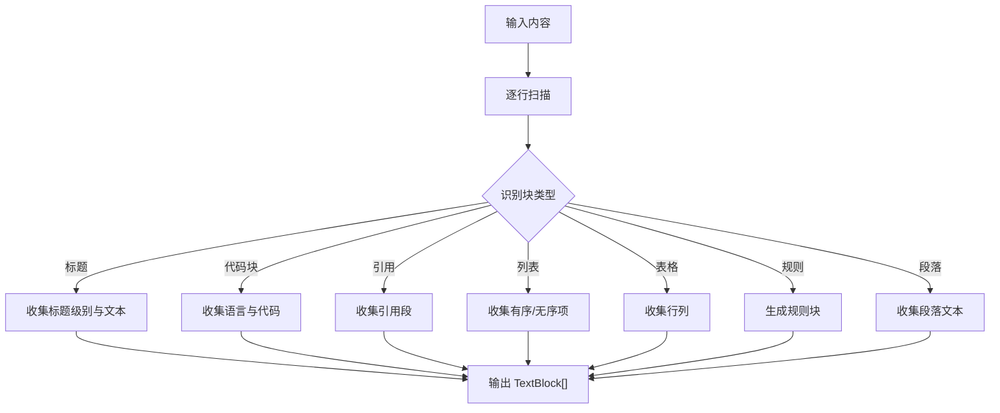
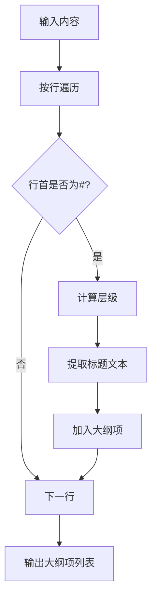
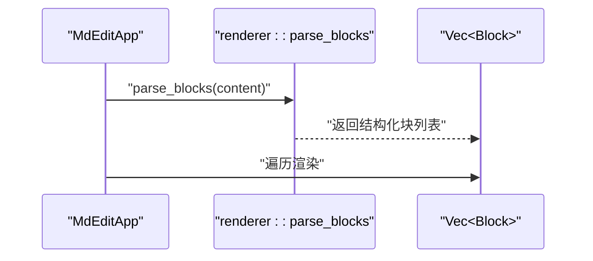
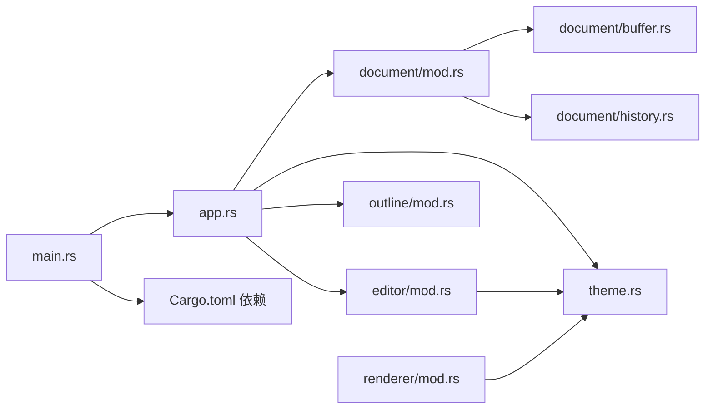

# 数据流与控制流

<cite>
**本文引用的文件**
- [main.rs](file://src/main.rs)
- [app.rs](file://src/app.rs)
- [document/mod.rs](file://src/document/mod.rs)
- [document/buffer.rs](file://src/document/buffer.rs)
- [document/history.rs](file://src/document/history.rs)
- [editor/mod.rs](file://src/editor/mod.rs)
- [outline/mod.rs](file://src/outline/mod.rs)
- [renderer/mod.rs](file://src/renderer/mod.rs)
- [renderer/blocks.rs](file://src/renderer/blocks.rs)
- [theme.rs](file://src/theme.rs)
- [Cargo.toml](file://Cargo.toml)
</cite>

## 目录
1. [简介](#简介)
2. [项目结构](#项目结构)
3. [核心组件](#核心组件)
4. [架构总览](#架构总览)
5. [详细组件分析](#详细组件分析)
6. [依赖关系分析](#依赖关系分析)
7. [性能考量](#性能考量)
8. [故障排查指南](#故障排查指南)
9. [结论](#结论)
10. [附录](#附录)

## 简介
本文件围绕 mdedit 的“数据流与控制流”进行系统化梳理，覆盖从用户输入到最终 UI 渲染的完整路径，包括事件捕获、状态更新、UI 重建的全过程；解释控制流的执行顺序，从 egui 事件循环到 mdedit 处理逻辑再到渲染输出；阐述数据在各模块间的传递机制（值/引用传递、共享状态管理）；分析异步操作（文件 I/O、对话框选择）的处理方式；并给出数据流图与控制流图，帮助开发者与使用者理解系统的运作机理。

## 项目结构
mdedit 采用模块化组织，核心模块如下：
- 入口与宿主：main.rs 启动 eframe 应用，创建 MdEditApp 实例
- 文档模型：document 模块负责内容缓冲、历史记录与修改标记
- 编辑器：editor 模块负责将文本拆分为块、渲染富文本块
- 大纲：outline 模块提取标题大纲
- 渲染器：renderer 模块使用 pulldown-cmark 解析 Markdown 并渲染
- 主题：theme 提供渲染配色与字号映射
- 依赖：Cargo.toml 定义 egui、eframe、pulldown-cmark、rfd 等

图表来源
- [main.rs:35-49](file://src/main.rs#L35-L49)
- [app.rs:9-43](file://src/app.rs#L9-L43)
- [document/mod.rs:9-14](file://src/document/mod.rs#L9-L14)
- [editor/mod.rs:4-22](file://src/editor/mod.rs#L4-L22)
- [outline/mod.rs:1-5](file://src/outline/mod.rs#L1-L5)
- [renderer/mod.rs:9-17](file://src/renderer/mod.rs#L9-L17)
- [renderer/blocks.rs:5-63](file://src/renderer/blocks.rs#L5-L63)
- [theme.rs:3-9](file://src/theme.rs#L3-L9)
- [Cargo.toml:8-13](file://Cargo.toml#L8-L13)

章节来源
- [main.rs:1-50](file://src/main.rs#L1-L50)
- [Cargo.toml:1-19](file://Cargo.toml#L1-L19)

## 核心组件
- 应用壳体 MdEditApp：持有文档、大纲项、主题、滚动目标、活动块索引与编辑文本等状态；负责菜单栏、侧边栏、中央编辑区的 UI 组装与事件处理
- 文档 Document：封装 Buffer、History、修改标记；提供 apply_edit 接口以记录编辑操作
- Buffer：对底层 String 的安全切片与替换接口
- History：维护撤销/重做栈，支持反向操作生成
- 编辑器 editor：将内容按块拆分，渲染富文本块
- 大纲 outline：从内容中提取标题层级、标题文本与行号
- 渲染器 renderer：基于 pulldown-cmark 解析 Markdown，产出结构化 Block 列表
- 主题 Theme：提供标题字号、颜色等渲染参数

章节来源
- [app.rs:9-185](file://src/app.rs#L9-L185)
- [document/mod.rs:9-50](file://src/document/mod.rs#L9-L50)
- [document/buffer.rs:1-29](file://src/document/buffer.rs#L1-L29)
- [document/history.rs:1-58](file://src/document/history.rs#L1-L58)
- [editor/mod.rs:4-349](file://src/editor/mod.rs#L4-L349)
- [outline/mod.rs:1-26](file://src/outline/mod.rs#L1-L26)
- [renderer/mod.rs:9-142](file://src/renderer/mod.rs#L9-L142)
- [theme.rs:3-21](file://src/theme.rs#L3-L21)

## 架构总览
mdedit 的控制流遵循 egui 的每帧 update 循环：应用层在 update 中处理快捷键、构建 UI、驱动渲染；渲染阶段由编辑器将文档内容拆分为块并逐块渲染；当用户编辑或点击时，状态被更新并触发重新布局与绘制。

图表来源
- [main.rs:35-49](file://src/main.rs#L35-L49)
- [app.rs:187-249](file://src/app.rs#L187-L249)
- [app.rs:251-328](file://src/app.rs#L251-L328)
- [editor/mod.rs:24-149](file://src/editor/mod.rs#L24-L149)
- [outline/mod.rs:7-26](file://src/outline/mod.rs#L7-L26)
- [renderer/mod.rs:19-142](file://src/renderer/mod.rs#L19-L142)

## 详细组件分析

### 应用壳体：MdEditApp 的数据与控制流
- 初始化：根据命令行参数决定是否加载初始文件；若无则创建空文档；初始化字体、主题、大纲
- 更新循环：在 update 中先处理快捷键，再构建 UI；顶部菜单栏触发文件/视图操作；侧边栏显示大纲；中央面板渲染编辑器
- 编辑流程：render_editor 将内容拆分为块；若存在 scroll_to_line，则定位到对应块并进入编辑态；点击非活动块时切换活动块；在活动块编辑时，响应 changed/lost_focus 事件提交更改
- 提交流程：commit_edit 将编辑后的文本回写到 Document.buffer 对应行区间，设置 modified 标记，并重建大纲

图表来源
- [app.rs:187-249](file://src/app.rs#L187-L249)
- [app.rs:251-328](file://src/app.rs#L251-L328)
- [app.rs:330-349](file://src/app.rs#L330-L349)

章节来源
- [app.rs:19-43](file://src/app.rs#L19-L43)
- [app.rs:86-114](file://src/app.rs#L86-L114)
- [app.rs:116-184](file://src/app.rs#L116-L184)
- [app.rs:251-328](file://src/app.rs#L251-L328)
- [app.rs:330-349](file://src/app.rs#L330-L349)

### 文档模型：Buffer、History 与修改标记
- Buffer：提供只读字符串视图、可变字符串引用、切片访问与原地替换；作为 Document 的内容容器
- History：记录每次编辑的偏移、旧文本、新文本；支持 push、undo、redo；撤销时清空 redo 栈
- Document：聚合 Buffer、History、modified 标记；提供 apply_edit 接口，内部调用 Buffer.replace 并记录历史

图表来源
- [document/mod.rs:9-50](file://src/document/mod.rs#L9-L50)
- [document/buffer.rs:1-29](file://src/document/buffer.rs#L1-L29)
- [document/history.rs:1-58](file://src/document/history.rs#L1-L58)

章节来源
- [document/mod.rs:9-50](file://src/document/mod.rs#L9-L50)
- [document/buffer.rs:1-29](file://src/document/buffer.rs#L1-L29)
- [document/history.rs:1-58](file://src/document/history.rs#L1-L58)

### 编辑器：块拆分与富文本渲染
- 块拆分：按行扫描，识别标题、代码块、引用、列表、表格、规则、段落等，形成 TextBlock 列表
- 富文本渲染：针对不同块类型渲染标题、段落、代码块、引用、列表、表格、规则；段落内支持加粗、斜体、行内代码等内联格式

图表来源
- [editor/mod.rs:24-149](file://src/editor/mod.rs#L24-L149)
- [editor/mod.rs:159-266](file://src/editor/mod.rs#L159-L266)

章节来源
- [editor/mod.rs:4-22](file://src/editor/mod.rs#L4-L22)
- [editor/mod.rs:24-149](file://src/editor/mod.rs#L24-L149)
- [editor/mod.rs:159-266](file://src/editor/mod.rs#L159-L266)

### 大纲：标题提取与导航
- 从内容中提取以 # 开头的标题，计算层级与标题文本，记录所在行号
- 在 UI 中以缩进显示，点击后将滚动目标设置为目标行，随后定位到对应块

图表来源
- [outline/mod.rs:7-26](file://src/outline/mod.rs#L7-L26)

章节来源
- [outline/mod.rs:1-26](file://src/outline/mod.rs#L1-L26)

### 渲染器：解析与块渲染
- 使用 pulldown-cmark 解析 Markdown，产出 Heading、Paragraph、CodeBlock、Quote、List、Rule 等结构化块
- 当前编辑器渲染主要依赖 editor 模块的 render_rich_block；renderer 模块的 parse_blocks 可用于替代方案或扩展

图表来源
- [renderer/mod.rs:19-142](file://src/renderer/mod.rs#L19-L142)
- [renderer/blocks.rs:5-63](file://src/renderer/blocks.rs#L5-L63)

章节来源
- [renderer/mod.rs:9-142](file://src/renderer/mod.rs#L9-L142)
- [renderer/blocks.rs:1-68](file://src/renderer/blocks.rs#L1-L68)

### 主题：渲染参数
- 提供标题字号数组、代码背景色、引用条颜色、文本与弱化色等参数，供渲染函数使用

章节来源
- [theme.rs:3-21](file://src/theme.rs#L3-L21)

## 依赖关系分析
- 外部依赖：eframe/egui 提供 UI 框架与事件循环；pulldown-cmark 提供 Markdown 解析；rfd 提供跨平台文件对话框
- 内部依赖：app 依赖 document、editor、outline、theme；editor 依赖 theme；renderer 依赖 theme；document 依赖 buffer、history

图表来源
- [main.rs:10-13](file://src/main.rs#L10-L13)
- [app.rs:1-8](file://src/app.rs#L1-L8)
- [document/mod.rs:1-5](file://src/document/mod.rs#L1-L5)
- [editor/mod.rs:1-2](file://src/editor/mod.rs#L1-L2)
- [outline/mod.rs:1](file://src/outline/mod.rs#L1)
- [theme.rs:1](file://src/theme.rs#L1)
- [renderer/mod.rs:1-2](file://src/renderer/mod.rs#L1-L2)
- [document/buffer.rs:1](file://src/document/buffer.rs#L1)
- [document/history.rs:1](file://src/document/history.rs#L1)
- [Cargo.toml:8-13](file://Cargo.toml#L8-L13)

章节来源
- [Cargo.toml:8-13](file://Cargo.toml#L8-L13)

## 性能考量
- 渲染策略：编辑器按块渲染，避免整文重排；仅在活动块编辑时局部更新
- 字体配置：按平台加载中文字体，减少渲染开销与字体回退
- 文件 I/O：保存/打开使用同步文件系统调用；建议在长任务场景引入后台线程与消息队列（当前未实现）
- 历史记录：Undo/Redo 栈在频繁编辑时可能增长，需考虑内存占用与清理策略

## 故障排查指南
- 无法打开文件：命令行参数解析失败或文件读取错误会弹出对话框提示；检查路径权限与文件是否存在
- 保存失败：保存时写入失败不会抛错，但会保持修改标记；确认目标路径可写
- 快捷键无效：确认 Ctrl/Shift 组合键与 egui 输入修饰符一致；检查 egui 上下文输入状态
- 大纲不更新：编辑后需要重建大纲；检查 outline 提取逻辑与内容变更触发点
- 编辑冲突：点击切换或失焦时会提交当前块；若出现内容错位，检查块边界与行号映射

章节来源
- [main.rs:15-33](file://src/main.rs#L15-L33)
- [app.rs:133-163](file://src/app.rs#L133-L163)
- [app.rs:86-114](file://src/app.rs#L86-L114)
- [app.rs:266-278](file://src/app.rs#L266-L278)

## 结论
mdedit 通过清晰的模块划分与 egui 的事件驱动模型，实现了从用户输入到 UI 渲染的高效闭环。数据在应用壳体、文档模型、编辑器与渲染器之间以值/引用传递的方式流动，状态更新与 UI 重建紧密耦合。当前实现以同步 I/O 为主，适合轻量编辑场景；未来可在长任务与并发方面进一步优化，同时完善撤销/重做与错误传播机制。

## 附录
- 关键数据流转节点示例（以路径标注代替代码片段）
  - 应用初始化与窗口选项：[main.rs:35-49](file://src/main.rs#L35-L49)
  - 应用更新循环与 UI 构建：[app.rs:187-249](file://src/app.rs#L187-L249)
  - 编辑器块拆分与渲染：[editor/mod.rs:24-149](file://src/editor/mod.rs#L24-L149)、[editor/mod.rs:159-266](file://src/editor/mod.rs#L159-L266)
  - 文档缓冲与历史记录：[document/buffer.rs:18-24](file://src/document/buffer.rs#L18-L24)、[document/history.rs:20-46](file://src/document/history.rs#L20-L46)
  - 大纲提取与导航：[outline/mod.rs:7-26](file://src/outline/mod.rs#L7-L26)
  - 渲染器解析与块渲染：[renderer/mod.rs:19-142](file://src/renderer/mod.rs#L19-L142)、[renderer/blocks.rs:5-63](file://src/renderer/blocks.rs#L5-L63)
  - 主题参数：[theme.rs:11-20](file://src/theme.rs#L11-L20)