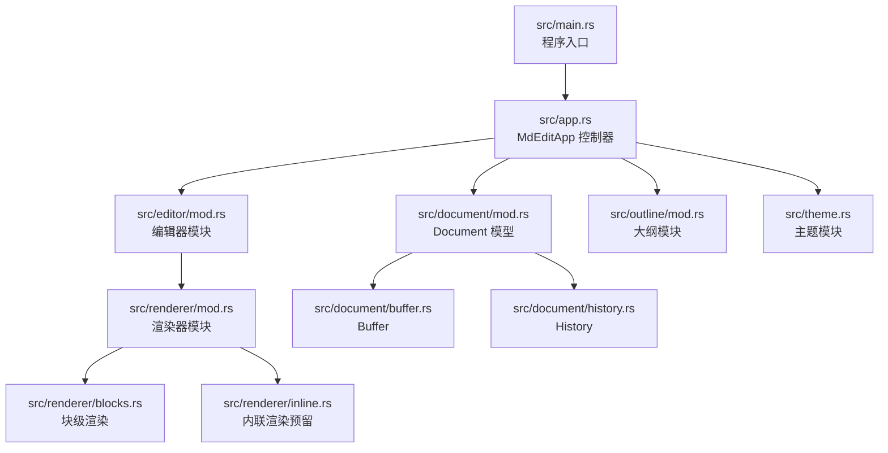
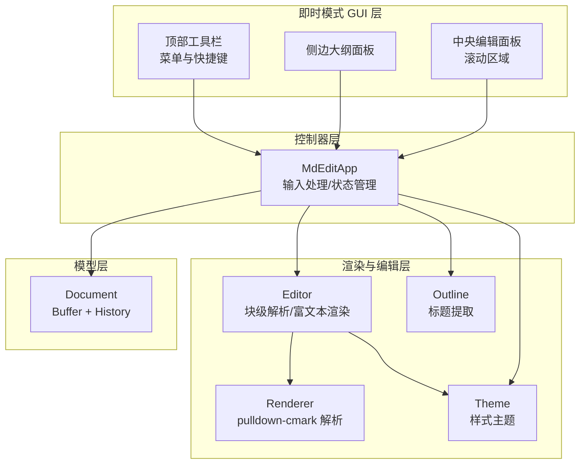
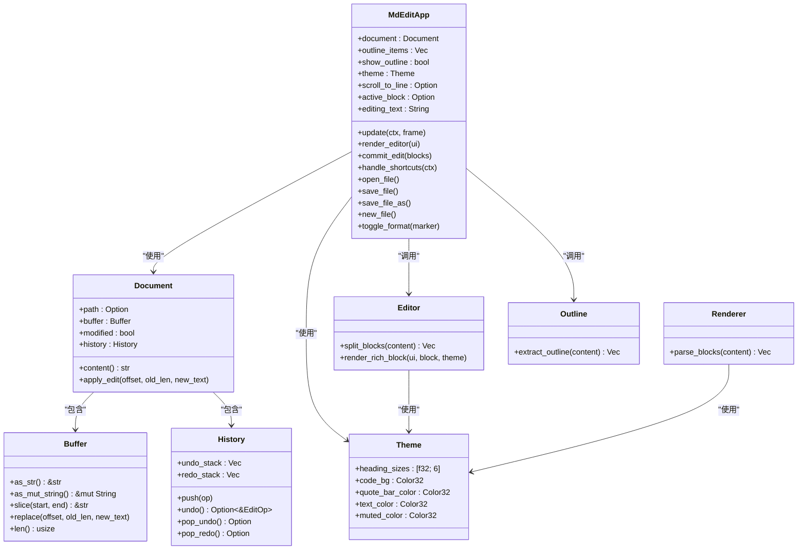
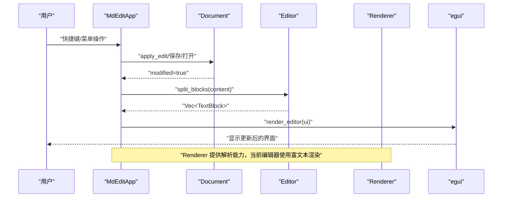
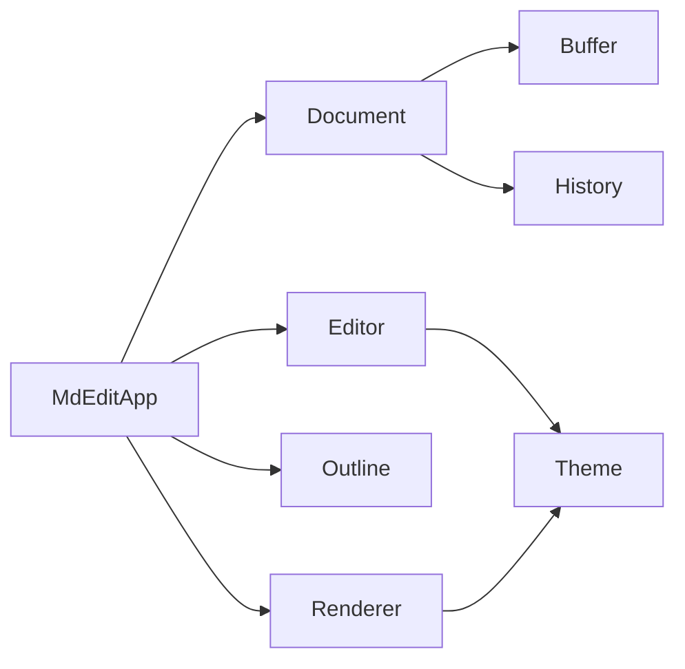
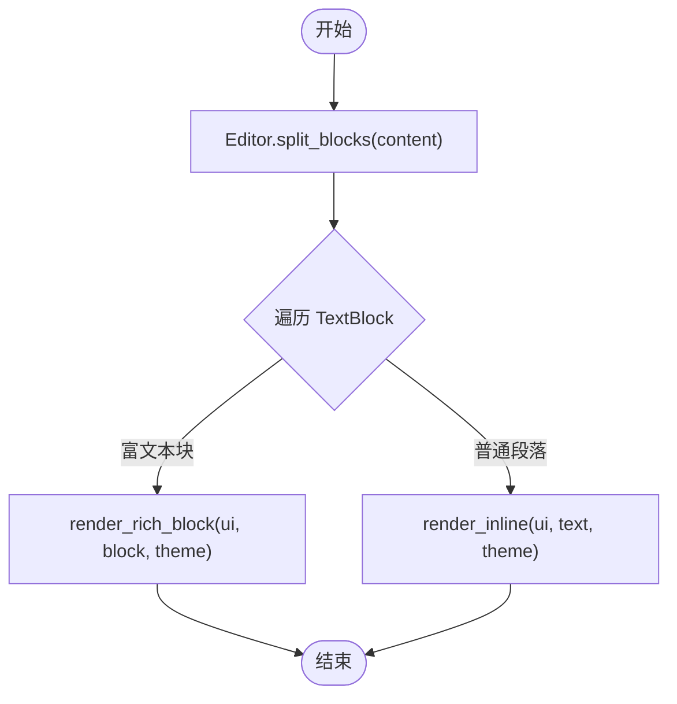
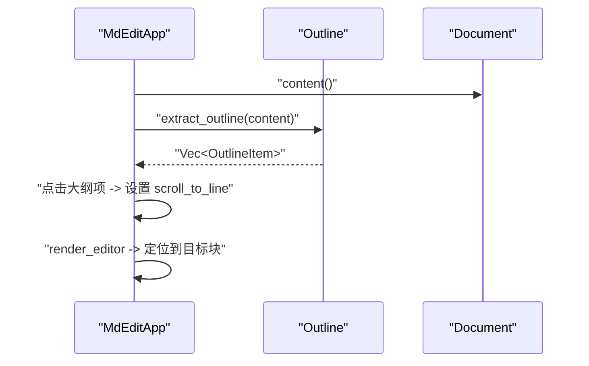
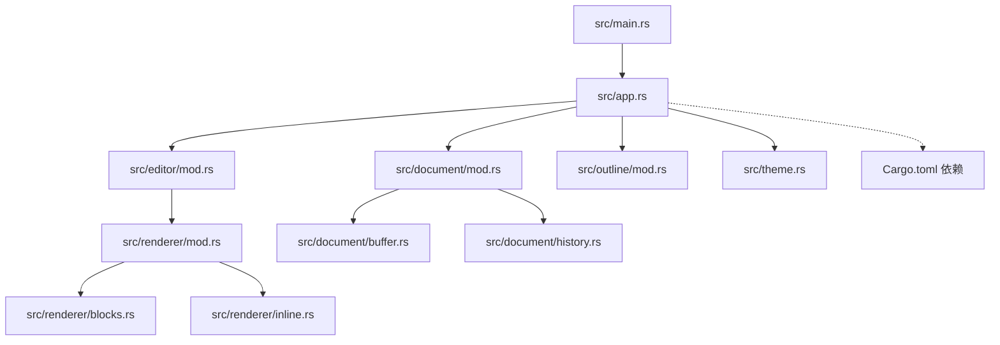

# 核心架构设计

<cite>
**本文档引用的文件**
- [main.rs](file://src/main.rs)
- [app.rs](file://src/app.rs)
- [mod.rs](file://src/document/mod.rs)
- [buffer.rs](file://src/document/buffer.rs)
- [history.rs](file://src/document/history.rs)
- [mod.rs](file://src/editor/mod.rs)
- [mod.rs](file://src/renderer/mod.rs)
- [blocks.rs](file://src/renderer/blocks.rs)
- [inline.rs](file://src/renderer/inline.rs)
- [mod.rs](file://src/outline/mod.rs)
- [theme.rs](file://src/theme.rs)
- [Cargo.toml](file://Cargo.toml)
- [README.md](file://README.md)
</cite>

## 目录
1. [简介](#简介)
2. [项目结构](#项目结构)
3. [核心组件](#核心组件)
4. [架构总览](#架构总览)
5. [详细组件分析](#详细组件分析)
6. [依赖关系分析](#依赖关系分析)
7. [性能考量](#性能考量)
8. [故障排除指南](#故障排除指南)
9. [结论](#结论)

## 简介
本项目是一个基于 eframe/egui 的即时模式 GUI Markdown 编辑器，采用“所见即所得”（WYSIWYG）渲染方式，无需 WebView2。本文档深入解析其核心架构设计，重点阐述：
- 即时模式 GUI 与传统状态模式 GUI 的根本差异
- MVC 设计模式在本项目中的应用：View（egui 组件）、Controller（MdEditApp）、Model（Document）
- 模块化设计原则及各核心模块间的协作关系
- 数据流与控制流：从用户输入到最终 UI 渲染的完整路径
- 架构决策的技术考量：性能优化、内存管理、跨平台兼容性等

## 项目结构
项目采用按功能域划分的模块化组织方式，核心目录与职责如下：
- src/main.rs：程序入口，负责命令行参数解析、窗口选项配置与 eframe 启动
- src/app.rs：应用主控制器，封装 MdEditApp，协调 View 与 Model
- src/document/：文档模型层，包含缓冲区与历史记录
- src/editor/：编辑器逻辑，负责 Markdown 块级解析与富文本渲染
- src/renderer/：渲染器层，使用 pulldown-cmark 解析 Markdown 并生成渲染块
- src/outline/：大纲提取模块，从文档内容中抽取标题层级
- src/theme.rs：主题样式定义，统一字体大小与颜色

图表来源
- [main.rs:1-50](file://src/main.rs#L1-L50)
- [app.rs:1-351](file://src/app.rs#L1-L351)
- [mod.rs:1-51](file://src/document/mod.rs#L1-L51)
- [mod.rs:1-349](file://src/editor/mod.rs#L1-L349)
- [mod.rs:1-143](file://src/renderer/mod.rs#L1-L143)
- [blocks.rs:1-68](file://src/renderer/blocks.rs#L1-L68)
- [inline.rs:1-2](file://src/renderer/inline.rs#L1-L2)
- [buffer.rs:1-30](file://src/document/buffer.rs#L1-L30)
- [history.rs:1-59](file://src/document/history.rs#L1-L59)
- [mod.rs:1-27](file://src/outline/mod.rs#L1-L27)
- [theme.rs:1-22](file://src/theme.rs#L1-L22)

章节来源
- [main.rs:1-50](file://src/main.rs#L1-L50)
- [app.rs:1-351](file://src/app.rs#L1-L351)
- [mod.rs:1-51](file://src/document/mod.rs#L1-L51)
- [mod.rs:1-349](file://src/editor/mod.rs#L1-L349)
- [mod.rs:1-143](file://src/renderer/mod.rs#L1-L143)
- [blocks.rs:1-68](file://src/renderer/blocks.rs#L1-L68)
- [inline.rs:1-2](file://src/renderer/inline.rs#L1-L2)
- [buffer.rs:1-30](file://src/document/buffer.rs#L1-L30)
- [history.rs:1-59](file://src/document/history.rs#L1-L59)
- [mod.rs:1-27](file://src/outline/mod.rs#L1-L27)
- [theme.rs:1-22](file://src/theme.rs#L1-L22)

## 核心组件
本节对 MVC 中的三个核心组件进行深入剖析，并说明它们在即时模式 GUI 下的职责分工。

- 视图（View）：由 egui 组件构成，负责 UI 呈现与用户交互。在即时模式下，每次 update 循环都会根据当前状态重新绘制所有可见元素，不持久保存 UI 对象。
- 控制器（Controller）：MdEditApp 承担控制器职责，处理用户输入、快捷键、菜单事件、滚动定位、大纲更新等；同时协调各模块协作。
- 模型（Model）：Document 封装文档路径、缓冲区、修改状态与历史记录，提供内容变更接口与撤销/重做能力。

章节来源
- [app.rs:187-249](file://src/app.rs#L187-L249)
- [mod.rs:9-50](file://src/document/mod.rs#L9-L50)
- [buffer.rs:1-30](file://src/document/buffer.rs#L1-L30)
- [history.rs:1-59](file://src/document/history.rs#L1-L59)

## 架构总览
本项目采用“即时模式 GUI + MVC”的混合架构：
- 即时模式 GUI：egui 在每个帧周期内重建 UI，避免状态持久化，降低复杂度并提升响应速度
- MVC 分离：
  - View：egui 面板、菜单、文本编辑框、滚动区域
  - Controller：MdEditApp，集中处理输入、状态切换与模块协调
  - Model：Document，承载文档数据与历史操作

图表来源
- [app.rs:187-249](file://src/app.rs#L187-L249)
- [app.rs:251-328](file://src/app.rs#L251-L328)
- [mod.rs:9-50](file://src/document/mod.rs#L9-L50)
- [mod.rs:1-349](file://src/editor/mod.rs#L1-L349)
- [mod.rs:1-143](file://src/renderer/mod.rs#L1-L143)
- [mod.rs:1-27](file://src/outline/mod.rs#L1-L27)
- [theme.rs:1-22](file://src/theme.rs#L1-L22)

## 详细组件分析

### 即时模式 GUI 与传统状态模式 GUI 的区别
- 即时模式（Immediate Mode GUI）：
  - 每帧重建 UI，不维护 UI 对象的生命周期
  - 通过函数调用直接声明 UI，egui 负责布局、绘制与事件分发
  - 优点：实现简单、易于调试、内存占用低
  - 缺点：需要在每帧中重复计算 UI 结构
- 传统状态模式（Retained Mode GUI）：
  - 维护 UI 对象树，事件驱动更新
  - 优点：适合复杂 UI 生命周期管理
  - 缺点：对象树复杂、内存占用高、调试困难

本项目采用即时模式，所有 UI 元素在 update 循环中被重新构建，确保渲染与业务逻辑高度解耦。

章节来源
- [app.rs:187-249](file://src/app.rs#L187-L249)

### MVC 设计模式应用
- View（egui 组件）：顶部菜单、侧边大纲、中央编辑面板、滚动区域等
- Controller（MdEditApp）：处理快捷键、菜单点击、文件操作、大纲跳转、滚动定位、富文本编辑提交
- Model（Document）：Buffer 存储内容，History 记录编辑操作，modified 标记脏状态

图表来源
- [app.rs:9-43](file://src/app.rs#L9-L43)
- [app.rs:187-351](file://src/app.rs#L187-L351)
- [mod.rs:9-50](file://src/document/mod.rs#L9-L50)
- [buffer.rs:1-30](file://src/document/buffer.rs#L1-L30)
- [history.rs:1-59](file://src/document/history.rs#L1-L59)
- [mod.rs:1-349](file://src/editor/mod.rs#L1-L349)
- [mod.rs:1-143](file://src/renderer/mod.rs#L1-L143)
- [mod.rs:1-27](file://src/outline/mod.rs#L1-L27)
- [theme.rs:1-22](file://src/theme.rs#L1-L22)

章节来源
- [app.rs:9-43](file://src/app.rs#L9-L43)
- [app.rs:187-351](file://src/app.rs#L187-L351)
- [mod.rs:9-50](file://src/document/mod.rs#L9-L50)
- [buffer.rs:1-30](file://src/document/buffer.rs#L1-L30)
- [history.rs:1-59](file://src/document/history.rs#L1-L59)
- [mod.rs:1-349](file://src/editor/mod.rs#L1-L349)
- [mod.rs:1-143](file://src/renderer/mod.rs#L1-L143)
- [mod.rs:1-27](file://src/outline/mod.rs#L1-L27)
- [theme.rs:1-22](file://src/theme.rs#L1-L22)

### 数据流与控制流
从用户输入到最终 UI 渲染的完整路径如下：
1. 用户在顶部菜单或快捷键触发动作（新建、打开、保存、格式化）
2. MdEditApp 接收输入并更新内部状态（如 active_block、editing_text、outline_items）
3. MdEditApp 调用 Document.apply_edit 或直接替换 Buffer 内容
4. Editor 将内容拆分为 TextBlock 列表
5. Renderer 使用 pulldown-cmark 解析为 Block 列表（当前用于渲染器模块，但编辑器已实现富文本渲染）
6. egui 根据当前状态重新绘制 UI（即时模式）

图表来源
- [app.rs:90-175](file://src/app.rs#L90-L175)
- [app.rs:251-328](file://src/app.rs#L251-L328)
- [mod.rs:39-49](file://src/document/mod.rs#L39-L49)
- [mod.rs:24-149](file://src/editor/mod.rs#L24-L149)
- [mod.rs:19-142](file://src/renderer/mod.rs#L19-L142)

章节来源
- [app.rs:90-175](file://src/app.rs#L90-L175)
- [app.rs:251-328](file://src/app.rs#L251-L328)
- [mod.rs:39-49](file://src/document/mod.rs#L39-L49)
- [mod.rs:24-149](file://src/editor/mod.rs#L24-L149)
- [mod.rs:19-142](file://src/renderer/mod.rs#L19-L142)

### 模块化设计原则与协作关系
- 文档模块（Document）：提供内容存储与历史管理，支持撤销/重做
- 编辑器模块（Editor）：负责 Markdown 块级识别与富文本渲染，支持粗体、斜体、代码等内联样式
- 渲染器模块（Renderer）：使用 pulldown-cmark 解析 Markdown，生成标准化 Block 结构
- 大纲模块（Outline）：从文档中提取标题层级，支持快速跳转
- 主题模块（Theme）：统一字体大小与颜色，便于样式定制

图表来源
- [mod.rs:9-50](file://src/document/mod.rs#L9-L50)
- [buffer.rs:1-30](file://src/document/buffer.rs#L1-L30)
- [history.rs:1-59](file://src/document/history.rs#L1-L59)
- [app.rs:1-17](file://src/app.rs#L1-L17)
- [mod.rs:1-349](file://src/editor/mod.rs#L1-L349)
- [mod.rs:1-143](file://src/renderer/mod.rs#L1-L143)
- [mod.rs:1-27](file://src/outline/mod.rs#L1-L27)
- [theme.rs:1-22](file://src/theme.rs#L1-L22)

章节来源
- [mod.rs:9-50](file://src/document/mod.rs#L9-L50)
- [buffer.rs:1-30](file://src/document/buffer.rs#L1-L30)
- [history.rs:1-59](file://src/document/history.rs#L1-L59)
- [app.rs:1-17](file://src/app.rs#L1-L17)
- [mod.rs:1-349](file://src/editor/mod.rs#L1-L349)
- [mod.rs:1-143](file://src/renderer/mod.rs#L1-L143)
- [mod.rs:1-27](file://src/outline/mod.rs#L1-L27)
- [theme.rs:1-22](file://src/theme.rs#L1-L22)

### 编辑器与渲染器的协同
- Editor：将文档内容切分为 TextBlock，逐块渲染富文本（粗体、斜体、代码等），并在富文本渲染中使用 LayoutJob 实现内联样式拼接
- Renderer：使用 pulldown-cmark 解析 Markdown，生成标准化 Block（标题、段落、代码块、引用、列表、规则等），当前用于渲染器模块，编辑器已实现富文本渲染

图表来源
- [mod.rs:24-149](file://src/editor/mod.rs#L24-L149)
- [mod.rs:159-266](file://src/editor/mod.rs#L159-L266)
- [mod.rs:268-348](file://src/editor/mod.rs#L268-L348)

章节来源
- [mod.rs:24-149](file://src/editor/mod.rs#L24-L149)
- [mod.rs:159-266](file://src/editor/mod.rs#L159-L266)
- [mod.rs:268-348](file://src/editor/mod.rs#L268-L348)

### 大纲提取与跳转
- Outline.extract_outline 从文档内容中提取标题层级，生成 OutlineItem 列表
- MdEditApp 在侧边面板展示大纲项，点击后设置 scroll_to_line，随后定位到对应块并进入编辑状态

图表来源
- [app.rs:86-88](file://src/app.rs#L86-L88)
- [app.rs:220-239](file://src/app.rs#L220-L239)
- [app.rs:256-264](file://src/app.rs#L256-L264)
- [mod.rs:7-26](file://src/outline/mod.rs#L7-L26)

章节来源
- [app.rs:86-88](file://src/app.rs#L86-L88)
- [app.rs:220-239](file://src/app.rs#L220-L239)
- [app.rs:256-264](file://src/app.rs#L256-L264)
- [mod.rs:7-26](file://src/outline/mod.rs#L7-L26)

### 主题系统
- Theme 定义标题字号数组与常用颜色，Editor 与 Renderer 均使用该主题进行渲染
- 支持不同平台字体配置，提高中日韩文字显示效果

章节来源
- [theme.rs:1-22](file://src/theme.rs#L1-L22)
- [app.rs:45-84](file://src/app.rs#L45-L84)
- [mod.rs:159-266](file://src/editor/mod.rs#L159-L266)
- [blocks.rs:5-63](file://src/renderer/blocks.rs#L5-L63)

## 依赖关系分析
项目依赖关系清晰，遵循“上层控制器依赖下层模块”的原则，避免循环依赖。

图表来源
- [main.rs:1-50](file://src/main.rs#L1-L50)
- [app.rs:1-17](file://src/app.rs#L1-L17)
- [mod.rs:1-51](file://src/document/mod.rs#L1-L51)
- [mod.rs:1-349](file://src/editor/mod.rs#L1-L349)
- [mod.rs:1-143](file://src/renderer/mod.rs#L1-L143)
- [blocks.rs:1-68](file://src/renderer/blocks.rs#L1-L68)
- [inline.rs:1-2](file://src/renderer/inline.rs#L1-L2)
- [buffer.rs:1-30](file://src/document/buffer.rs#L1-L30)
- [history.rs:1-59](file://src/document/history.rs#L1-L59)
- [mod.rs:1-27](file://src/outline/mod.rs#L1-L27)
- [theme.rs:1-22](file://src/theme.rs#L1-L22)
- [Cargo.toml:8-13](file://Cargo.toml#L8-L13)

章节来源
- [main.rs:1-50](file://src/main.rs#L1-L50)
- [app.rs:1-17](file://src/app.rs#L1-L17)
- [mod.rs:1-51](file://src/document/mod.rs#L1-L51)
- [mod.rs:1-349](file://src/editor/mod.rs#L1-L349)
- [mod.rs:1-143](file://src/renderer/mod.rs#L1-L143)
- [blocks.rs:1-68](file://src/renderer/blocks.rs#L1-L68)
- [inline.rs:1-2](file://src/renderer/inline.rs#L1-L2)
- [buffer.rs:1-30](file://src/document/buffer.rs#L1-L30)
- [history.rs:1-59](file://src/document/history.rs#L1-L59)
- [mod.rs:1-27](file://src/outline/mod.rs#L1-L27)
- [theme.rs:1-22](file://src/theme.rs#L1-L22)
- [Cargo.toml:8-13](file://Cargo.toml#L8-L13)

## 性能考量
- 即时模式 GUI：每帧重建 UI，避免状态树维护，降低内存占用与复杂度
- 文档缓冲区：Buffer 直接持有 String，提供切片与替换操作，减少不必要的拷贝
- 历史记录：History 双栈实现撤销/重做，避免冗余操作记录
- 跨平台字体：根据操作系统选择合适的字体路径，提升中日韩文字显示质量
- 渲染优化：Editor 富文本渲染使用 LayoutJob，避免频繁分配；Renderer 使用 pulldown-cmark 解析，保证标准兼容性
- 发布配置：Cargo.toml 启用 LTO、strip、压缩优化，减小二进制体积

章节来源
- [buffer.rs:18-24](file://src/document/buffer.rs#L18-L24)
- [history.rs:20-46](file://src/document/history.rs#L20-L46)
- [app.rs:45-84](file://src/app.rs#L45-L84)
- [mod.rs:268-348](file://src/editor/mod.rs#L268-L348)
- [mod.rs:19-142](file://src/renderer/mod.rs#L19-L142)
- [Cargo.toml:15-19](file://Cargo.toml#L15-L19)

## 故障排除指南
- 文件打开失败：当命令行参数指定的文件无法读取时，会弹出错误对话框提示用户
- 字体加载失败：若指定字体路径不存在，将回退到默认字体，不影响运行
- 保存失败：保存文件或另存为时若写入失败，不会修改文档状态
- 大纲为空：当文档为空时，大纲列表清空，不影响编辑器渲染

章节来源
- [main.rs:15-33](file://src/main.rs#L15-L33)
- [app.rs:45-84](file://src/app.rs#L45-L84)
- [app.rs:133-163](file://src/app.rs#L133-L163)
- [app.rs:86-88](file://src/app.rs#L86-L88)

## 结论
本项目通过即时模式 GUI 与 MVC 的有机结合，实现了轻量、高性能且跨平台的 Markdown 编辑体验。MVC 分离明确了职责边界，模块化设计提升了可维护性与扩展性。Editor 的富文本渲染与 Outline 的标题导航增强了用户体验，而 Document 的历史记录与 Buffer 的高效操作则保障了编辑的可靠性与性能。未来可在渲染器模块中进一步完善内联样式解析，以与 Editor 的富文本能力形成互补。