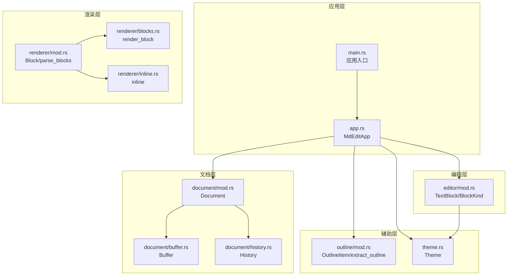
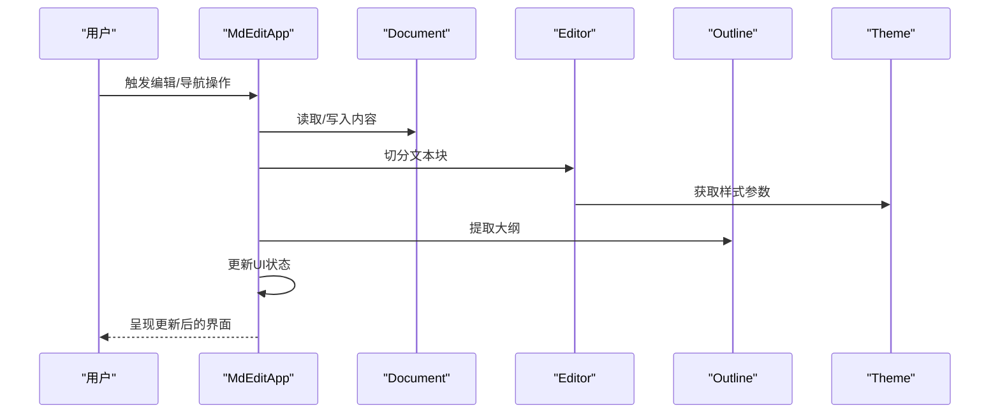
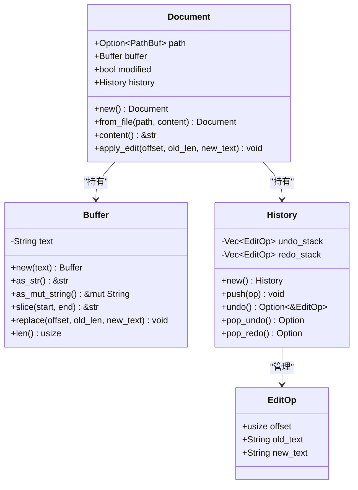
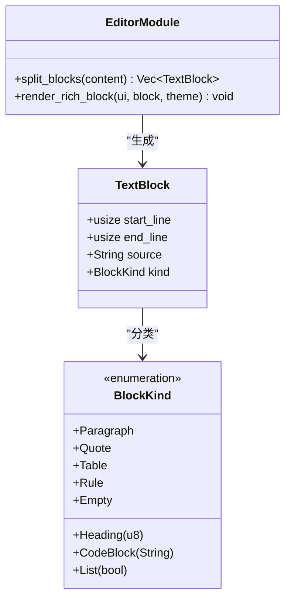
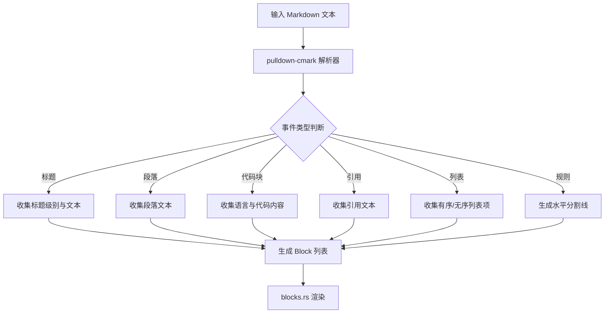
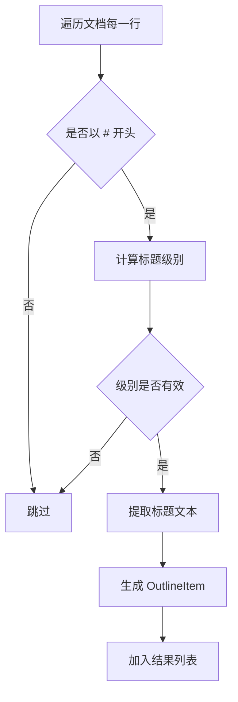
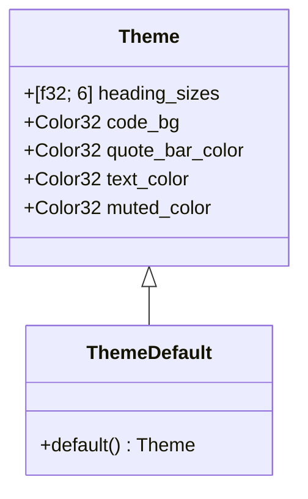
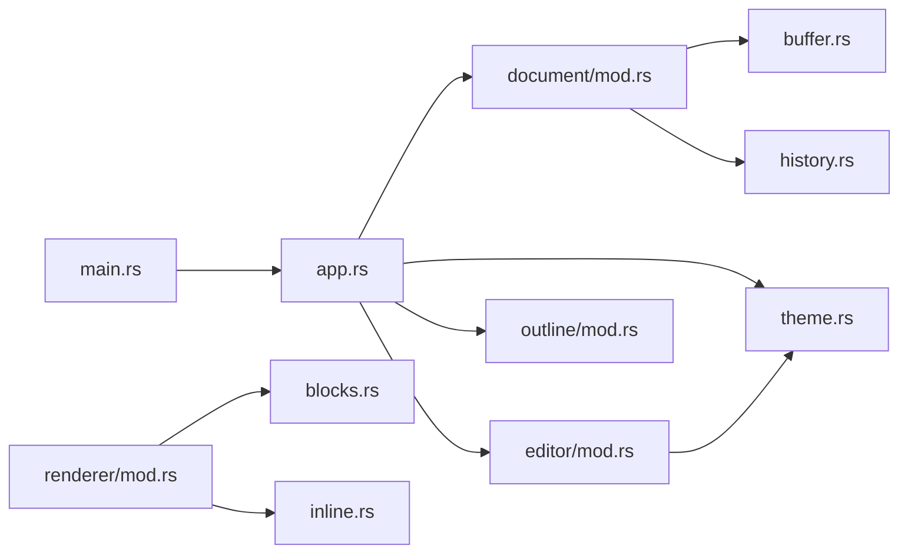

# 模块化架构设计

<cite>
**本文档引用的文件**
- [main.rs](file://src/main.rs)
- [app.rs](file://src/app.rs)
- [theme.rs](file://src/theme.rs)
- [document/mod.rs](file://src/document/mod.rs)
- [document/buffer.rs](file://src/document/buffer.rs)
- [document/history.rs](file://src/document/history.rs)
- [editor/mod.rs](file://src/editor/mod.rs)
- [outline/mod.rs](file://src/outline/mod.rs)
- [renderer/mod.rs](file://src/renderer/mod.rs)
- [renderer/blocks.rs](file://src/renderer/blocks.rs)
- [renderer/inline.rs](file://src/renderer/inline.rs)
- [Cargo.toml](file://Cargo.toml)
- [README.md](file://README.md)
</cite>

## 目录
1. [简介](#简介)
2. [项目结构](#项目结构)
3. [核心组件](#核心组件)
4. [架构总览](#架构总览)
5. [详细组件分析](#详细组件分析)
6. [依赖关系分析](#依赖关系分析)
7. [性能考虑](#性能考虑)
8. [故障排除指南](#故障排除指南)
9. [结论](#结论)

## 简介
本项目是一个轻量级跨平台 Markdown 编辑器，采用模块化架构设计，通过清晰的职责边界实现松耦合。系统围绕文档编辑与渲染两大核心功能构建，支持所见即所得（WYSIWYG）编辑体验，并提供大纲导航、主题配置等增强功能。本文档深入分析各模块的设计原则、数据结构、接口契约以及模块间通信机制，旨在帮助开发者理解整体设计思路并指导后续扩展开发。

## 项目结构
项目采用按功能域划分的模块化组织方式，每个功能域独立封装，仅暴露必要的公共接口。主要模块包括：
- 应用入口与生命周期管理：负责应用初始化、窗口配置、事件循环与UI布局
- 文档模型：抽象文档内容、缓冲区与历史记录，提供统一的编辑操作接口
- 编辑器：负责将文档内容解析为文本块并进行富文本渲染
- 渲染器：基于 pulldown-cmark 解析 Markdown 并生成渲染块
- 大纲：从文档中提取标题层级，提供导航索引
- 主题：集中管理渲染样式参数

**图表来源**
- [main.rs:1-50](file://src/main.rs#L1-L50)
- [app.rs:1-351](file://src/app.rs#L1-L351)
- [document/mod.rs:1-51](file://src/document/mod.rs#L1-L51)
- [document/buffer.rs:1-30](file://src/document/buffer.rs#L1-L30)
- [document/history.rs:1-59](file://src/document/history.rs#L1-L59)
- [editor/mod.rs:1-349](file://src/editor/mod.rs#L1-L349)
- [renderer/mod.rs:1-143](file://src/renderer/mod.rs#L1-L143)
- [renderer/blocks.rs:1-68](file://src/renderer/blocks.rs#L1-L68)
- [renderer/inline.rs:1-2](file://src/renderer/inline.rs#L1-L2)
- [outline/mod.rs:1-27](file://src/outline/mod.rs#L1-L27)
- [theme.rs:1-22](file://src/theme.rs#L1-L22)

**章节来源**
- [main.rs:1-50](file://src/main.rs#L1-L50)
- [app.rs:1-351](file://src/app.rs#L1-L351)
- [Cargo.toml:1-19](file://Cargo.toml#L1-L19)

## 核心组件
本节概述各核心模块的职责与关键接口，强调通过最小暴露面实现松耦合。

- Document（文档）
  - 职责：封装文档路径、缓冲区、修改状态与历史记录；提供统一的编辑操作接口
  - 关键接口：构造函数、内容访问、编辑应用与历史管理
  - 设计要点：将缓冲区与历史分离，便于独立演进与测试

- Editor（编辑器）
  - 职责：将文档内容切分为文本块，识别块类型并进行富文本渲染
  - 关键接口：文本块分割、块渲染、内联格式解析
  - 设计要点：块类型枚举明确区分不同Markdown元素，便于扩展新块类型

- Renderer（渲染器）
  - 职责：使用 pulldown-cmark 解析 Markdown，生成标准化渲染块
  - 关键接口：块解析、块渲染
  - 设计要点：与编辑器的渲染逻辑互补，编辑器偏向所见即所得，渲染器偏向标准解析

- Outline（大纲）
  - 职责：从文档中提取标题层级，生成导航项
  - 关键接口：大纲提取
  - 设计要点：简单高效，仅关注标题层级

- Theme（主题）
  - 职责：集中管理渲染样式参数
  - 关键接口：默认主题配置
  - 设计要点：单一职责，便于主题切换与定制

**章节来源**
- [document/mod.rs:9-50](file://src/document/mod.rs#L9-L50)
- [editor/mod.rs:4-22](file://src/editor/mod.rs#L4-L22)
- [renderer/mod.rs:9-17](file://src/renderer/mod.rs#L9-L17)
- [outline/mod.rs:1-26](file://src/outline/mod.rs#L1-L26)
- [theme.rs:3-21](file://src/theme.rs#L3-L21)

## 架构总览
系统采用“应用协调 + 模块自治”的架构模式。应用层负责UI布局与事件调度，各功能模块保持独立，通过明确的接口进行交互。这种设计提升了可维护性、可测试性与可扩展性。

**图表来源**
- [app.rs:187-351](file://src/app.rs#L187-L351)
- [document/mod.rs:35-50](file://src/document/mod.rs#L35-L50)
- [editor/mod.rs:24-149](file://src/editor/mod.rs#L24-L149)
- [outline/mod.rs:7-26](file://src/outline/mod.rs#L7-L26)
- [theme.rs:11-21](file://src/theme.rs#L11-L21)

## 详细组件分析

### Document 模块分析
Document 模块是文档的核心抽象，负责内容存储、编辑操作与历史管理。其设计遵循“数据与行为分离”的原则，Buffer 与 History 各自承担单一职责，通过 Document 统一协调。

**图表来源**
- [document/mod.rs:9-50](file://src/document/mod.rs#L9-L50)
- [document/buffer.rs:1-30](file://src/document/buffer.rs#L1-L30)
- [document/history.rs:1-59](file://src/document/history.rs#L1-L59)

**章节来源**
- [document/mod.rs:16-50](file://src/document/mod.rs#L16-L50)
- [document/buffer.rs:5-29](file://src/document/buffer.rs#L5-L29)
- [document/history.rs:12-58](file://src/document/history.rs#L12-L58)

### Editor 模块分析
Editor 模块负责将文档内容解析为文本块并进行渲染。其核心是 TextBlock 结构与 BlockKind 枚举，用于精确识别不同类型的Markdown块。渲染逻辑集中在 render_rich_block 函数中，结合 Theme 参数实现一致的视觉风格。

**图表来源**
- [editor/mod.rs:4-22](file://src/editor/mod.rs#L4-L22)
- [editor/mod.rs:24-149](file://src/editor/mod.rs#L24-L149)
- [editor/mod.rs:159-266](file://src/editor/mod.rs#L159-L266)

**章节来源**
- [editor/mod.rs:24-149](file://src/editor/mod.rs#L24-L149)
- [editor/mod.rs:159-266](file://src/editor/mod.rs#L159-L266)

### Renderer 模块分析
Renderer 模块使用 pulldown-cmark 解析 Markdown，生成标准化的 Block 结构，随后由 blocks.rs 中的 render_block 进行渲染。该模块与 Editor 的渲染策略互补，适合需要严格遵循 Markdown 规范的场景。

**图表来源**
- [renderer/mod.rs:19-142](file://src/renderer/mod.rs#L19-L142)
- [renderer/blocks.rs:5-63](file://src/renderer/blocks.rs#L5-L63)

**章节来源**
- [renderer/mod.rs:19-142](file://src/renderer/mod.rs#L19-L142)
- [renderer/blocks.rs:5-63](file://src/renderer/blocks.rs#L5-L63)

### Outline 模块分析
Outline 模块专注于从文档中提取标题层级，生成导航项。其实现简洁高效，仅处理以 # 开头的行，避免了复杂的解析成本。

**图表来源**
- [outline/mod.rs:7-26](file://src/outline/mod.rs#L7-L26)

**章节来源**
- [outline/mod.rs:7-26](file://src/outline/mod.rs#L7-L26)

### Theme 模块分析
Theme 模块集中管理渲染样式参数，提供默认主题配置。通过在多个渲染模块中复用 Theme 实例，确保视觉风格的一致性。

**图表来源**
- [theme.rs:3-21](file://src/theme.rs#L3-L21)

**章节来源**
- [theme.rs:11-21](file://src/theme.rs#L11-L21)

## 依赖关系分析
模块间的依赖关系体现了清晰的单向数据流与接口契约。应用层协调各模块，文档层提供数据源，编辑器与渲染器分别承担编辑与解析职责，大纲与主题提供辅助能力。

**图表来源**
- [main.rs:3-8](file://src/main.rs#L3-L8)
- [app.rs:4-7](file://src/app.rs#L4-L7)
- [document/mod.rs:4-5](file://src/document/mod.rs#L4-L5)
- [editor/mod.rs:2](file://src/editor/mod.rs#L2)
- [renderer/mod.rs:5](file://src/renderer/mod.rs#L5)

**章节来源**
- [Cargo.toml:8-13](file://Cargo.toml#L8-L13)

## 性能考虑
- 文档缓冲区采用 String 存储，提供高效的随机访问与就地替换能力，适合频繁编辑场景
- 历史记录栈采用 Vec 实现，支持快速压入与弹出，满足撤销/重做需求
- 编辑器的块解析采用一次扫描策略，时间复杂度 O(n)，空间复杂度 O(n)，在大文档下仍保持良好性能
- 渲染器使用 pulldown-cmark 进行解析，解析器经过优化，适合大规模 Markdown 文档
- 大纲提取仅扫描标题行，时间复杂度 O(n)，开销极小

[本节提供一般性指导，不直接分析具体文件]

## 故障排除指南
- 文件读取失败：当命令行参数指定的文件无法打开时，应用会弹出错误对话框提示用户。检查文件路径与权限设置
- 字体加载问题：应用根据操作系统自动选择字体，若字体缺失可能导致显示异常。可在配置函数中调整字体路径或回退方案
- 编辑冲突：当多个编辑器实例同时修改同一文档时可能出现冲突。建议使用单实例模式或引入版本控制机制
- 渲染异常：若 Markdown 语法不符合预期，渲染器可能产生意外输出。建议先在标准解析器中验证语法正确性

**章节来源**
- [main.rs:15-33](file://src/main.rs#L15-L33)
- [app.rs:45-84](file://src/app.rs#L45-L84)

## 结论
mdedit 的模块化架构通过清晰的职责边界与接口契约实现了松耦合设计。Document 提供稳定的数据抽象，Editor 与 Renderer 分别承担编辑与解析职责，Outline 与 Theme 作为辅助模块增强用户体验。该设计显著提升了代码的可维护性、可测试性与可扩展性，为后续功能扩展奠定了坚实基础。