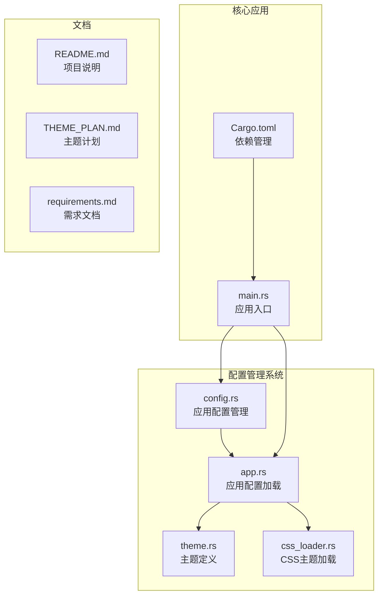
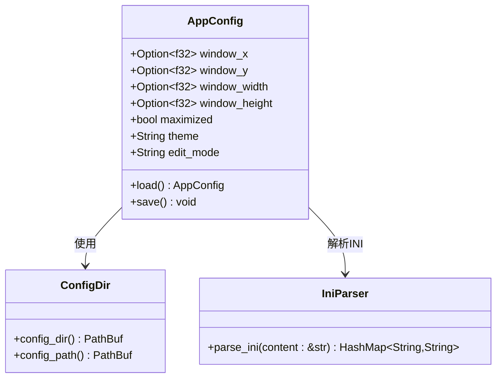
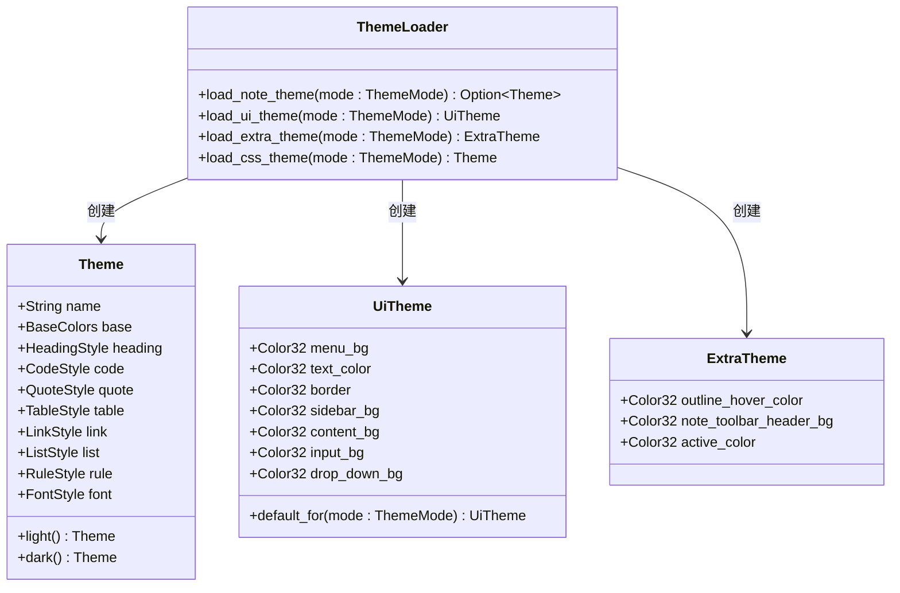
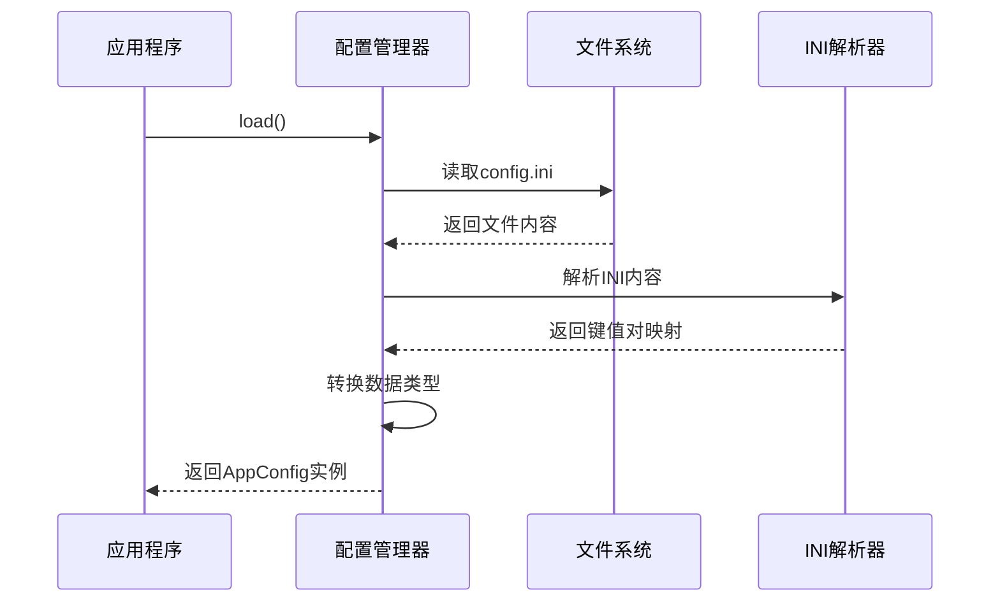
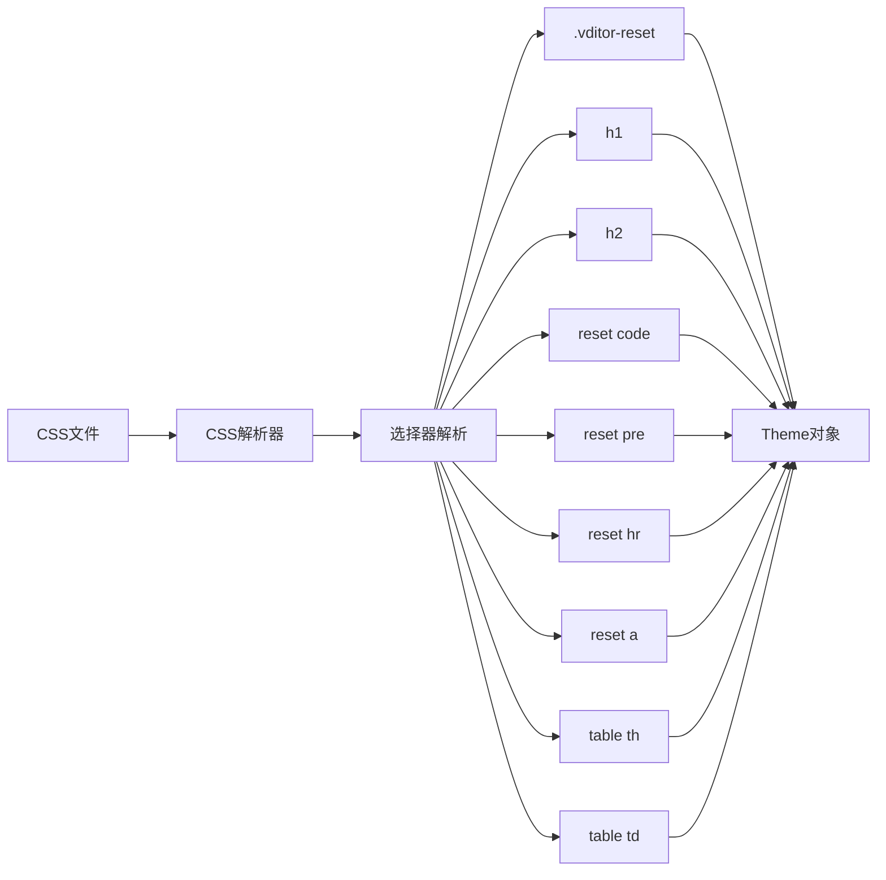
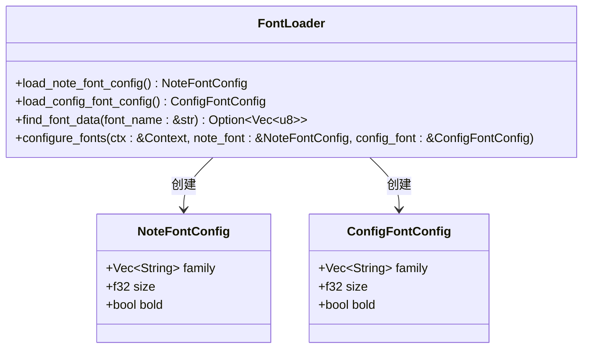
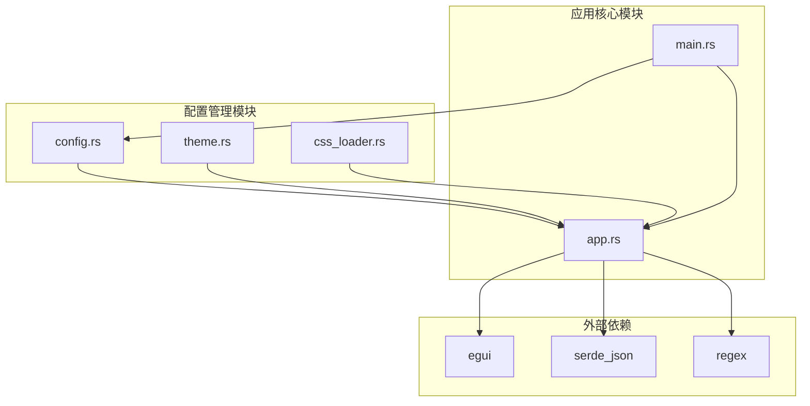

# 配置管理系统

<cite>
**本文档引用的文件**
- [config.rs](file://src/config.rs)
- [app.rs](file://src/app.rs)
- [main.rs](file://src/main.rs)
- [theme.rs](file://src/theme.rs)
- [css_loader.rs](file://src/css_loader.rs)
- [Cargo.toml](file://Cargo.toml)
- [README.md](file://README.md)
- [THEME_PLAN.md](file://THEME_PLAN.md)
- [requirements.md](file://docs/requirements.md)
</cite>

## 目录
1. [简介](#简介)
2. [项目结构](#项目结构)
3. [核心组件](#核心组件)
4. [架构概览](#架构概览)
5. [详细组件分析](#详细组件分析)
6. [依赖关系分析](#依赖关系分析)
7. [性能考虑](#性能考虑)
8. [故障排除指南](#故障排除指南)
9. [结论](#结论)

## 简介

mdedit 是一款轻量级跨平台 Markdown 编辑器，采用 Typora 式所见即所得（WYSIWYG）编辑模式。该项目实现了完整的配置管理系统，包括应用配置、主题配置、字体配置等多个层面的配置管理。

该配置管理系统的核心目标是提供灵活的主题定制能力，支持从多种数据源加载配置，包括 INI 文件、JSON 配置文件和 CSS 主题文件，并且支持自动主题模式跟随系统设置。

## 项目结构

项目采用模块化的 Rust 代码组织方式，主要配置相关文件位于 `src/` 目录下：



**图表来源**
- [config.rs:1-91](file://src/config.rs#L1-L91)
- [app.rs:1-2019](file://src/app.rs#L1-L2019)
- [theme.rs:1-320](file://src/theme.rs#L1-L320)
- [css_loader.rs:1-342](file://src/css_loader.rs#L1-L342)

**章节来源**
- [config.rs:1-91](file://src/config.rs#L1-L91)
- [app.rs:1-2019](file://src/app.rs#L1-L2019)
- [main.rs:1-286](file://src/main.rs#L1-L286)

## 核心组件

### 应用配置管理器

应用配置管理器负责管理应用程序的基本设置，包括窗口位置、大小、主题模式等。



**图表来源**
- [config.rs:20-77](file://src/config.rs#L20-L77)
- [config.rs:4-18](file://src/config.rs#L4-L18)
- [config.rs:79-91](file://src/config.rs#L79-L91)

### 主题配置系统

主题配置系统支持多种主题数据源，包括 JSON 配置文件、CSS 主题文件和内置主题。



**图表来源**
- [theme.rs:3-81](file://src/theme.rs#L3-L81)
- [theme.rs:228-320](file://src/theme.rs#L228-L320)
- [app.rs:223-438](file://src/app.rs#L223-L438)

**章节来源**
- [config.rs:20-77](file://src/config.rs#L20-L77)
- [theme.rs:1-320](file://src/theme.rs#L1-L320)
- [app.rs:223-438](file://src/app.rs#L223-L438)

## 架构概览

配置管理系统采用分层架构设计，从底层的数据存储到高层的应用配置，形成了清晰的层次结构：

```mermaid
graph TB
subgraph "数据存储层"
IniFile[config.ini<br/>应用配置]
JsonFile[preferences.json<br/>主题配置]
CssFile[light.css/dark.css<br/>CSS主题]
end
subgraph "配置解析层"
IniParser[INI解析器]
JsonParser[JSON解析器]
CssParser[CSS解析器]
end
subgraph "主题管理层"
ThemeManager[主题管理器]
FontManager[字体管理器]
ColorManager[颜色管理器]
end
subgraph "应用集成层"
App[应用实例]
Window[窗口配置]
Renderer[渲染器配置]
end
IniFile --> IniParser
JsonFile --> JsonParser
CssFile --> CssParser
IniParser --> ThemeManager
JsonParser --> ThemeManager
CssParser --> ThemeManager
ThemeManager --> FontManager
ThemeManager --> ColorManager
FontManager --> App
ColorManager --> App
ThemeManager --> App
App --> Window
App --> Renderer
```



**图表来源**
- [config.rs:32-76](file://src/config.rs#L32-L76)
- [app.rs:121-387](file://src/app.rs#L121-L387)
- [css_loader.rs:7-12](file://src/css_loader.rs#L7-L12)

## 详细组件分析

### 应用配置组件

应用配置组件负责管理应用程序的基本设置，包括窗口位置、大小、主题模式等。

#### 配置文件结构

配置文件采用 INI 格式，支持以下配置项：

| 配置项 | 类型 | 描述 | 默认值 |
|--------|------|------|--------|
| window_x | f32 | 窗口X坐标 | None |
| window_y | f32 | 窗口Y坐标 | None |
| window_width | f32 | 窗口宽度 | None |
| window_height | f32 | 窗口高度 | None |
| maximized | bool | 是否最大化 | false |
| theme | String | 主题模式 | "" |
| edit_mode | String | 编辑模式 | "" |

#### 配置加载流程



**图表来源**
- [config.rs:32-48](file://src/config.rs#L32-L48)
- [config.rs:79-91](file://src/config.rs#L79-L91)

#### 配置保存流程

```mermaid
flowchart TD
Start([开始保存]) --> CheckDir[检查配置目录]
CheckDir --> CreateDir[创建目录(如果不存在)]
CreateDir --> BuildLines[构建配置行]
BuildLines --> HasWindowX{是否有窗口X坐标?}
HasWindowX --> |是| AddWindowX[添加window_x行]
HasWindowX --> |否| HasWindowY{是否有窗口Y坐标?}
AddWindowX --> HasWindowY
HasWindowY --> |是| AddWindowY[添加window_y行]
HasWindowY --> |否| HasWidth{是否有窗口宽度?}
AddWindowY --> HasWidth
HasWidth --> |是| AddWidth[添加window_width行]
HasWidth --> |否| HasHeight{是否有窗口高度?}
AddWidth --> HasHeight
HasHeight --> |是| AddHeight[添加window_height行]
HasHeight --> |否| AddMaximized[添加maximized行]
AddHeight --> AddMaximized
AddMaximized --> HasTheme{是否有主题?}
HasTheme --> |是| AddTheme[添加theme行]
HasTheme --> |否| HasEditMode{是否有编辑模式?}
AddTheme --> HasEditMode
HasEditMode --> |是| AddEditMode[添加edit_mode行]
HasEditMode --> |否| WriteFile[写入文件]
AddEditMode --> WriteFile
WriteFile --> End([保存完成])
```

**图表来源**
- [config.rs:50-76](file://src/config.rs#L50-L76)

**章节来源**
- [config.rs:20-77](file://src/config.rs#L20-L77)

### 主题配置组件

主题配置组件支持从多种数据源加载主题配置，包括 JSON 文件、CSS 文件和内置主题。

#### 主题数据源优先级

主题配置遵循以下优先级顺序：

1. **首选：JSON 配置文件** (`preferences.json`)
2. **次选：CSS 主题文件** (`light.css` / `dark.css`)
3. **后备：内置主题** (Theme::light() / Theme::dark())

#### JSON 主题配置

JSON 主题配置支持以下键名：

| JSON 键名 | 对应 Theme 字段 | 描述 |
|-----------|----------------|------|
| noteThemeLight | 整体主题 | 亮色主题配置 |
| noteThemeDark | 整体主题 | 暗色主题配置 |
| themeLight | UiTheme | 亮色UI主题 |
| themeDark | UiTheme | 暗色UI主题 |
| noteH1Color | heading.colors[0] | H1标题颜色 |
| noteH2Color | heading.colors[1] | H2标题颜色 |
| noteCodeBackgroundColor | code.block_bg | 代码块背景色 |
| noteCodeBorderColor | code.block_border_color | 代码块边框色 |
| noteLinkColor | link.color | 链接颜色 |
| noteQuoteBorderColor | quote.bar_color | 引用块边框色 |
| noteTableHeaderBgColor | table.header_bg | 表头背景色 |

#### CSS 主题配置

CSS 主题配置通过解析 CSS 文件中的特定选择器来构建主题：



**图表来源**
- [css_loader.rs:52-70](file://src/css_loader.rs#L52-L70)
- [css_loader.rs:237-342](file://src/css_loader.rs#L237-L342)

**章节来源**
- [app.rs:223-438](file://src/app.rs#L223-L438)
- [css_loader.rs:1-342](file://src/css_loader.rs#L1-L342)

### 字体配置组件

字体配置组件负责管理编辑区和 UI 区域的字体设置。

#### 字体配置数据源

字体配置从 `preferences.json` 文件中读取：



**图表来源**
- [app.rs:53-63](file://src/app.rs#L53-L63)
- [app.rs:121-189](file://src/app.rs#L121-L189)
- [app.rs:676-748](file://src/app.rs#L676-L748)

#### 字体加载机制

字体加载具有以下特性：

1. **优先级加载**：首先尝试从系统字体目录加载指定字体
2. **回退机制**：如果指定字体不可用，使用系统默认 CJK 字体
3. **多平台支持**：支持 Windows、macOS 和 Linux 平台
4. **字体映射**：提供常见中文字体的名称映射

**章节来源**
- [app.rs:121-189](file://src/app.rs#L121-L189)
- [app.rs:676-748](file://src/app.rs#L676-L748)

### 颜色配置组件

颜色配置组件负责管理各种 UI 元素的颜色设置。

#### 颜色解析支持

系统支持多种颜色格式的解析：

| 颜色格式 | 示例 | 支持情况 |
|----------|------|----------|
| #RGB | #007ACC | ✅ 支持 |
| #RRGGBB | #007ACC | ✅ 支持 |
| #RRGGBBAA | #6680990D | ✅ 支持 |
| rgb(r,g,b) | rgb(0,122,204) | ✅ 支持 |
| rgba(r,g,b,a) | rgba(0,122,204,0.4) | ✅ 支持 |

#### 颜色配置映射

颜色配置从 JSON 文件映射到主题结构：

```mermaid
graph TD
JSON[JSON颜色值] --> Parser[颜色解析器]
Parser --> Hex3[#RGB格式]
Parser --> Hex6[#RRGGBB格式]
Parser --> Hex8[#RRGGBBAA格式]
Parser --> RGB[rgb()格式]
Parser --> RGBA[rgba()格式]
Hex3 --> Color32[Color32转换]
Hex6 --> Color32
Hex8 --> Color32
RGB --> Color32
RGBA --> Color32
Color32 --> Theme[Theme对象]
Color32 --> UiTheme[UiTheme对象]
Color32 --> ExtraTheme[ExtraTheme对象]
```

**图表来源**
- [app.rs:191-215](file://src/app.rs#L191-L215)
- [css_loader.rs:155-194](file://src/css_loader.rs#L155-L194)

**章节来源**
- [app.rs:191-215](file://src/app.rs#L191-L215)
- [css_loader.rs:155-194](file://src/css_loader.rs#L155-L194)

## 依赖关系分析

配置管理系统与其他模块存在紧密的依赖关系：



**图表来源**
- [Cargo.toml:8-15](file://Cargo.toml#L8-L15)
- [app.rs:1-28](file://src/app.rs#L1-L28)
- [main.rs:16-20](file://src/main.rs#L16-L20)

### 外部依赖分析

项目的主要依赖包括：

| 依赖包 | 版本 | 用途 |
|--------|------|------|
| eframe | 0.29 | GUI框架 |
| egui | 0.29 | UI引擎 |
| pulldown-cmark | 0.12 | Markdown解析 |
| syntect | 5.2 | 语法高亮 |
| rfd | 0.15 | 文件对话框 |
| serde_json | 1 | JSON处理 |
| regex | 1 | 正则表达式 |

**章节来源**
- [Cargo.toml:8-15](file://Cargo.toml#L8-L15)

## 性能考虑

配置管理系统在设计时充分考虑了性能因素：

### 配置加载优化

1. **懒加载策略**：配置文件仅在需要时才进行加载
2. **缓存机制**：已解析的配置会缓存到内存中
3. **增量更新**：支持部分配置的增量更新

### 内存使用优化

1. **零拷贝解析**：INI文件解析使用零拷贝技术
2. **字符串池化**：重复的字符串共享内存空间
3. **按需分配**：仅在需要时分配额外的内存空间

### I/O性能优化

1. **异步文件操作**：文件读写操作异步执行
2. **批量写入**：配置保存时进行批量写入操作
3. **错误恢复**：文件操作失败时提供优雅的错误恢复机制

## 故障排除指南

### 常见配置问题

#### 配置文件无法读取

**症状**：应用程序无法加载配置文件，使用默认设置

**解决方案**：
1. 检查配置文件是否存在：`%APPDATA%\mdedit\config.ini`
2. 验证文件权限是否正确
3. 确认文件格式是否为有效的 INI 格式

#### 主题配置加载失败

**症状**：主题配置无法正确加载，使用默认主题

**解决方案**：
1. 检查 `preferences.json` 文件格式是否正确
2. 验证 JSON 键名是否符合预期格式
3. 确认 CSS 主题文件是否存在且格式正确

#### 字体加载问题

**症状**：指定字体无法加载，使用默认字体

**解决方案**：
1. 检查字体文件是否存在于系统字体目录
2. 验证字体名称是否正确
3. 确认字体文件权限是否正确

### 调试工具

系统提供了多种调试工具来帮助诊断配置问题：

1. **启动日志**：记录应用程序启动过程中的配置加载信息
2. **主题调试**：通过命令行参数调试主题配置
3. **配置重置**：支持重置配置到默认状态

**章节来源**
- [main.rs:25-34](file://src/main.rs#L25-L34)
- [main.rs:193-205](file://src/main.rs#L193-L205)

## 结论

mdedit 的配置管理系统展现了现代应用程序配置管理的最佳实践。系统通过分层架构设计，实现了配置数据的灵活管理和高效加载。

### 主要优势

1. **多数据源支持**：支持 INI、JSON、CSS 多种配置格式
2. **优先级机制**：清晰的配置加载优先级确保配置的灵活性
3. **类型安全**：使用 Rust 的类型系统确保配置的类型安全
4. **性能优化**：通过缓存和懒加载机制优化性能
5. **可扩展性**：模块化设计便于功能扩展和维护

### 技术亮点

1. **主题系统完整性**：实现了完整的主题配置体系，支持多种主题数据源
2. **跨平台兼容性**：支持 Windows、macOS、Linux 多平台配置
3. **实时配置更新**：支持配置的动态更新和热重载
4. **错误处理机制**：完善的错误处理和回退机制

该配置管理系统为 mdedit 提供了坚实的基础，使其能够为用户提供灵活、稳定、高性能的配置体验。通过持续的优化和扩展，该系统将继续支持更多的配置需求和使用场景。