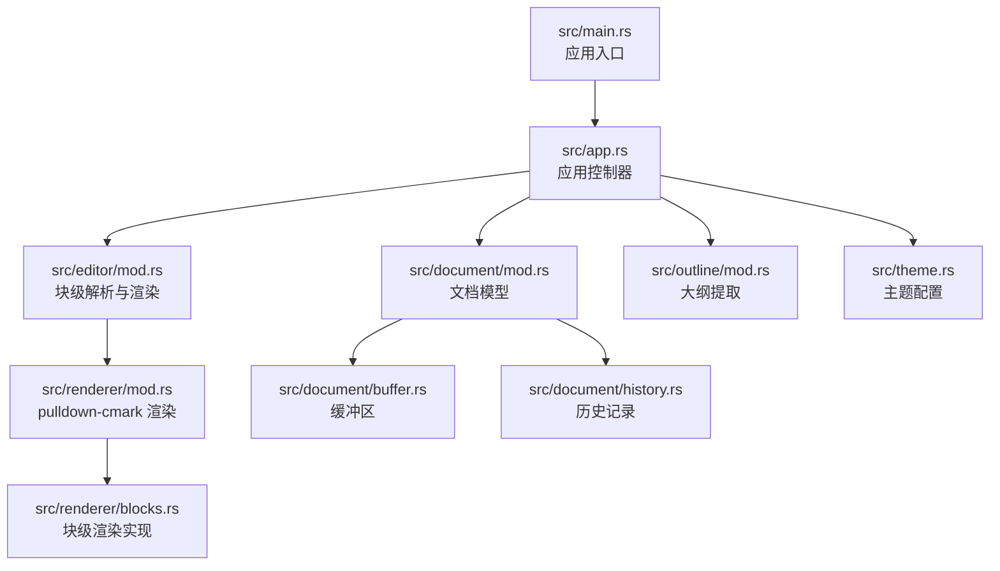
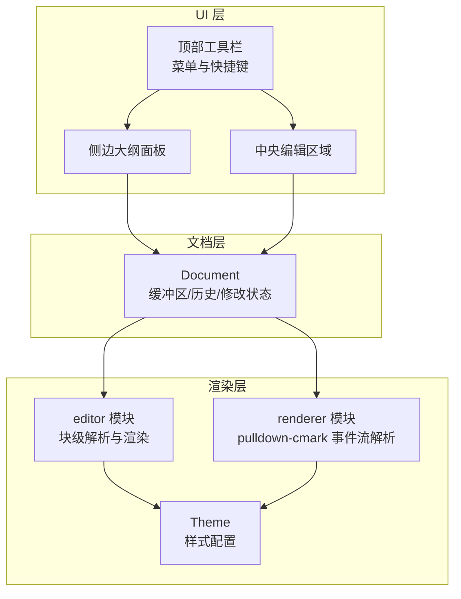
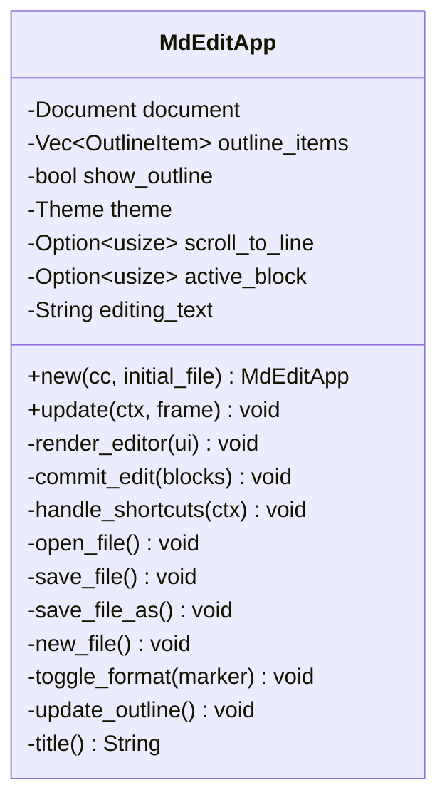
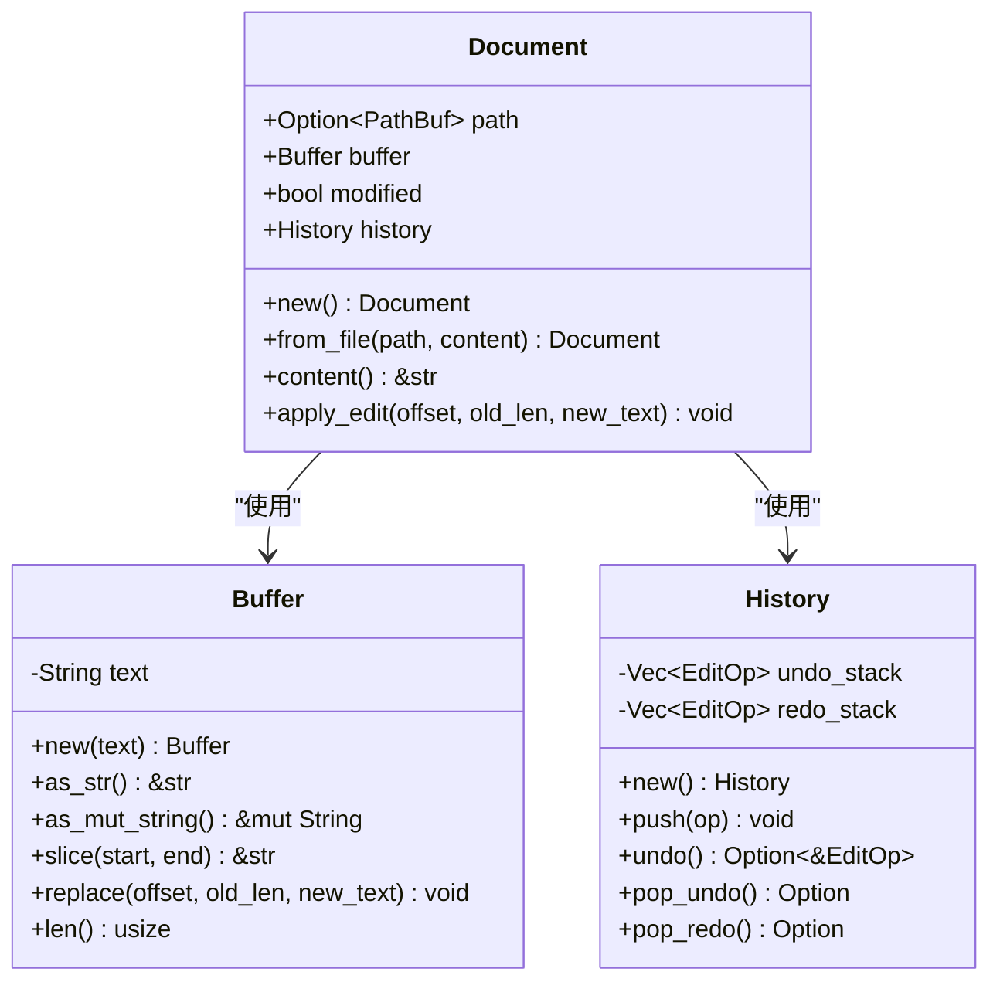
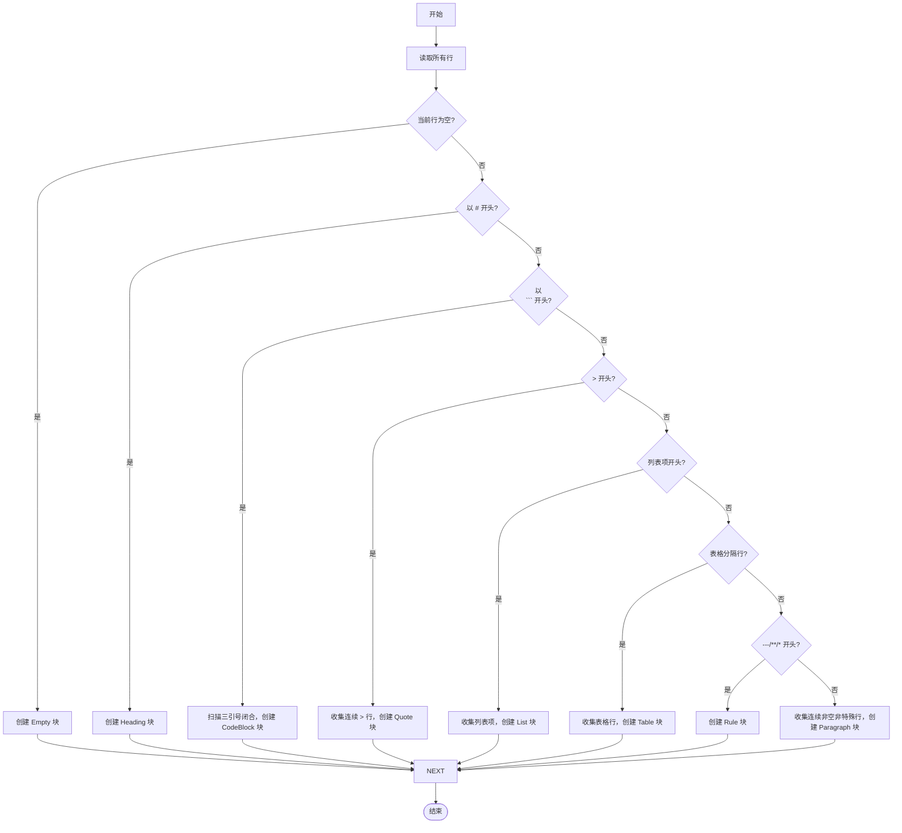
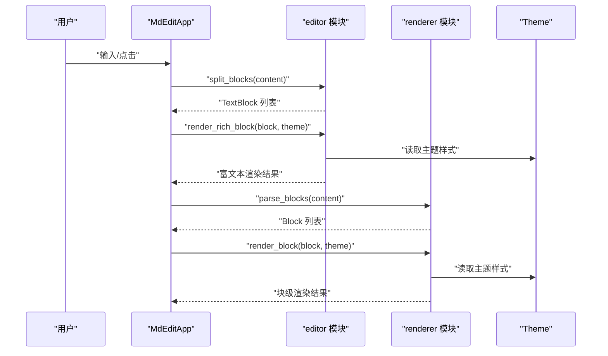
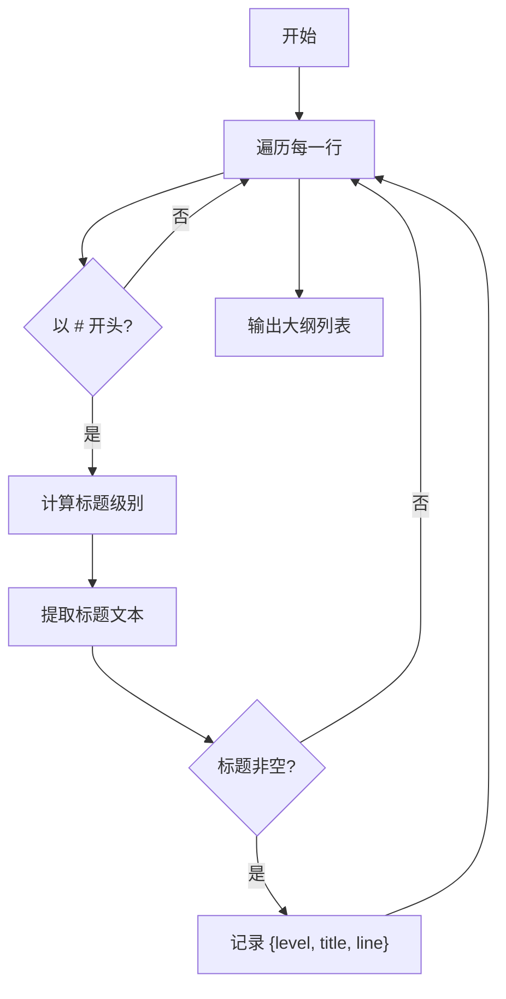
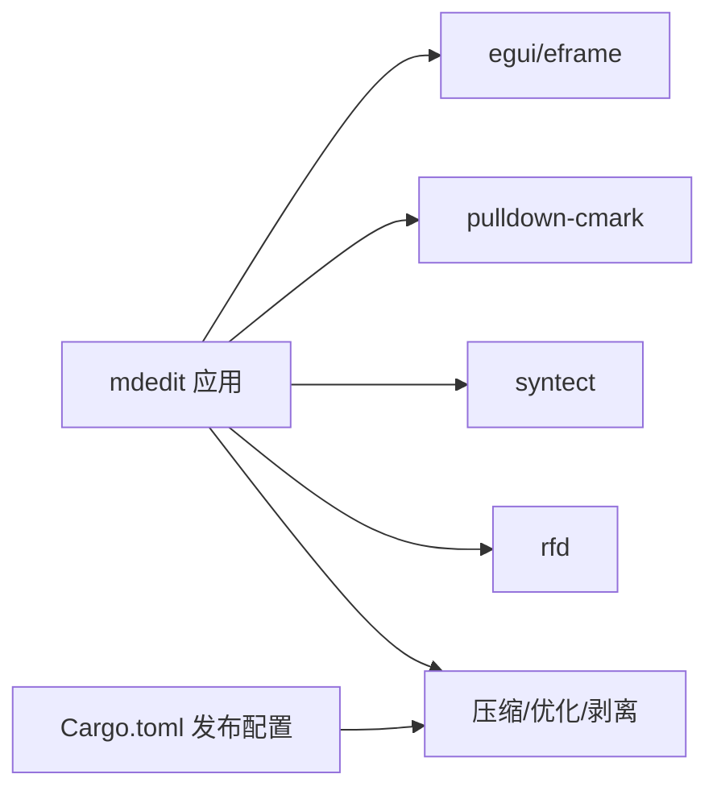

# 项目概述

<cite>
**本文档引用的文件**
- [README.md](file://README.md)
- [Cargo.toml](file://Cargo.toml)
- [src/main.rs](file://src/main.rs)
- [src/app.rs](file://src/app.rs)
- [src/editor/mod.rs](file://src/editor/mod.rs)
- [src/renderer/mod.rs](file://src/renderer/mod.rs)
- [src/renderer/blocks.rs](file://src/renderer/blocks.rs)
- [src/document/mod.rs](file://src/document/mod.rs)
- [src/document/buffer.rs](file://src/document/buffer.rs)
- [src/document/history.rs](file://src/document/history.rs)
- [src/outline/mod.rs](file://src/outline/mod.rs)
- [src/theme.rs](file://src/theme.rs)
</cite>

## 目录
1. [引言](#引言)
2. [项目结构](#项目结构)
3. [核心组件](#核心组件)
4. [架构总览](#架构总览)
5. [详细组件分析](#详细组件分析)
6. [依赖关系分析](#依赖关系分析)
7. [性能考量](#性能考量)
8. [故障排除指南](#故障排除指南)
9. [结论](#结论)
10. [附录](#附录)

## 引言
mdedit 是一个轻量级跨平台 Markdown 编辑器，采用“所见即所得”（WYSIWYG）的 Typora 式编辑体验，但不依赖 WebView2 技术。它通过原生 UI 框架与本地解析器实现极简、快速且可移植的编辑器。项目强调以下核心价值：
- 无 WebView2 的纯原生渲染：避免浏览器内核带来的体积与启动延迟负担
- 实时大纲导航：基于标题层级的动态大纲面板，支持点击跳转到对应段落
- 超小体积与快速冷启动：单文件发布体积小于 4MB，冷启动时间低于 200ms
- 跨平台支持：在 Windows、macOS 和 Linux 上保持一致的界面与行为

目标用户包括：
- 追求简洁与高效的写作者与学生
- 对启动速度与资源占用敏感的开发者与技术用户
- 希望获得 Typora 式体验但不希望引入重型浏览器内核的用户

## 项目结构
项目采用按领域划分的模块化组织方式，核心目录与职责如下：
- src/main.rs：应用入口，负责解析命令行参数、初始化窗口尺寸与运行 eframe 应用
- src/app.rs：应用主控制器，管理文档、大纲、主题、快捷键与 UI 布局
- src/document/：文档模型与历史记录，封装缓冲区与编辑操作
- src/editor/：块级 Markdown 解析与渲染逻辑，将文本拆分为块并渲染为富文本
- src/renderer/：基于 pulldown-cmark 的块级渲染管线，补充块级渲染工具
- src/outline/：从文档内容提取标题大纲
- src/theme.rs：主题样式配置（标题字号、颜色等）
- README.md/Cargo.toml：项目说明与依赖声明

图表来源
- [src/main.rs:35-49](file://src/main.rs#L35-L49)
- [src/app.rs:9-43](file://src/app.rs#L9-L43)
- [src/document/mod.rs:9-14](file://src/document/mod.rs#L9-L14)
- [src/editor/mod.rs:24-149](file://src/editor/mod.rs#L24-L149)
- [src/renderer/mod.rs:19-142](file://src/renderer/mod.rs#L19-L142)
- [src/renderer/blocks.rs:5-63](file://src/renderer/blocks.rs#L5-L63)
- [src/document/buffer.rs:1-29](file://src/document/buffer.rs#L1-L29)
- [src/document/history.rs:1-58](file://src/document/history.rs#L1-L58)
- [src/outline/mod.rs:7-26](file://src/outline/mod.rs#L7-L26)
- [src/theme.rs:3-21](file://src/theme.rs#L3-L21)

章节来源
- [src/main.rs:1-50](file://src/main.rs#L1-L50)
- [src/app.rs:1-351](file://src/app.rs#L1-L351)
- [src/document/mod.rs:1-51](file://src/document/mod.rs#L1-L51)
- [src/editor/mod.rs:1-349](file://src/editor/mod.rs#L1-L349)
- [src/renderer/mod.rs:1-143](file://src/renderer/mod.rs#L1-L143)
- [src/renderer/blocks.rs:1-68](file://src/renderer/blocks.rs#L1-L68)
- [src/document/buffer.rs:1-30](file://src/document/buffer.rs#L1-L30)
- [src/document/history.rs:1-59](file://src/document/history.rs#L1-L59)
- [src/outline/mod.rs:1-27](file://src/outline/mod.rs#L1-L27)
- [src/theme.rs:1-22](file://src/theme.rs#L1-L22)

## 核心组件
- 应用控制器（MdEditApp）
  - 负责菜单栏、工具栏、侧边大纲面板与中央编辑区域的布局
  - 维护文档状态、主题、活动块与滚动定位
  - 提供快捷键处理与文件操作（新建、打开、保存）
- 文档模型（Document）
  - 封装路径、缓冲区、修改状态与历史记录
  - 提供内容读取与编辑操作（apply_edit），并维护历史栈
- 编辑器（editor）
  - 将 Markdown 文本拆分为块（标题、段落、代码块、引用、列表、表格、分割线、空行）
  - 渲染富文本块，并支持点击进入编辑态
- 渲染器（renderer）
  - 使用 pulldown-cmark 解析 Markdown 事件流，生成块级结构
  - 提供块级渲染函数（标题、段落、代码块、引用、列表、规则）
- 大纲（outline）
  - 从文档内容中提取标题层级与行号，构建可点击导航项
- 主题（theme）
  - 定义标题字号、代码背景色、引用条颜色、文本与弱化色等

章节来源
- [src/app.rs:9-185](file://src/app.rs#L9-L185)
- [src/document/mod.rs:9-50](file://src/document/mod.rs#L9-L50)
- [src/editor/mod.rs:4-149](file://src/editor/mod.rs#L4-L149)
- [src/renderer/mod.rs:9-142](file://src/renderer/mod.rs#L9-L142)
- [src/outline/mod.rs:1-26](file://src/outline/mod.rs#L1-L26)
- [src/theme.rs:3-21](file://src/theme.rs#L3-L21)

## 架构总览
mdedit 的整体架构围绕“原生 UI + 本地解析”的设计展开：
- UI 层：基于 eframe/egui 构建，使用顶部工具栏、侧边大纲面板与中央编辑区域
- 文档层：以缓冲区为核心，配合历史记录实现编辑与撤销/重做
- 渲染层：编辑态使用 egui 的文本编辑控件；预览态使用自定义块级渲染与内联格式化
- 解析层：编辑器模块负责块级解析；渲染器模块负责 pulldown-cmark 的事件流解析

图表来源
- [src/app.rs:187-249](file://src/app.rs#L187-L249)
- [src/document/mod.rs:16-50](file://src/document/mod.rs#L16-L50)
- [src/editor/mod.rs:24-349](file://src/editor/mod.rs#L24-L349)
- [src/renderer/mod.rs:19-142](file://src/renderer/mod.rs#L19-L142)
- [src/theme.rs:11-21](file://src/theme.rs#L11-L21)

## 详细组件分析

### 应用控制器（MdEditApp）
- 职责
  - 初始化字体、主题与大纲
  - 处理快捷键（新建、打开、保存、加粗、斜体等）
  - 维护活动块与滚动定位，实现点击进入编辑态
  - 更新窗口标题与菜单状态
- 关键流程
  - 启动时根据命令行参数决定是否加载初始文件
  - 在 update 中绘制 UI 并处理交互
  - 编辑提交时更新文档缓冲区与历史记录

图表来源
- [src/app.rs:9-43](file://src/app.rs#L9-L43)
- [src/app.rs:187-350](file://src/app.rs#L187-L350)

章节来源
- [src/app.rs:19-350](file://src/app.rs#L19-L350)

### 文档模型（Document）
- 职责
  - 管理文档路径、缓冲区与修改状态
  - 提供 apply_edit 接口，记录编辑操作并入栈历史
- 数据结构
  - Buffer：字符串缓冲区，支持切片与替换
  - History：双栈（undo/redo）实现撤销/重做

图表来源
- [src/document/mod.rs:9-50](file://src/document/mod.rs#L9-L50)
- [src/document/buffer.rs:1-29](file://src/document/buffer.rs#L1-L29)
- [src/document/history.rs:1-58](file://src/document/history.rs#L1-L58)

章节来源
- [src/document/mod.rs:16-50](file://src/document/mod.rs#L16-L50)
- [src/document/buffer.rs:5-29](file://src/document/buffer.rs#L5-L29)
- [src/document/history.rs:12-58](file://src/document/history.rs#L12-L58)

### 编辑器（editor 模块）
- 职责
  - 将 Markdown 文本拆分为若干块（TextBlock），标注起止行与类型
  - 渲染富文本块（标题、段落、代码块、引用、列表、表格、规则、空行）
  - 支持内联格式（加粗、斜体、行内代码）的简单解析与渲染
- 关键算法
  - 块级解析：逐行扫描，识别标题、代码块、引用、列表、表格、规则与空行
  - 表格解析：通过表头分隔行判断列数并渲染网格

图表来源
- [src/editor/mod.rs:24-149](file://src/editor/mod.rs#L24-L149)

章节来源
- [src/editor/mod.rs:4-349](file://src/editor/mod.rs#L4-L349)

### 渲染器（renderer 模块）
- 职责
  - 使用 pulldown-cmark 解析 Markdown，产出块级结构（Heading、Paragraph、CodeBlock、Quote、List、Rule）
  - 提供块级渲染函数，结合主题进行视觉呈现
- 与编辑器的关系
  - editor 更偏向“所见即所得”的编辑态渲染与交互
  - renderer 更偏向“解析-渲染”的通用块级渲染管线

图表来源
- [src/app.rs:251-328](file://src/app.rs#L251-L328)
- [src/editor/mod.rs:159-266](file://src/editor/mod.rs#L159-L266)
- [src/renderer/mod.rs:19-142](file://src/renderer/mod.rs#L19-L142)
- [src/renderer/blocks.rs:5-63](file://src/renderer/blocks.rs#L5-L63)
- [src/theme.rs:11-21](file://src/theme.rs#L11-L21)

章节来源
- [src/renderer/mod.rs:9-142](file://src/renderer/mod.rs#L9-L142)
- [src/renderer/blocks.rs:5-63](file://src/renderer/blocks.rs#L5-L63)

### 大纲（outline 模块）
- 职责
  - 从文档内容中提取标题层级与行号，生成可点击的导航项
- 交互
  - 点击大纲项触发滚动到对应行

图表来源
- [src/outline/mod.rs:7-26](file://src/outline/mod.rs#L7-L26)

章节来源
- [src/outline/mod.rs:1-27](file://src/outline/mod.rs#L1-L27)

### 主题（theme 模块）
- 职责
  - 定义标题字号数组、代码背景色、引用条颜色、文本与弱化色
- 作用
  - 为编辑器与渲染器提供统一的视觉风格

章节来源
- [src/theme.rs:3-21](file://src/theme.rs#L3-L21)

## 依赖关系分析
- 技术栈
  - eframe/egui：原生 UI 框架，提供窗口、绘图与输入处理
  - pulldown-cmark：Markdown 解析器，支持表格、删除线等扩展
  - syntect：语法高亮（可选特性，默认关闭默认特性）
  - rfd：跨平台文件对话框
- 优化策略
  - 发布配置启用压缩、链接时优化与符号剥离，以减小体积与提升启动速度

图表来源
- [Cargo.toml:8-19](file://Cargo.toml#L8-L19)
- [src/main.rs:10-13](file://src/main.rs#L10-L13)

章节来源
- [Cargo.toml:1-19](file://Cargo.toml#L1-19)
- [src/main.rs:10-13](file://src/main.rs#L10-L13)

## 性能考量
- 启动性能
  - 通过 eframe 的轻量窗口框架与最小化依赖，实现快速冷启动
  - 发布配置启用压缩与链接时优化，减少二进制体积与加载时间
- 渲染性能
  - 编辑态使用 egui 的高效文本控件
  - 预览态按块渲染，避免整页重排
- 内存占用
  - Buffer 作为单一字符串存储，减少额外拷贝
  - 历史栈仅记录编辑操作，便于撤销/重做且内存可控

## 故障排除指南
- 无法打开文件
  - 现象：命令行指定文件路径后无法打开
  - 处理：程序会弹出错误对话框提示失败原因，检查文件是否存在与权限
- 字体显示异常
  - 现象：中文或特定系统字体未正确显示
  - 处理：应用会在启动时尝试加载系统字体，若失败则回退至默认字体；可在字体配置处调整
- 保存失败
  - 现象：保存或另存为时无响应
  - 处理：确认目标路径可写，必要时更换保存位置

章节来源
- [src/main.rs:15-33](file://src/main.rs#L15-L33)
- [src/app.rs:45-84](file://src/app.rs#L45-L84)
- [src/app.rs:133-163](file://src/app.rs#L133-L163)

## 结论
mdedit 通过 eframe/egui 的原生 UI 与 pulldown-cmark 的本地解析，实现了 Typora 式的所见即所得编辑体验，同时满足超小体积与快速启动的要求。其模块化设计使编辑态与渲染态职责清晰，易于扩展与维护。对于初学者，mdedit 提供了直观的界面与简洁的功能；对于有经验的开发者，其清晰的架构与优化策略提供了良好的二次开发基础。

## 附录
- 系统要求
  - Rust 1.70+
  - Windows (GNU) 需要 MSYS2 MinGW64 工具链
- 快捷键
  - Ctrl+N：新建文档
  - Ctrl+O：打开文件
  - Ctrl+S：保存文件
  - Ctrl+Shift+S：另存为
  - Ctrl+B：加粗
  - Ctrl+I：斜体

章节来源
- [README.md:15-47](file://README.md#L15-L47)
- [src/app.rs:90-114](file://src/app.rs#L90-L114)